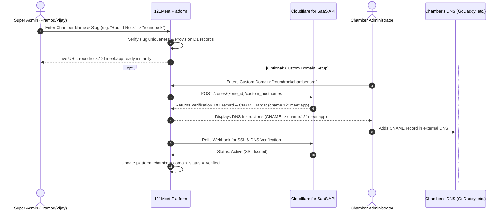

# 121Meet Chamber — Domain Routing, Multi-Tenant Setup & Cloudflare Architecture

> **Context:** Yeh document Part 6 Architecture Discussion (Vijay Kumar Tiwari & Pramod Kaushik) ke anusaar banaya gaya hai. Isme explain kiya gaya hai ki meeting ke discussion points hamare codebase mein kaise implement hain aur bache hue points (Cloudflare Custom Hostnames & Drip Email) ko setup karne ka exact workflow kya hai.

---

## 1. Meeting Discussion vs Current System Matrix

| Discussion Point (Transcript) | Key Quote / Decision | Implementation Status | Codebase References |
| :--- | :--- | :---: | :--- |
| **1. Multi-Tenant Chamber Setup** | *"jo bhi chamber add hoga uska poora system setup hoga... separate database wagera sab ho"* | ✅ **Implemented** | D1 SQLite single-DB with strict Row-Level Isolation via `chamber_id` FK to `platform_chambers`. Multi-tenant middleware context (`c.get('chamberId')`). |
| **2. Unique Slug per Chamber** | *"har kisi ka unique slug usme bhi use hoga ki nahi? ... same slug rakh lena"* | ✅ **Implemented** | `platform_chambers.subdomain` (UNIQUE). Super Admin creation rejects duplicates with HTTP 409 Conflict. |
| **3. Tenant Subdomain Format** | *"Jo user access karega usko aisa karte hain hum, slug.121meet.app banana, theek hai? Easy rahega: slug.121meet.app."* | ✅ **Implemented / Aligned** | Subdomain format: `https://<slug>.121meet.app`.<br>Backend: `tenant-resolver.ts`<br>Frontend: `App.tsx`, `AddChamberModal.tsx`, `ChamberDetailModal.tsx`. |
| **4. Cloudflare CNAME Setup for Custom Domains** | *"Cloudflare use karenge, theek hai? API ke through usko kar dena. Agar woh hamare end pe domain setup nahi karta hai, toh usko bolna ki CNAME add kar de domain mein."* | 🟡 **Schema & UI Ready, Cloudflare API Pending** | DB: `platform_chambers.custom_domain`, `domain_status` (`none`, `pending_dns`, `verified`).<br>Frontend: Domain settings tab & status badge.<br>Pending: Cloudflare for SaaS (Custom Hostnames) API integration. |
| **5. Super Admin Single-Click / Bulk Add + Drip Mail** | *"option aise rakhna ki jitne bhi chamber hain, super admin mein main ek hi baari mein add kar doonga. Jaise prospects ko hum drip mail karte hain, waise hi sabhi chambers ko mail jaayega ki join karo."* | ⏳ **Roadmap (Super Admin Expansion)** | Individual chamber provisioning modal ready hai (`AddChamberModal.tsx`). Bulk CSV import + automated onboarding drip campaign workflow abhi wire up karna hai. |

---

## 2. Already Implemented Architecture (Kya-Kya Chal Raha Hai)

### A. Subdomain & Tenant Routing Engine

```mermaid
graph TD
    User([User Request]) --> DNS[DNS: *.121meet.app or custom domain]
    DNS --> Worker[Cloudflare Worker / Backend Hono]
    Worker --> Resolver[Tenant Resolver Middleware]
    Resolver --> CheckSub{Is Subdomain present?}
    CheckSub -- Yes: austin.121meet.app --> Query1[Query platform_chambers WHERE subdomain='austin']
    CheckSub -- No: austinchamber.org --> Query2[Query platform_chambers WHERE custom_domain='austinchamber.org']
    Query1 --> Context[Inject c.set('chamberId', chamber.id) & c.set('chamber', chamber)]
    Query2 --> Context
    Context --> App[App Feature Routes: Directory, Events, CRM, etc.]
```

1. **Backend Resolution (`backend/src/core/middleware/tenant-resolver.ts`):**
   - Incoming request ke `Host` header se subdomain strip hota hai.
   - Root platform domains (`121meet.ai`, `121meet.app`, `app.121meet.app`, `superadmin.121meet.app`) platform scope mark hote hain.
   - `austin.121meet.app` aane par `subdomain = 'austin'` filter hoke single DB query se tenant attach ho jata hai:
     ```sql
     SELECT id, name, subdomain, custom_domain, status 
     FROM platform_chambers 
     WHERE (subdomain = ? OR id = ?) AND status != 'suspended' 
     LIMIT 1;
     ```

2. **Frontend Subdomain Detection (`frontend/src/App.tsx`):**
   - Window location se active host evaluate hota hai. Agar user `austin.121meet.app` par hai, toh frontend automatically `austin` chamber context load karta hai aur branding (logo, colors, chamber name) inject karta hai.

3. **Chamber Provisioning Flow (`backend/src/modules/super-admin/services/super-chambers.service.ts`):**
   - Super Admin jab form submit karta hai:
     - Uniqueness validate hoti hai (`findBySubdomain`).
     - IDs automatically standard format mein generate hoti hain:
       - Chamber ID: `CHAM_<slug>` (e.g. `CHAM_AUSTIN`)
       - Admin User: `USR_AUSTIN_20261009_XXXX`
       - Admin Profile: `ADMP_AUSTIN_20261009_XXXX`
     - Status `pending_setup` par initialize hota hai aur admin ko onboarding wizard provide hota hai.

---

## 3. End-to-End Workflow: New Chamber Setup & Cloudflare Domain Routing

Meeting ke discussion ke anusaar pure lifecycle ka step-by-step technical execution plan:



### Step 1: Subdomain Provisioning (Immediate & Automatic)
- **Input:** Chamber Name, City, Subdomain Slug (e.g., `austin`), Admin Name & Email.
- **Result:** Chamber instantly live at `https://austin.121meet.app`.
- **Wildcard DNS:** Cloudflare root zone `*.121meet.app` has a single `CNAME` pointing to the Cloudflare Worker/Pages deployment. Koi manual DNS update nahi chahiye har naye chamber ke liye.

### Step 2: Custom Domain Setup (Via Cloudflare for SaaS API)
Jab chamber chahta hai ki unki site unke apne domain (jaise `austinchamber.org`) par chale:

1. **Chamber Admin Dashboard:** Admin goes to **Settings → Domain**.
2. **Domain Entry:** Admin enters `austinchamber.org`.
3. **Backend API Trigger:**
   Backend executes Cloudflare Custom Hostname API call:
   ```bash
   POST https://api.cloudflare.com/client/v4/zones/{ZONE_ID}/custom_hostnames
   Headers:
     Authorization: Bearer {CLOUDFLARE_API_TOKEN}
     Content-Type: application/json
   Body:
     {
       "hostname": "austinchamber.org",
       "ssl": {
         "method": "http",
         "type": "dv"
       }
     }
   ```
4. **DNS Guidance to Chamber Admin:**
   UI par instructions show hoti hain:
   | Type | Name | Target / Value |
   | :--- | :--- | :--- |
   | **CNAME** | `@` (or `www`) | `cname.121meet.app` |
   | **TXT** | `_cf-custom-hostname` | Cloudflare verification token |
5. **Automatic Verification:**
   Cloudflare SSL issue karta hai. Backend verification endpoint `GET /api/v1/admin/settings/domain/verify` par check karke `platform_chambers.domain_status = 'verified'` update kar deta hai.

---

## 4. Super Admin Bulk Chamber Addition & Drip Campaign Workflow

Meeting transcript ke 2nd key requirement:
> *"jitne bhi chamber hain, super admin mein main ek hi baari mein add kar doonga. Jaise prospects ko hum drip mail karte hain, waise hi sabhi chambers ko mail jaayega ki join karo."*

### Workflow Architecture:
1. **Bulk CSV Upload (`/api/v1/super/chambers/bulk-import`):**
   - CSV Format: `name,city,subdomain,admin_name,admin_email,admin_phone`
   - Validator:
     - Check duplicate slugs.
     - Validate email syntax.
     - Batch insert in single transaction into `platform_chambers` with `status = 'pending_setup'`.
2. **Drip Email Automation Engine:**
   - D1 Table `email_campaigns` / `automation_workflows` (Module 20 & Module 9):
     - **Email 1 (Day 0 - Instant):** Welcome & Invitation Link with magic token: `https://<slug>.121meet.app/onboarding?token=...`
     - **Email 2 (Day 3 - Follow up):** Reminder if `onboarded = 0` (features demo & quick-start guide).
     - **Email 3 (Day 7 - Final push):** Live link & support contact.

---

## 5. Summary & Action Plan

| Component | Immediate Next Steps |
| :--- | :--- |
| **Domain Strings** | Sabhi remaining UI & backend references ko `121meet.app` standard par consolidate karna. |
| **Cloudflare Secret Binding** | `wrangler.toml` / Cloudflare Secrets mein `CLOUDFLARE_API_TOKEN` & `CLOUDFLARE_ZONE_ID` add karna for Custom Hostnames. |
| **Bulk Import Endpoint** | Super Admin UI mein CSV Drag-and-Drop file uploader banana aur batch insertion service connect karna. |
