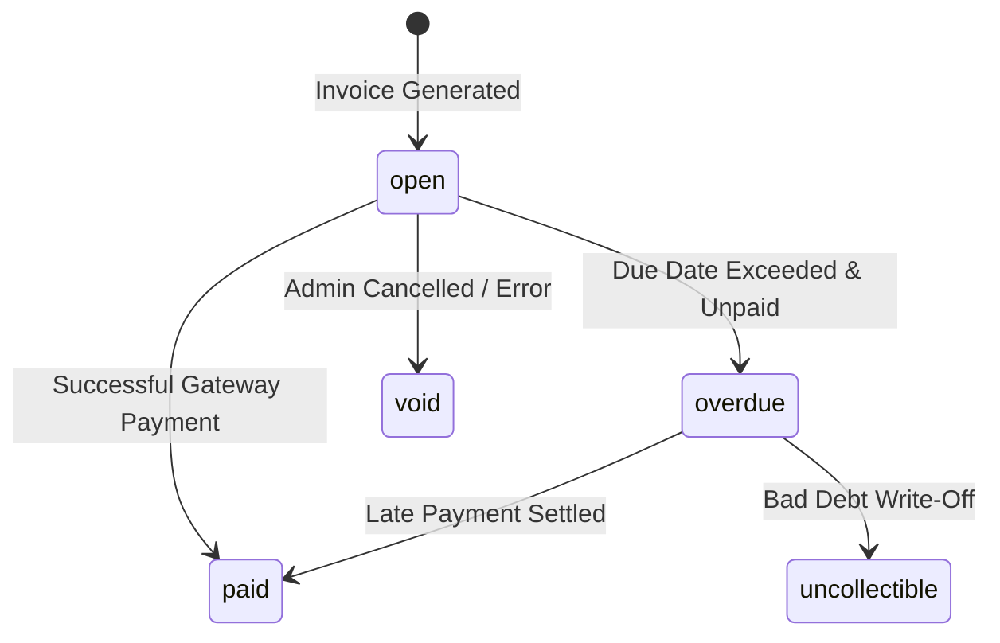
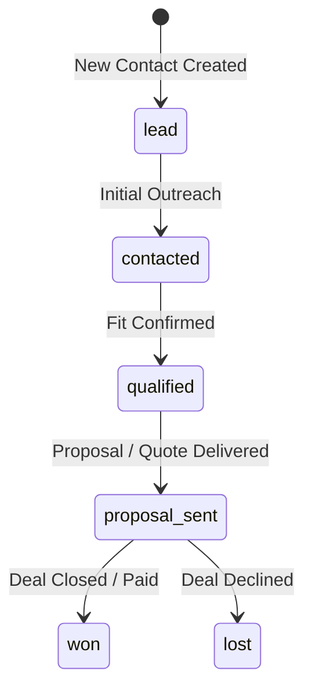
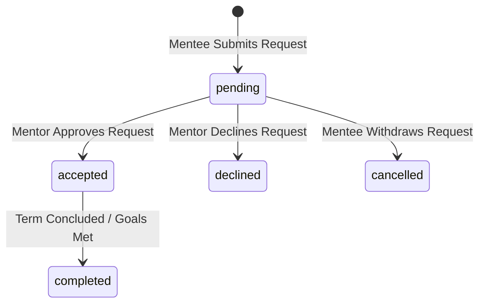
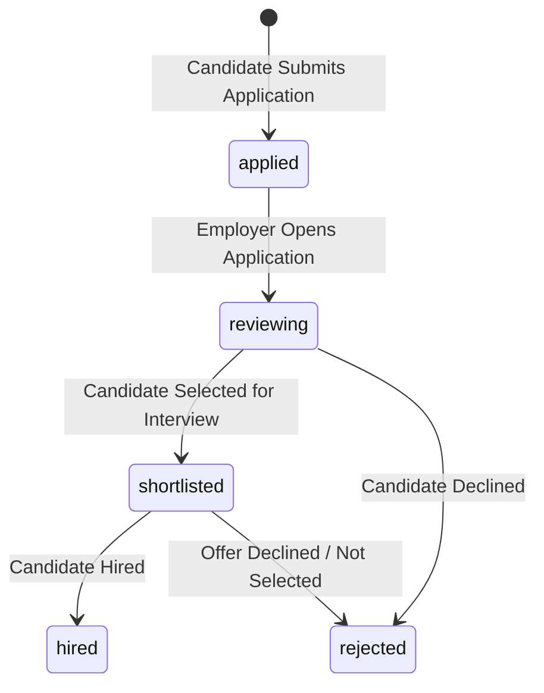
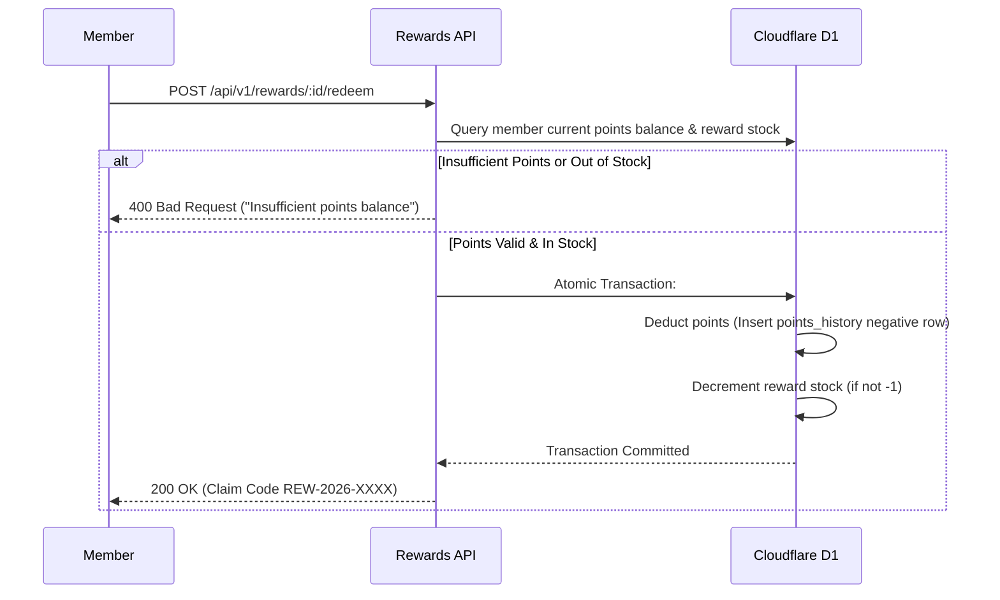
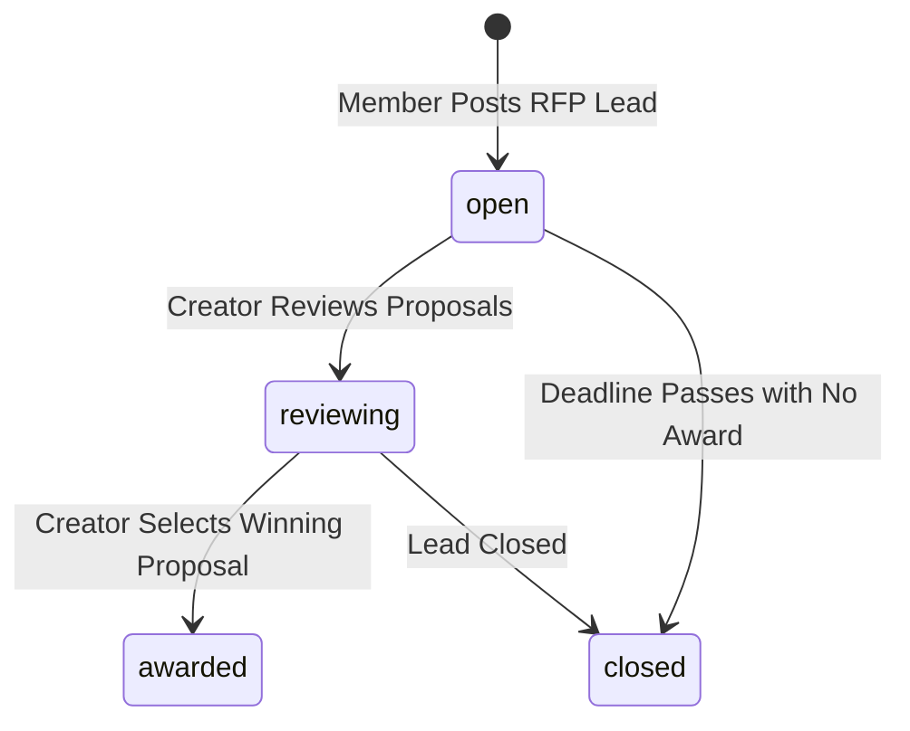

# 121 Meet.AI — Master Implementation Playbook
> **The Canonical Single-Document Implementation Specification for Cursor & AI Coders**
> **Platform:** 121 Meet.AI Chamber Management Platform
> **Architecture:** Decoupled Standalone Frontend (`frontend/`) + Edge API Gateway (`backend/`)
> **Source Specifications:** Canonical Architecture, Database Schema (103 Entities), and RBAC Matrix fully embedded in this Playbook
> **Reference UI Prototype:** `Chamber AI/public/app.html` (545 React Components, 145 Active Views, Radix UI Primitives)
> **Total Persistence Scope:** 103 Platform Entities (102 Cloudflare D1 Relational Tables + 1 Cloudflare KV Key-Value Store)
> **Total Execution Scope:** 15 Dependency-Ordered Phases · 72 Sequenced Implementation Prompts

---

## TABLE OF CONTENTS

- [Part 1: System Architecture & Universal Engineering Invariants](#part-1-system-architecture--universal-engineering-invariants)
  - [1.1 Multi-Tenant Isolation & Security Invariants](#11-multi-tenant-isolation--security-invariants)
  - [1.2 Server-Side RBAC & Architectural Dependency Direction](#12-server-side-rbac--architectural-dependency-direction)
  - [1.3 Layered Software Architecture](#13-layered-software-architecture)
  - [1.4 Production Backend Directory Structure (`backend/`)](#14-production-backend-directory-structure-backend)
  - [1.5 Production Frontend Directory Structure (`frontend/`)](#15-production-frontend-directory-structure-frontend)
  - [1.6 API Conventions, HTTP Envelopes & Error Codes](#16-api-conventions-http-envelopes--error-codes)
  - [1.7 Cloudflare Storage & Caching Specification (D1, R2, KV)](#17-cloudflare-storage--caching-specification-d1-r2-kv)
  - [1.8 Security, Authentication Safeguards & Audit Logging](#18-security-authentication-safeguards--audit-logging)
  - [1.9 Third-Party Integrations, Encryption & Webhooks](#19-third-party-integrations-encryption--webhooks)
  - [1.10 Single D1 Database Invariant](#110-single-d1-database-invariant)
  - [1.11 Independent Workspace & Deletion Guarantee](#111-independent-workspace--deletion-guarantee)
  - [1.12 Zero Hardcoding Invariant (Dynamic Configuration & Secrets Management)](#112-zero-hardcoding-invariant-dynamic-configuration--secrets-management)
- [Part 2: Technology Stack & Exact Versions](#part-2-technology-stack--exact-versions)
  - [2.1 Production Frontend (`frontend/`)](#21-production-frontend-frontend)
  - [2.2 Production Backend (`backend/`)](#22-production-backend-backend)
  - [2.3 Reference UI (`chamber/`)](#23-reference-ui-chamber)
- [Part 3: Master Database Architecture (103 Persistence Entities)](#part-3-master-database-architecture-103-persistence-entities)
- [Part 4: Canonical Role-Based Access Control (RBAC) & Permissions Matrix](#part-4-canonical-role-based-access-control-rbac--permissions-matrix)
  - [4.1 Role Definitions & Scopes](#41-role-definitions--scopes)
  - [4.2 Core RBAC Data Architecture](#42-core-rbac-data-architecture)
  - [4.3 Multi-Role Scoping & Evaluation Engine](#43-multi-role-scoping--evaluation-engine)
  - [4.4 Master Permissions Matrix by Module](#44-master-permissions-matrix-by-module)
  - [4.5 Middleware Implementation Rules](#45-middleware-implementation-rules)
- [Part 5: 4-Layer Implementation Pattern & Step Rules](#part-5-4-layer-implementation-pattern--step-rules)
- [Part 6: Exhaustive Lovable UI Component & Feature Manifest](#part-6-exhaustive-lovable-ui-component--feature-manifest)
- [Part 7: Module-by-Module Briefings & Implementation Prompts](#part-7-module-by-module-briefings--implementation-prompts)
  - [Phase 00: Foundation & Core Infrastructure (Prompts 00.1 – 00.3)](#phase-00-foundation--core-infrastructure)
  - [Phase 01: Authentication, Sessions & User Security (Prompts 01.1 – 01.4)](#phase-01-authentication-sessions--user-security)
  - [Phase 02: Membership Plans, Applications & Review (Prompts 02.1 – 02.5)](#phase-02-membership-plans-applications--review)
  - [Phase 03: Business Profiles & Member Directory (Prompts 03.1 – 03.2)](#phase-03-business-profiles--member-directory)
  - [Phase 04: Events, Ticketing & Day-of Check-In (Prompts 04.1 – 04.6)](#phase-04-events-ticketing--day-of-check-in)
  - [Phase 05: Networking, 1:1 Meetings & CRM (Prompts 05.1 – 05.6)](#phase-05-networking-11-meetings--crm)
  - [Phase 06: Community Chapters, Groups & Polls (Prompts 06.1 – 06.4)](#phase-06-community-chapters-groups--polls)
  - [Phase 07: Content Publishing, Blog, Media & Jobs (Prompts 07.1 – 07.6)](#phase-07-content-publishing-blog-media--jobs)
  - [Phase 08: Learning Management (LMS) & CEU (Prompts 08.1 – 08.4)](#phase-08-learning-management-lms--ceu)
  - [Phase 09: E-Commerce Store & RFPs (Prompts 09.1 – 09.6)](#phase-09-e-commerce-store--rfps)
  - [Phase 10: Governance, Board & Immutable Voting (Prompts 10.1 – 10.3)](#phase-10-governance-board--immutable-voting)
  - [Phase 11: Support Desk & Community Ideas (Prompts 11.1 – 11.3)](#phase-11-support-desk--community-ideas)
  - [Phase 12: AI Engine, Site Designer & Retention (Prompts 12.1 – 12.5)](#phase-12-ai-engine-site-designer--retention)
  - [Phase 13: Chamber Administration & Automations (Prompts 13.1 – 13.9)](#phase-13-chamber-administration--automations)
  - [Phase 14: Platform Super Admin & Multi-Tenancy (Prompts 14.1 – 14.6)](#phase-14-platform-super-admin--multi-tenancy)
- [Part 8: Universal Completion & Verification Protocol](#part-8-universal-completion--verification-protocol)

---

## PART 1: SYSTEM ARCHITECTURE & UNIVERSAL ENGINEERING INVARIANTS

### 1.1 Multi-Tenant Isolation & Security Invariants
- **Single Database, Row-Level Isolation (RLS):** All tenant-scoped data across all chambers resides in one Cloudflare D1 SQL database instance. All tenant tables contain a non-nullable `chamber_id TEXT NOT NULL REFERENCES platform_chambers(id)`.
- **The Filter Invariant:** Every SQL query on tenant tables **MUST explicitly include** `WHERE chamber_id = :chamberId` (or join to a tenant-scoped parent). Backend Hono handlers are prohibited from directly running raw SQL without passing through repository query builders or prepared statements that enforce `chamber_id` binding.
- **Cross-Tenant Attack Prevention:** If a malicious user supplies an entity ID belonging to Chamber B while authenticated under Chamber A, queries return `404 Not Found` because the composite predicate `WHERE id = :id AND chamber_id = :chamberA` evaluates to zero rows.
- **Never Rely on Client Filtering:** The backend Hono API gateway is the single enforcement boundary. Even if a client injects another tenant ID, the server rejects or overwrites it using the validated session context.

### 1.2 Server-Side RBAC Enforcement & Architectural Dependency Direction
- **Client Claims are Untrusted:** Never authorize sensitive operations based on frontend state, local storage, or unverified JWT claims. Frontend RBAC (`usePermission`) controls UI visibility and user experience only; the backend Hono API is the only true security boundary.
- **The 7 Platform Roles:**
  1. `super_admin`: Global platform operations across all chambers.
  2. `full_admin`: Full management across all 42 modules within a specific `chamber_id`.
  3. `chapter_admin`: Scoped strictly to records matching `chapter_id = user.chapter_id`.
  4. `group_admin`: Scoped strictly to records matching `group_id = user.group_id`.
  5. `billing_admin`: Scoped strictly to financial, invoices, plans, and payment gateways.
  6. `member`: Access to authenticated member directory, 1:1 meetings, events, courses, and profile.
  7. `guest`: Anonymous public visitor (event calendar, public directory, store, join application).
- **Middleware Guard:** Hono middleware evaluates `user_role_assignments` by verifying `role_id`, `scope_type`, and `scope_id`.
- **Strict Backend Dependency Direction (`api → modules → core`):**
  - `api/` routers are transport-only (handling HTTP requests, Zod validation, RBAC checks, and returning standard JSON envelopes). Routers **never** execute direct SQL queries or contain domain business logic.
  - Modules never directly import another module's repository; cross-module calls occur strictly through **Service Interfaces**.
- **Explicit Multi-Tenant D1 Client Instantiation:**
  Every tenant repository must be explicitly instantiated with a verified `chamberId`:
  ```typescript
  const db = getTenantDb(c.env.DB, chamberId);
  const repo = new EventsRepository(db);
  ```
- **Server State vs. Client State:**
  - All server data (90%) must be managed exclusively via **TanStack Query** (`useQuery`, `useMutation`).
  - `stores/` (Zustand) is strictly reserved for ephemeral client UI state (modals, drawers, sidebar toggle). Never duplicate API responses into global client stores.
- **AI Separation of Concerns:**
  - `core/integrations/ai/` provides raw HTTP clients for Workers AI, OpenAI, Anthropic, and Gemini.
  - `modules/ai/` (and `features/ai/`) owns chamber-specific authorization, prompt engineering, context retrieval, credit quotas, and CSAT audit logging in `ai_chat_history`.

### 1.3 Layered Software Architecture

```text
┌─────────────────────────────────────────────────────────────┐
│                 React Client (SPA Frontends)                │
│     (Guest Site · Member Portal · Admin · Super Admin)      │
└──────────────────────────────┬──────────────────────────────┘
                               │ JSON / HTTP Fetch (Bearer Auth)
                               ▼
┌─────────────────────────────────────────────────────────────┐
│             Hono Edge API Gateway (Cloudflare)              │
│   ├── Tenant Resolution Middleware (chamber_id)             │
│   ├── Auth & Session Middleware (KV verification)           │
│   ├── Scoped RBAC Guard Middleware (scope_id check)         │
│   └── Input Validation Middleware (Zod Schemas)             │
└──────────────────────────────┬──────────────────────────────┘
                               │
                               ▼
┌─────────────────────────────────────────────────────────────┐
│                    Domain Service Layer                     │
│   ├── AuthService        ├── MembershipService              │
│   ├── EventService       ├── BillingService                 │
│   ├── StoreService       ├── AIService                      │
│   └── GovernanceService  └── AutomationEngine               │
└──────────────────────────────┬──────────────────────────────┘
                               │
                               ▼
┌─────────────────────────────────────────────────────────────┐
│          Repository / ORM Layer (Drizzle ORM for D1)        │
│   ├── Drizzle ORM Queries & Schemas (chamber_id filter)     │
│   ├── D1 Prepared Statements (legacy repositories)          │
│   ├── Transaction Coordinator (atomic batch writes)         │
│   └── Edge KV / R2 Storage Adapters                         │
└─────────────────────────────────────────────────────────────┘
```

#### Canonical ORM Policy (Drizzle ORM for Cloudflare D1)
- **Standardized ORM:** **Drizzle ORM** (`drizzle-orm/d1`) is the official ORM for database access and schema definitions across the platform starting from upcoming feature prompts.
- **Implementation Rules:**
  - All **new** prompt implementations must define Drizzle table schemas matching the canonical database authority (`database/DB_tables_reference.md` and `DB_schema.dbml`) and utilize Drizzle queries (`drizzle(db)`) within repository classes.
  - Existing implementations (e.g. initial auth and plans repositories) remain fully functional using their current native D1 prepared statements and will be progressively migrated to Drizzle ORM in a scheduled refactoring pass.
  - Multi-tenant isolation remains mandatory: every Drizzle query must explicitly filter by tenant context (`eq(table.chamberId, chamberId)`).

### 1.4 Production Backend Directory Structure (`backend/`)

The backend follows a **Domain-Driven Vertical Slice Architecture** with **Portal Gateway Routers**:

```text
backend/
│
├── index.ts                     # Cloudflare Worker fetch entry point & Env bindings
├── app.ts                       # Hono app instantiation, global middleware & route mounting
│
├── core/                        # Infrastructure, Storage & Cross-Cutting Concerns
│   ├── context.ts               # Type-safe Hono Context Variables (chamberId, user, roles)
│   ├── env.ts                   # Cloudflare Worker Environment interface (DB, KV, R2)
│   │
│   ├── db/                      # Tenant-Aware D1 Database Client
│   │   ├── client.ts            # D1 client with explicit getTenantDb(env.DB, chamberId) helper
│   │   ├── schema.ts            # Generated/typed D1 entity definitions
│   │   ├── migrations/          # SQL migrations (0001_bootstrap.sql, etc.)
│   │   └── transactions.ts      # D1 batch / atomic-operation helpers for multi-statement writes
│   │
│   ├── storage/                 # Cloudflare Edge Storage Wrappers
│   │   ├── kv.ts                # Typed KV helpers (session:{token}, otp:{email}:{portal})
│   │   └── r2.ts                # Deterministic R2 paths (tenants/{chamberId}/{folder}/...)
│   │
│   ├── middleware/              # Edge Middleware Pipeline
│   │   ├── tenant-resolver.ts   # Domain/Subdomain/Header tenant resolver
│   │   ├── auth.ts              # KV Bearer token verifier & user context loader
│   │   ├── rbac.ts              # Scoped RBAC guard (requirePermission, scope checks)
│   │   ├── rate-limiter.ts      # KV-backed edge rate limiter
│   │   └── error-handler.ts     # Global catch & standard envelope formatter
│   │
│   ├── integrations/            # Encapsulated Third-Party Clients (Raw API Wrappers)
│   │   ├── payments/            # Stripe & Razorpay SDK clients
│   │   ├── email/               # SendGrid / Postmark dispatcher
│   │   ├── sms/                 # Twilio SMS client
│   │   ├── ai/                  # Workers AI, OpenAI, Anthropic, Gemini client
│   │   └── accounting/          # QuickBooks, Xero, Zoho formatters
│   │
│   ├── jobs/                    # Asynchronous & Scheduled Task Dispatchers
│   │   ├── dispatcher.ts        # Cloudflare Queue & Cron Trigger coordinator
│   │   └── types.ts             # Background job payloads (sync, digests, reminders)
│   │
│   └── shared/                  # Common Cross-Domain Primitives Only
│       ├── errors.ts            # Standard AppError & ErrorCodes
│       ├── response.ts          # { success: true, data, meta } builders
│       ├── pagination.ts        # Cursor & Offset pagination helpers
│       └── crypto.ts            # 256-bit token generator & AES-GCM encryption
│
├── modules/                     # Encapsulated Domain Slices (Logic + Data Access)
│   ├── auth/                    # OTP, Sessions, Account Settings, Security
│   ├── membership/              # Plans, Dues Calculator, Applications, Billing & Cards
│   ├── directory/               # Business Profiles, Locations, Member Directory Search
│   ├── events/                  # Events, Tickets, Promo Codes, Check-In, Feedback
│   ├── networking/              # 1:1 Meetings, Direct Chat, B2B Referrals, CRM, Mentorship
│   ├── community/               # Chapters, Groups & Committees, Polls & Surveys
│   ├── content/                 # Announcements, News Releases, Blog, Gallery, Job Board
│   ├── learning/                # Courses LMS, Certificates, CEU Ledger, Loyalty Rewards
│   ├── commerce/                # Store Catalog, Cart, Shipping Engine, Orders, B2B Leads
│   ├── governance/              # Board Roster, Meetings & Minutes, Resolutions & Voting
│   ├── support/                 # Support Tickets, Contact Requests, Ideas Board
│   ├── notifications/           # In-app notifications & channel dispatch rules
│   ├── automation/              # Multi-step trigger-based marketing automations
│   ├── ai/                      # AI Assistant, Site Designer, Retention Scorer
│   ├── admin/                   # Admin KPIs, Onboarding wizard, Financial exports
│   └── super-admin/             # Tenant provisioning, Platform metrics, Global audit logs
│       │
│       └── [Each Module Folder Contains]:
│           ├── <module>.service.ts      # Pure business rules, calculations & state machines
│           ├── <module>.repository.ts   # D1 prepared statements (tenant-scoped)
│           ├── <module>.schema.ts       # Zod input/output validation schemas
│           └── <module>.types.ts        # Module-specific domain models & DTOs
│
└── api/                         # Portal Gateway Routers (Transport Layer Only)
    ├── router.ts                # Mounts all portal sub-routers under /api/v1
    ├── public/                  # /api/v1/public/* (Guest access, rate-limited)
    ├── member/                  # /api/v1/member/* (Requires authMiddleware + member role)
    ├── admin/                   # /api/v1/admin/*  (Requires authMiddleware + chamber admin roles)
    └── super/                   # /api/v1/super/*  (Requires super_admin role)
```

### 1.5 Production Frontend Directory Structure (`frontend/`)

The frontend follows a **Feature-Driven Architecture** with **Shared Layout Shells** and **TanStack Query** server-state management:

```text
frontend/
│
├── package.json                 # React 19, Vite 8, TanStack Router, TanStack Query, Tailwind CSS v4
├── vite.config.ts
├── index.html
├── src/
│   ├── main.tsx                 # Mounts QueryProvider → AuthProvider → Router
│   ├── App.tsx                  # Root Router Provider
│   ├── index.css                # Tailwind CSS v4 directives & CSS variable tokens
│
├── core/                        # Frontend Infrastructure (Zero Business Logic)
│   ├── api/                     # Base HTTP client with automatic Bearer & Tenant headers
│   ├── auth/                    # Token storage, permission helpers, route guards
│   ├── query/                   # TanStack Query client, default cache rules, query key factories
│   ├── navigation/              # RBAC-filtered navigation menus for Public, Member, Admin, Super Admin
│   ├── context/                 # Universal Contexts (AuthContext, ChamberContext, ThemeContext)
│   ├── theme/                   # Dynamic chamber primary/accent CSS variable injector
│   ├── i18n/                    # Localization strings (EN, ES, FR, ZH, VI, KO)
│   └── hooks/                   # Cross-cutting hooks (useAuth, useChamber, usePermission, useToast)
│
├── components/                  # Shared Design System & Layouts
│   ├── ui/                      # Atomic primitives (button, input, select, modal, table, badge)
│   ├── forms/                   # FormField, OtpPinInput, FileUploader, RichTextEditor
│   └── layout/                  # PublicLayout, MemberLayout, AdminLayout, SuperAdminLayout, Topbar, Sidebar
│
├── routes/                      # Route Definitions & Layout Wiring (Zero Business Logic)
│   ├── index.tsx                # Tenant domain resolver & root router
│   ├── public.routes.tsx        # Guest routes (/events, /directory, /join)
│   ├── member.routes.tsx        # Member routes (/portal/dashboard, /portal/crm)
│   ├── admin.routes.tsx         # Chamber Admin routes (/admin/events, /admin/members)
│   └── super.routes.tsx         # Super Admin routes (/super/chambers, /super/billing)
│
├── features/                    # Domain Feature Areas (Colocated pages, components, hooks, api)
│   ├── auth/                    # Login, OTP verification, Password reset
│   ├── membership/              # Plans builder, Dues calculator, Applications review, Member billing
│   ├── directory/               # Business profiles, Location editor, Member directory search
│   ├── events/                  # Event listings, Calendars, Registration checkout, QR check-in
│   ├── networking/              # 1:1 Meetings, Direct chat, B2B referrals, CRM, Mentorship
│   ├── community/               # Chapters, Groups & Committees, Polls & Surveys
│   ├── content/                 # Announcements, News releases, Blog, Gallery, Job board
│   ├── learning/                # Courses LMS, Certificates, CEU ledger, Loyalty rewards
│   ├── commerce/                # Store catalog, Cart & checkout, Shipping engine, B2B RFPs
│   ├── governance/              # Board roster, Minutes editor, Resolutions & Voting
│   ├── support/                 # Support tickets, Contact inbox, Ideas board
│   ├── notifications/           # In-app notification drawer, 5x3 preferences matrix
│   ├── automation/              # Marketing automation workflow builder
│   ├── ai/                      # Conversational assistant, Site designer preview, BYO keys
│   ├── admin/                   # Dashboard KPIs, Onboarding wizard, Financial exports
│   └── super-admin/             # Tenant provisioning, Platform metrics, Global audit logs
│       │
│       └── [Standard Feature Slice Internal Layout]:
│           ├── pages/           # Routed view containers (e.g. EventsListPage.tsx)
│           ├── components/      # Domain-specific UI widgets (e.g. EventCard.tsx)
│           ├── hooks/           # Domain TanStack Query hooks (e.g. useEventsQuery)
│           ├── api/             # Domain HTTP fetch calls (e.g. events.api.ts)
│           ├── types/           # Domain view models & DTOs
│           └── utils/           # Domain formatters & calculations
│
├── stores/                      # Ephemeral Client UI State Only (Zustand)
│   ├── ui.store.ts              # Sidebar collapsed, active modal, mobile menu state
│   └── command-palette.store.ts # Global search palette state
│
├── types/                       # Universal TypeScript Definitions (api.ts, auth.ts, chamber.ts)
└── utils/                       # Universal Utilities (formatters.ts, cn.ts, storage.ts)
```

### 1.6 API Conventions, HTTP Envelopes & Error Codes

#### Base URL & Versioning
All API routes follow the prefix:
```http
/api/v1/:resource
```

#### Standard Response Envelopes
- **Success Response (HTTP 200/201):**
  ```json
  {
    "success": true,
    "data": {},
    "meta": {
      "page": 1,
      "limit": 20,
      "total": 142,
      "total_pages": 8
    }
  }
  ```
  *(Note: `meta` is included on paginated lists and collection endpoints).*
- **Error Response (HTTP 4xx/5xx):**
  ```json
  {
    "success": false,
    "error": {
      "code": "RESOURCE_NOT_FOUND",
      "message": "The requested event could not be found.",
      "details": [
        {
          "field": "event_id",
          "issue": "Invalid UUID format"
        }
      ]
    }
  }
  ```

#### Standard HTTP Status Codes
| Status Code | Usage Scenario |
|---|---|
| `200 OK` | Successful `GET`, `PUT`, `PATCH`, or standard operations. |
| `201 Created` | Successful `POST` resulting in entity creation (e.g., application submitted). |
| `204 No Content` | Successful `DELETE` operation. |
| `400 Bad Request` | Zod validation failure or malformed payload. |
| `401 Unauthorized`| Missing, expired, or invalid session token. |
| `403 Forbidden` | Authenticated user lacks required role or scoped access (e.g. Chapter Admin accessing other chapter). |
| `404 Not Found` | Entity does not exist within the given `chamber_id`. |
| `409 Conflict` | Unique constraint violation (e.g., duplicate email or duplicate poll vote). |
| `422 Unprocessable`| Business logic violation (e.g. event capacity reached, coupon code expired). |
| `500 Server Error` | Unexpected backend or database exception. |

#### Standard Query Parameters
Collection endpoints support standard query parameters:
- `page`: Integer (default `1`)
- `limit`: Integer (default `20`, max `100`)
- `search`: String (searches names, titles, descriptions)
- `sort_by`: String (column name, e.g. `created_at`, `event_date`)
- `order`: String (`asc` or `desc`, default `desc`)
- `status`: String filter (e.g. `active`, `pending`, `published`)
- `chapter_id`: UUID filter (automatically constrained for Chapter Admins)

#### Core Application Error Codes
| Error Code | HTTP Status | Description |
|---|:---:|---|
| `CHAMBER_NOT_FOUND` | 404 | Subdomain or custom domain does not map to an active chamber. |
| `INVALID_OTP` | 400 | Provided OTP is incorrect or expired. |
| `SESSION_EXPIRED` | 401 | User session token in KV has expired. |
| `UNAUTHORIZED_ROLE` | 403 | User role is insufficient for this action. |
| `SCOPE_ACCESS_DENIED` | 403 | User is accessing data outside their assigned chapter/group. |
| `VALIDATION_ERROR` | 400 | Zod payload schema validation failed. |
| `EVENT_CAPACITY_REACHED`| 422 | Cannot register: event is full (routes to waitlist). |
| `INSUFFICIENT_POINTS` | 422 | Member lacks required points balance to redeem reward. |
| `PAYMENT_FAILED` | 422 | Gateway rejected payment transaction. |
| `ALREADY_VOTED` | 409 | Member has already cast a vote on this poll/resolution. |
| `DUPLICATE_ENTRY` | 409 | Unique constraint breached (e.g. SKU or slug exists). |

#### Tenant Hostname Resolution & Security
1. **Root Domain Requests (`121meet.ai` / `app.121meet.ai`):**
   - Skip tenant resolution. Serves global platform marketing and the public Chamber Directory (`GET /api/v1/public/chambers`).
2. **Tenant Domain Requests (`*.121meet.ai` or Custom Domains):**
   - Middleware extracts incoming `Host` header and resolves `chamber_id` from `platform_chambers` matching `subdomain` or `custom_domain`.
3. **`X-Chamber-ID` Header Rules:**
   - In production, client-supplied `X-Chamber-ID` headers are **strictly ignored** to prevent header spoofing.
   - `X-Chamber-ID` is honored only in local development (`NODE_ENV === 'development'`) or internal service-to-service calls authenticated with an internal HMAC token (`X-Internal-Signature`).

### 1.7 Cloudflare Storage & Caching Specification (D1, R2, KV)

```text
┌──────────────────────────────────────────────────────────┐
│                   Cloudflare Edge Storage                │
├───────────────────┬───────────────────┬──────────────────┤
│   Cloudflare D1   │   Cloudflare R2   │  Cloudflare KV   │
│ (Relational Data) │   (File Storage)  │(Sessions & Cache)│
├───────────────────┼───────────────────┼──────────────────┤
│ • 102 SQL Tables  │ • Image uploads   │ • Active sessions│
│ • ACID queries    │ • Event photos    │ • Edge rate-limit│
│ • Foreign keys    │ • PDF certificates│   fallback       │
│ • Unique indexes  │ • Digital assets  │ • Tenant domain  │
│ • chamber_id RLS  │ • CSV imports     │   resolution map │
│ • otp_codes table │                   │ • AI prompt rate │
└───────────────────┴───────────────────┴──────────────────┘
```

#### Cloudflare R2 Key Naming Conventions
All media, binary files, and documents are stored in R2 with deterministic paths prefixed by the `chamber_id`:

| Asset Category | R2 Storage Key Pattern | Access Policy | MIME Types Supported |
|---|---|---|---|
| **Chamber Branding** | `tenants/{chamber_id}/branding/logo.{ext}` | Public CDN | PNG, JPG, SVG, WEBP |
| **User Avatars** | `tenants/{chamber_id}/users/{user_id}/avatar.{ext}` | Public CDN | JPG, PNG, WEBP |
| **Business Logos** | `tenants/{chamber_id}/businesses/{business_id}/logo.{ext}` | Public CDN | PNG, JPG, WEBP |
| **Event Photos** | `tenants/{chamber_id}/events/{event_id}/photos/{uuid}.{ext}` | Public CDN | JPG, PNG, WEBP |
| **Gallery Albums** | `tenants/{chamber_id}/gallery/{album_id}/{uuid}.{ext}` | Public CDN | JPG, PNG, WEBP |
| **Blog Cover Images**| `tenants/{chamber_id}/blog/{post_id}/cover.{ext}` | Public CDN | JPG, PNG, WEBP |
| **Store Product Assets**| `tenants/{chamber_id}/store/products/{product_id}/{uuid}.{ext}` | Public CDN | JPG, PNG, WEBP |
| **Digital Downloads**| `tenants/{chamber_id}/store/downloads/{product_id}/{file_key}` | Signed URL (Private)| PDF, ZIP, EPUB |
| **Resumes / CVs** | `tenants/{chamber_id}/resumes/{application_id}/{uuid}.pdf` | Scoped Admin / Private| PDF, DOCX |
| **Certificates** | `tenants/{chamber_id}/certificates/{enrollment_id}.pdf` | Auth Member / Private | PDF |
| **Resource Documents**| `tenants/{chamber_id}/resources/{resource_id}/{filename}.{ext}`| Access Restricted | PDF, DOCX, XLSX |
| **Governance Paperwork**| `tenants/{chamber_id}/governance/{doc_id}/{filename}.{ext}` | Board Only / Private | PDF |

#### Cloudflare KV Key Patterns & TTLs
| KV Key Pattern | Value Structure | Time-to-Live (TTL) | Purpose |
|---|---|---|---|
| `session:{session_token}` | `{ user_id, chamber_id, highest_role, active_roles, ip }` | `30 minutes` (Rolling)| Active authenticated user session token and cached permissions. |
| `domain_map:{host}` | `{ chamber_id, subdomain, status, onboarded }` | `24 hours` | High-speed edge routing lookup from domain to `chamber_id`. |
| `rate_limit:ai:{user_id}`| `{ count, reset_at }` | `1 hour` | Edge rate limiting for member AI queries. |
| `rl:{ip}:{minute}` | `integer` (count) | `60 seconds` | Ephemeral IP-based rate limiting fallback. |

### 1.8 Security, Authentication Safeguards & Audit Logging

1. **Passwordless OTP Security & Authoritative D1 Storage:**
   - OTP codes are generated via `crypto.getRandomValues()` (6-digit numeric).
   - Stored in Cloudflare D1 (`otp_codes` table) with SHA-256 hashing and an expiration timestamp (10 minutes) to guarantee strong consistency and prevent cross-edge propagation delays.
   - Max 3 verification attempts allowed, incremented atomically via SQL (`attempts = attempts + 1`) to eliminate concurrent brute-force race conditions.
   - Inbound request frequency is protected by Cloudflare Native Rate Limiting with KV fallback.
2. **Session Token & KV Schema:**
   - Canonical authentication passes `Authorization: Bearer <token>` in the HTTP request headers.
   - Session tokens are high-entropy 256-bit cryptographic tokens generated via `crypto.getRandomValues(new Uint8Array(32))` encoded as a 64-character hexadecimal string.
   - Session metadata is stored in Cloudflare KV (`session:{token}`) with the canonical JSON structure:
     ```json
     {
       "session_id": "sess_8f9a2b1c4e6d",
       "user_id": "usr_99120482",
       "chamber_id": "ch_austin_01",
       "highest_role": "chamber_admin",
       "assigned_scopes": {
         "chamber": ["ch_austin_01"],
         "chapter": ["chap_downtown_01"],
         "group": ["grp_tech_council"]
       },
       "ip": "172.56.21.89",
       "user_agent": "Mozilla/5.0 (Windows NT 10.0; Win64; x64)...",
       "created_at": "2026-09-18T10:00:00Z",
       "expires_at": "2026-09-18T18:00:00Z"
     }
     ```
   - Sessions are verified on every privileged request against both client IP and `User-Agent` headers stored at login.
   - Configurable idle session timeout (default 30 minutes) enforced via KV expiration refresh.
3. **Mandatory 2FA:**
   - When `platform_security_settings.mandatory_2fa = 1` or `users.two_factor_enabled = 1`, login requires both primary email OTP and secondary SMS verification before the session is issued.
4. **IP Allowlisting & Access Boundaries:**
   - Chamber Admins can enable IP Allowlisting in `chamber_settings (ip_allowlist_enabled = 1, ip_allowlist_json)`.
   - Super Admins can enforce platform-wide IP restrictions in `platform_security_settings`.
   - The Hono security middleware evaluates incoming `CF-Connecting-IP` against configured CIDR ranges before serving admin routes.
5. **Universal Audit Logging:**
   - All privileged administrative actions, security configuration changes, and state transitions are recorded in `platform_audit_logs`.
   - **Immutable Storage:** Append-only table with no update or delete APIs.
   - **Payload Capture:** Logs `chamber_id`, `actor_id`, `actor_role`, `action` (e.g. `application.approved`), `target_type`, `target_id`, `details_json` (before/after state diff), `ip_address`, `user_agent`, and `created_at`.

### 1.9 Third-Party Integrations, Encryption & Webhooks

#### Integrations Inventory
| Service Category | Supported Providers | Scope | Configuration Storage | Purpose |
|---|---|---|---|---|
| **Payment Gateways** | Stripe, Razorpay, PayPal | Chamber-level | `payment_gateway_config` | Collect membership subscriptions, event fees, and store purchases. |
| **Email Delivery** | SendGrid, Mailchimp | Platform & Chamber | `platform_integrations` / `chamber_integrations` | Deliver transactional OTPs, system alerts, daily digests, and newsletters. |
| **SMS Delivery** | Twilio, MessageBird | Platform & Chamber | `platform_integrations` / `chamber_integrations` | OTP mobile delivery, urgent broadcast dispatches, and SMS drip workflows. |
| **Web Analytics** | Google Analytics 4 | Chamber-level | `chamber_settings.ga4_measurement_id` | Track guest page views, visitor sources, bounce rates, and user acquisition. |
| **Accounting Software**| QuickBooks, Xero, Zoho Books | Chamber-level | `chamber_integrations` | Sync revenue journals, membership invoices, event ticket sales, and sales taxes. |
| **AI LLM Providers** | Anthropic (Claude), OpenAI (GPT-4), Google (Gemini) | Platform, Chamber & Member | `platform_global_settings` / `chamber_settings` / `users.personal_api_key_encrypted` | Powers AI Site Designer, conversational assistant, churn prediction, and reports. |
| **External Event Sync**| Facebook Events, Meetup, Eventbrite | Chamber-level | `chamber_integrations` | Automatically syndicate published chamber events to external networks. |

#### Credentials Storage & Encryption Policy
1. **At-Rest Encryption:**
   - All private keys (API secret keys, publishable keys, OAuth refresh tokens) stored in `payment_gateway_config`, `chamber_integrations`, or `users.personal_api_key_encrypted` must be AES-GCM encrypted using an environment encryption master secret (`CHAMBER_ENCRYPTION_KEY`).
2. **Client Redaction:**
   - Secrets are **never** returned in plaintext to the frontend UI. The API returns only masked strings (e.g. `sk_live_••••••••1042`) and a `status: "connected"`.

#### Webhook Architecture & Idempotency
- **Endpoint Convention:** `POST /api/v1/webhooks/:provider`
- **Signature Verification:** Each provider adapter (Stripe HMAC `Stripe-Signature`, Razorpay HMAC `X-Razorpay-Signature`) validates payload signatures before processing.
- **Idempotency Guarantee:** Incoming webhook event IDs are logged in `activity_logs` before execution to prevent double processing of invoices or fulfillment triggers.

### 1.10 Single D1 Database Invariant
- All 101 relational tables defined in the database schema are canonical.
- **Do NOT invent tables or columns.** If a feature requires storage not covered by the schema, review Part 3 (Master Database Architecture) of this playbook and `database/DB_tables_reference.md` or flag as `OPEN DECISION`.
- Foreign keys, constraints, and cascades specified in the database schema must be respected.

### 1.11 Independent Workspace & Deletion Guarantee
- The production application is implemented in `frontend/` and `backend/` as standalone sibling workspaces.
- `chamber/` is strictly a temporary reference containing the 40K-line `public/app.html` prototype and Radix components.
- **No production code may import from `../chamber/`.** Once implementation is complete, the entire `chamber/` directory will be deleted cleanly without breaking any part of `frontend/` or `backend/`.

### 1.12 Zero Hardcoding Invariant (Dynamic Configuration, Tenant Resolution & Secrets Management)
- **Absolute Prohibition on Hardcoding:** Under no circumstances should secrets, API keys, bearer tokens, passwords, database IDs, tenant/chamber IDs (`chamber_id`), or absolute base URLs be hardcoded into frontend or backend application code.
- **Dynamic Tenant Context:** All tenant identifiers must be dynamically resolved at request time from the HTTP hostname/subdomain, custom domain mapping, verified session claims, or incoming tenant headers (e.g. `X-Chamber-Slug` in development/testing). Never hardcode static IDs such as `'ch_austin_001'` in application logic.
- **Dynamic Base URLs & Endpoints:** The frontend client must derive API endpoints from environment variables (`import.meta.env.VITE_API_URL`) or relative path routing (`/api/v1`), never hardcoded local ports or domains.
- **Secrets & Credentials Management:** All third-party credentials (Stripe, Twilio, SendGrid, AI keys) must be bound through Cloudflare Worker secrets (`c.env.*`) or encrypted in database tables (`AES-GCM` via `CHAMBER_ENCRYPTION_KEY`).
- **Permissible Static Data Exception:** Static mock/placeholder items are strictly reserved for initial visual demonstration in unmounted UI component previews or automated unit tests, and must never replace live dynamic data resolution.

---

## PART 2: TECHNOLOGY STACK & EXACT VERSIONS

The production stack strictly matches the versions specified in `chamber/package.json`:

### 2.1 Production Frontend (`frontend/`)
- **Core Framework:** React 19 (`^19.2.0`), React DOM (`^19.2.0`)
- **Bundler & Tooling:** Vite 8 (`^8.2.0`), TypeScript (`^5.8.3`)
- **Styling System:** Tailwind CSS v4 (`tailwindcss: ^4.2.1`, `@tailwindcss/vite: ^4.2.1`), `tw-animate-css: ^1.3.4`
- **Routing Engine:** `@tanstack/react-router: ^1.170.18` (Type-safe route trees, layouts, route guards)
- **Data Fetching & Cache:** `@tanstack/react-query: ^5.101.1` (Automatic refetching, mutations, optimistic updates)
- **UI Component Primitives:** Radix UI Complete Suite (`@radix-ui/react-*` 48 primitives)
- **Icons & Formatting:** `lucide-react: ^0.575.0`, `date-fns: ^4.1.0`, `clsx: ^2.1.1`, `tailwind-merge: ^3.5.0`, `class-variance-authority: ^0.7.1`
- **UI Enhancements:** `sonner: ^2.0.7` (Toasts), `vaul: ^1.1.2` (Drawers), `cmdk: ^1.1.1` (Command palette), `recharts: ^2.15.4` (Charts), `input-otp: ^1.4.2` (OTP input)
- **Validation:** `zod: ^3.24.2`, `react-hook-form: ^7.71.2`, `@hookform/resolvers: ^5.2.2`

### 2.2 Production Backend (`backend/`)
- **Edge Framework:** Hono (`^4.7.0`) running natively on Cloudflare Workers
- **ORM / Query Builder:** Drizzle ORM (`drizzle-orm`, `drizzle-kit` for D1) — Standardized ORM for upcoming feature prompt implementations
- **Database Engine:** Cloudflare D1 (Serverless SQLite-compatible, 102 tables)
- **Key-Value Store:** Cloudflare Workers KV (Sessions, OTPs, Caches)
- **Object Storage:** Cloudflare R2 (S3-compatible zero-egress asset storage)
- **Validation:** Zod (`^3.24.2`) for all incoming request bodies and query parameters

### 2.3 Reference UI (`Chamber AI/`)
- `Chamber AI/public/app.html`: 2.5MB monolithic React reference prototype with 545 components and 145 view states.
- `Chamber AI/src/components/ui/`: 46 shared shadcn/ui component files (accordion, button, dialog, etc.)
- `Chamber AI/src/hooks/`: Custom React hooks (e.g. `use-mobile.tsx`)
- `Chamber AI/src/lib/`: Shared utilities (`utils.ts`, error capture, error page)
- Retained for visual, interaction, and styling parity during implementation, then deleted.

---

## PART 3: MASTER DATABASE ARCHITECTURE (103 PERSISTENCE ENTITIES)

> **Canonical Database Schema Authority:** The authoritative database architecture, column types, relationships, and foreign key constraints are defined in [`database/DB_tables_reference.md`](database/DB_tables_reference.md) and [`database/DB_schema.dbml`](database/DB_schema.dbml). Every table, field, and constraint implemented in migrations and ORM models must strictly conform to these canonical specifications.

The complete persistence layer comprises 102 D1 SQL tables and 1 Cloudflare KV entity across 22 logical domains:

| Module | Domain | Tables |
|---|---|---|
| **Module 1** | **Platform & Super Admin** | `platform_chambers`, `platform_super_admins`, `platform_tenant_billing`, `platform_support_tickets`, `platform_support_ticket_messages`, `platform_admin_requests`, `platform_integrations`, `platform_security_settings`, `platform_global_settings`, `platform_audit_logs` (10 tables) |
| **Module 2** | **Core Identity & RBAC** | `users`, `admin_profiles`, `business_profiles`, `business_members`, `chamber_memberships`, `roles`, `user_role_assignments`, `otp_codes`, `sessions` (KV) (8 D1 + 1 KV) |
| **Module 3** | **Chapters & Sub-Groups** | `chapters`, `groups`, `group_members`, `user_chapters` (4 tables) |
| **Module 4** | **Membership & Plans** | `membership_plans`, `membership_benefit_usage`, `applications` (3 tables) |
| **Module 5** | **Events & Ticketing** | `events`, `event_ticket_types`, `event_promo_codes`, `event_sponsorship_tiers`, `event_registrations`, `event_feedback`, `event_sponsors` (7 tables) |
| **Module 6** | **Billing & Invoicing** | `invoices`, `payment_methods`, `payment_gateway_config`, `financial_exports`, `financial_export_schedule`, `cart_items` (6 tables) |
| **Module 7** | **Networking & 1:1s** | `referrals`, `referral_people`, `meetings_1to1`, `messages`, `contact_requests` (5 tables) |
| **Module 8** | **CRM & Tasks** | `crm_contacts`, `tasks` (2 tables) |
| **Module 9** | **Communications** | `announcements`, `broadcasts`, `email_campaigns` (3 tables) |
| **Module 10** | **Mentorship** | `mentorship_profiles`, `mentorship` (2 tables) |
| **Module 11** | **Marketplace & RFPs** | `marketplace_listings`, `business_leads`, `business_lead_proposals` (3 tables) |
| **Module 12** | **Job Board** | `job_postings`, `job_applications` (2 tables) |
| **Module 13** | **LMS & CEU Credits** | `courses`, `course_enrollments`, `ceu_credits`, `ceu_requirements` (4 tables) |
| **Module 14** | **Gamification & Rewards**| `points_history`, `rewards` (2 tables) |
| **Module 15** | **Media Gallery** | `photo_albums`, `photo_album_images` (2 tables) |
| **Module 16** | **Polls & Surveys** | `polls`, `poll_options`, `poll_votes` (3 tables) |
| **Module 17** | **Publishing & Content** | `resources`, `news_releases`, `blog_posts` (3 tables) |
| **Module 18** | **E-Commerce Store** | `store_products`, `store_categories`, `store_orders`, `store_order_items`, `store_shipping_config`, `store_settings` (6 tables) |
| **Module 19** | **Support & Community Ideas**| `support_tickets`, `support_ticket_messages`, `ideas`, `idea_votes`, `idea_comments` (5 tables) |
| **Module 20** | **Automations & Forms** | `notifications`, `notification_preferences`, `automation_workflows`, `automation_workflow_steps`, `automation_recipients`, `reported_content`, `landing_pages`, `forms`, `form_submissions`, `activity_logs` (10 tables) |
| **Module 21** | **Governance & Board** | `governance_board_members`, `governance_meetings`, `governance_resolutions`, `governance_votes`, `governance_documents` (5 tables) |
| **Module 22** | **AI Engine & Settings** | `ai_site_design`, `ai_chat_history`, `ai_agent_capabilities`, `member_retention_scores`, `chamber_settings`, `chamber_integrations`, `import_history` (7 tables) |

---

## PART 4: CANONICAL ROLE-BASED ACCESS CONTROL (RBAC) & PERMISSIONS MATRIX

This section provides the complete canonical specification for platform roles, scoping mechanisms, database models, middleware rules, and module-by-module permission grants across the platform.

---

### 4.1 Role Definitions & Scopes

The platform supports **7 distinct roles** (6 authenticated roles + 1 unauthenticated guest session) across platform, chamber, and sub-entity tiers:

| Role Identifier | Role Title | Hierarchy / Scope Level | Target Scope Entity | Description |
|---|---|---|---|---|
| `super_admin` | Platform Super Admin | Platform-wide | Entire Platform | Global system administration across all tenants/chambers. Pre-seeded platform role. |
| `full_admin` | Chamber Full Administrator | Chamber-wide | Specific Chamber (`chamber_id`) | Unrestricted access across all 42 chamber admin modules and settings within their chamber. |
| `chapter_admin` | Chapter Administrator | Entity Scoped | Specific Chapter (`chapter_id`) | Scoped to chapter operations (events, members, leads, polls), strictly filtered to their assigned chapter. |
| `group_admin` | Group / Committee Admin | Entity Scoped | Specific Group (`group_id`) | Scoped to managing their assigned community group and its members/discussions. |
| `billing_admin` | Chamber Billing Administrator| Module Scoped | Specific Chamber (`chamber_id`) | Chamber-wide access restricted strictly to financial, invoicing, plans, gateway, and payment modules. |
| `member` | Active Chamber Member | User / Business | Specific Member Account | Read-write access to member-facing networking, events, directory, store, and community tools. |
| `guest` | Public Visitor (Unauthenticated)| Public | Anonymous Session | Read-only access to public pages, directory, events, store, and join application flow. |

> **Note on Governance Board Member Voting:** Voting on board resolutions is an entity-level eligibility check verified against `governance_board_members` (`user_id = session.user.id AND chamber_id = session.chamber_id AND status = 'active'`). It is a verified resource-level privilege rather than a distinct base role in `roles`.

---

### 4.2 Core RBAC Data Architecture

#### Unified D1 Database Model
All platform and tenant tables reside in a **single Cloudflare D1 database instance**. Row-level tenant isolation is strictly enforced on all tenant queries via `WHERE chamber_id = :chamberId`.

#### Roles Reference Table (Canonical Schema Authority)
The `roles` table is a global platform lookup pre-seeded with the standard system roles, strictly matching `DB_tables_reference.md` and `DB_schema.dbml`:
```sql
CREATE TABLE IF NOT EXISTS roles (
  id TEXT PRIMARY KEY, -- UUID
  name TEXT NOT NULL UNIQUE, -- Slug: 'super_admin', 'full_admin', 'chapter_admin', 'group_admin', 'billing_admin', 'member', or custom
  display_name TEXT NOT NULL,
  description TEXT,
  scope_type TEXT CHECK(scope_type IN ('chamber', 'chapter', 'group')),
  permissions_json TEXT, -- JSON object defining allowed module permissions
  is_system_role INTEGER NOT NULL DEFAULT 1, -- Boolean 0/1: pre-seeded system roles cannot be deleted
  created_by TEXT REFERENCES platform_super_admins(id),
  created_at TEXT NOT NULL DEFAULT (datetime('now')),
  updated_at TEXT
);
```

#### User Role Assignments Table
Users can hold multiple concurrent role assignments across different scopes (e.g., a user can be an active `member` in the chamber and simultaneously a `chapter_admin` for Chapter A):
```sql
CREATE TABLE user_role_assignments (
  id TEXT PRIMARY KEY,
  chamber_id TEXT NOT NULL REFERENCES platform_chambers(id),
  user_id TEXT NOT NULL REFERENCES users(id),
  role_id TEXT NOT NULL REFERENCES roles(id),
  scope_type TEXT NOT NULL CHECK(scope_type IN ('chamber', 'chapter', 'group')),
  scope_id TEXT NOT NULL, -- chamber_id if scope_type='chamber', chapter_id if scope_type='chapter', group_id if scope_type='group'
  granted_by TEXT NOT NULL REFERENCES users(id),
  granted_at TEXT NOT NULL DEFAULT (datetime('now')),
  expires_at TEXT,
  is_active INTEGER NOT NULL DEFAULT 1,
  UNIQUE(user_id, role_id, scope_type, scope_id)
);
```

---

### 4.3 Multi-Role Scoping & Evaluation Engine

#### Permission (Action) vs. Scope (Entity Filter)
Authorization is a two-step verification process:
1. **Permission Check (What action?):** Does any of the user's active roles permit the requested action (e.g., `events.create`, `members.view`)?
2. **Scope Check (Where/Which record?):** Does the user hold that role for the specific target entity?
   - **Chamber Scope (`scope_type = 'chamber'`):** Grants permission across all records where `chamber_id = session.chamber_id`.
   - **Chapter Scope (`scope_type = 'chapter'`):** Grants permission **only** for records where `chamber_id = session.chamber_id AND chapter_id = assignment.scope_id`.
   - **Group Scope (`scope_type = 'group'`):** Grants permission **only** for records where `chamber_id = session.chamber_id AND group_id = assignment.scope_id`.

#### Evaluation Rules for Users with Multiple Roles
- Backend authorization middleware **must never rely solely on a single flat `highestRole` string** to authorize scoped actions.
- `highestRole` in KV session cache is maintained strictly for UI display convenience (e.g., primary navigation banner, badge).
- When authorizing an API request (e.g., `POST /api/v1/admin/events` for Chapter X):
  1. Retrieve all active `user_role_assignments` for the authenticated `user_id` and current `chamber_id`.
  2. If the user possesses `full_admin` with `scope_type = 'chamber'`, the action is unconditionally authorized within that chamber.
  3. If the action targets a specific chapter resource (Chapter X), verify if the user has `chapter_admin` with `scope_type = 'chapter'` and `scope_id = 'chapter_x'`. If yes -> Authorized. If no -> 403 Forbidden.

---

### 4.4 Master Permissions Matrix by Module

**Legend:**
- `CRUD` = Create, Read, Update, Delete
- `R` = Read-only
- `R/W` = Read and Write
- `Scoped` = Restricted strictly to records matching `assignment.scope_id` (`chapter_id` or `group_id`)
- `None` = No access (Route returns 403 Forbidden / Hidden from UI navigation)

| Functional Module | Public / Guest | Member | Group Admin | Chapter Admin | Billing Admin | Full Admin | Super Admin |
|---|:---:|:---:|:---:|:---:|:---:|:---:|:---:|
| **Public Website / Landing** | `R` | `R` | `R` | `R` | `R` | `CRUD` | `R` |
| **Member Directory** | `R` (Public) | `R/W` (Self) | `R` | `R` (Scoped) | `None` | `CRUD` | `R` (Cross-tenant)|
| **Membership Applications** | `C` (Apply) | `R` (Track) | `None` | `CRUD` (Scoped) | `None` | `CRUD` | `R` |
| **Membership Plans & Pricing** | `R` | `R` (Change) | `None` | `None` | `CRUD` | `CRUD` | `R` |
| **Events & Ticketing** | `R/C` (Guest Reg)| `R/C` (Member Reg)| `R/W` (Assigned Reg)| `CRUD` (Scoped) | `None` | `CRUD` | `R` |
| **1:1 Meetings & Chat** | `None` | `CRUD` (Self) | `CRUD` (Self) | `CRUD` (Self) | `None` | `CRUD` | `None` |
| **B2B Referrals** | `None` | `CRUD` (Self) | `CRUD` (Self) | `R` (Scoped) | `None` | `CRUD` | `None` |
| **Business Leads & RFPs** | `None` | `CRUD` (Self) | `CRUD` (Self) | `R` (Scoped) | `None` | `CRUD` (Mod) | `None` |
| **Community Groups** | `None` | `R/C` (Join) | `CRUD` (Own Group)| `R` | `None` | `CRUD` | `None` |
| **Chapters Management** | `None` | `R` | `None` | `R` (Own Chapter)| `None` | `CRUD` | `R` |
| **Invoices & Transactions** | `None` | `R/C` (Own Invoices)| `None` | `R` (Scoped) | `CRUD` | `CRUD` | `R` |
| **Payment Gateway Config** | `None` | `None` | `None` | `None` | `CRUD` | `CRUD` | `None` |
| **Sponsorships & Revenue** | `None` | `R/C` (Purchase) | `None` | `R` (Scoped) | `CRUD` | `CRUD` | `R` |
| **Financial Exports** | `None` | `None` | `None` | `None` | `CRUD` | `CRUD` | `None` |
| **E-Commerce Store** | `R/C` (Guest Cart)| `R/C` (Member Cart)| `None` | `None` | `None` | `CRUD` | `R` |
| **Course Catalog & CEU** | `None` | `R/C` (Enroll) | `None` | `None` | `None` | `CRUD` | `None` |
| **Photo Gallery** | `R` | `R` | `None` | `None` | `None` | `CRUD` | `None` |
| **Polls & Voting** | `R` (Results) | `R/C` (Vote) | `None` | `CRUD` (Scoped) | `None` | `CRUD` | `None` |
| **News Releases** | `R` (Published) | `C` (Submit) | `None` | `None` | `None` | `CRUD` (Mod) | `None` |
| **Support Desk (Member)** | `None` | `CRUD` (Own) | `None` | `CRUD` (Scoped) | `CRUD` | `CRUD` | `None` |
| **Support Desk (Platform)** | `None` | `None` | `C` (Escalate) | `C` (Escalate) | `C` (Escalate) | `C` (Escalate) | `CRUD` (Super) |
| **Chamber Settings & AI** | `None` | `None` | `None` | `None` | `None` | `CRUD` | `R` |
| **Super Admin Tenant Ops** | `None` | `None` | `None` | `None` | `None` | `None` | `CRUD` |

---

### 4.5 Middleware Implementation Rules

1. **Chamber Tenant Resolution Middleware (`resolveChamberMiddleware`):**
   - Resolves tenant via custom domain or `X-Chamber-ID` header.
   - Sets `c.set('chamberId', chamber.id)` in Hono context.
2. **Session & Scopes Resolution Middleware (`authMiddleware`):**
   - Validates Bearer token in Cloudflare KV (`session:{token}`).
   - Loads all active `user_role_assignments` for the user in the resolved `chamberId`.
   - Populates context:
     - `c.set('user', user)`
     - `c.set('roles', activeRoleAssignments)`
     - `c.set('highestRole', highestRole)` (for UI layout/nav responses)
3. **RBAC Guard Middleware (`requirePermission(permission, scopeType?)`):**
   - Inspects `activeRoleAssignments` to confirm whether user has the required permission for the current tenant or scoped sub-entity (`chapter_id` / `group_id`).
   - If unauthorized -> Returns HTTP `403 Forbidden` with `{ success: false, error: { code: 'FORBIDDEN', message: 'Insufficient role permissions for this resource scope' } }`.
4. **Repository Query Scoping:**
   - For `chapter_admin`: Query statements automatically append `AND chapter_id = :scopedChapterId`.
   - For `group_admin`: Query statements automatically append `AND group_id = :scopedGroupId`.
   - For `member`: Query statements automatically append `AND user_id = :currentUserId`.

---

## PART 5: 4-LAYER IMPLEMENTATION PATTERN & STEP RULES

When executing each prompt, strictly build across all 4 tiers without skipping:

1. **Tier 1: Frontend UI Layer (`frontend/src/features/{module}/`)**:
   - Reusable React 19 components matching the visuals in `Chamber AI/public/app.html`.
   - Forms validated with React Hook Form + Zod.
   - TanStack Query hooks (`useQuery`, `useMutation`) consuming the API.
2. **Tier 2: API Transport Layer (`backend/api/{portal}/{module}.routes.ts`)**:
   - Hono router mounted under `/api/v1/{portal}/{module}`.
   - Middleware: `resolveTenant`, `authMiddleware`, `requirePermission(perm)`.
   - Input validation using Zod schemas.
3. **Tier 3: Domain Service Layer (`backend/modules/{module}/{module}.service.ts`)**:
   - Pure business logic, state transitions, calculations, and side-effects.
   - Error handling throwing typed `AppError`.
4. **Tier 4: Data Repository Layer (`backend/modules/{module}/{module}.repository.ts`)**:
   - D1 prepared statements with explicit parameterized queries.
   - Enforces `WHERE chamber_id = :chamberId` on all tenant tables.

---

## PART 6: EXHAUSTIVE LOVABLE UI COMPONENT & FEATURE MANIFEST

> **UI REFERENCE AND SOURCE-OF-TRUTH RULE:**
> The Lovable Chamber reference implementation (`Chamber AI/public/app.html`) is the canonical visual, interaction, and responsive reference for the production frontend. The production frontend (`frontend/`) MUST reproduce all screens, navigation trees, layouts, fields, forms, tables, cards, dialogs, drawers, modals, filter bars, action menus, validation states, loading states, empty states, error states, and responsive behavior represented by the reference UI.
> 
> **Source-of-Truth Precedence Hierarchy:**
> However, the reference UI is NOT the business, database, security, or authorization source of truth. When any specification or prototype disagrees, the following strict hierarchy applies:
> 1. Security & Architecture Invariants (Tenant Isolation, Server-side authorization, Secret management)
> 2. Canonical Database Schema (`database/DB_tables_reference.md` & `database/DB_schema.dbml`)
> 3. Canonical RBAC & Permissions Matrix (Part 4 of this playbook)
> 4. Product Requirements & Business Rules (Part 6 and Feature Prompts in Part 7)
> 5. Master Implementation Playbook (`MASTER_IMPLEMENTATION_PLAYBOOK.md`)
> 6. Lovable Visual Reference UI (`Chamber AI/public/app.html`)
> 
> When the UI contains a feature that is not yet represented in the requirements, database, or RBAC specifications, it MUST be recorded as an implementation gap / open decision rather than silently inventing insecure or un-isolated backend behavior.

### Design System Tokens & Global CSS Variables
All frontend components must adhere to the exact color palette and typography tokens from `app.html`:
```typescript
export const THEME_TOKENS = {
  navy: "#0B2447",         // Primary brand, card headers, digital wallet gradient
  navyDark: "#051937",     // Deep navy contrast, active sidebars
  teal: "#1E3A5F",         // Accent badges, active pills, secondary highlights
  gold: "#92400E",         // Warning badges, VIP member highlights, urgent notices
  bg: "#F6F7F9",           // Global body background
  card: "#FFFFFF",         // Card backgrounds
  heading: "#0A0F1C",      // Primary headings and titles
  slate: "#4B5563",        // Subtitles, metadata, secondary text
  red: "#991B1B",          // Destructive actions, overdue pills, alerts
  green: "#16A34A",        // Success states, paid invoices, verified checks
  border: "#E5E7EB",       // Subtle borders and dividers
};
```

---

### 1. Guest Portal & Public Site Navigation (`<GuestSite />`)
The public guest portal layout renders the top navigation header (`<SiteHeader />`) with dynamic feature toggles (`siteConfig`), tenant domain resolver (`<ChamberPickerGate />`), and an interactive floating FAQ bot (`<AskTheChamberWidget />`).

#### Exact Top Navigation Bar Items (as defined in `GuestSite` nav array):
1. **Home (`page === "home"`):** `<GuestHome setPage={setPage} />`
2. **Directory (`page === "directory"`):** `<GuestDirectory setRole={setRole} openLogin={login} />`
3. **About (`page === "about"`):** `<GuestAbout />` *(Toggled via `siteConfig.showAbout`)*
4. **Membership Plans (`page === "plans"`):** `<GuestPlans openLogin={login} />` *(Toggled via `siteConfig.showPlans`)*
5. **Events (`page === "events"`):** `<GuestEvents />` & `<GuestEventRegisterForm />` *(Toggled via `siteConfig.showEvents`)*
6. **Chamber News (`page === "news"`):** `<GuestNews />` *(Member business press releases & announcements)*
7. **Blog (`page === "blog"`):** `<GuestBlog />`
8. **Website Grader (`page === "grader"`):** `<GuestWebsiteGrader setPage={setPage} />`
9. **Store (`page === "store"`):** `<StoreFront guest={true} openLogin={login} />` *(Public eCommerce catalog with member discounts preview & cart)*
10. **Careers (`page === "jobs"`):** `<GuestJobs openLogin={login} />` *(Toggled via `siteConfig.showJobs`)*
11. **Contact (`page === "contact"`):** `<GuestContact />`

#### Additional Public Subpages, Widgets & Modals in Guest Site:
- **Community News (`page === "community-news"`):** `<GuestCommunityNews />` *(Auto-updated local city/municipal news feed)*
- **Photo Gallery (`page === "gallery"`):** `<div className="max-w-6xl mx-auto px-6 py-10"><GalleryModule canManage={false} /></div>`
- **Community Polls (`page === "polls"`):** `<div className="max-w-6xl mx-auto px-6 py-10"><PollsModule canVote={false} /></div>`
- **Application Status Tracker:** `<TrackApplicationForm closeModal={closeModal} />` *(Triggered via header modal)*
- **Public FAQ Chat Widget:** `<AskTheChamberWidget setPage={setPage} />` *(Floating bottom-right FAQ assistant)*
- **Tenant Domain Selector Gate:** `<ChamberPickerGate />` *(When visiting root platform without chamber subdomain)*

---

### 2. Member Portal Navigation (`<Sidebar role="member" />`)
The member experience renders a collateral sidebar with 28 primary sections grouped by categories, topbar with profile popover, and floating cart button:

#### Core:
- **Overview (`page === "overview"`):** `<MemberOverview setPage={setPage} />`
- **My Membership (`page === "membership" || page === "wallet"`):** `<MemberMembership setPage={setPage} />`
  - *Tab 1 Membership Details:* `<MemberMembershipDetails />` (tier, reps, custom fields)
  - *Tab 2 Digital Wallet:* `<MemberDigitalWallet />` (virtual pass, 1000x600 canvas PNG download, verified QR code)
- **Points & Rewards (`page === "points"`):** `<MemberPoints />`

#### Directory & Events:
- **Directory (`page === "directory"`):** `<MemberDirectory />`
- **1:1 Meetings (`page === "meetings"`):** `<MemberMeetings />`
- **Business Card Exchange (`page === "card"`):** `<MemberBusinessCard />`
- **Referrals (`page === "referrals"`):** `<MemberReferrals />`
- **Business Leads (`page === "business-leads"`):** `<MemberBusinessLeads />`
- **Events (`page === "events"`):** `<MemberEvents />`
- **Chamber Store (`page === "store"`):** `<StoreFront guest={false} />`

#### Resources:
- **Resources (`page === "resources"`):** `<MemberResources />`
- **Gallery (`page === "gallery"`):** `<GalleryModule canManage={false} />`
- **Polls (`page === "polls"`):** `<PollsModule canVote={true} />`

#### Community:
- **Community Groups (`page === "groups"`):** `<MemberGroups />`
- **Messages (`page === "messages"`):** `<MemberMessages />`
- **Mentorship (`page === "mentorship"`):** `<MemberMentorship />`
- **Governance (`page === "governance"`):** `<MemberGovernance />`

#### Growth:
- **Learn (`page === "courses"`):** `<MemberLearn />`
- **My CEU Ledger (`page === "ceu"`):** `<MemberCEULedger setPage={setPage} />`

#### Communication:
- **News & Updates (`page === "news"`):** `<MemberNewsUpdates />`

#### Business Tools:
- **CRM (`page === "crm"`):** `<MemberCRM />`
- **Tasks (`page === "tasks"`):** `<MemberTasks />`
- **Marketplace (`page === "marketplace"`):** `<MemberMarketplace />`
- **Job Board (`page === "jobs"`):** `<MemberJobs />`

#### Billing & Support:
- **Billing (`page === "payments"`):** `<MemberPayments />`
- **Support & Feedback (`page === "support"`):** `<MemberSupportFeedback />`
- **Settings (`page === "settings" || page === "notifications" || page === "ai-usage"`):** `<MemberSettingsPage />`
- **AI Assistant & Actions:** `<MemberAI />` & `<MemberAIView />`

---

### 3. Chamber Admin Portal Navigation (`<Sidebar role="admin" />`)
The Chamber Admin experience provides 38 dedicated views:

#### Core:
- **Dashboard (`page === "overview"`):** `<AdminOverview setPage={setPage} />` (or `<AdminOnboarding />` if first launch)
- **Admin Onboarding (`page === "onboarding"`):** `<AdminOnboarding onFinished={() => setPage("overview")} />`

#### Membership:
- **Applications (`page === "applications"`):** `<AdminApplications />`
- **Business Leads (`page === "admin-business-leads"`):** `<AdminBusinessLeads />`
- **News Releases (`page === "news-releases"`):** `<AdminNewsReleases />`
- **Members (`page === "members"`):** `<AdminMembers />`
- **Related Organizations (`page === "related-orgs"`):** `<AdminRelatedOrganizations />`
- **Plans & Renewals (`page === "plans"`):** `<AdminPlans />`
- **Member Retention (`page === "retention"`):** `<AdminRetention />`

#### Chapters & Governance:
- **Chapters (`page === "chapters"`):** `<AdminChapters setPage={setPage} />`
- **Governance (`page === "governance"`):** `<AdminGovernance />`
- **Groups (`page === "groups"`):** `<AdminGroups setPage={setPage} />`

#### Events & Finance:
- **Events (`page === "events"`):** `<AdminEvents />`
- **Payments & Billing (`page === "payments"`):** `<AdminPayments />`
- **Sponsorship & Revenue (`page === "sponsorship"`):** `<AdminSponsorship />`
- **Financial Export (`page === "financial-export"`):** `<AdminFinancialExport goToIntegrations={goToIntegrations} />`

#### Communication:
- **Announcements (`page === "announcements"`):** `<AdminAnnouncements />`
- **Contact Requests (`page === "contact-requests"`):** `<AdminContactRequests />`
- **Engagement (Newsletter & Alerts) (`page === "automation"`):** `<AdminMarketingAutomation />`

#### Public Site & Engagement:
- **AI Site Designer (`page === "site-designer"`):** `<AdminSiteDesigner goToSettings={() => setPage("settings")} />`
- **Website Analytics (`page === "website-analytics"`):** `<AdminWebsiteAnalytics />`
- **Blog (`page === "blog"`):** `<AdminBlog />`
- **Landing Pages (`page === "landing-pages"`):** `<AdminLandingPages />`
- **Form Builder (`page === "form-builder"`):** `<AdminFormBuilder />`

#### Job Board & Marketplace:
- **Jobs (Chamber) (`page === "jobs"`):** `<AdminJobs />`
- **Job Board Analytics (`page === "job-analytics"`):** `<AdminJobBoardAnalytics />`
- **Hot Deals (`page === "hot-deals"`):** `<AdminHotDeals />`
- **eCommerce Store (`page === "store"`):** `<AdminEcommerce />`

#### Resources & Learning:
- **Resources Library (`page === "resources"`):** `<AdminResourcesLibrary />`
- **Photo Gallery (`page === "gallery"`):** `<GalleryModule canManage={true} />`
- **Polls (`page === "polls"`):** `<AdminPolls />`
- **Course Management (`page === "course-management"`):** `<AdminCourseManagement />`
- **CEU Requirements (`page === "ceu-settings"`):** `<AdminCEUSettings />`
- **Members CEU Report (`page === "ceu-report"`):** `<AdminCEUReport />`

#### Data & AI:
- **Migration / Import Data (`page === "migration"`):** `<AdminMigration />`
- **AI Reports (`page === "ai-reports"`):** `<AIReportGenerator />`
- **AI Agents (`page === "ai-agents"`):** `<AdminAIAgents />`
- **Member AI Usage (`page === "member-ai-usage"`):** `<AdminMemberAIUsage />`
- **Reported Content (`page === "moderation"`):** `<AdminModeration />`

#### Support & Settings:
- **Support Tickets (`page === "support"`):** `<AdminSupport />`
- **Help & Support (`page === "contact"`):** `<AdminHelpSupport />`
- **Settings (`page === "settings"`):** `<AdminSettings />` (or `<ChapterAdminSettings />` for chapter-scoped admins)

---

### 4. Super Admin Portal Navigation (`<Sidebar role="superadmin" />`)
Platform-wide multi-tenant governance with 13 control panels:
- **Platform Overview (`page === "overview"`):** `<SAOverview />`
- **Chambers (`page === "orgs"`):** `<SAOrgs />`
- **Users (All Tenants) (`page === "users"`):** `<SAUsers />`
- **Tenant Billing (`page === "billing"`):** `<SABilling />`
- **Financial Export (`page === "financial-export"`):** `<SAFinancialExport />`
- **Chamber Retention (`page === "chamber-retention"`):** `<SAChamberRetention />`
- **Support Tickets (`page === "support"`):** `<SASupportTickets />`
- **Chamber Admin Requests (`page === "platformSupport"`):** `<SAPlatformSupport />`
- **Roles & RBAC (`page === "roles"`):** `<SARoles />`
- **Integrations Hub (`page === "integrations"`):** `<SAIntegrations />`
- **Security (SSO/2FA) (`page === "security"`):** `<SASecurity />`
- **Global Settings (`page === "settings"`):** `<SASettings />`
- **Audit Logs (`page === "audit"`):** `<SAAudit />`

---

### 5. Interactive Modals, Drawers & Form Wizards (101 Components)
Every action trigger in the application maps to its dedicated form component:
- `<GiveReferralWizard />`, `<AddMemberForm />`, `<BookMeetingForm />`, `<BroadcastForm />`, `<AdjustDuesForm />`, `<AddCardForm />`, `<AddBankForm />`, `<AddAICreditsForm />`, `<CourseEnrollForm />`, `<CourseQuiz />`, `<EventFeedbackSurveyForm />`, `<JobApplyForm />`, `<PostLeadForm />`, `<ReviewForm />`, `<SubmitProposalForm />`, `<TaskForm />`, `<RelatedOrganizationsEditor />`, `<AINewsletterForm />`, `<AddContactRepForm />`, `<AddRepForm />`, `<AddTagInlineForm />`, `<AdminProfileForm />`, `<AnnounceForm />`, `<ApplyForm />`, `<AutomationWorkflowForm />`, `<BecomeMentorForm />`, `<BlogAIForm />`, `<BlogPostForm />`, `<BusinessProfileForm />`, `<CatForm />`, `<ChangePlanForm />`, `<ChapterForm />`, `<ContactUsForm />`, `<CourseForm />`, `<CreateEventForm />`, `<CsvFieldMapper />`, `<CustomFieldForm />`, `<CustomFieldValuesForm />`, `<CustomMenuForm />`, `<EditCardForm />`, `<EditCategoriesForm />`, `<EditContactBasicsForm />`, `<EditEventForm />`, `<EventItemPicker />`, `<FBFieldForm />`, `<FBFieldTypePicker />`, `<FBPublicForm />`, `<FeedbackForm />`, `<GAConnectForm />`, `<GalleryAlbumForm />`, `<GovBoardForm />`, `<GovDocForm />`, `<GovFilePicker />`, `<GovMeetingForm />`, `<GovMinutesForm />`, `<GovResolutionForm />`, `<GroupForm />`, `<GroupInviteMembersForm />`, `<GuestEventRegisterForm />`, `<IdeaReplyForm />`, `<ImportMembersForm />`, `<IndividualForm />`, `<InquireForm />`, `<InviteAdminForm />`, `<JobForm />`, `<JoinWaitlistForm />`, `<LandingPageForm />`, `<LeadForm />`, `<ListingForm />`, `<LogCommunicationForm />`, `<LogNoteForm />`, `<LoginForm />`, `<ManualCEUForm />`, `<ManualContactForm />`, `<MentorRequestForm />`, `<MessageComposeForm />`, `<MoreInfoBasicsForm />`, `<MoreInfoDescriptionForm />`, `<MoreInfoKeywordsForm />`, `<NewOrgForm />`, `<NewsReleaseForm />`, `<OfferForm />`, `<PaymentModal />`, `<PlanForm />`, `<PollForm />`, `<QuickCredentialsForm />`, `<RaiseInvoiceForm />`, `<ReportForm />`, `<RequestChangesForm />`, `<ResourceForm />`, `<ReviewReplyForm />`, `<RoleForm />`, `<SendEmailForm />`, `<SponsorTierForm />`, `<SponsorshipForm />`, `<StaffTaskForm />`, `<StorePlaceOrderForm />`, `<StoreProductForm />`, `<StoreProductPicker />`, `<SyncAllCalendarModal />`, `<TrackApplicationForm />`, `<UploadFileForm />`, `<WriteReviewForm />`.

---

## PART 7: MODULE-BY-MODULE BRIEFINGS & IMPLEMENTATION PROMPTS


---

## PHASE 00: FOUNDATION & CORE INFRASTRUCTURE

### MODULE CONTEXT & PREREQUISITE BRIEFING

- **Domain Scope:** Scaffolds production frontend/ (React 19 + Tailwind v4 + Vite 8 + TanStack Router) and backend/ (Cloudflare Worker Hono gateway, D1 migration runner for 102 tables, KV/R2 bindings, tenant resolver). Reference UI: Chamber AI/public/app.html.
- **Associated Persistence Tables (7):** `platform_chambers`, `roles`, `users`, `user_role_assignments`, `chamber_settings`, `otp_codes`, `sessions (KV)`
- **Reference Prototype UI:** `Chamber AI/public/app.html` (views, components & modals for Phase 00: Foundation & Core Infrastructure)
- **Execution Order:** Sequential execution across 3 implementation prompts below.


---

### Prompt 00.1: Project Scaffolding, Design Tokens & Responsive Layout Shells

#### 1. Objective
Establish the foundational React 19 + TypeScript + Vite 8 workspace architecture in a dedicated `frontend/` directory (created as a sibling to `Chamber AI/`), configuring Tailwind CSS v4 (`@tailwindcss/vite: ^4.2.1`), TanStack Router (^1.170.18), TanStack Query (^5.101.1), Radix UI primitives, and responsive layout shells supporting Light/Dark/System themes and multi-language (EN, ES, FR, ZH, VI, KO) localization.

> **Workspace Independence Invariant:**  
> The production frontend must be built strictly inside `frontend/` as an isolated sibling workspace to `Chamber AI/`.  
> `Chamber AI/` is an external visual reference only (`Chamber AI/public/app.html`). After full project implementation and validation, the entire `Chamber AI/` folder can be completely deleted without impacting `frontend/`.

---

#### 2. Scope
- **Frontend Architecture:** React 19 (`^19.2.0`), Vite 8 (`^8.2.0`), TypeScript (`^5.8.3`), Tailwind CSS v4 (`@tailwindcss/vite: ^4.2.1`), Lucide React (`^0.575.0`), TanStack Router (`^1.170.18`), TanStack Query (`^5.101.1`), Radix UI headless components.
- **Design System:** CSS variables for dynamic chamber branding, surface colors, typography, elevations, and responsive breakpoints matching the exact visual styling in `Chamber AI/public/app.html`.
- **Layout Shells (in `frontend/src/components/layout/`):**
  - `PublicLayout`: Full-width edge-to-edge navbar and footer for guest pages.
  - `MemberLayout`: Collapsible sidebar + topbar with profile avatar, notification drawer, and quick actions.
  - `AdminLayout`: Unified administrative shell with scoped-role reminder banner, chamber switcher, and 42-module administrative navigation tree.
  - `SuperAdminLayout`: Platform operations shell with dark theme accent and tenant selector.

---

#### 3. Roles & Permissions
Refer to Part 4 (Canonical RBAC & Permissions Matrix) of this playbook:

| Role | Accessible Layout Shell |
|---|---|
| `guest` | `PublicLayout` |
| `member` | `PublicLayout`, `MemberLayout` |
| `chapter_admin` | `PublicLayout`, `MemberLayout`, `AdminLayout` (Scoped navigation) |
| `group_admin` | `PublicLayout`, `MemberLayout`, `AdminLayout` (Scoped navigation) |
| `billing_admin` | `PublicLayout`, `MemberLayout`, `AdminLayout` (Scoped navigation) |
| `full_admin` | `PublicLayout`, `MemberLayout`, `AdminLayout` (Full 42 modules) |
| `super_admin` | `SuperAdminLayout` |

---

#### 4. Dependencies
- **Core Libraries (matching Chamber UI dependencies in `chamber/package.json`):**
  - `react`: `^19.2.0`
  - `react-dom`: `^19.2.0`
  - `@tanstack/react-router`: `^1.170.18`
  - `@tanstack/react-query`: `^5.101.1`
  - `tailwindcss`: `^4.2.1`
  - `@tailwindcss/vite`: `^4.2.1`
  - `lucide-react`: `^0.575.0`
  - `clsx`: `^2.1.1`, `tailwind-merge`: `^3.5.0`, `class-variance-authority`: `^0.7.1`
  - `@radix-ui/react-*` primitive suite
  - `sonner`: `^2.0.7`, `vaul`: `^1.1.2`, `cmdk`: `^1.1.1`
- **Database Tables (Loaded at auth):** `users`, `chamber_settings`, `platform_chambers`.

---

#### 5. UI Requirements

##### 5.1 Topbar (`frontend/src/components/layout/Topbar.tsx`)
- **Left Section:** Dynamic chamber logo and name, mobile sidebar hamburger toggle button.
- **Center Section:** Quick command palette search trigger (`Cmd+K` / `Ctrl+K`).
- **Right Section:**
  - **Scoped Role Reminder Banner:** If active user is `chapter_admin`, `group_admin`, or `billing_admin`, display an amber/blue pill badge: *"Chapter Admin · restricted to Downtown Chapter"*.
  - **Theme Toggle Dropdown:** Quick toggle between `Light` (Sun icon), `Dark` (Moon icon), and `System` (Monitor icon).
  - **Language Selector:** Dropdown offering configured chamber languages (`EN`, `ES`, `FR`, `ZH`, `VI`, `KO`).
  - **Notification Bell:** Badge showing unread count, clicking opens slide-over notifications panel.
  - **User Profile Menu:** Avatar with fallback initials, user name, role badge, links to *"My Profile"*, *"Settings"*, and *"Log Out"*.

##### 5.2 Sidebar (`frontend/src/components/layout/Sidebar.tsx`)
- Collapsible between full (260px) and compact icon-only (72px) modes with smooth transition.
- Grouped navigation sections with active indicator (accent border + surface highlight).
- Bottom section with chamber status and collapsed toggle button.

##### 5.3 Public Header & Footer (`frontend/src/components/layout/PublicNavbar.tsx` & `PublicFooter.tsx`)
- Sticky blurred header with navigation links (Events, Directory, News, Store, About, Join Now).
- Join Now CTA button styled with primary brand accent color.

---

#### 6. Database Specification

##### 6.1 User Preference Columns (`users`)
```sql
-- In users table:
preferred_theme TEXT NOT NULL DEFAULT 'system' CHECK(preferred_theme IN ('light', 'dark', 'system')),
preferred_language TEXT NOT NULL DEFAULT 'en' CHECK(preferred_language IN ('en', 'es', 'fr', 'zh', 'vi', 'ko'))
```

##### 6.2 Chamber Settings Localization Columns (`chamber_settings`)
```sql
-- In chamber_settings table:
supported_languages_json TEXT NOT NULL DEFAULT '["en"]',
default_language TEXT NOT NULL DEFAULT 'en',
primary_color TEXT NOT NULL DEFAULT '#2563EB',
accent_color TEXT NOT NULL DEFAULT '#F59E0B'
```

---

#### 7. Business Rules & State Transitions

1. **Theme Resolution Cascade:**
   - User Authenticated $\to$ Read `users.preferred_theme`.
   - Guest / Unauthenticated $\to$ Read `localStorage.getItem('theme')` $\to$ Fallback to OS `window.matchMedia('(prefers-color-scheme: dark)')`.
2. **Language Resolution Cascade:**
   - User Authenticated $\to$ Read `users.preferred_language`.
   - Guest $\to$ Read `localStorage.getItem('lang')` $\to$ Fallback to `navigator.language` if supported in `chamber_settings.supported_languages_json` $\to$ Fallback to chamber `default_language`.
3. **Scoped Role UI Guard:**
   - If user is scoped, the topbar reminder badge must remain permanently visible across all admin pages to prevent accidental out-of-scope actions.

---

#### 8. Calculation & Algorithm Rules

##### Dynamic Theme Application:
```typescript
export function applyTheme(theme: 'light' | 'dark' | 'system') {
  const root = document.documentElement;
  const isDark = theme === 'dark' || (theme === 'system' && window.matchMedia('(prefers-color-scheme: dark)').matches);
  if (isDark) {
    root.classList.add('dark');
  } else {
    root.classList.remove('dark');
  }
}
```

---

#### 9. API Contracts

##### 9.1 `PATCH /api/v1/user/preferences`
Updates authenticated user's UI preferences.
- **Auth:** Bearer Token (`member` or any admin role).
- **Request Body:**
```json
{
  "preferredTheme": "dark",
  "preferredLanguage": "es"
}
```
- **Response `200 OK`:**
```json
{
  "success": true,
  "data": {
    "preferredTheme": "dark",
    "preferredLanguage": "es"
  }
}
```

---

#### 10. Zod Validation Schemas

```typescript
import { z } from 'zod';

export const updatePreferencesSchema = z.object({
  preferredTheme: z.enum(['light', 'dark', 'system']).optional(),
  preferredLanguage: z.enum(['en', 'es', 'fr', 'zh', 'vi', 'ko']).optional()
});
```

---

#### 11. Authorization Implementation Rules
- Public layout routes are accessible without authentication.
- Member and Admin shells verify session existence; redirect unauthenticated users to `/login`.
- Scoped admin roles have navigation filtered on frontend, with strict backend route guards.

---

#### 12. Tenant Isolation Invariants
- Dynamic styling tokens (logo, name, brand colors) are strictly resolved from the authenticated chamber context (`c.get('chamberId')`).

---

#### 13. Notifications & Webhooks
- None for project setup and shell switching.

---

#### 14. Side Effects & Audit Trails
- Syncing preferences to backend persists state across devices for authenticated users.

---

#### 15. Loading, Empty & Error States UX
- **Shell Initial Load:** Splash shimmer with chamber logo while initial session and theme are resolved.
- **Theme Switch:** Zero layout shift or flash of unstyled content (FOUC) during theme transition.

---

#### 16. Acceptance Criteria Checklist
- [ ] Theme toggles between Light, Dark, and System modes with zero visual glitching.
- [ ] Language switch updates interface strings and persists selection.
- [ ] Scoped admin topbar badge displays exact scope name for scoped roles.
- [ ] Public site navbar renders responsive mobile sheet menu.
- [ ] Admin sidebar collapses into compact icon mode.

---

#### 17. Test Cases Specification

##### 17.1 Unit Tests (`test/unit/theme-context.test.ts`)
1. Verify system theme correctly tracks OS media query changes.
2. Verify switching to dark theme adds `dark` class to `document.documentElement`.
3. Verify invalid language code defaults to chamber default language.

##### 17.2 Component Tests (`test/components/Topbar.test.tsx`)
1. Render Topbar as `chapter_admin` and verify scoped banner is visible.
2. Render Topbar as `full_admin` and verify scoped banner is hidden.

---

#### 18. Files & Components Expected

##### Production Frontend (`frontend/` workspace — sibling to `chamber/`):
- `frontend/package.json`
- `frontend/vite.config.ts`
- `frontend/index.html`
- `frontend/src/index.css`
- `frontend/src/components/layout/PublicLayout.tsx`
- `frontend/src/components/layout/MemberLayout.tsx`
- `frontend/src/components/layout/AdminLayout.tsx`
- `frontend/src/components/layout/SuperAdminLayout.tsx`
- `frontend/src/components/layout/Topbar.tsx`
- `frontend/src/components/layout/Sidebar.tsx`
- `frontend/src/components/layout/PublicNavbar.tsx`
- `frontend/src/components/layout/PublicFooter.tsx`
- `frontend/src/core/navigation/public-navigation.ts`
- `frontend/src/core/navigation/member-navigation.ts`
- `frontend/src/core/navigation/admin-navigation.ts`
- `frontend/src/core/navigation/super-admin-navigation.ts`
- `frontend/src/core/context/ThemeContext.tsx`
- `frontend/src/core/theme/injector.ts`
- `frontend/src/core/query/query-client.ts`
- `frontend/src/core/query/query-provider.tsx`

---

#### 19. Dependencies on Other Prompts
- **Followed by:** **PROMPT 00.2 (Cloudflare D1 Connection, Migrations & Schema Bootstrap)** and **PROMPT 01.1 (Passwordless OTP Request & Verification Flow)**.

---

#### 20. Open Decisions
- **None.** All design system tokens, responsive breakpoints, and layout mechanics are fully defined.


---

### Prompt 00.2: Cloudflare D1 Connection, Migrations & Schema Bootstrap

> **CRITICAL EXECUTION PRE-REQUISITE (CREATE BEFORE APPLYING):**  
> **Before running or applying any migrations, all SQL migration files must first be created/written to disk!**  
> The 11 versioned migration files (`0001_platform_tables.sql` through `0011_automations_and_ai.sql`) covering all 102 D1 relational tables must be authored and placed under `backend/db/migrations/` **BEFORE** executing the migration runner or running `wrangler d1 migrations apply`. Applying migrations is only possible once the migration scripts physically exist in the repository.

#### 1. Objective
1. **Phase 1 (Generate/Write Migration Files):** Author the complete, version-controlled SQL migration files under `backend/db/migrations/` (`0001` to `0011`) covering all 102 Cloudflare D1 relational tables with foreign keys, indexes, and seeded platform roles.

### Database Schema Lock & Integrity Rule
Before generating or applying any database migration:
1. The canonical schema authority is strictly `database/DB_tables_reference.md` and `database/DB_schema.dbml`.
2. Do NOT invent new columns (such as `hierarchy_level`) that do not exist in the canonical schema.
3. Do NOT drop, alter, or rename canonical columns.
4. Do NOT omit required foreign key constraints or tenant scoping keys (`chamber_id`).
5. If an implementation prompt or UI feature suggests a field that is absent from the canonical schema, STOP and report an `OPEN DECISION` before modifying migrations.
2. **Phase 2 (Database Client & Migrator):** Configure the type-safe Cloudflare D1 database connection wrapper in TypeScript and implement an idempotent schema migration runner that tracks applied scripts via the `_d1_migrations` table.
3. **Phase 3 (Apply Migrations):** Execute the migration runner or `wrangler d1 migrations apply` to apply the newly created migration files sequentially to the Cloudflare D1 database instance.

---

#### 2. Scope
- **Execution Order:** **Step 1: Create Migration Files** -> **Step 2: Initialize Runner** -> **Step 3: Apply Migrations**.
- **Migration File Creation:** Generate all 11 SQL migration files (`0001_platform_tables.sql` through `0011_automations_and_ai.sql`) containing the DDL for all 102 D1 tables.
- **Database Engine:** Cloudflare D1 (SQLite engine with prepared statement parameter bindings).
- **Migration Architecture:** Version-controlled SQL migration scripts executed sequentially, tracked via `_d1_migrations` table.
- **Data Access Wrapper:** Type-safe query builder and execution client supporting `query`, `queryOne`, `execute`, and batch transactions.
- **Seeding:** Seed global platform `roles` table and initial platform super admin user.

---

#### 3. Roles & Permissions
Refer to Part 4 (Canonical RBAC & Permissions Matrix) of this playbook:

| Role | Access to Database Operations |
|---|---|
| `super_admin` | Direct access to run migrations and view system database telemetry via Super Admin operations portal. |
| All Other Roles | Indirect access only via authorized backend API handlers. Direct database commands forbidden. |

---

#### 4. Dependencies
- **Core Libraries:** `@cloudflare/workers-types`, `d1-orm` or raw typed D1 wrapper.
- **Configuration Files:** `wrangler.toml` (declares `d1_databases` binding `DB`).
- **Database Schema Source of Truth:** Part 3 (Master Database Architecture: 103 Persistence Entities) of this playbook.

---

#### 5. UI Requirements
- **Admin/Super Admin Migration Status Screen (`/super-admin/database`):**
  - Table displaying applied migration versions, execution timestamps, execution duration (ms), and status (`SUCCESS` / `FAILED`).
  - Button to execute pending migrations with confirmation modal.
  - Error alert displaying failed SQL statement and SQLite error code if migration encounters errors.

---

#### 6. Database Specification

##### 6.1 Migration Tracking Table (`_d1_migrations`)
```sql
CREATE TABLE IF NOT EXISTS _d1_migrations (
  id INTEGER PRIMARY KEY AUTOINCREMENT,
  name TEXT NOT NULL UNIQUE,
  applied_at TEXT NOT NULL DEFAULT (datetime('now')),
  duration_ms INTEGER NOT NULL,
  batch INTEGER NOT NULL
);
```

##### 6.2 Pre-Seeded System Roles Migration (`0002_identity_and_roles.sql`)
```sql
CREATE TABLE IF NOT EXISTS roles (
  id TEXT PRIMARY KEY,
  name TEXT NOT NULL UNIQUE,
  display_name TEXT NOT NULL,
  description TEXT,
  scope_type TEXT,
  permissions_json TEXT,
  is_system_role INTEGER DEFAULT 1,
  created_by TEXT REFERENCES platform_super_admins(id),
  created_at TEXT NOT NULL DEFAULT (datetime('now')),
  updated_at TEXT
);

INSERT OR IGNORE INTO roles (id, name, display_name, description, scope_type, is_system_role) VALUES
  ('super_admin', 'super_admin', 'Platform Super Admin', 'Global administration across all chambers', NULL, 1),
  ('full_admin', 'full_admin', 'Chamber Full Administrator', 'Unrestricted administrative access to chamber', 'chamber', 1),
  ('billing_admin', 'billing_admin', 'Chamber Billing Administrator', 'Access restricted to billing, invoicing, and plans', 'chamber', 1),
  ('chapter_admin', 'chapter_admin', 'Chapter Administrator', 'Scoped administrative access to assigned chapter', 'chapter', 1),
  ('group_admin', 'group_admin', 'Group / Committee Admin', 'Scoped access to assigned community group', 'group', 1),
  ('member', 'member', 'Active Chamber Member', 'Standard authenticated member portal access', 'chamber', 1);
```

---

#### 7. Business Rules & State Transitions

1. **Migration Idempotency:**
   - Every migration file must only execute once. The runner checks `_d1_migrations` before applying any script.
2. **Atomic Batch Execution:**
   - If a statement within a migration file fails, the entire migration file must roll back, logging the failure without marking the migration as applied.
3. **Foreign Key Enforcement:**
   - Every connection/transaction must invoke `PRAGMA foreign_keys = ON;` to ensure relational integrity.

---

#### 8. Calculation & Algorithm Rules

##### Migration Runner Execution Flow:
```typescript
export async function runMigrations(db: D1Database): Promise<{ applied: string[]; skipped: string[] }> {
  await db.exec(`
    CREATE TABLE IF NOT EXISTS _d1_migrations (
      id INTEGER PRIMARY KEY AUTOINCREMENT,
      name TEXT NOT NULL UNIQUE,
      applied_at TEXT NOT NULL DEFAULT (datetime('now')),
      duration_ms INTEGER NOT NULL,
      batch INTEGER NOT NULL
    );
  `);

  const appliedRows = await db.prepare("SELECT name FROM _d1_migrations").all<{ name: string }>();
  const appliedSet = new Set(appliedRows.results.map(r => r.name));

  const allMigrations = getMigrationFiles(); // 0001_platform, 0002_identity, etc.
  const applied: string[] = [];
  const skipped: string[] = [];

  for (const migration of allMigrations) {
    if (appliedSet.has(migration.name)) {
      skipped.push(migration.name);
      continue;
    }

    const start = Date.now();
    await db.exec(`PRAGMA foreign_keys = ON;\n` + migration.sql);
    const duration = Date.now() - start;

    await db.prepare("INSERT INTO _d1_migrations (name, duration_ms, batch) VALUES (?, ?, ?)")
      .bind(migration.name, duration, 1)
      .run();

    applied.push(migration.name);
  }

  return { applied, skipped };
}
```

---

#### 9. API Contracts

##### 9.1 `POST /api/v1/super-admin/migrations/run`
Executes unapplied migrations.
- **Auth:** Bearer Token (`super_admin` only).
- **Response `200 OK`:**
```json
{
  "success": true,
  "data": {
    "applied": ["0011_automations_and_ai.sql"],
    "skipped": ["0001_platform_tables.sql", "0002_identity_and_roles.sql"],
    "totalMigrations": 11
  }
}
```
- **Error `500 INTERNAL_SERVER_ERROR`:**
```json
{
  "success": false,
  "error": {
    "code": "MIGRATION_FAILED",
    "message": "Migration 0005_events_and_ticketing.sql failed: table events already exists",
    "details": { "migration": "0005_events_and_ticketing.sql" }
  }
}
```

---

#### 10. Zod Validation Schemas

```typescript
import { z } from 'zod';

export const migrationResultSchema = z.object({
  applied: z.array(z.string()),
  skipped: z.array(z.string()),
  totalMigrations: z.number().int().nonnegative()
});
```

---

#### 11. Authorization Implementation Rules
- Route `/api/v1/super-admin/migrations/*` is strictly guarded by `requireSuperAdmin` middleware.
- Any non-super-admin access attempt returns `403 Forbidden` and logs a high-severity security alert.

---

#### 12. Tenant Isolation Invariants
- Migrations define schemas for both platform-level and tenant-level tables.
- All tenant tables created in migrations must include `chamber_id TEXT NOT NULL REFERENCES platform_chambers(id)`.

---

#### 13. Notifications & Webhooks
- If a migration fails during deployment or execution, dispatch an alert email to system administrators.

---

#### 14. Side Effects & Audit Trails
- Log every migration execution to `platform_audit_logs`:
  ```sql
  INSERT INTO platform_audit_logs (id, actor_id, actor_role, action, target_type, target_id, details_json, created_at)
  VALUES (:id, :superAdminId, 'super_admin', 'database.migrations_run', 'database', 'd1_main', :detailsJson, datetime('now'));
  ```

---

#### 15. Loading, Empty & Error States UX
- Migration execution UI displays a linear progress bar while migrations execute.
- Prevents concurrent migration runs via a mutex lock.

---

#### 16. Acceptance Criteria Checklist
- [ ] All 103 tables from Part 3 (Master Database Architecture) of this playbook are instantiated across migration files.
- [ ] Foreign keys cascade correctly according to the D1 Database Relational Integrity Rules in Part 1.3 & Part 3.
- [ ] System roles table (`roles`) is seeded with all 6 platform roles.
- [ ] Migration runner runs idempotently without double-applying scripts.

---

#### 17. Test Cases Specification

##### 17.1 Integration Tests (`test/integration/d1-migrations.test.ts`)
1. Run migrations on fresh in-memory SQLite / local D1 instance $\to$ Verify all 103 tables exist.
2. Run migrations a second time $\to$ Verify 0 migrations applied, 11 skipped.
3. Test foreign key cascade delete on `business_members` when `users` is deleted.

---

#### 18. Files & Components Expected

##### Backend:
- `backend/db/client.ts`
- `backend/db/migrator.ts`
- `backend/db/migrations/0001_platform_tables.sql`
- `backend/db/migrations/0002_identity_and_roles.sql`
- `backend/db/migrations/0003_chapters_and_groups.sql`
- `backend/db/migrations/0004_plans_and_applications.sql`
- `backend/db/migrations/0005_events_and_ticketing.sql`
- `backend/db/migrations/0006_billing_and_invoices.sql`
- `backend/db/migrations/0007_networking_and_crm.sql`
- `backend/db/migrations/0008_content_and_learning.sql`
- `backend/db/migrations/0009_store_and_commerce.sql`
- `backend/db/migrations/0010_governance_and_support.sql`
- `backend/db/migrations/0011_automations_and_ai.sql`

---

#### 19. Dependencies on Other Prompts
- **Precedes:** All feature prompts from `01-auth/` through `14-super-admin/`.

---

#### 20. Open Decisions
- **None.** Schema architecture, migration sequencing, and client execution interfaces are fully specified.


---

### Prompt 00.3: Hono Base API, Tenant Resolution & Global Middleware Pipeline

#### 1. Objective
Implement the core Hono application gateway on Cloudflare Workers, configuring the global middleware pipeline (CORS, Request ID, Rate Limiting, JSON response envelopes, Error handling) and the dynamic Multi-Tenant Domain Resolution Middleware.

---

#### 2. Scope
- **Server Framework:** Hono on Cloudflare Workers.
- **Middleware Pipeline:**
  1. `requestIdMiddleware`: Injects unique `X-Request-ID` UUID into context and response headers.
  2. `corsMiddleware`: Supports credentials and dynamic allowed origins from tenant domains.
  3. `globalErrorHandler`: Catches exceptions and formats standard `{ success: false, error: { ... } }` envelopes.
  4. `resolveChamberMiddleware`: Inspects `Host` header and `X-Chamber-ID` to bind tenant context.
  5. `rateLimitMiddleware`: Cloudflare KV-based rate limiter guarding public endpoints.

---

#### 3. Roles & Permissions
Refer to Part 4 (Canonical RBAC & Permissions Matrix) of this playbook:

| Role | Access to Base Endpoints |
|---|---|
| `guest` | Access to `/api/v1/health` and `/api/v1/public/settings`. |
| All Authenticated Roles | Access to health, tenant settings, and downstream module APIs. |

---

#### 4. Dependencies
- **Core Libraries:** `hono`, `hono/cors`, `hono/logger`, `zod`.
- **Cloudflare Bindings:** `DB` (D1 Database), `KV` (Edge Cache & Sessions), `ENVIRONMENT`.
- **Database Tables:** `platform_chambers`, `chamber_settings`.

---

#### 5. UI Requirements
- **Tenant Resolution Fallback Page (`/404-chamber`):**
  - Shown if incoming domain does not match any registered chamber.
  - Headline: *"Chamber Not Found"*.
  - Subtext: *"The domain you requested is not linked to an active chamber on 121 Meet.AI."*
  - Directory search bar and button to explore all registered chambers.

---

#### 6. Database Specification

##### 6.1 Tenant Resolution Lookup (`platform_chambers`)
```sql
-- Queried by tenant resolver middleware:
SELECT id, name, slug, custom_domain, status, is_active 
FROM platform_chambers 
WHERE (slug = :subdomain OR custom_domain = :host) 
  AND is_active = 1 
LIMIT 1;
```

---

#### 7. Business Rules & State Transitions

1. **Domain Resolution Precedence:**
   - **Step 1:** Check if `Host` matches a registered `custom_domain` (e.g. `austinchamber.org`).
   - **Step 2:** Check if `Host` matches `{slug}.121meet.ai` (e.g. `austin.121meet.ai`).
   - **Step 3:** In local development or testing, check `X-Chamber-ID` header.
   - **Step 4:** If root platform domain (`app.121meet.ai` or `superadmin.121meet.ai`), set `isPlatformScope = true`.
   - **Step 5:** If no match found $\to$ Return `404 NOT_FOUND` with code `CHAMBER_NOT_FOUND`.
2. **Standardized Response Envelope:**
   - Success: `{ "success": true, "data": ..., "meta": { "requestId": "..." } }`
   - Error: `{ "success": false, "error": { "code": "...", "message": "...", "details": ... } }`

---

#### 8. Calculation & Algorithm Rules

##### Subdomain Extraction Algorithm:
```typescript
export function extractSubdomain(host: string, rootDomain = '121meet.ai'): string | null {
  const cleanHost = host.split(':')[0].toLowerCase();
  if (cleanHost.endsWith(`.${rootDomain}`)) {
    const subdomain = cleanHost.slice(0, -(rootDomain.length + 1));
    return subdomain.includes('.') ? null : subdomain;
  }
  return null;
}
```

---

#### 9. API Contracts

##### 9.1 `GET /api/v1/health`
Checks API server health.
- **Auth:** Public / Anonymous.
- **Response `200 OK`:**
```json
{
  "success": true,
  "data": {
    "status": "healthy",
    "version": "1.0.0",
    "region": "auto",
    "timestamp": "2026-09-18T12:00:00Z"
  },
  "meta": {
    "requestId": "req_88f912c"
  }
}
```

---

##### 9.2 `GET /api/v1/public/settings`
Returns public branding and configuration for the resolved tenant.
- **Auth:** Public / Anonymous.
- **Response `200 OK`:**
```json
{
  "success": true,
  "data": {
    "chamberId": "ch_austin_001",
    "name": "Greater Austin Chamber of Commerce",
    "logoUrl": "https://r2.121meet.ai/tenants/ch_austin_001/branding/logo.png",
    "primaryColor": "#2563EB",
    "accentColor": "#F59E0B",
    "currency": "USD",
    "supportedLanguages": ["en", "es"],
    "defaultLanguage": "en",
    "contactEmail": "info@austinchamber.org",
    "phone": "+1 (512) 555-0199"
  },
  "meta": {
    "requestId": "req_88f912c"
  }
}
```
- **Error `404 NOT_FOUND`:**
```json
{
  "success": false,
  "error": {
    "code": "CHAMBER_NOT_FOUND",
    "message": "No active chamber matches the requested domain host"
  }
}
```

---

#### 10. Zod Validation Schemas

```typescript
import { z } from 'zod';

export const publicSettingsSchema = z.object({
  chamberId: z.string().min(1),
  name: z.string().min(1),
  logoUrl: z.string().url().nullable(),
  primaryColor: z.string().regex(/^#[0-9A-Fa-f]{6}$/),
  accentColor: z.string().regex(/^#[0-9A-Fa-f]{6}$/),
  currency: z.string().length(3),
  supportedLanguages: z.array(z.string()),
  defaultLanguage: z.string()
});
```

---

#### 11. Authorization Implementation Rules
- Middleware sets `c.set('chamberId', chamber.id)` on every successful resolution.
- Downstream route handlers access `c.get('chamberId')` to enforce multi-tenant isolation.

---

#### 12. Tenant Isolation Invariants
- If `chamberId` is not bound, request is aborted before reaching business domain handlers.

---

#### 13. Notifications & Webhooks
- None for base middleware pipeline.

---

#### 14. Side Effects & Audit Trails
- Log unhandled 500 errors with full stack trace and `requestId` to Cloudflare Worker logs.

---

#### 15. Loading, Empty & Error States UX
- Graceful 404 page if tenant domain is invalid.

---

#### 16. Acceptance Criteria Checklist
- [ ] Resolves tenant correctly via custom domain and subdomains.
- [ ] Returns structured JSON error envelopes on all 4xx/5xx responses.
- [ ] Injects `X-Request-ID` header into every response.
- [ ] CORS permits cross-origin requests from configured custom domains.

---

#### 17. Test Cases Specification

##### 17.1 Unit Tests (`test/unit/tenant-resolver.test.ts`)
1. Test `austin.121meet.ai` extracts `slug = 'austin'`.
2. Test `austinchamber.org` matches `custom_domain`.
3. Test unknown domain returns `404 CHAMBER_NOT_FOUND`.

##### 17.2 Middleware Tests (`test/integration/hono-gateway.test.ts`)
1. `GET /api/v1/health` returns `200 OK` with `success: true`.
2. Thrown exception returns `500 INTERNAL_SERVER_ERROR` with standard envelope.

---

#### 18. Files & Components Expected

##### Backend:
- `backend/index.ts`
- `backend/middleware/cors.middleware.ts`
- `backend/middleware/error.middleware.ts`
- `backend/middleware/request-id.middleware.ts`
- `backend/middleware/tenant-resolver.middleware.ts`
- `backend/middleware/rate-limiter.middleware.ts`
- `backend/routes/health.routes.ts`
- `backend/routes/public-settings.routes.ts`

---

#### 19. Dependencies on Other Prompts
- **Precedes:** All route handlers in `01-auth/` through `14-super-admin/`.

---

#### 20. Open Decisions
- **None.** Middleware pipeline and response envelope schemas are strictly defined.


---

## PHASE 01: AUTHENTICATION, SESSIONS & USER SECURITY

### MODULE CONTEXT & PREREQUISITE BRIEFING

- **Domain Scope:** Implements passwordless email OTP verification with authoritative Cloudflare D1 storage (`otp_codes`), 256-bit cryptographically secure sessions with 30-minute rolling TTL in Cloudflare KV, frontend AuthContext, route guards for all 7 portal roles, and notification preferences matrix.
- **Associated Persistence Tables (7):** `users`, `admin_profiles`, `roles`, `user_role_assignments`, `otp_codes`, `sessions (KV)`, `notification_preferences`
- **Reference Prototype UI:** `Chamber AI/public/app.html` (views, components & modals for Phase 01: Authentication, Sessions & User Security)
- **Execution Order:** Sequential execution across 4 implementation prompts below.


---

### Prompt 01.1: Passwordless OTP Request & Verification Flow

#### 1. Objective
Implement the passwordless One-Time Password (OTP) authentication pipeline across Member, Chamber Admin, and Super Admin portals, leveraging Cloudflare D1 for authoritative atomic OTP verification state and Cloudflare Rate Limiting (with KV fallback) for high-performance endpoint throttling.

---

#### 2. Scope
- **Frontend Authentication UI:** Dynamic branded modal and standalone login page with email/phone step $\to$ 6-digit PIN step with auto-focus and 60-second resend countdown.
- **Backend Handlers:** Portal-specific authentication routes:
  - Member Portal: `POST /api/v1/auth/member/request-otp` & `POST /api/v1/auth/member/verify-otp`
  - Chamber Admin Portal: `POST /api/v1/auth/admin/request-otp` & `POST /api/v1/auth/admin/verify-otp`
  - Super Admin Portal: `POST /api/v1/auth/super-admin/request-otp` & `POST /api/v1/auth/super-admin/verify-otp`
  - (With backward-compatible aliases `POST /api/v1/auth/otp/request` and `POST /api/v1/auth/otp/verify` accepting `{ portal }` parameter).

### Portal-Specific Authentication Architecture & Invariants
The platform uses a single shared `users` identity table and `user_role_assignments` table, but provides distinct portal authentication endpoints to enforce strict role authorization boundaries upon login:
1. **Member Login (`/auth/member/...`):** Verifies user exists in `users` with `is_active = 1` and has an active `member` assignment in `user_role_assignments`. Issues a member-scoped session token.
2. **Admin Login (`/auth/admin/...`):** Verifies user exists in `users` and possesses an active administrative role assignment (`full_admin`, `chapter_admin`, `group_admin`, or `billing_admin`) in `user_role_assignments`. Issues an admin-scoped session token reflecting assigned scope IDs.
3. **Super Admin Login (`/auth/super-admin/...`):** Verifies user has an active record in `platform_super_admins`. Issues a platform-wide super admin session token.

> **CRITICAL ARCHITECTURAL INVARIANT:**
> These endpoints MUST NOT create separate `member_users` or `admin_users` tables. All portal logins resolve against the single `users` table and `user_role_assignments`. A user may be both a member and a chapter admin simultaneously; their session permissions are determined by the specific portal endpoint authenticated against.
- **Authoritative Storage Layer:** D1 table `otp_codes` with atomic increment of `attempts` counter and strong consistency.
- **Session & Rate-Limit Layer:** Ephemeral session storage in Cloudflare KV (`session:{token}`) and rate limiting via Cloudflare Native Rate Limiting with KV fallback (`rl:{ip}:{minute}`).
- **Delivery Adapters:** SendGrid (Email) and Twilio (SMS) delivery integration with local development bypass.

---

#### 3. Roles & Permissions
Refer to Part 4 (Canonical RBAC & Permissions Matrix) of this playbook:

| Role Target | Verification Criteria |
|---|---|
| `guest` $\to$ `member` | User must exist in `users` with `chamber_id = :chamberId` and `is_active = 1`. |
| `guest` $\to$ Admin roles | User must possess an active record in `user_role_assignments` for the chamber. |
| `guest` $\to$ `super_admin` | User must exist in `platform_super_admins` with `is_active = 1`. |

---

#### 4. Dependencies
- **Foundations:** Hono base API from **PROMPT 00.3 (Hono Base API, Tenant Resolution & Global Middleware Pipeline)**.
- **Cloudflare Bindings:** `KV` (Session KV namespace), `DB` (D1 Database).
- **Database Tables:** `users`, `user_role_assignments`, `platform_super_admins`, `otp_codes`.

---

#### 5. UI Requirements

##### 5.1 Login Modal / Page (`frontend/src/features/auth/pages/LoginPage.tsx`)
- **Branding Header:** Displays tenant chamber logo, name, and subtitle: *"Sign in to your chamber portal"*.
- **Portal Mode Selector:** If accessed via `/admin/login`, visual badge indicates *"Chamber Admin Access"*; if accessed via `/super-admin/login`, indicates *"Platform Super Admin Access"*.
- **Step 1 — Identifier Entry:**
  - Input field with icon (Email address or phone number).
  - Primary button: *"Send Verification Code"*.
  - Inline error text for unrecognized email or inactive account.
- **Step 2 — 6-Digit PIN Entry:**
  - 6 separate auto-advancing single-digit input boxes.
  - Paste listener that automatically fills all 6 boxes if a 6-digit code is pasted.
  - Resend countdown timer: *"Resend code in 0:48"*, turning into clickable *"Resend Code"* link at 0:00.
  - Primary button: *"Verify & Sign In"*.
  - Link: *"← Use a different email"*.

---

#### 6. Database & KV Specification

##### 6.1 D1 Authoritative `otp_codes` Schema
- **Target Table:** `otp_codes` (Cloudflare D1 SQL)
- **Columns:** `id`, `chamber_id`, `email`, `phone`, `portal`, `otp_hash`, `attempts`, `max_attempts`, `is_verified`, `expires_at`, `created_at`
- **Atomic Attempt Update:**
  ```sql
  UPDATE otp_codes
  SET attempts = attempts + 1
  WHERE id = ? AND is_verified = 0 AND expires_at > datetime('now');
  ```

##### 6.2 KV Session & Rate Limiting Schema
- **Session Key:** `session:{token}` (TTL 30 min rolling)
- **Rate Limit Fallback Key:** `rl:{ip}:{minute}` (TTL 60s)

---

#### 7. Business Rules & State Transitions

1. **OTP Generation & Throttling:**
   - Code must be generated using `crypto.getRandomValues()` (cryptographically secure numeric).
   - Only 1 OTP request allowed per email per 60 seconds (rate limiting).
2. **Brute Force Protection:**
   - Max 3 invalid verification attempts per OTP. On the 3rd failed attempt, the record is invalidated/locked in D1.
3. **Portal Authorization Guard:**
   - If attempting to login via `portal = 'admin'`, user verification fails with `403 FORBIDDEN` if user has no administrative roles in `user_role_assignments`.
   - If attempting to login via `portal = 'superadmin'`, user must exist in `platform_super_admins`.

---

#### 8. Calculation & Algorithm Rules

##### Secure 6-Digit OTP Generator:
```typescript
export function generateSecureOtp(): string {
  const array = new Uint32Array(1);
  crypto.getRandomValues(array);
  const code = (array[0] % 900000) + 100000;
  return code.toString();
}
```

---

#### 9. API Contracts

##### 9.1 `POST /api/v1/auth/otp/request`
Requests a 6-digit verification code.
- **Auth:** Public / Anonymous.
- **Request Body:**
```json
{
  "email": "sarah.jenkins@austinbiz.com",
  "portal": "member"
}
```
- **Response `200 OK`:**
```json
{
  "success": true,
  "data": {
    "message": "Verification code dispatched",
    "expiresIn": 600,
    "resendAvailableIn": 60
  }
}
```
- **Errors:**
  - `400 BAD_REQUEST`: `{ "code": "RATE_LIMITED", "message": "Please wait 45s before requesting a new code" }`
  - `404 NOT_FOUND`: `{ "code": "USER_NOT_FOUND", "message": "No account associated with this email" }`

---

##### 9.2 `POST /api/v1/auth/otp/verify`
Verifies OTP and generates session.
- **Auth:** Public / Anonymous.
- **Request Body:**
```json
{
  "email": "sarah.jenkins@austinbiz.com",
  "code": "849201",
  "portal": "member"
}
```
- **Response `200 OK`:**
```json
{
  "success": true,
  "data": {
    "token": "sess_99a8b7c6d5e4f3a2b1c0",
    "user": {
      "id": "usr_99120",
      "email": "sarah.jenkins@austinbiz.com",
      "firstName": "Sarah",
      "lastName": "Jenkins",
      "avatarUrl": "https://r2.121meet.ai/tenants/ch_austin_001/avatars/usr_99120.jpg",
      "highestRole": "member"
    },
    "expiresAt": "2026-09-19T12:00:00Z"
  }
}
```
- **Errors:**
  - `400 BAD_REQUEST`: `{ "code": "INVALID_OTP", "message": "Incorrect code. 2 attempts remaining." }`
  - `410 GONE`: `{ "code": "OTP_EXPIRED", "message": "Verification code has expired. Please request a new one." }`

---

#### 10. Zod Validation Schemas

```typescript
import { z } from 'zod';

export const requestOtpSchema = z.object({
  email: z.string().email().trim().toLowerCase(),
  portal: z.enum(['member', 'admin', 'superadmin']).default('member')
});

export const verifyOtpSchema = z.object({
  email: z.string().email().trim().toLowerCase(),
  code: z.string().regex(/^\d{6}$/, "Must be exactly 6 digits"),
  portal: z.enum(['member', 'admin', 'superadmin']).default('member')
});
```

---

#### 11. Authorization Implementation Rules
- Verified session writes token to response header `Authorization: Bearer <token>` and returns user entity.

---

#### 12. Tenant Isolation Invariants
- `otp:{chamberId}:{email}:{portal}` strictly segregates OTPs across chambers so an OTP generated for Chamber A cannot be used on Chamber B.

---

#### 13. Notifications & Webhooks
- Dispatches transactional email via SendGrid with email template `d-chamber-otp-verification`.

---

#### 14. Side Effects & Audit Trails
- On successful login, update `users.last_login_at = datetime('now')` and insert into `activity_logs (action = 'user.logged_in')`.

---

#### 15. Loading, Empty & Error States UX
- PIN boxes disable and display spinner during verification request.
- Auto-advances focus to next input upon entering each digit; backspace moves focus backward.

---

#### 16. Acceptance Criteria Checklist
- [ ] 6-digit cryptographic OTP generated and stored in KV with 10-minute TTL.
- [ ] 3 failed attempts invalidates the OTP immediately.
- [ ] Resend timer enforces 60-second cooldown.
- [ ] Portal guard blocks standard members from signing into `/admin/login`.

---

#### 17. Test Cases Specification

##### 17.1 Unit Tests (`test/unit/otp-service.test.ts`)
1. Generate OTP $\to$ Verify code is exactly 6 digits and numeric.
2. Verify rate limit prevents OTP requests within 60 seconds.

##### 17.2 Integration Tests (`test/integration/otp-flow.test.ts`)
1. Request OTP $\to$ Verify with correct code $\to$ Returns 200 and session token.
2. Submit invalid code twice $\to$ Verify error indicates remaining attempts.
3. Submit invalid code 3rd time $\to$ Verify KV key deleted and returns 410 GONE.

---

#### 18. Files & Components Expected

##### Frontend:
- `frontend/src/features/auth/pages/LoginPage.tsx`
- `frontend/src/features/auth/components/OtpPinInput.tsx`
- `frontend/src/features/auth/components/ResendCountdown.tsx`

##### Backend:
- `src/modules/auth/routes/otp.routes.ts`
- `src/modules/auth/services/otp.service.ts`
- `src/modules/auth/services/email-delivery.service.ts`
- `src/modules/auth/validation/otp.validation.ts`

---

#### 19. Dependencies on Other Prompts
- **Followed by:** **PROMPT 01.2 (Edge-Native Session Management, KV Caching & Invalidation Pipeline)** and **PROMPT 01.3 (Client AuthContext, Protected Route Guards & Portal Routing)**.

---

#### 20. Open Decisions
- **None.** OTP delivery, throttling, and verification algorithms are fully specified.


---

### Prompt 01.2: Edge-Native Session Management, KV Caching & Invalidation Pipeline

#### 1. Objective
Implement ultra-low latency edge session management using Cloudflare Workers KV, caching resolved user identity, active role assignments, and permission scopes at login time to enable sub-15ms authentication verification without requiring D1 database queries on every HTTP request.

---

#### 2. Scope
- **Session Architecture:** High-entropy Bearer token backed by Cloudflare KV (`session:{token}`).
- **Session Introspection API:** `GET /api/v1/auth/me`.
- **Session Termination (Logout):** `POST /api/v1/auth/logout`.
- **Session Invalidation Mechanics:** Instant cache eviction upon role change or account deactivation.

---

#### 3. Roles & Permissions
Refer to Part 4 (Canonical RBAC & Permissions Matrix) of this playbook:

| Endpoint | Permitted Roles |
|---|---|
| `GET /api/v1/auth/me` | All Authenticated Roles (`member`, `chapter_admin`, `group_admin`, `billing_admin`, `full_admin`, `super_admin`) |
| `POST /api/v1/auth/logout` | All Authenticated Roles |

---

#### 4. Dependencies
- **Foundations:** **PROMPT 01.1 (Passwordless OTP Request & Verification Flow)** (issues the session token).
- **Cloudflare Bindings:** `KV` (KV Namespace binding).
- **Database Tables:** `users`, `user_role_assignments`, `activity_logs`.

---

#### 5. UI Requirements
- **User Avatar & Session Dropdown (`frontend/src/components/layout/UserMenu.tsx`):**
  - Displays user avatar, name, email, and primary role badge.
  - Links: *"Edit Profile"*, *"Account Settings"*, and *"Log Out"*.
  - Clicking *"Log Out"* triggers modal: *"Are you sure you want to log out?"* with confirm button.
- **Session Expiry Notice Banner:**
  - If a 401 Unauthorized is intercepted during an active browser session, trigger modal: *"Your session has expired. Please sign in again."* with direct OTP login link.

---

#### 6. Database & KV Specification

##### 6.1 KV Session Schema
- **Key:** `session:{token}`
- **TTL:** 1800 seconds (30 minutes, sliding window extended on activity)
- **Value Payload:**
```typescript
interface CachedSession {
  userId: string;
  chamberId: string;
  email: string;
  firstName: string;
  lastName: string;
  avatarUrl: string | null;
  highestRole: 'super_admin' | 'full_admin' | 'billing_admin' | 'chapter_admin' | 'group_admin' | 'member';
  roles: Array<{
    roleId: string;
    scopeType: 'chamber' | 'chapter' | 'group';
    scopeId: string;
  }>;
  ipAddress: string;
  userAgent: string;
  createdAt: string;
  lastActiveAt: string;
}
```

---

#### 7. Business Rules & State Transitions

1. **Sliding Session Expiration:**
   - On every authenticated API request, if more than 5 minutes have elapsed since `lastActiveAt`, update `lastActiveAt` and reset KV TTL to 30 minutes.
2. **Instant Role Invalidation:**
   - When an administrator modifies a user's role in `user_role_assignments`, query active sessions or store `session_version` in KV to force cache refresh.
3. **Session Purge on Logout:**
   - Calling `POST /api/v1/auth/logout` immediately deletes `session:{token}` from KV.

---

#### 8. Calculation & Algorithm Rules

##### Session Token Generation:
```typescript
export function generateSessionToken(): string {
  const bytes = new Uint8Array(32);
  crypto.getRandomValues(bytes);
  return 'sess_' + Array.from(bytes, b => b.toString(16).padStart(2, '0')).join('');
}
```

---

#### 9. API Contracts

##### 9.1 `GET /api/v1/auth/me`
Returns the authenticated session profile.
- **Auth:** Bearer Token.
- **Response `200 OK`:**
```json
{
  "success": true,
  "data": {
    "user": {
      "id": "usr_99120",
      "email": "sarah.jenkins@austinbiz.com",
      "firstName": "Sarah",
      "lastName": "Jenkins",
      "avatarUrl": "https://r2.121meet.ai/tenants/ch_austin_001/avatars/usr_99120.jpg",
      "highestRole": "chapter_admin",
      "pointsBalance": 250
    },
    "roles": [
      { "roleId": "member", "scopeType": "chamber", "scopeId": "ch_austin_001" },
      { "roleId": "chapter_admin", "scopeType": "chapter", "scopeId": "chap_downtown" }
    ],
    "chamber": {
      "id": "ch_austin_001",
      "name": "Greater Austin Chamber"
    }
  }
}
```
- **Error `401 UNAUTHORIZED`:**
```json
{
  "success": false,
  "error": {
    "code": "UNAUTHORIZED",
    "message": "Invalid or expired session token"
  }
}
```

---

##### 9.2 `POST /api/v1/auth/logout`
Terminates current session.
- **Auth:** Bearer Token.
- **Response `200 OK`:**
```json
{
  "success": true,
  "data": {
    "message": "Logged out successfully"
  }
}
```

---

#### 10. Zod Validation Schemas

```typescript
import { z } from 'zod';

export const sessionResponseSchema = z.object({
  user: z.object({
    id: z.string(),
    email: z.string().email(),
    firstName: z.string(),
    lastName: z.string(),
    avatarUrl: z.string().nullable(),
    highestRole: z.string(),
    pointsBalance: z.number().int()
  }),
  roles: z.array(z.object({
    roleId: z.string(),
    scopeType: z.enum(['chamber', 'chapter', 'group']),
    scopeId: z.string()
  })),
  chamber: z.object({
    id: z.string(),
    name: z.string()
  })
});
```

---

#### 11. Authorization Implementation Rules
- Middleware extracts `Authorization: Bearer <token>` header $\to$ Reads KV `session:{token}`.
- If KV key missing $\to$ Return `401 UNAUTHORIZED`.
- If found $\to$ Populate `c.set('user', session.user)`, `c.set('roles', session.roles)`.

---

#### 12. Tenant Isolation Invariants
- `session.chamberId` must match the resolved `c.get('chamberId')`. If token belongs to Chamber A and request host is Chamber B, reject with `401 UNAUTHORIZED`.

---

#### 13. Notifications & Webhooks
- None for session introspection and logout.

---

#### 14. Side Effects & Audit Trails
- Log logout to `activity_logs (action = 'user.logged_out')`.

---

#### 15. Loading, Empty & Error States UX
- App initialization reads `/me` on page load; renders skeleton screen until session is resolved.

---

#### 16. Acceptance Criteria Checklist
- [ ] Session resolves from Cloudflare KV in under 15ms.
- [ ] Inactive sessions expire after 30 minutes.
- [ ] `POST /api/v1/auth/logout` deletes KV record.
- [ ] Tenant mismatch between session and host domain returns 401.

---

#### 17. Test Cases Specification

##### 17.1 Integration Tests (`test/integration/session.test.ts`)
1. Create KV session $\to$ Call `GET /api/v1/auth/me` with token $\to$ Verify returns 200 with cached roles.
2. Call `POST /api/v1/auth/logout` $\to$ Verify KV key is null $\to$ Subsequent `/me` returns 401.

---

#### 18. Files & Components Expected

##### Backend:
- `src/modules/auth/routes/session.routes.ts`
- `src/modules/auth/services/session.service.ts`
- `backend/middleware/auth.middleware.ts`

---

#### 19. Dependencies on Other Prompts
- **Precedes:** **PROMPT 01.3 (Client AuthContext, Protected Route Guards & Portal Routing)**.

---

#### 20. Open Decisions
- **None.** KV session caching schema and TTL sliding window rules are fully specified.


---

### Prompt 01.3: Client AuthContext, Protected Route Guards & Portal Routing

#### 1. Objective
Implement the client-side React `AuthContext`, reactive session state management, protected route guard components, dynamic navigation filtering by role/scope, and portal query parameter routing (`?portal=admin`, `?portal=superadmin`).

---

#### 2. Scope
- **React Context & State:** `AuthContext`, `useAuth` hook, token storage in secure storage with auto-attach to HTTP client.
- **Protected Route Guards:** `<ProtectedRoute>`, `<RequireRole>`, `<RequireScope>`, `<RequireSuperAdmin>`.
- **Portal Routing & Redirects:** Deep link preservation via `?redirect=/portal/events` after successful login.
- **Idle Timeout Guardian:** Inactivity detector (25-minute warning, 30-minute auto-logout).

---

#### 3. Roles & Permissions
Refer to Part 4 (Canonical RBAC & Permissions Matrix) of this playbook:

| Guard Component | Permitted Roles | Unauthorized Behavior |
|---|---|---|
| `<ProtectedRoute>` | Any authenticated role (`member` .. `super_admin`) | Redirect to `/login?redirect={currentPath}` |
| `<RequireRole roles={['full_admin', 'billing_admin']}>` | Full Admin or Billing Admin | Render `403 Access Denied` page |
| `<RequireScope scopeType="chapter">` | Chapter Admin matching target `chapterId` | Render `403 Out of Scope` page |
| `<RequireSuperAdmin>` | Super Admin only | Redirect to `/super-admin/login` |

---

#### 4. Dependencies
- **Foundations:** **PROMPT 01.1 (Passwordless OTP Request & Verification Flow)** and **PROMPT 01.2 (Edge-Native Session Management, KV Caching & Invalidation Pipeline)**.
- **Core Libraries:** `@tanstack/react-router`, `react`, `lucide-react`.

---

#### 5. UI Requirements

##### 5.1 Access Denied / 403 Component (`frontend/src/components/common/AccessDenied.tsx`)
- Headline: *"Access Restricted"*.
- Subtext: *"You do not have permission to view this module. Your current role is {role}."*
- Button: *"Return to Dashboard"* (navigates to `/portal` or `/admin`).

##### 5.2 Idle Timeout Warning Modal (`frontend/src/components/auth/IdleWarningModal.tsx`)
- Appears at 25 minutes of continuous user inactivity.
- Countdown timer: *"You will be logged out in 04:59 due to inactivity."*
- Primary Button: *"Keep Me Logged In"* (calls `/api/v1/auth/me` to refresh KV TTL).
- Secondary Button: *"Log Out Now"*.

---

#### 6. Database & State Specification

##### Client Auth State Interface:
```typescript
interface AuthState {
  user: UserProfile | null;
  roles: UserRoleAssignment[];
  highestRole: RoleIdentifier | null;
  isAuthenticated: boolean;
  isLoading: boolean;
  token: string | null;
  login: (token: string, user: UserProfile, roles: UserRoleAssignment[]) => void;
  logout: () => Promise<void>;
  hasRole: (roles: RoleIdentifier[]) => boolean;
  hasScope: (scopeType: 'chapter' | 'group', scopeId: string) => boolean;
}
```

---

#### 7. Business Rules & State Transitions

1. **Deep Link Preservation:**
   - When an unauthenticated user attempts to visit `/portal/events/evt_123`, capture the URL and append to login redirect (`/login?redirect=%2Fportal%2Fevents%2Fevt_123`).
   - Upon successful OTP verification, automatically navigate to the preserved path.
2. **Multi-Role Scoping Checks:**
   - `hasScope('chapter', 'chap_north')` returns `true` if `highestRole === 'full_admin'` OR if user holds `chapter_admin` with `scopeId === 'chap_north'`.
3. **Session Loss Interceptor:**
   - If any API call returns `401 UNAUTHORIZED`, automatically clear client token, reset state, and prompt login.

---

#### 8. Calculation & Algorithm Rules

##### Client Scope Matching Algorithm:
```typescript
export function checkScopeAccess(
  roles: UserRoleAssignment[],
  requiredScopeType: 'chamber' | 'chapter' | 'group',
  targetScopeId: string
): boolean {
  // Chamber full admin has global access across all chapters/groups in their chamber
  if (roles.some(r => r.roleId === 'full_admin' && r.scopeType === 'chamber')) {
    return true;
  }
  // Check exact matching role assignment
  return roles.some(r => r.scopeType === requiredScopeType && r.scopeId === targetScopeId);
}
```

---

#### 9. API Contracts
- Interacts with `GET /api/v1/auth/me` and `POST /api/v1/auth/logout` defined in Prompt 01.2.

---

#### 10. Zod Validation Schemas
- Client route parameter schemas for redirect URLs (`z.string().startsWith('/')`).

---

#### 11. Authorization Implementation Rules
- Guards act as the primary UI layer filter. All backend APIs independently enforce authorization middleware.

---

#### 12. Tenant Isolation Invariants
- Route guards enforce that users cannot view admin views of Chamber B while logged in to Chamber A.

---

#### 13. Notifications & Webhooks
- None for route guards.

---

#### 14. Side Effects & Audit Trails
- None for route transitions.

---

#### 15. Loading, Empty & Error States UX
- Protected route renders a full-page loading shimmer while `isLoading === true` to prevent screen flash.

---

#### 16. Acceptance Criteria Checklist
- [ ] Unauthenticated access to `/admin/*` redirects to `/admin/login`.
- [ ] Post-login redirect returns user to originally requested deep-link URL.
- [ ] Scoped Chapter Admin attempting to access out-of-scope chapter renders 403 page.
- [ ] 25-minute inactivity triggers idle warning modal.

---

#### 17. Test Cases Specification

##### 17.1 Component Tests (`test/components/ProtectedRoute.test.tsx`)
1. Render `<ProtectedRoute>` when `isAuthenticated = false` $\to$ Verify redirect to `/login`.
2. Render `<RequireRole roles={['full_admin']}>` as `member` $\to$ Verify `AccessDenied` is rendered.
3. Test scope checker grants access to Chapter Admin for assigned chapter and blocks unassigned chapter.

---

#### 18. Files & Components Expected

##### Frontend:
- `src/context/AuthContext.tsx`
- `src/hooks/useAuth.ts`
- `frontend/src/components/auth/ProtectedRoute.tsx`
- `frontend/src/components/auth/RequireRole.tsx`
- `frontend/src/components/auth/RequireScope.tsx`
- `frontend/src/components/auth/IdleWarningModal.tsx`
- `frontend/src/components/common/AccessDenied.tsx`

---

#### 19. Dependencies on Other Prompts
- **Precedes:** All protected pages across `02-membership/` through `14-super-admin/`.

---

#### 20. Open Decisions
- **None.** Client auth state, guard hierarchy, and scope evaluation rules are fully specified.


---

### Prompt 01.4: Account Settings, Notification Preferences & Security

#### 1. Objective
Implement the Member and Admin Account Settings console, including profile details update, a granular 5-channel × 3-delivery notification matrix (`notification_preferences`), password/OTP security settings, session revocation, and personal AI configuration.

---

#### 2. Scope
- **User Profile Management:** Update name, job title, phone number, bio, and avatar upload to R2 (`users`).
- **Notification Preferences Matrix:** 5 notification categories (Announcements, Events, Invoices, Referrals, Messages) across 3 delivery channels (Email, SMS, In-App).
- **Security & Password Management:** Update authentication email with re-verification, reset password/passcode, view active sessions with 1-click remote logout.
- **AI Credits & BYO API Key:** View monthly credit balance, configure Bring-Your-Own (BYO) API key for OpenAI/Anthropic/Google with client-side AES-GCM encryption.

---

#### 3. Roles & Permissions
Refer to Part 4 (Canonical RBAC & Permissions Matrix) of this playbook:

| Role | Permissions & Access |
|---|---|
| `guest` | No access (401 Unauthorized). |
| `member` | Full CRUD over self account settings, notification preferences, personal API keys, and active sessions. |
| `chapter_admin`, `group_admin`, `billing_admin`, `full_admin` | Full CRUD over self admin profile, preferences, and security settings. |
| `super_admin` | Read-only platform-wide visibility; manage self super admin settings. |

---

#### 4. Dependencies
- **Cloudflare D1:** Storage for `users`, `notification_preferences`, `activity_logs`.
- **Cloudflare KV:** Session revocation by token key deletion (`session:{token}`).
- **Cloudflare R2:** Avatar uploads via `storage.service.ts` to `tenants/{chamber_id}/avatars/{user_id}.webp`.
- **SubtleCrypto:** AES-GCM encryption for user BYO API keys.

---

#### 5. UI Requirements

##### Account Settings Page (`/portal/settings` or `/admin/settings/profile`)
1. **Tabs Navigation:**
   - **Tab 1: Profile & Bio:** Full Name, Title, Phone, Avatar uploader with drag-and-drop preview and cropping.
   - **Tab 2: Notification Preferences:** 5×3 toggle matrix grid with master toggle per row and column.
   - **Tab 3: Security & Sessions:** Active sessions list (Device, Browser, IP address, Last active, "Revoke" button), Change Password/PIN modal.
   - **Tab 4: AI & API Keys:** Credit usage progress gauge, BYO Key input with masked password field, Provider dropdown, "Test Connection" button.
2. **UX Elements:**
   - Sticky save bar on form modification with "Discard" and "Save Changes" buttons.
   - Immediate visual feedback (toast notification on successful save).
   - "Revoke All Other Sessions" danger button with confirmation modal.

---

#### 6. Database Specification

##### D1 SQLite Table Definitions (`notification_preferences`, `users`)
```sql
CREATE TABLE IF NOT EXISTS notification_preferences (
    id TEXT PRIMARY KEY,
    chamber_id TEXT NOT NULL REFERENCES platform_chambers(id) ON DELETE CASCADE,
    user_id TEXT NOT NULL REFERENCES users(id) ON DELETE CASCADE,
    channel TEXT NOT NULL CHECK(channel IN ('email', 'sms', 'in_app')),
    category TEXT NOT NULL CHECK(category IN ('announcements', 'events', 'invoices', 'referrals', 'messages')),
    is_enabled INTEGER NOT NULL DEFAULT 1 CHECK(is_enabled IN (0, 1)),
    created_at TEXT NOT NULL DEFAULT (datetime('now')),
    updated_at TEXT NOT NULL DEFAULT (datetime('now')),
    UNIQUE(user_id, channel, category)
);

CREATE INDEX IF NOT EXISTS idx_notification_prefs_user ON notification_preferences(chamber_id, user_id);
```

##### TypeScript Interfaces
```typescript
export interface NotificationPreference {
  id: string;
  chamber_id: string;
  user_id: string;
  channel: 'email' | 'sms' | 'in_app';
  category: 'announcements' | 'events' | 'invoices' | 'referrals' | 'messages';
  is_enabled: boolean;
  created_at: string;
  updated_at: string;
}

export interface UserAccountSettings {
  id: string;
  chamber_id: string;
  email: string;
  name: string;
  title: string | null;
  phone: string | null;
  avatar_url: string | null;
  ai_credits_used: number;
  ai_credits_limit: number;
  personal_api_provider: 'openai' | 'anthropic' | 'google' | null;
  has_personal_api_key: boolean;
  created_at: string;
}
```

---

#### 7. Business Rules & State Transitions
1. **Default Notification Matrix:** When a new user is created, initialize default preferences where all in-app and email categories are enabled (`is_enabled = 1`), and SMS is enabled only for `invoices` and `messages`.
2. **Channel Constraints:** If a user disables `email` for `invoices`, display a warning: *"Critical billing notices and receipts may still be dispatched via transactional email."*
3. **Session Revocation:** Revoking a session deletes the specific session token key from Cloudflare KV immediately, forcing re-authentication on the target device.
4. **BYO API Key Storage:** Personal API keys must never be stored in plain text. They must be encrypted via AES-GCM with a user-derived cryptographic salt before writing to `users.personal_api_key_encrypted`.

---

#### 8. Calculation & Algorithm Rules
- **AI Credit Gauge:**
  $$\text{Percentage Consumed} = \min\left(100, \frac{\text{ai\_credits\_used}}{\text{ai\_credits\_limit}} \times 100\right)$$
- If user has a valid active BYO API key, gauge displays "Unlimited (BYO Key Connected)" and credits are not decremented.

---

#### 9. API Contracts

##### 1. Get Account Settings & Preferences
- **Endpoint:** `GET /api/v1/member/settings`
- **Auth:** Bearer Token (`member` or Admin role)
- **Response (200 OK):**
```json
{
  "success": true,
  "data": {
    "profile": {
      "id": "usr_01J8G3H4",
      "chamber_id": "ch_austin",
      "email": "sarah.miller@apextech.com",
      "name": "Sarah Miller",
      "title": "Chief Technology Officer",
      "phone": "+1 (512) 555-0199",
      "avatar_url": "https://cdn.121meet.ai/tenants/ch_austin/avatars/usr_01J8G3H4.webp",
      "ai_credits_used": 2,
      "ai_credits_limit": 10,
      "personal_api_provider": "openai",
      "has_personal_api_key": true
    },
    "preferences": [
      { "category": "announcements", "channel": "email", "is_enabled": true },
      { "category": "announcements", "channel": "sms", "is_enabled": false },
      { "category": "announcements", "channel": "in_app", "is_enabled": true },
      { "category": "events", "channel": "email", "is_enabled": true },
      { "category": "events", "channel": "sms", "is_enabled": true },
      { "category": "events", "channel": "in_app", "is_enabled": true },
      { "category": "invoices", "channel": "email", "is_enabled": true },
      { "category": "invoices", "channel": "sms", "is_enabled": true },
      { "category": "invoices", "channel": "in_app", "is_enabled": true },
      { "category": "referrals", "channel": "email", "is_enabled": true },
      { "category": "referrals", "channel": "sms", "is_enabled": false },
      { "category": "referrals", "channel": "in_app", "is_enabled": true },
      { "category": "messages", "channel": "email", "is_enabled": false },
      { "category": "messages", "channel": "sms", "is_enabled": true },
      { "category": "messages", "channel": "in_app", "is_enabled": true }
    ]
  }
}
```

##### 2. Update Profile & Bio
- **Endpoint:** `PUT /api/v1/member/settings/profile`
- **Auth:** Bearer Token
- **Request Body:**
```json
{
  "name": "Sarah Miller",
  "title": "CTO & Co-Founder",
  "phone": "+1 (512) 555-0199"
}
```
- **Response (200 OK):**
```json
{
  "success": true,
  "data": {
    "message": "Profile updated successfully.",
    "updated_at": "2026-09-18T14:40:00Z"
  }
}
```

##### 3. Update Notification Matrix
- **Endpoint:** `PUT /api/v1/member/settings/notifications`
- **Auth:** Bearer Token
- **Request Body:**
```json
{
  "preferences": [
    { "category": "announcements", "channel": "sms", "is_enabled": true },
    { "category": "messages", "channel": "email", "is_enabled": true }
  ]
}
```
- **Response (200 OK):**
```json
{
  "success": true,
  "data": {
    "updated_count": 2,
    "message": "Notification preferences saved."
  }
}
```

##### 4. Revoke Session
- **Endpoint:** `DELETE /api/v1/member/settings/sessions/:sessionId`
- **Auth:** Bearer Token
- **Response (200 OK):**
```json
{
  "success": true,
  "data": {
    "revoked": true,
    "session_id": "sess_8923a10f"
  }
}
```

---

#### 10. Validation

```typescript
import { z } from 'zod';

export const UpdateProfileSchema = z.object({
  name: z.string().trim().min(2, 'Name must be at least 2 characters').max(100),
  title: z.string().trim().max(100).optional().nullable(),
  phone: z.string().trim().regex(/^\+?[1-9]\d{1,14}$/, 'Invalid E.164 phone format').optional().nullable()
});

export const UpdateNotificationPrefsSchema = z.object({
  preferences: z.array(z.object({
    category: z.enum(['announcements', 'events', 'invoices', 'referrals', 'messages']),
    channel: z.enum(['email', 'sms', 'in_app']),
    is_enabled: z.boolean()
  })).min(1)
});

export const SavePersonalApiKeySchema = z.object({
  provider: z.enum(['openai', 'anthropic', 'google']),
  api_key: z.string().min(20).max(256)
});
```

---

#### 11. Authorization
- Route guard `authMiddleware` validates user identity.
- Users can only query and mutate their own record (`user_id = session.user.id`).
- Attempting to pass or modify another user's preferences returns HTTP `403 Forbidden`.

---

#### 12. Tenant Isolation
- All SQL operations must strictly include `chamber_id = :chamberId` in queries:
```sql
UPDATE notification_preferences 
SET is_enabled = :isEnabled, updated_at = datetime('now')
WHERE chamber_id = :chamberId AND user_id = :userId AND channel = :channel AND category = :category;
```

---

#### 13. Notifications & Webhooks
- Profile email changes trigger a verification email dispatch to the new email address with a 15-minute token before applying the change to `users.email`.
- Password/security credential modifications trigger an immediate security alert email to the user's primary email.

---

#### 14. Side Effects & Audit Trails
- Record entry in `activity_logs`:
  - `action`: `ACCOUNT_SETTINGS_UPDATED` or `SECURITY_SESSION_REVOKED`
  - `entity_type`: `users`
  - `entity_id`: `user.id`

---

#### 15. Loading / Empty / Error States
- **Loading:** Shimmer skeleton for profile form inputs and 5×3 preference toggles table.
- **Empty:** When no active remote sessions exist, display *"Only your current active session is connected."*
- **Error:** If phone validation fails, display inline field error with international country code guide.

---

#### 16. Acceptance Criteria
- [ ] Profile name, title, and phone persist to `users` table upon save.
- [ ] Notification preferences correctly upsert into `notification_preferences` across all 15 permutations.
- [ ] Revoking a remote session deletes the KV entry and invalidates subsequent API calls using that token.
- [ ] Saving an encrypted BYO API key updates `personal_api_key_encrypted` and unlocks unlimited AI queries.
- [ ] Cross-tenant mutations are blocked with HTTP `403 Forbidden`.

---

#### 17. Test Cases
1. **Default Initialization Test:** Verify a newly created user has 15 rows generated in `notification_preferences` with expected default flags.
2. **Matrix Upsert Test:** Send `PUT /api/v1/member/settings/notifications` with toggled values and verify database records reflect updated boolean flags.
3. **Session Revoke Test:** Create two active sessions for user, revoke session 2 via API with session 1 token, verify session 2 KV key is deleted.
4. **Tenant Invariant Test:** Attempt to update settings of user belonging to chamber B using chamber A bearer token; verify 403 Forbidden.

---

#### 18. Files & Components Expected

##### Frontend:
- `frontend/src/features/settings/pages/AccountSettingsPage.tsx`
- `frontend/src/features/settings/components/ProfileDetailsForm.tsx`
- `frontend/src/features/settings/components/NotificationMatrixTable.tsx`
- `frontend/src/features/settings/components/ActiveSessionsCard.tsx`
- `frontend/src/features/settings/components/ByoApiKeyModal.tsx`

##### Backend:
- `src/modules/settings/routes/account-settings.routes.ts`
- `src/modules/settings/services/account-settings.service.ts`
- `src/modules/settings/repositories/notification-preferences.repository.ts`
- `src/modules/settings/validation/account-settings.validation.ts`

---

#### 19. Dependencies on Other Prompts
- **Depends on:** **PROMPT 01.2 (Edge-Native Session Management, KV Caching & Invalidation Pipeline)**, **PROMPT 01.3 (Client AuthContext, Protected Route Guards & Portal Routing)**.
- **Relates to:** **PROMPT 12.2 (Conversational AI Assistant, 1-Click AI Actions & Credit Tracker)** (for BYO API key usage).

---

#### 20. Open Decisions
- **None.** All settings fields, preference channels, and security revocation flows are fully defined.


---

## PHASE 02: MEMBERSHIP PLANS, APPLICATIONS, REVIEW & BILLING

### MODULE CONTEXT & PREREQUISITE BRIEFING

- **Domain Scope:** Implements tiered membership plans with chapter overrides, public guest application wizard with auto-generated tracking code, admin review board with kanban & member provisioning, member onboarding checklist, and dues billing.
- **Associated Persistence Tables (7):** `membership_plans`, `membership_benefit_usage`, `applications`, `chamber_memberships`, `invoices`, `payment_methods`, `cart_items`
- **Reference Prototype UI:** `Chamber AI/public/app.html` (views, components & modals for Phase 02: Membership Plans, Applications, Review & Billing)
- **Execution Order:** Sequential execution across 5 implementation prompts below.


---

### Prompt 02.1: Membership Plans, Tiered Pricing & Chapter Overrides

#### 1. Objective
Implement the complete end-to-end Membership Plans and Pricing system, including public/member plan presentation, dynamic dues calculation (flat, employee-count tiered, annual revenue tiered, and chapter overrides), and the Chamber Admin Plan Builder with full lifecycle management.

---

#### 2. Scope
- **Public & Member Tier Presentation:** Responsive pricing cards, highlight banners, feature checklists, and interactive dues calculator.
- **Admin Plan Builder:** Comprehensive CRUD interface for creating and updating plans, configuring multi-bracket tiered pricing, chapter overrides, billing frequency, and display sort order.
- **Dues Calculation Engine:** Deterministic calculation service handling all pricing models, boundary conditions, chapter-specific overrides, and annual/monthly billing frequencies.
- **Plan Lifecycle:** Active vs. disabled state transitions with strict preservation of existing member subscriptions.

---

#### 3. Roles & Permissions
Refer to the canonical RBAC specification in Part 4 (Canonical RBAC & Permissions Matrix) of this playbook:

| Role | Permissions & Scope |
|---|---|
| `guest` (Public) | Read-only access to active plans (`is_active = 1`). Calculate prospective dues. |
| `member` | Read-only access to active plans. Calculate dues. Initiate plan change / upgrade request. |
| `full_admin` | Unrestricted CRUD on all membership plans within the chamber. Toggle plan active status. |
| `billing_admin` | Unrestricted CRUD on all membership plans within the chamber. Manage pricing, tiers, and chapter overrides. |
| `chapter_admin` | Read-only access to plans applicable to their assigned chapter. Cannot alter pricing. |
| `group_admin` | No access (403 Forbidden). |
| `super_admin` | Platform-wide read-only visibility across all tenants. |

---

#### 4. Dependencies
- **Foundational Infrastructure:** Hono API server, Cloudflare D1 database bindings, and standard error handling from `00-foundation/`.
- **Authentication & RBAC:** Session authentication middleware and `requirePermission` guard from `01-auth/`.
- **Database Tables:** `membership_plans`, `chapters`, `activity_logs`.

---

#### 5. UI Requirements

##### 5.1 Public & Member Plans View (`/pricing` & `/portal/membership/plans`)
1. **Pricing Card Grid:**
   - Visual grid supporting Free, Silver, Gold, Platinum, and Custom tiers.
   - **Accent Color Styling:** Top header bar and primary buttons styled with `accent_color`.
   - **"Most Popular" Badge:** Prominent badge with ribbon styling on plans with `is_popular = 1`.
   - **Feature Checklist:** Vertical list of features from `features_json` with green checkmark icons.
   - **Billing Toggle:** Switch between Monthly and Annual billing displays.
2. **Interactive Dynamic Dues Calculator Widget:**
   - Displayed automatically on cards where `pricing_basis` is `by_employee_count` or `by_annual_revenue`.
   - **Employee Slider / Input:** Number input & slider ($1 - 1,000+$).
   - **Revenue Input:** Currency-formatted input ($0 - $50,000,000+).
   - **Chapter Selector Dropdown:** Selects a specific chapter to preview localized chapter override pricing.
   - **Live Recalculation:** Instant price update with subtle number-rolling animation upon input change.
3. **Action CTAs:**
   - Public: *"Join Now"* $\to$ Navigates to `/join?planId={id}&chapterId={chapterId}`.
   - Member: *"Upgrade Plan"* $\to$ Opens plan upgrade confirmation modal.

##### 5.2 Admin Plan Builder (`/admin/membership/plans` & `/admin/membership/plans/new`)
1. **Plan Setup Form:**
   - **Plan Name:** Text input (e.g., "Corporate Platinum").
   - **Accent Color Picker:** Hex color input with preset chamber palette swatches.
   - **Billing Frequency:** Radio select (`Monthly`, `Annual`, `One-Time`).
   - **Display Sort Order:** Number input (controls presentation ordering on public page).
   - **"Most Popular" Toggle:** Switch (0/1).
2. **Pricing Model Selector & Tier Builder:**
   - Radio buttons for `pricing_basis`: `Flat Rate`, `By Employee Count`, `By Annual Revenue`.
   - **Flat Rate:** Single currency input for `price`.
   - **Tiered Bracket Builder (when non-flat):**
     - Table of brackets with `Min`, `Max` (leave blank for unlimited $\infty$), and `Price`.
     - `+ Add Bracket` button.
     - Inline validation alerting on overlapping ranges or inverted min/max values.
3. **Chapter Pricing Overrides Section:**
   - Table displaying configured chapter overrides.
   - Select chapter from dropdown $\to$ Input override price $\to$ Click `Add Override`.
   - Trash icon to remove existing override.
4. **Feature Checklist Manager:**
   - Input field with `+ Add Feature` button.
   - Draggable list items to re-order features.
   - Delete icon per feature.
5. **Plan Lifecycle & Status Control:**
   - Toggle switch for `is_active`.
   - Confirmation dialog when deactivating a plan with active subscribers.

##### 5.3 Loading, Empty & Error States
- **Loading State:** 3-column animated skeleton cards matching the pricing card dimensions.
- **Empty State (Public):** *"No active membership plans are currently published. Please contact the chamber office."*
- **Empty State (Admin):** *"No membership plans created yet. Click 'Create New Plan' to set up your first tier."*
- **Error State:** Dismissible alert banner with a *"Retry"* button.

---

#### 6. Database Specification

##### 6.1 `membership_plans` Table
```sql
CREATE TABLE membership_plans (
  id TEXT PRIMARY KEY,
  chamber_id TEXT NOT NULL REFERENCES platform_chambers(id),
  name TEXT NOT NULL,
  accent_color TEXT DEFAULT '#2563EB',
  price REAL NOT NULL DEFAULT 0.0,
  pricing_basis TEXT NOT NULL CHECK(pricing_basis IN ('flat', 'by_employee_count', 'by_annual_revenue')),
  pricing_tiers_json TEXT, -- JSON array of TierBracket objects
  billing_frequency TEXT NOT NULL DEFAULT 'annual' CHECK(billing_frequency IN ('monthly', 'annual', 'one_time')),
  is_popular INTEGER NOT NULL DEFAULT 0,
  features_json TEXT NOT NULL DEFAULT '[]', -- JSON array of strings
  is_active INTEGER NOT NULL DEFAULT 1,
  active_members_count INTEGER NOT NULL DEFAULT 0,
  sort_order INTEGER NOT NULL DEFAULT 0,
  created_at TEXT NOT NULL DEFAULT (datetime('now')),
  updated_at TEXT NOT NULL DEFAULT (datetime('now'))
);

CREATE INDEX idx_membership_plans_chamber_active ON membership_plans(chamber_id, is_active, sort_order);
```

##### 6.2 JSON Schemas

#### `pricing_tiers_json`:
```typescript
interface TierBracket {
  min: number;         // Inclusive minimum (e.g. 1)
  max: number | null;  // Inclusive maximum (e.g. 10), or null for open-ended (e.g. 51+)
  price: number;       // Membership dues for this bracket
  chapter_overrides?: Array<{
    chapter_id: string;
    price: number;
  }>;
}
```

#### `features_json`:
```typescript
type FeaturesList = string[]; // e.g. ["Directory Listing", "5 Free Event Tickets", "Monthly Newsletter Feature"]
```

---

#### 7. Business Rules & State Transitions

1. **Active vs. Disabled Lifecycle:**
   - Transitioning `is_active = 0` hides the plan from `/api/v1/public/plans` immediately.
   - Existing active members (`chamber_memberships`) remain subscribed and unaffected.
   - Scheduled recurring invoices for existing subscribers continue at their grandfathered price.
   - New applications selecting a disabled plan are rejected with `400 BAD_REQUEST`.
   - Draft applications referencing a disabled plan prompt the user to select an active plan.
2. **Immutability of Historical Invoices:**
   - Editing a plan's price does **not** retroactively alter previously generated invoices.
3. **Free Tier Invariants:**
   - If `price = 0` and `pricing_basis = 'flat'`, application approval provisions membership without generating an unpaid invoice.

---

#### 8. Pricing Calculation Engine & Math Rules

Given:
- Plan $P$ with `pricing_basis`, `price`, `pricing_tiers_json`, `billing_frequency`.
- Input parameters: `employeeCount` ($E \ge 0$), `annualRevenue` ($R \ge 0$), `chapterId` ($C$).

##### Algorithm:
1. **Chapter Override Check:**
   - If `chapterId` is provided, search $P$ for an override matching `chapterId`.
   - If an override exists $\to$ Return `override.price` directly.
2. **Flat Rate (`pricing_basis = 'flat'`):**
   - Return $P.\text{price}$.
3. **Employee Tier Lookup (`pricing_basis = 'by_employee_count'`):**
   - Input $E = \max(0, \text{employeeCount})$.
   - Find bracket $B \in P.\text{pricing\_tiers\_json}$ where $B.\text{min} \le E$ AND ($B.\text{max}$ is null OR $E \le B.\text{max}$).
   - **Boundary Handling:** If $E = 0$, evaluate against the lowest bracket (`min = 0` or `min = 1`).
   - If bracket $B$ has a chapter override for $C \implies$ Return $B.\text{chapter\_overrides}[C].\text{price}$.
   - Else $\implies$ Return $B.\text{price}$.
4. **Annual Revenue Tier Lookup (`pricing_basis = 'by_annual_revenue'`):**
   - Input $R = \max(0, \text{annualRevenue})$.
   - Find bracket $B \in P.\text{pricing\_tiers\_json}$ where $B.\text{min} \le R$ AND ($B.\text{max}$ is null OR $R < B.\text{max}$).
   - If bracket $B$ has a chapter override for $C \implies$ Return $B.\text{chapter\_overrides}[C].\text{price}$.
   - Else $\implies$ Return $B.\text{price}$.
5. **No Matching Bracket Fallback:**
   - If input exceeds all brackets and no open-ended bracket (`max = null`) is configured, clamp to the highest defined bracket price and flag `fallback_applied = true`.

---

#### 9. API Contracts

##### 9.1 `GET /api/v1/public/plans`
Returns all active plans for the resolved chamber.
- **Auth:** Public / Anonymous.
- **Query Params:** `chapter_id` (optional, string).
- **Response `200 OK`:**
```json
{
  "success": true,
  "data": [
    {
      "id": "plan_gold_001",
      "name": "Gold Business",
      "accentColor": "#F59E0B",
      "price": 500.0,
      "pricingBasis": "by_employee_count",
      "pricingTiers": [
        { "min": 1, "max": 10, "price": 250.0 },
        { "min": 11, "max": 50, "price": 500.0 },
        { "min": 51, "max": null, "price": 1000.0 }
      ],
      "billingFrequency": "annual",
      "isPopular": 1,
      "features": [
        "Enhanced Directory Listing",
        "10 Free Event Tickets / Year",
        "Quarterly Spotlight Article"
      ],
      "sortOrder": 1
    }
  ]
}
```

---

##### 9.2 `POST /api/v1/public/plans/calculate`
Calculates dues dynamically.
- **Auth:** Public / Anonymous.
- **Request Body:**
```json
{
  "planId": "plan_gold_001",
  "employeeCount": 25,
  "annualRevenue": null,
  "chapterId": "chap_downtown"
}
```
- **Response `200 OK`:**
```json
{
  "success": true,
  "data": {
    "planId": "plan_gold_001",
    "calculatedPrice": 500.0,
    "billingFrequency": "annual",
    "pricingBasis": "by_employee_count",
    "appliedTier": { "min": 11, "max": 50, "price": 500.0 },
    "isChapterOverride": false
  }
}
```
- **Errors:**
  - `400 BAD_REQUEST`: `{ "code": "INVALID_INPUT", "message": "employeeCount must be >= 0" }`
  - `404 NOT_FOUND`: `{ "code": "PLAN_NOT_FOUND", "message": "Active plan not found" }`

---

##### 9.3 `GET /api/v1/admin/plans`
Returns all plans (both active and inactive) with member subscription metrics.
- **Auth:** Bearer Token (`full_admin` or `billing_admin`).
- **Response `200 OK`:**
```json
{
  "success": true,
  "data": [
    {
      "id": "plan_gold_001",
      "name": "Gold Business",
      "accentColor": "#F59E0B",
      "price": 500.0,
      "pricingBasis": "by_employee_count",
      "pricingTiers": [ ... ],
      "billingFrequency": "annual",
      "isPopular": 1,
      "isActive": 1,
      "activeMembersCount": 42,
      "sortOrder": 1,
      "createdAt": "2026-01-15T08:00:00Z",
      "updatedAt": "2026-03-01T12:00:00Z"
    }
  ]
}
```

---

##### 9.4 `POST /api/v1/admin/plans`
Creates a new membership plan.
- **Auth:** Bearer Token (`full_admin` or `billing_admin`).
- **Request Body:**
```json
{
  "name": "Platinum Executive",
  "accentColor": "#6366F1",
  "price": 1200.0,
  "pricingBasis": "flat",
  "pricingTiers": [],
  "billingFrequency": "annual",
  "isPopular": 0,
  "features": [
    "VIP Gala Table",
    "Permanent Homepage Banner",
    "Board Advisory Seat"
  ],
  "sortOrder": 2
}
```
- **Response `201 Created`:**
```json
{
  "success": true,
  "data": {
    "id": "plan_plat_991",
    "name": "Platinum Executive",
    "price": 1200.0,
    "isActive": 1,
    "createdAt": "2026-09-18T12:00:00Z"
  }
}
```

---

##### 9.5 `PUT /api/v1/admin/plans/:id`
Updates plan configuration and pricing.
- **Auth:** Bearer Token (`full_admin` or `billing_admin`).
- **Response `200 OK`:** `{ "success": true, "data": { ...updatedPlan } }`

---

##### 9.6 `PATCH /api/v1/admin/plans/:id/toggle-status`
Toggles active/disabled status.
- **Auth:** Bearer Token (`full_admin` or `billing_admin`).
- **Request Body:** `{ "isActive": 0 }`
- **Response `200 OK`:** `{ "success": true, "data": { "id": "...", "isActive": 0 } }`

---

#### 10. Zod Validation Schemas

```typescript
import { z } from 'zod';

export const tierBracketSchema = z.object({
  min: z.number().int().nonnegative(),
  max: z.number().int().positive().nullable(),
  price: z.number().nonnegative(),
  chapter_overrides: z.array(z.object({
    chapter_id: z.string().min(1),
    price: z.number().nonnegative()
  })).optional()
}).refine(data => data.max === null || data.max >= data.min, {
  message: "Tier max must be greater than or equal to min"
});

export const createPlanSchema = z.object({
  name: z.string().min(2).max(100).trim(),
  accentColor: z.string().regex(/^#[0-9A-Fa-f]{6}$/, "Must be a valid 6-character hex color").default('#2563EB'),
  price: z.number().nonnegative().default(0),
  pricingBasis: z.enum(['flat', 'by_employee_count', 'by_annual_revenue']),
  pricingTiers: z.array(tierBracketSchema).default([]),
  billingFrequency: z.enum(['monthly', 'annual', 'one_time']).default('annual'),
  isPopular: z.union([z.boolean(), z.number()]).transform(v => v ? 1 : 0).default(0),
  features: z.array(z.string().min(1).max(200)).default([]),
  sortOrder: z.number().int().default(0)
}).superRefine((data, ctx) => {
  if (data.pricingBasis !== 'flat' && data.pricingTiers.length === 0) {
    ctx.addIssue({
      code: z.ZodIssueCode.custom,
      message: "Tiered pricing models must define at least one bracket in pricingTiers",
      path: ['pricingTiers']
    });
  }
});

export const calculateDuesSchema = z.object({
  planId: z.string().min(1),
  employeeCount: z.number().int().nonnegative().optional(),
  annualRevenue: z.number().nonnegative().optional(),
  chapterId: z.string().optional()
});
```

---

#### 11. Authorization Implementation Rules
- Apply `resolveChamberMiddleware` on all endpoints.
- Apply `authMiddleware` on `/api/v1/admin/plans/*`.
- Verify role membership:
  ```typescript
  if (!['full_admin', 'billing_admin'].includes(c.get('highestRole'))) {
    return c.json({ success: false, error: { code: 'FORBIDDEN', message: 'Admin permissions required' } }, 403);
  }
  ```

---

#### 12. Tenant Isolation Invariants
- All queries must include `WHERE chamber_id = :chamberId`.
- Never execute cross-chamber updates or allow an admin of Chamber A to modify plans of Chamber B.

---

#### 13. Notifications & Webhooks
- When a plan price or tier structure is modified, emit internal event `membership.plan_updated` logging the modification.

---

#### 14. Side Effects & Audit Trails
- On plan creation, modification, or deactivation, insert an audit record into `activity_logs`:
  ```sql
  INSERT INTO activity_logs (id, chamber_id, user_id, entity_type, entity_id, action, details_json, created_at)
  VALUES (:id, :chamberId, :userId, 'membership_plan', :planId, :action, :detailsJson, datetime('now'));
  ```

---

#### 15. Loading, Empty & Error States UX
- Frontend components must gracefully handle network delays via Skeleton card placeholders.
- API client must retry idempotent `GET` requests with exponential backoff on network failures.

---

#### 16. Acceptance Criteria Checklist
- [ ] Public view displays active plans ordered by `sort_order` with correct accent colors and ribbons.
- [ ] Tiered dues calculator correctly recalculates prices when employee count or revenue inputs change.
- [ ] Chapter overrides properly override base and tier prices when a chapter is selected.
- [ ] Deactivating a plan hides it from `/api/v1/public/plans` while existing member subscriptions remain valid.
- [ ] Admin builder successfully validates, creates, updates, and sorts plans.
- [ ] RBAC blocks unauthorized users (members, guests, group admins) from admin endpoints with `403 Forbidden`.

---

#### 17. Test Cases Specification

##### 17.1 Unit Tests (`test/unit/pricing-engine.test.ts`)
1. **Flat Pricing:** Given price $500, verify calculated dues is $500.
2. **Employee Tier Matching:**
   - Input 5 with tiers [1-10: $100, 11-50: $250] $\to$ Returns $100.
   - Input 11 $\to$ Returns $250.
   - Input 0 $\to$ Returns $100 (lowest bracket).
   - Input 75 with open-ended tier [51+: $500] $\to$ Returns $500.
3. **Chapter Overrides:** Verify chapter override replaces base price.
4. **Validation:** Verify overlapping tiers reject with Zod schema error.

##### 17.2 API Integration Tests (`test/integration/plans-api.test.ts`)
1. `GET /api/v1/public/plans` returns 200 with only `is_active = 1` plans.
2. `POST /api/v1/admin/plans` as `billing_admin` creates plan and logs to `activity_logs`.
3. `POST /api/v1/admin/plans` as `member` returns `403 Forbidden`.
4. `PATCH /api/v1/admin/plans/:id/toggle-status` changes status and updates public visibility.

---

#### 18. Files & Components Expected

##### Frontend:
- `frontend/src/features/membership/components/PricingCard.tsx`
- `frontend/src/features/membership/components/DuesCalculatorWidget.tsx`
- `frontend/src/features/membership/pages/PublicPricingPage.tsx`
- `frontend/src/features/admin/membership/pages/AdminPlansListPage.tsx`
- `frontend/src/features/admin/membership/pages/AdminPlanBuilderPage.tsx`
- `frontend/src/features/admin/membership/components/TierBracketEditor.tsx`

##### Backend:
- `src/modules/membership/routes/public-plans.routes.ts`
- `src/modules/membership/routes/admin-plans.routes.ts`
- `src/modules/membership/services/pricing-calculator.service.ts`
- `src/modules/membership/repositories/membership-plans.repository.ts`
- `src/modules/membership/validation/plans.validation.ts`

---

#### 19. Dependencies on Other Prompts
- **Precedes:** **PROMPT 02.2 (Guest Membership Application Wizard & Public Tracking Flow)** (uses selected plan ID).
- **Relates to:** **PROMPT 02.5 (Member Billing, Invoices, Payment Methods & Benefit Usage)** (invoicing based on plan pricing).

---

#### 20. Open Decisions
- **None.** All schema definitions, formulas, RBAC rules, and UI behaviors are fully specified.


---

### Prompt 02.2: Guest Membership Application Wizard & Public Tracking Flow

#### 1. Objective
Implement the public multi-step membership onboarding application wizard, unique tracking code generation, and the public application tracking and resubmission portal for prospective chamber members.

---

#### 2. Scope
- **Public Application Wizard (`/join` & `/apply`):** 4-step responsive wizard with form validation, step progress indicator, plan dues recalculation, and terms acceptance.
- **Application Submission & Ingestion:** Backend handler validating applicant details, persisting to `applications`, assigning `tracking_code`, and calculating estimated dues.
- **Public Status Tracker (`/track-application` & `/track-application/:code`):** Lookup interface displaying live status, reviewer feedback notes, and editable form fields when in `changes_requested` status.

---

#### 3. Roles & Permissions
Refer to Part 4 (Canonical RBAC & Permissions Matrix) of this playbook:

| Role | Permissions & Scope |
|---|---|
| `guest` (Public) | Submit new application (`POST /api/v1/public/applications`). View status and resubmit (`GET`/`PUT /api/v1/public/applications/track/:code`). |
| All Admin Roles | Full visibility via administrative review board (Prompt 02.3). |

---

#### 4. Dependencies
- **Foundations:** Hono base API from `00-foundation/` and public plan data from **PROMPT 02.1 (Membership Plans, Tiered Pricing & Chapter Overrides)**.
- **Database Tables:** `applications`, `membership_plans`, `chapters`, `activity_logs`.

---

#### 5. UI Requirements

##### 5.1 Multi-Step Application Wizard (`frontend/src/features/membership/pages/ApplicationWizardPage.tsx`)
- **Step 1 — Plan & Chapter Selection:**
  - Card summary of chosen plan (pre-selected via `?planId=...`).
  - Chapter selector dropdown (optional or required based on chamber settings).
  - Calculated estimated dues display.
- **Step 2 — Primary Contact Information:**
  - Full Name, Job Title, Work Email, Mobile Phone Number, Preferred Language.
- **Step 3 — Business Profile Details:**
  - Legal Business Name, DBA/Trade Name, Website URL, Industry Category dropdown.
  - Street Address, Suite/Unit, City, State, ZIP Code.
  - Number of Employees (slider/input), Annual Gross Revenue (currency input), Company Bio/Description.
- **Step 4 — Review & Agreement:**
  - Complete summary card of submitted details.
  - Checkbox: *"I agree to the Chamber Code of Conduct and Membership Terms."*
  - Primary button: *"Submit Application"*.

##### 5.2 Confirmation & Tracking Screen
- Success banner with confetti animation.
- Large highlighted Tracking Code card (e.g., `APP-2026-89412`) with one-click copy button.
- CTA: *"Track Application Status"* linking to `/track-application/APP-2026-89412`.

##### 5.3 Application Tracking Portal (`frontend/src/features/membership/pages/TrackApplicationPage.tsx`)
- Input bar to look up application by tracking code + applicant email verification.
- **Status Stepper Badge:**
  - `pending` $\to$ Amber pill: *"Under Review by Chamber Committee"*.
  - `changes_requested` $\to$ Blue pill: *"Additional Information Requested"*. Renders admin note alert box and unlocks form fields for editing with *"Resubmit Application"* CTA.
  - `approved` $\to$ Green pill: *"Application Approved! Check your email to activate your account."*
  - `rejected` $\to$ Gray pill: *"Application Declined"*.

---

#### 6. Database Specification

##### 6.1 `applications` Table
```sql
CREATE TABLE applications (
  id TEXT PRIMARY KEY,
  chamber_id TEXT NOT NULL REFERENCES platform_chambers(id),
  applicant_name TEXT NOT NULL,
  business_email TEXT NOT NULL,
  business_phone TEXT,
  business_name TEXT NOT NULL,
  business_details_json TEXT NOT NULL, -- JSON storing industry, address, employee count, revenue, website, etc.
  plan_id TEXT NOT NULL REFERENCES membership_plans(id),
  chapter_id TEXT REFERENCES chapters(id),
  status TEXT NOT NULL DEFAULT 'pending' CHECK(status IN ('pending', 'approved', 'rejected', 'changes_requested')),
  admin_notes TEXT,
  kanban_stage TEXT NOT NULL DEFAULT 'new' CHECK(kanban_stage IN ('new', 'under_review', 'interview_scheduled', 'decision_pending')),
  tracking_code TEXT NOT NULL UNIQUE,
  converted_user_id TEXT REFERENCES users(id),
  created_at TEXT NOT NULL DEFAULT (datetime('now')),
  updated_at TEXT NOT NULL DEFAULT (datetime('now'))
);

CREATE INDEX idx_applications_chamber_status ON applications(chamber_id, status);
CREATE INDEX idx_applications_tracking ON applications(tracking_code);
```

##### 6.2 `business_details_json` Schema:
```typescript
interface BusinessDetailsPayload {
  dbaName?: string;
  website?: string;
  industry: string;
  address: {
    street: string;
    city: string;
    state: string;
    zip: string;
  };
  employeeCount: number;
  annualRevenue: number;
  description?: string;
  jobTitle?: string;
}
```

---

#### 7. Business Rules & State Transitions

1. **Lifecycle Flow:**
   - On submission $\to$ Status initialized to `pending`, `kanban_stage = 'new'`.
   - If admin requests changes $\to$ Transitions to `changes_requested` with `admin_notes` populated.
   - On resubmission $\to$ Status automatically resets to `pending`, `admin_notes` retained in history.
2. **Inactive Plan Guard:**
   - If applicant submits application referencing an inactive plan (`is_active = 0`), reject submission with `400 BAD_REQUEST: Selected plan is no longer available`.
3. **Auto-Approval Check:**
   - If `chamber_settings.auto_approve_applications = 1`, trigger immediate transition to `approved` and invoke Member Provisioning Service (Prompt 02.3).

---

#### 8. Calculation & Algorithm Rules

##### Tracking Code Generator:
```typescript
export function generateTrackingCode(): string {
  const year = new Date().getFullYear();
  const randomSuffix = Math.floor(10000 + Math.random() * 90000);
  return `APP-${year}-${randomSuffix}`;
}
```

---

#### 9. API Contracts

##### 9.1 `POST /api/v1/public/applications`
Submits a new membership onboarding application.
- **Auth:** Public / Anonymous.
- **Request Body:**
```json
{
  "applicantName": "Michael Scott",
  "businessEmail": "michael@dundermifflin.com",
  "businessPhone": "+1 (570) 555-0144",
  "businessName": "Dunder Mifflin Paper Co.",
  "planId": "plan_gold_001",
  "chapterId": "chap_scranton",
  "businessDetails": {
    "industry": "Paper & Distribution",
    "website": "https://dundermifflin.com",
    "address": {
      "street": "1725 Slough Avenue",
      "city": "Scranton",
      "state": "PA",
      "zip": "18503"
    },
    "employeeCount": 18,
    "annualRevenue": 1500000,
    "description": "Mid-size regional paper distributor.",
    "jobTitle": "Regional Manager"
  }
}
```
- **Response `201 Created`:**
```json
{
  "success": true,
  "data": {
    "id": "app_99214",
    "trackingCode": "APP-2026-89412",
    "status": "pending",
    "message": "Application submitted successfully"
  }
}
```

---

##### 9.2 `GET /api/v1/public/applications/track/:code`
Retrieves application review status and data.
- **Auth:** Public / Anonymous (with email verification).
- **Response `200 OK`:**
```json
{
  "success": true,
  "data": {
    "trackingCode": "APP-2026-89412",
    "status": "changes_requested",
    "applicantName": "Michael Scott",
    "businessName": "Dunder Mifflin Paper Co.",
    "planName": "Gold Business",
    "adminNotes": "Please provide a valid corporate tax ID / state registration document.",
    "submittedAt": "2026-09-18T08:30:00Z",
    "businessDetails": { ... }
  }
}
```

---

##### 9.3 `PUT /api/v1/public/applications/track/:code`
Resubmits application with updated details.
- **Auth:** Public / Anonymous.
- **Response `200 OK`:** `{ "success": true, "data": { "trackingCode": "APP-2026-89412", "status": "pending" } }`

---

#### 10. Zod Validation Schemas

```typescript
import { z } from 'zod';

export const submitApplicationSchema = z.object({
  applicantName: z.string().min(2).max(100).trim(),
  businessEmail: z.string().email().trim().toLowerCase(),
  businessPhone: z.string().min(7).max(20).optional(),
  businessName: z.string().min(2).max(150).trim(),
  planId: z.string().min(1),
  chapterId: z.string().optional(),
  businessDetails: z.object({
    dbaName: z.string().max(100).optional(),
    website: z.string().url().optional().or(z.literal('')),
    industry: z.string().min(2).max(100),
    address: z.object({
      street: z.string().min(3).max(200),
      city: z.string().min(2).max(100),
      state: z.string().min(2).max(50),
      zip: z.string().min(3).max(20)
    }),
    employeeCount: z.number().int().nonnegative().default(1),
    annualRevenue: z.number().nonnegative().default(0),
    description: z.string().max(1000).optional(),
    jobTitle: z.string().max(100).optional()
  })
});
```

---

#### 11. Authorization Implementation Rules
- Endpoints are publicly accessible under the resolved `c.get('chamberId')`.

---

#### 12. Tenant Isolation Invariants
- `tracking_code` lookups must enforce `WHERE chamber_id = :chamberId AND tracking_code = :code`.

---

#### 13. Notifications & Webhooks
- On application creation: Dispatches email confirmation to applicant with tracking code and alerts chamber administrators.
- On changes requested: Dispatches email to applicant containing reviewer notes and tracking link.

---

#### 14. Side Effects & Audit Trails
- Log application creation and resubmissions to `activity_logs (entity_type = 'application')`.

---

#### 15. Loading, Empty & Error States UX
- Form wizard saves progress to browser `sessionStorage` to prevent data loss on accidental refresh.
- Submit button shows progress spinner and disables during flight.

---

#### 16. Acceptance Criteria Checklist
- [ ] 4-step wizard validates inputs at each step before allowing step advancement.
- [ ] Unique `APP-YYYY-XXXXX` tracking code generated on submission.
- [ ] Tracking portal renders reviewer notes when status is `changes_requested`.
- [ ] Resubmitting updates details and resets status to `pending`.

---

#### 17. Test Cases Specification

##### 17.1 Unit Tests (`test/unit/tracking-code.test.ts`)
1. Verify tracking code matches regex `^APP-\d{4}-\d{5}$`.

##### 17.2 Integration Tests (`test/integration/applications-api.test.ts`)
1. Submit application with valid payload $\to$ Verify 201 Created and row written to D1.
2. Track application with code $\to$ Verify returns full details.
3. Submit invalid email $\to$ Verify Zod schema returns 400 Bad Request.

---

#### 18. Files & Components Expected

##### Frontend:
- `frontend/src/features/membership/pages/ApplicationWizardPage.tsx`
- `frontend/src/features/membership/components/WizardStepPlan.tsx`
- `frontend/src/features/membership/components/WizardStepContact.tsx`
- `frontend/src/features/membership/components/WizardStepBusiness.tsx`
- `frontend/src/features/membership/components/WizardStepReview.tsx`
- `frontend/src/features/membership/pages/TrackApplicationPage.tsx`

##### Backend:
- `src/modules/membership/routes/public-applications.routes.ts`
- `src/modules/membership/services/applications.service.ts`
- `src/modules/membership/repositories/applications.repository.ts`
- `src/modules/membership/validation/applications.validation.ts`

---

#### 19. Dependencies on Other Prompts
- **Precedes:** **PROMPT 02.3 (Admin Application Review Board, Kanban & Member Provisioning Engine)**.

---

#### 20. Open Decisions
- **None.** Multi-step wizard layout, schema, and tracking state transitions are fully specified.


---

### Prompt 02.3: Admin Application Review Board, Kanban & Member Provisioning Engine

#### 1. Objective
Implement the Chamber Admin application review console (with dual List and Drag-and-Drop Kanban views), review workflows (Approve, Request Changes, Reject), and the atomic Member Account & Subscription Provisioning Engine.

---

#### 2. Scope
- **Admin Review Console:** List view with sortable columns and Kanban board view with 4 stages (`new`, `under_review`, `interview_scheduled`, `decision_pending`).
- **Application Detail Drawer:** Full applicant/business inspection, plan pricing breakdown, reviewer timeline.
- **Atomic Member Provisioning Engine:** Multi-table transaction on approval creating/linking `users`, `business_profiles`, `business_members`, `chamber_memberships`, and initial `invoices`.
- **Review Actions:** Approve, Request Changes, Reject.

---

#### 3. Roles & Permissions
Refer to Part 4 (Canonical RBAC & Permissions Matrix) of this playbook:

| Role | Scope & Permissions |
|---|---|
| `full_admin` | Unrestricted CRUD on all chamber applications. Can approve, reject, request changes across entire chamber. |
| `chapter_admin` | Scoped strictly to applications where `chapter_id = session.scope_id`. Cannot view or approve applications belonging to other chapters. |
| All Other Roles | No access (403 Forbidden). |

---

#### 4. Dependencies
- **Foundations:** **PROMPT 02.2 (Guest Membership Application Wizard & Public Tracking Flow)** (stores applications).
- **Downstream Modules:** `03-directory/` (Business Profiles) and `06-billing/` (Invoicing).
- **Database Tables:** `applications`, `users`, `business_profiles`, `business_members`, `chamber_memberships`, `invoices`, `activity_logs`.

---

#### 5. UI Requirements

##### 5.1 Admin Applications Review Page (`frontend/src/features/admin/membership/pages/ApplicationsReviewPage.tsx`)
- **View Toggle:** Switcher between **Table View** and **Kanban Board**.
- **Filter Bar:** Status filter chips (`All`, `Pending`, `Changes Requested`, `Approved`, `Rejected`), Chapter filter, Plan filter, Search bar by applicant or company name.
- **Kanban Board:**
  - 4 Columns: `New Submissions`, `Under Review`, `Interview / Follow-up`, `Decision Pending`.
  - Cards show Business Name, Contact Name, Selected Plan badge, Submission Date, and Chapter tag.
  - Drag-and-drop column movement updates `kanban_stage`.

##### 5.2 Application Inspection Drawer (`frontend/src/features/admin/membership/components/ApplicationDetailDrawer.tsx`)
- Side drawer opening upon row/card click.
- **Top Bar:** Applicant Name, Business Name, Tracking Code badge, Status pill.
- **Tabs:** `Overview`, `Business Details`, `Plan & Dues`, `Reviewer Notes`.
- **Action Footer:**
  - **Approve Button (Green):** Opens confirmation modal with options:
    - Plan Start Date (default today).
    - Auto-generate initial membership invoice toggle.
    - Send welcome onboarding email toggle.
  - **Request Changes Button (Amber):** Opens modal with rich-text area for feedback note sent to applicant.
  - **Reject Button (Red):** Opens modal with internal rejection reason selector.

---

#### 6. Database Specification

##### 6.1 Transactional Provisioning Target Tables
Upon Approval, the database transaction executes the following writes:
1. `applications`: Update `status = 'approved'`, `converted_user_id = :userId`.
2. `users`: Insert or update user record (`status = 'active'`, `highest_role = 'member'`).
3. `business_profiles`: Insert business profile (`chamber_id`, `name`, `industry`, `address`, `status = 'active'`).
4. `business_members`: Insert junction row (`business_id`, `user_id`, `is_primary_contact = 1`, `access_level = 'full_access'`).
5. `chamber_memberships`: Insert subscription row (`business_id`, `plan_id`, `status = 'active'`, `plan_start_date`, `member_id_display`).
6. `invoices` (if plan price > 0): Insert initial invoice (`amount = plan.price`, `status = 'unpaid'`, `invoice_type = 'membership'`).

---

#### 7. Business Rules & State Transitions

1. **Atomic Provisioning Guarantee:**
   - If any step of the 6-table write fails, the entire transaction is rolled back; the application remains in `pending` status.
2. **Member ID Display Generation:**
   - Format: `AM-{YEAR}-{RANDOM_5_DIGITS}` (e.g. `AM-2026-08149`).
3. **Chapter Admin Scoping Enforcement:**
   - Chapter Admins can only view and take action on applications where `applications.chapter_id` matches their assigned chapter scope.

---

#### 8. Calculation & Algorithm Rules

##### Display Member ID Generator:
```typescript
export function generateMemberIdDisplay(): string {
  const year = new Date().getFullYear();
  const num = Math.floor(10000 + Math.random() * 90000);
  return `AM-${year}-${num}`;
}
```

---

#### 9. API Contracts

##### 9.1 `GET /api/v1/admin/applications`
Returns applications with pagination and scoping.
- **Auth:** Bearer Token (`full_admin` or `chapter_admin`).
- **Query Params:** `status`, `chapter_id`, `kanban_stage`, `search`, `page`, `limit`.
- **Response `200 OK`:**
```json
{
  "success": true,
  "data": [
    {
      "id": "app_99214",
      "applicantName": "Michael Scott",
      "businessName": "Dunder Mifflin Paper Co.",
      "businessEmail": "michael@dundermifflin.com",
      "planName": "Gold Business",
      "chapterName": "Downtown Chapter",
      "status": "pending",
      "kanbanStage": "new",
      "trackingCode": "APP-2026-89412",
      "createdAt": "2026-09-18T08:30:00Z"
    }
  ],
  "meta": {
    "page": 1,
    "limit": 20,
    "total": 45
  }
}
```

---

##### 9.2 `PATCH /api/v1/admin/applications/:id/approve`
Approves application and executes atomic provisioning.
- **Auth:** Bearer Token (`full_admin` or `chapter_admin`).
- **Request Body:**
```json
{
  "planStartDate": "2026-10-01",
  "sendWelcomeEmail": true,
  "generateInvoice": true
}
```
- **Response `200 OK`:**
```json
{
  "success": true,
  "data": {
    "applicationId": "app_99214",
    "status": "approved",
    "provisionedUser": { "id": "usr_77189", "email": "michael@dundermifflin.com" },
    "provisionedBusiness": { "id": "biz_88201", "name": "Dunder Mifflin Paper Co." },
    "membership": { "id": "mem_55102", "memberIdDisplay": "AM-2026-08149" }
  }
}
```

---

##### 9.3 `PATCH /api/v1/admin/applications/:id/request-changes`
Requests changes with reviewer note.
- **Auth:** Bearer Token.
- **Request Body:**
```json
{
  "notes": "Please provide proof of business address (utility bill or lease agreement)."
}
```
- **Response `200 OK`:** `{ "success": true, "data": { "status": "changes_requested" } }`

---

##### 9.4 `PATCH /api/v1/admin/applications/:id/reject`
Rejects application.
- **Auth:** Bearer Token.
- **Request Body:**
```json
{
  "reason": "Business does not operate within chamber geographic boundary."
}
```
- **Response `200 OK`:** `{ "success": true, "data": { "status": "rejected" } }`

---

#### 10. Zod Validation Schemas

```typescript
import { z } from 'zod';

export const approveApplicationSchema = z.object({
  planStartDate: z.string().regex(/^\d{4}-\d{2}-\d{2}$/).optional(),
  sendWelcomeEmail: z.boolean().default(true),
  generateInvoice: z.boolean().default(true)
});

export const requestChangesSchema = z.object({
  notes: z.string().min(5).max(2000).trim()
});

export const rejectApplicationSchema = z.object({
  reason: z.string().min(5).max(1000).trim()
});
```

---

#### 11. Authorization Implementation Rules
- Apply `authMiddleware`.
- If user is `chapter_admin`, verify `applications.chapter_id === c.get('roles').find(r => r.roleId === 'chapter_admin')?.scopeId`.

---

#### 12. Tenant Isolation Invariants
- Repository query bounds: `WHERE chamber_id = :chamberId`.

---

#### 13. Notifications & Webhooks
- On Approval: Dispatches welcome email with account activation link and membership credentials.
- On Request Changes: Dispatches alert email containing admin note.

---

#### 14. Side Effects & Audit Trails
- Log approval/rejection to `activity_logs (entity_type = 'application')`.

---

#### 15. Loading, Empty & Error States UX
- Drawer displays animated skeleton cards during approval transaction.
- Action buttons disable to prevent double submissions.

---

#### 16. Acceptance Criteria Checklist
- [ ] Chapter Admin is strictly prevented from approving applications of other chapters.
- [ ] Approval atomically provisions User, Business Profile, Membership, and Invoice in single D1 batch.
- [ ] Request Changes updates status and sends email with reviewer feedback.
- [ ] Drag-and-drop between Kanban columns persists updated stage.

---

#### 17. Test Cases Specification

##### 17.1 Transactional Provisioning Test (`test/integration/member-provisioning.test.ts`)
1. Call approve endpoint $\to$ Verify all 5 destination tables receive valid rows.
2. Simulate failure on invoice creation $\to$ Verify entire transaction rolls back and application remains `pending`.

##### 17.2 Scoping Test (`test/integration/chapter-admin-scoping.test.ts`)
1. Log in as Chapter Admin A $\to$ Attempt to approve application for Chapter B $\to$ Verify returns `403 Forbidden`.

---

#### 18. Files & Components Expected

##### Frontend:
- `frontend/src/features/admin/membership/pages/ApplicationsReviewPage.tsx`
- `frontend/src/features/admin/membership/components/ApplicationsTable.tsx`
- `frontend/src/features/admin/membership/components/ApplicationsKanbanBoard.tsx`
- `frontend/src/features/admin/membership/components/ApplicationDetailDrawer.tsx`
- `frontend/src/features/admin/membership/components/ApproveModal.tsx`
- `frontend/src/features/admin/membership/components/RequestChangesModal.tsx`

##### Backend:
- `src/modules/membership/routes/admin-applications.routes.ts`
- `src/modules/membership/services/member-provisioning.service.ts`
- `src/modules/membership/repositories/applications-admin.repository.ts`

---

#### 19. Dependencies on Other Prompts
- **Followed by:** **PROMPT 02.4 (Member Overview Dashboard & Interactive Onboarding Checklist)**.

---

#### 20. Open Decisions
- **None.** Approval workflow, multi-table provisioning transaction, and scoping guards are fully specified.


---

### Prompt 02.4: Member Overview Dashboard & Interactive Onboarding Checklist

#### 1. Objective
Implement the Member Portal Overview Dashboard, personal KPI metric cards, and the interactive 4-step Member Onboarding Checklist with gamification rewards and progress tracking.

---

#### 2. Scope
- **Member Dashboard Overview (`/portal` or `/member/overview`):** Personalized KPI cards (Membership Status, Referrals counter, Events Attended, Points Balance, CEU Credits).
- **Interactive Onboarding Checklist:** 4 guided setup steps with deep links, auto-completion detection, and celebration banner.
- **Loyalty Points Reward Trigger:** Automatically awards `+100 loyalty points` upon completing all 4 checklist steps.

---

#### 3. Roles & Permissions
Refer to Part 4 (Canonical RBAC & Permissions Matrix) of this playbook:

| Role | Permissions |
|---|---|
| `member` | Read personal overview metrics (`GET /api/v1/member/overview`). Complete onboarding steps. |
| All Admin Roles | Read-only view when impersonating or inspecting member accounts. |

---

#### 4. Dependencies
- **Foundations:** `01-auth/` (Session authentication) and **PROMPT 02.3 (Admin Application Review Board, Kanban & Member Provisioning Engine)** (provisions active membership).
- **Database Tables:** `users`, `business_profiles`, `chamber_memberships`, `referrals`, `event_registrations`, `points_history`, `activity_logs`.

---

#### 5. UI Requirements

##### 5.1 Member Overview Dashboard (`frontend/src/features/member/pages/MemberDashboardPage.tsx`)
- **Welcome Hero:** Greeting with member first name, chamber name, and tier badge (e.g., *"Welcome back, Sarah · Gold Business Member"*).
- **Top Metric Cards Grid (4 Cards):**
  1. **Membership Status:** Tier name, Renewal Date, and *"Active"* status pill.
  2. **Networking Impact:** Referrals Given vs Received ($X$ Given / $Y$ Received).
  3. **Event Engagement:** Total registered/attended events count with link to *"Browse Events"*.
  4. **Rewards & Points:** Points balance badge with link to *"Redeem Rewards"*.

##### 5.2 Interactive Onboarding Checklist Card (`frontend/src/features/member/components/OnboardingChecklistCard.tsx`)
- **Progress Header:** Linear progress bar with percentage indicator (e.g. `75% Complete · 1 task remaining`).
- **4 Guided Steps:**
  1. `step_profile`: *"Complete Business Directory Profile & Logo"* $\to$ CTA button navigating to `/member/business-profile`.
  2. `step_card`: *"Set Up Digital Business Card & QR Code"* $\to$ CTA button navigating to `/member/business-card`.
  3. `step_network`: *"Submit Your First B2B Referral or Join a Group"* $\to$ CTA navigating to `/member/referrals`.
  4. `step_team`: *"Invite a Colleague or Billing Contact"* $\to$ CTA navigating to `/member/team`.
- **Completion Banner:** If all 4 tasks are complete, replace checklist with celebration card: *"🎉 Onboarding Completed! +100 Loyalty Points Credited."*

---

#### 6. Database Specification

##### 6.1 User Onboarding Tracking Columns (`users`)
```sql
-- In users table:
onboarding_complete INTEGER NOT NULL DEFAULT 0,
onboarding_steps_json TEXT NOT NULL DEFAULT '{"profile": false, "card": false, "network": false, "team": false}',
profile_completion_pct INTEGER NOT NULL DEFAULT 25,
points_balance INTEGER NOT NULL DEFAULT 0
```

---

#### 7. Business Rules & State Transitions

1. **Auto-Detection of Step Completion:**
   - When a user uploads a business logo and fills bio $\to$ Automatically set `onboarding_steps_json.profile = true`.
   - When a digital business card is published $\to$ Set `onboarding_steps_json.card = true`.
   - When first referral is logged or group joined $\to$ Set `onboarding_steps_json.network = true`.
   - When first team member is invited $\to$ Set `onboarding_steps_json.team = true`.
2. **Completion & Rewards Trigger:**
   - When all 4 boolean flags are `true`:
     - Update `users.onboarding_complete = 1`.
     - Increment `users.points_balance += 100`.
     - Insert row into `points_history (user_id, points = 100, type = 'earned', description = 'Completed Member Onboarding')`.

---

#### 8. Calculation & Algorithm Rules

##### Profile Completion Percentage Formulation:
```typescript
export function calculateProfileCompleteness(steps: { profile: boolean; card: boolean; network: boolean; team: boolean }): number {
  const weights = { profile: 40, card: 20, network: 20, team: 20 };
  let pct = 0;
  if (steps.profile) pct += weights.profile;
  if (steps.card) pct += weights.card;
  if (steps.network) pct += weights.network;
  if (steps.team) pct += weights.team;
  return pct;
}
```

---

#### 9. API Contracts

##### 9.1 `GET /api/v1/member/overview`
Returns personal dashboard metrics and onboarding state.
- **Auth:** Bearer Token (`member`).
- **Response `200 OK`:**
```json
{
  "success": true,
  "data": {
    "membership": {
      "tierName": "Gold Business",
      "status": "active",
      "memberIdDisplay": "AM-2026-08149",
      "renewalDate": "2027-10-01"
    },
    "kpis": {
      "referralsGiven": 4,
      "referralsReceived": 2,
      "eventsAttended": 7,
      "pointsBalance": 350
    },
    "onboarding": {
      "isComplete": false,
      "completionPct": 75,
      "steps": {
        "profile": true,
        "card": true,
        "network": true,
        "team": false
      }
    }
  }
}
```

---

##### 9.2 `POST /api/v1/member/onboarding/complete-step`
Manually flags an onboarding step as complete.
- **Auth:** Bearer Token.
- **Request Body:** `{ "stepKey": "profile" }`
- **Response `200 OK`:** `{ "success": true, "data": { "completionPct": 75, "isComplete": false } }`

---

#### 10. Zod Validation Schemas

```typescript
import { z } from 'zod';

export const completeStepSchema = z.object({
  stepKey: z.enum(['profile', 'card', 'network', 'team'])
});
```

---

#### 11. Authorization Implementation Rules
- Apply `authMiddleware`. All queries automatically append `WHERE user_id = :authenticatedUserId AND chamber_id = :chamberId`.

---

#### 12. Tenant Isolation Invariants
- Member metrics are strictly isolated to the authenticated user's active chamber membership.

---

#### 13. Notifications & Webhooks
- On onboarding completion, send in-app notification: *"🎉 Congratulations! You completed your onboarding checklist and earned 100 points."*

---

#### 14. Side Effects & Audit Trails
- Log step completions and reward credits in `points_history` and `activity_logs`.

---

#### 15. Loading, Empty & Error States UX
- Dashboard renders skeleton metric cards while TanStack Query fetches `/overview`.

---

#### 16. Acceptance Criteria Checklist
- [ ] Overview returns accurate counts for referrals, events attended, and points.
- [ ] Completing checklist steps dynamically recalculates completion percentage.
- [ ] Finishing all 4 steps awards 100 loyalty points and renders celebration card.

---

#### 17. Test Cases Specification

##### 17.1 Unit Tests (`test/unit/onboarding.test.ts`)
1. Test completeness formula returns 100 when all 4 steps are true.
2. Test awarding 100 points on completion records row in `points_history`.

---

#### 18. Files & Components Expected

##### Frontend:
- `frontend/src/features/member/pages/MemberDashboardPage.tsx`
- `frontend/src/features/member/components/MemberKpiCard.tsx`
- `frontend/src/features/member/components/OnboardingChecklistCard.tsx`

##### Backend:
- `src/modules/member/routes/overview.routes.ts`
- `src/modules/member/services/overview.service.ts`

---

#### 19. Dependencies on Other Prompts
- **Followed by:** **PROMPT 03.1 (Business Profile Management, Media Uploads & Team Representatives)** and **PROMPT 05.4 (QR Digital Business Card & Contact vCard Exchange Engine)**.

---

#### 20. Open Decisions
- **None.** Checklist steps, KPI metrics, and loyalty point triggers are fully specified.


---

### Prompt 02.5: Member Billing, Invoices, Payment Methods & Benefit Usage

#### 1. Objective
Implement the Member Billing and Membership Management module (`/portal/billing` & `/portal/membership`), enabling members to view subscription details, inspect and pay outstanding invoices, manage saved credit cards and payment methods, track plan benefit quotas (`membership_benefit_usage`), and request plan tier upgrades or downgrades.

---

#### 2. Scope
- **Membership Status & Renewal Overview:** Display current plan tier, renewal date, membership status (`active`, `grace_period`, `expired`), and digital membership badge.
- **Benefit Quota Tracker:** Real-time visual tracking of membership plan benefits consumed vs limit (`membership_benefit_usage`), e.g., free event tickets, guest passes, featured directory placements.
- **Invoice Ledger & Online Checkout:** Paginated invoice history (`invoices`), status indicators (`paid`, `open`, `overdue`, `void`), PDF invoice generation/download, and online payment modal via chamber's active gateway (Stripe / Razorpay).
- **Saved Payment Methods:** Manage credit cards on file (`payment_methods`), set default payment method, and remove expired cards via tokenized gateway references.
- **Plan Tier Modification:** Request plan upgrade or downgrade with prorated calculation preview.

---

#### 3. Roles & Permissions
Refer to Part 4 (Canonical RBAC & Permissions Matrix) of this playbook:

| Role | Permissions & Access |
|---|---|
| `guest` | No access (401 Unauthorized). |
| `member` (`billing_access`) | Full read access to chamber invoices, benefit usage, and saved cards. Initiate payments and update payment methods. |
| `member` (Standard Rep) | Read-only access to own invoices and benefits; payment modifications restricted to designated billing contacts. |
| `billing_admin`, `full_admin` | Unrestricted CRUD on chamber invoices, payment methods, and plan benefit overrides. |
| `chapter_admin` | Read-only access to scoped chapter member billing records. |
| `super_admin` | Platform-wide read-only visibility. |

---

#### 4. Dependencies
- **Cloudflare D1:** Storage for `invoices`, `payment_methods`, `membership_benefit_usage`, `chamber_memberships`, `membership_plans`, `payment_gateway_config`.
- **Payment Gateways:** Stripe / Razorpay tokenization SDKs for secure off-server card vaulting.
- **PDF Generation Utility:** Serverless invoice rendering engine.

---

#### 5. UI Requirements

##### My Membership & Digital Wallet Page (`/portal/membership` & `/portal/wallet`)
The view renders a unified two-tab shell (`PageTabs`):
- Tab 1: `Membership` (`<MemberMembershipDetails />`)
- Tab 2: `Digital Wallet` (`<MemberDigitalWallet />`)

#### Tab 1: Membership Details (`<MemberMembershipDetails />`)
1. **Plan Banner:**
   - Plan Name (e.g., *Gold Enterprise Partner*), Status Badge (`Active` / `Grace Period`), Renewal Date, Annual/Monthly Price.
   - Quick Action: "Change Plan / Upgrade" modal trigger.
2. **Benefit Utilization Cards Grid:**
   - Progress bars for benefits defined in plan:
     - *Annual Gala VIP Tickets:* 2 of 4 used (50%).
     - *Featured Directory Listings:* 1 of 1 active.
     - *Quarterly Press Release Submissions:* 3 of 12 used.
3. **Company Representatives Roster:**
   - Primary contact indicator and secondary representative seat assignments.
4. **Member Profile Custom Fields:**
   - Admin-configured custom fields flagged for member profiles.

#### Tab 2: Member Digital Wallet (`<MemberDigitalWallet />`)
1. **Expiring-Soon Alert Banner:**
   - If membership status is `Active` and days remaining <= 7: Amber alert card (*"Your membership expires in X days. Renew now to keep your card, directory listing, and event access active."*) with direct *"Renew Now"* action linking to billing.
2. **Interactive Digital Membership Card (Navy Gradient Pass):**
   - Premium card container styled with navy gradient (`linear-gradient(135deg, #1B365D, #16385c)`).
   - Chamber logo seal and chamber name with uppercase sub-badge (`[ORG] · DIGITAL MEMBERSHIP CARD`).
   - Member avatar photo (or colored initial badge) with white ring border, full member name, and business name / primary email.
   - 2x2 metadata grid:
     - **Tier:** Active plan tier name (e.g., *Gold Partner*).
     - **Chapter / Branch:** Member's primary chapter name or head office.
     - **Member Since:** Membership establishment year.
     - **Valid Until:** Current subscription expiration date.
   - Membership Status Badge (`Active`, `Grace Period`, `Expired`).
   - Member Display ID: Formatted identifier string (e.g., `MS-2026-1598`).
3. **High-Resolution QR Code & Verification Block:**
   - Centered high-density QR code image with chamber logo badge overlay.
   - Verified payload format: `MEMBER-ID:${memberId}|NAME:${name}|CHAMBER:${chamberName}` (scannable by chamber staff scanner at events).
   - Display member ID under QR code.
4. **Dynamic Canvas PNG Download Engine:**
   - *"Download"* header action generating a 1000x600 px high-res membership card image using HTML5 Canvas (`membership-card-${memberId}.png`).
   - Canvas draws navy gradient, chamber header, gold/white typography, member details, and embedded QR code.
   - Automatic fallback to `.txt` verification receipt if image rendering or CORS fails.

##### Member Invoices & Cards Page (`/portal/billing`)
1. **Outstanding Balance Hero Card:**
   - Total amount due, earliest due date, and prominent "Pay Outstanding Balance" CTA button.
2. **Invoices Table:**
   - Columns: Invoice #, Issue Date, Due Date, Description, Amount, Status (`Paid` green, `Open` yellow, `Overdue` red, `Void` grey), Actions ("Pay Online", "Download PDF").
   - Filter tabs: `All`, `Unpaid`, `Paid`.
3. **Saved Payment Methods Section:**
   - Grid of vaulted card cards showing Brand Icon (Visa, MC, Amex), Last 4 Digits, Expiration Month/Year, "Default" badge.
   - Button: "+ Add New Card" opening secure Stripe Elements / Razorpay Checkout iframe.
   - Actions: "Set as Default", "Delete Card".

---

#### 6. Database Specification

##### D1 SQLite Table Definitions (`invoices`, `payment_methods`, `membership_benefit_usage`)
```sql
CREATE TABLE IF NOT EXISTS invoices (
    id TEXT PRIMARY KEY,
    chamber_id TEXT NOT NULL REFERENCES platform_chambers(id) ON DELETE CASCADE,
    user_id TEXT NOT NULL REFERENCES users(id) ON DELETE CASCADE,
    business_id TEXT REFERENCES business_profiles(id) ON DELETE SET NULL,
    invoice_number TEXT NOT NULL UNIQUE,
    description TEXT NOT NULL,
    amount REAL NOT NULL,
    currency TEXT NOT NULL DEFAULT 'USD',
    status TEXT NOT NULL DEFAULT 'open' CHECK(status IN ('draft', 'open', 'paid', 'uncollectible', 'void')),
    due_date TEXT NOT NULL,
    paid_at TEXT,
    payment_method_id TEXT REFERENCES payment_methods(id) ON DELETE SET NULL,
    gateway_transaction_id TEXT,
    pdf_url TEXT,
    created_at TEXT NOT NULL DEFAULT (datetime('now')),
    updated_at TEXT NOT NULL DEFAULT (datetime('now'))
);

CREATE TABLE IF NOT EXISTS payment_methods (
    id TEXT PRIMARY KEY,
    chamber_id TEXT NOT NULL REFERENCES platform_chambers(id) ON DELETE CASCADE,
    user_id TEXT NOT NULL REFERENCES users(id) ON DELETE CASCADE,
    gateway_type TEXT NOT NULL CHECK(gateway_type IN ('stripe', 'razorpay')),
    gateway_customer_id TEXT NOT NULL,
    gateway_payment_method_id TEXT NOT NULL,
    card_brand TEXT NOT NULL, -- 'visa', 'mastercard', 'amex', 'discover'
    last4 TEXT NOT NULL,
    exp_month INTEGER NOT NULL,
    exp_year INTEGER NOT NULL,
    is_default INTEGER NOT NULL DEFAULT 0 CHECK(is_default IN (0, 1)),
    created_at TEXT NOT NULL DEFAULT (datetime('now')),
    updated_at TEXT NOT NULL DEFAULT (datetime('now'))
);

CREATE TABLE IF NOT EXISTS membership_benefit_usage (
    id TEXT PRIMARY KEY,
    chamber_id TEXT NOT NULL REFERENCES platform_chambers(id) ON DELETE CASCADE,
    membership_id TEXT NOT NULL REFERENCES chamber_memberships(id) ON DELETE CASCADE,
    benefit_key TEXT NOT NULL, -- e.g. 'event_tickets', 'directory_spotlight', 'press_releases'
    usage_count INTEGER NOT NULL DEFAULT 0,
    quota_limit INTEGER NOT NULL, -- -1 represents unlimited
    cycle_start TEXT NOT NULL,
    cycle_end TEXT NOT NULL,
    updated_at TEXT NOT NULL DEFAULT (datetime('now')),
    UNIQUE(membership_id, benefit_key, cycle_start)
);

CREATE INDEX IF NOT EXISTS idx_invoices_chamber_user ON invoices(chamber_id, user_id, status);
CREATE INDEX IF NOT EXISTS idx_payment_methods_user ON payment_methods(chamber_id, user_id, is_default);
```

##### TypeScript Interfaces
```typescript
export interface MemberInvoice {
  id: string;
  chamber_id: string;
  user_id: string;
  business_id: string | null;
  invoice_number: string;
  description: string;
  amount: number;
  currency: string;
  status: 'draft' | 'open' | 'paid' | 'uncollectible' | 'void';
  due_date: string;
  paid_at: string | null;
  pdf_url: string | null;
  created_at: string;
}

export interface SavedPaymentMethod {
  id: string;
  card_brand: string;
  last4: string;
  exp_month: number;
  exp_year: number;
  is_default: boolean;
}

export interface BenefitUsageItem {
  benefit_key: string;
  benefit_name: string;
  usage_count: number;
  quota_limit: number;
  remaining: number;
  cycle_end: string;
}
```

---

#### 7. Business Rules & State Transitions



1. **Card Tokenization:** The backend never receives or stores raw 16-digit credit card numbers or CVVs. All additions store tokenized gateway identifiers.
2. **Single Default Card:** When a card is marked `is_default = 1`, all other payment methods for that user in the chamber must be updated to `is_default = 0`.
3. **Benefit Deductions:** When a member books an event using plan benefit tickets, `membership_benefit_usage.usage_count` is incremented. If `usage_count >= quota_limit` (and `quota_limit != -1`), checkout enforces standard ticket pricing.
4. **Payment Confirmation:** Upon receiving a successful payment confirmation webhook or inline token capture:
   - Update `invoices.status = 'paid'`, `invoices.paid_at = datetime('now')`, `invoices.gateway_transaction_id = :txnId`.
   - If invoice relates to membership renewal, extend `chamber_memberships.renewal_date` by the plan billing term (1 year or 1 month).

---

#### 8. Calculation & Algorithm Rules
- **Remaining Benefit Allowance:**
  $$\text{Remaining} = \begin{cases} \infty & \text{if } \text{quota\_limit} = -1 \\ \max(0, \text{quota\_limit} - \text{usage\_count}) & \text{otherwise} \end{cases}$$
- **Outstanding Balance:**
  $$\text{Total Due} = \sum_{\text{status} \in (\text{'open'}, \text{'overdue'})} \text{amount}$$

---

#### 9. API Contracts

##### 1. Get Member Invoices & Outstanding Balance
- **Endpoint:** `GET /api/v1/member/invoices`
- **Auth:** Bearer Token (`member`)
- **Query Params:** `status` (`all` | `open` | `paid`), `page` (default `1`), `limit` (default `20`)
- **Response (200 OK):**
```json
{
  "success": true,
  "data": {
    "total_outstanding": 450.00,
    "currency": "USD",
    "invoices": [
      {
        "id": "inv_99382104",
        "invoice_number": "INV-2026-0042",
        "description": "Annual Chamber Gold Membership Renewal",
        "amount": 450.00,
        "currency": "USD",
        "status": "open",
        "due_date": "2026-10-15T00:00:00Z",
        "paid_at": null,
        "pdf_url": "https://cdn.121meet.ai/tenants/ch_austin/invoices/INV-2026-0042.pdf"
      }
    ],
    "pagination": { "page": 1, "limit": 20, "total": 1, "total_pages": 1 }
  }
}
```

##### 2. Pay Invoice Online
- **Endpoint:** `POST /api/v1/member/invoices/:id/pay`
- **Auth:** Bearer Token (`member` with billing access)
- **Request Body:**
```json
{
  "payment_method_id": "pm_card_01J8G3",
  "gateway_token": null
}
```
- **Response (200 OK):**
```json
{
  "success": true,
  "data": {
    "invoice_id": "inv_99382104",
    "status": "paid",
    "transaction_id": "ch_3Mtwx72eZvKYlo2C0Vv88",
    "paid_at": "2026-09-18T14:42:00Z"
  }
}
```

##### 3. Get Membership Benefit Usage
- **Endpoint:** `GET /api/v1/member/membership/benefits`
- **Auth:** Bearer Token (`member`)
- **Response (200 OK):**
```json
{
  "success": true,
  "data": [
    {
      "benefit_key": "annual_gala_tickets",
      "benefit_name": "Annual Gala VIP Tickets",
      "usage_count": 2,
      "quota_limit": 4,
      "remaining": 2,
      "cycle_end": "2026-12-31T23:59:59Z"
    },
    {
      "benefit_key": "featured_directory_placement",
      "benefit_name": "Featured Directory Spotlight",
      "usage_count": 1,
      "quota_limit": 1,
      "remaining": 0,
      "cycle_end": "2026-12-31T23:59:59Z"
    }
  ]
}
```

##### 4. Save Vaulted Payment Method
- **Endpoint:** `POST /api/v1/member/payment-methods`
- **Auth:** Bearer Token
- **Request Body:**
```json
{
  "gateway_type": "stripe",
  "gateway_payment_method_id": "pm_1NkXYZ2eZvKYlo2C9988",
  "card_brand": "visa",
  "last4": "4242",
  "exp_month": 12,
  "exp_year": 2028,
  "set_as_default": true
}
```
- **Response (201 Created):**
```json
{
  "success": true,
  "data": {
    "id": "pm_card_01J8G3",
    "card_brand": "visa",
    "last4": "4242",
    "is_default": true
  }
}
```

---

#### 10. Validation

```typescript
import { z } from 'zod';

export const PayInvoiceSchema = z.object({
  payment_method_id: z.string().optional().nullable(),
  gateway_token: z.string().optional().nullable()
}).refine(data => data.payment_method_id || data.gateway_token, {
  message: 'Must provide either saved payment_method_id or a fresh gateway_token'
});

export const AddPaymentMethodSchema = z.object({
  gateway_type: z.enum(['stripe', 'razorpay']),
  gateway_payment_method_id: z.string().min(5),
  card_brand: z.enum(['visa', 'mastercard', 'amex', 'discover', 'other']),
  last4: z.string().length(4).regex(/^\d{4}$/),
  exp_month: z.number().int().min(1).max(12),
  exp_year: z.number().int().min(2025).max(2045),
  set_as_default: z.boolean().default(false)
});
```

---

#### 11. Authorization
- Authenticated member can view only invoices and cards where `user_id = session.user.id` or `business_id = session.user.business_id`.
- Chamber billing operations enforce `chamber_id = session.chamber_id`.

---

#### 12. Tenant Isolation
- All queries strictly enforce row-level tenant filtering:
```sql
SELECT * FROM invoices 
WHERE chamber_id = :chamberId AND user_id = :userId 
ORDER BY created_at DESC;
```

---

#### 13. Notifications & Webhooks
- **Payment Confirmation Email:** Sent to member upon successful invoice settlement containing PDF invoice attachment.
- **Overdue Notice:** Automated cron checks trigger reminder emails at 7 days and 1 day before invoice due date.

---

#### 14. Side Effects & Audit Trails
- Log `INVOICE_PAID` event to `activity_logs`.
- If paid invoice corresponds to a membership renewal, trigger update on `chamber_memberships.status` from `grace_period` to `active`.

---

#### 15. Loading / Empty / Error States
- **Loading:** Table skeleton with 5 rows and shimmer card badges.
- **Empty State:** If user has 0 invoices, render *"No invoices found. Your account is in good standing."*
- **Error State:** Payment failure displays gateway error string (e.g. *Card declined: insufficient funds*) with retry CTA.

---

#### 16. Acceptance Criteria
- [ ] Invoices list correctly renders with accurate status badges and total due calculation.
- [ ] Paying invoice online updates database status to `paid` and assigns gateway transaction reference.
- [ ] Benefit usage accurately reflects consumed quotas and disables free redemption when exhausted.
- [ ] Setting a new card as default cleanly removes default flag from prior cards.
- [ ] Cross-tenant invoice access is strictly rejected.

---

#### 17. Test Cases
1. **Invoice Calculation Test:** Seed 2 open invoices ($100, $150) and 1 paid invoice ($200); verify total outstanding equals $250.
2. **Benefit Quota Limit Test:** With 2 gala tickets allocated, consume 2 tickets; verify subsequent redemption rejects zero remaining benefit.
3. **Card Vaulting Test:** Add card with `set_as_default: true`; verify existing default card flips to `is_default = 0`.
4. **Tenant Security Test:** Send payment request for invoice belonging to another chamber; verify 403 Forbidden.

---

#### 18. Files & Components Expected

##### Frontend:
- `frontend/src/features/billing/pages/MemberInvoicesPage.tsx`
- `frontend/src/features/billing/components/InvoiceListTable.tsx`
- `frontend/src/features/billing/components/PayInvoiceModal.tsx`
- `frontend/src/features/billing/components/SavedCardsManager.tsx`
- `frontend/src/features/membership/pages/MyMembershipPage.tsx`
- `frontend/src/features/membership/components/BenefitUtilizationCard.tsx`

##### Backend:
- `src/modules/billing/routes/member-billing.routes.ts`
- `src/modules/billing/services/member-billing.service.ts`
- `src/modules/billing/repositories/invoices.repository.ts`
- `src/modules/billing/repositories/payment-methods.repository.ts`
- `src/modules/membership/repositories/benefit-usage.repository.ts`

---

#### 19. Dependencies on Other Prompts
- **Depends on:** **PROMPT 01.2 (Edge-Native Session Management, KV Caching & Invalidation Pipeline)**, **PROMPT 02.1 (Membership Plans, Tiered Pricing & Chapter Overrides)**.
- **Relates to:** **PROMPT 09.3 (Persistent Floating Cart & Unified Multi-Item Checkout Chain)**, **PROMPT 13.3 (Financial Accounting Exports, Sync History & Automated Schedules)**.

---

#### 20. Open Decisions
- **None.** All invoice statuses, card vaulting rules, and benefit schemas are fully specified.


---

## PHASE 03: BUSINESS PROFILES & MEMBER DIRECTORY

### MODULE CONTEXT & PREREQUISITE BRIEFING

- **Domain Scope:** Implements business profile management with logo/cover image uploads to Cloudflare R2, team representative assignments, and public/member directory search with multi-facet filters (category, chapter, keyword, radius) and direct connect modal.
- **Associated Persistence Tables (4):** `business_profiles`, `business_members`, `users`, `chapters`
- **Reference Prototype UI:** `Chamber AI/public/app.html` (views, components & modals for Phase 03: Business Profiles & Member Directory)
- **Execution Order:** Sequential execution across 2 implementation prompts below.


---

### Prompt 03.1: Business Profile Management, Media Uploads & Team Representatives

#### 1. Objective
Implement the member-facing Business Profile Editor, Cloudflare R2 media upload pipeline (logo and banner images), multi-location service area tags, social links, and team representative management with granular access levels (`full_access`, `billing_only`, `events_networking`).

---

#### 2. Scope
- **Member Business Profile Editor (`/member/business-profile`):** Comprehensive editor for business branding, description, contact details, physical address, service locations, and keyword tags.
- **R2 Media Upload Engine:** Direct image upload pipeline with client-side cropping and validation.
- **Team Representatives Manager (`/member/team`):** Manage secondary employees linked to the business profile with role-based member portal permissions.

---

#### 3. Roles & Permissions
Refer to Part 4 (Canonical RBAC & Permissions Matrix) of this playbook:

| Role / Access Level | Profile Management Permissions |
|---|---|
| `member` (`is_primary_contact = 1` or `access_level = 'full_access'`) | Read and update business profile; invite/remove team representatives. |
| `member` (`access_level = 'billing_only'`) | Read-only view of business profile; no edit permissions. |
| `full_admin` | Unrestricted administrative override across all chamber business profiles. |

---

#### 4. Dependencies
- **Foundations:** `01-auth/` and **PROMPT 02.3 (Admin Application Review Board, Kanban & Member Provisioning Engine)**.
- **Storage:** Cloudflare R2 bucket binding `R2_STORAGE`.
- **Database Tables:** `business_profiles`, `business_members`, `users`, `activity_logs`.

---

#### 5. UI Requirements

##### 5.1 Business Profile Editor (`frontend/src/features/member/pages/BusinessProfilePage.tsx`)
- **Branding Header:**
  - Business Logo Dropzone: Drag-and-drop area with preview, crop modal (1:1 ratio), max 5MB (PNG/JPG/WEBP).
  - Business Banner Dropzone: 16:9 header image upload.
- **General Information:**
  - Business Legal Name & DBA.
  - Tagline (120 char max).
  - Rich Text Editor for Company Bio/Description.
  - Primary Industry Category dropdown.
- **Contact & Web:**
  - Public Business Email, Business Phone, Website URL.
  - Social Links: LinkedIn, Twitter/X, Facebook, Instagram, YouTube.
- **Location & Service Areas:**
  - Physical Headquarters Address (Street, City, State, ZIP).
  - Service Area Tags (`+ Add Service Area` e.g., Austin Central, Round Rock, Kyle).
- **Keywords & Categories:**
  - Tag inputs for *Services Offered* and *Industry Specialties*.
- **Related Organizations Network Editor (`<RelatedOrganizationsEditor />`):**
  - Search input with live dropdown filtering verified chamber member businesses (excluding self and already linked organizations).
  - Relationship type selector: `Parent Company`, `Branch Office`, `Sister Company`, `Subsidiary`, `Affiliate`.
  - Added links chip roster showing business name, relationship badge, and 1-click remove button.
  - Automatic reciprocal relationship inference (e.g. Parent Company <=> Subsidiary).
  - Persisted into `business_profiles.related_organizations_json`.

##### 5.2 Team Representatives Manager (`frontend/src/features/member/pages/TeamManagementPage.tsx`)
- Table of linked team members with Avatar, Name, Email, Access Level badge, and Status (`active` / `invited`).
- **"Invite Representative" Modal:**
  - First Name, Last Name, Email, Job Title.
  - Access Level radio selector:
    - `Full Access`: Can edit business profile, manage billing, and register for events.
    - `Billing Only`: Can view and pay invoices; restricted from networking and directory edits.
    - `Events & Networking`: Can RSVP for events and send referrals; no billing access.

---

#### 6. Database Specification

##### 6.1 `business_profiles` Table
```sql
CREATE TABLE business_profiles (
  id TEXT PRIMARY KEY,
  chamber_id TEXT NOT NULL REFERENCES platform_chambers(id),
  name TEXT NOT NULL,
  dba_name TEXT,
  logo_url TEXT,
  banner_url TEXT,
  tagline TEXT,
  description TEXT,
  industry TEXT NOT NULL,
  business_phone TEXT,
  business_email TEXT,
  website TEXT,
  street_address TEXT,
  city TEXT,
  state TEXT,
  zip TEXT,
  social_links_json TEXT NOT NULL DEFAULT '{}',
  skills_json TEXT NOT NULL DEFAULT '[]',
  interests_json TEXT NOT NULL DEFAULT '[]',
  locations_json TEXT NOT NULL DEFAULT '[]',
  is_verified INTEGER NOT NULL DEFAULT 0,
  created_at TEXT NOT NULL DEFAULT (datetime('now')),
  updated_at TEXT NOT NULL DEFAULT (datetime('now'))
);

CREATE INDEX idx_business_profiles_chamber_industry ON business_profiles(chamber_id, industry);
```

##### 6.2 `business_members` Table
```sql
CREATE TABLE business_members (
  id TEXT PRIMARY KEY,
  chamber_id TEXT NOT NULL REFERENCES platform_chambers(id),
  business_id TEXT NOT NULL REFERENCES business_profiles(id) ON DELETE CASCADE,
  user_id TEXT NOT NULL REFERENCES users(id) ON DELETE CASCADE,
  access_level TEXT NOT NULL DEFAULT 'full_access' CHECK(access_level IN ('full_access', 'billing_only', 'events_networking')),
  is_primary_contact INTEGER NOT NULL DEFAULT 0,
  status TEXT NOT NULL DEFAULT 'active' CHECK(status IN ('active', 'invited', 'inactive')),
  created_at TEXT NOT NULL DEFAULT (datetime('now')),
  updated_at TEXT NOT NULL DEFAULT (datetime('now')),
  UNIQUE(business_id, user_id)
);

CREATE UNIQUE INDEX idx_business_primary_contact ON business_members(business_id) WHERE is_primary_contact = 1;
```

---

#### 7. Business Rules & State Transitions

1. **Primary Contact Invariant:**
   - Exactly one member per business must have `is_primary_contact = 1`. Transferring primary contact atomically updates the existing primary contact to 0.
2. **Directory Sync:**
   - Any profile update immediately invalidates the edge cache for that business in the public directory.
3. **Storage Path Convention:**
   - Logos stored at: `tenants/{chamber_id}/businesses/{business_id}/logo_{timestamp}.png`.

---

#### 8. Calculation & Algorithm Rules

##### R2 Deterministic Storage Key Generator:
```typescript
export function getBusinessLogoStorageKey(chamberId: string, businessId: string, ext = 'png'): string {
  return `tenants/${chamberId}/businesses/${businessId}/logo_${Date.now()}.${ext}`;
}
```

---

#### 9. API Contracts

##### 9.1 `GET /api/v1/member/business-profile`
Retrieves authenticated user's business profile and team.
- **Auth:** Bearer Token.
- **Response `200 OK`:**
```json
{
  "success": true,
  "data": {
    "id": "biz_88201",
    "name": "Dunder Mifflin Paper Co.",
    "logoUrl": "https://r2.121meet.ai/tenants/ch_austin_001/businesses/biz_88201/logo.png",
    "tagline": "Endless Paper in a Paperless World",
    "industry": "Paper & Office Supplies",
    "website": "https://dundermifflin.com",
    "businessEmail": "contact@dundermifflin.com",
    "businessPhone": "+1 (570) 555-0144",
    "locations": ["Scranton", "Austin North", "Round Rock"],
    "representatives": [
      {
        "id": "usr_77189",
        "name": "Michael Scott",
        "email": "michael@dundermifflin.com",
        "isPrimaryContact": 1,
        "accessLevel": "full_access"
      }
    ]
  }
}
```

---

##### 9.2 `PUT /api/v1/member/business-profile`
Updates business profile details.
- **Auth:** Bearer Token (`full_access` representative).
- **Response `200 OK`:** `{ "success": true, "data": { "id": "biz_88201", "updatedAt": "..." } }`

---

##### 9.3 `POST /api/v1/member/business-profile/logo`
Uploads business logo image to Cloudflare R2.
- **Auth:** Bearer Token.
- **Content-Type:** `multipart/form-data` (file: image binary).
- **Response `200 OK`:** `{ "success": true, "data": { "logoUrl": "https://r2.121meet.ai/..." } }`

---

#### 10. Zod Validation Schemas

```typescript
import { z } from 'zod';

export const updateBusinessProfileSchema = z.object({
  name: z.string().min(2).max(150).trim(),
  dbaName: z.string().max(100).optional(),
  tagline: z.string().max(150).optional(),
  description: z.string().max(5000).optional(),
  industry: z.string().min(2).max(100),
  businessPhone: z.string().max(20).optional(),
  businessEmail: z.string().email().optional().or(z.literal('')),
  website: z.string().url().optional().or(z.literal('')),
  streetAddress: z.string().max(200).optional(),
  city: z.string().max(100).optional(),
  state: z.string().max(50).optional(),
  zip: z.string().max(20).optional(),
  socialLinks: z.record(z.string().url()).optional(),
  skills: z.array(z.string().max(50)).default([]),
  locations: z.array(z.string().max(100)).default([])
});
```

---

#### 11. Authorization Implementation Rules
- User must be linked to `business_id` via `business_members` with `access_level = 'full_access'`.
- Chamber full admin can edit any business profile within their chamber context.

---

#### 12. Tenant Isolation Invariants
- Queries must bind `WHERE chamber_id = :chamberId AND id = :businessId`.

---

#### 13. Notifications & Webhooks
- Inviting a team representative sends an activation invitation email with an OTP setup link.

---

#### 14. Side Effects & Audit Trails
- Log profile updates to `activity_logs (entity_type = 'business_profile')`.

---

#### 15. Loading, Empty & Error States UX
- Form indicates unsaved changes with floating save bar; logo upload displays upload progress bar.

---

#### 16. Acceptance Criteria Checklist
- [ ] Primary representative can edit profile and upload logo to R2.
- [ ] Representative with `billing_only` access is blocked from editing profile with 403.
- [ ] Single primary contact constraint is strictly enforced across database transactions.

---

#### 17. Test Cases Specification

##### 17.1 Unit Tests (`test/unit/business-validation.test.ts`)
1. Test invalid social link URL fails Zod validation.
2. Test R2 storage key generation creates proper path with chamber ID.

##### 17.2 Integration Tests (`test/integration/business-profile.test.ts`)
1. Update profile as primary contact $\to$ Verify returns 200 and persists to D1.
2. Attempt update as `billing_only` member $\to$ Verify returns 403 Forbidden.

---

#### 18. Files & Components Expected

##### Frontend:
- `frontend/src/features/member/pages/BusinessProfilePage.tsx`
- `frontend/src/features/member/pages/TeamManagementPage.tsx`
- `frontend/src/features/member/components/LogoCropModal.tsx`
- `frontend/src/features/member/components/LocationTagsInput.tsx`

##### Backend:
- `src/modules/directory/routes/business-profile.routes.ts`
- `src/modules/directory/services/business-profile.service.ts`
- `src/modules/directory/repositories/business-profiles.repository.ts`

---

#### 19. Dependencies on Other Prompts
- **Precedes:** **PROMPT 03.2 (Member & Business Directory Search, Multi-Facet Filtering & Direct Connect)**.

---

#### 20. Open Decisions
- **None.** Business profile schema, R2 storage conventions, and representative access levels are fully specified.


---

### Prompt 03.2: Member & Business Directory Search, Multi-Facet Filtering & Direct Connect

#### 1. Objective
Implement the Public and Member Business Directories featuring debounced full-text search, multi-facet filtering (Industry, Chapter, City, Verified badge), responsive grid/list card views, and 1-click networking triggers (Direct Message and 1:1 Meeting scheduler).

---

#### 2. Scope
- **Public Directory (`/directory`):** Publicly discoverable business directory showcasing chamber member businesses, verified badges, industry tags, and contact links.
- **Member-Only Directory (`/portal/directory`):** Enhanced member view showing primary contact representatives, direct message launcher, and 1:1 meeting scheduler CTA.
- **Search & Filter Engine:** Debounced keyword search across names, taglines, descriptions, and skill tags combined with multi-column SQL predicates.

---

#### 3. Roles & Permissions
Refer to Part 4 (Canonical RBAC & Permissions Matrix) of this playbook:

| Role | Directory Capabilities |
|---|---|
| `guest` | Search and view public business listings. Direct messaging triggers prompt to join chamber. |
| `member` | Full directory search. Launch 1:1 Chat modal and book 1:1 networking meetings. |
| `chapter_admin` | Scoped read access filtered to businesses affiliated with their chapter. |
| `full_admin` | Unrestricted directory search, export, and verified badge management. |

---

#### 4. Dependencies
- **Foundations:** **PROMPT 03.1 (Business Profile Management, Media Uploads & Team Representatives)**.
- **Networking Modules:** **PROMPT 05.1 (1-to-1 Networking Meeting Scheduling & Status Lifecycle)** and **PROMPT 05.2 (Member Direct Messaging Inbox, Threaded Chat & Read Receipts)**.
- **Database Tables:** `business_profiles`, `business_members`, `users`, `chamber_memberships`, `chapters`.

---

#### 5. UI Requirements

##### 5.1 Directory Search & Results Page (`frontend/src/features/directory/pages/DirectoryPage.tsx`)
- **Search & Filter Bar:**
  - Search input with magnifying glass and clear button (300ms debounce).
  - Industry multi-select dropdown.
  - Chapter selector dropdown.
  - City / Region selector.
  - Toggle: *"Verified Businesses Only"* (Shield check icon).
  - View Switcher: **Grid View** (3 columns) and **List View** (horizontal rows).
- **Business Directory Card (`frontend/src/features/directory/components/BusinessCard.tsx`):**
  - **Logo & Verification:** Business logo with verified checkmark badge.
  - **Header:** Business Name, DBA name, Industry tag, Chapter pill.
  - **Tagline & Bio:** 2-line clamped summary.
  - **Location:** City, State (Map pin icon).
  - **Primary Representative:** Avatar, Full Name, Title.
  - **Action CTAs:**
    - *"Visit Website"* (External link icon).
    - *"Send Message"* (Member only: launches Quick Chat drawer).
    - *"Book 1:1"* (Member only: opens meeting request modal).
    - Public visitor clicking *"Send Message"* opens modal: *"Join the Chamber to connect with Sarah Jenkins directly."*

---

#### 6. Database Specification

##### 6.1 Directory Search Query Pattern
```sql
SELECT 
  bp.id, bp.name, bp.dba_name, bp.logo_url, bp.tagline, bp.description, 
  bp.industry, bp.city, bp.state, bp.website, bp.business_phone, bp.is_verified,
  c.name AS chapter_name,
  u.id AS primary_contact_id, u.first_name, u.last_name, u.avatar_url,
  bm.access_level
FROM business_profiles bp
JOIN chamber_memberships cm ON cm.business_id = bp.id AND cm.status = 'active'
LEFT JOIN chapters c ON c.id = cm.chapter_id
LEFT JOIN business_members bm ON bm.business_id = bp.id AND bm.is_primary_contact = 1
LEFT JOIN users u ON u.id = bm.user_id
WHERE bp.chamber_id = :chamberId
  AND (:verifiedOnly = 0 OR bp.is_verified = 1)
  AND (:industry IS NULL OR bp.industry = :industry)
  AND (:chapterId IS NULL OR cm.chapter_id = :chapterId)
  AND (:searchQuery IS NULL OR (
    bp.name LIKE :searchLike 
    OR bp.tagline LIKE :searchLike 
    OR bp.description LIKE :searchLike 
    OR bp.skills_json LIKE :searchLike
  ))
ORDER BY bp.is_verified DESC, bp.name ASC
LIMIT :limit OFFSET :offset;
```

---

#### 7. Business Rules & State Transitions

1. **Active Membership Guard:**
   - Only businesses with an `active` row in `chamber_memberships` are discoverable in public and member directories. Suspended or expired memberships are automatically excluded.
2. **Verified Badge Sorting:**
   - Verified businesses (`is_verified = 1`) are pinned to the top of search result listings within the same relevance score.

---

#### 8. Calculation & Algorithm Rules

##### Search Query Tokenizer & Sanitizer:
```typescript
export function sanitizeSearchQuery(query: string): string {
  return query.trim().replace(/[%_]/g, '\\$&'); // Escapes SQL LIKE wildcards
}
```

---

#### 9. API Contracts

##### 9.1 `GET /api/v1/public/directory`
Returns paginated directory listings for public visitor view.
- **Auth:** Public / Anonymous.
- **Query Params:** `q`, `industry`, `chapter_id`, `city`, `verified`, `page`, `limit`.
- **Response `200 OK`:**
```json
{
  "success": true,
  "data": [
    {
      "id": "biz_88201",
      "name": "Dunder Mifflin Paper Co.",
      "logoUrl": "https://r2.121meet.ai/tenants/ch_austin_001/businesses/biz_88201/logo.png",
      "tagline": "Endless Paper in a Paperless World",
      "industry": "Paper & Office Supplies",
      "city": "Scranton",
      "state": "PA",
      "chapterName": "Downtown Chapter",
      "isVerified": 1,
      "website": "https://dundermifflin.com",
      "phone": "+1 (570) 555-0144"
    }
  ],
  "meta": {
    "page": 1,
    "limit": 12,
    "total": 142
  }
}
```

---

##### 9.2 `GET /api/v1/directory`
Returns enhanced directory listings for authenticated members with representative messaging data.
- **Auth:** Bearer Token (`member` or admin roles).
- **Response `200 OK`:** Returns above payload + `primaryContact: { id, name, avatarUrl, email }`.

---

#### 10. Zod Validation Schemas

```typescript
import { z } from 'zod';

export const directoryQuerySchema = z.object({
  q: z.string().max(100).optional(),
  industry: z.string().max(50).optional(),
  chapterId: z.string().optional(),
  city: z.string().max(50).optional(),
  verified: z.union([z.string(), z.boolean()]).transform(v => v === 'true' || v === true ? 1 : 0).optional(),
  page: z.coerce.number().int().positive().default(1),
  limit: z.coerce.number().int().min(1).max(50).default(12)
});
```

---

#### 11. Authorization Implementation Rules
- Apply `resolveChamberMiddleware` on public route.
- Apply `authMiddleware` on authenticated member directory route.

---

#### 12. Tenant Isolation Invariants
- Queries must bind `WHERE bp.chamber_id = :chamberId`.

---

#### 13. Notifications & Webhooks
- None for directory search.

---

#### 14. Side Effects & Audit Trails
- None for read operations.

---

#### 15. Loading, Empty & Error States UX
- Card grid renders 6 animated skeleton cards while fetching.
- Empty State: *"No businesses match your current search filters. Try adjusting your keywords or clearing filters."*

---

#### 16. Acceptance Criteria Checklist
- [ ] Keyword search finds businesses by name, industry, tagline, and skills.
- [ ] Multi-filter combinations (e.g. Industry + Chapter) correctly narrow results.
- [ ] Suspended or inactive memberships are strictly excluded from directory output.
- [ ] Clicking "Send Message" as member opens direct conversation drawer.

---

#### 17. Test Cases Specification

##### 17.1 Integration Tests (`test/integration/directory-api.test.ts`)
1. Query directory with keyword $\to$ Verify matching businesses returned.
2. Filter by `verified = 1` $\to$ Verify unverified businesses are excluded.
3. Test inactive membership is excluded even if business profile exists.

---

#### 18. Files & Components Expected

##### Frontend:
- `frontend/src/features/directory/pages/DirectoryPage.tsx`
- `frontend/src/features/directory/components/DirectoryFilterBar.tsx`
- `frontend/src/features/directory/components/BusinessCard.tsx`
- `frontend/src/features/directory/components/BusinessListRow.tsx`

##### Backend:
- `src/modules/directory/routes/public-directory.routes.ts`
- `src/modules/directory/routes/member-directory.routes.ts`
- `src/modules/directory/repositories/directory.repository.ts`

---

#### 19. Dependencies on Other Prompts
- **Followed by:** `04-events/` and `05-networking/`.

---

#### 20. Open Decisions
- **None.** Search indexes, filter schemas, and card presentation rules are fully specified.


---

## PHASE 04: EVENTS, TICKETING, SPONSORSHIPS & DAY-OF CHECK-IN

### MODULE CONTEXT & PREREQUISITE BRIEFING

- **Domain Scope:** Implements event calendar & listings, 9-tab admin event details, tiered ticket checkout with member discounts, sponsor tier self-service booking, post-event feedback surveys with CEU/attendance certificates, and admin event creation wizard with recurrence.
- **Associated Persistence Tables (7):** `events`, `event_ticket_types`, `event_promo_codes`, `event_sponsorship_tiers`, `event_registrations`, `event_feedback`, `event_sponsors`
- **Reference Prototype UI:** `Chamber AI/public/app.html` (views, components & modals for Phase 04: Events, Ticketing, Sponsorships & Day-of Check-In)
- **Execution Order:** Sequential execution across 6 implementation prompts below.


---

### Prompt 04.1: Events Listing, Interactive Calendar View & Filtering Engine

#### 1. Objective
Implement the Public and Member Events exploration interface featuring dual **Upcoming** and **Past** event tabs, interactive **Calendar View** (Month/Week grid) and **List View**, multi-facet filtering (Category, Chapter, Venue/Virtual, Pricing), and quick registration actions.

---

#### 2. Scope
- **Public Events Page (`/events`):** Publicly accessible calendar and card grid displaying published events with `visibility IN ('public', 'unlisted')`.
- **Member Events Feed (`/portal/events`):** Enhanced calendar showing member-only events (`visibility = 'members_only'`), early-bird pricing, and personal registration status badges.
- **Interactive Calendar Component:** Month grid and Week schedule views with category color coding and quick preview popovers.

---

#### 3. Roles & Permissions
Refer to Part 4 (Canonical RBAC & Permissions Matrix) of this playbook:

| Role | Visibility & Access |
|---|---|
| `guest` | Read events where `visibility = 'public'` and `status = 'published'`. |
| `member` | Read events where `visibility IN ('public', 'members_only')` and `status = 'published'`. |
| `chapter_admin` | Read all events where `chapter_id = session.scope_id` or `chapter_id IS NULL` (chamber-wide). |
| `full_admin` | Unrestricted read access to all events (including `draft` and `staff_only`). |

---

#### 4. Dependencies
- **Foundations:** `00-foundation/` and `01-auth/`.
- **Database Tables:** `events`, `chapters`, `event_ticket_types`, `event_registrations`.

---

#### 5. UI Requirements

##### 5.1 Events Page (`frontend/src/features/events/pages/EventsExplorerPage.tsx`)
- **Header:**
  - Tab Switcher: **Upcoming Events** | **Past Events**.
  - View Mode Toggle: **Card Grid** (default) | **Monthly Calendar Grid** | **Agenda List**.
- **Filter Sidebar:**
  - Search input (Title, speaker, venue).
  - Category Filter (e.g., *Networking Mixer*, *Annual Gala*, *Workshop*, *Webinar*, *Committee Meeting*).
  - Chapter Filter (All Chapters vs specific chapter).
  - Event Format Filter (*In-Person*, *Virtual*, *Hybrid*).
  - Price Filter (*Free Events*, *Paid Tickets*).
- **Event Card Component (`frontend/src/features/events/components/EventCard.tsx`):**
  - Cover image banner with category pill badge.
  - Date & Time badge (e.g. `Thu, Oct 15 · 6:00 PM - 8:30 PM CST`).
  - Event Title, short description, venue name or *"Virtual (Zoom)"*.
  - Pricing tag (e.g. `Free`, `$35.00`, or `Member Discount Available`).
  - Capacity progress indicator (e.g., `45 / 100 registered · 55 spots left`).
  - Action Buttons:
    - Upcoming: *"Register Now"* (opens checkout), *"Sponsor Event"*, *"Add to Calendar"* (.ics / Google Calendar).
    - Past: *"View Recap"*, *"Download Certificate"*.

---

#### 6. Database Specification

##### 6.1 `events` Table
```sql
CREATE TABLE events (
  id TEXT PRIMARY KEY,
  chamber_id TEXT NOT NULL REFERENCES platform_chambers(id),
  title TEXT NOT NULL,
  description TEXT NOT NULL,
  category TEXT NOT NULL, -- 'networking', 'gala', 'workshop', 'webinar', 'committee'
  visibility TEXT NOT NULL DEFAULT 'public' CHECK(visibility IN ('public', 'members_only', 'staff_only', 'unlisted')),
  event_date TEXT NOT NULL, -- ISO timestamp e.g. '2026-10-15T18:00:00Z'
  event_end_date TEXT,
  is_all_day INTEGER NOT NULL DEFAULT 0,
  city TEXT,
  venue TEXT,
  address TEXT,
  is_virtual INTEGER NOT NULL DEFAULT 0,
  virtual_meeting_url TEXT,
  chapter_id TEXT REFERENCES chapters(id),
  group_id TEXT REFERENCES groups(id),
  cover_image_url TEXT,
  registration_fee REAL NOT NULL DEFAULT 0.0,
  is_paid INTEGER NOT NULL DEFAULT 0,
  registered_count INTEGER NOT NULL DEFAULT 0,
  max_capacity INTEGER, -- null if unlimited
  status TEXT NOT NULL DEFAULT 'published' CHECK(status IN ('draft', 'published', 'cancelled', 'completed')),
  created_at TEXT NOT NULL DEFAULT (datetime('now')),
  updated_at TEXT NOT NULL DEFAULT (datetime('now'))
);

CREATE INDEX idx_events_chamber_date ON events(chamber_id, event_date, status);
```

---

#### 7. Business Rules & State Transitions

1. **Upcoming vs. Past Categorization:**
   - Upcoming: `event_date >= datetime('now')` AND `status = 'published'`.
   - Past: `event_date < datetime('now')` OR `status = 'completed'`.
2. **Staff-Only Event Guard:**
   - Events with `visibility = 'staff_only'` are completely excluded from public and standard member query results.

---

#### 8. Calculation & Algorithm Rules

##### Capacity Availability Calculator:
```typescript
export function getEventCapacityStatus(registered: number, max: number | null): { isSoldOut: boolean; spotsRemaining: number | null } {
  if (max === null) return { isSoldOut: false, spotsRemaining: null };
  const remaining = Math.max(0, max - registered);
  return { isSoldOut: remaining === 0, spotsRemaining: remaining };
}
```

---

#### 9. API Contracts

##### 9.1 `GET /api/v1/public/events`
Returns public events for guest view.
- **Auth:** Public / Anonymous.
- **Query Params:** `timeframe` (`upcoming` | `past`), `category`, `chapter_id`, `q`, `page`, `limit`.
- **Response `200 OK`:**
```json
{
  "success": true,
  "data": [
    {
      "id": "evt_gal_001",
      "title": "Annual Business Excellence Gala 2026",
      "category": "gala",
      "eventDate": "2026-11-20T18:30:00Z",
      "eventEndDate": "2026-11-20T22:30:00Z",
      "venue": "Austin Marriott Downtown",
      "city": "Austin",
      "isVirtual": 0,
      "registrationFee": 75.0,
      "isPaid": 1,
      "registeredCount": 120,
      "maxCapacity": 250,
      "coverImageUrl": "https://r2.121meet.ai/tenants/ch_austin_001/events/gala.jpg"
    }
  ],
  "meta": { "total": 12, "page": 1, "limit": 10 }
}
```

---

##### 9.2 `GET /api/v1/events`
Returns member events including member-only and chapter-scoped listings.
- **Auth:** Bearer Token (`member` or admin roles).

---

#### 10. Zod Validation Schemas

```typescript
import { z } from 'zod';

export const eventsQuerySchema = z.object({
  timeframe: z.enum(['upcoming', 'past']).default('upcoming'),
  category: z.string().optional(),
  chapterId: z.string().optional(),
  isVirtual: z.union([z.string(), z.boolean()]).transform(v => v === 'true' || v === true ? 1 : 0).optional(),
  q: z.string().max(100).optional(),
  page: z.coerce.number().int().positive().default(1),
  limit: z.coerce.number().int().min(1).max(50).default(12)
});
```

---

#### 11. Authorization Implementation Rules
- Public route filters: `WHERE visibility = 'public' AND status = 'published'`.
- Member route filters: `WHERE visibility IN ('public', 'members_only') AND status = 'published'`.

---

#### 12. Tenant Isolation Invariants
- Mandatory SQL predicate: `WHERE chamber_id = :chamberId`.

---

#### 13. Notifications & Webhooks
- None for event listing reads.

---

#### 14. Side Effects & Audit Trails
- None for read operations.

---

#### 15. Loading, Empty & Error States UX
- Renders 6 skeleton event cards in grid view and skeleton calendar grid in calendar view.
- Empty State: *"No upcoming events scheduled in this category. Check back soon!"*

---

#### 16. Acceptance Criteria Checklist
- [ ] Upcoming and Past tabs accurately partition events relative to current timestamp.
- [ ] Grid and Calendar views stay synchronized when filters change.
- [ ] Member-only events are strictly hidden from public guest responses.
- [ ] Capacity counter displays "Sold Out" badge when `registered_count >= max_capacity`.

---

#### 17. Test Cases Specification

##### 17.1 Integration Tests (`test/integration/events-listing.test.ts`)
1. Query upcoming events as guest $\to$ Verify member-only and draft events are excluded.
2. Query upcoming events as member $\to$ Verify member-only events are included.
3. Test sold-out event correctly indicates 0 spots remaining.

---

#### 18. Files & Components Expected

##### Frontend:
- `frontend/src/features/events/pages/EventsExplorerPage.tsx`
- `frontend/src/features/events/components/EventCard.tsx`
- `frontend/src/features/events/components/EventsCalendarGrid.tsx`
- `frontend/src/features/events/components/EventsFilterSidebar.tsx`

##### Backend:
- `src/modules/events/routes/public-events.routes.ts`
- `src/modules/events/routes/member-events.routes.ts`
- `src/modules/events/repositories/events.repository.ts`

---

#### 19. Dependencies on Other Prompts
- **Followed by:** **PROMPT 04.2 (Admin 9-Tab Event Details & Scoped Sub-Admin View)** and **PROMPT 04.3 (Member & Guest Event Registration, Promo Codes & Payment Checkout Modal)**.

---

#### 20. Open Decisions
- **None.** Visibility rules, calendar state, and API schemas are fully specified.


---

### Prompt 04.2: Admin 9-Tab Event Details & Scoped Sub-Admin View

#### 1. Objective
Implement the comprehensive 9-tab Event Detail administrative management console, enabling chamber administrators and scoped sub-admins (Chapter and Group Admins) to manage attendees, waitlists, feedback, ticket transactions, sponsors, exhibitors, and registration configurations.

---

#### 2. Scope
- **Admin 9-Tab Event Workspace (`/admin/events/:id`):**
  1. `Overview`: Event metadata, ticket sales metrics, registration breakdown.
  2. `Attendees`: Searchable attendee roster with check-in toggle and QR scan action.
  3. `Waitlist`: Priority queue with manual/automatic promotion to confirmed status.
  4. `Feedback`: CSAT star ratings, net promoter score, and attendee survey responses.
  5. `Attendee Purchases`: Transaction log linked to invoices.
  6. `Sponsors`: Active event sponsors, logo placements, tier badges.
  7. `Exhibitors (Beta)`: Booth assignments and exhibitor passes.
  8. `Attendee Setup`: Custom registration questions and name badge designer.
  9. `Sponsor Setup`: Configurator for event-specific sponsorship tiers and deliverables.

---

#### 3. Roles & Permissions
Refer to Part 4 (Canonical RBAC & Permissions Matrix) of this playbook:

| Role | Scope & Permissions |
|---|---|
| `full_admin` | Unrestricted access across all 9 tabs for any chamber event. |
| `chapter_admin` | Scoped strictly to events where `events.chapter_id = session.scope_id`. |
| `group_admin` | Scoped strictly to events where `events.group_id = session.scope_id`. |
| All Other Roles | No access (403 Forbidden). |

---

#### 4. Dependencies
- **Foundations:** **PROMPT 04.1 (Events Listing, Interactive Calendar View & Filtering Engine)**.
- **Database Tables:** `events`, `event_ticket_types`, `event_registrations`, `event_feedback`, `event_sponsors`, `event_sponsorship_tiers`, `invoices`.

---

#### 5. UI Requirements

##### 5.1 Event Detail Header & Tabs (`frontend/src/features/admin/events/pages/AdminEventDetailPage.tsx`)
- **Header:** Event Title, Category Badge, Status Pill (`published` / `draft` / `completed`), Date & Time, Venue location.
- **Top Metrics Bar (4 Stats):** Total Revenue ($), Confirmed Attendees ($X/Y$), Waitlisted Count, Average Feedback Rating (★).
- **Tab Bar (9 Tabs with URL sync e.g., `/admin/events/evt_123?tab=attendees`):**
  - `Overview`, `Attendees`, `Waitlist`, `Feedback`, `Purchases`, `Sponsors`, `Exhibitors`, `Attendee Setup`, `Sponsor Setup`.

##### 5.2 Attendees Tab UI (`frontend/src/features/admin/events/components/tabs/AttendeesTab.tsx`)
- Search bar & filter by Ticket Type / Check-in Status (`Checked In`, `Not Checked In`).
- Roster Table: Registrant Name, Company, Email, Ticket Type, Amount Paid, Check-in Switch, QR Scanner modal trigger.
- Batch action: *"Export Attendee CSV"*, *"Print Name Badges"*.

##### 5.3 Waitlist Tab UI (`frontend/src/features/admin/events/components/tabs/WaitlistTab.tsx`)
- Priority queue table ordered by registration timestamp.
- Action button per row: *"Promote to Confirmed"* (generates invoice and sends confirmation email).

---

#### 6. Database Specification

##### 6.1 `event_ticket_types` Table
```sql
CREATE TABLE event_ticket_types (
  id TEXT PRIMARY KEY,
  chamber_id TEXT NOT NULL REFERENCES platform_chambers(id),
  event_id TEXT NOT NULL REFERENCES events(id) ON DELETE CASCADE,
  name TEXT NOT NULL, -- e.g. "Early Bird Member", "General Admission", "VIP Table"
  price REAL NOT NULL DEFAULT 0.0,
  member_price REAL, -- optional discounted rate for authenticated members
  quantity_available INTEGER NOT NULL,
  quantity_sold INTEGER NOT NULL DEFAULT 0,
  is_active INTEGER NOT NULL DEFAULT 1,
  created_at TEXT NOT NULL DEFAULT (datetime('now'))
);
```

##### 6.2 `event_registrations` Table
```sql
CREATE TABLE event_registrations (
  id TEXT PRIMARY KEY,
  chamber_id TEXT NOT NULL REFERENCES platform_chambers(id),
  event_id TEXT NOT NULL REFERENCES events(id) ON DELETE CASCADE,
  user_id TEXT REFERENCES users(id),
  ticket_type_id TEXT NOT NULL REFERENCES event_ticket_types(id),
  guest_name TEXT NOT NULL,
  guest_email TEXT NOT NULL,
  guest_phone TEXT,
  company_name TEXT,
  status TEXT NOT NULL DEFAULT 'confirmed' CHECK(status IN ('confirmed', 'waitlisted', 'cancelled')),
  is_checked_in INTEGER NOT NULL DEFAULT 0,
  checked_in_at TEXT,
  qr_code_hash TEXT NOT NULL UNIQUE,
  invoice_id TEXT REFERENCES invoices(id),
  created_at TEXT NOT NULL DEFAULT (datetime('now'))
);

CREATE INDEX idx_event_reg_event ON event_registrations(event_id, status);
```

---

#### 7. Business Rules & State Transitions

1. **Capacity & Waitlist Trigger:**
   - When `ticket_type.quantity_sold >= ticket_type.quantity_available`, new registrants are assigned `status = 'waitlisted'`.
2. **Waitlist Promotion Invariant:**
   - Promoting a waitlist registrant increments `quantity_sold`, updates `status = 'confirmed'`, and dispatches a 24-hour payment/confirmation link.
3. **Scoping Access Guard:**
   - A `chapter_admin` attempting to load `/admin/events/:id` for an event belonging to another chapter receives `403 Forbidden`.

---

#### 8. Calculation & Algorithm Rules

##### Check-in Hash Validator:
```typescript
export function verifyCheckInQr(qrHash: string, eventId: string): boolean {
  return qrHash.startsWith(`EVT-${eventId.slice(-6)}-`);
}
```

---

#### 9. API Contracts

##### 9.1 `GET /api/v1/admin/events/:id/overview`
Returns complete 9-tab summary metrics.
- **Auth:** Bearer Token (`full_admin`, `chapter_admin`, `group_admin`).
- **Response `200 OK`:**
```json
{
  "success": true,
  "data": {
    "event": {
      "id": "evt_gal_001",
      "title": "Annual Business Gala 2026",
      "status": "published",
      "eventDate": "2026-11-20T18:30:00Z",
      "maxCapacity": 250,
      "registeredCount": 180
    },
    "metrics": {
      "totalRevenue": 13500.0,
      "confirmedAttendees": 180,
      "waitlistedCount": 12,
      "checkedInCount": 0,
      "avgFeedbackRating": 4.8
    },
    "ticketTypes": [
      { "id": "tkt_01", "name": "Member Ticket", "price": 50.0, "sold": 120, "available": 150 },
      { "id": "tkt_02", "name": "General Admission", "price": 85.0, "sold": 60, "available": 100 }
    ]
  }
}
```

---

##### 9.2 `POST /api/v1/admin/events/:id/waitlist/:regId/promote`
Promotes a waitlisted attendee.
- **Auth:** Bearer Token.
- **Response `200 OK`:** `{ "success": true, "data": { "registrationId": "reg_881", "status": "confirmed" } }`

---

##### 9.3 `PATCH /api/v1/admin/events/:id/attendees/:regId/check-in`
Toggles check-in status.
- **Auth:** Bearer Token.
- **Request Body:** `{ "isCheckedIn": 1 }`
- **Response `200 OK`:** `{ "success": true, "data": { "isCheckedIn": 1, "checkedInAt": "2026-11-20T18:35:00Z" } }`

---

#### 10. Zod Validation Schemas

```typescript
import { z } from 'zod';

export const toggleCheckInSchema = z.object({
  isCheckedIn: z.union([z.boolean(), z.number()]).transform(v => v ? 1 : 0)
});
```

---

#### 11. Authorization Implementation Rules
- If user is `chapter_admin`, verify `event.chapter_id === session.scope_id`.
- If user is `group_admin`, verify `event.group_id === session.scope_id`.

---

#### 12. Tenant Isolation Invariants
- All queries bind `WHERE e.chamber_id = :chamberId AND e.id = :eventId`.

---

#### 13. Notifications & Webhooks
- Promoting waitlisted attendee sends confirmation email with ticket QR code.

---

#### 14. Side Effects & Audit Trails
- Log manual promotions and capacity overrides to `activity_logs`.

---

#### 15. Loading, Empty & Error States UX
- Tab panels render tab-specific skeletons while querying data.

---

#### 16. Acceptance Criteria Checklist
- [ ] URL parameters cleanly reflect active tab without page reload.
- [ ] Check-in toggle updates attendee row instantly with timestamp.
- [ ] Waitlist promotion converts status and decrements waitlist count.
- [ ] Scoped admins are strictly restricted to authorized events.

---

#### 17. Test Cases Specification

##### 17.1 Scoping Tests (`test/integration/event-scoping.test.ts`)
1. Chapter Admin accesses assigned chapter event $\to$ Returns 200 with 9-tab data.
2. Chapter Admin accesses unassigned chapter event $\to$ Returns 403 Forbidden.

---

#### 18. Files & Components Expected

##### Frontend:
- `frontend/src/features/admin/events/pages/AdminEventDetailPage.tsx`
- `frontend/src/features/admin/events/components/tabs/OverviewTab.tsx`
- `frontend/src/features/admin/events/components/tabs/AttendeesTab.tsx`
- `frontend/src/features/admin/events/components/tabs/WaitlistTab.tsx`
- `frontend/src/features/admin/events/components/tabs/FeedbackTab.tsx`
- `frontend/src/features/admin/events/components/tabs/SponsorsTab.tsx`

##### Backend:
- `src/modules/events/routes/admin-events-tabs.routes.ts`
- `src/modules/events/services/event-attendees.service.ts`
- `src/modules/events/repositories/event-registrations.repository.ts`

---

#### 19. Dependencies on Other Prompts
- **Precedes:** **PROMPT 04.3 (Member & Guest Event Registration, Promo Codes & Payment Checkout Modal)**.

---

#### 20. Open Decisions
- **None.** 9-tab layout, waitlist promotion state machine, and scoping rules are fully specified.


---

### Prompt 04.3: Member & Guest Event Registration, Promo Codes & Payment Checkout Modal

#### 1. Objective
Implement the end-to-end Event Registration flow for authenticated members and public guests, supporting 1-click free registration, paid ticket checkout modals, promo code validation, loyalty points discounts, saved payment methods, and automated invoice/ticket generation.

---

#### 2. Scope
- **Free Registration Flow:** 1-click instant confirmation for free events or complimentary member ticket tiers.
- **Paid Checkout Modal:** Ticket tier selection, promo code validation, points redemption, payment method selector (Stripe/saved card), and total calculation.
- **Atomic Registration Engine:** Concurrency-safe capacity check, invoice creation, ticket issuance, and QR code generation.

---

#### 3. Roles & Permissions
Refer to Part 4 (Canonical RBAC & Permissions Matrix) of this playbook:

| Role | Permissions |
|---|---|
| `guest` | Register for events where `visibility = 'public'` (`POST /api/v1/public/events/:id/register`). |
| `member` | Register with member discounts for public and member-only events (`POST /api/v1/events/:id/register`). |
| All Admin Roles | Register or manually add attendees via Admin Console. |

---

#### 4. Dependencies
- **Foundations:** **PROMPT 04.1 (Events Listing, Interactive Calendar View & Filtering Engine)** and **PROMPT 02.5 (Member Billing, Invoices, Payment Methods & Benefit Usage)**.
- **Database Tables:** `events`, `event_ticket_types`, `event_promo_codes`, `event_registrations`, `invoices`, `payment_methods`, `points_history`.

---

#### 5. UI Requirements

##### 5.1 Registration Modal (`frontend/src/features/events/components/EventRegistrationModal.tsx`)
- **Header:** Event Title, Date, Venue/Virtual format.
- **Ticket Selection:** Radio list of available ticket tiers showing Tier Name, Description, Quantity remaining, and Price (with strikethrough non-member price if member discount applies).
- **Guest / Attendee Details:**
  - Authenticated: Pre-filled with Member Name, Email, Phone, Company.
  - Public Guest: First Name, Last Name, Email, Phone, Company Name.
- **Promo Code Bar:**
  - Input field with *"Apply"* button $\to$ Displays green banner: *"Promo applied: 20% off"* or red error: *"Invalid or expired code"*.
- **Loyalty Points Redemption Checkbox (Members only):**
  - *"Redeem 200 Points for $10.00 Discount (Balance: 350 pts)"*.
- **Order Summary:** Subtotal, Promo Discount, Points Discount, Total Payable.
- **Payment Method Selector (for paid tickets):**
  - Radio list of saved credit cards (e.g., `•••• 4242 (Visa)`).
  - Option to enter a new credit card via Stripe Elements.
- **Action Button:** *"Pay $XX.XX & Confirm Registration"* (or *"Confirm Free Registration"*).

---

#### 6. Database Specification

##### 6.1 `event_promo_codes` Table
```sql
CREATE TABLE event_promo_codes (
  id TEXT PRIMARY KEY,
  chamber_id TEXT NOT NULL REFERENCES platform_chambers(id),
  event_id TEXT NOT NULL REFERENCES events(id) ON DELETE CASCADE,
  code TEXT NOT NULL,
  discount_type TEXT NOT NULL CHECK(discount_type IN ('percentage', 'fixed_amount')),
  discount_value REAL NOT NULL,
  max_uses INTEGER, -- null if unlimited
  used_count INTEGER NOT NULL DEFAULT 0,
  is_active INTEGER NOT NULL DEFAULT 1,
  expires_at TEXT,
  created_at TEXT NOT NULL DEFAULT (datetime('now')),
  UNIQUE(event_id, code)
);
```

---

#### 7. Business Rules & State Transitions

1. **Duplicate Registration Guard:**
   - Members are prevented from registering twice for the same event (`409 CONFLICT: User is already registered`).
2. **Capacity Enforcement & Auto-Waitlist:**
   - If `registered_count >= max_capacity`, the registration is provisioned with `status = 'waitlisted'` without charging payment.
3. **Atomic Paid Registration Flow:**
   - Charge payment gateway $\to$ If payment succeeds, create `invoices (status='paid')`, create `event_registrations (status='confirmed')`, increment `registered_count`, and deduct loyalty points.

---

#### 8. Calculation & Algorithm Rules

##### Total Payable Formula:
$$\text{Base Price} = \text{ticket.member\_price if isMember else ticket.price}$$
$$\text{Promo Discount} = \begin{cases} \text{Base Price} \times \frac{\text{promo.discount\_value}}{100} & \text{if percentage} \\ \min(\text{Base Price}, \text{promo.discount\_value}) & \text{if fixed\_amount} \end{cases}$$
$$\text{Points Discount} = \text{redeemed\_points} \times \$0.05$$
$$\text{Total Payable} = \max(0, \text{Base Price} - \text{Promo Discount} - \text{Points Discount})$$

---

#### 9. API Contracts

##### 9.1 `POST /api/v1/events/:id/validate-promo`
Validates promo code and returns discount amount.
- **Request Body:** `{ "code": "EARLYBIRD20", "ticketTypeId": "tkt_01" }`
- **Response `200 OK`:**
```json
{
  "success": true,
  "data": {
    "valid": true,
    "discountType": "percentage",
    "discountValue": 20,
    "discountAmount": 10.0
  }
}
```

---

##### 9.2 `POST /api/v1/events/:id/register`
Executes member registration.
- **Auth:** Bearer Token (`member`).
- **Request Body:**
```json
{
  "ticketTypeId": "tkt_01",
  "promoCode": "EARLYBIRD20",
  "redeemPoints": 100,
  "paymentMethodId": "pm_card_visa_123"
}
```
- **Response `201 Created`:**
```json
{
  "success": true,
  "data": {
    "registrationId": "reg_88219",
    "status": "confirmed",
    "qrCodeHash": "EVT-GAL001-88219-A99F",
    "invoiceId": "inv_77182",
    "totalPaid": 35.0
  }
}
```

---

#### 10. Zod Validation Schemas

```typescript
import { z } from 'zod';

export const validatePromoSchema = z.object({
  code: z.string().min(2).max(30).trim().toUpperCase(),
  ticketTypeId: z.string().min(1)
});

export const eventRegisterSchema = z.object({
  ticketTypeId: z.string().min(1),
  promoCode: z.string().max(30).optional(),
  redeemPoints: z.number().int().nonnegative().optional(),
  paymentMethodId: z.string().optional(),
  guestDetails: z.object({
    name: z.string().min(2).max(100),
    email: z.string().email(),
    phone: z.string().optional(),
    company: z.string().optional()
  }).optional()
});
```

---

#### 11. Authorization Implementation Rules
- Member route checks active session; guest route permits anonymous registration when `visibility = 'public'`.

---

#### 12. Tenant Isolation Invariants
- Enforce `WHERE chamber_id = :chamberId` across event, ticket, promo code, and registration queries.

---

#### 13. Notifications & Webhooks
- On confirmed registration: Dispatches confirmation email with ticket calendar invite (.ics) and check-in QR code attachment.

---

#### 14. Side Effects & Audit Trails
- Increment promo code `used_count` and ticket type `quantity_sold`.

---

#### 15. Loading, Empty & Error States UX
- Checkout button displays spinner and locks during payment gateway processing.

---

#### 16. Acceptance Criteria Checklist
- [ ] Duplicate registration by same member is rejected with 409 Conflict.
- [ ] Valid promo code applies discount correctly to total.
- [ ] Points redemption deducts from `users.points_balance`.
- [ ] Generates paid invoice and unique QR code on confirmation.

---

#### 17. Test Cases Specification

##### 17.1 Integration Tests (`test/integration/event-registration.test.ts`)
1. Register for free event $\to$ Verify returns 201 with confirmed status and no invoice.
2. Register for paid event with promo code $\to$ Verify invoice amount reflects discounted price.
3. Attempt duplicate registration $\to$ Verify returns 409 Conflict.

---

#### 18. Files & Components Expected

##### Frontend:
- `frontend/src/features/events/components/EventRegistrationModal.tsx`
- `frontend/src/features/events/components/PromoCodeInput.tsx`
- `frontend/src/features/events/components/TicketSummaryCard.tsx`

##### Backend:
- `src/modules/events/routes/event-registration.routes.ts`
- `src/modules/events/services/event-registration.service.ts`
- `src/modules/events/repositories/event-registrations.repository.ts`

---

#### 19. Dependencies on Other Prompts
- **Precedes:** **PROMPT 04.4 (Event Sponsorship Packages & Member Self-Service Booking)** and **PROMPT 04.5 (Post-Event Member Feedback & Attendance Certificates Engine)**.

---

#### 20. Open Decisions
- **None.** Checkout formulas, promo validation, and concurrency checks are fully specified.


---

### Prompt 04.4: Event Sponsorship Packages & Member Self-Service Booking

#### 1. Objective
Implement event sponsorship package management, member self-service sponsorship booking with instant credit card checkout or invoicing, sponsor logo placements on event pages, and the administrative Sponsorship & Revenue tracking console.

---

#### 2. Scope
- **Member Self-Service Sponsorship Booking:** Package comparison modal, perk checklist, business logo confirmation, and payment processing.
- **Event Public Sponsor Wall:** Automatic rendering of confirmed sponsor logos grouped by tier hierarchy.
- **Admin Sponsorship Manager:** CRUD for sponsorship tiers, offline sponsor recording, and invoice reconciliation.

---

#### 3. Roles & Permissions
Refer to Part 4 (Canonical RBAC & Permissions Matrix) of this playbook:

| Role | Permissions |
|---|---|
| `member` | View packages and purchase sponsorships (`POST /api/v1/events/:id/sponsor`). |
| `billing_admin` / `full_admin` | Unrestricted CRUD on sponsorship tiers, manual offline bookings, and payment status updates. |
| `chapter_admin` | View and record sponsorships scoped to events in their assigned chapter. |

---

#### 4. Dependencies
- **Foundations:** **PROMPT 04.1 (Events Listing, Interactive Calendar View & Filtering Engine)** and **PROMPT 02.5 (Member Billing, Invoices, Payment Methods & Benefit Usage)**.
- **Database Tables:** `event_sponsorship_tiers`, `event_sponsors`, `business_profiles`, `invoices`, `activity_logs`.

---

#### 5. UI Requirements

##### 5.1 Member Sponsorship Modal (`frontend/src/features/events/components/EventSponsorshipModal.tsx`)
- **Tier Selection Grid:**
  - Tier Cards (e.g. *Title Sponsor $5,000*, *Platinum $2,500*, *Gold $1,000*, *Silver $500*).
  - Listed Deliverables: Logo on stage backdrop, VIP tickets count, program book ad size, verbal podium recognition.
  - Spots Remaining counter (e.g., *1 of 2 Title Sponsorships remaining*).
- **Sponsor Business Confirmation:**
  - Confirms business name, high-res vector logo, and target website URL.
- **Payment Options:**
  - *Option A:* "Pay Now via Credit Card" (Instant confirmation).
  - *Option B:* "Invoice My Business (Net 30)" (Generates unpaid invoice).

##### 5.2 Public Event Sponsor Wall (`frontend/src/features/events/components/EventSponsorsSection.tsx`)
- Displayed below event details on public page.
- Grouped by tier with proportional logo sizing (Title = Large banner, Gold = Medium, Silver = Small).

---

#### 6. Database Specification

##### 6.1 `event_sponsorship_tiers` Table
```sql
CREATE TABLE event_sponsorship_tiers (
  id TEXT PRIMARY KEY,
  chamber_id TEXT NOT NULL REFERENCES platform_chambers(id),
  event_id TEXT NOT NULL REFERENCES events(id) ON DELETE CASCADE,
  tier_name TEXT NOT NULL,
  amount REAL NOT NULL,
  benefits TEXT NOT NULL, -- JSON array of benefit strings or bullet points
  max_sponsors INTEGER, -- null if unlimited
  sponsors_count INTEGER NOT NULL DEFAULT 0,
  sort_order INTEGER NOT NULL DEFAULT 0,
  created_at TEXT NOT NULL DEFAULT (datetime('now'))
);
```

##### 6.2 `event_sponsors` Table
```sql
CREATE TABLE event_sponsors (
  id TEXT PRIMARY KEY,
  chamber_id TEXT NOT NULL REFERENCES platform_chambers(id),
  event_id TEXT NOT NULL REFERENCES events(id) ON DELETE CASCADE,
  business_id TEXT NOT NULL REFERENCES business_profiles(id),
  sponsor_name TEXT NOT NULL,
  sponsor_user_id TEXT NOT NULL REFERENCES users(id),
  tier_id TEXT NOT NULL REFERENCES event_sponsorship_tiers(id),
  amount REAL NOT NULL,
  status TEXT NOT NULL DEFAULT 'confirmed' CHECK(status IN ('confirmed', 'pending_payment', 'cancelled')),
  payment_date TEXT,
  invoice_id TEXT REFERENCES invoices(id),
  created_at TEXT NOT NULL DEFAULT (datetime('now'))
);

CREATE INDEX idx_event_sponsors_event ON event_sponsors(event_id, status);
```

---

#### 7. Business Rules & State Transitions

1. **Tier Capacity Guard:**
   - If `sponsors_count >= max_sponsors`, the tier is marked "Sold Out" and blocked from self-service purchase.
2. **Logo Placement Visibility:**
   - Sponsor logo displays on public event page immediately if `status = 'confirmed'`.
3. **Invoice Generation:**
   - Creates invoice in `invoices` with `invoice_type = 'sponsorship'` and `related_event_id`.

---

#### 8. Calculation & Algorithm Rules

##### Tier Availability Formulation:
```typescript
export function isSponsorshipAvailable(tier: { max_sponsors: number | null; sponsors_count: number }): boolean {
  if (tier.max_sponsors === null) return true;
  return tier.sponsors_count < tier.max_sponsors;
}
```

---

#### 9. API Contracts

##### 9.1 `GET /api/v1/events/:id/sponsorship-tiers`
Returns sponsorship tiers and confirmed sponsors for public display.
- **Auth:** Public / Anonymous.
- **Response `200 OK`:**
```json
{
  "success": true,
  "data": {
    "tiers": [
      {
        "id": "tier_gold_01",
        "tierName": "Gold Sponsor",
        "amount": 1000.0,
        "benefits": ["Logo on Event Webpage", "4 VIP Tickets", "Podium Mention"],
        "maxSponsors": 5,
        "sponsorsCount": 2,
        "isSoldOut": false
      }
    ],
    "confirmedSponsors": [
      {
        "businessName": "Acme Corp",
        "logoUrl": "https://r2.121meet.ai/tenants/ch_austin_001/businesses/biz_01/logo.png",
        "tierName": "Gold Sponsor",
        "website": "https://acme.com"
      }
    ]
  }
}
```

---

##### 9.2 `POST /api/v1/events/:id/sponsor`
Purchases or pledges a sponsorship package.
- **Auth:** Bearer Token (`member`).
- **Request Body:**
```json
{
  "tierId": "tier_gold_01",
  "businessId": "biz_88201",
  "paymentMethod": "card", // "card" | "invoice"
  "paymentMethodId": "pm_card_123"
}
```
- **Response `201 Created`:**
```json
{
  "success": true,
  "data": {
    "sponsorId": "spn_99120",
    "status": "confirmed",
    "invoiceId": "inv_88192",
    "amount": 1000.0
  }
}
```

---

#### 10. Zod Validation Schemas

```typescript
import { z } from 'zod';

export const bookSponsorshipSchema = z.object({
  tierId: z.string().min(1),
  businessId: z.string().min(1),
  paymentMethod: z.enum(['card', 'invoice']).default('card'),
  paymentMethodId: z.string().optional()
});
```

---

#### 11. Authorization Implementation Rules
- Member must be verified representative of `businessId`.
- Admin endpoints require `billing_admin` or `full_admin`.

---

#### 12. Tenant Isolation Invariants
- Queries must enforce `WHERE chamber_id = :chamberId`.

---

#### 13. Notifications & Webhooks
- On sponsorship confirmation, send thank-you email with receipt to member and alert billing administrator.

---

#### 14. Side Effects & Audit Trails
- Increment tier `sponsors_count` and log to `activity_logs`.

---

#### 15. Loading, Empty & Error States UX
- Modal displays loading overlay during payment authorization.

---

#### 16. Acceptance Criteria Checklist
- [ ] Member booking creates `event_sponsors` record and links to business profile.
- [ ] Sold-out tiers disable the booking button.
- [ ] Confirmed sponsor logos render on event page grouped by tier.

---

#### 17. Test Cases Specification

##### 17.1 Integration Tests (`test/integration/sponsorships.test.ts`)
1. Book sponsorship via card $\to$ Verify returns 201 with paid invoice and increments tier count.
2. Attempt booking on sold-out tier $\to$ Verify returns 400 Bad Request.

---

#### 18. Files & Components Expected

##### Frontend:
- `frontend/src/features/events/components/EventSponsorshipModal.tsx`
- `frontend/src/features/events/components/EventSponsorsSection.tsx`
- `frontend/src/features/admin/events/components/tabs/SponsorsTab.tsx`

##### Backend:
- `src/modules/events/routes/sponsorships.routes.ts`
- `src/modules/events/services/sponsorships.service.ts`
- `src/modules/events/repositories/event-sponsors.repository.ts`

---

#### 19. Dependencies on Other Prompts
- **Followed by:** **PROMPT 04.5 (Post-Event Member Feedback & Attendance Certificates Engine)**.

---

#### 20. Open Decisions
- **None.** Sponsorship schemas, tier limits, and invoice links are fully specified.


---

### Prompt 04.5: Post-Event Member Feedback & Attendance Certificates Engine

#### 1. Objective
Implement post-event engagement tools allowing verified attendees who checked in to submit CSAT ratings/feedback and dynamically generate and download official PDF attendance certificates stamped with the chamber seal.

---

#### 2. Scope
- **Member Post-Event Engagement UI:** Feedback submission modal (star ratings, NPS, open feedback) and 1-click certificate download button on past event cards.
- **Dynamic PDF Certificate Generator:** Vector/HTML-to-PDF certificate generation engine with member name, event details, CEU credits (if applicable), and chamber president signature.
- **Admin Feedback Dashboard:** Aggregate CSAT scoring, NPS calculations, and attendee review feed in Event Detail Tab 4.

---

#### 3. Roles & Permissions
Refer to Part 4 (Canonical RBAC & Permissions Matrix) of this playbook:

| Role | Feedback & Certificate Permissions |
|---|---|
| `member` (Checked-in Attendee) | Submit feedback review once per event (`POST /api/v1/events/:id/feedback`). Download certificate (`GET /api/v1/events/:id/certificate`). |
| `member` (Non-attendee) | Forbidden from submitting feedback or downloading certificate (403). |
| `full_admin` / `chapter_admin` | View all feedback submissions and export summary reports. |

---

#### 4. Dependencies
- **Foundations:** **PROMPT 04.1 (Events Listing, Interactive Calendar View & Filtering Engine)** and **PROMPT 04.2 (Admin 9-Tab Event Details & Scoped Sub-Admin View)**.
- **Database Tables:** `event_feedback`, `event_registrations`, `events`, `users`, `chamber_settings`.

---

#### 5. UI Requirements

##### 5.1 Feedback Modal (`frontend/src/features/events/components/EventFeedbackModal.tsx`)
- **Header:** Event Title, Event Date, *"How was your experience?"*.
- **Star Rating Selector:** 5 interactive golden stars with hover highlight and label (*Poor*, *Fair*, *Good*, *Very Good*, *Exceptional*).
- **Net Promoter Score (NPS):** *"How likely are you to recommend future chamber events to a colleague?"* (Scale 0 - 10).
- **Open Feedback Fields:**
  - *"What was the most valuable part of the event?"* (Text area).
  - *"What can we improve for next time?"* (Text area).
- **Submit Button:** *"Submit Review & Claim 25 Loyalty Points"*.

##### 5.2 Attendance Certificate Preview (`frontend/src/features/events/components/CertificateModal.tsx`)
- High-res vector preview of the certificate with ornate border, chamber seal, attendee name, event title, date, and verifiable certificate ID (e.g. `CERT-EVT-99214-4410`).
- Button: *"Download PDF"* and *"Share to LinkedIn"*.

---

#### 6. Database Specification

##### 6.1 `event_feedback` Table
```sql
CREATE TABLE event_feedback (
  id TEXT PRIMARY KEY,
  chamber_id TEXT NOT NULL REFERENCES platform_chambers(id),
  event_id TEXT NOT NULL REFERENCES events(id) ON DELETE CASCADE,
  user_id TEXT NOT NULL REFERENCES users(id),
  star_rating INTEGER NOT NULL CHECK(star_rating BETWEEN 1 AND 5),
  nps_score INTEGER CHECK(nps_score BETWEEN 0 AND 10),
  liked_most TEXT,
  suggestions TEXT,
  created_at TEXT NOT NULL DEFAULT (datetime('now')),
  UNIQUE(event_id, user_id)
);

CREATE INDEX idx_event_feedback_event ON event_feedback(event_id);
```

---

#### 7. Business Rules & State Transitions

1. **Check-In Verification Invariant:**
   - Both feedback submission and certificate generation require an existing record in `event_registrations` with `is_checked_in = 1`.
2. **One Review per Attendee:**
   - Enforced by `UNIQUE(event_id, user_id)`. Duplicate submissions reject with `409 Conflict`.
3. **Gamification Incentive:**
   - Submitting feedback awards `+25 loyalty points` to `users.points_balance` and logs a row in `points_history`.

---

#### 8. Calculation & Algorithm Rules

##### CSAT & NPS Aggregation:
$$\text{Average CSAT} = \frac{\sum \text{star\_rating}}{\text{Total Reviews}}$$
$$\text{NPS Score} = \% \text{ Promoters (9-10)} - \% \text{ Detractors (0-6)}$$

---

#### 9. API Contracts

##### 9.1 `POST /api/v1/events/:id/feedback`
Submits post-event feedback.
- **Auth:** Bearer Token (`member`).
- **Request Body:**
```json
{
  "starRating": 5,
  "npsScore": 10,
  "likedMost": "The keynote speaker on AI adoption was outstanding.",
  "suggestions": "Allow more time for Q&A."
}
```
- **Response `201 Created`:**
```json
{
  "success": true,
  "data": {
    "feedbackId": "fb_99120",
    "pointsAwarded": 25,
    "message": "Thank you for your feedback! 25 points credited to your account."
  }
}
```

---

##### 9.2 `GET /api/v1/events/:id/certificate`
Generates and streams personalized PDF certificate.
- **Auth:** Bearer Token (`member`).
- **Response `200 OK`:** Binary PDF stream (`Content-Type: application/pdf`, `Content-Disposition: attachment; filename="Certificate-Austin-Chamber.pdf"`).

---

#### 10. Zod Validation Schemas

```typescript
import { z } from 'zod';

export const submitFeedbackSchema = z.object({
  starRating: z.number().int().min(1).max(5),
  npsScore: z.number().int().min(0).max(10).optional(),
  likedMost: z.string().max(1000).optional(),
  suggestions: z.string().max(1000).optional()
});
```

---

#### 11. Authorization Implementation Rules
- Check `SELECT id FROM event_registrations WHERE event_id = :id AND user_id = :userId AND is_checked_in = 1`. If null $\to$ Return `403 FORBIDDEN: You must have attended this event to submit feedback or download a certificate`.

---

#### 12. Tenant Isolation Invariants
- Queries bind `WHERE chamber_id = :chamberId`.

---

#### 13. Notifications & Webhooks
- If feedback rating is $\le 2$ stars, dispatch an alert email to the chamber event manager for customer follow-up.

---

#### 14. Side Effects & Audit Trails
- Increment `users.points_balance += 25` and insert into `points_history`.

---

#### 15. Loading, Empty & Error States UX
- Modal shows success animation upon submission and reveals certificate download button.

---

#### 16. Acceptance Criteria Checklist
- [ ] Attendees who checked in can submit feedback and receive 25 loyalty points.
- [ ] Attendees who did not check in are blocked from feedback and certificates.
- [ ] Unique constraint prevents multiple submissions by the same member.
- [ ] Certificate PDF generates with exact attendee name, event title, and date.

---

#### 17. Test Cases Specification

##### 17.1 Integration Tests (`test/integration/feedback-certificate.test.ts`)
1. Checked-in attendee submits feedback $\to$ Verify 201 Created and points awarded.
2. Unchecked attendee attempts certificate download $\to$ Verify returns 403 Forbidden.
3. Submit feedback twice $\to$ Verify returns 409 Conflict.

---

#### 18. Files & Components Expected

##### Frontend:
- `frontend/src/features/events/components/EventFeedbackModal.tsx`
- `frontend/src/features/events/components/CertificateModal.tsx`

##### Backend:
- `src/modules/events/routes/feedback.routes.ts`
- `src/modules/events/services/certificate-generator.service.ts`
- `src/modules/events/repositories/event-feedback.repository.ts`

---

#### 19. Dependencies on Other Prompts
- **Followed by:** **PROMPT 04.6 (Admin Event Creation Wizard, Recurrence Engine & Multi-Channel Syndication)**.

---

#### 20. Open Decisions
- **None.** Feedback schema, check-in validation, and certificate generation rules are fully specified.


---

### Prompt 04.6: Admin Event Creation Wizard, Recurrence Engine & Multi-Channel Syndication

#### 1. Objective
Implement the comprehensive Chamber Admin Event Creation & Management Wizard, supporting recurrence scheduling rules (daily, weekly, monthly), seating capacity, group committee delegation, multi-tier ticket types, sponsorship packages, promo codes, and multi-channel syndication.

---

#### 2. Scope
- **Admin Event Creation Wizard (`/admin/events/new` & `/admin/events/:id/edit`):** 10-section structured form builder with draft saving.
- **Recurrence Engine:** Automatic expansion of recurring event definitions (e.g. *"First Tuesday of every month for 6 months"*).
- **Sub-Admin Delegation:** Automatically grants scoped permissions to Chapter Admins and Group Admins based on event assignment fields (`chapter_id`, `group_id`).

---

#### 3. Roles & Permissions
Refer to Part 4 (Canonical RBAC & Permissions Matrix) of this playbook:

| Role | Creation & Editing Scope |
|---|---|
| `full_admin` | Unrestricted CRUD on all chamber events; can assign to any chapter or group. |
| `chapter_admin` | Can create and edit events **only** where `chapter_id = session.scope_id`. Chapter field is locked. |
| `group_admin` | Can view and manage registrations for events assigned to their `group_id`. Cannot create global chamber events. |

---

#### 4. Dependencies
- **Foundations:** **PROMPT 04.1 (Events Listing, Interactive Calendar View & Filtering Engine)** and **PROMPT 04.2 (Admin 9-Tab Event Details & Scoped Sub-Admin View)**.
- **Database Tables:** `events`, `event_ticket_types`, `event_sponsorship_tiers`, `event_promo_codes`, `chapters`, `groups`, `activity_logs`.

---

#### 5. UI Requirements

##### 5.1 Admin Event Creation Wizard (`frontend/src/features/admin/events/pages/AdminEventWizardPage.tsx`)
1. **Basic Info:** Event Title, Category dropdown, Visibility (`Public`, `Members Only`, `Staff Only`, `Unlisted`), Start/End Date-Time.
2. **Recurrence Selector:** Checkbox *"Repeat this event"*:
   - Frequency: `Weekly` | `Monthly` | `Custom`.
   - Days selector (S/M/T/W/T/F/S), Repeat every $N$ weeks/months.
   - End Condition: After $N$ occurrences OR by specific end date.
3. **Location & Format:**
   - Format: `In-Person` | `Virtual` | `Hybrid`.
   - Venue Name, Street Address, City, State, ZIP.
   - Virtual Meeting Link (Zoom, Teams, Google Meet) with toggle *"Hide link until registered"*.
   - Seating Arrangement: Table count, seats per table, max venue capacity.
4. **Chapter & Group Association:**
   - Chapter Dropdown (Auto-locked for Chapter Admin).
   - Group/Committee Dropdown (Delegates management access to that Group Admin).
5. **Ticketing & Pricing:**
   - Toggle: `Free Event` vs `Paid Event`.
   - Ticket Types Table Builder (`+ Add Ticket Type` with Name, Member Price, Non-Member Price, Quantity Available).
6. **Sponsorship Packages:**
   - Pre-populated tiers (Platinum $2,500, Gold $1,000, Silver $500, Bronze $250) with customizable amounts and perks.
7. **Promo Codes:**
   - Promo code generator with percentage or fixed dollar discount.
8. **Media & Description:**
   - Cover image R2 upload (16:9), promo video URL, rich-text description with agenda breakdown.
9. **Promote & Syndication:**
   - Checkboxes: Sync to Google Calendar, Chamber Newsletter Broadcast, Social Media share.

---

#### 6. Database Specification

##### 6.1 Event Recurrence Columns (`events`)
```sql
-- In events table:
is_recurring INTEGER NOT NULL DEFAULT 0,
recurrence_rule_json TEXT, -- e.g. {"freq": "monthly", "interval": 1, "byDay": ["TU"], "count": 6}
parent_event_id TEXT REFERENCES events(id) ON DELETE CASCADE
```

---

#### 7. Business Rules & State Transitions

1. **Chapter Lock Invariant:**
   - When a `chapter_admin` creates an event, `chapter_id` is automatically set to their `session.scope_id` and cannot be altered.
2. **Group Admin Delegation:**
   - When `group_id` is populated, members holding `group_admin` for that group gain read-write access to the event's attendee and check-in roster.
3. **Recurrence Child Expansion:**
   - When a recurring event is published, the backend generates child `events` rows with `parent_event_id = :masterId` for each calculated recurrence date.

---

#### 8. Calculation & Algorithm Rules

##### Recurrence Date Calculation Algorithm:
```typescript
export function generateRecurrenceDates(startDate: Date, rule: { freq: 'weekly' | 'monthly'; interval: number; count: number }): Date[] {
  const dates: Date[] = [];
  let current = new Date(startDate);
  for (let i = 0; i < rule.count; i++) {
    dates.push(new Date(current));
    if (rule.freq === 'weekly') {
      current.setDate(current.getDate() + 7 * rule.interval);
    } else if (rule.freq === 'monthly') {
      current.setMonth(current.getMonth() + rule.interval);
    }
  }
  return dates;
}
```

---

#### 9. API Contracts

##### 9.1 `POST /api/v1/admin/events`
Creates and publishes a new event with ticket tiers and sponsorships.
- **Auth:** Bearer Token (`full_admin` or `chapter_admin`).
- **Request Body:**
```json
{
  "title": "Spring Networking Breakfast",
  "category": "networking",
  "visibility": "public",
  "eventDate": "2026-04-10T08:00:00Z",
  "eventEndDate": "2026-04-10T10:00:00Z",
  "venue": "The Capital Grille",
  "address": "117 W 4th St, Austin, TX",
  "chapterId": "chap_downtown",
  "groupId": "grp_yp_001",
  "maxCapacity": 80,
  "ticketTypes": [
    { "name": "Member Registration", "price": 0.0, "quantityAvailable": 50 },
    { "name": "Non-Member Guest", "price": 25.0, "quantityAvailable": 30 }
  ],
  "sponsorshipTiers": [
    { "tierName": "Breakfast Sponsor", "amount": 500.0, "benefits": ["Podium mention", "2 Free tickets"], "maxSponsors": 2 }
  ]
}
```
- **Response `201 Created`:**
```json
{
  "success": true,
  "data": {
    "id": "evt_net_4410",
    "title": "Spring Networking Breakfast",
    "status": "published",
    "createdAt": "2026-09-18T13:00:00Z"
  }
}
```

---

##### 9.2 `PUT /api/v1/admin/events/:id`
Updates existing event details.
- **Auth:** Bearer Token.
- **Response `200 OK`:** `{ "success": true, "data": { "id": "evt_net_4410", "updatedAt": "..." } }`

---

#### 10. Zod Validation Schemas

```typescript
import { z } from 'zod';

export const createEventSchema = z.object({
  title: z.string().min(3).max(200).trim(),
  category: z.string().min(2).max(50),
  visibility: z.enum(['public', 'members_only', 'staff_only', 'unlisted']).default('public'),
  eventDate: z.string().datetime(),
  eventEndDate: z.string().datetime().optional(),
  isAllDay: z.union([z.boolean(), z.number()]).transform(v => v ? 1 : 0).default(0),
  venue: z.string().max(200).optional(),
  address: z.string().max(300).optional(),
  isVirtual: z.union([z.boolean(), z.number()]).transform(v => v ? 1 : 0).default(0),
  virtualMeetingUrl: z.string().url().optional().or(z.literal('')),
  chapterId: z.string().optional(),
  groupId: z.string().optional(),
  maxCapacity: z.number().int().positive().nullable().optional(),
  coverImageUrl: z.string().url().optional(),
  ticketTypes: z.array(z.object({
    name: z.string().min(1),
    price: z.number().nonnegative(),
    memberPrice: z.number().nonnegative().optional(),
    quantityAvailable: z.number().int().positive()
  })).default([]),
  sponsorshipTiers: z.array(z.object({
    tierName: z.string().min(1),
    amount: z.number().positive(),
    benefits: z.array(z.string()),
    maxSponsors: z.number().int().positive().optional()
  })).default([])
});
```

---

#### 11. Authorization Implementation Rules
- If user is `chapter_admin`, enforce `data.chapterId === session.scope_id`.

---

#### 12. Tenant Isolation Invariants
- Enforce `WHERE chamber_id = :chamberId` on all write and update operations.

---

#### 13. Notifications & Webhooks
- On event publication, dispatch announcement notifications to members matching chapter or group interest.

---

#### 14. Side Effects & Audit Trails
- Log event creation and cancellation to `activity_logs (entity_type = 'event')`.

---

#### 15. Loading, Empty & Error States UX
- Form supports auto-save draft functionality stored in browser `localStorage`.

---

#### 16. Acceptance Criteria Checklist
- [ ] Chapter Admin is locked to their assigned chapter.
- [ ] Group Admin receives management permissions when event is linked to `group_id`.
- [ ] Creating recurring event provisions all child instances accurately.
- [ ] Multi-tier ticket types and sponsorship tiers are created in the same atomic transaction.

---

#### 17. Test Cases Specification

##### 17.1 Scoping Tests (`test/integration/event-creation.test.ts`)
1. Chapter Admin creates event with different chapter ID $\to$ Verify returns 403 Forbidden.
2. Full Admin creates event with multiple ticket tiers $\to$ Verify all child records created in D1.

---

#### 18. Files & Components Expected

##### Frontend:
- `frontend/src/features/admin/events/pages/AdminEventWizardPage.tsx`
- `frontend/src/features/admin/events/components/TicketTiersBuilder.tsx`
- `frontend/src/features/admin/events/components/SponsorshipTiersBuilder.tsx`
- `frontend/src/features/admin/events/components/RecurrenceConfigurator.tsx`

##### Backend:
- `src/modules/events/routes/admin-events.routes.ts`
- `src/modules/events/services/event-creation.service.ts`
- `src/modules/events/repositories/events-admin.repository.ts`

---

#### 19. Dependencies on Other Prompts
- **Followed by:** `05-networking/` and `06-community/`.

---

#### 20. Open Decisions
- **None.** Wizard sections, recurrence engine, and scoping constraints are fully specified.


---

## PHASE 05: NETWORKING, 1:1 MEETINGS, MESSAGING & CRM

### MODULE CONTEXT & PREREQUISITE BRIEFING

- **Domain Scope:** Implements member-to-member 1:1 meeting request & calendar scheduling, threaded direct chat with read receipts, B2B multi-contact referral passing with revenue tracking, vCard QR digital business card, lightweight deals CRM with Kanban tasks, and mentorship program.
- **Associated Persistence Tables (8):** `meetings_1to1`, `messages`, `referrals`, `referral_people`, `crm_contacts`, `tasks`, `mentorship_profiles`, `mentorship`
- **Reference Prototype UI:** `Chamber AI/public/app.html` (views, components & modals for Phase 05: Networking, 1:1 Meetings, Messaging & CRM)
- **Execution Order:** Sequential execution across 6 implementation prompts below.


---

### Prompt 05.1: 1-to-1 Networking Meeting Scheduling & Status Lifecycle

#### 1. Objective
Implement the member-to-member 1-on-1 networking meeting booking system, supporting date/time proposals, agenda topics, accept/decline/reschedule lifecycle workflows, and calendar synchronizations.

---

#### 2. Scope
- **Member Meetings Hub (`/portal/networking/meetings`):** 3-tab interface (**Upcoming**, **Pending Requests**, **Past Meetings**) with meeting summary cards.
- **Meeting Proposal Modal:** Searchable member picker, date/time scheduler, location/video link selection, and agenda notes.
- **Meeting State Machine:** `proposed` $\to$ `accepted` | `declined` | `rescheduled` $\to$ `completed` | `cancelled`.

---

#### 3. Roles & Permissions
Refer to Part 4 (Canonical RBAC & Permissions Matrix) of this playbook:

| Role | Permissions |
|---|---|
| `member` | Full CRUD on personal 1:1 meetings (`requester_id = user.id` OR `invitee_id = user.id`). |
| `guest` | No access (403 Forbidden). |
| `full_admin` | Unrestricted read-only inspection of chamber networking activity metrics. |

---

#### 4. Dependencies
- **Foundations:** `01-auth/` and `03-directory/` (for member discovery).
- **Database Tables:** `meetings_1to1`, `users`, `business_profiles`, `notifications`, `activity_logs`.

---

#### 5. UI Requirements

##### 5.1 Meetings Hub View (`frontend/src/features/networking/pages/MeetingsHubPage.tsx`)
- **Header:** Title *"1:1 Networking Meetings"*, Subtext *"Connect directly with fellow chamber business leaders"*, and `+ Request 1:1 Meeting` primary button.
- **Tabs:**
  - **Upcoming (Confirmed):** Cards with Invitee avatar, company name, confirmed date/time, venue or meeting link, and *"Add to Calendar"* button.
  - **Pending (Action Needed):** Separated into *Sent Requests* and *Received Requests* with *"Accept"* (Green button) and *"Decline"* (Gray button).
  - **Past & History:** List of completed meetings with quick action *"Log Referral"* or *"Send Message"*.

##### 5.2 Request Meeting Modal (`frontend/src/features/networking/components/RequestMeetingModal.tsx`)
- Member search bar with instant autocomplete dropdown showing avatar, name, and company.
- Date and Time picker with timezone indicator.
- Meeting Format: `In-Person (Coffee/Office)` | `Virtual Video Call (Zoom/Google Meet)`.
- Location / Meeting URL input.
- Discussion Agenda / Introduction notes (1000 chars max).

---

#### 6. Database Specification

##### 6.1 `meetings_1to1` Table
```sql
CREATE TABLE meetings_1to1 (
  id TEXT PRIMARY KEY,
  chamber_id TEXT NOT NULL REFERENCES platform_chambers(id),
  requester_id TEXT NOT NULL REFERENCES users(id),
  invitee_id TEXT NOT NULL REFERENCES users(id),
  proposed_datetime TEXT NOT NULL,
  meeting_format TEXT NOT NULL DEFAULT 'in_person' CHECK(meeting_format IN ('in_person', 'virtual')),
  location TEXT,
  virtual_meeting_url TEXT,
  notes TEXT,
  status TEXT NOT NULL DEFAULT 'proposed' CHECK(status IN ('proposed', 'accepted', 'declined', 'rescheduled', 'completed', 'cancelled')),
  created_at TEXT NOT NULL DEFAULT (datetime('now')),
  updated_at TEXT NOT NULL DEFAULT (datetime('now'))
);

CREATE INDEX idx_meetings_chamber_users ON meetings_1to1(chamber_id, requester_id, invitee_id, status);
```

---

#### 7. Business Rules & State Transitions

1. **Same-Chamber Restriction:**
   - Members can only request meetings with other active members within the same `chamber_id`.
2. **State Invariants:**
   - Only the `invitee_id` can `accept` or `decline` a `proposed` meeting.
   - Either party can `cancel` an `accepted` meeting.
   - Either party can mark an accepted meeting as `completed` after the scheduled timestamp.

---

#### 8. Calculation & Algorithm Rules

##### Status Filter Predicate:
```typescript
export function getMeetingTabCategory(meeting: { status: string; proposed_datetime: string }): 'upcoming' | 'pending' | 'past' {
  if (meeting.status === 'proposed' || meeting.status === 'rescheduled') return 'pending';
  if (meeting.status === 'accepted' && new Date(meeting.proposed_datetime) >= new Date()) return 'upcoming';
  return 'past';
}
```

---

#### 9. API Contracts

##### 9.1 `GET /api/v1/meetings`
Returns current user's meetings grouped by tab.
- **Auth:** Bearer Token (`member`).
- **Response `200 OK`:**
```json
{
  "success": true,
  "data": {
    "upcoming": [
      {
        "id": "meet_99120",
        "partner": {
          "id": "usr_77189",
          "name": "Michael Scott",
          "avatarUrl": "https://r2.121meet.ai/...",
          "companyName": "Dunder Mifflin Paper Co."
        },
        "proposedDatetime": "2026-10-18T14:00:00Z",
        "format": "in_person",
        "location": "Cenote Coffee, Austin",
        "notes": "Discuss local business partnership opportunities."
      }
    ],
    "pending": [ ... ],
    "past": [ ... ]
  }
}
```

---

##### 9.2 `POST /api/v1/meetings`
Sends a 1:1 meeting invitation.
- **Auth:** Bearer Token.
- **Request Body:**
```json
{
  "inviteeId": "usr_77189",
  "proposedDatetime": "2026-10-18T14:00:00Z",
  "meetingFormat": "in_person",
  "location": "Cenote Coffee, Austin",
  "notes": "Discuss local business partnership opportunities."
}
```
- **Response `201 Created`:** `{ "success": true, "data": { "id": "meet_99120", "status": "proposed" } }`

---

##### 9.3 `PATCH /api/v1/meetings/:id/accept`
Accepts a pending meeting.
- **Auth:** Bearer Token (`invitee_id`).
- **Response `200 OK`:** `{ "success": true, "data": { "id": "meet_99120", "status": "accepted" } }`

---

#### 10. Zod Validation Schemas

```typescript
import { z } from 'zod';

export const requestMeetingSchema = z.object({
  inviteeId: z.string().min(1),
  proposedDatetime: z.string().datetime(),
  meetingFormat: z.enum(['in_person', 'virtual']).default('in_person'),
  location: z.string().max(200).optional(),
  virtualMeetingUrl: z.string().url().optional().or(z.literal('')),
  notes: z.string().max(1000).optional()
});
```

---

#### 11. Authorization Implementation Rules
- Verified session user must be either `requester_id` or `invitee_id`. Unauthorized access returns `403 Forbidden`.

---

#### 12. Tenant Isolation Invariants
- All meeting queries must include `WHERE chamber_id = :chamberId`.

---

#### 13. Notifications & Webhooks
- On meeting request: Sends in-app and email notification to invitee.
- On accept/decline: Sends notification to requester.

---

#### 14. Side Effects & Audit Trails
- Log meeting creation and completion to `activity_logs`.

---

#### 15. Loading, Empty & Error States UX
- Renders skeleton meeting cards; empty state shows prompt: *"No 1:1 meetings scheduled. Browse the directory to connect with a member!"*

---

#### 16. Acceptance Criteria Checklist
- [ ] Member can propose a meeting to another chamber member.
- [ ] Invitee can accept, decline, or reschedule the proposal.
- [ ] Meeting status transitions cleanly between pending, accepted, and past.

---

#### 17. Test Cases Specification

##### 17.1 Integration Tests (`test/integration/meetings.test.ts`)
1. Propose meeting $\to$ Verify 201 Created with status `proposed`.
2. Accept meeting as invitee $\to$ Verify status transitions to `accepted`.
3. Non-participant attempts accept $\to$ Verify returns 403 Forbidden.

---

#### 18. Files & Components Expected

##### Frontend:
- `frontend/src/features/networking/pages/MeetingsHubPage.tsx`
- `frontend/src/features/networking/components/MeetingCard.tsx`
- `frontend/src/features/networking/components/RequestMeetingModal.tsx`

##### Backend:
- `src/modules/networking/routes/meetings.routes.ts`
- `src/modules/networking/services/meetings.service.ts`
- `src/modules/networking/repositories/meetings.repository.ts`

---

#### 19. Dependencies on Other Prompts
- **Followed by:** **PROMPT 05.2 (Member Direct Messaging Inbox, Threaded Chat & Read Receipts)**.

---

#### 20. Open Decisions
- **None.** Meeting state machine, notifications, and permissions are fully specified.


---

### Prompt 05.2: Member Direct Messaging Inbox, Threaded Chat & Read Receipts

#### 1. Objective
Implement real-time member-to-member direct messaging, split-pane conversation threads, instant chat drawers accessible across the member portal, unread counter badges, and read receipt timestamps.

---

#### 2. Scope
- **Split-Pane Messaging Inbox (`/portal/messages`):** Conversation thread list (left) + active message timeline with auto-scrolling chat bubbles (right).
- **Quick Chat Drawer Component:** Slide-over messaging drawer accessible directly from the Member Directory, Event Roster, or Community Groups without navigating away.
- **Message Ingestion & Read State Engine:** Unread message counting, real-time polling/WebSocket sync, and batch read state updates.

---

#### 3. Roles & Permissions
Refer to Part 4 (Canonical RBAC & Permissions Matrix) of this playbook:

| Role | Messaging Permissions |
|---|---|
| `member` | Full CRUD on personal direct messages (`sender_id = user.id` OR `recipient_id = user.id`). |
| `guest` | No access (403 Forbidden). |
| `full_admin` | Platform moderation tools to view reported messages. |

---

#### 4. Dependencies
- **Foundations:** `01-auth/` and `03-directory/`.
- **Database Tables:** `messages`, `users`, `business_profiles`, `notifications`.

---

#### 5. UI Requirements

##### 5.1 Messaging Inbox (`frontend/src/features/networking/pages/MessagesPage.tsx`)
- **Left Panel (Threads List):**
  - Search bar to filter conversations by member name or company.
  - Thread list item: Avatar with online status indicator, Member Name, Business Name, last message snippet, timestamp, unread counter badge.
- **Right Panel (Active Chat View):**
  - **Thread Header:** Partner Avatar, Name, Job Title, Company, and link to *"View Business Profile"*.
  - **Chat Message Area:**
    - Sent messages aligned right (blue bubble).
    - Received messages aligned left (gray bubble).
    - Micro-timestamp and double checkmark read indicator (Gray = Sent, Blue = Read).
  - **Input Bar:** Auto-growing text area, Emoji picker button, *"Send"* CTA (`Enter` to send, `Shift+Enter` for newline).

##### 5.2 Quick Chat Drawer (`frontend/src/features/networking/components/QuickChatDrawer.tsx`)
- Slide-over drawer opening from right side when clicking *"Send Message"* anywhere across the portal.

---

#### 6. Database Specification

##### 6.1 `messages` Table
```sql
CREATE TABLE messages (
  id TEXT PRIMARY KEY,
  chamber_id TEXT NOT NULL REFERENCES platform_chambers(id),
  sender_id TEXT NOT NULL REFERENCES users(id),
  recipient_id TEXT NOT NULL REFERENCES users(id),
  message TEXT NOT NULL,
  is_read INTEGER NOT NULL DEFAULT 0,
  read_at TEXT,
  created_at TEXT NOT NULL DEFAULT (datetime('now'))
);

CREATE INDEX idx_messages_thread ON messages(chamber_id, sender_id, recipient_id, created_at);
CREATE INDEX idx_messages_unread ON messages(chamber_id, recipient_id, is_read);
```

---

#### 7. Business Rules & State Transitions

1. **Intra-Chamber Messaging Only:**
   - Members can only exchange direct messages with active members belonging to the same `chamber_id`.
2. **Automatic Read Receipting:**
   - Loading `/api/v1/messages/threads/:otherUserId` automatically marks all unread incoming messages from `otherUserId` as `is_read = 1` and updates `read_at = datetime('now')`.
3. **Topbar Badge Sync:**
   - The unread counter in the topbar notification area dynamically matches `SELECT COUNT(*) FROM messages WHERE recipient_id = :userId AND is_read = 0`.

---

#### 8. Calculation & Algorithm Rules

##### Unread Count Query:
```sql
SELECT COUNT(*) AS unread_count 
FROM messages 
WHERE chamber_id = :chamberId 
  AND recipient_id = :userId 
  AND is_read = 0;
```

---

#### 9. API Contracts

##### 9.1 `GET /api/v1/messages/conversations`
Returns conversation threads list with latest message and unread counts.
- **Auth:** Bearer Token (`member`).
- **Response `200 OK`:**
```json
{
  "success": true,
  "data": [
    {
      "partner": {
        "id": "usr_77189",
        "name": "Michael Scott",
        "avatarUrl": "https://r2.121meet.ai/...",
        "companyName": "Dunder Mifflin"
      },
      "lastMessage": {
        "text": "Looking forward to connecting at the mixer on Thursday!",
        "createdAt": "2026-09-18T10:15:00Z",
        "isSender": false
      },
      "unreadCount": 2
    }
  ]
}
```

---

##### 9.2 `GET /api/v1/messages/threads/:otherUserId`
Returns chronological message history with a specific member.
- **Auth:** Bearer Token.
- **Response `200 OK`:**
```json
{
  "success": true,
  "data": [
    {
      "id": "msg_001",
      "senderId": "usr_77189",
      "message": "Hi Sarah, do you have time for a quick 1:1 next week?",
      "isRead": 1,
      "readAt": "2026-09-18T10:20:00Z",
      "createdAt": "2026-09-18T10:10:00Z"
    }
  ]
}
```

---

##### 9.3 `POST /api/v1/messages`
Sends a direct message.
- **Auth:** Bearer Token.
- **Request Body:** `{ "recipientId": "usr_77189", "message": "Hi Michael, yes Tuesday at 2 PM works great." }`
- **Response `201 Created`:** `{ "success": true, "data": { "id": "msg_002", "createdAt": "2026-09-18T10:22:00Z" } }`

---

#### 10. Zod Validation Schemas

```typescript
import { z } from 'zod';

export const sendMessageSchema = z.object({
  recipientId: z.string().min(1),
  message: z.string().min(1).max(5000).trim()
});
```

---

#### 11. Authorization Implementation Rules
- Apply `authMiddleware`. User can only query messages where `sender_id = user.id` OR `recipient_id = user.id`.

---

#### 12. Tenant Isolation Invariants
- Queries bind `WHERE chamber_id = :chamberId`.

---

#### 13. Notifications & Webhooks
- Sending a message dispatches an in-app notification to `recipientId`. If recipient is offline, dispatches an email digest.

---

#### 14. Side Effects & Audit Trails
- Update thread read state and topbar notification badge.

---

#### 15. Loading, Empty & Error States UX
- Auto-scrolls to bottom on thread load. Empty state shows: *"No messages in this conversation yet. Send a greeting to start networking!"*

---

#### 16. Acceptance Criteria Checklist
- [ ] Direct messaging strictly operates within the same chamber context.
- [ ] Unread badges in conversation list and topbar update instantly upon opening a thread.
- [ ] Sending a message prepends conversation to top of list.

---

#### 17. Test Cases Specification

##### 17.1 Integration Tests (`test/integration/messages.test.ts`)
1. Send message to valid member $\to$ Verify 201 Created with `is_read = 0`.
2. Recipient fetches thread $\to$ Verify messages marked `is_read = 1`.
3. Attempt sending message to user in another chamber $\to$ Verify returns 404/403.

---

#### 18. Files & Components Expected

##### Frontend:
- `frontend/src/features/networking/pages/MessagesPage.tsx`
- `frontend/src/features/networking/components/ConversationsList.tsx`
- `frontend/src/features/networking/components/ChatThreadView.tsx`
- `frontend/src/features/networking/components/QuickChatDrawer.tsx`

##### Backend:
- `src/modules/networking/routes/messages.routes.ts`
- `src/modules/networking/services/messages.service.ts`
- `src/modules/networking/repositories/messages.repository.ts`

---

#### 19. Dependencies on Other Prompts
- **Followed by:** **PROMPT 05.3 (B2B Business Referrals, Multi-Contact Lead Passing & Lifecycle Tracking)**.

---

#### 20. Open Decisions
- **None.** Messaging schemas, unread triggers, and drawer interactions are fully specified.


---

### Prompt 05.3: B2B Business Referrals, Multi-Contact Lead Passing & Lifecycle Tracking

#### 1. Objective
Implement the B2B member referral system, enabling chamber members to pass qualified client/vendor leads to peer businesses with multi-person contact builders ("Add Another Person"), gamified loyalty reward credits (+200 pts), and downstream conversion tracking.

---

#### 2. Scope
- **Member Referrals Hub (`/portal/referrals`):** Referral KPIs (Given, Received, Converted Value $), Dual tab view (Received vs. Given), status updater.
- **Give Referral Multi-Contact Modal:** Searchable recipient business picker, intro note, dynamic contact rows (`full_name`, `phone`, `email`, `profession`).
- **Referral Lifecycle Engine:** `pending` $\to$ `contacted` $\to$ `converted` (with deal value) | `declined`.

---

#### 3. Roles & Permissions
Refer to Part 4 (Canonical RBAC & Permissions Matrix) of this playbook:

| Role | Permissions |
|---|---|
| `member` | Full CRUD on referrals given or received by their business profile. |
| `chapter_admin` | Read-only aggregate referral metrics for their assigned chapter. |
| `full_admin` | Unrestricted visibility into chamber referral economic impact metrics. |

---

#### 4. Dependencies
- **Foundations:** `01-auth/` and `03-directory/`.
- **Database Tables:** `referrals`, `referral_people`, `business_profiles`, `users`, `points_history`, `activity_logs`.

---

#### 5. UI Requirements

##### 5.1 Referrals Dashboard (`frontend/src/features/networking/pages/ReferralsPage.tsx`)
- **Metric Cards (3 Cards):** Referrals Given ($X$), Referrals Received ($Y$), Estimated Converted Business Value ($\$Z$).
- **Header Action:** `+ Give a Referral` primary button.
- **Tabs:** **Received Referrals** | **Given Referrals**.
- **Referral Card:**
  - Sender/Recipient business logo, name, and representative avatar.
  - Introduction message.
  - Referred Contacts List (Table with Name, Phone, Email, Role/Profession).
  - Status Pill: `Pending Review` (Amber), `Contacted` (Blue), `Won / Converted` (Green), `Declined` (Gray).
  - Status Updater: Dropdown menu for recipient to advance stage. If *"Won / Converted"* is selected, prompts for optional estimated deal value ($).

##### 5.2 Give Referral Modal (`frontend/src/features/networking/components/GiveReferralModal.tsx`)
- Recipient Business Dropdown (Searchable across active chamber businesses).
- Introduction Note text area.
- **Referred Contacts Builder (`+ Add Another Person`):**
  - Row item: Full Name, Email, Phone Number, Profession / Service Needed (e.g., Commercial Roofer, Real Estate Attorney).
  - Trash icon to remove row.

---

#### 6. Database Specification

##### 6.1 `referrals` Table
```sql
CREATE TABLE referrals (
  id TEXT PRIMARY KEY,
  chamber_id TEXT NOT NULL REFERENCES platform_chambers(id),
  from_business_id TEXT NOT NULL REFERENCES business_profiles(id),
  to_business_id TEXT NOT NULL REFERENCES business_profiles(id),
  created_by_user_id TEXT NOT NULL REFERENCES users(id),
  message TEXT NOT NULL,
  status TEXT NOT NULL DEFAULT 'pending' CHECK(status IN ('pending', 'contacted', 'converted', 'declined')),
  converted_value REAL,
  created_at TEXT NOT NULL DEFAULT (datetime('now')),
  updated_at TEXT NOT NULL DEFAULT (datetime('now'))
);

CREATE INDEX idx_referrals_chamber_businesses ON referrals(chamber_id, from_business_id, to_business_id, status);
```

##### 6.2 `referral_people` Table
```sql
CREATE TABLE referral_people (
  id TEXT PRIMARY KEY,
  chamber_id TEXT NOT NULL REFERENCES platform_chambers(id),
  referral_id TEXT NOT NULL REFERENCES referrals(id) ON DELETE CASCADE,
  full_name TEXT NOT NULL,
  mobile_number TEXT,
  email TEXT,
  profession TEXT NOT NULL, -- e.g. "Architect", "Plumber"
  created_at TEXT NOT NULL DEFAULT (datetime('now'))
);

CREATE INDEX idx_referral_people ON referral_people(referral_id);
```

---

#### 7. Business Rules & State Transitions

1. **Gamification Incentive:**
   - Submitting a referral automatically credits `+200 loyalty points` to the submitting member's account.
2. **Self-Referral Prevention:**
   - `from_business_id` cannot equal `to_business_id`.
3. **Recipient Status Authorization:**
   - Only representatives of `to_business_id` are permitted to update referral status (`contacted`, `converted`, `declined`).

---

#### 8. Calculation & Algorithm Rules

##### Total Chamber Economic Impact Formulation:
$$\text{Total Converted Value} = \sum \text{referrals.converted\_value WHERE chamber\_id = :chamberId AND status = 'converted'}$$

---

#### 9. API Contracts

##### 9.1 `GET /api/v1/referrals`
Returns given and received referrals.
- **Auth:** Bearer Token (`member`).
- **Response `200 OK`:**
```json
{
  "success": true,
  "data": {
    "received": [
      {
        "id": "ref_9910",
        "fromBusiness": { "id": "biz_01", "name": "Apex Legal Group", "logoUrl": "..." },
        "message": "Client needs commercial property insurance for new warehouse.",
        "status": "pending",
        "contacts": [
          { "fullName": "James Wilson", "email": "jwilson@logistics.com", "phone": "+1 512-555-0188", "profession": "Warehouse Owner" }
        ],
        "createdAt": "2026-09-18T11:00:00Z"
      }
    ],
    "given": [ ... ]
  }
}
```

---

##### 9.2 `POST /api/v1/referrals`
Submits a referral with nested contacts array.
- **Auth:** Bearer Token.
- **Request Body:**
```json
{
  "toBusinessId": "biz_88201",
  "message": "Prospective client looking for office supplies contract.",
  "contacts": [
    { "fullName": "David Wallace", "email": "dwallace@suckit.com", "phone": "+1 212-555-0199", "profession": "CFO" }
  ]
}
```
- **Response `201 Created`:** `{ "success": true, "data": { "id": "ref_9911", "pointsAwarded": 200 } }`

---

##### 9.3 `PATCH /api/v1/referrals/:id/status`
Updates referral status.
- **Auth:** Bearer Token (`to_business_id` representative).
- **Request Body:** `{ "status": "converted", "convertedValue": 4500.0 }`
- **Response `200 OK`:** `{ "success": true, "data": { "id": "ref_9911", "status": "converted" } }`

---

#### 10. Zod Validation Schemas

```typescript
import { z } from 'zod';

export const createReferralSchema = z.object({
  toBusinessId: z.string().min(1),
  message: z.string().min(5).max(2000).trim(),
  contacts: z.array(z.object({
    fullName: z.string().min(2).max(100),
    email: z.string().email().optional().or(z.literal('')),
    phone: z.string().max(20).optional(),
    profession: z.string().min(2).max(100)
  })).min(1, "At least one referred contact is required")
});

export const updateReferralStatusSchema = z.object({
  status: z.enum(['contacted', 'converted', 'declined']),
  convertedValue: z.number().nonnegative().optional()
});
```

---

#### 11. Authorization Implementation Rules
- Apply `authMiddleware`. Enforce self-referral rejection at service layer.

---

#### 12. Tenant Isolation Invariants
- Queries bind `WHERE chamber_id = :chamberId`.

---

#### 13. Notifications & Webhooks
- On referral submission, dispatch in-app and email alert to recipient business representatives: *"🚀 You received a new qualified business referral from Apex Legal Group."*

---

#### 14. Side Effects & Audit Trails
- Increment `users.points_balance += 200` and record in `points_history`.

---

#### 15. Loading, Empty & Error States UX
- Form allows adding up to 10 contact rows. Submitting button shows progress spinner.

---

#### 16. Acceptance Criteria Checklist
- [ ] Submitting referral creates row in `referrals` and child rows in `referral_people`.
- [ ] 200 points credited immediately to giving member.
- [ ] Recipient receives instant notification and can update status to converted.

---

#### 17. Test Cases Specification

##### 17.1 Integration Tests (`test/integration/referrals.test.ts`)
1. Submit referral with 2 contacts $\to$ Verify 201 Created and 2 rows created in `referral_people`.
2. Attempt self-referral $\to$ Verify returns 400 Bad Request.
3. Advance status to converted with deal value $\to$ Verify persists in D1.

---

#### 18. Files & Components Expected

##### Frontend:
- `frontend/src/features/networking/pages/ReferralsPage.tsx`
- `frontend/src/features/networking/components/ReferralCard.tsx`
- `frontend/src/features/networking/components/GiveReferralModal.tsx`

##### Backend:
- `src/modules/networking/routes/referrals.routes.ts`
- `src/modules/networking/services/referrals.service.ts`
- `src/modules/networking/repositories/referrals.repository.ts`

---

#### 19. Dependencies on Other Prompts
- **Followed by:** **PROMPT 05.4 (QR Digital Business Card & Contact vCard Exchange Engine)**.

---

#### 20. Open Decisions
- **None.** Referral data models, contact arrays, and loyalty points triggers are fully specified.


---

### Prompt 05.4: QR Digital Business Card & Contact vCard Exchange Engine

#### 1. Objective
Implement the member QR-code digital business card, dynamic SVG/Canvas QR generation, public web card viewer (`/card/:token`), 1-click vCard (`.vcf`) contact export, and offline Apple Wallet / Google Wallet pass compatibility.

---

#### 2. Scope
- **Member Digital Card Manager (`/portal/networking/card`):** High-res interactive 3D digital business card with front/back flip animation, customizable theme accents, and direct contact buttons.
- **Public Card Landing (`/card/:token`):** Mobile-optimized landing page displayed upon scanning QR code.
- **vCard (.vcf) Generator:** RFC 6350 compliant vCard stream for 1-tap phone address book saving.

---

#### 3. Roles & Permissions
Refer to Part 4 (Canonical RBAC & Permissions Matrix) of this playbook:

| Role | Permissions |
|---|---|
| `member` | Manage personal card theme and contact fields (`GET`/`PUT /api/v1/member/business-card`). |
| `guest` (Public) | Read-only access to public card and vCard download (`GET /api/v1/public/card/:token`). |

---

#### 4. Dependencies
- **Foundations:** `01-auth/` and `03-directory/`.
- **Core Libraries:** `qrcode` or `@techstark/qrcode-generator`.
- **Database Tables:** `users`, `business_profiles`, `chamber_memberships`, `chamber_settings`.

---

#### 5. UI Requirements

##### 5.1 Member Digital Card View (`frontend/src/features/networking/pages/DigitalCardPage.tsx`)
- **Card Preview Container (3D Flip Animation):**
  - **Front Face:** Member Avatar, Full Name, Job Title, Business Name & Logo, Verified Member seal, Email, Phone, Address, Social Media icons.
  - **Back Face:** High-contrast QR Code with chamber logo center watermark, Direct link text.
- **Action Buttons Bar:**
  - *"Flip Card"* (3D rotate animation).
  - *"Save to Phone (.vcf)"* (Direct contact download).
  - *"Share Card"* (Web Share API / Copy link).
  - *"Download Image / PDF"* (Downloads card for printing/virtual background).

##### 5.2 Public Card Web View (`frontend/src/features/public/pages/PublicCardPage.tsx`)
- Clean mobile-first layout displayed when any smartphone camera scans the QR code.
- Primary CTA: *"Add to Contacts"* (downloads `.vcf`).
- Secondary CTA: *"Book 1:1 Meeting"* or *"Connect via Chamber"*.

---

#### 6. Database Specification

##### 6.1 User Card Configuration Columns (`users`)
```sql
-- In users table:
card_token TEXT UNIQUE, -- e.g. 'crd_88a91b2c4e'
card_theme_color TEXT DEFAULT '#2563EB',
card_views_count INTEGER NOT NULL DEFAULT 0
```

---

#### 7. Business Rules & State Transitions

1. **Card Token Immutability:**
   - `card_token` is generated once at account creation to ensure printed physical cards or QR codes never break.
2. **Dynamic Data Binding:**
   - Scanning the QR code loads the live business profile and contact information in real-time.
3. **Analytics Tracking:**
   - Loading `/card/:token` increments `users.card_views_count`.

---

#### 8. Calculation & Algorithm Rules

##### RFC 6350 vCard Generator:
```typescript
export function generateVCard(user: { firstName: string; lastName: string; email: string; phone?: string; title?: string; company?: string; website?: string }): string {
  return [
    'BEGIN:VCARD',
    'VERSION:3.0',
    `N:${user.lastName};${user.firstName};;;`,
    `FN:${user.firstName} ${user.lastName}`,
    user.company ? `ORG:${user.company}` : '',
    user.title ? `TITLE:${user.title}` : '',
    user.phone ? `TEL;TYPE=CELL,VOICE:${user.phone}` : '',
    `EMAIL;TYPE=WORK,INTERNET:${user.email}`,
    user.website ? `URL:${user.website}` : '',
    'END:VCARD'
  ].filter(Boolean).join('\r\n');
}
```

---

#### 9. API Contracts

##### 9.1 `GET /api/v1/member/business-card`
Returns member's digital business card data and analytics.
- **Auth:** Bearer Token (`member`).
- **Response `200 OK`:**
```json
{
  "success": true,
  "data": {
    "cardToken": "crd_88a91b2c4e",
    "shareUrl": "https://austin.121meet.ai/card/crd_88a91b2c4e",
    "themeColor": "#2563EB",
    "viewsCount": 142,
    "profile": {
      "name": "Sarah Jenkins",
      "title": "Managing Director",
      "company": "Apex Consulting",
      "email": "sarah@apexconsulting.com",
      "phone": "+1 512-555-0199",
      "logoUrl": "https://r2.121meet.ai/...",
      "avatarUrl": "https://r2.121meet.ai/..."
    }
  }
}
```

---

##### 9.2 `GET /api/v1/public/card/:token`
Returns public card payload.
- **Auth:** Public / Anonymous.

---

##### 9.3 `GET /api/v1/public/card/:token/vcard`
Streams `.vcf` file for mobile contacts import.
- **Auth:** Public / Anonymous.
- **Response `200 OK`:** Headers: `Content-Type: text/vcard; charset=utf-8`, `Content-Disposition: attachment; filename="Sarah-Jenkins.vcf"`.

---

#### 10. Zod Validation Schemas

```typescript
import { z } from 'zod';

export const updateCardThemeSchema = z.object({
  themeColor: z.string().regex(/^#[0-9A-Fa-f]{6}$/)
});
```

---

#### 11. Authorization Implementation Rules
- Member route requires valid bearer token; public card routes are accessible anonymously.

---

#### 12. Tenant Isolation Invariants
- Card tokens resolve strictly under `WHERE chamber_id = :chamberId AND card_token = :token`.

---

#### 13. Notifications & Webhooks
- None for card view operations.

---

#### 14. Side Effects & Audit Trails
- Increment `users.card_views_count += 1`.

---

#### 15. Loading, Empty & Error States UX
- Card renders smooth 3D skeleton box while QR code renders into SVG canvas.

---

#### 16. Acceptance Criteria Checklist
- [ ] QR code dynamically generates with valid vCard share URL.
- [ ] Scanning QR code opens mobile-optimized public business card.
- [ ] Downloading vCard imports directly into Apple/Android Contacts app.

---

#### 17. Test Cases Specification

##### 17.1 Unit Tests (`test/unit/vcard.test.ts`)
1. Test `generateVCard` outputs valid RFC 6350 formatted string.
2. Verify QR code content matches exact HTTPS card URL.

---

#### 18. Files & Components Expected

##### Frontend:
- `frontend/src/features/networking/pages/DigitalCardPage.tsx`
- `frontend/src/features/networking/components/BusinessCard3D.tsx`
- `frontend/src/features/public/pages/PublicCardPage.tsx`

##### Backend:
- `src/modules/networking/routes/business-card.routes.ts`
- `src/modules/networking/services/vcard.service.ts`

---

#### 19. Dependencies on Other Prompts
- **Followed by:** **PROMPT 06.1 (Chapters Management, Scoped Admin Assignment & Performance Reports)**.

---

#### 20. Open Decisions
- **None.** vCard structure, QR generation parameters, and public routes are fully specified.


---

### Prompt 05.5: Member Lightweight CRM, Deals Pipeline & Kanban Tasks

#### 1. Objective
Implement the member-facing Lightweight CRM and Kanban Task Management module (`/portal/crm` & `/portal/tasks`), allowing chamber members to track prospective business leads, manage client deal stages, record interaction notes, and organize personal and business to-do items across Kanban boards.

---

#### 2. Scope
- **CRM Contacts & Deals Pipeline:** Manage member contacts (`crm_contacts`) across 6 pipeline stages (`lead`, `contacted`, `qualified`, `proposal_sent`, `won`, `lost`).
- **Deal Value & Notes:** Record estimated deal revenue, expected close date, and chronological interaction timeline/notes.
- **Kanban Tasks Board:** Visual 3-column drag-and-drop board (`todo`, `in_progress`, `completed`) with task filtering by priority (`low`, `medium`, `high`, `urgent`), due dates, and CRM contact linking (`tasks`).
- **Quick Conversions:** 1-click conversion from received B2B referral or directory profile directly into a CRM contact.

---

#### 3. Roles & Permissions
Refer to Part 4 (Canonical RBAC & Permissions Matrix) of this playbook:

| Role | Permissions & Access |
|---|---|
| `guest` | No access (401 Unauthorized). |
| `member` | Full CRUD over self-created CRM contacts, deal pipelines, and personal Kanban tasks. |
| `chapter_admin`, `group_admin` | Access strictly to own CRM and personal tasks; no oversight over other members' private CRM data. |
| `full_admin`, `billing_admin` | Full access to own admin CRM/tasks; member CRM data remains private. |
| `super_admin` | Platform-wide read-only visibility. |

---

#### 4. Dependencies
- **Cloudflare D1:** Storage for `crm_contacts`, `tasks`, `users`, `activity_logs`.
- **Cloudflare KV:** Session context caching.
- **Frontend Drag-and-Drop:** `@hello-pangea/dnd` or native HTML5 drag-and-drop toolkit.

---

#### 5. UI Requirements

##### Lightweight CRM Pipeline (`/portal/crm`)
1. **Pipeline View / Table View Toggle:**
   - **Kanban Pipeline Board:** 6 horizontal columns representing stages (`Lead` $\to$ `Contacted` $\to$ `Qualified` $\to$ `Proposal Sent` $\to$ `Won` $\to$ `Lost`).
   - Summary header per column: Count of deals and aggregated sum value (e.g. `Proposal Sent: 3 deals · $14,500`).
   - **Contact Deal Card:** Contact name, company, deal value badge, last interaction date, next follow-up chip.
2. **Contact Detail Drawer / Modal:**
   - Contact Info: Email, Phone, Company, Position, Linked Chamber Member (optional).
   - Deal Properties: Stage selector, Deal Value ($), Expected Close Date.
   - Interaction Notes Log: Multi-entry timeline with timestamped notes and log meeting/call button.
3. **Actions:** "+ Add Contact", "Export CSV", "Filter by Stage".

##### Kanban Tasks Board (`/portal/tasks`)
1. **3-Column Board:** `To Do`, `In Progress`, `Done`.
2. **Task Card Elements:**
   - Title, Priority Badge (`Urgent` red, `High` orange, `Medium` blue, `Low` grey), Due Date indicator (red if overdue), Linked CRM Contact chip.
   - Quick completion checkbox.
3. **Quick Add Bar:** Inline text input at top of each column to rapidly create tasks without opening modals.

---

#### 6. Database Specification

##### D1 SQLite Table Definitions (`crm_contacts`, `tasks`)
```sql
CREATE TABLE IF NOT EXISTS crm_contacts (
    id TEXT PRIMARY KEY,
    chamber_id TEXT NOT NULL REFERENCES platform_chambers(id) ON DELETE CASCADE,
    user_id TEXT NOT NULL REFERENCES users(id) ON DELETE CASCADE,
    name TEXT NOT NULL,
    company_name TEXT,
    email TEXT,
    phone TEXT,
    stage TEXT NOT NULL DEFAULT 'lead' CHECK(stage IN ('lead', 'contacted', 'qualified', 'proposal_sent', 'won', 'lost')),
    deal_value REAL NOT NULL DEFAULT 0.0,
    expected_close_date TEXT,
    notes TEXT,
    created_at TEXT NOT NULL DEFAULT (datetime('now')),
    updated_at TEXT NOT NULL DEFAULT (datetime('now'))
);

CREATE TABLE IF NOT EXISTS tasks (
    id TEXT PRIMARY KEY,
    chamber_id TEXT NOT NULL REFERENCES platform_chambers(id) ON DELETE CASCADE,
    user_id TEXT NOT NULL REFERENCES users(id) ON DELETE CASCADE,
    crm_contact_id TEXT REFERENCES crm_contacts(id) ON DELETE SET NULL,
    title TEXT NOT NULL,
    description TEXT,
    status TEXT NOT NULL DEFAULT 'todo' CHECK(status IN ('todo', 'in_progress', 'completed', 'cancelled')),
    priority TEXT NOT NULL DEFAULT 'medium' CHECK(priority IN ('low', 'medium', 'high', 'urgent')),
    due_date TEXT,
    completed_at TEXT,
    created_at TEXT NOT NULL DEFAULT (datetime('now')),
    updated_at TEXT NOT NULL DEFAULT (datetime('now'))
);

CREATE INDEX IF NOT EXISTS idx_crm_contacts_user_stage ON crm_contacts(chamber_id, user_id, stage);
CREATE INDEX IF NOT EXISTS idx_tasks_user_status ON tasks(chamber_id, user_id, status);
```

##### TypeScript Interfaces
```typescript
export interface CrmContact {
  id: string;
  chamber_id: string;
  user_id: string;
  name: string;
  company_name: string | null;
  email: string | null;
  phone: string | null;
  stage: 'lead' | 'contacted' | 'qualified' | 'proposal_sent' | 'won' | 'lost';
  deal_value: number;
  expected_close_date: string | null;
  notes: string | null;
  created_at: string;
  updated_at: string;
}

export interface MemberTask {
  id: string;
  chamber_id: string;
  user_id: string;
  crm_contact_id: string | null;
  crm_contact_name?: string | null;
  title: string;
  description: string | null;
  status: 'todo' | 'in_progress' | 'completed' | 'cancelled';
  priority: 'low' | 'medium' | 'high' | 'urgent';
  due_date: string | null;
  completed_at: string | null;
  created_at: string;
}
```

---

#### 7. Business Rules & State Transitions



1. **Strict Privacy Isolation:** CRM contacts and tasks are strictly scoped to the individual member (`user_id = session.user.id`). Even admins in the same chamber cannot view another member's private CRM database.
2. **Task Completion Hook:** When a task status transitions to `completed`, set `completed_at = datetime('now')`. If transitioned back to `todo` or `in_progress`, set `completed_at = NULL`.
3. **Contact Deletion:** Deleting a CRM contact cascades to nullify `crm_contact_id` on associated tasks (`ON DELETE SET NULL`) to prevent task data loss.

---

#### 8. Calculation & Algorithm Rules
- **Pipeline Stage Aggregates:**
  $$\text{Stage Total Value} = \sum_{\text{stage} = S} \text{deal\_value}$$
- **Win Rate Calculation:**
  $$\text{Win Rate \%} = \frac{\text{COUNT}(\text{stage} = \text{'won'})}{\text{COUNT}(\text{stage} \in (\text{'won'}, \text{'lost'}))} \times 100$$

---

#### 9. API Contracts

##### 1. List CRM Contacts & Pipeline Metrics
- **Endpoint:** `GET /api/v1/crm/contacts`
- **Auth:** Bearer Token (`member`)
- **Query Params:** `stage` (optional), `search` (optional)
- **Response (200 OK):**
```json
{
  "success": true,
  "data": {
    "metrics": {
      "total_pipeline_value": 45000.00,
      "total_contacts": 12,
      "stage_summaries": {
        "lead": { "count": 4, "value": 12000.00 },
        "contacted": { "count": 3, "value": 8500.00 },
        "qualified": { "count": 2, "value": 6500.00 },
        "proposal_sent": { "count": 2, "value": 14000.00 },
        "won": { "count": 1, "value": 4000.00 },
        "lost": { "count": 0, "value": 0.00 }
      }
    },
    "contacts": [
      {
        "id": "crm_01J8K90L",
        "name": "Marcus Vance",
        "company_name": "Vance Logistics",
        "email": "m.vance@vancelogistics.com",
        "phone": "+1 (512) 555-0182",
        "stage": "proposal_sent",
        "deal_value": 8500.00,
        "expected_close_date": "2026-10-31",
        "notes": "Sent customized fleet management proposal on Sep 14.",
        "created_at": "2026-09-01T10:00:00Z"
      }
    ]
  }
}
```

##### 2. Create CRM Contact
- **Endpoint:** `POST /api/v1/crm/contacts`
- **Auth:** Bearer Token
- **Request Body:**
```json
{
  "name": "Marcus Vance",
  "company_name": "Vance Logistics",
  "email": "m.vance@vancelogistics.com",
  "phone": "+1 (512) 555-0182",
  "stage": "lead",
  "deal_value": 8500.00,
  "expected_close_date": "2026-10-31",
  "notes": "Met at Chamber September Mixer."
}
```
- **Response (201 Created):**
```json
{
  "success": true,
  "data": {
    "id": "crm_01J8K90L",
    "name": "Marcus Vance",
    "stage": "lead",
    "deal_value": 8500.00,
    "created_at": "2026-09-18T14:45:00Z"
  }
}
```

##### 3. Update Contact Stage
- **Endpoint:** `PATCH /api/v1/crm/contacts/:id/stage`
- **Auth:** Bearer Token
- **Request Body:**
```json
{
  "stage": "proposal_sent"
}
```
- **Response (200 OK):**
```json
{
  "success": true,
  "data": {
    "id": "crm_01J8K90L",
    "stage": "proposal_sent",
    "updated_at": "2026-09-18T14:46:00Z"
  }
}
```

##### 4. List Tasks
- **Endpoint:** `GET /api/v1/tasks`
- **Auth:** Bearer Token
- **Query Params:** `status` (`todo` | `in_progress` | `completed`), `priority`
- **Response (200 OK):**
```json
{
  "success": true,
  "data": [
    {
      "id": "tsk_01J8K90P",
      "crm_contact_id": "crm_01J8K90L",
      "crm_contact_name": "Marcus Vance",
      "title": "Follow up on fleet proposal",
      "description": "Call Marcus to address contract questions.",
      "status": "todo",
      "priority": "high",
      "due_date": "2026-09-22T17:00:00Z",
      "completed_at": null,
      "created_at": "2026-09-18T14:45:00Z"
    }
  ]
}
```

##### 5. Create Task
- **Endpoint:** `POST /api/v1/tasks`
- **Auth:** Bearer Token
- **Request Body:**
```json
{
  "title": "Follow up on fleet proposal",
  "description": "Call Marcus to address contract questions.",
  "crm_contact_id": "crm_01J8K90L",
  "priority": "high",
  "due_date": "2026-09-22T17:00:00Z"
}
```
- **Response (201 Created):**
```json
{
  "success": true,
  "data": {
    "id": "tsk_01J8K90P",
    "title": "Follow up on fleet proposal",
    "status": "todo",
    "priority": "high",
    "due_date": "2026-09-22T17:00:00Z"
  }
}
```

---

#### 10. Validation

```typescript
import { z } from 'zod';

export const CreateCrmContactSchema = z.object({
  name: z.string().trim().min(2, 'Contact name is required').max(100),
  company_name: z.string().trim().max(100).optional().nullable(),
  email: z.string().email('Invalid email address').optional().nullable(),
  phone: z.string().trim().max(30).optional().nullable(),
  stage: z.enum(['lead', 'contacted', 'qualified', 'proposal_sent', 'won', 'lost']).default('lead'),
  deal_value: z.number().nonnegative().default(0),
  expected_close_date: z.string().optional().nullable(),
  notes: z.string().max(2000).optional().nullable()
});

export const UpdateContactStageSchema = z.object({
  stage: z.enum(['lead', 'contacted', 'qualified', 'proposal_sent', 'won', 'lost'])
});

export const CreateTaskSchema = z.object({
  title: z.string().trim().min(2, 'Task title is required').max(200),
  description: z.string().max(2000).optional().nullable(),
  crm_contact_id: z.string().optional().nullable(),
  priority: z.enum(['low', 'medium', 'high', 'urgent']).default('medium'),
  due_date: z.string().optional().nullable()
});
```

---

#### 11. Authorization
- All database operations are filtered by `WHERE user_id = session.user.id AND chamber_id = session.chamber_id`.
- Members cannot read, modify, or delete tasks or contacts belonging to other users.

---

#### 12. Tenant Isolation
- Row-level `chamber_id` filter is strictly appended to all queries:
```sql
SELECT * FROM crm_contacts 
WHERE chamber_id = :chamberId AND user_id = :userId 
ORDER BY created_at DESC;
```

---

#### 13. Notifications & Webhooks
- In-app reminder notification sent to the member at 09:00 AM on the day a high/urgent priority task reaches its `due_date`.

---

#### 14. Side Effects & Audit Trails
- Log `CRM_CONTACT_CREATED`, `DEAL_WON`, `TASK_COMPLETED` to `activity_logs`.

---

#### 15. Loading / Empty / Error States
- **Loading:** Shimmer column placeholders across all 6 CRM pipeline lanes.
- **Empty CRM:** *"You haven't added any sales leads or contacts yet. Click '+ Add Contact' or convert a received referral."*
- **Empty Tasks:** *"All tasks completed! Enjoy the clear board."*

---

#### 16. Acceptance Criteria
- [ ] CRM contacts render across 6 pipeline stages with accurate summary metrics.
- [ ] Dragging contact card to a new stage immediately updates backend stage enum.
- [ ] Kanban tasks support rapid inline entry and priority color tagging.
- [ ] Completing a task sets `completed_at` timestamp.
- [ ] Strict member-level data privacy is maintained without cross-user leakage.

---

#### 17. Test Cases
1. **Pipeline Aggregation Test:** Add 2 contacts with values $5,000 and $10,000 to `proposal_sent`; verify stage summary value returns $15,000.
2. **Stage Update Test:** PATCH contact stage to `won`; verify database row updates and win rate metric adjusts.
3. **Task Lifecycle Test:** Mark task completed, verify `completed_at` is non-null; revert to `todo`, verify `completed_at` is null.
4. **Privacy Isolation Test:** User A queries `GET /api/v1/crm/contacts`; verify zero contacts belonging to User B are returned.

---

#### 18. Files & Components Expected

##### Frontend:
- `frontend/src/features/crm/pages/CrmPipelinePage.tsx`
- `frontend/src/features/crm/components/PipelineKanbanBoard.tsx`
- `frontend/src/features/crm/components/ContactCard.tsx`
- `frontend/src/features/crm/components/ContactDetailDrawer.tsx`
- `frontend/src/features/tasks/pages/KanbanTasksPage.tsx`
- `frontend/src/features/tasks/components/TaskBoard.tsx`
- `frontend/src/features/tasks/components/TaskCard.tsx`

##### Backend:
- `src/modules/crm/routes/crm.routes.ts`
- `src/modules/crm/services/crm.service.ts`
- `src/modules/crm/repositories/crm-contacts.repository.ts`
- `src/modules/tasks/routes/tasks.routes.ts`
- `src/modules/tasks/repositories/tasks.repository.ts`

---

#### 19. Dependencies on Other Prompts
- **Depends on:** **PROMPT 01.2 (Edge-Native Session Management, KV Caching & Invalidation Pipeline)**, **PROMPT 05.3 (B2B Business Referrals, Multi-Contact Lead Passing & Lifecycle Tracking)**.
- **Relates to:** **PROMPT 03.2 (Member & Business Directory Search, Multi-Facet Filtering & Direct Connect)**.

---

#### 20. Open Decisions
- **None.** All stages, task statuses, priorities, and data schemas are fully specified.


---

### Prompt 05.6: Chamber Mentorship Program, Matching & Relationships

#### 1. Objective
Implement the Chamber Mentorship Program module (`/portal/mentorship`), enabling experienced chamber members to register as mentors, aspiring entrepreneurs/professionals to find mentors, and managing the full mentorship lifecycle (`mentorship_profiles`, `mentorship`) from initial request through active pairing and completion.

---

#### 2. Scope
- **Mentorship Profiles:** Configure mentor/mentee availability, areas of expertise (e.g. Marketing, Scaling, Fundraising, Legal), years of experience, bio, and max active mentee capacity (`mentorship_profiles`).
- **Mentor Directory & AI Matching:** Browse available chamber mentors with filter tags by industry and expertise; receive AI-driven mentor recommendations based on member business profiles.
- **Relationship Lifecycle:** Send mentorship request, review incoming requests (accept/decline with reason), active mentorship workspace, session schedule coordination, and relationship completion with feedback (`mentorship`).
- **Admin Program Oversight:** Chamber Admin dashboard tracking active pairs, program engagement KPIs, and matching health.

---

#### 3. Roles & Permissions
Refer to Part 4 (Canonical RBAC & Permissions Matrix) of this playbook:

| Role | Permissions & Access |
|---|---|
| `guest` | No access (401 Unauthorized). |
| `member` | Register mentorship profile, browse mentors, request mentorship, manage own mentorship connections. |
| `chapter_admin` | View scoped mentorship engagement metrics for their assigned chapter. |
| `full_admin` | Unrestricted oversight across all chamber mentorship pairings, profile moderation, and program metrics. |
| `super_admin` | Platform-wide read-only visibility. |

---

#### 4. Dependencies
- **Cloudflare D1:** Storage for `mentorship_profiles`, `mentorship`, `users`, `business_profiles`, `activity_logs`.
- **Cloudflare KV:** Session authorization.
- **In-App Notifications:** Alerting members on request receipt, acceptance, or cancellation.

---

#### 5. UI Requirements

##### Mentorship Hub (`/portal/mentorship`)
1. **Tabs:**
   - **Tab 1: Find a Mentor:** Grid of mentor cards displaying Avatar, Name, Business Name, Years of Experience, Expertise Badges, "Capacity Available" indicator, "Request Mentorship" button.
   - **Tab 2: My Connections:** Active Mentorship cards (Mentor/Mentee relationship status, Start Date, Session Notes, "Schedule 1:1" button, "End Mentorship" CTA).
   - **Tab 3: Requests:** Incoming and outgoing pending requests with "Accept" and "Decline" actions.
   - **Tab 4: My Mentor Profile:** Form to update mentor status (`is_mentor = 1`), expertise tags, bio, and max concurrent mentee limit.
2. **Mentorship Request Modal:**
   - Message textarea explaining goals and expectations, proposed commitment frequency (e.g. *Bi-weekly for 3 months*).

---

#### 6. Database Specification

##### D1 SQLite Table Definitions (`mentorship_profiles`, `mentorship`)
```sql
CREATE TABLE IF NOT EXISTS mentorship_profiles (
    id TEXT PRIMARY KEY,
    chamber_id TEXT NOT NULL REFERENCES platform_chambers(id) ON DELETE CASCADE,
    user_id TEXT NOT NULL UNIQUE REFERENCES users(id) ON DELETE CASCADE,
    is_mentor INTEGER NOT NULL DEFAULT 0 CHECK(is_mentor IN (0, 1)),
    is_mentee INTEGER NOT NULL DEFAULT 1 CHECK(is_mentee IN (0, 1)),
    expertise_areas_json TEXT, -- JSON array of strings e.g. ["Marketing", "Fundraising", "Operations"]
    years_of_experience INTEGER NOT NULL DEFAULT 0,
    bio TEXT,
    max_mentees INTEGER NOT NULL DEFAULT 3,
    active_mentees_count INTEGER NOT NULL DEFAULT 0,
    is_available INTEGER NOT NULL DEFAULT 1 CHECK(is_available IN (0, 1)),
    created_at TEXT NOT NULL DEFAULT (datetime('now')),
    updated_at TEXT NOT NULL DEFAULT (datetime('now'))
);

CREATE TABLE IF NOT EXISTS mentorship (
    id TEXT PRIMARY KEY,
    chamber_id TEXT NOT NULL REFERENCES platform_chambers(id) ON DELETE CASCADE,
    mentor_id TEXT NOT NULL REFERENCES users(id) ON DELETE CASCADE,
    mentee_id TEXT NOT NULL REFERENCES users(id) ON DELETE CASCADE,
    status TEXT NOT NULL DEFAULT 'pending' CHECK(status IN ('pending', 'accepted', 'declined', 'completed', 'cancelled')),
    request_message TEXT,
    decline_reason TEXT,
    start_date TEXT,
    end_date TEXT,
    created_at TEXT NOT NULL DEFAULT (datetime('now')),
    updated_at TEXT NOT NULL DEFAULT (datetime('now'))
);

CREATE INDEX IF NOT EXISTS idx_mentorship_profiles_chamber ON mentorship_profiles(chamber_id, is_mentor, is_available);
CREATE INDEX IF NOT EXISTS idx_mentorship_users ON mentorship(chamber_id, mentor_id, mentee_id, status);
```

##### TypeScript Interfaces
```typescript
export interface MentorshipProfile {
  id: string;
  chamber_id: string;
  user_id: string;
  is_mentor: boolean;
  is_mentee: boolean;
  expertise_areas: string[];
  years_of_experience: number;
  bio: string | null;
  max_mentees: number;
  active_mentees_count: number;
  is_available: boolean;
}

export interface MentorshipConnection {
  id: string;
  chamber_id: string;
  mentor_id: string;
  mentor_name?: string;
  mentee_id: string;
  mentee_name?: string;
  status: 'pending' | 'accepted' | 'declined' | 'completed' | 'cancelled';
  request_message: string | null;
  decline_reason: string | null;
  start_date: string | null;
  end_date: string | null;
  created_at: string;
}
```

---

#### 7. Business Rules & State Transitions



1. **Capacity Cap:** A mentor cannot receive new requests or accept requests if `active_mentees_count >= max_mentees` or `is_available = 0`.
2. **Duplicate Request Guard:** A mentee cannot have more than one active or pending request with the same mentor simultaneously.
3. **Counter Synchronization:**
   - Accepting a request increments the mentor's `active_mentees_count` by 1 and sets `mentorship.start_date = datetime('now')`.
   - Completing or cancelling a connection decrements the mentor's `active_mentees_count` by 1 (floor at 0) and sets `mentorship.end_date = datetime('now')`.

---

#### 8. Calculation & Algorithm Rules
- **Mentor Availability Status:**
  $$\text{Available} = (\text{is\_mentor} = 1) \land (\text{is\_available} = 1) \land (\text{active\_mentees\_count} < \text{max\_mentees})$$

---

#### 9. API Contracts

##### 1. List Available Mentors
- **Endpoint:** `GET /api/v1/mentorship/mentors`
- **Auth:** Bearer Token (`member`)
- **Query Params:** `expertise` (optional), `search` (optional)
- **Response (200 OK):**
```json
{
  "success": true,
  "data": [
    {
      "user_id": "usr_01J8G3H4",
      "name": "Elena Rostova",
      "title": "Managing Director",
      "business_name": "Apex Advisory Group",
      "avatar_url": "https://cdn.121meet.ai/tenants/ch_austin/avatars/usr_01J8G3H4.webp",
      "expertise_areas": ["Fundraising", "Strategic Scaling", "B2B Sales"],
      "years_of_experience": 15,
      "bio": "Passionate about helping early-stage SaaS and manufacturing startups navigate growth.",
      "active_mentees_count": 1,
      "max_mentees": 3,
      "is_available": true
    }
  ]
}
```

##### 2. Request Mentorship
- **Endpoint:** `POST /api/v1/mentorship/requests`
- **Auth:** Bearer Token (`member`)
- **Request Body:**
```json
{
  "mentor_id": "usr_01J8G3H4",
  "request_message": "Hi Elena, I am scaling our seed-funded logistics platform and would love your guidance on enterprise B2B sales cycles."
}
```
- **Response (201 Created):**
```json
{
  "success": true,
  "data": {
    "id": "mnt_01J8P99M",
    "mentor_id": "usr_01J8G3H4",
    "status": "pending",
    "created_at": "2026-09-18T14:50:00Z"
  }
}
```

##### 3. Accept / Decline Mentorship Request
- **Endpoint:** `PATCH /api/v1/mentorship/requests/:id`
- **Auth:** Bearer Token (`member` = mentor)
- **Request Body:**
```json
{
  "action": "accept"
}
```
- **Response (200 OK):**
```json
{
  "success": true,
  "data": {
    "id": "mnt_01J8P99M",
    "status": "accepted",
    "start_date": "2026-09-18T14:51:00Z"
  }
}
```

---

#### 10. Validation

```typescript
import { z } from 'zod';

export const UpdateMentorProfileSchema = z.object({
  is_mentor: z.boolean(),
  is_mentee: z.boolean(),
  expertise_areas: z.array(z.string().trim().min(2)).max(10),
  years_of_experience: z.number().int().nonnegative().max(70),
  bio: z.string().trim().max(2000).optional().nullable(),
  max_mentees: z.number().int().min(1).max(20).default(3),
  is_available: z.boolean().default(true)
});

export const CreateMentorshipRequestSchema = z.object({
  mentor_id: z.string().min(1, 'Mentor ID is required'),
  request_message: z.string().trim().min(20, 'Please provide a message of at least 20 characters').max(2000)
});

export const ReviewMentorshipRequestSchema = z.object({
  action: z.enum(['accept', 'decline', 'cancel', 'complete']),
  decline_reason: z.string().max(500).optional().nullable()
});
```

---

#### 11. Authorization
- Only authenticated members can view mentors and request mentorships.
- Only the targeted `mentor_id` can accept/decline a request.
- Only the requesting `mentee_id` can cancel a pending request.

---

#### 12. Tenant Isolation
- All queries must enforce `chamber_id = :chamberId` to guarantee mentors and mentees belong to the same chamber tenant:
```sql
SELECT * FROM mentorship_profiles 
WHERE chamber_id = :chamberId AND is_mentor = 1 AND is_available = 1;
```

---

#### 13. Notifications & Webhooks
- **New Request Alert:** Dispatched via email and in-app notice to mentor when a mentee requests mentorship.
- **Request Accepted Alert:** Dispatched to mentee when mentor approves the partnership.

---

#### 14. Side Effects & Audit Trails
- Log `MENTORSHIP_REQUESTED`, `MENTORSHIP_ACCEPTED`, and `MENTORSHIP_COMPLETED` in `activity_logs`.

---

#### 15. Loading / Empty / Error States
- **Loading:** Shimmer mentor card skeletons with animated placeholder badges.
- **Empty State:** *"No mentors currently matching this filter criteria. Check back soon or broaden your search."*
- **Error State:** If mentor reaches capacity before approval, render *"This mentor has reached maximum capacity."*

---

#### 16. Acceptance Criteria
- [ ] Members can configure their mentorship profile and expertise tags.
- [ ] Mentor directory filters by expertise area and availability status.
- [ ] Mentorship request lifecycle transitions through `pending` $\to$ `accepted` $\to$ `completed`.
- [ ] Mentor's `active_mentees_count` automatically updates on acceptance/completion.
- [ ] Cross-tenant mentorship pairing is strictly blocked.

---

#### 17. Test Cases
1. **Capacity Enforcement Test:** Mentor with `max_mentees = 1` accepts a request; verify subsequent request attempts fail with capacity error.
2. **Duplicate Request Test:** Mentee attempts to submit two simultaneous pending requests to the same mentor; verify HTTP 400 Bad Request.
3. **Counter Decrement Test:** Mentor marks connection as `completed`; verify `active_mentees_count` decrements by 1.
4. **Tenant Check Test:** Mentee from Chamber A attempts to request mentor from Chamber B; verify 403 Forbidden.

---

#### 18. Files & Components Expected

##### Frontend:
- `frontend/src/features/mentorship/pages/MentorshipHubPage.tsx`
- `frontend/src/features/mentorship/components/MentorCard.tsx`
- `frontend/src/features/mentorship/components/MentorshipRequestModal.tsx`
- `frontend/src/features/mentorship/components/ActiveConnectionCard.tsx`
- `frontend/src/features/mentorship/components/MentorProfileEditor.tsx`

##### Backend:
- `src/modules/mentorship/routes/mentorship.routes.ts`
- `src/modules/mentorship/services/mentorship.service.ts`
- `src/modules/mentorship/repositories/mentorship-profiles.repository.ts`
- `src/modules/mentorship/repositories/mentorship.repository.ts`

---

#### 19. Dependencies on Other Prompts
- **Depends on:** **PROMPT 01.2 (Edge-Native Session Management, KV Caching & Invalidation Pipeline)**, **PROMPT 03.1 (Business Profile Management, Media Uploads & Team Representatives)**.
- **Relates to:** **PROMPT 05.1 (1-to-1 Networking Meeting Scheduling & Status Lifecycle)**.

---

#### 20. Open Decisions
- **None.** All lifecycle states, matching parameters, and database schemas are fully specified.


---

## PHASE 06: COMMUNITY CHAPTERS, INTEREST GROUPS & POLLS

### MODULE CONTEXT & PREREQUISITE BRIEFING

- **Domain Scope:** Implements multi-chapter management with scoped chapter admin delegation, community interest groups/committees with group admin hub, group join request review, and community polls/surveys voting engine with real-time tally bars.
- **Associated Persistence Tables (7):** `chapters`, `groups`, `group_members`, `user_chapters`, `polls`, `poll_options`, `poll_votes`
- **Reference Prototype UI:** `Chamber AI/public/app.html` (views, components & modals for Phase 06: Community Chapters, Interest Groups & Polls)
- **Execution Order:** Sequential execution across 4 implementation prompts below.


---

### Prompt 06.1: Chapters Management, Scoped Admin Assignment & Performance Reports

#### 1. Objective
Implement multi-chapter chamber subdivisions, Chapter Admin role provisioning and scoping, chapter lifecycle management (active, disabled), and chapter-level performance telemetry reports.

---

#### 2. Scope
- **Chamber Admin Chapters Hub (`/admin/chapters`):** Master directory of all chamber chapters, member counts, assigned Chapter Admins, and status toggles.
- **Chapter Performance & Analytics Report (`/admin/chapters/:id/report`):** Metrics dashboard tracking membership growth, event attendance, sponsorship revenue, and referral volume.
- **Chapter Admin Role Provisioning:** Granting `chapter_admin` scoped to specific chapter IDs in `user_role_assignments`.

---

#### 3. Roles & Permissions
Refer to Part 4 (Canonical RBAC & Permissions Matrix) of this playbook:

| Role | Chapter Operations Scope |
|---|---|
| `full_admin` | Unrestricted CRUD on all chapters; assign Chapter Admins; view platform-wide chapter reports. |
| `chapter_admin` | Read-only view of own assigned chapter and own chapter performance report (`chapter_id = session.scope_id`). |
| All Other Roles | No administrative chapter access (403 Forbidden). |

---

#### 4. Dependencies
- **Foundations:** **PROMPT 00.2 (Cloudflare D1 Connection, Migrations & Schema Bootstrap)** and **PROMPT 01.2 (Edge-Native Session Management, KV Caching & Invalidation Pipeline)**.
- **Database Tables:** `chapters`, `user_chapters`, `user_role_assignments`, `chamber_memberships`, `events`, `referrals`.

---

#### 5. UI Requirements

##### 5.1 Chapters Management Roster (`frontend/src/features/admin/community/pages/ChaptersRosterPage.tsx`)
- **Header:** Title *"Chapters Management"*, Subtext *"Organize geographic subdivisions and local leadership"*, and `+ Add Chapter` primary button.
- **Chapters Table:**
  - Chapter Name & Geographic Region (e.g. *"Austin North · Round Rock / Cedar Park"*).
  - Assigned Chapter Leader (Avatar, Name, Email).
  - Active Members Count (Pill badge).
  - Status Toggle Switch (`Active` / `Disabled`).
  - Actions Menu: *"View Performance Report"*, *"Edit Details"*, *"Assign Admin"*, *"Delete Chapter"*.

##### 5.2 Chapter Performance Report (`frontend/src/features/admin/community/pages/ChapterReportPage.tsx`)
- **Top Metric Cards (4 Cards):** Total Active Members, Monthly New Joins, Event Attendance Rate, Total Referrals Exchanged.
- **Charts:** 6-Month Membership Growth Trend (Bar Chart), Event Ticket Revenue breakdown.
- **Export Action:** *"Export Chapter Roster (CSV)"*.

---

#### 6. Database Specification

##### 6.1 `chapters` Table
```sql
CREATE TABLE chapters (
  id TEXT PRIMARY KEY,
  chamber_id TEXT NOT NULL REFERENCES platform_chambers(id),
  name TEXT NOT NULL,
  city_region TEXT NOT NULL,
  description TEXT,
  lead_user_id TEXT REFERENCES users(id),
  status TEXT NOT NULL DEFAULT 'active' CHECK(status IN ('active', 'disabled')),
  members_count INTEGER NOT NULL DEFAULT 0,
  created_at TEXT NOT NULL DEFAULT (datetime('now')),
  updated_at TEXT NOT NULL DEFAULT (datetime('now'))
);

CREATE INDEX idx_chapters_chamber ON chapters(chamber_id, status);
```

##### 6.2 `user_chapters` Table
```sql
CREATE TABLE user_chapters (
  id TEXT PRIMARY KEY,
  chamber_id TEXT NOT NULL REFERENCES platform_chambers(id),
  user_id TEXT NOT NULL REFERENCES users(id) ON DELETE CASCADE,
  chapter_id TEXT NOT NULL REFERENCES chapters(id) ON DELETE CASCADE,
  is_primary INTEGER NOT NULL DEFAULT 1,
  status TEXT NOT NULL DEFAULT 'active' CHECK(status IN ('active', 'inactive')),
  created_at TEXT NOT NULL DEFAULT (datetime('now')),
  UNIQUE(user_id, chapter_id)
);
```

---

#### 7. Business Rules & State Transitions

1. **Chapter Admin Scoping Enforcement:**
   - Assigning a chapter lead automatically inserts a record into `user_role_assignments` with `role_id = 'chapter_admin'`, `scope_type = 'chapter'`, and `scope_id = chapter.id`.
2. **Disabling Invariants:**
   - Disabling a chapter temporarily locks Chapter Admin route access for that chapter and prevents new members from selecting it during registration.

---

#### 8. Calculation & Algorithm Rules

##### Chapter Analytics Formulation:
$$\text{Attendance Rate} = \frac{\text{Total Checked In Attendees at Chapter Events}}{\text{Total Chapter Members}} \times 100\%$$

---

#### 9. API Contracts

##### 9.1 `GET /api/v1/admin/chapters`
Returns chapters (filtered to assigned chapter if caller is `chapter_admin`).
- **Auth:** Bearer Token.
- **Response `200 OK`:**
```json
{
  "success": true,
  "data": [
    {
      "id": "chap_north",
      "name": "Austin North Chapter",
      "cityRegion": "Round Rock / Cedar Park",
      "leadUser": { "id": "usr_77189", "name": "Michael Scott" },
      "membersCount": 84,
      "status": "active"
    }
  ]
}
```

---

##### 9.2 `POST /api/v1/admin/chapters`
Creates a new chapter.
- **Auth:** Bearer Token (`full_admin`).
- **Request Body:**
```json
{
  "name": "Austin South Chapter",
  "cityRegion": "South Congress / Sunset Valley",
  "leadUserId": "usr_99120"
}
```
- **Response `201 Created`:** `{ "success": true, "data": { "id": "chap_south", "status": "active" } }`

---

##### 9.3 `GET /api/v1/admin/chapters/:id/report`
Returns chapter performance analytics.
- **Auth:** Bearer Token (`full_admin` or matching `chapter_admin`).
- **Response `200 OK`:**
```json
{
  "success": true,
  "data": {
    "chapterId": "chap_north",
    "metrics": {
      "totalMembers": 84,
      "newJoinsThisMonth": 6,
      "eventAttendanceCount": 142,
      "referralsCount": 28
    },
    "growthTrend": [
      { "month": "May", "members": 70 },
      { "month": "Jun", "members": 74 },
      { "month": "Jul", "members": 79 },
      { "month": "Aug", "members": 84 }
    ]
  }
}
```

---

#### 10. Zod Validation Schemas

```typescript
import { z } from 'zod';

export const createChapterSchema = z.object({
  name: z.string().min(2).max(100).trim(),
  cityRegion: z.string().min(2).max(100).trim(),
  description: z.string().max(1000).optional(),
  leadUserId: z.string().optional()
});
```

---

#### 11. Authorization Implementation Rules
- If user is `chapter_admin`, verify `c.req.param('id') === session.scope_id`.

---

#### 12. Tenant Isolation Invariants
- Queries bind `WHERE chamber_id = :chamberId`.

---

#### 13. Notifications & Webhooks
- On chapter admin assignment, send email notifying the user of their administrative responsibilities.

---

#### 14. Side Effects & Audit Trails
- Log chapter creation, edits, and status toggles to `activity_logs`.

---

#### 15. Loading, Empty & Error States UX
- Renders table skeleton rows while fetching chapters list.

---

#### 16. Acceptance Criteria Checklist
- [ ] Chapter Admin can only access their assigned chapter's report.
- [ ] Assigning chapter lead updates `user_role_assignments` atomically.
- [ ] Disabling a chapter updates status in database and prevents new member assignment.

---

#### 17. Test Cases Specification

##### 17.1 Scoping Tests (`test/integration/chapter-admin.test.ts`)
1. Chapter Admin queries `/admin/chapters/:id/report` for own chapter $\to$ Returns 200.
2. Chapter Admin queries report for other chapter $\to$ Returns 403 Forbidden.

---

#### 18. Files & Components Expected

##### Frontend:
- `frontend/src/features/admin/community/pages/ChaptersRosterPage.tsx`
- `frontend/src/features/admin/community/pages/ChapterReportPage.tsx`
- `frontend/src/features/admin/community/components/AddChapterModal.tsx`

##### Backend:
- `src/modules/community/routes/chapters.routes.ts`
- `src/modules/community/services/chapters.service.ts`
- `src/modules/community/repositories/chapters.repository.ts`

---

#### 19. Dependencies on Other Prompts
- **Followed by:** **PROMPT 06.2 (Community Interest Groups, Committees & Scoped Group Admin Hub)**.

---

#### 20. Open Decisions
- **None.** Chapter schemas, role scoping mechanics, and telemetry models are fully specified.


---

### Prompt 06.2: Community Interest Groups, Committees & Scoped Group Admin Hub

#### 1. Objective
Implement community interest groups and committees (e.g., Women in Business, Tech Council, Young Entrepreneurs), member join/leave workflows, Group Admin role assignment, assigned group events, and the scoped Group Admin Management Console.

---

#### 2. Scope
- **Member Groups Directory (`/portal/community/groups`):** Discovery grid with group categories, active member counts, and Join/Leave buttons.
- **Scoped Group Admin Hub (`/admin/groups/:id`):** 5-tab console (**Overview**, **Membership Requests**, **Announcements**, **Members Roster**, **Settings**).
- **Assigned Group Events:** Integration allowing Group Admins to view and manage attendee lists for events assigned to their `group_id`.

---

#### 3. Roles & Permissions
Refer to Part 4 (Canonical RBAC & Permissions Matrix) of this playbook:

| Role | Scope & Permissions |
|---|---|
| `member` | Discover and join public/open groups; request access to approval-required groups. |
| `group_admin` | Scoped strictly to managing their assigned `group_id` (approve members, post announcements, manage assigned events). |
| `full_admin` | Unrestricted CRUD on all chamber community groups. |

---

#### 4. Dependencies
- **Foundations:** **PROMPT 00.2 (Cloudflare D1 Connection, Migrations & Schema Bootstrap)** and **PROMPT 01.2 (Edge-Native Session Management, KV Caching & Invalidation Pipeline)**.
- **Database Tables:** `groups`, `group_members`, `user_role_assignments`, `events`, `announcements`.

---

#### 5. UI Requirements

##### 5.1 Member Groups Directory (`frontend/src/features/community/pages/GroupsDirectoryPage.tsx`)
- **Category Filter Tabs:** *All Groups*, *Professional Committees*, *Industry Circles*, *Affinity Groups*.
- **Group Card:**
  - Group Banner & Icon.
  - Group Title & Category Pill.
  - Member Count Badge (e.g., `42 Members`).
  - Short Bio/Mission Statement.
  - Join Action:
    - If `approval_mode = 'auto'`: *"Join Group"* (Instant toggle to *"Joined"*).
    - If `approval_mode = 'manual'`: *"Request to Join"* (Toggles to *"Request Pending"*).

##### 5.2 Scoped Group Admin Console (`frontend/src/features/admin/community/pages/GroupAdminConsolePage.tsx`)
- **Top Header:** Group Name, Group Admin Badge (*"Group Admin · Tech Council"*), Member Count.
- **5 Internal Tabs:**
  1. `Overview`: Quick stats, latest discussions, and upcoming assigned events.
  2. `Requests`: Table of pending member approval requests with *"Approve"* and *"Decline"* buttons.
  3. `Announcements`: Rich-text announcement composer broadcast to group members.
  4. `Members Roster`: Searchable roster of group members with removal action.
  5. `Settings`: Edit group description, category, and approval mode.

---

#### 6. Database Specification

##### 6.1 `groups` Table
```sql
CREATE TABLE groups (
  id TEXT PRIMARY KEY,
  chamber_id TEXT NOT NULL REFERENCES platform_chambers(id),
  name TEXT NOT NULL,
  category TEXT NOT NULL, -- 'committee', 'industry_circle', 'affinity', 'special_interest'
  description TEXT,
  banner_url TEXT,
  invite_only INTEGER NOT NULL DEFAULT 0,
  approval_mode TEXT NOT NULL DEFAULT 'auto' CHECK(approval_mode IN ('auto', 'manual')),
  members_count INTEGER NOT NULL DEFAULT 0,
  created_at TEXT NOT NULL DEFAULT (datetime('now')),
  updated_at TEXT NOT NULL DEFAULT (datetime('now'))
);

CREATE INDEX idx_groups_chamber ON groups(chamber_id, category);
```

##### 6.2 `group_members` Table
```sql
CREATE TABLE group_members (
  id TEXT PRIMARY KEY,
  chamber_id TEXT NOT NULL REFERENCES platform_chambers(id),
  group_id TEXT NOT NULL REFERENCES groups(id) ON DELETE CASCADE,
  user_id TEXT NOT NULL REFERENCES users(id) ON DELETE CASCADE,
  status TEXT NOT NULL DEFAULT 'active' CHECK(status IN ('active', 'pending_approval')),
  role TEXT NOT NULL DEFAULT 'member' CHECK(role IN ('member', 'chair', 'co_chair')),
  joined_at TEXT NOT NULL DEFAULT (datetime('now')),
  UNIQUE(group_id, user_id)
);

CREATE INDEX idx_group_members_group_user ON group_members(group_id, user_id, status);
```

---

#### 7. Business Rules & State Transitions

1. **Join Flow Invariants:**
   - If `approval_mode = 'auto'` $\to$ Insert `group_members (status='active')` and increment `members_count`.
   - If `approval_mode = 'manual'` $\to$ Insert `group_members (status='pending_approval')` and notify Group Admin.
2. **Group Admin Delegation:**
   - Group Admin assignment creates row in `user_role_assignments (role_id='group_admin', scope_type='group', scope_id=group.id)`.

---

#### 8. Calculation & Algorithm Rules

##### Group Activity Engagement Formulation:
$$\text{Group Engagement Rate} = \frac{\text{Active Members Attending Group Events}}{\text{Total Group Members}} \times 100\%$$

---

#### 9. API Contracts

##### 9.1 `GET /api/v1/groups`
Returns list of active groups with user join status.
- **Auth:** Bearer Token (`member`).
- **Response `200 OK`:**
```json
{
  "success": true,
  "data": [
    {
      "id": "grp_tech_01",
      "name": "Austin Tech Council",
      "category": "industry_circle",
      "description": "Connecting tech founders and developers across Austin.",
      "membersCount": 65,
      "approvalMode": "auto",
      "membershipStatus": "active" // "active" | "pending_approval" | "not_joined"
    }
  ]
}
```

---

##### 9.2 `POST /api/v1/groups/:id/join`
Joins or requests to join group.
- **Auth:** Bearer Token.
- **Response `200 OK`:** `{ "success": true, "data": { "groupId": "grp_tech_01", "status": "active" } }`

---

#### 10. Zod Validation Schemas

```typescript
import { z } from 'zod';

export const createGroupSchema = z.object({
  name: z.string().min(2).max(100).trim(),
  category: z.string().min(2).max(50),
  description: z.string().max(2000).optional(),
  approvalMode: z.enum(['auto', 'manual']).default('auto'),
  inviteOnly: z.union([z.boolean(), z.number()]).transform(v => v ? 1 : 0).default(0)
});
```

---

#### 11. Authorization Implementation Rules
- If user is `group_admin`, verify `c.req.param('id') === session.roles.find(r => r.roleId === 'group_admin')?.scopeId`.

---

#### 12. Tenant Isolation Invariants
- Enforce `WHERE chamber_id = :chamberId` on all group operations.

---

#### 13. Notifications & Webhooks
- On join request: Send email notification to group chair with review link.

---

#### 14. Side Effects & Audit Trails
- Increment/decrement `groups.members_count` and log to `activity_logs`.

---

#### 15. Loading, Empty & Error States UX
- Card grid displays skeleton placeholders during loading.

---

#### 16. Acceptance Criteria Checklist
- [ ] Auto-approval groups join instantly.
- [ ] Manual approval groups create pending request and notify group admin.
- [ ] Group Admin console strictly restricts access to assigned `group_id`.

---

#### 17. Test Cases Specification

##### 17.1 Integration Tests (`test/integration/groups.test.ts`)
1. Join auto group $\to$ Verify 200 OK and row written with status `active`.
2. Join manual group $\to$ Verify status is `pending_approval`.
3. Group Admin accesses assigned group $\to$ Returns 200; accesses unassigned group $\to$ Returns 403.

---

#### 18. Files & Components Expected

##### Frontend:
- `frontend/src/features/community/pages/GroupsDirectoryPage.tsx`
- `frontend/src/features/community/components/GroupCard.tsx`
- `frontend/src/features/admin/community/pages/GroupAdminConsolePage.tsx`

##### Backend:
- `src/modules/community/routes/groups.routes.ts`
- `src/modules/community/services/groups.service.ts`
- `src/modules/community/repositories/groups.repository.ts`

---

#### 19. Dependencies on Other Prompts
- **Followed by:** **PROMPT 06.3 (Group Membership Requests, Approvals & Targeted Group Broadcasts)**.

---

#### 20. Open Decisions
- **None.** Group categories, membership approval logic, and console tabs are fully specified.


---

### Prompt 06.3: Group Membership Requests, Approvals & Targeted Group Broadcasts

#### 1. Objective
Implement group membership join requests moderation for Group Admins, group member roster management, and targeted group-scoped announcements and member email broadcasts.

---

#### 2. Scope
- **Membership Approval Workflow:** Review pending join requests, approve/decline members, manage chair/member designations.
- **Targeted Group Announcements:** Rich-text announcement composer with audience targeting (All Group Members vs Specific Event Attendees) and non-member guest opt-in toggles.
- **Group Member Roster Management:** Searchable roster with remove member capability.

---

#### 3. Roles & Permissions
Refer to Part 4 (Canonical RBAC & Permissions Matrix) of this playbook:

| Role | Scope & Permissions |
|---|---|
| `group_admin` | Full moderation permissions over assigned `group_id` (approve/decline requests, post announcements). |
| `full_admin` | Unrestricted administrative override across all chamber groups. |
| All Other Roles | No moderation access (403 Forbidden). |

---

#### 4. Dependencies
- **Foundations:** **PROMPT 06.2 (Community Interest Groups, Committees & Scoped Group Admin Hub)**.
- **Database Tables:** `group_members`, `groups`, `announcements`, `users`, `business_profiles`, `notifications`, `activity_logs`.

---

#### 5. UI Requirements

##### 5.1 Membership Requests Queue (`frontend/src/features/admin/community/components/GroupRequestsTab.tsx`)
- Table of pending member applications: Avatar, Member Name, Business Name, Job Title, Request Date.
- Action Buttons per row:
  - **Approve (Green button):** Instantly converts member to active.
  - **Decline (Red button):** Rejects request with confirmation prompt.

##### 5.2 Group Announcements Composer (`frontend/src/features/admin/community/components/GroupAnnouncementsTab.tsx`)
- **Composer Card:**
  - Announcement Title.
  - Rich Text Body (formatting, links, bullet points).
  - Target Audience Selector: `All Group Members` | `Specific Group Event Registrants`.
  - Checkbox: *"Also send email notification to members"*.
  - Checkbox: *"Include non-member event attendees in this announcement"*.
  - Button: *"Publish Announcement"*.

---

#### 6. Database Specification

##### 6.1 `announcements` Table
```sql
CREATE TABLE announcements (
  id TEXT PRIMARY KEY,
  chamber_id TEXT NOT NULL REFERENCES platform_chambers(id),
  title TEXT NOT NULL,
  content TEXT NOT NULL,
  author_id TEXT NOT NULL REFERENCES users(id),
  group_id TEXT REFERENCES groups(id) ON DELETE CASCADE,
  event_id TEXT REFERENCES events(id) ON DELETE CASCADE,
  audience TEXT NOT NULL DEFAULT 'all_members' CHECK(audience IN ('all_members', 'group_members', 'event_attendees', 'public')),
  include_non_members INTEGER NOT NULL DEFAULT 0,
  is_pinned INTEGER NOT NULL DEFAULT 0,
  created_at TEXT NOT NULL DEFAULT (datetime('now')),
  updated_at TEXT NOT NULL DEFAULT (datetime('now'))
);

CREATE INDEX idx_announcements_group ON announcements(chamber_id, group_id, created_at);
```

---

#### 7. Business Rules & State Transitions

1. **Request Approval Invariant:**
   - Approving a request transitions `group_members.status` from `pending_approval` to `active` and increments `groups.members_count += 1`.
2. **Declining Requests:**
   - Declining deletes the `group_members` row and dispatches a polite notification to the member.
3. **Group Scope Isolation:**
   - Group Admin can only publish announcements where `group_id = session.scope_id`.

---

#### 8. Calculation & Algorithm Rules

##### Pending Requests Counter Query:
```sql
SELECT COUNT(*) AS pending_count 
FROM group_members 
WHERE chamber_id = :chamberId 
  AND group_id = :groupId 
  AND status = 'pending_approval';
```

---

#### 9. API Contracts

##### 9.1 `GET /api/v1/groups/:id/requests`
Returns pending membership requests for the group.
- **Auth:** Bearer Token (`group_admin` or `full_admin`).
- **Response `200 OK`:**
```json
{
  "success": true,
  "data": [
    {
      "userId": "usr_99120",
      "name": "Sarah Jenkins",
      "email": "sarah@apexconsulting.com",
      "companyName": "Apex Consulting",
      "requestedAt": "2026-09-18T09:00:00Z"
    }
  ]
}
```

---

##### 9.2 `PATCH /api/v1/groups/:id/requests/:userId/approve`
Approves a member join request.
- **Auth:** Bearer Token.
- **Response `200 OK`:** `{ "success": true, "data": { "userId": "usr_99120", "status": "active" } }`

---

##### 9.3 `POST /api/v1/groups/:id/announcements`
Publishes a group-targeted announcement.
- **Auth:** Bearer Token.
- **Request Body:**
```json
{
  "title": "Quarterly Tech Council Breakfast Agenda",
  "content": "Please review the attached discussion topics before Thursday's meeting.",
  "audience": "group_members",
  "sendEmail": true
}
```
- **Response `201 Created`:** `{ "success": true, "data": { "id": "anc_8819", "title": "Quarterly Tech Council..." } }`

---

#### 10. Zod Validation Schemas

```typescript
import { z } from 'zod';

export const createAnnouncementSchema = z.object({
  title: z.string().min(3).max(200).trim(),
  content: z.string().min(5).max(10000),
  audience: z.enum(['all_members', 'group_members', 'event_attendees', 'public']).default('group_members'),
  includeNonMembers: z.union([z.boolean(), z.number()]).transform(v => v ? 1 : 0).default(0),
  sendEmail: z.boolean().default(false)
});
```

---

#### 11. Authorization Implementation Rules
- Verify caller is `group_admin` for the specified `groupId` or `full_admin`.

---

#### 12. Tenant Isolation Invariants
- Queries bind `WHERE chamber_id = :chamberId AND group_id = :groupId`.

---

#### 13. Notifications & Webhooks
- On request approval: Sends welcome notification to member: *"🎉 Your request to join Austin Tech Council has been approved."*

---

#### 14. Side Effects & Audit Trails
- Increment `groups.members_count` and log announcement publication to `activity_logs`.

---

#### 15. Loading, Empty & Error States UX
- Empty state in requests tab: *"✨ All clear! No pending membership requests."*

---

#### 16. Acceptance Criteria Checklist
- [ ] Approving a request updates `group_members.status = 'active'` and increments group member count.
- [ ] Group announcements display exclusively in the group's feed and member portal.
- [ ] Group Admin is strictly blocked from moderating requests for unassigned groups.

---

#### 17. Test Cases Specification

##### 17.1 Integration Tests (`test/integration/group-moderation.test.ts`)
1. Approve pending request $\to$ Verify status transitions to `active` and member count increments.
2. Decline request $\to$ Verify row deleted from `group_members`.
3. Post announcement as Group Admin $\to$ Verify appears in group announcements query.

---

#### 18. Files & Components Expected

##### Frontend:
- `frontend/src/features/admin/community/components/GroupRequestsTab.tsx`
- `frontend/src/features/admin/community/components/GroupAnnouncementsTab.tsx`
- `frontend/src/features/admin/community/components/GroupMembersRosterTab.tsx`

##### Backend:
- `src/modules/community/routes/group-moderation.routes.ts`
- `src/modules/community/services/group-moderation.service.ts`
- `src/modules/community/repositories/group-members.repository.ts`

---

#### 19. Dependencies on Other Prompts
- **Followed by:** **PROMPT 07.1 (Chamber Announcements, Multi-Channel Broadcasts & AI Newsletter)**.

---

#### 20. Open Decisions
- **None.** Approval state transitions, announcement audience rules, and scoping guards are fully specified.


---

### Prompt 06.4: Chamber Community Polls, Surveys & Voting Engine

#### 1. Objective
Implement the complete Polls, Community Surveys, and Real-Time Voting system across public, member, and admin portals (`/polls`, `/portal/polls`, `/admin/polls`), enabling chamber admins to gather feedback, chapter admins to run localized polls, members to cast authenticated votes, and guests to view live results.

---

#### 2. Scope
- **Public & Member Polls View:** Browse active and past polls; authenticated members cast votes; guests see live result tallies with login-to-vote prompts (`polls`, `poll_options`, `poll_votes`).
- **Admin Poll Builder & Manager:** Create polls with customizable options, chapter scoping, optional expiration dates, and manual early closure.
- **Vote Integrity & Tallying:** Strict one-vote-per-member enforcement with instantaneous option vote count and percentage recalculation.
- **Chapter Scoping:** Chamber-wide polls or chapter-specific polls accessible only to members enrolled in that chapter.

---

#### 3. Roles & Permissions
Refer to Part 4 (Canonical RBAC & Permissions Matrix) of this playbook:

| Role | Permissions & Access |
|---|---|
| `guest` (Public) | Read-only access to public polls (`is_public = 1`) and live voting results. Cannot cast votes. |
| `member` | View active chamber/chapter polls; cast exactly 1 vote per poll; view aggregated results. |
| `chapter_admin` | Full CRUD over polls scoped to their assigned chapter (`chapter_id`). |
| `full_admin` | Unrestricted CRUD over all chamber polls (chamber-wide or chapter-scoped). Close polls manually. |
| `super_admin` | Platform-wide read-only visibility. |

---

#### 4. Dependencies
- **Cloudflare D1:** Storage for `polls`, `poll_options`, `poll_votes`, `chapters`, `activity_logs`.
- **Cloudflare KV:** Session validation.

---

#### 5. UI Requirements

##### Public & Member Polls Hub (`/polls` & `/portal/polls`)
1. **Poll Cards Grid:**
   - Status badge (`Active` green, `Closed` grey), Chapter badge (if chapter-specific), Expiration countdown.
   - Poll Question / Title, Author/Chamber logo, Total Votes counter.
2. **Interactive Voting Interface:**
   - Radio selection for options.
   - "Submit Vote" CTA button (disabled for unauthenticated guests with *"Log in to cast your vote"* prompt).
   - Once voted: Automatically transitions into animated percentage bar breakdown with checkmark on user's selected choice.

##### Admin Polls Manager (`/admin/polls`)
1. **Polls Table:**
   - Question, Scope (All Chamber vs Chapter name), Total Votes, Status, Expiry Date, Actions ("View Results", "Close Poll", "Delete").
2. **Create Poll Modal / Drawer:**
   - Title, Description, Question text.
   - Dynamic Option Builder (Add/Remove options, minimum 2, maximum 10).
   - Chapter Selector dropdown (or "Chamber-Wide").
   - Public Visibility toggle (`is_public`).
   - Expiration Date & Time picker (optional).

---

#### 6. Database Specification

##### D1 SQLite Table Definitions (`polls`, `poll_options`, `poll_votes`)
```sql
CREATE TABLE IF NOT EXISTS polls (
    id TEXT PRIMARY KEY,
    chamber_id TEXT NOT NULL REFERENCES platform_chambers(id) ON DELETE CASCADE,
    chapter_id TEXT REFERENCES chapters(id) ON DELETE SET NULL,
    created_by TEXT NOT NULL REFERENCES users(id) ON DELETE CASCADE,
    title TEXT NOT NULL,
    description TEXT,
    question TEXT NOT NULL,
    is_public INTEGER NOT NULL DEFAULT 1 CHECK(is_public IN (0, 1)),
    status TEXT NOT NULL DEFAULT 'active' CHECK(status IN ('active', 'closed')),
    expires_at TEXT,
    total_votes INTEGER NOT NULL DEFAULT 0,
    created_at TEXT NOT NULL DEFAULT (datetime('now')),
    updated_at TEXT NOT NULL DEFAULT (datetime('now'))
);

CREATE TABLE IF NOT EXISTS poll_options (
    id TEXT PRIMARY KEY,
    chamber_id TEXT NOT NULL REFERENCES platform_chambers(id) ON DELETE CASCADE,
    poll_id TEXT NOT NULL REFERENCES polls(id) ON DELETE CASCADE,
    option_text TEXT NOT NULL,
    vote_count INTEGER NOT NULL DEFAULT 0,
    display_order INTEGER NOT NULL DEFAULT 0,
    created_at TEXT NOT NULL DEFAULT (datetime('now'))
);

CREATE TABLE IF NOT EXISTS poll_votes (
    id TEXT PRIMARY KEY,
    chamber_id TEXT NOT NULL REFERENCES platform_chambers(id) ON DELETE CASCADE,
    poll_id TEXT NOT NULL REFERENCES polls(id) ON DELETE CASCADE,
    option_id TEXT NOT NULL REFERENCES poll_options(id) ON DELETE CASCADE,
    user_id TEXT NOT NULL REFERENCES users(id) ON DELETE CASCADE,
    voted_at TEXT NOT NULL DEFAULT (datetime('now')),
    UNIQUE(poll_id, user_id)
);

CREATE INDEX IF NOT EXISTS idx_polls_chamber_status ON polls(chamber_id, status, is_public);
CREATE INDEX IF NOT EXISTS idx_poll_options_poll ON poll_options(chamber_id, poll_id, display_order);
CREATE INDEX IF NOT EXISTS idx_poll_votes_user ON poll_votes(chamber_id, user_id);
```

##### TypeScript Interfaces
```typescript
export interface PollOption {
  id: string;
  poll_id: string;
  option_text: string;
  vote_count: number;
  vote_percentage: number;
  display_order: number;
}

export interface Poll {
  id: string;
  chamber_id: string;
  chapter_id: string | null;
  chapter_name?: string | null;
  title: string;
  description: string | null;
  question: string;
  is_public: boolean;
  status: 'active' | 'closed';
  expires_at: string | null;
  total_votes: number;
  has_voted: boolean;
  user_voted_option_id?: string | null;
  options: PollOption[];
  created_at: string;
}
```

---

#### 7. Business Rules & State Transitions
1. **One-Vote-Per-User Invariant:** Enforced via D1 database unique constraint `UNIQUE(poll_id, user_id)`. Attempting a second vote returns HTTP `409 Conflict`.
2. **Poll Expiration & State:**
   - A poll is closed if `status = 'closed'` OR (`expires_at IS NOT NULL` AND `expires_at < datetime('now')`).
   - No new votes can be submitted to a closed poll.
3. **Atomic Vote Increment:**
   - Casting a vote executes a single atomic D1 transaction:
     1. Insert row into `poll_votes`.
     2. Increment `poll_options.vote_count` by 1.
     3. Increment `polls.total_votes` by 1.

---

#### 8. Calculation & Algorithm Rules
- **Option Percentage Breakdown:**
  $$\text{Vote \%} = \begin{cases} 0\% & \text{if } \text{total\_votes} = 0 \\ \text{round}\left(\frac{\text{option.vote\_count}}{\text{poll.total\_votes}} \times 100, 1\right) & \text{otherwise} \end{cases}$$

---

#### 9. API Contracts

##### 1. List Polls
- **Endpoint:** `GET /api/v1/polls`
- **Auth:** Optional Bearer Token (Enriches response with `has_voted` status if authenticated)
- **Query Params:** `chapter_id` (optional), `status` (`active` | `closed` | `all`)
- **Response (200 OK):**
```json
{
  "success": true,
  "data": [
    {
      "id": "pol_01J8R90X",
      "chamber_id": "ch_austin",
      "chapter_id": null,
      "title": "2027 Annual Business Summit Topic",
      "description": "Help us select the keynote focus area for our upcoming regional conference.",
      "question": "Which theme is most vital for your business growth in 2027?",
      "is_public": true,
      "status": "active",
      "expires_at": "2026-10-31T23:59:59Z",
      "total_votes": 128,
      "has_voted": true,
      "user_voted_option_id": "opt_01J8R90A",
      "options": [
        {
          "id": "opt_01J8R90A",
          "option_text": "AI & Automation in Small Business",
          "vote_count": 68,
          "vote_percentage": 53.1,
          "display_order": 1
        },
        {
          "id": "opt_01J8R90B",
          "option_text": "Workforce Attraction & Retention",
          "vote_count": 38,
          "vote_percentage": 29.7,
          "display_order": 2
        },
        {
          "id": "opt_01J8R90C",
          "option_text": "Access to Commercial Capital & Grants",
          "vote_count": 22,
          "vote_percentage": 17.2,
          "display_order": 3
        }
      ],
      "created_at": "2026-09-10T09:00:00Z"
    }
  ]
}
```

##### 2. Cast Vote
- **Endpoint:** `POST /api/v1/polls/:id/vote`
- **Auth:** Bearer Token (`member`)
- **Request Body:**
```json
{
  "option_id": "opt_01J8R90A"
}
```
- **Response (200 OK):**
```json
{
  "success": true,
  "data": {
    "poll_id": "pol_01J8R90X",
    "option_id": "opt_01J8R90A",
    "total_votes": 129,
    "message": "Vote recorded successfully."
  }
}
```

##### 3. Create Poll (Admin)
- **Endpoint:** `POST /api/v1/admin/polls`
- **Auth:** Bearer Token (`full_admin` or `chapter_admin`)
- **Request Body:**
```json
{
  "title": "Downtown Parking Initiative",
  "question": "Do you support the proposed 2-hour free parking pilot for commercial retail districts?",
  "chapter_id": "chap_downtown",
  "is_public": true,
  "expires_at": "2026-11-15T18:00:00Z",
  "options": [
    { "option_text": "Yes, strongly support", "display_order": 1 },
    { "option_text": "Neutral / Need more information", "display_order": 2 },
    { "option_text": "No, opposed", "display_order": 3 }
  ]
}
```
- **Response (201 Created):**
```json
{
  "success": true,
  "data": {
    "id": "pol_01J8R90Z",
    "title": "Downtown Parking Initiative",
    "status": "active",
    "created_at": "2026-09-18T14:55:00Z"
  }
}
```

##### 4. Close Poll (Admin)
- **Endpoint:** `PATCH /api/v1/admin/polls/:id/close`
- **Auth:** Bearer Token (`full_admin` or `chapter_admin`)
- **Response (200 OK):**
```json
{
  "success": true,
  "data": {
    "id": "pol_01J8R90Z",
    "status": "closed",
    "message": "Poll closed to further voting."
  }
}
```

---

#### 10. Validation

```typescript
import { z } from 'zod';

export const CastVoteSchema = z.object({
  option_id: z.string().min(1, 'Option ID is required')
});

export const CreatePollSchema = z.object({
  title: z.string().trim().min(3).max(150),
  description: z.string().max(1000).optional().nullable(),
  question: z.string().trim().min(5).max(300),
  chapter_id: z.string().optional().nullable(),
  is_public: z.boolean().default(true),
  expires_at: z.string().optional().nullable(),
  options: z.array(z.object({
    option_text: z.string().trim().min(1).max(200),
    display_order: z.number().int().nonnegative().default(0)
  })).min(2, 'A poll must have at least 2 options').max(10, 'A poll cannot exceed 10 options')
});
```

---

#### 11. Authorization
- Public users can view public polls (`is_public = 1`).
- Only authenticated members can vote (`POST /api/v1/polls/:id/vote`).
- Chapter Admins can only create and manage polls where `chapter_id = assignment.scope_id`.
- Full Admins can create and manage any poll across the chamber.

---

#### 12. Tenant Isolation
- All SQL operations must strictly enforce `chamber_id = :chamberId`.
```sql
SELECT * FROM polls 
WHERE chamber_id = :chamberId AND (is_public = 1 OR :isAuthenticated = 1)
ORDER BY created_at DESC;
```

---

#### 13. Notifications & Webhooks
- When a poll closes, a summary report notification is sent to the chamber admin who created the poll.

---

#### 14. Side Effects & Audit Trails
- Log `POLL_CREATED`, `POLL_VOTED`, and `POLL_CLOSED` to `activity_logs`.

---

#### 15. Loading / Empty / Error States
- **Loading:** Shimmer skeletons for poll cards with ghost voting options.
- **Empty State:** *"No active community polls at this time. Check back soon for new community surveys."*
- **Error State (Duplicate Vote):** Displays alert *"You have already cast a vote in this poll."*

---

#### 16. Acceptance Criteria
- [ ] Public users can view active public polls and live percentage distributions.
- [ ] Authenticated members can cast a vote and receive instant visual confirmation.
- [ ] Re-voting by the same user is rejected with HTTP 409.
- [ ] Admin poll creation correctly stores options and calculates percentages accurately.
- [ ] Chapter admins are restricted strictly to their assigned chapter.

---

#### 17. Test Cases
1. **Vote Calculation Test:** Insert 3 options with 20, 30, and 50 votes; verify calculated percentages return 20.0%, 30.0%, and 50.0%.
2. **Duplicate Vote Invariant Test:** User votes for option 1, then attempts to vote for option 2; verify second attempt returns 409 Conflict.
3. **Expired Poll Test:** Attempt to vote in a poll where `expires_at < now()`; verify rejected with 400 Bad Request.
4. **Tenant Scoping Test:** Attempt to vote on poll belonging to another chamber; verify 403 Forbidden.

---

#### 18. Files & Components Expected

##### Frontend:
- `frontend/src/features/polls/pages/PublicPollsPage.tsx`
- `frontend/src/features/polls/pages/MemberPollsPage.tsx`
- `frontend/src/features/polls/components/PollCard.tsx`
- `frontend/src/features/polls/components/PollVoteResults.tsx`
- `frontend/src/features/admin/polls/pages/AdminPollsPage.tsx`
- `frontend/src/features/admin/polls/components/CreatePollModal.tsx`

##### Backend:
- `src/modules/polls/routes/polls.routes.ts`
- `src/modules/polls/routes/admin-polls.routes.ts`
- `src/modules/polls/services/polls.service.ts`
- `src/modules/polls/repositories/polls.repository.ts`
- `src/modules/polls/validation/polls.validation.ts`

---

#### 19. Dependencies on Other Prompts
- **Depends on:** **PROMPT 01.2 (Edge-Native Session Management, KV Caching & Invalidation Pipeline)**, **PROMPT 06.1 (Chapters Management, Scoped Admin Assignment & Performance Reports)**.
- **Relates to:** **PROMPT 11.1 (Support Desk, Member Helpdesk Tickets & Internal Admin Notes)** (Ideas board voting).

---

#### 20. Open Decisions
- **None.** All voting rules, percentage algorithms, and RBAC constraints are fully specified.


---

## PHASE 07: CONTENT PUBLISHING, ANNOUNCEMENTS, BLOG, MEDIA & JOBS

### MODULE CONTEXT & PREREQUISITE BRIEFING

- **Domain Scope:** Implements chamber announcements & multi-channel broadcasts, member news release queue with admin moderation, rich blog publishing, event photo gallery albums with interactive lightbox, secured document library (R2), and chamber job board with candidate applications.
- **Associated Persistence Tables (10):** `announcements`, `broadcasts`, `email_campaigns`, `news_releases`, `blog_posts`, `photo_albums`, `photo_album_images`, `resources`, `job_postings`, `job_applications`
- **Reference Prototype UI:** `Chamber AI/public/app.html` (views, components & modals for Phase 07: Content Publishing, Announcements, Blog, Media & Jobs)
- **Execution Order:** Sequential execution across 6 implementation prompts below.


---

### Prompt 07.1: Chamber Announcements, Multi-Channel Broadcasts & AI Newsletter

#### 1. Objective
Implement chamber notices, urgent multi-channel broadcasts (Email, SMS, App Push, In-App Banner), automated daily activity digests, and the 1-click AI Newsletter Generator synthesizing recent events, new members, and community updates into formatted email campaigns.

---

#### 2. Scope
- **Chamber Announcements Manager (`/admin/communications/announcements`):** Rich-text notice creator with pinning, chapter scoping, and expiry dates.
- **Urgent Multi-Channel Broadcast Engine (`/admin/communications/broadcasts`):** Immediate dispatch across SendGrid (Email), Twilio (SMS), and real-time In-App notification banners.
- **AI Newsletter Generator (`/admin/communications/newsletter`):** AI prompt engine aggregating chamber database records to compose curated monthly newsletter campaigns.

---

#### 3. Roles & Permissions
Refer to Part 4 (Canonical RBAC & Permissions Matrix) of this playbook:

| Role | Scope & Permissions |
|---|---|
| `full_admin` | Unrestricted creation of chamber-wide announcements, broadcasts, and AI newsletters. |
| `chapter_admin` | Create announcements scoped strictly to their assigned chapter. Cannot send chamber-wide SMS broadcasts. |
| `member` | Read notices targeted to their membership tier, chapter, or groups. |
| `guest` | Read public notices displayed on the chamber homepage. |

---

#### 4. Dependencies
- **Foundations:** **PROMPT 00.3 (Hono Base API, Tenant Resolution & Global Middleware Pipeline)** and `12-ai/` (AI Gateway).
- **Database Tables:** `announcements`, `broadcasts`, `email_campaigns`, `users`, `events`, `business_profiles`, `activity_logs`.

---

#### 5. UI Requirements

##### 5.1 Communications Hub (`frontend/src/features/admin/content/pages/CommunicationsHubPage.tsx`)
- **3 Tab Navigation:** **Announcements** | **Multi-Channel Broadcasts** | **AI Newsletter & Digests**.
- **Announcements Tab:**
  - Table of published notices with Pin toggle, Expiry date badge, Chapter target pill, and View Count.
  - `+ New Announcement` button opening rich-text modal.
- **Broadcast Composer Modal (`frontend/src/features/admin/content/components/BroadcastModal.tsx`):**
  - Urgent Headline & Short Message (160 char SMS counter).
  - Channels Checkboxes: `Email`, `SMS Text`, `Mobile App Push`, `In-App Sticky Banner`.
  - Estimated Audience Calculator (e.g. *"Will be delivered to 240 active members"*).
  - Primary button: *"Dispatch Broadcast Now"*.
- **AI Newsletter Generator View:**
  - *"Generate Monthly Highlights with AI"* button.
  - Preview split-pane showing generated HTML newsletter with editable sections (Upcoming Events, New Member Spotlight, Chamber President's Note).

---

#### 6. Database Specification

##### 6.1 `broadcasts` Table
```sql
CREATE TABLE broadcasts (
  id TEXT PRIMARY KEY,
  chamber_id TEXT NOT NULL REFERENCES platform_chambers(id),
  title TEXT NOT NULL,
  message TEXT NOT NULL,
  channels_json TEXT NOT NULL, -- e.g. ["email", "sms", "in_app"]
  target_audience TEXT NOT NULL DEFAULT 'all_members' CHECK(target_audience IN ('all_members', 'chapter', 'board_only')),
  chapter_id TEXT REFERENCES chapters(id),
  recipients_count INTEGER NOT NULL DEFAULT 0,
  delivered_count INTEGER NOT NULL DEFAULT 0,
  failed_count INTEGER NOT NULL DEFAULT 0,
  dispatched_at TEXT NOT NULL DEFAULT (datetime('now')),
  created_by_user_id TEXT NOT NULL REFERENCES users(id)
);
```

##### 6.2 `email_campaigns` Table
```sql
CREATE TABLE email_campaigns (
  id TEXT PRIMARY KEY,
  chamber_id TEXT NOT NULL REFERENCES platform_chambers(id),
  subject TEXT NOT NULL,
  html_content TEXT NOT NULL,
  plain_text TEXT,
  is_ai_generated INTEGER NOT NULL DEFAULT 0,
  status TEXT NOT NULL DEFAULT 'draft' CHECK(status IN ('draft', 'scheduled', 'sent')),
  scheduled_for TEXT,
  sent_at TEXT,
  created_at TEXT NOT NULL DEFAULT (datetime('now'))
);
```

---

#### 7. Business Rules & State Transitions

1. **SMS Throttling & Consent:**
   - SMS broadcasts are delivered only to users with `users.phone_verified = 1` and `notification_preferences.sms_opt_in = 1`.
2. **Sticky In-App Banner Behavior:**
   - Active broadcasts with `channels_json` containing `in_app` render a top-level alert banner on all member portal pages until dismissed by user.
3. **AI Newsletter Data Integrity:**
   - The AI generation service strictly queries real D1 records from the past 30 days (`events`, `business_profiles`, `news_releases`) to prevent hallucinated event dates or member names.

---

#### 8. Calculation & Algorithm Rules

##### AI Prompt Construction Formulation:
```typescript
export function buildNewsletterPromptContext(events: any[], newMembers: any[]): string {
  return `Synthesize a professional monthly chamber newsletter incorporating the following upcoming events: ${JSON.stringify(events)} and welcome these new member businesses: ${JSON.stringify(newMembers)}.`;
}
```

---

#### 9. API Contracts

##### 9.1 `POST /api/v1/admin/broadcasts`
Dispatches an urgent multi-channel broadcast.
- **Auth:** Bearer Token (`full_admin`).
- **Request Body:**
```json
{
  "title": "Severe Weather Notice: Chamber Office Closed",
  "message": "Due to icy road conditions, the chamber office and all in-person meetings today are cancelled.",
  "channels": ["email", "sms", "in_app"],
  "targetAudience": "all_members"
}
```
- **Response `201 Created`:**
```json
{
  "success": true,
  "data": {
    "broadcastId": "bc_9910",
    "recipientsCount": 240,
    "dispatchedChannels": ["email", "sms", "in_app"]
  }
}
```

---

##### 9.2 `POST /api/v1/admin/newsletter/generate-ai`
Generates a draft monthly newsletter using Workers AI.
- **Auth:** Bearer Token (`full_admin`).
- **Response `200 OK`:**
```json
{
  "success": true,
  "data": {
    "subject": "Greater Austin Chamber · October Highlights & Events",
    "htmlContent": "<h1>October Chamber Highlights</h1><p>Welcome to our autumn edition...</p>",
    "includedEventsCount": 4,
    "includedMembersCount": 6
  }
}
```

---

#### 10. Zod Validation Schemas

```typescript
import { z } from 'zod';

export const createBroadcastSchema = z.object({
  title: z.string().min(3).max(150).trim(),
  message: z.string().min(5).max(1000).trim(),
  channels: z.array(z.enum(['email', 'sms', 'in_app', 'push'])).min(1),
  targetAudience: z.enum(['all_members', 'chapter', 'board_only']).default('all_members'),
  chapterId: z.string().optional()
});
```

---

#### 11. Authorization Implementation Rules
- Full admin has unrestricted access. Chapter admin is restricted to announcements for their assigned chapter.

---

#### 12. Tenant Isolation Invariants
- Enforce `WHERE chamber_id = :chamberId` across all broadcast recipient lists.

---

#### 13. Notifications & Webhooks
- Dispatches transactional SMS via Twilio adapter and bulk emails via SendGrid marketing campaign API.

---

#### 14. Side Effects & Audit Trails
- Record broadcast delivery in `broadcasts` and `activity_logs`.

---

#### 15. Loading, Empty & Error States UX
- AI newsletter generator displays animated pulsing status indicator while generating copy.

---

#### 16. Acceptance Criteria Checklist
- [ ] Multi-channel broadcast dispatches across selected channels and logs delivery counts.
- [ ] SMS channel respects user opt-in preferences.
- [ ] AI newsletter accurately incorporates live event and new member data from D1.

---

#### 17. Test Cases Specification

##### 17.1 Integration Tests (`test/integration/broadcasts.test.ts`)
1. Dispatch broadcast $\to$ Verify 201 Created and `recipients_count` equals eligible users.
2. AI newsletter generation $\to$ Verify returns valid HTML and subject line.

---

#### 18. Files & Components Expected

##### Frontend:
- `frontend/src/features/admin/content/pages/CommunicationsHubPage.tsx`
- `frontend/src/features/admin/content/components/BroadcastModal.tsx`
- `frontend/src/features/admin/content/components/AiNewsletterEditor.tsx`

##### Backend:
- `src/modules/content/routes/communications.routes.ts`
- `src/modules/content/services/broadcast-delivery.service.ts`
- `src/modules/content/services/ai-newsletter.service.ts`

---

#### 19. Dependencies on Other Prompts
- **Followed by:** **PROMPT 07.2 (Member News Releases, Admin Moderation Queue & Public Syndication)**.

---

#### 20. Open Decisions
- **None.** Multi-channel schemas, SMS opt-in rules, and AI synthesis prompts are fully specified.


---

### Prompt 07.2: Member News Releases, Admin Moderation Queue & Public Syndication

#### 1. Objective
Implement member-submitted company news releases and press updates, the Chamber Admin moderation queue with status badges (Pending, Published, Rejected), R2 image uploads, and automatic syndication to public and member news feeds.

---

#### 2. Scope
- **Member News Hub (`/portal/news` & `/member/news/submit`):** News feed with company tags, "+ Submit Press Release" modal, and personal submission tracking tab.
- **Admin Moderation Console (`/admin/content/news-releases`):** 4-tab review table (**Pending Review**, **Published**, **Rejected**, **All**) with 1-click Approve & Publish and Reject workflows.
- **Public News Feed (`/news`):** Public syndication feed showcasing verified member press releases.

---

#### 3. Roles & Permissions
Refer to Part 4 (Canonical RBAC & Permissions Matrix) of this playbook:

| Role | Permissions |
|---|---|
| `member` | Submit press releases for linked business (`POST /api/v1/news-releases`). View personal submissions. |
| `guest` | Read-only access to approved public news releases (`GET /api/v1/public/news-releases`). |
| `full_admin` | Full moderation permissions (approve, reject, edit, delete). |

---

#### 4. Dependencies
- **Foundations:** `01-auth/` and **PROMPT 03.1 (Business Profile Management, Media Uploads & Team Representatives)**.
- **Database Tables:** `news_releases`, `business_profiles`, `users`, `notifications`, `activity_logs`.

---

#### 5. UI Requirements

##### 5.1 Member News Portal (`frontend/src/features/content/pages/MemberNewsPage.tsx`)
- **Top Header:** Title *"Chamber News & Member Press Releases"*, `+ Submit News Release` primary button.
- **Tabs:** **Chamber & Member News Feed** | **My Submissions**.
- **Submit Press Release Modal:**
  - Headline Title.
  - Linked Business Profile selector.
  - Featured Cover Image Dropzone (16:9).
  - Rich Text Body Editor (Headings, bold/italic, lists, blockquotes, external links).
  - Button: *"Submit for Review"*.

##### 5.2 Admin Moderation Console (`frontend/src/features/admin/content/pages/AdminNewsModerationPage.tsx`)
- **Tabs with Live Badges:** `Pending Review (3)`, `Published (48)`, `Rejected (2)`, `All (53)`.
- **Review Drawer:**
  - Full preview of the submitted article with business logo, author details, and submission timestamp.
  - Action Footer:
    - **Approve & Publish (Green button):** Instantly sets `status = 'published'` and sets `published_at = datetime('now')`.
    - **Reject (Red button):** Prompts for internal feedback reason and sets `status = 'rejected'`.

---

#### 6. Database Specification

##### 6.1 `news_releases` Table
```sql
CREATE TABLE news_releases (
  id TEXT PRIMARY KEY,
  chamber_id TEXT NOT NULL REFERENCES platform_chambers(id),
  business_id TEXT NOT NULL REFERENCES business_profiles(id),
  submitted_by_user_id TEXT NOT NULL REFERENCES users(id),
  title TEXT NOT NULL,
  body TEXT NOT NULL,
  image_url TEXT,
  status TEXT NOT NULL DEFAULT 'pending' CHECK(status IN ('pending', 'published', 'rejected')),
  reviewed_by TEXT REFERENCES users(id),
  reviewed_at TEXT,
  rejection_reason TEXT,
  published_at TEXT,
  views_count INTEGER NOT NULL DEFAULT 0,
  created_at TEXT NOT NULL DEFAULT (datetime('now')),
  updated_at TEXT NOT NULL DEFAULT (datetime('now'))
);

CREATE INDEX idx_news_releases_chamber_status ON news_releases(chamber_id, status, published_at);
```

---

#### 7. Business Rules & State Transitions

1. **Active Membership Requirement:**
   - Only members associated with an `active` business membership can submit a press release.
2. **Instant Syndication:**
   - When an admin approves a release, it immediately becomes discoverable in both `/api/v1/public/news-releases` and the member news feed.
3. **Rejection Feedback:**
   - When rejected, the article remains visible only to the submitting member in their *"My Submissions"* tab with reviewer feedback notes.

---

#### 8. Calculation & Algorithm Rules

##### Reading Time Estimator:
```typescript
export function calculateReadingTime(bodyText: string): number {
  const wordCount = bodyText.trim().split(/\s+/).length;
  return Math.ceil(wordCount / 200); // Average 200 WPM
}
```

---

#### 9. API Contracts

##### 9.1 `GET /api/v1/public/news-releases`
Returns published press releases.
- **Auth:** Public / Anonymous.
- **Response `200 OK`:**
```json
{
  "success": true,
  "data": [
    {
      "id": "news_9910",
      "title": "Apex Consulting Expands Headquarters to Downtown Austin",
      "body": "<p>Apex Consulting announced today the opening of its new office...</p>",
      "imageUrl": "https://r2.121meet.ai/tenants/ch_austin_001/news/news_9910.jpg",
      "business": {
        "id": "biz_01",
        "name": "Apex Consulting",
        "logoUrl": "https://r2.121meet.ai/..."
      },
      "publishedAt": "2026-09-18T10:00:00Z",
      "viewsCount": 85
    }
  ]
}
```

---

##### 9.2 `POST /api/v1/news-releases`
Submits a new press release.
- **Auth:** Bearer Token (`member`).
- **Request Body:**
```json
{
  "businessId": "biz_01",
  "title": "Apex Consulting Expands Headquarters to Downtown Austin",
  "body": "<p>Apex Consulting announced today the opening of its new office...</p>",
  "imageUrl": "https://r2.121meet.ai/..."
}
```
- **Response `201 Created`:** `{ "success": true, "data": { "id": "news_9910", "status": "pending" } }`

---

##### 9.3 `PATCH /api/v1/admin/news-releases/:id/approve`
Approves and publishes release.
- **Auth:** Bearer Token (`full_admin`).
- **Response `200 OK`:** `{ "success": true, "data": { "id": "news_9910", "status": "published" } }`

---

#### 10. Zod Validation Schemas

```typescript
import { z } from 'zod';

export const submitNewsReleaseSchema = z.object({
  businessId: z.string().min(1),
  title: z.string().min(5).max(200).trim(),
  body: z.string().min(50).max(20000),
  imageUrl: z.string().url().optional().or(z.literal(''))
});

export const rejectNewsReleaseSchema = z.object({
  reason: z.string().min(5).max(1000).trim()
});
```

---

#### 11. Authorization Implementation Rules
- User must be linked to `businessId`.
- Approval and rejection endpoints strictly require `full_admin` role.

---

#### 12. Tenant Isolation Invariants
- Queries bind `WHERE chamber_id = :chamberId`.

---

#### 13. Notifications & Webhooks
- On submission: Alerts chamber admin of pending review.
- On approval/rejection: Sends notification email to submitting member.

---

#### 14. Side Effects & Audit Trails
- Log approval/rejection to `activity_logs (entity_type = 'news_release')`.

---

#### 15. Loading, Empty & Error States UX
- News feed renders card skeletons while querying articles.

---

#### 16. Acceptance Criteria Checklist
- [ ] Member can submit news release with rich-text content and cover image.
- [ ] Admin approval immediately makes release visible on public and member news feeds.
- [ ] Rejections update member submission status with feedback note.

---

#### 17. Test Cases Specification

##### 17.1 Integration Tests (`test/integration/news-releases.test.ts`)
1. Submit news release as member $\to$ Verify created with status `pending`.
2. Approve release as admin $\to$ Verify status transitions to `published` and appears in public feed.
3. Non-member attempts submission $\to$ Verify returns 403 Forbidden.

---

#### 18. Files & Components Expected

##### Frontend:
- `frontend/src/features/content/pages/MemberNewsPage.tsx`
- `frontend/src/features/content/pages/PublicNewsPage.tsx`
- `frontend/src/features/admin/content/pages/AdminNewsModerationPage.tsx`
- `frontend/src/features/content/components/NewsReleaseCard.tsx`
- `frontend/src/features/content/components/SubmitNewsModal.tsx`

##### Backend:
- `src/modules/content/routes/news-releases.routes.ts`
- `src/modules/content/services/news-releases.service.ts`
- `src/modules/content/repositories/news-releases.repository.ts`

---

#### 19. Dependencies on Other Prompts
- **Followed by:** **PROMPT 07.3 (Chamber Blog Articles, Rich Editorial Engine & Public Publishing)**.

---

#### 20. Open Decisions
- **None.** News release moderation states, public syndication, and notification events are fully specified.


---

### Prompt 07.3: Chamber Blog Articles, Rich Editorial Engine & Public Publishing

#### 1. Objective
Implement the Chamber Blog Publishing & Editorial Engine, supporting rich-text writing, cover image uploads, automated SEO slug generation, category filters (Business Tips, Chamber News, Member Spotlight, Community), and responsive public article detail pages.

---

#### 2. Scope
- **Public Blog Feed (`/blog`):** Hero featured post banner, category filter pills, article card grid, and pagination.
- **Article Detail Page (`/blog/:slug`):** Full-bleed cover header, reading time badge, author bio box, social share buttons, and related articles list.
- **Admin Editorial Suite (`/admin/content/blog` & `/admin/content/blog/new`):** Rich-text blog editor with draft saving, scheduling, SEO meta tags, and feature pinning.

---

#### 3. Roles & Permissions
Refer to Part 4 (Canonical RBAC & Permissions Matrix) of this playbook:

| Role | Permissions |
|---|---|
| `guest` / `member` | Read published blog articles (`GET /api/v1/public/blog` & `GET /api/v1/public/blog/:slug`). |
| `full_admin` | Unrestricted CRUD on all chamber blog posts and editorial categories. |

---

#### 4. Dependencies
- **Foundations:** `00-foundation/` and `01-auth/`.
- **Database Tables:** `blog_posts`, `users`, `activity_logs`.

---

#### 5. UI Requirements

##### 5.1 Public Blog Explorer (`frontend/src/features/content/pages/PublicBlogPage.tsx`)
- **Featured Hero Post:** Large 16:9 cover image with overlay badge (*"Featured Article"*), Category chip, Headline Title, Excerpt, Author avatar/name, Publish Date, and *"Read Full Article →"* button.
- **Category Filter Chips:** `All Articles`, `Chamber News`, `Business Tips`, `Member Spotlight`, `Local Economic Trends`, `Events Recap`.
- **Article Grid:** 3-column cards with Cover Image, Category tag, Title, 2-line Excerpt, Reading time (e.g. `5 min read`), and Publication date.

##### 5.2 Article Detail Page (`frontend/src/features/content/pages/ArticleDetailPage.tsx`)
- Breadcrumbs (`Home > Blog > Business Tips > Article Title`).
- Large Title, Author byline, Publish Date, Social Share Bar (Twitter/X, LinkedIn, Facebook, Copy Link).
- Main Body Content (rendered HTML with optimized typography, responsive images, callout boxes).
- Author Profile Card: Avatar, Bio, and *"More articles by {Author}"*.
- Related Articles Grid (3 articles matching the same category).

##### 5.3 Admin Blog Editor (`frontend/src/features/admin/content/pages/AdminBlogEditorPage.tsx`)
- Form: Title, URL Slug (auto-generated with manual edit toggle), Category dropdown, Excerpt (160 char SEO limit).
- Cover Image Dropzone with 16:9 cropping tool.
- Rich Text Editor with Markdown/HTML formatting.
- Side Panel: Status toggle (`Draft` / `Published`), Scheduled Publish Date, *"Feature this post on blog homepage"* toggle.

---

#### 6. Database Specification

##### 6.1 `blog_posts` Table
```sql
CREATE TABLE blog_posts (
  id TEXT PRIMARY KEY,
  chamber_id TEXT NOT NULL REFERENCES platform_chambers(id),
  title TEXT NOT NULL,
  slug TEXT NOT NULL,
  category TEXT NOT NULL, -- 'chamber_news', 'business_tips', 'member_spotlight', 'economic_trends', 'community'
  cover_image_key TEXT,
  body TEXT NOT NULL,
  excerpt TEXT NOT NULL,
  author_id TEXT NOT NULL REFERENCES users(id),
  author_name TEXT NOT NULL,
  status TEXT NOT NULL DEFAULT 'draft' CHECK(status IN ('draft', 'published', 'scheduled')),
  is_featured INTEGER NOT NULL DEFAULT 0,
  published_at TEXT,
  views_count INTEGER NOT NULL DEFAULT 0,
  created_at TEXT NOT NULL DEFAULT (datetime('now')),
  updated_at TEXT NOT NULL DEFAULT (datetime('now')),
  UNIQUE(chamber_id, slug)
);

CREATE INDEX idx_blog_posts_chamber_slug ON blog_posts(chamber_id, slug);
CREATE INDEX idx_blog_posts_chamber_pub ON blog_posts(chamber_id, status, published_at);
```

---

#### 7. Business Rules & State Transitions

1. **Unique Slug per Chamber:**
   - Slugs are strictly unique within each `chamber_id` (`UNIQUE(chamber_id, slug)`).
2. **Draft Visibility Invariant:**
   - Articles with `status = 'draft'` or scheduled in the future are strictly hidden from public endpoints.
3. **Featured Article Exclusivity:**
   - Marking a post as `is_featured = 1` unsets the featured flag on any previously featured post in the same category.

---

#### 8. Calculation & Algorithm Rules

##### URL Slug Generation Algorithm:
```typescript
export function generateSlug(title: string): string {
  return title
    .toLowerCase()
    .trim()
    .replace(/[^\w\s-]/g, '')
    .replace(/[\s_-]+/g, '-')
    .replace(/^-+|-+$/g, '');
}
```

---

#### 9. API Contracts

##### 9.1 `GET /api/v1/public/blog`
Returns paginated published articles.
- **Auth:** Public / Anonymous.
- **Query Params:** `category`, `q`, `page`, `limit`.
- **Response `200 OK`:**
```json
{
  "success": true,
  "data": {
    "featured": {
      "id": "post_001",
      "title": "5 Proven Strategies to Scale Your Small Business in Austin",
      "slug": "5-strategies-scale-small-business-austin",
      "category": "business_tips",
      "excerpt": "Discover actionable insights from local entrepreneurs on driving sustainable business growth.",
      "coverImageUrl": "https://r2.121meet.ai/tenants/ch_austin_001/blog/cover_001.jpg",
      "authorName": "David Chen",
      "publishedAt": "2026-09-15T12:00:00Z",
      "readingTimeMinutes": 6
    },
    "articles": [ ... ]
  },
  "meta": { "total": 24, "page": 1, "limit": 9 }
}
```

---

##### 9.2 `GET /api/v1/public/blog/:slug`
Returns full article content.
- **Auth:** Public / Anonymous.
- **Response `200 OK`:** Returns full post body, author metadata, and 3 related articles.

---

##### 9.3 `POST /api/v1/admin/blog`
Creates a blog post.
- **Auth:** Bearer Token (`full_admin`).
- **Request Body:**
```json
{
  "title": "5 Proven Strategies to Scale Your Small Business in Austin",
  "category": "business_tips",
  "excerpt": "Discover actionable insights from local entrepreneurs...",
  "body": "<h2>1. Leverage Local Chamber Networking</h2><p>Attending monthly mixers...</p>",
  "coverImageUrl": "https://r2.121meet.ai/...",
  "status": "published",
  "isFeatured": true
}
```
- **Response `201 Created`:** `{ "success": true, "data": { "id": "post_001", "slug": "5-strategies-scale-small-business-austin" } }`

---

#### 10. Zod Validation Schemas

```typescript
import { z } from 'zod';

export const createBlogPostSchema = z.object({
  title: z.string().min(5).max(200).trim(),
  slug: z.string().min(3).max(200).optional(),
  category: z.string().min(2).max(50),
  excerpt: z.string().min(10).max(300).trim(),
  body: z.string().min(100).max(50000),
  coverImageUrl: z.string().url().optional().or(z.literal('')),
  status: z.enum(['draft', 'published', 'scheduled']).default('published'),
  isFeatured: z.union([z.boolean(), z.number()]).transform(v => v ? 1 : 0).default(0)
});
```

---

#### 11. Authorization Implementation Rules
- Public blog routes resolve anonymously. Admin creation/updates require `full_admin`.

---

#### 12. Tenant Isolation Invariants
- Queries bind `WHERE chamber_id = :chamberId`.

---

#### 13. Notifications & Webhooks
- None for standard blog publishing.

---

#### 14. Side Effects & Audit Trails
- Increment `blog_posts.views_count += 1` on article page load; log creation to `activity_logs`.

---

#### 15. Loading, Empty & Error States UX
- Renders hero skeleton box and 3-column card skeletons while querying.

---

#### 16. Acceptance Criteria Checklist
- [ ] Title automatically generates clean, hyphenated URL slug.
- [ ] Draft posts return 404 on public route `/blog/:slug`.
- [ ] Article detail page increments view counter accurately.

---

#### 17. Test Cases Specification

##### 17.1 Integration Tests (`test/integration/blog-publishing.test.ts`)
1. Create blog post with title $\to$ Verify slug is generated and post created with 201 Created.
2. Query `/blog/:slug` as guest $\to$ Verify 200 OK and views count incremented.
3. Query draft post slug as guest $\to$ Verify returns 404 Not Found.

---

#### 18. Files & Components Expected

##### Frontend:
- `frontend/src/features/content/pages/PublicBlogPage.tsx`
- `frontend/src/features/content/pages/ArticleDetailPage.tsx`
- `frontend/src/features/admin/content/pages/AdminBlogEditorPage.tsx`
- `frontend/src/features/content/components/BlogCard.tsx`

##### Backend:
- `src/modules/content/routes/blog.routes.ts`
- `src/modules/content/services/blog.service.ts`
- `src/modules/content/repositories/blog.repository.ts`

---

#### 19. Dependencies on Other Prompts
- **Followed by:** **PROMPT 07.4 (Event Photo Gallery Albums, Batch Media Uploads & Interactive Lightbox)**.

---

#### 20. Open Decisions
- **None.** Blog schemas, SEO slug algorithms, and category filters are fully specified.


---

### Prompt 07.4: Event Photo Gallery Albums, Batch Media Uploads & Interactive Lightbox

#### 1. Objective
Implement event photo album curation for Chamber Admins, Cloudflare R2 batch image uploads, cover image assignment, masonry photo grid layouts, and the public/member full-screen interactive lightbox media viewer.

---

#### 2. Scope
- **Public & Member Gallery Feed (`/gallery` & `/portal/gallery`):** Album cover grid displaying album title, date, description, and photo count badges.
- **Interactive Lightbox Album Viewer (`/gallery/:id`):** Responsive masonry grid with full-screen zoom, keyboard navigation (`←`/`→`/`Esc`), and social sharing.
- **Admin Photo Gallery Manager (`/admin/content/gallery`):** Batch image upload zone with progress bars, cover selection, caption editor, and deletion.

---

#### 3. Roles & Permissions
Refer to Part 4 (Canonical RBAC & Permissions Matrix) of this playbook:

| Role | Gallery Permissions |
|---|---|
| `guest` / `member` | Read-only access to public photo albums and image lightbox (`GET /api/v1/public/gallery/*`). |
| `full_admin` | Unrestricted CRUD on albums, batch photo uploads, and cover assignments. |

---

#### 4. Dependencies
- **Foundations:** `00-foundation/` and Cloudflare R2 Storage binding `R2_STORAGE`.
- **Database Tables:** `photo_albums`, `photo_album_images`, `events`, `users`.

---

#### 5. UI Requirements

##### 5.1 Gallery Feed (`frontend/src/features/content/pages/GalleryFeedPage.tsx`)
- **Header:** Title *"Chamber Photo Gallery"*, Subtext *"Capturing memorable moments from our events and mixers"*.
- **Album Grid:** 3-column album cards showing:
  - High-res cover image with hover scale effect.
  - Album Title & Event Date badge.
  - Photo Count Pill (e.g. `📸 28 Photos`).
  - Short 1-line description.

##### 5.2 Album Lightbox Viewer (`frontend/src/features/content/components/AlbumLightbox.tsx`)
- Masonry image grid with click-to-expand full-screen overlay.
- Lightbox controls: Close button (`Esc`), Next (`→`), Previous (`←`), Download high-res photo, Share button.
- Caption display at bottom center.

##### 5.3 Admin Photo Uploader (`frontend/src/features/admin/content/components/AdminPhotoUploader.tsx`)
- Drag-and-drop dropzone supporting up to 50 photos simultaneously (JPG/PNG/WEBP, max 10MB per file).
- Thumbnail grid showing upload progress bar per file.
- Action dropdown on thumbnails: *"Set as Album Cover"*, *"Edit Caption"*, *"Delete Photo"*.

---

#### 6. Database Specification

##### 6.1 `photo_albums` Table
```sql
CREATE TABLE photo_albums (
  id TEXT PRIMARY KEY,
  chamber_id TEXT NOT NULL REFERENCES platform_chambers(id),
  name TEXT NOT NULL,
  event_date TEXT NOT NULL,
  description TEXT,
  cover_photo_url TEXT,
  photo_count INTEGER NOT NULL DEFAULT 0,
  event_id TEXT REFERENCES events(id),
  created_by TEXT NOT NULL REFERENCES users(id),
  created_at TEXT NOT NULL DEFAULT (datetime('now')),
  updated_at TEXT NOT NULL DEFAULT (datetime('now'))
);

CREATE INDEX idx_photo_albums_chamber_date ON photo_albums(chamber_id, event_date);
```

##### 6.2 `photo_album_images` Table
```sql
CREATE TABLE photo_album_images (
  id TEXT PRIMARY KEY,
  chamber_id TEXT NOT NULL REFERENCES platform_chambers(id),
  album_id TEXT NOT NULL REFERENCES photo_albums(id) ON DELETE CASCADE,
  image_url TEXT NOT NULL,
  caption TEXT,
  sort_order INTEGER NOT NULL DEFAULT 0,
  created_at TEXT NOT NULL DEFAULT (datetime('now'))
);

CREATE INDEX idx_photo_album_images ON photo_album_images(album_id, sort_order);
```

---

#### 7. Business Rules & State Transitions

1. **Automatic Cover Photo Selection:**
   - When photos are uploaded, if `cover_photo_url` is null, automatically assign the first uploaded image as the album cover.
2. **Cascading Photo Count Maintenance:**
   - Uploading or deleting an image atomically updates `photo_albums.photo_count`.
3. **Storage Path Convention:**
   - Stored in R2 under: `tenants/{chamber_id}/gallery/{album_id}/{uuid}.jpg`.

---

#### 8. Calculation & Algorithm Rules

##### R2 Storage Key Generator:
```typescript
export function getGalleryPhotoKey(chamberId: string, albumId: string, photoId: string, ext = 'jpg'): string {
  return `tenants/${chamberId}/gallery/${albumId}/${photoId}.${ext}`;
}
```

---

#### 9. API Contracts

##### 9.1 `GET /api/v1/public/gallery`
Returns list of photo albums.
- **Auth:** Public / Anonymous.
- **Response `200 OK`:**
```json
{
  "success": true,
  "data": [
    {
      "id": "alb_001",
      "name": "Annual Business Gala 2026",
      "eventDate": "2026-11-20",
      "description": "Highlights from our premier black-tie gala at the Marriott Downtown.",
      "coverPhotoUrl": "https://r2.121meet.ai/tenants/ch_austin_001/gallery/alb_001/cover.jpg",
      "photoCount": 42
    }
  ]
}
```

---

##### 9.2 `GET /api/v1/public/gallery/:id`
Returns all images for an album.
- **Auth:** Public / Anonymous.
- **Response `200 OK`:**
```json
{
  "success": true,
  "data": {
    "album": { "id": "alb_001", "name": "Annual Business Gala 2026", "photoCount": 42 },
    "images": [
      {
        "id": "img_01",
        "imageUrl": "https://r2.121meet.ai/tenants/ch_austin_001/gallery/alb_001/img_01.jpg",
        "caption": "Opening remarks by Chamber President Sarah Jenkins",
        "sortOrder": 1
      }
    ]
  }
}
```

---

##### 9.3 `POST /api/v1/admin/gallery/albums`
Creates a new album.
- **Auth:** Bearer Token (`full_admin`).
- **Request Body:** `{ "name": "Spring Networking Mixer", "eventDate": "2026-04-10", "description": "Photos from the mixer." }`
- **Response `201 Created`:** `{ "success": true, "data": { "id": "alb_002", "name": "Spring Networking Mixer" } }`

---

#### 10. Zod Validation Schemas

```typescript
import { z } from 'zod';

export const createAlbumSchema = z.object({
  name: z.string().min(3).max(150).trim(),
  eventDate: z.string().regex(/^\d{4}-\d{2}-\d{2}$/),
  description: z.string().max(1000).optional(),
  eventId: z.string().optional()
});

export const updateCaptionSchema = z.object({
  caption: z.string().max(300).trim()
});
```

---

#### 11. Authorization Implementation Rules
- Public routes are accessible anonymously. Admin mutations strictly require `full_admin`.

---

#### 12. Tenant Isolation Invariants
- Queries bind `WHERE chamber_id = :chamberId`.

---

#### 13. Notifications & Webhooks
- None for gallery operations.

---

#### 14. Side Effects & Audit Trails
- Log album creation and batch photo deletions to `activity_logs`.

---

#### 15. Loading, Empty & Error States UX
- Masonry gallery renders image skeleton tiles with shimmer animations.

---

#### 16. Acceptance Criteria Checklist
- [ ] Albums render responsive masonry layout on public and member portals.
- [ ] Full-screen lightbox supports keyboard arrow navigation and image download.
- [ ] Uploading photos automatically updates album photo count.

---

#### 17. Test Cases Specification

##### 17.1 Integration Tests (`test/integration/gallery.test.ts`)
1. Create album and upload 3 photos $\to$ Verify `photo_count = 3` and cover URL is populated.
2. Delete photo $\to$ Verify `photo_count` decrements to 2 and image record removed from D1.

---

#### 18. Files & Components Expected

##### Frontend:
- `frontend/src/features/content/pages/GalleryFeedPage.tsx`
- `frontend/src/features/content/pages/AlbumDetailPage.tsx`
- `frontend/src/features/content/components/AlbumLightbox.tsx`
- `frontend/src/features/admin/content/pages/AdminGalleryPage.tsx`
- `frontend/src/features/admin/content/components/AdminPhotoUploader.tsx`

##### Backend:
- `src/modules/content/routes/gallery.routes.ts`
- `src/modules/content/services/gallery.service.ts`
- `src/modules/content/repositories/gallery.repository.ts`

---

#### 19. Dependencies on Other Prompts
- **Followed by:** **PROMPT 07.5 (Resources Document Library, Secure Storage & Download Analytics)**.

---

#### 20. Open Decisions
- **None.** Album schemas, R2 paths, and lightbox keyboard mechanics are fully specified.


---

### Prompt 07.5: Resources Document Library, Secure Storage & Download Analytics

#### 1. Objective
Implement the Chamber Member Resources & Document Library, supporting category filtering (Legal, Bylaws, Marketing Kits, Financial Forms, Templates), role-gated visibility (Public, All Members, Board Only, Tier-Restricted), secure signed R2 downloads, and administrative download telemetry.

---

#### 2. Scope
- **Member Resources Library (`/portal/resources`):** Searchable document catalog with category filters, file type icons (PDF, Word, Excel, ZIP), and 1-click downloads.
- **Admin Document Manager (`/admin/content/resources`):** Document upload portal, role/tier visibility config, and real-time download telemetry reports.
- **Secure File Stream Service:** Authenticated token-protected file stream incrementing download counters.

---

#### 3. Roles & Permissions
Refer to Part 4 (Canonical RBAC & Permissions Matrix) of this playbook:

| Role | Permitted Resource Visibilities |
|---|---|
| `guest` | Access resources with `visibility = 'public'`. |
| `member` | Access resources with `visibility IN ('public', 'all_members')`. |
| `board_member` / Admin | Access resources with `visibility IN ('public', 'all_members', 'board_only')`. |
| `full_admin` | Unrestricted CRUD on all chamber documents and full access to download analytics. |

---

#### 4. Dependencies
- **Foundations:** `00-foundation/` and Cloudflare R2 Storage binding `R2_STORAGE`.
- **Database Tables:** `resources`, `users`, `activity_logs`.

---

#### 5. UI Requirements

##### 5.1 Member Resources Catalog (`frontend/src/features/content/pages/ResourcesPage.tsx`)
- **Category Filter Tabs:** `All Documents`, `Chamber Bylaws & Governance`, `Business Templates`, `Marketing & Sponsorship Kits`, `Economic Reports`.
- **Search Input:** Real-time search across document titles, descriptions, and file names.
- **Document Card (`frontend/src/features/content/components/ResourceCard.tsx`):**
  - File format badge (e.g., Red PDF badge, Blue DOCX badge, Green XLSX badge).
  - Title & Category Tag.
  - Short description.
  - File metadata: Upload Date, File Size (e.g. `2.4 MB`), and Download count.
  - Action Button: *"Download File"* with download icon.

##### 5.2 Admin Resources Management (`frontend/src/features/admin/content/pages/AdminResourcesPage.tsx`)
- **Table of Documents:** Title, Category, File Type, Visibility Badge (`All Members` / `Board Only`), Upload Date, Downloads Counter, Actions (`Edit`, `Delete`, `View Analytics`).
- **"Upload Document" Modal:**
  - Document Title & Category selector.
  - Visibility Selector: `All Members` | `Board Members Only` | `Public Guests`.
  - File Dropzone (PDF, DOCX, XLSX, PPTX, ZIP, max 25MB).
  - Description text area.

---

#### 6. Database Specification

##### 6.1 `resources` Table
```sql
CREATE TABLE resources (
  id TEXT PRIMARY KEY,
  chamber_id TEXT NOT NULL REFERENCES platform_chambers(id),
  title TEXT NOT NULL,
  category TEXT NOT NULL, -- 'governance', 'templates', 'sponsorship_kits', 'reports', 'general'
  description TEXT,
  file_key TEXT NOT NULL, -- R2 object path
  file_size_bytes INTEGER NOT NULL,
  file_type TEXT NOT NULL, -- 'pdf', 'docx', 'xlsx', 'pptx', 'zip'
  visibility TEXT NOT NULL DEFAULT 'all_members' CHECK(visibility IN ('public', 'all_members', 'board_only', 'tier_restricted')),
  downloads_count INTEGER NOT NULL DEFAULT 0,
  uploaded_by TEXT NOT NULL REFERENCES users(id),
  created_at TEXT NOT NULL DEFAULT (datetime('now')),
  updated_at TEXT NOT NULL DEFAULT (datetime('now'))
);

CREATE INDEX idx_resources_chamber_cat ON resources(chamber_id, category, visibility);
```

---

#### 7. Business Rules & State Transitions

1. **Board-Only Restriction Invariant:**
   - Resources with `visibility = 'board_only'` are strictly excluded from query responses for users who do not hold a verified board role or `full_admin`.
2. **Download Counter Atomicity:**
   - Accessing `/api/v1/resources/:id/download` atomically increments `downloads_count += 1`.
3. **Storage Key Determinism:**
   - Stored in R2 under: `tenants/{chamber_id}/resources/{resource_id}/{clean_filename}`.

---

#### 8. Calculation & Algorithm Rules

##### File Size Formatter:
```typescript
export function formatFileSize(bytes: number): string {
  if (bytes < 1024) return bytes + ' B';
  if (bytes < 1048576) return (bytes / 1024).toFixed(1) + ' KB';
  return (bytes / 1048576).toFixed(1) + ' MB';
}
```

---

#### 9. API Contracts

##### 9.1 `GET /api/v1/resources`
Returns list of accessible documents for authenticated user.
- **Auth:** Bearer Token.
- **Response `200 OK`:**
```json
{
  "success": true,
  "data": [
    {
      "id": "res_001",
      "title": "2026 Chamber Member Sponsorship Kit",
      "category": "sponsorship_kits",
      "description": "Complete rate card and deliverables for event sponsorships.",
      "fileType": "pdf",
      "fileSizeBytes": 2480000,
      "downloadsCount": 85,
      "createdAt": "2026-01-10T08:00:00Z"
    }
  ]
}
```

---

##### 9.2 `GET /api/v1/resources/:id/download`
Increments download counter and streams file binary or signed redirect.
- **Auth:** Bearer Token.
- **Response `200 OK` / `302 Found`:** Redirect to secure signed URL with `Content-Disposition: attachment; filename="..."`.

---

##### 9.3 `POST /api/v1/admin/resources`
Uploads a new document to R2.
- **Auth:** Bearer Token (`full_admin`).
- **Content-Type:** `multipart/form-data`.
- **Response `201 Created`:** `{ "success": true, "data": { "id": "res_002", "title": "Bylaws Revision 2026" } }`

---

#### 10. Zod Validation Schemas

```typescript
import { z } from 'zod';

export const createResourceSchema = z.object({
  title: z.string().min(2).max(150).trim(),
  category: z.string().min(2).max(50),
  description: z.string().max(1000).optional(),
  visibility: z.enum(['public', 'all_members', 'board_only', 'tier_restricted']).default('all_members')
});
```

---

#### 11. Authorization Implementation Rules
- Apply `authMiddleware`. Filter rows based on user role assignments.

---

#### 12. Tenant Isolation Invariants
- Enforce `WHERE chamber_id = :chamberId` on all document queries.

---

#### 13. Notifications & Webhooks
- When an essential governance document is published with `visibility = 'board_only'`, alert board members via email.

---

#### 14. Side Effects & Audit Trails
- Increment `resources.downloads_count` and log document upload to `activity_logs`.

---

#### 15. Loading, Empty & Error States UX
- Renders document card skeleton grids while loading.

---

#### 16. Acceptance Criteria Checklist
- [ ] Members can filter resources by category and download files seamlessly.
- [ ] Board-only documents are strictly blocked from standard member visibility.
- [ ] Downloading a document increments download count.

---

#### 17. Test Cases Specification

##### 17.1 Integration Tests (`test/integration/resources.test.ts`)
1. Download document $\to$ Verify returns 200/302 and increments `downloads_count`.
2. Standard member attempts to query board-only document $\to$ Verify returns 404/403.

---

#### 18. Files & Components Expected

##### Frontend:
- `frontend/src/features/content/pages/ResourcesPage.tsx`
- `frontend/src/features/content/components/ResourceCard.tsx`
- `frontend/src/features/admin/content/pages/AdminResourcesPage.tsx`
- `frontend/src/features/admin/content/components/UploadResourceModal.tsx`

##### Backend:
- `src/modules/content/routes/resources.routes.ts`
- `src/modules/content/services/resources.service.ts`
- `src/modules/content/repositories/resources.repository.ts`

---

#### 19. Dependencies on Other Prompts
- **Followed by:** **PROMPT 08.1 (Courses Catalog, Multi-Tier Pricing & Enrollment Engine)**.

---

#### 20. Open Decisions
- **None.** Document categories, visibility filters, and R2 signed download flows are fully specified.


---

### Prompt 07.6: Chamber Job Board, Candidate Applications & Hiring Pipeline

#### 1. Objective
Implement the Chamber Job Board, Candidate Application System, and Recruitment Management module across Public, Member, and Admin portals (`/careers`, `/portal/jobs`, `/admin/jobs`), enabling member businesses to post vacancies, candidates (guests and members) to apply with resumes, and hiring managers/admins to track candidate stages and recruitment analytics.

---

#### 2. Scope
- **Public & Member Job Board:** Search and filter career opportunities by industry, employment type (Full-time, Part-time, Contract, Internship), and workplace model (On-site, Hybrid, Remote).
- **Candidate Application Flow:** Submit candidate details, cover letter notes, and PDF resume upload stored securely in Cloudflare R2 (`job_applications`).
- **Employer Hiring Pipeline:** Business owners and admins track applicants across 5 recruitment stages (`applied`, `reviewing`, `shortlisted`, `rejected`, `hired`).
- **Job Moderation & Analytics:** Chamber Admin oversight of job postings, moderation approval queue, total impressions, and application metrics.

---

#### 3. Roles & Permissions
Refer to Part 4 (Canonical RBAC & Permissions Matrix) of this playbook:

| Role | Permissions & Access |
|---|---|
| `guest` (Public) | Read active published jobs (`status = 'published'`); submit job applications with resume upload. |
| `member` (Applicant) | Browse jobs; submit 1-click applications with pre-filled profile information; track my submitted applications. |
| `member` (Business Rep) | Post and manage job openings for their business; review and update applicant candidate stages. |
| `chapter_admin` | Scoped moderation and analytics for job postings within their assigned chapter. |
| `full_admin` | Unrestricted CRUD over all chamber job postings, candidate pipelines, and aggregate hiring analytics. |
| `super_admin` | Platform-wide read-only visibility. |

---

#### 4. Dependencies
- **Cloudflare D1:** Storage for `job_postings`, `job_applications`, `business_profiles`, `users`, `activity_logs`.
- **Cloudflare R2:** Resume document uploads to `tenants/{chamber_id}/resumes/{application_id}.pdf`.
- **Cloudflare KV:** Rate limiting on public job applications.

---

#### 5. UI Requirements

##### Public & Member Careers Hub (`/careers` & `/portal/jobs`)
1. **Search & Filter Bar:**
   - Keywords search, Employment Type pills (Full-Time, Part-Time, Contract, Remote), Salary range filter.
2. **Job Opening Card:**
   - Business Logo, Job Title, Company Name, Location & Workplace badge (`Remote` / `Hybrid` / `On-Site`), Salary range, Date posted.
   - Quick "Apply Now" button.
3. **Job Detail & Apply Drawer / Page:**
   - Full job description (Markdown formatted), requirements list, company overview.
   - Application Form: Name, Email, Phone, LinkedIn URL, Portfolio URL, Drag-and-drop Resume PDF uploader.

##### Employer Hiring Pipeline (`/portal/jobs/manage` or `/admin/jobs`)
1. **Kanban Candidate Pipeline Board:**
   - 5 Stages: `Applied` $\to$ `Reviewing` $\to$ `Shortlisted` $\to$ `Hired` $\to$ `Rejected`.
   - Candidate card: Candidate name, applied date, match score badge, resume download button.
2. **Candidate Review Modal:**
   - Embedded PDF resume viewer, internal reviewer notes log, stage change selector.
3. **Post a Job Wizard:**
   - Title, Department, Employment Type, Location Type, Salary Min/Max, Application Deadline, Rich Text Description.

---

#### 6. Database Specification

##### D1 SQLite Table Definitions (`job_postings`, `job_applications`)
```sql
CREATE TABLE IF NOT EXISTS job_postings (
    id TEXT PRIMARY KEY,
    chamber_id TEXT NOT NULL REFERENCES platform_chambers(id) ON DELETE CASCADE,
    business_id TEXT NOT NULL REFERENCES business_profiles(id) ON DELETE CASCADE,
    posted_by TEXT NOT NULL REFERENCES users(id) ON DELETE CASCADE,
    title TEXT NOT NULL,
    description TEXT NOT NULL,
    employment_type TEXT NOT NULL CHECK(employment_type IN ('full_time', 'part_time', 'contract', 'internship', 'temporary')),
    location_type TEXT NOT NULL DEFAULT 'on_site' CHECK(location_type IN ('on_site', 'hybrid', 'remote')),
    location_city TEXT,
    salary_min REAL,
    salary_max REAL,
    salary_currency TEXT NOT NULL DEFAULT 'USD',
    is_salary_visible INTEGER NOT NULL DEFAULT 1 CHECK(is_salary_visible IN (0, 1)),
    application_deadline TEXT,
    status TEXT NOT NULL DEFAULT 'published' CHECK(status IN ('draft', 'published', 'closed', 'archived')),
    views_count INTEGER NOT NULL DEFAULT 0,
    applications_count INTEGER NOT NULL DEFAULT 0,
    created_at TEXT NOT NULL DEFAULT (datetime('now')),
    updated_at TEXT NOT NULL DEFAULT (datetime('now'))
);

CREATE TABLE IF NOT EXISTS job_applications (
    id TEXT PRIMARY KEY,
    chamber_id TEXT NOT NULL REFERENCES platform_chambers(id) ON DELETE CASCADE,
    job_id TEXT NOT NULL REFERENCES job_postings(id) ON DELETE CASCADE,
    applicant_user_id TEXT REFERENCES users(id) ON DELETE SET NULL,
    applicant_name TEXT NOT NULL,
    applicant_email TEXT NOT NULL,
    applicant_phone TEXT,
    resume_url TEXT NOT NULL,
    cover_letter TEXT,
    portfolio_url TEXT,
    linkedin_url TEXT,
    stage TEXT NOT NULL DEFAULT 'applied' CHECK(stage IN ('applied', 'reviewing', 'shortlisted', 'rejected', 'hired')),
    admin_notes TEXT,
    applied_at TEXT NOT NULL DEFAULT (datetime('now')),
    updated_at TEXT NOT NULL DEFAULT (datetime('now')),
    UNIQUE(job_id, applicant_email)
);

CREATE INDEX IF NOT EXISTS idx_job_postings_chamber_status ON job_postings(chamber_id, status, employment_type);
CREATE INDEX IF NOT EXISTS idx_job_applications_job_stage ON job_applications(chamber_id, job_id, stage);
```

##### TypeScript Interfaces
```typescript
export interface JobPosting {
  id: string;
  chamber_id: string;
  business_id: string;
  business_name?: string;
  business_logo_url?: string | null;
  title: string;
  description: string;
  employment_type: 'full_time' | 'part_time' | 'contract' | 'internship' | 'temporary';
  location_type: 'on_site' | 'hybrid' | 'remote';
  location_city: string | null;
  salary_min: number | null;
  salary_max: number | null;
  salary_currency: string;
  is_salary_visible: boolean;
  application_deadline: string | null;
  status: 'draft' | 'published' | 'closed' | 'archived';
  views_count: number;
  applications_count: number;
  created_at: string;
}

export interface JobApplication {
  id: string;
  chamber_id: string;
  job_id: string;
  job_title?: string;
  applicant_user_id: string | null;
  applicant_name: string;
  applicant_email: string;
  applicant_phone: string | null;
  resume_url: string;
  cover_letter: string | null;
  stage: 'applied' | 'reviewing' | 'shortlisted' | 'rejected' | 'hired';
  admin_notes: string | null;
  applied_at: string;
}
```

---

#### 7. Business Rules & State Transitions



1. **One Application Per Job:** An applicant cannot apply twice for the same job posting with the same email (`UNIQUE(job_id, applicant_email)`).
2. **Application Count Synchronization:** Submitting an application increments `job_postings.applications_count` atomically.
3. **Deadlines:** Jobs where `application_deadline < datetime('now')` are automatically marked `closed` and reject new applications.

---

#### 8. Calculation & Algorithm Rules
- **Hiring Funnel Conversion Rate:**
  $$\text{Hire Rate \%} = \frac{\text{COUNT}(\text{stage} = \text{'hired'})}{\text{COUNT}(\text{all applications for job})} \times 100$$

---

#### 9. API Contracts

##### 1. Browse Public & Member Jobs
- **Endpoint:** `GET /api/v1/jobs`
- **Auth:** Public / Optional Bearer Token
- **Query Params:** `type` (optional), `location_type` (optional), `search` (optional)
- **Response (200 OK):**
```json
{
  "success": true,
  "data": [
    {
      "id": "job_01J8T90X",
      "chamber_id": "ch_austin",
      "business_id": "biz_apex01",
      "business_name": "Apex Technology Labs",
      "business_logo_url": "https://cdn.121meet.ai/tenants/ch_austin/logos/apex.webp",
      "title": "Senior Cloud Solutions Architect",
      "description": "Lead enterprise cloud migration projects on Cloudflare & AWS...",
      "employment_type": "full_time",
      "location_type": "hybrid",
      "location_city": "Austin, TX",
      "salary_min": 135000,
      "salary_max": 165000,
      "salary_currency": "USD",
      "is_salary_visible": true,
      "application_deadline": "2026-11-01T00:00:00Z",
      "status": "published",
      "views_count": 342,
      "applications_count": 14,
      "created_at": "2026-09-12T10:00:00Z"
    }
  ]
}
```

##### 2. Submit Job Application
- **Endpoint:** `POST /api/v1/jobs/:id/apply`
- **Auth:** Public / Optional Bearer Token
- **Request Body:**
```json
{
  "applicant_name": "David Chen",
  "applicant_email": "david.chen@example.com",
  "applicant_phone": "+1 (512) 555-0144",
  "resume_url": "https://cdn.121meet.ai/tenants/ch_austin/resumes/res_01J8T99.pdf",
  "cover_letter": "I have 8+ years architecting distributed systems...",
  "linkedin_url": "https://linkedin.com/in/davidchen-cloud"
}
```
- **Response (201 Created):**
```json
{
  "success": true,
  "data": {
    "application_id": "app_01J8T99M",
    "job_id": "job_01J8T90X",
    "stage": "applied",
    "applied_at": "2026-09-18T15:00:00Z"
  }
}
```

##### 3. Update Candidate Stage (Employer / Admin)
- **Endpoint:** `PATCH /api/v1/job-applications/:id/stage`
- **Auth:** Bearer Token (`full_admin` or business owner)
- **Request Body:**
```json
{
  "stage": "shortlisted",
  "admin_notes": "Completed initial screening interview. Highly recommended."
}
```
- **Response (200 OK):**
```json
{
  "success": true,
  "data": {
    "id": "app_01J8T99M",
    "stage": "shortlisted",
    "updated_at": "2026-09-18T15:05:00Z"
  }
}
```

---

#### 10. Validation

```typescript
import { z } from 'zod';

export const CreateJobPostingSchema = z.object({
  title: z.string().trim().min(3).max(150),
  description: z.string().trim().min(20).max(10000),
  employment_type: z.enum(['full_time', 'part_time', 'contract', 'internship', 'temporary']),
  location_type: z.enum(['on_site', 'hybrid', 'remote']).default('on_site'),
  location_city: z.string().max(100).optional().nullable(),
  salary_min: z.number().nonnegative().optional().nullable(),
  salary_max: z.number().nonnegative().optional().nullable(),
  salary_currency: z.string().length(3).default('USD'),
  is_salary_visible: z.boolean().default(true),
  application_deadline: z.string().optional().nullable()
});

export const SubmitJobApplicationSchema = z.object({
  applicant_name: z.string().trim().min(2).max(100),
  applicant_email: z.string().email(),
  applicant_phone: z.string().max(30).optional().nullable(),
  resume_url: z.string().url('Valid resume URL is required'),
  cover_letter: z.string().max(4000).optional().nullable(),
  linkedin_url: z.string().url().optional().nullable(),
  portfolio_url: z.string().url().optional().nullable()
});
```

---

#### 11. Authorization
- Anyone can read published job postings.
- Anyone (authenticated or unauthenticated) can apply to an active job.
- Only the business owner who created the posting, authorized business representatives, or chamber admins can view candidates and advance candidate stages.

---

#### 12. Tenant Isolation
- Every query enforces `chamber_id = :chamberId`.
```sql
SELECT j.*, b.name as business_name, b.business_logo_url 
FROM job_postings j
JOIN business_profiles b ON j.business_id = b.id
WHERE j.chamber_id = :chamberId AND j.status = 'published';
```

---

#### 13. Notifications & Webhooks
- **Application Confirmation Email:** Dispatched to applicant upon submission.
- **New Candidate Notice:** Dispatched to the hiring business manager with applicant resume link.

---

#### 14. Side Effects & Audit Trails
- Log `JOB_POSTED`, `APPLICATION_SUBMITTED`, `CANDIDATE_STAGE_CHANGED` to `activity_logs`.

---

#### 15. Loading / Empty / Error States
- **Loading:** Shimmer job card skeletons.
- **Empty State:** *"No job vacancies currently posted in this category. Post a job opening to reach qualified candidates across the chamber network."*
- **Error State (Duplicate Application):** Displays *"You have already submitted an application for this position."*

---

#### 16. Acceptance Criteria
- [ ] Businesses can publish and manage job listings.
- [ ] Applicants can submit resumes to Cloudflare R2 and apply.
- [ ] Candidates progress through the 5 hiring pipeline stages.
- [ ] Applications count increments atomically on job postings.
- [ ] Cross-tenant job applications and postings are strictly isolated.

---

#### 17. Test Cases
1. **Application Increment Test:** Submit application; verify `job_postings.applications_count` increments by 1.
2. **Duplicate Application Invariant Test:** Submit application with same email twice; verify second attempt returns 409 Conflict.
3. **Pipeline Stage Test:** Transition applicant from `applied` to `shortlisted`; verify `job_applications.stage` updates correctly.
4. **Tenant Scoping Test:** Attempt to query candidate applications for a business in another chamber; verify 403 Forbidden.

---

#### 18. Files & Components Expected

##### Frontend:
- `frontend/src/features/jobs/pages/PublicJobsPage.tsx`
- `frontend/src/features/jobs/pages/JobDetailsPage.tsx`
- `frontend/src/features/jobs/components/JobCard.tsx`
- `frontend/src/features/jobs/components/ApplyJobDrawer.tsx`
- `frontend/src/features/jobs/pages/ManageJobCandidatesPage.tsx`
- `frontend/src/features/jobs/components/CandidateKanbanBoard.tsx`

##### Backend:
- `src/modules/jobs/routes/jobs.routes.ts`
- `src/modules/jobs/services/jobs.service.ts`
- `src/modules/jobs/repositories/job-postings.repository.ts`
- `src/modules/jobs/repositories/job-applications.repository.ts`
- `src/modules/jobs/validation/jobs.validation.ts`

---

#### 19. Dependencies on Other Prompts
- **Depends on:** **PROMPT 01.2 (Edge-Native Session Management, KV Caching & Invalidation Pipeline)**, **PROMPT 03.1 (Business Profile Management, Media Uploads & Team Representatives)**.
- **Relates to:** **PROMPT 13.5 (Custom Form Builder & Standalone Marketing Landing Pages)**.

---

#### 20. Open Decisions
- **None.** All stages, schemas, employment types, and pipeline workflows are fully specified.


---

## PHASE 08: LEARNING MANAGEMENT (LMS), CEU & LOYALTY REWARDS

### MODULE CONTEXT & PREREQUISITE BRIEFING

- **Domain Scope:** Implements video/document course catalog with enrollment engine, lesson player with auto-completion certificates, member CEU credit ledger with annual compliance audit reports, and gamification loyalty points with rewards catalog.
- **Associated Persistence Tables (6):** `courses`, `course_enrollments`, `ceu_credits`, `ceu_requirements`, `points_history`, `rewards`
- **Reference Prototype UI:** `Chamber AI/public/app.html` (views, components & modals for Phase 08: Learning Management (LMS), CEU & Loyalty Rewards)
- **Execution Order:** Sequential execution across 4 implementation prompts below.


---

### Prompt 08.1: Courses Catalog, Multi-Tier Pricing & Enrollment Engine

#### 1. Objective
Implement the Chamber Learning Management System (LMS) Course Catalog, level badges (Beginner, Intermediate, Advanced), CEU credit indicators, free vs. paid course enrollment checkout, and dynamic enrollment state buttons.

---

#### 2. Scope
- **Member Course Catalog (`/portal/learning/courses`):** Search, category filters, difficulty tags, CEU badges, and dynamic action buttons (*Enroll*, *Continue Learning*, *View Certificate*).
- **Course Enrollment & Checkout:** Free 1-click enrollment and paid course credit card checkout.
- **Admin Course Builder (`/admin/learning/courses/new`):** Course curriculum setup with instructor, lessons count, duration, CEU credits, and pricing.

---

#### 3. Roles & Permissions
Refer to Part 4 (Canonical RBAC & Permissions Matrix) of this playbook:

| Role | Learning Portal Permissions |
|---|---|
| `member` | Browse catalog, enroll in courses, access lessons (`GET /api/v1/courses`, `POST /api/v1/courses/:id/enroll`). |
| `guest` | Read-only access to public course catalog. |
| `full_admin` | Unrestricted CRUD on courses, lessons, and enrollment ledgers. |

---

#### 4. Dependencies
- **Foundations:** `01-auth/` and **PROMPT 02.5 (Member Billing, Invoices, Payment Methods & Benefit Usage)**.
- **Database Tables:** `courses`, `course_enrollments`, `ceu_credits`, `invoices`, `activity_logs`.

---

#### 5. UI Requirements

##### 5.1 Member Learning Hub (`frontend/src/features/learning/pages/CoursesCatalogPage.tsx`)
- **Top Summary Metrics (3 Cards):**
  - Total Courses Available ($N$).
  - In Progress ($M$).
  - Courses Completed ($P$).
- **Search & Filter Bar:**
  - Search input (Course Title or Instructor).
  - Category selector (e.g. *Leadership & Management*, *Digital Marketing*, *Finance & Tax*, *AI for Business*).
  - Level filter (*All Levels*, *Beginner*, *Intermediate*, *Advanced*).
  - CEU Eligible filter checkbox.
- **Course Card Component (`frontend/src/features/learning/components/CourseCard.tsx`):**
  - Cover Image with difficulty level pill and CEU badge (e.g. `🎓 +2.0 CEU`).
  - Title, Instructor Name, Lessons count, Total duration (e.g. `8 Lessons · 2h 45m`).
  - Rating Stars (e.g. `★ 4.9 (34 reviews)`).
  - Pricing Tag: `Free for Members` or `$49.00`.
  - **Dynamic Action Button:**
    - If not enrolled: *"Enroll Now"* or *"Buy Course ($49.00)"*.
    - If in progress: *"Continue Learning"* + linear progress bar (`65%`).
    - If completed: *"View Certificate"* (Green badge).

---

#### 6. Database Specification

##### 6.1 `courses` Table
```sql
CREATE TABLE courses (
  id TEXT PRIMARY KEY,
  chamber_id TEXT NOT NULL REFERENCES platform_chambers(id),
  title TEXT NOT NULL,
  category TEXT NOT NULL,
  level TEXT NOT NULL CHECK(level IN ('beginner', 'intermediate', 'advanced')),
  instructor_name TEXT NOT NULL,
  instructor_bio TEXT,
  instructor_avatar_url TEXT,
  lessons_count INTEGER NOT NULL DEFAULT 0,
  duration_minutes INTEGER NOT NULL DEFAULT 0,
  price REAL NOT NULL DEFAULT 0.0,
  member_price REAL,
  ceu_credits REAL NOT NULL DEFAULT 0.0,
  description TEXT NOT NULL,
  cover_image_url TEXT,
  enrolled_count INTEGER NOT NULL DEFAULT 0,
  is_published INTEGER NOT NULL DEFAULT 1,
  created_at TEXT NOT NULL DEFAULT (datetime('now')),
  updated_at TEXT NOT NULL DEFAULT (datetime('now'))
);

CREATE INDEX idx_courses_chamber ON courses(chamber_id, category, is_published);
```

##### 6.2 `course_enrollments` Table
```sql
CREATE TABLE course_enrollments (
  id TEXT PRIMARY KEY,
  chamber_id TEXT NOT NULL REFERENCES platform_chambers(id),
  course_id TEXT NOT NULL REFERENCES courses(id) ON DELETE CASCADE,
  user_id TEXT NOT NULL REFERENCES users(id) ON DELETE CASCADE,
  progress_pct INTEGER NOT NULL DEFAULT 0,
  status TEXT NOT NULL DEFAULT 'enrolled' CHECK(status IN ('enrolled', 'in_progress', 'completed')),
  completed_at TEXT,
  ceu_credits_awarded REAL NOT NULL DEFAULT 0.0,
  invoice_id TEXT REFERENCES invoices(id),
  created_at TEXT NOT NULL DEFAULT (datetime('now')),
  updated_at TEXT NOT NULL DEFAULT (datetime('now')),
  UNIQUE(course_id, user_id)
);

CREATE INDEX idx_course_enrollments_user ON course_enrollments(user_id, status);
```

---

#### 7. Business Rules & State Transitions

1. **Duplicate Enrollment Prevention:**
   - Enforced by `UNIQUE(course_id, user_id)`.
2. **Paid Course Invoice Linkage:**
   - If `course.price > 0`, enrollment is provisioned upon payment gateway confirmation, linking `invoices (invoice_type = 'course')`.
3. **CEU Credit Allocation:**
   - When enrollment reaches `status = 'completed'` (`progress_pct = 100`), system atomically inserts a record into `ceu_credits` with `credits = course.ceu_credits`.

---

#### 8. Calculation & Algorithm Rules

##### Enrollment Progress Formulation:
$$\text{Progress \%} = \frac{\text{Completed Lessons Count}}{\text{Total Course Lessons Count}} \times 100\%$$

---

#### 9. API Contracts

##### 9.1 `GET /api/v1/courses`
Returns course catalog with user enrollment status.
- **Auth:** Bearer Token (`member`).
- **Response `200 OK`:**
```json
{
  "success": true,
  "data": [
    {
      "id": "crs_lead_01",
      "title": "Executive Leadership in Modern Small Business",
      "category": "leadership",
      "level": "intermediate",
      "instructorName": "Dr. Marcus Vance",
      "lessonsCount": 6,
      "durationMinutes": 180,
      "price": 0.0,
      "ceuCredits": 3.0,
      "enrollment": {
        "status": "in_progress",
        "progressPct": 50
      }
    }
  ]
}
```

---

##### 9.2 `POST /api/v1/courses/:id/enroll`
Enrolls member in course.
- **Auth:** Bearer Token (`member`).
- **Request Body:** `{ "paymentMethodId": "pm_card_123" }` (optional if free).
- **Response `201 Created`:** `{ "success": true, "data": { "enrollmentId": "enr_8819", "status": "enrolled" } }`

---

#### 10. Zod Validation Schemas

```typescript
import { z } from 'zod';

export const createCourseSchema = z.object({
  title: z.string().min(3).max(150).trim(),
  category: z.string().min(2).max(50),
  level: z.enum(['beginner', 'intermediate', 'advanced']),
  instructorName: z.string().min(2).max(100),
  durationMinutes: z.number().int().positive(),
  price: z.number().nonnegative().default(0),
  ceuCredits: z.number().nonnegative().default(0),
  description: z.string().min(20).max(5000),
  coverImageUrl: z.string().url().optional()
});
```

---

#### 11. Authorization Implementation Rules
- Apply `authMiddleware`. User must hold active `member` role.

---

#### 12. Tenant Isolation Invariants
- Queries bind `WHERE chamber_id = :chamberId`.

---

#### 13. Notifications & Webhooks
- On course enrollment: Send welcome email with course syllabus and access link.

---

#### 14. Side Effects & Audit Trails
- Increment `courses.enrolled_count += 1` and log to `activity_logs`.

---

#### 15. Loading, Empty & Error States UX
- Renders course card skeleton placeholders while fetching catalog.

---

#### 16. Acceptance Criteria Checklist
- [ ] Free course enrolls with 1-click; paid course charges payment gateway.
- [ ] Card button updates to "Continue Learning" once enrolled.
- [ ] Duplicate enrollment returns 409 Conflict.

---

#### 17. Test Cases Specification

##### 17.1 Integration Tests (`test/integration/courses.test.ts`)
1. Enroll in free course $\to$ Verify 201 Created and `course_enrollments` record inserted.
2. Attempt second enrollment $\to$ Verify returns 409 Conflict.

---

#### 18. Files & Components Expected

##### Frontend:
- `frontend/src/features/learning/pages/CoursesCatalogPage.tsx`
- `frontend/src/features/learning/components/CourseCard.tsx`
- `frontend/src/features/admin/learning/pages/AdminCourseBuilderPage.tsx`

##### Backend:
- `src/modules/learning/routes/courses.routes.ts`
- `src/modules/learning/services/courses.service.ts`
- `src/modules/learning/repositories/courses.repository.ts`

---

#### 19. Dependencies on Other Prompts
- **Followed by:** **PROMPT 08.2 (Course Lesson Player, Progress Tracking & Completion Certificate Engine)**.

---

#### 20. Open Decisions
- **None.** Course schema, CEU tracking, and enrollment models are fully specified.


---

### Prompt 08.2: Course Lesson Player, Progress Tracking & Completion Certificate Engine

#### 1. Objective
Implement the interactive Course Lesson Player (video player, rich text reading materials, downloadable resources), module-by-module progress tracking, and the automated CEU credit allocation and PDF completion certificate generation engine upon 100% course completion.

---

#### 2. Scope
- **Interactive Course Player (`/portal/learning/courses/:id/learn`):** Two-column layout (Video/Text Content on left + Collapsible Module Syllabus on right).
- **Progress Tracking Engine:** Atomic lesson completion triggers recalculating `course_enrollments.progress_pct`.
- **Completion & CEU Credit Automation:** 100% completion milestone triggering certificate generation, R2 PDF archiving, and automatic approved ledger entry in `ceu_credits`.

---

#### 3. Roles & Permissions
Refer to Part 4 (Canonical RBAC & Permissions Matrix) of this playbook:

| Role | Permissions |
|---|---|
| `member` | Access lessons and download certificate for enrolled courses (`GET /api/v1/courses/:id/lessons`, `POST .../complete`). |
| All Other Roles | Non-enrolled users receive 403 Forbidden. |

---

#### 4. Dependencies
- **Foundations:** **PROMPT 08.1 (Courses Catalog, Multi-Tier Pricing & Enrollment Engine)**.
- **Database Tables:** `courses`, `course_enrollments`, `ceu_credits`, `users`, `activity_logs`.

---

#### 5. UI Requirements

##### 5.1 Course Player Workspace (`frontend/src/features/learning/pages/CoursePlayerPage.tsx`)
- **Left Column (Lesson Content):**
  - Video Player (HLS/MP4 or embedded YouTube/Vimeo) with playback speed controls.
  - Lesson Title, Instructor byline, Duration.
  - Rich Text Lesson Notes, Transcripts, and Downloadable Resources (PDF worksheets, templates).
  - Navigation Footer: *"← Previous Lesson"*, *"Mark Lesson Complete & Next →"*.
- **Right Column (Course Syllabus Drawer):**
  - Course Overall Progress Bar (`e.g. 75% Completed · 6 of 8 Lessons`).
  - Collapsible Modules List with Lesson items, duration tags, and green circle checkmarks for finished lessons.

##### 5.2 Course Completion Celebration Modal (`frontend/src/features/learning/components/CourseCompletedModal.tsx`)
- Confetti celebration animation.
- Title: *"🎉 Congratulations! You have completed {Course Title}"*.
- CEU Credit Award Badge: `+3.0 CEU Credits added to your Professional Ledger`.
- Primary CTA: *"Download Certificate (PDF)"*.
- Secondary CTA: *"Share to LinkedIn"*.

---

#### 6. Database Specification

##### 6.1 `course_enrollments` Completion Columns
```sql
-- In course_enrollments table:
progress_pct INTEGER NOT NULL DEFAULT 0,
completed_lessons_json TEXT NOT NULL DEFAULT '[]', -- JSON array of completed lesson IDs e.g. ["lsn_01", "lsn_02"]
status TEXT NOT NULL DEFAULT 'in_progress' CHECK(status IN ('enrolled', 'in_progress', 'completed')),
completed_at TEXT,
certificate_key TEXT -- R2 object path
```

---

#### 7. Business Rules & State Transitions

1. **Lesson Completion Invariant:**
   - Marking a lesson complete appends `lessonId` to `completed_lessons_json` if not already present.
2. **100% Milestone Automation:**
   - When all lessons are marked complete:
     1. Update `course_enrollments.status = 'completed'` and `completed_at = datetime('now')`.
     2. If `courses.ceu_credits > 0`, insert row into `ceu_credits (user_id, activity_name=courses.title, credits=courses.ceu_credits, source='course', status='approved')`.
     3. Generate signed PDF certificate stored at `tenants/{chamber_id}/certificates/{enrollment_id}.pdf`.

---

#### 8. Calculation & Algorithm Rules

##### Progress Percentage Formulation:
$$\text{Progress \%} = \min\left(100, \text{round}\left(\frac{\text{length(completed\_lessons\_json)}}{\text{courses.lessons\_count}} \times 100\right)\right)$$

---

#### 9. API Contracts

##### 9.1 `POST /api/v1/courses/:id/lessons/:lessonId/complete`
Marks lesson complete and recalculates progress.
- **Auth:** Bearer Token (`member`).
- **Response `200 OK`:**
```json
{
  "success": true,
  "data": {
    "completedLessonId": "lsn_02",
    "progressPct": 100,
    "isCompleted": true,
    "ceuCreditsAwarded": 3.0,
    "certificateUrl": "https://r2.121meet.ai/tenants/ch_austin_001/certificates/enr_8819.pdf"
  }
}
```

---

##### 9.2 `GET /api/v1/courses/:id/certificate`
Streams the completion certificate PDF.
- **Auth:** Bearer Token (`member`).
- **Response `200 OK`:** Binary PDF stream (`Content-Type: application/pdf`).

---

#### 10. Zod Validation Schemas

```typescript
import { z } from 'zod';

export const completeLessonSchema = z.object({
  lessonId: z.string().min(1)
});
```

---

#### 11. Authorization Implementation Rules
- Verify user holds active enrollment for `course_id`.

---

#### 12. Tenant Isolation Invariants
- Queries bind `WHERE chamber_id = :chamberId`.

---

#### 13. Notifications & Webhooks
- On course completion: Dispatches congratulatory email with certificate PDF attachment.

---

#### 14. Side Effects & Audit Trails
- Record CEU credits row in `ceu_credits` and log completion to `activity_logs`.

---

#### 15. Loading, Empty & Error States UX
- Video player shows spinner during stream buffering; syllabus auto-scrolls to active lesson.

---

#### 16. Acceptance Criteria Checklist
- [ ] Completing lessons updates progress bar accurately.
- [ ] Reaching 100% triggers automated CEU credit write to `ceu_credits`.
- [ ] Certificate PDF generates with exact member name, course name, and completion date.

---

#### 17. Test Cases Specification

##### 17.1 Integration Tests (`test/integration/course-completion.test.ts`)
1. Complete final lesson $\to$ Verify enrollment status updates to `completed` and `completed_at` is populated.
2. Verify row created in `ceu_credits` with `status = 'approved'`.
3. Non-enrolled member attempts to complete lesson $\to$ Verify returns 403 Forbidden.

---

#### 18. Files & Components Expected

##### Frontend:
- `frontend/src/features/learning/pages/CoursePlayerPage.tsx`
- `frontend/src/features/learning/components/LessonSyllabus.tsx`
- `frontend/src/features/learning/components/CourseCompletedModal.tsx`

##### Backend:
- `src/modules/learning/routes/lesson-player.routes.ts`
- `src/modules/learning/services/course-progress.service.ts`
- `src/modules/learning/services/certificate-generator.service.ts`

---

#### 19. Dependencies on Other Prompts
- **Followed by:** **PROMPT 08.3 (My CEU Credit Ledger, Annual Requirements & Admin Compliance Reports)**.

---

#### 20. Open Decisions
- **None.** Lesson progression state, CEU automated triggers, and certificate storage paths are fully specified.


---

### Prompt 08.3: My CEU Credit Ledger, Annual Requirements & Admin Compliance Reports

#### 1. Objective
Implement the member-facing CEU (Continuing Education Units) Credit Ledger, chamber annual CEU requirement target tracking with progress warnings, and the administrative Members CEU Compliance Report with manual credit additions for external seminars.

---

#### 2. Scope
- **Member CEU Ledger (`/portal/learning/ceu`):** Personal CEU ledger, cycle progress bar ($X / 20$ credits), compliance status badge (*On Track* / *Behind*), and history log.
- **Chamber CEU Policy Configurator (`/admin/learning/ceu-config`):** Set required credits per cycle, renewal period (Annual/Biennial), and cycle end dates.
- **Admin CEU Compliance Roster (`/admin/learning/ceu-reports`):** Chamber-wide compliance tracker, CSV export, and manual credit award modal.

---

#### 3. Roles & Permissions
Refer to Part 4 (Canonical RBAC & Permissions Matrix) of this playbook:

| Role | Permissions |
|---|---|
| `member` | View personal CEU ledger and download certificates (`GET /api/v1/ceu/ledger`). |
| `full_admin` | Unrestricted CRUD on CEU policies, manual credit entries, and compliance exports. |
| `chapter_admin` | View CEU compliance records for members in their assigned chapter. |

---

#### 4. Dependencies
- **Foundations:** **PROMPT 08.1 (Courses Catalog, Multi-Tier Pricing & Enrollment Engine)** and **PROMPT 08.2 (Course Lesson Player, Progress Tracking & Completion Certificate Engine)**.
- **Database Tables:** `ceu_requirements`, `ceu_credits`, `users`, `chamber_memberships`, `chapters`, `activity_logs`.

---

#### 5. UI Requirements

##### 5.1 Member CEU Ledger View (`frontend/src/features/learning/pages/CeuLedgerPage.tsx`)
- **Compliance Status Hero Banner:**
  - If Behind: Amber warning banner $\to$ *"⚠️ You need 13.0 more CEU credits before December 31, 2026 (78 days remaining)."*
  - If On Track: Green banner $\to$ *"🎉 Congratulations! You have satisfied your annual CEU requirement."*
- **Top Metric Cards (3 Cards):**
  - Total CEUs Earned (Lifetime).
  - Current Cycle Progress (e.g. `7.0 / 20.0 Credits` with radial/linear progress bar).
  - Status Pill (`On Track` / `Behind Target`).
- **CEU History Table:**
  - Columns: Activity / Course Name, Date Completed, Credits Awarded, Source badge (`Completed Course` / `Added by Chamber`), Certificate Action button.

##### 5.2 Admin CEU Management Console (`frontend/src/features/admin/learning/pages/AdminCeuPage.tsx`)
- **Tab 1 — Policy Requirements:** Set mandatory credits (e.g., 20.0), renewal cycle duration, and grace periods.
- **Tab 2 — Compliance Report Table:**
  - Member Name, Business Name, Chapter, Credits Earned, Target, Status pill (`On Track` / `Behind`).
  - Action button: `+ Add Manual Credit`.
  - Batch action: *"Export Compliance CSV"*.

---

#### 6. Database Specification

##### 6.1 `ceu_requirements` Table
```sql
CREATE TABLE ceu_requirements (
  id TEXT PRIMARY KEY,
  chamber_id TEXT NOT NULL UNIQUE REFERENCES platform_chambers(id),
  required_credits REAL NOT NULL DEFAULT 20.0,
  renewal_cycle TEXT NOT NULL DEFAULT 'annual' CHECK(renewal_cycle IN ('annual', 'biennial')),
  cycle_start_date TEXT NOT NULL,
  cycle_end_date TEXT NOT NULL,
  created_at TEXT NOT NULL DEFAULT (datetime('now')),
  updated_at TEXT NOT NULL DEFAULT (datetime('now'))
);
```

##### 6.2 `ceu_credits` Table
```sql
CREATE TABLE ceu_credits (
  id TEXT PRIMARY KEY,
  chamber_id TEXT NOT NULL REFERENCES platform_chambers(id),
  user_id TEXT NOT NULL REFERENCES users(id) ON DELETE CASCADE,
  activity_name TEXT NOT NULL,
  credits REAL NOT NULL,
  source TEXT NOT NULL DEFAULT 'course' CHECK(source IN ('course', 'manual', 'external_event')),
  source_course_id TEXT REFERENCES courses(id),
  status TEXT NOT NULL DEFAULT 'approved' CHECK(status IN ('approved', 'pending_verification')),
  added_by TEXT REFERENCES users(id),
  completed_at TEXT NOT NULL DEFAULT (datetime('now')),
  created_at TEXT NOT NULL DEFAULT (datetime('now'))
);

CREATE INDEX idx_ceu_credits_user ON ceu_credits(chamber_id, user_id, completed_at);
```

---

#### 7. Business Rules & State Transitions

1. **Cycle Status Evaluation:**
   - Sum all `credits` in `ceu_credits` for `user_id` where `completed_at` falls between `cycle_start_date` and `cycle_end_date`.
   - If sum $\ge \text{required\_credits} \implies \text{status} = \text{'on\_track'}$.
   - Else $\implies \text{status} = \text{'behind'}$.
2. **Manual Credits Tagging:**
   - Credits awarded via admin console are stored with `source = 'manual'` and `added_by = :adminUserId`.

---

#### 8. Calculation & Algorithm Rules

##### CEU Progress & Status Formulation:
$$\text{Earned In Cycle} = \sum \text{ceu\_credits.credits WHERE user\_id = :id AND completed\_at BETWEEN :start AND :end}$$
$$\text{Compliance Status} = \begin{cases} \text{On Track} & \text{if Earned In Cycle} \ge \text{required\_credits} \\ \text{Behind} & \text{if Earned In Cycle} < \text{required\_credits} \end{cases}$$

---

#### 9. API Contracts

##### 9.1 `GET /api/v1/ceu/ledger`
Returns current user's CEU ledger and compliance status.
- **Auth:** Bearer Token (`member`).
- **Response `200 OK`:**
```json
{
  "success": true,
  "data": {
    "cycle": {
      "requiredCredits": 20.0,
      "earnedCredits": 7.0,
      "remainingCredits": 13.0,
      "cycleEndDate": "2026-12-31",
      "status": "behind"
    },
    "history": [
      {
        "id": "ceu_01",
        "activityName": "Executive Leadership in Modern Small Business",
        "credits": 3.0,
        "source": "course",
        "completedAt": "2026-08-14T10:00:00Z"
      },
      {
        "id": "ceu_02",
        "activityName": "State Bar Tax Compliance Seminar",
        "credits": 4.0,
        "source": "manual",
        "completedAt": "2026-09-02T15:00:00Z"
      }
    ]
  }
}
```

---

##### 9.2 `POST /api/v1/admin/ceu/credits/manual`
Awards manual CEU credit.
- **Auth:** Bearer Token (`full_admin`).
- **Request Body:**
```json
{
  "userId": "usr_99120",
  "activityName": "State Bar Tax Compliance Seminar",
  "credits": 4.0,
  "completedAt": "2026-09-02"
}
```
- **Response `201 Created`:** `{ "success": true, "data": { "id": "ceu_02", "credits": 4.0 } }`

---

#### 10. Zod Validation Schemas

```typescript
import { z } from 'zod';

export const updateCeuRequirementsSchema = z.object({
  requiredCredits: z.number().positive(),
  renewalCycle: z.enum(['annual', 'biennial']).default('annual'),
  cycleStartDate: z.string().regex(/^\d{4}-\d{2}-\d{2}$/),
  cycleEndDate: z.string().regex(/^\d{4}-\d{2}-\d{2}$/)
});

export const addManualCeuCreditSchema = z.object({
  userId: z.string().min(1),
  activityName: z.string().min(3).max(200).trim(),
  credits: z.number().positive(),
  completedAt: z.string().regex(/^\d{4}-\d{2}-\d{2}$/)
});
```

---

#### 11. Authorization Implementation Rules
- Member can only view own ledger; admin routes require `full_admin` or matching `chapter_admin`.

---

#### 12. Tenant Isolation Invariants
- Queries bind `WHERE chamber_id = :chamberId`.

---

#### 13. Notifications & Webhooks
- 60 days and 30 days before cycle end date, dispatch reminder emails to members with status `behind`.

---

#### 14. Side Effects & Audit Trails
- Log manual credit awards to `activity_logs`.

---

#### 15. Loading, Empty & Error States UX
- Progress bars animate from 0% on initial load.

---

#### 16. Acceptance Criteria Checklist
- [ ] Member status dynamically switches from "Behind" to "On Track" upon meeting credit threshold.
- [ ] Manual credits display with "Added by Chamber" source tag in member ledger.
- [ ] Admin can export comprehensive CEU compliance CSV report.

---

#### 17. Test Cases Specification

##### 17.1 Integration Tests (`test/integration/ceu.test.ts`)
1. User with 15/20 credits $\to$ Returns status `behind`.
2. Admin awards 5 manual credits $\to$ Status transitions to `on_track`.
3. Export CSV $\to$ Returns valid CSV file headers.

---

#### 18. Files & Components Expected

##### Frontend:
- `frontend/src/features/learning/pages/CeuLedgerPage.tsx`
- `frontend/src/features/admin/learning/pages/AdminCeuPage.tsx`
- `frontend/src/features/admin/learning/components/AddManualCeuModal.tsx`

##### Backend:
- `src/modules/learning/routes/ceu.routes.ts`
- `src/modules/learning/services/ceu.service.ts`
- `src/modules/learning/repositories/ceu.repository.ts`

---

#### 19. Dependencies on Other Prompts
- **Followed by:** **PROMPT 09.1 (eCommerce Store Catalog, Categories & Guest vs. Member Pricing)**.

---

#### 20. Open Decisions
- **None.** CEU credit algorithms, cycle calculations, and admin compliance schemas are fully specified.


---

### Prompt 08.4: Gamification Engine, Loyalty Points & Rewards Marketplace

#### 1. Objective
Implement the Chamber Member Gamification and Loyalty Rewards module (`/portal/rewards`), enabling members to earn loyalty points for high-value chamber engagement activities, view their chronological points ledger (`points_history`), and redeem points for chamber perks, event discounts, and sponsor rewards (`rewards`).

---

#### 2. Scope
- **Member Loyalty Balance & Tier Badges:** Real-time points balance and gamification tier calculation (Bronze, Silver, Gold, Platinum Champions).
- **Points Ledger History:** Chronological audit trail of all earned and redeemed points (`points_history`) with associated action types.
- **Automated Points Earning Hooks:** Auto-awarding points on event attendance check-in (+50 pts), successful B2B referral (+100 pts), course/CEU completion (+75 pts), and full profile setup (+25 pts).
- **Rewards Marketplace & Redemption Engine:** Browse available rewards (`rewards`), redeem points for digital vouchers/claim codes, decrement points balance atomically, and manage inventory stock.

---

#### 3. Roles & Permissions
Refer to Part 4 (Canonical RBAC & Permissions Matrix) of this playbook:

| Role | Permissions & Access |
|---|---|
| `guest` | No access (401 Unauthorized). |
| `member` | View self points balance and history; browse active rewards; redeem rewards within points balance. |
| `chapter_admin` | View scoped chapter member points leaderboards. |
| `full_admin`, `billing_admin` | Unrestricted CRUD on chamber rewards catalog, manual points adjustments, and redemption code validation. |
| `super_admin` | Platform-wide read-only visibility. |

---

#### 4. Dependencies
- **Cloudflare D1:** Storage for `points_history`, `rewards`, `users`, `activity_logs`.
- **Cloudflare KV:** Session context.

---

#### 5. UI Requirements

##### Points & Rewards Marketplace (`/portal/rewards`)
1. **Hero Rewards Card:**
   - Total Points Balance (e.g., `⭐ 1,450 Points`).
   - Member Gamification Badge (e.g. `Gold Champion`).
   - Progress gauge to next tier level.
2. **Rewards Marketplace Grid:**
   - Card Elements: Reward Image/Icon, Title (e.g. *Free Annual Gala Guest Pass*), Sponsor/Chamber badge, Points Cost (`600 pts`), Stock Remaining badge.
   - Action Button: "Redeem Reward" (disabled if insufficient points balance or out of stock).
3. **Redemption Confirmation Modal:**
   - Points cost summary, remaining balance after redemption, "Confirm Redemption" button.
   - Post-redemption claim card with unique alphanumeric redemption code (e.g. `REW-2026-K92L`) and copy-to-clipboard button.
4. **Points Ledger Timeline Tab:**
   - Filter by `All`, `Earned`, `Redeemed`.
   - List item: Date, Action description, Points badge (`+50 pts` green, `-300 pts` red).

---

#### 6. Database Specification

##### D1 SQLite Table Definitions (`points_history`, `rewards`)
```sql
CREATE TABLE IF NOT EXISTS points_history (
    id TEXT PRIMARY KEY,
    chamber_id TEXT NOT NULL REFERENCES platform_chambers(id) ON DELETE CASCADE,
    user_id TEXT NOT NULL REFERENCES users(id) ON DELETE CASCADE,
    points INTEGER NOT NULL, -- Positive for earned, negative for spent
    action_type TEXT NOT NULL CHECK(action_type IN ('event_attendance', 'referral_given', 'course_completion', 'profile_completion', 'reward_redemption', 'admin_adjustment')),
    description TEXT NOT NULL,
    reference_id TEXT, -- ID of event, referral, course, or reward
    created_at TEXT NOT NULL DEFAULT (datetime('now'))
);

CREATE TABLE IF NOT EXISTS rewards (
    id TEXT PRIMARY KEY,
    chamber_id TEXT NOT NULL REFERENCES platform_chambers(id) ON DELETE CASCADE,
    title TEXT NOT NULL,
    description TEXT,
    points_required INTEGER NOT NULL CHECK(points_required > 0),
    reward_type TEXT NOT NULL CHECK(reward_type IN ('event_discount', 'store_voucher', 'chamber_perk', 'sponsor_offer')),
    discount_amount REAL NOT NULL DEFAULT 0.0,
    stock_quantity INTEGER NOT NULL DEFAULT -1, -- -1 represents unlimited stock
    is_active INTEGER NOT NULL DEFAULT 1 CHECK(is_active IN (0, 1)),
    created_at TEXT NOT NULL DEFAULT (datetime('now')),
    updated_at TEXT NOT NULL DEFAULT (datetime('now'))
);

CREATE INDEX IF NOT EXISTS idx_points_history_user ON points_history(chamber_id, user_id, created_at);
CREATE INDEX IF NOT EXISTS idx_rewards_chamber_active ON rewards(chamber_id, is_active);
```

##### TypeScript Interfaces
```typescript
export interface PointsHistoryEntry {
  id: string;
  chamber_id: string;
  user_id: string;
  points: number;
  action_type: 'event_attendance' | 'referral_given' | 'course_completion' | 'profile_completion' | 'reward_redemption' | 'admin_adjustment';
  description: string;
  reference_id: string | null;
  created_at: string;
}

export interface RewardItem {
  id: string;
  chamber_id: string;
  title: string;
  description: string | null;
  points_required: number;
  reward_type: 'event_discount' | 'store_voucher' | 'chamber_perk' | 'sponsor_offer';
  discount_amount: number;
  stock_quantity: number;
  is_active: boolean;
  can_afford: boolean;
  created_at: string;
}

export interface RedemptionResult {
  redemption_id: string;
  reward_id: string;
  claim_code: string;
  points_spent: number;
  new_balance: number;
  redeemed_at: string;
}
```

---

#### 7. Business Rules & State Transitions



1. **Atomic Redemption:** Points deduction and reward stock decrement execute within a single D1 atomic batch to prevent double-spending.
2. **Default Earning Rules:**
   - Event Check-In: `+50 pts`
   - B2B Referral Passed: `+100 pts`
   - Course / CEU Completed: `+75 pts`
   - Profile Setup: `+25 pts`
3. **Balance Invariant:** A member's points balance can never drop below 0.

---

#### 8. Calculation & Algorithm Rules
- **Member Points Balance:**
  $$\text{Balance} = \sum_{\text{points\_history}} \text{points}$$
- **Member Gamification Tier:**
  $$\text{Tier} = \begin{cases} \text{Platinum Champion} & \text{if } \text{Balance} \ge 2500 \\ \text{Gold Champion} & \text{if } 1000 \le \text{Balance} < 2500 \\ \text{Silver Champion} & \text{if } 400 \le \text{Balance} < 1000 \\ \text{Bronze Member} & \text{otherwise} \end{cases}$$

---

#### 9. API Contracts

##### 1. Get Points Balance & Rewards Catalog
- **Endpoint:** `GET /api/v1/rewards`
- **Auth:** Bearer Token (`member`)
- **Response (200 OK):**
```json
{
  "success": true,
  "data": {
    "points_balance": 1450,
    "tier": "Gold Champion",
    "next_tier": { "name": "Platinum Champion", "points_needed": 1050 },
    "rewards": [
      {
        "id": "rew_01J8V90A",
        "title": "Annual Business Gala Ticket (50% Off)",
        "description": "Receive 50% off a single ticket to the upcoming Annual Business Awards Gala.",
        "points_required": 500,
        "reward_type": "event_discount",
        "discount_amount": 75.00,
        "stock_quantity": 12,
        "is_active": true,
        "can_afford": true
      },
      {
        "id": "rew_01J8V90B",
        "title": "Chamber Store Merchandise Voucher ($25)",
        "description": "Apply a $25 store credit toward any Chamber branded apparel or merchandise.",
        "points_required": 350,
        "reward_type": "store_voucher",
        "discount_amount": 25.00,
        "stock_quantity": -1,
        "is_active": true,
        "can_afford": true
      }
    ]
  }
}
```

##### 2. Redeem Reward
- **Endpoint:** `POST /api/v1/rewards/:id/redeem`
- **Auth:** Bearer Token (`member`)
- **Response (200 OK):**
```json
{
  "success": true,
  "data": {
    "redemption_id": "rdm_01J8V90M",
    "reward_id": "rew_01J8V90A",
    "claim_code": "REW-2026-GL88",
    "points_spent": 500,
    "new_balance": 950,
    "redeemed_at": "2026-09-18T15:10:00Z"
  }
}
```

##### 3. Get Points History Ledger
- **Endpoint:** `GET /api/v1/rewards/history`
- **Auth:** Bearer Token (`member`)
- **Response (200 OK):**
```json
{
  "success": true,
  "data": [
    {
      "id": "pts_01J8V90L",
      "points": -500,
      "action_type": "reward_redemption",
      "description": "Redeemed: Annual Business Gala Ticket (50% Off)",
      "created_at": "2026-09-18T15:10:00Z"
    },
    {
      "id": "pts_01J8V90K",
      "points": 50,
      "action_type": "event_attendance",
      "description": "Attended: September Chamber Business Breakfast",
      "created_at": "2026-09-14T08:30:00Z"
    }
  ]
}
```

---

#### 10. Validation

```typescript
import { z } from 'zod';

export const CreateRewardSchema = z.object({
  title: z.string().trim().min(3).max(100),
  description: z.string().max(1000).optional().nullable(),
  points_required: z.number().int().positive('Points required must be greater than 0'),
  reward_type: z.enum(['event_discount', 'store_voucher', 'chamber_perk', 'sponsor_offer']),
  discount_amount: z.number().nonnegative().default(0),
  stock_quantity: z.number().int().min(-1).default(-1),
  is_active: z.boolean().default(true)
});

export const AdminAdjustPointsSchema = z.object({
  user_id: z.string().min(1),
  points: z.number().int().refine(val => val !== 0, 'Points adjustment cannot be zero'),
  description: z.string().trim().min(3).max(200)
});
```

---

#### 11. Authorization
- Members can only view their own points ledger and redeem rewards for themselves.
- Only Chamber Admins can create/edit reward catalog items or perform manual point adjustments.

---

#### 12. Tenant Isolation
- All database queries enforce `chamber_id = :chamberId`.
```sql
SELECT SUM(points) as balance FROM points_history 
WHERE chamber_id = :chamberId AND user_id = :userId;
```

---

#### 13. Notifications & Webhooks
- **Points Earned Toast:** In-app notification popping up when points are awarded (+50 pts).
- **Redemption Receipt Email:** Email containing the claim code dispatched to member.

---

#### 14. Side Effects & Audit Trails
- Log `REWARD_REDEEMED` and `POINTS_ADJUSTED` to `activity_logs`.

---

#### 15. Loading / Empty / Error States
- **Loading:** Shimmer reward cards and points balance gauge skeleton.
- **Empty State:** *"No rewards currently available for redemption. Check back soon for new offers."*
- **Error State (Insufficient Points):** Modal alert *"You need 500 points to redeem this reward. Your balance is 350 points."*

---

#### 16. Acceptance Criteria
- [ ] Points balance accurately sums all historical credit/debit rows in `points_history`.
- [ ] Automated hooks correctly credit points upon event check-in and referrals.
- [ ] Redeeming a reward decrements points atomically and returns a unique claim code.
- [ ] Out-of-stock or unaffordable rewards are disabled from redemption.
- [ ] Cross-tenant points tampering is strictly prevented.

---

#### 17. Test Cases
1. **Balance Summation Test:** Insert rows with +100, +50, -30 points; verify total balance returns 120.
2. **Double-Spend Prevention Test:** Member with 500 points fires two concurrent redemption requests for a 500-point reward; verify exactly 1 succeeds and 1 fails with 400.
3. **Stock Decrement Test:** Reward with `stock_quantity = 1` is redeemed; verify stock updates to 0 and subsequent attempts are rejected.
4. **Tenant Isolation Test:** User in Chamber A attempts to query rewards from Chamber B; verify 403 Forbidden.

---

#### 18. Files & Components Expected

##### Frontend:
- `frontend/src/features/rewards/pages/PointsAndRewardsPage.tsx`
- `frontend/src/features/rewards/components/PointsBalanceHero.tsx`
- `frontend/src/features/rewards/components/RewardCard.tsx`
- `frontend/src/features/rewards/components/RedeemRewardModal.tsx`
- `frontend/src/features/rewards/components/PointsLedgerTable.tsx`
- `frontend/src/features/admin/rewards/pages/AdminRewardsPage.tsx`

##### Backend:
- `src/modules/rewards/routes/rewards.routes.ts`
- `src/modules/rewards/routes/admin-rewards.routes.ts`
- `src/modules/rewards/services/gamification.service.ts`
- `src/modules/rewards/repositories/points-history.repository.ts`
- `src/modules/rewards/repositories/rewards.repository.ts`

---

#### 19. Dependencies on Other Prompts
- **Depends on:** **PROMPT 01.2 (Edge-Native Session Management, KV Caching & Invalidation Pipeline)**, **PROMPT 04.5 (Post-Event Member Feedback & Attendance Certificates Engine)**.
- **Relates to:** **PROMPT 08.2 (Course Lesson Player, Progress Tracking & Completion Certificate Engine)**.

---

#### 20. Open Decisions
- **None.** All points formulas, reward categories, and database schemas are fully defined.


---

## PHASE 09: E-COMMERCE STORE, FLOATING CART, DUAL SHIPPING & RFPS

### MODULE CONTEXT & PREREQUISITE BRIEFING

- **Domain Scope:** Implements store catalog with guest vs member pricing, product variants & digital downloads, persistent floating cart with unified checkout, dual shipping engine (fixed-rate vs weight-based), admin order fulfillment with phone impersonation, and B2B marketplace leads/proposals.
- **Associated Persistence Tables (9):** `store_products`, `store_categories`, `store_orders`, `store_order_items`, `store_shipping_config`, `store_settings`, `marketplace_listings`, `business_leads`, `business_lead_proposals`
- **Reference Prototype UI:** `Chamber AI/public/app.html` (views, components & modals for Phase 09: E-Commerce Store, Floating Cart, Dual Shipping & RFPs)
- **Execution Order:** Sequential execution across 6 implementation prompts below.


---

### Prompt 09.1: eCommerce Store Catalog, Categories & Guest vs. Member Pricing

#### 1. Objective
Implement the chamber e-commerce storefront, category navigation, keyword search, dynamic pricing engine rendering retail prices, struck-through original MSRP, exclusive member discounts, and product type actions (Physical Merchandise, Digital Downloads, Custom Donations).

---

#### 2. Scope
- **Public & Member Storefront (`/store` & `/portal/store`):** Responsive product card grid, category chips, sorting (*Price: Low to High*, *Popular*, *Newest*), and persistent floating cart button.
- **Dynamic Dual Pricing Engine:** Automatic evaluation of `member_price` vs `price` based on session state.
- **Product Type Actions:** Physical Add-to-Cart, instant Digital Purchase, and Donation custom amount inputs.

---

#### 3. Roles & Permissions
Refer to Part 4 (Canonical RBAC & Permissions Matrix) of this playbook:

| Role | Pricing & Catalog Permissions |
|---|---|
| `guest` | Browse published products at standard retail `price`. |
| `member` | Browse published products with automatic `member_price` discount applied. |
| `full_admin` / `billing_admin` | Unrestricted CRUD on products, categories, and inventory. |

---

#### 4. Dependencies
- **Foundations:** `00-foundation/` and `01-auth/`.
- **Database Tables:** `store_products`, `store_categories`, `store_settings`, `cart_items`.

---

#### 5. UI Requirements

##### 5.1 Storefront Catalog Page (`frontend/src/features/commerce/pages/StoreCatalogPage.tsx`)
- **Header:** Chamber Store Banner, Search Input, and Floating Cart Button (`🛒 Cart · 3 ($65.00)`).
- **Category Filter Sidebar:** `All Products`, `Apparel & Merchandise`, `Chamber Publications & Reports`, `Digital Templates`, `Chamber Foundation & Giving`.
- **Product Card (`frontend/src/features/commerce/components/ProductCard.tsx`):**
  - High-res product thumbnail image with zoom on hover.
  - Category tag & Product Type pill (`Physical`, `Digital Download`, `Donation`).
  - Product Title & 1-line summary.
  - **Price Display:**
    - If Authenticated Member: Displays green `member_price` (e.g. `$25.00`), strikethrough retail price (`$35.00`), and badge *"Member Savings: $10.00"*.
    - If Guest: Displays retail price (`$35.00`) and note *"Sign in to save $10.00 with Member Pricing"*.
  - **Action Button:**
    - Physical: *"Add to Cart"*.
    - Digital: *"Buy & Download"*.
    - Donation: Text input for custom donation amount + *"Donate Now"*.

---

#### 6. Database Specification

##### 6.1 `store_products` Table
```sql
CREATE TABLE store_products (
  id TEXT PRIMARY KEY,
  chamber_id TEXT NOT NULL REFERENCES platform_chambers(id),
  category_id TEXT NOT NULL REFERENCES store_categories(id),
  name TEXT NOT NULL,
  short_description TEXT,
  description TEXT,
  product_type TEXT NOT NULL DEFAULT 'physical' CHECK(product_type IN ('physical', 'digital', 'donation')),
  sku TEXT,
  price REAL NOT NULL DEFAULT 0.0,
  original_price REAL,
  member_price REAL,
  image_key TEXT,
  weight_grams INTEGER DEFAULT 0,
  is_featured INTEGER NOT NULL DEFAULT 0,
  stock_quantity INTEGER NOT NULL DEFAULT 0,
  track_inventory INTEGER NOT NULL DEFAULT 1,
  status TEXT NOT NULL DEFAULT 'published' CHECK(status IN ('draft', 'published', 'archived')),
  created_at TEXT NOT NULL DEFAULT (datetime('now')),
  updated_at TEXT NOT NULL DEFAULT (datetime('now'))
);

CREATE INDEX idx_store_products_chamber ON store_products(chamber_id, category_id, status);
CREATE UNIQUE INDEX idx_store_products_sku ON store_products(chamber_id, sku) WHERE sku IS NOT NULL;
```

##### 6.2 `store_categories` Table
```sql
CREATE TABLE store_categories (
  id TEXT PRIMARY KEY,
  chamber_id TEXT NOT NULL REFERENCES platform_chambers(id),
  name TEXT NOT NULL,
  slug TEXT NOT NULL,
  description TEXT,
  product_count INTEGER NOT NULL DEFAULT 0,
  created_at TEXT NOT NULL DEFAULT (datetime('now')),
  UNIQUE(chamber_id, slug)
);
```

---

#### 7. Business Rules & State Transitions

1. **Member Pricing Applicability:**
   - Active members with `chamber_memberships.status = 'active'` automatically receive `member_price` if `member_price IS NOT NULL AND member_price < price`.
2. **Draft & Out of Stock Guards:**
   - Products with `status = 'draft'` or `status = 'archived'` are completely excluded from customer catalog queries.
   - If `track_inventory = 1` and `stock_quantity <= 0`, product renders "Out of Stock" badge and disables "Add to Cart".

---

#### 8. Calculation & Algorithm Rules

##### Applied Price Resolution Algorithm:
```typescript
export function resolveProductPrice(product: { price: number; member_price: number | null }, isMember: boolean): { activePrice: number; hasDiscount: boolean; savings: number } {
  if (isMember && product.member_price !== null && product.member_price < product.price) {
    return { activePrice: product.member_price, hasDiscount: true, savings: product.price - product.member_price };
  }
  return { activePrice: product.price, hasDiscount: false, savings: 0 };
}
```

---

#### 9. API Contracts

##### 9.1 `GET /api/v1/public/store/products`
Returns store catalog with retail prices.
- **Auth:** Public / Anonymous.
- **Query Params:** `category`, `product_type`, `q`, `sort`, `page`, `limit`.
- **Response `200 OK`:**
```json
{
  "success": true,
  "data": [
    {
      "id": "prd_shirt_01",
      "name": "Chamber Commemorative Polo",
      "categoryName": "Apparel & Merchandise",
      "productType": "physical",
      "sku": "POLO-2026-BLK",
      "price": 45.0,
      "originalPrice": 55.0,
      "memberPrice": 35.0,
      "imageUrl": "https://r2.121meet.ai/tenants/ch_austin_001/store/polo.jpg",
      "inStock": true,
      "stockQuantity": 24
    }
  ],
  "meta": { "total": 18, "page": 1, "limit": 12 }
}
```

---

##### 9.2 `GET /api/v1/store/products`
Returns store catalog with authenticated member pricing applied.
- **Auth:** Bearer Token (`member`).

---

#### 10. Zod Validation Schemas

```typescript
import { z } from 'zod';

export const storeQuerySchema = z.object({
  category: z.string().optional(),
  productType: z.enum(['physical', 'digital', 'donation']).optional(),
  q: z.string().max(100).optional(),
  sort: z.enum(['price_asc', 'price_desc', 'newest', 'popular']).default('newest'),
  page: z.coerce.number().int().positive().default(1),
  limit: z.coerce.number().int().min(1).max(50).default(12)
});
```

---

#### 11. Authorization Implementation Rules
- Public store routes are accessible anonymously. Member store routes apply `authMiddleware`.

---

#### 12. Tenant Isolation Invariants
- Queries bind `WHERE chamber_id = :chamberId`.

---

#### 13. Notifications & Webhooks
- None for catalog browsing.

---

#### 14. Side Effects & Audit Trails
- None for read operations.

---

#### 15. Loading, Empty & Error States UX
- Card grid displays 6 skeleton placeholders with image and price line shimmers.

---

#### 16. Acceptance Criteria Checklist
- [ ] Active members see discounted member price with savings badge.
- [ ] Guests see retail pricing with prompt to join/sign in.
- [ ] Out of stock items disable purchase actions.

---

#### 17. Test Cases Specification

##### 17.1 Integration Tests (`test/integration/store-catalog.test.ts`)
1. Query store as guest $\to$ Verify returns retail `price`.
2. Query store as authenticated member $\to$ Verify returns `member_price`.
3. Test out-of-stock item returns `inStock: false`.

---

#### 18. Files & Components Expected

##### Frontend:
- `frontend/src/features/commerce/pages/StoreCatalogPage.tsx`
- `frontend/src/features/commerce/components/ProductCard.tsx`
- `frontend/src/features/commerce/components/FloatingCartButton.tsx`

##### Backend:
- `src/modules/commerce/routes/public-store.routes.ts`
- `src/modules/commerce/routes/member-store.routes.ts`
- `src/modules/commerce/repositories/store-products.repository.ts`

---

#### 19. Dependencies on Other Prompts
- **Followed by:** **PROMPT 09.2 (Product Variants, Bulk Quantity Discounts & Digital File Delivery)** and **PROMPT 09.3 (Persistent Floating Cart & Unified Multi-Item Checkout Chain)**.

---

#### 20. Open Decisions
- **None.** Product pricing formulas, stock rules, and catalog schemas are fully specified.


---

### Prompt 09.2: Product Variants, Bulk Quantity Discounts & Digital File Delivery

#### 1. Objective
Implement the comprehensive Product Details Page (PDP), multi-attribute variant matrix (Size, Color, Material, SKU), bulk quantity volume discount tables, related product carousels, and secure token-governed digital file delivery from Cloudflare R2.

---

#### 2. Scope
- **Product Detail Workspace (`/store/products/:id`):** Gallery thumbnail switcher, variant selector, quantity stepper with bulk pricing hints, and Add-to-Cart drawer trigger.
- **Bulk Volume Discount Engine:** Step-down pricing applied dynamically as item quantity increases.
- **Secure Digital Asset Delivery (`/api/v1/store/downloads/:orderItemId`):** Validating order status, download expiry dates, and remaining download allowances before streaming digital assets from R2.

---

#### 3. Roles & Permissions
Refer to Part 4 (Canonical RBAC & Permissions Matrix) of this playbook:

| Role | Permissions |
|---|---|
| `guest` / `member` | View product details; access purchased digital downloads via verified order token. |
| `full_admin` / `billing_admin` | Configure product variants, bulk pricing brackets, and upload digital assets. |

---

#### 4. Dependencies
- **Foundations:** **PROMPT 09.1 (eCommerce Store Catalog, Categories & Guest vs. Member Pricing)** and R2 Storage binding `R2_STORAGE`.
- **Database Tables:** `store_products`, `store_order_items`, `store_orders`, `activity_logs`.

---

#### 5. UI Requirements

##### 5.1 Product Detail Page (`frontend/src/features/commerce/pages/ProductDetailPage.tsx`)
- **Left Column (Media Gallery):** Main high-res image with hover zoom + horizontal carousel of thumbnail angles.
- **Right Column (Product Configurator):**
  - Product Title, SKU badge, Category tag, Rating summary.
  - Price display with live discount calculation.
  - **Variant Attributes Matrix:**
    - Size Selector pills (`S`, `M`, `L`, `XL`, `2XL`).
    - Color Swatches with tooltip color labels (e.g. `Navy Blue`, `Charcoal`, `Heather Gray`).
    - Stock Status Indicator (`In Stock (14 available)` / `Low Stock (Only 2 left)` / `Out of Stock`).
  - **Bulk Quantity Discount Table:**
    - Visual table: `1 - 4 units: $45.00/ea` | `5 - 19 units: $38.00/ea (Save 15%)` | `20+ units: $30.00/ea (Save 33%)`.
  - Quantity Stepper (`- [ 5 ] +`).
  - Action Button: *"Add to Cart"* with animated cart icon fly-in.
- **Digital Product Delivery Box (for digital downloads):**
  - Pill badge: *"⚡ Instant Digital Download"*.
  - Specs: File format (PDF, ZIP), File size (14.2 MB), License info (Single Business License).
- **Bottom Section:** Related Products & Frequently Bought Together carousel.

---

#### 6. Database Specification

##### 6.1 Product Variant & Digital Columns (`store_products`)
```sql
-- In store_products table:
attributes_json TEXT NOT NULL DEFAULT '[]', -- e.g. [{"name": "Size", "options": ["S", "M", "L"]}, {"name": "Color", "options": ["Navy", "Gray"]}]
variants_json TEXT NOT NULL DEFAULT '[]', -- e.g. [{"sku": "POLO-NVY-S", "size": "S", "color": "Navy", "price_override": null, "stock": 10}]
bulk_pricing_json TEXT NOT NULL DEFAULT '[]', -- e.g. [{"min_qty": 5, "price": 38.0}, {"min_qty": 20, "price": 30.0}]
download_file_key TEXT, -- R2 object path
unlimited_downloads INTEGER NOT NULL DEFAULT 0,
max_download_count INTEGER DEFAULT 3,
download_access_days INTEGER DEFAULT 30,
cross_sell_product_ids TEXT NOT NULL DEFAULT '[]'
```

---

#### 7. Business Rules & State Transitions

1. **Volume Tier Precedence:**
   - If cart item quantity meets or exceeds a `min_qty` tier in `bulk_pricing_json`, the bulk tier price replaces the base product price.
2. **Digital Download Security Limits:**
   - Order must have `status = 'paid'`.
   - Download is rejected with `410 GONE` if `current_time > order_date + download_access_days`.
   - Download is rejected with `403 FORBIDDEN` if `download_count >= max_download_count` (unless `unlimited_downloads = 1`).

---

#### 8. Calculation & Algorithm Rules

##### Bulk Tier Price Resolver:
```typescript
export function calculateBulkUnitPrice(basePrice: number, bulkTiers: Array<{ min_qty: number; price: number }>, quantity: number): number {
  let activePrice = basePrice;
  const sortedTiers = [...bulkTiers].sort((a, b) => b.min_qty - a.min_qty);
  for (const tier of sortedTiers) {
    if (quantity >= tier.min_qty) {
      activePrice = tier.price;
      break;
    }
  }
  return activePrice;
}
```

---

#### 9. API Contracts

##### 9.1 `GET /api/v1/store/products/:id`
Returns full product details, variants, and bulk tiers.
- **Auth:** Public / Anonymous.
- **Response `200 OK`:**
```json
{
  "success": true,
  "data": {
    "id": "prd_polo_01",
    "name": "Chamber Commemorative Polo",
    "productType": "physical",
    "price": 45.0,
    "memberPrice": 35.0,
    "attributes": [
      { "name": "Size", "options": ["S", "M", "L", "XL"] },
      { "name": "Color", "options": ["Navy", "Charcoal"] }
    ],
    "variants": [
      { "sku": "POLO-NVY-S", "size": "S", "color": "Navy", "stock": 8 },
      { "sku": "POLO-NVY-M", "size": "M", "color": "Navy", "stock": 14 }
    ],
    "bulkPricing": [
      { "minQty": 5, "price": 38.0 },
      { "minQty": 20, "price": 30.0 }
    ]
  }
}
```

---

##### 9.2 `GET /api/v1/store/downloads/:orderItemId`
Validates access and streams digital download asset from R2.
- **Auth:** Bearer Token or Signed Download Token.
- **Response `200 OK`:** Binary stream (`Content-Disposition: attachment; filename="..."`).

---

#### 10. Zod Validation Schemas

```typescript
import { z } from 'zod';

export const bulkPricingTierSchema = z.object({
  minQty: z.number().int().positive(),
  price: z.number().positive()
});
```

---

#### 11. Authorization Implementation Rules
- Digital download route verifies user ownership of the parent order in `store_orders`.

---

#### 12. Tenant Isolation Invariants
- Queries bind `WHERE chamber_id = :chamberId`.

---

#### 13. Notifications & Webhooks
- On digital product purchase confirmation, email digital download link token to customer.

---

#### 14. Side Effects & Audit Trails
- Increment `store_order_items.download_count += 1` on file stream.

---

#### 15. Loading, Empty & Error States UX
- Variant selection updates stock badge instantly without full page re-render.

---

#### 16. Acceptance Criteria Checklist
- [ ] Selecting different size/color options accurately updates SKU and inventory count.
- [ ] Bulk discount applies correctly to unit price when quantity crosses tier boundary.
- [ ] Digital download restricts access after expiration period or download limit.

---

#### 17. Test Cases Specification

##### 17.1 Unit Tests (`test/unit/bulk-pricing.test.ts`)
1. Quantity 4 at base $45 $\to$ Returns $45.
2. Quantity 5 with tier at 5 ($38) $\to$ Returns $38.
3. Quantity 25 with tier at 20 ($30) $\to$ Returns $30.

---

#### 18. Files & Components Expected

##### Frontend:
- `frontend/src/features/commerce/pages/ProductDetailPage.tsx`
- `frontend/src/features/commerce/components/ProductVariantPicker.tsx`
- `frontend/src/features/commerce/components/BulkPricingTable.tsx`

##### Backend:
- `src/modules/commerce/routes/product-detail.routes.ts`
- `src/modules/commerce/services/digital-downloads.service.ts`

---

#### 19. Dependencies on Other Prompts
- **Followed by:** **PROMPT 09.3 (Persistent Floating Cart & Unified Multi-Item Checkout Chain)**.

---

#### 20. Open Decisions
- **None.** Variant models, bulk pricing algorithms, and R2 asset streaming rules are fully specified.


---

### Prompt 09.3: Persistent Floating Cart & Unified Multi-Item Checkout Chain

#### 1. Objective
Implement the persistent slide-over floating cart drawer, multi-item unified checkout (handling physical merchandise, digital downloads, donations, and event tickets in a single cart session), tax/shipping aggregation, promo claim code validation, and atomic order/invoice creation.

---

#### 2. Scope
- **Floating Cart Drawer (`frontend/src/features/commerce/components/FloatingCartDrawer.tsx`):** Slide-over drawer with item thumbnails, quantity steppers, unit price calculations, subtotal, and checkout trigger.
- **Unified Multi-Step Checkout Page (`/store/checkout`):** Customer details, shipping address, billing address, discount code, payment gateway selector (Stripe / PayPal / Razorpay), and order summary.
- **Atomic Order Fulfillment Engine:** Stock validation, payment capture, `store_orders` + `store_order_items` creation, `invoices` generation, and cart purging.

---

#### 3. Roles & Permissions
Refer to Part 4 (Canonical RBAC & Permissions Matrix) of this playbook:

| Role | Permissions |
|---|---|
| `guest` | Add items to cart (session-backed), complete guest checkout (`POST /api/v1/store/checkout`). |
| `member` | Add items with member pricing, checkout with saved payment methods. |
| `full_admin` / `billing_admin` | Inspect all orders and execute administrative order adjustments. |

---

#### 4. Dependencies
- **Foundations:** **PROMPT 09.1 (eCommerce Store Catalog, Categories & Guest vs. Member Pricing)**, **PROMPT 09.4 (Dual Shipping Calculation Engine (Fixed Rate vs. Weight-Based))**, and **PROMPT 02.5 (Member Billing, Invoices, Payment Methods & Benefit Usage)**.
- **Database Tables:** `cart_items`, `store_orders`, `store_order_items`, `store_products`, `invoices`, `payment_methods`, `activity_logs`.

---

#### 5. UI Requirements

##### 5.1 Slide-Over Floating Cart Drawer
- **Item List:**
  - Product thumbnail, Title, Variant tags (`Size: L, Color: Navy`), Unit price.
  - Quantity Stepper (`- [ 2 ] +`) with auto-recalculation.
  - Delete trash icon button.
- **Order Breakdown Box:** Subtotal ($), Estimated Tax ($), Calculated Shipping ($), Estimated Total ($).
- **Primary CTA:** *"Proceed to Checkout →"*.

##### 5.2 Multi-Step Checkout Page (`frontend/src/features/commerce/pages/CheckoutPage.tsx`)
- **Step 1 — Customer & Shipping Details:**
  - Full Name, Work Email, Phone Number.
  - Shipping Address (Street, Suite, City, State, ZIP, Country).
  - Checkbox: *"Billing address is the same as shipping address"*.
- **Step 2 — Shipping Method Selector:**
  - Dynamic radio list populated by shipping engine (e.g. *Standard Ground (3-5 days): $8.50*, *Expedited Priority: $16.00*, *Free Shipping: $0.00*).
- **Step 3 — Discounts & Promo Code:**
  - Input field for Store Promo Codes or Loyalty Rewards Claim Codes (e.g. `RWD-T95N`).
- **Step 4 — Payment Processing:**
  - Saved Credit Cards selector (for logged-in members) OR Stripe Card Element / PayPal Express.
  - Primary CTA: *"Pay $XX.XX & Place Order"*.

---

#### 6. Database Specification

##### 6.1 `cart_items` Table
```sql
CREATE TABLE cart_items (
  id TEXT PRIMARY KEY,
  chamber_id TEXT NOT NULL REFERENCES platform_chambers(id),
  user_id TEXT REFERENCES users(id), -- null for anonymous guest cart (tracked by session cookie)
  session_id TEXT, -- guest session identifier
  product_id TEXT NOT NULL REFERENCES store_products(id) ON DELETE CASCADE,
  variant_sku TEXT,
  quantity INTEGER NOT NULL DEFAULT 1,
  unit_price REAL NOT NULL,
  custom_donation_amount REAL,
  created_at TEXT NOT NULL DEFAULT (datetime('now')),
  updated_at TEXT NOT NULL DEFAULT (datetime('now'))
);

CREATE INDEX idx_cart_items_user ON cart_items(chamber_id, user_id, session_id);
```

##### 6.2 `store_orders` Table
```sql
CREATE TABLE store_orders (
  id TEXT PRIMARY KEY,
  chamber_id TEXT NOT NULL REFERENCES platform_chambers(id),
  order_number TEXT NOT NULL UNIQUE, -- e.g. 'SO-2026-1042'
  user_id TEXT REFERENCES users(id),
  customer_name TEXT NOT NULL,
  customer_email TEXT NOT NULL,
  customer_phone TEXT,
  shipping_address_json TEXT,
  billing_address_json TEXT,
  subtotal REAL NOT NULL,
  tax_amount REAL NOT NULL DEFAULT 0.0,
  shipping_fee REAL NOT NULL DEFAULT 0.0,
  discount_amount REAL NOT NULL DEFAULT 0.0,
  total_amount REAL NOT NULL,
  status TEXT NOT NULL DEFAULT 'paid' CHECK(status IN ('pending', 'paid', 'processing', 'shipped', 'cancelled', 'refunded')),
  invoice_id TEXT REFERENCES invoices(id),
  created_at TEXT NOT NULL DEFAULT (datetime('now')),
  updated_at TEXT NOT NULL DEFAULT (datetime('now'))
);

CREATE INDEX idx_store_orders_chamber ON store_orders(chamber_id, user_id, status);
```

---

#### 7. Business Rules & State Transitions

1. **Atomic Inventory Decrement:**
   - On successful checkout, decrement `store_products.stock_quantity -= item.quantity` for all physical products.
2. **Order Number Generation:**
   - Format: `SO-{YEAR}-{RANDOM_5_DIGITS}` (e.g. `SO-2026-89102`).
3. **Cart Purging Guarantee:**
   - Checked-out cart items are deleted from `cart_items` in the same database transaction.

---

#### 8. Calculation & Algorithm Rules

##### Checkout Total Formulation:
$$\text{Total Amount} = \max(0, \text{subtotal} + \text{tax\_amount} + \text{shipping\_fee} - \text{discount\_amount})$$

---

#### 9. API Contracts

##### 9.1 `POST /api/v1/store/cart`
Adds item to cart.
- **Auth:** Public / Anonymous or Bearer Token.
- **Request Body:** `{ "productId": "prd_polo_01", "variantSku": "POLO-NVY-M", "quantity": 2 }`
- **Response `200 OK`:** `{ "success": true, "data": { "cartItemId": "crt_01", "totalItems": 2 } }`

---

##### 9.2 `POST /api/v1/store/checkout`
Executes multi-item checkout transaction.
- **Auth:** Public / Anonymous or Bearer Token.
- **Request Body:**
```json
{
  "customerName": "Jim Halpert",
  "customerEmail": "jim@dundermifflin.com",
  "shippingAddress": {
    "street": "1725 Slough Ave",
    "city": "Scranton",
    "state": "PA",
    "zip": "18503",
    "country": "US"
  },
  "shippingMethodId": "std_ground",
  "promoCode": "RWD-T95N",
  "paymentMethodId": "pm_card_123"
}
```
- **Response `201 Created`:**
```json
{
  "success": true,
  "data": {
    "orderId": "ord_9910",
    "orderNumber": "SO-2026-89102",
    "totalAmount": 78.50,
    "invoiceId": "inv_4410",
    "status": "paid"
  }
}
```

---

#### 10. Zod Validation Schemas

```typescript
import { z } from 'zod';

export const addToCartSchema = z.object({
  productId: z.string().min(1),
  variantSku: z.string().optional(),
  quantity: z.number().int().positive().default(1),
  customDonationAmount: z.number().positive().optional()
});

export const checkoutSchema = z.object({
  customerName: z.string().min(2).max(100).trim(),
  customerEmail: z.string().email(),
  customerPhone: z.string().optional(),
  shippingAddress: z.object({
    street: z.string().min(3),
    city: z.string().min(2),
    state: z.string().min(2),
    zip: z.string().min(3),
    country: z.string().default('US')
  }),
  shippingMethodId: z.string().min(1),
  promoCode: z.string().optional(),
  paymentMethodId: z.string().optional()
});
```

---

#### 11. Authorization Implementation Rules
- Operates for both anonymous sessions (via KV/Cookie cart token) and authenticated member sessions.

---

#### 12. Tenant Isolation Invariants
- Enforce `WHERE chamber_id = :chamberId` on all cart and order records.

---

#### 13. Notifications & Webhooks
- On order completion: Dispatch confirmation email with itemized receipt and tracking details.

---

#### 14. Side Effects & Audit Trails
- Create paid invoice in `invoices (invoice_type = 'store')` and decrement product stock.

---

#### 15. Loading, Empty & Error States UX
- Checkout button locks with spinner during transaction. Empty cart renders shopping bag graphic.

---

#### 16. Acceptance Criteria Checklist
- [ ] Cart persists across all portal pages and tabs.
- [ ] Single transaction can check out multiple items with aggregated shipping and tax.
- [ ] Successful payment empties the cart and redirects to Order Confirmation.

---

#### 17. Test Cases Specification

##### 17.1 Integration Tests (`test/integration/cart-checkout.test.ts`)
1. Add items to cart $\to$ Checkout with card $\to$ Verify 201 Created with order number and empty cart.
2. Checkout with out-of-stock item $\to$ Verify returns 400 Bad Request with stock error.

---

#### 18. Files & Components Expected

##### Frontend:
- `frontend/src/features/commerce/components/FloatingCartDrawer.tsx`
- `frontend/src/features/commerce/pages/CheckoutPage.tsx`
- `frontend/src/features/commerce/pages/OrderConfirmationPage.tsx`

##### Backend:
- `src/modules/commerce/routes/cart.routes.ts`
- `src/modules/commerce/routes/checkout.routes.ts`
- `src/modules/commerce/services/checkout-transaction.service.ts`

---

#### 19. Dependencies on Other Prompts
- **Followed by:** **PROMPT 09.4 (Dual Shipping Calculation Engine (Fixed Rate vs. Weight-Based))**.

---

#### 20. Open Decisions
- **None.** Cart models, checkout pipeline, and multi-table order transactions are fully specified.


---

### Prompt 09.4: Dual Shipping Calculation Engine (Fixed Rate vs. Weight-Based)

#### 1. Objective
Implement the chamber e-commerce Shipping Engine, supporting dynamic switching between **Fixed Rate Shipping** (named carrier methods, regional exclusions) and **Weight-Based Shipping** formulas, free shipping qualifying thresholds, and live checkout rate evaluations.

---

#### 2. Scope
- **Admin Shipping Configurator (`/admin/store/settings/shipping`):** Dual mode selector (Fixed Rate vs Weight-Based), live formula visualizer, free shipping rules, and regional exclusions editor.
- **Dynamic Shipping Evaluation Service (`POST /api/v1/store/shipping/calculate`):** High-speed algorithm evaluating cart item weights, destination ZIP/state, and subtotal to return eligible shipping methods.

---

#### 3. Roles & Permissions
Refer to Part 4 (Canonical RBAC & Permissions Matrix) of this playbook:

| Role | Shipping Permissions |
|---|---|
| `guest` / `member` | Query eligible shipping methods and rates for checkout (`POST /api/v1/store/shipping/calculate`). |
| `full_admin` / `billing_admin` | Full CRUD on shipping configurations, formula parameters, and regional exclusions. |

---

#### 4. Dependencies
- **Foundations:** **PROMPT 09.1 (eCommerce Store Catalog, Categories & Guest vs. Member Pricing)** and **PROMPT 09.3 (Persistent Floating Cart & Unified Multi-Item Checkout Chain)**.
- **Database Tables:** `store_shipping_config`, `store_products`, `activity_logs`.

---

#### 5. UI Requirements

##### 5.1 Admin Shipping Settings View (`frontend/src/features/admin/commerce/pages/ShippingSettingsPage.tsx`)
- **Calculation Mode Radio Switch:**
  - `Fixed Rate Shipping`:
    - Table of methods: Name (e.g. *Standard Ground*, *Priority Express*, *Chamber Office Pickup*), Price ($), Estimated Delivery Days, Excluded States/Regions tags.
    - `+ Add Shipping Method` button.
  - `Shipping by Weight (Formula Mode)`:
    - Input: Fixed Base Cost ($) (e.g. `$5.00`).
    - Input: Lower Weight Limit (grams) before excess charge kicks in (e.g. `1000g`).
    - Input: Rate per Unit above limit ($/kg) (e.g. `$2.50 / kg`).
    - Input: Percentage of Order Subtotal (%) (e.g. `2%`).
    - **Live Formula Visualizer Box:**
      $$\text{Fee} = \$5.00 + (\text{Excess Weight (kg)} \times \$2.50) + (2\% \times \text{Subtotal})$$
- **Free Shipping Incentive Section:**
  - Toggle Switch: *"Enable Free Shipping on orders over threshold"*.
  - Dollar input: Minimum Subtotal Threshold (e.g. `$100.00`).
  - Text Note: *"Free shipping automatically applies to lowest-cost standard method."*

---

#### 6. Database Specification

##### 6.1 `store_shipping_config` Table
```sql
CREATE TABLE store_shipping_config (
  id TEXT PRIMARY KEY,
  chamber_id TEXT NOT NULL UNIQUE REFERENCES platform_chambers(id),
  method_type TEXT NOT NULL DEFAULT 'fixed_rate' CHECK(method_type IN ('fixed_rate', 'by_weight')),
  fixed_methods_json TEXT NOT NULL DEFAULT '[]', -- JSON array of FixedShippingMethod objects
  weight_config_json TEXT NOT NULL DEFAULT '{}', -- JSON of WeightFormulaConfig
  free_shipping_enabled INTEGER NOT NULL DEFAULT 1,
  free_shipping_threshold REAL NOT NULL DEFAULT 100.0,
  created_at TEXT NOT NULL DEFAULT (datetime('now')),
  updated_at TEXT NOT NULL DEFAULT (datetime('now'))
);
```

##### 6.2 JSON Schemas
```typescript
interface FixedShippingMethod {
  id: string;
  name: string; // e.g. "Standard Shipping"
  price: number;
  deliveryDays: string; // e.g. "3-5 Business Days"
  excludedRegions: string[]; // e.g. ["AK", "HI", "PR"]
}

interface WeightFormulaConfig {
  fixedBaseCost: number;
  lowerWeightLimitGrams: number;
  ratePerKgAboveLimit: number;
  subtotalPercentageRate: number;
}
```

---

#### 7. Business Rules & State Transitions

1. **Free Shipping Precedence:**
   - If `free_shipping_enabled = 1` AND cart `subtotal >= free_shipping_threshold`:
     - The lowest-cost standard shipping method is returned with `price = 0.00` and labeled *"Free Shipping (Order over $X)"*.
2. **Excluded Region Rejection:**
   - If shipping destination state exists in `excludedRegions`, that specific shipping method is omitted from the options. If all methods are excluded, returns error: *"Shipping is unavailable to this destination."*
3. **Weight-Based Fallback:**
   - If a cart contains only digital products or donations, `shipping_fee` is unconditionally `$0.00`.

---

#### 8. Calculation & Algorithm Rules

##### Formula Specification:
```typescript
export function calculateWeightBasedShipping(
  totalWeightGrams: number,
  subtotal: number,
  config: WeightFormulaConfig
): number {
  const excessWeightKg = Math.max(0, (totalWeightGrams - config.lowerWeightLimitGrams) / 1000);
  const weightCharge = excessWeightKg * config.ratePerKgAboveLimit;
  const subtotalCharge = subtotal * (config.subtotalPercentageRate / 100);
  return Number((config.fixedBaseCost + weightCharge + subtotalCharge).toFixed(2));
}
```

---

#### 9. API Contracts

##### 9.1 `POST /api/v1/store/shipping/calculate`
Calculates available shipping options for a cart.
- **Auth:** Public / Anonymous.
- **Request Body:**
```json
{
  "cartItems": [
    { "productId": "prd_polo_01", "quantity": 2 }
  ],
  "destinationState": "TX",
  "destinationZip": "78701",
  "subtotal": 90.0
}
```
- **Response `200 OK`:**
```json
{
  "success": true,
  "data": {
    "methods": [
      {
        "id": "std_ground",
        "name": "Standard Ground (3-5 Business Days)",
        "price": 8.50,
        "isFree": false
      },
      {
        "id": "exp_priority",
        "name": "Priority Express (1-2 Days)",
        "price": 16.00,
        "isFree": false
      }
    ]
  }
}
```

---

##### 9.2 `PUT /api/v1/admin/store/shipping`
Updates shipping calculation settings.
- **Auth:** Bearer Token (`full_admin` or `billing_admin`).
- **Response `200 OK`:** `{ "success": true, "data": { "updatedAt": "..." } }`

---

#### 10. Zod Validation Schemas

```typescript
import { z } from 'zod';

export const updateShippingConfigSchema = z.object({
  methodType: z.enum(['fixed_rate', 'by_weight']),
  fixedMethods: z.array(z.object({
    id: z.string(),
    name: z.string().min(2),
    price: z.number().nonnegative(),
    deliveryDays: z.string(),
    excludedRegions: z.array(z.string()).default([])
  })).default([]),
  weightConfig: z.object({
    fixedBaseCost: z.number().nonnegative(),
    lowerWeightLimitGrams: z.number().int().nonnegative(),
    ratePerKgAboveLimit: z.number().nonnegative(),
    subtotalPercentageRate: z.number().nonnegative()
  }).optional(),
  freeShippingEnabled: z.boolean().default(true),
  freeShippingThreshold: z.number().nonnegative().default(100)
});
```

---

#### 11. Authorization Implementation Rules
- Calculations are open for checkout sessions; configuration updates require `billing_admin` or `full_admin`.

---

#### 12. Tenant Isolation Invariants
- Queries bind `WHERE chamber_id = :chamberId`.

---

#### 13. Notifications & Webhooks
- None for shipping calculation.

---

#### 14. Side Effects & Audit Trails
- Log shipping configuration changes to `activity_logs`.

---

#### 15. Loading, Empty & Error States UX
- Live formula updates numbers dynamically in real time on keypress.

---

#### 16. Acceptance Criteria Checklist
- [ ] Subtotal crossing free shipping threshold returns $0.00 standard rate.
- [ ] Weight formula calculates base + excess weight + subtotal percentage accurately.
- [ ] Addresses in excluded regions are blocked.

---

#### 17. Test Cases Specification

##### 17.1 Unit Tests (`test/unit/shipping-calculator.test.ts`)
1. Test subtotal $120 with $100 free shipping threshold $\to$ Returns $0.00.
2. Test weight formula: 2.5kg total weight, 1kg limit, $5 base, $2/kg $\to$ Returns $5 + (1.5 * 2) = $8.00.

---

#### 18. Files & Components Expected

##### Frontend:
- `frontend/src/features/admin/commerce/pages/ShippingSettingsPage.tsx`
- `frontend/src/features/commerce/components/ShippingMethodSelector.tsx`

##### Backend:
- `src/modules/commerce/routes/shipping.routes.ts`
- `src/modules/commerce/services/shipping-engine.service.ts`
- `src/modules/commerce/repositories/shipping-config.repository.ts`

---

#### 19. Dependencies on Other Prompts
- **Followed by:** **PROMPT 09.5 (Admin Order Management, Fulfillment & Customer Impersonation Orders)**.

---

#### 20. Open Decisions
- **None.** Fixed rate options, weight formulas, and free shipping logic are fully specified.


---

### Prompt 09.5: Admin Order Management, Fulfillment & Customer Impersonation Orders

#### 1. Objective
Implement the Chamber Admin Order Management Console, order status lifecycles (`processing` $\to$ `shipped` $\to$ `delivered`), tracking number assignments, and the "+ Place Order on Behalf of Customer" administrative checkout impersonation workflow.

---

#### 2. Scope
- **Admin Orders Hub (`/admin/store/orders`):** Searchable, filterable order roster with real-time status badges.
- **Order Inspection & Fulfillment Drawer:** Complete line item audit, tracking number and carrier updater (`USPS`, `FedEx`, `UPS`, `DHL`), and invoice reconciliation.
- **Customer Impersonation Order Modal:** Allows administrators to select an existing member or guest, pick items, apply manual discounts, and generate an invoice or process payment on their behalf.

---

#### 3. Roles & Permissions
Refer to Part 4 (Canonical RBAC & Permissions Matrix) of this playbook:

| Role | Permissions |
|---|---|
| `full_admin` / `billing_admin` | Full CRUD on chamber store orders, fulfillment updates, refunds, and customer impersonation. |
| All Other Roles | No administrative order management access (403 Forbidden). |

---

#### 4. Dependencies
- **Foundations:** **PROMPT 09.3 (Persistent Floating Cart & Unified Multi-Item Checkout Chain)** and **PROMPT 02.5 (Member Billing, Invoices, Payment Methods & Benefit Usage)**.
- **Database Tables:** `store_orders`, `store_order_items`, `store_products`, `invoices`, `users`, `activity_logs`.

---

#### 5. UI Requirements

##### 5.1 Admin Orders Management Console (`frontend/src/features/admin/commerce/pages/AdminOrdersPage.tsx`)
- **Header:** Title *"Store Orders & Fulfillment"*, Subtext *"Track customer orders and manage physical fulfillment"*, and `+ Place Order for Customer` primary button.
- **Filter Bar:** Search (Order number, customer name, email), Order Status (`All`, `Processing`, `Shipped`, `Delivered`, `Cancelled`), Payment Status (`Paid`, `Refunded`), Date Range.
- **Orders Table:**
  - Order Number (`SO-2026-89102`), Customer Name, Email, Items count, Total Amount ($), Payment Status pill, Shipping Status pill (`Not Shipped` / `Shipped` / `Delivered`), Order Date.
  - Action: *"View Details"*.

##### 5.2 Order Detail & Fulfillment Drawer (`frontend/src/features/admin/commerce/components/OrderDetailDrawer.tsx`)
- Side drawer opening on row click.
- **Order Header:** Order Number, Status, Customer Avatar/Name, Linked Invoice ID link.
- **Line Items Breakdown:** Table with Item Thumbnail, Product Name, SKU, Unit Price, Quantity, Line Total.
- **Fulfillment Box:**
  - Status Changer: `Not Shipped` $\to$ `Shipped` $\to$ `Delivered`.
  - Carrier selector: `USPS` | `FedEx` | `UPS` | `DHL` | `Local Delivery`.
  - Tracking Number input + *"Save & Notify Customer"* button.

##### 5.3 Impersonation Order Modal (`frontend/src/features/admin/commerce/components/ImpersonateOrderModal.tsx`)
- Customer Selector: Auto-complete dropdown of existing chamber members OR option to enter new customer details.
- Item Builder: Select product, variant, quantity, unit price override.
- Payment Terms: `Charge Saved Card` | `Generate Unpaid Net-30 Invoice` | `Mark as Paid (Cash/Check)`.
- Button: *"Place Order on Behalf of Customer"*.

---

#### 6. Database Specification

##### 6.1 `store_orders` Tracking Columns
```sql
-- In store_orders table:
is_impersonated INTEGER NOT NULL DEFAULT 0,
impersonated_by_admin_id TEXT REFERENCES users(id),
shipping_status TEXT NOT NULL DEFAULT 'not_shipped' CHECK(shipping_status IN ('not_shipped', 'shipped', 'delivered')),
carrier_name TEXT,
tracking_number TEXT,
shipped_at TEXT
```

---

#### 7. Business Rules & State Transitions

1. **Impersonation Audit Trail:**
   - Any order placed via the admin modal must record `is_impersonated = 1` and `impersonated_by_admin_id = session.userId`.
2. **Fulfillment Notification Trigger:**
   - Transitioning `shipping_status` to `shipped` with a `tracking_number` automatically dispatches a shipping confirmation email to the buyer.

---

#### 8. Calculation & Algorithm Rules

##### Tracking URL Resolver:
```typescript
export function getCarrierTrackingUrl(carrier: string, trackingNumber: string): string {
  switch (carrier.toUpperCase()) {
    case 'USPS': return `https://tools.usps.com/go/TrackConfirmAction?tLabels=${trackingNumber}`;
    case 'FEDEX': return `https://www.fedex.com/fedextrack/?trknbr=${trackingNumber}`;
    case 'UPS': return `https://www.ups.com/track?tracknum=${trackingNumber}`;
    default: return '#';
  }
}
```

---

#### 9. API Contracts

##### 9.1 `GET /api/v1/admin/store/orders`
Returns paginated store orders.
- **Auth:** Bearer Token (`full_admin` or `billing_admin`).
- **Response `200 OK`:**
```json
{
  "success": true,
  "data": [
    {
      "id": "ord_9910",
      "orderNumber": "SO-2026-89102",
      "customerName": "Jim Halpert",
      "customerEmail": "jim@dundermifflin.com",
      "totalAmount": 78.50,
      "status": "paid",
      "shippingStatus": "not_shipped",
      "itemsCount": 2,
      "createdAt": "2026-09-18T10:30:00Z"
    }
  ]
}
```

---

##### 9.2 `PATCH /api/v1/admin/store/orders/:id/fulfillment`
Updates fulfillment status and tracking.
- **Auth:** Bearer Token.
- **Request Body:**
```json
{
  "shippingStatus": "shipped",
  "carrierName": "USPS",
  "trackingNumber": "9400111899562537618299",
  "notifyCustomer": true
}
```
- **Response `200 OK`:** `{ "success": true, "data": { "id": "ord_9910", "shippingStatus": "shipped" } }`

---

##### 9.3 `POST /api/v1/admin/store/orders/impersonate`
Places order on behalf of customer.
- **Auth:** Bearer Token.
- **Response `201 Created`:** `{ "success": true, "data": { "orderNumber": "SO-2026-89103", "isImpersonated": 1 } }`

---

#### 10. Zod Validation Schemas

```typescript
import { z } from 'zod';

export const updateFulfillmentSchema = z.object({
  shippingStatus: z.enum(['not_shipped', 'shipped', 'delivered']),
  carrierName: z.string().min(2).max(50).optional(),
  trackingNumber: z.string().max(100).optional(),
  notifyCustomer: z.boolean().default(true)
});

export const impersonateOrderSchema = z.object({
  userId: z.string().optional(),
  customerName: z.string().min(2).max(100),
  customerEmail: z.string().email(),
  items: z.array(z.object({
    productId: z.string().min(1),
    variantSku: z.string().optional(),
    quantity: z.number().int().positive(),
    unitPrice: z.number().nonnegative()
  })).min(1),
  paymentTerms: z.enum(['charge_card', 'invoice_net_30', 'mark_paid'])
});
```

---

#### 11. Authorization Implementation Rules
- Apply `authMiddleware`. Strictly enforce `full_admin` or `billing_admin`.

---

#### 12. Tenant Isolation Invariants
- Queries bind `WHERE chamber_id = :chamberId`.

---

#### 13. Notifications & Webhooks
- On order shipment: Send email with carrier tracking link and shipping receipt.

---

#### 14. Side Effects & Audit Trails
- Record impersonation events in `activity_logs (entity_type = 'order_impersonation')`.

---

#### 15. Loading, Empty & Error States UX
- Drawer renders line item skeletons while querying order specifics.

---

#### 16. Acceptance Criteria Checklist
- [ ] Admin can update shipping status and record carrier tracking number.
- [ ] Impersonation orders flag `is_impersonated = 1` and notify customer.
- [ ] Fulfillment status changes trigger customer email with tracking link.

---

#### 17. Test Cases Specification

##### 17.1 Integration Tests (`test/integration/order-management.test.ts`)
1. Update fulfillment to shipped with tracking number $\to$ Verify 200 OK and email dispatched.
2. Place impersonation order $\to$ Verify `is_impersonated = 1` and `impersonated_by_admin_id` set to admin user ID.

---

#### 18. Files & Components Expected

##### Frontend:
- `frontend/src/features/admin/commerce/pages/AdminOrdersPage.tsx`
- `frontend/src/features/admin/commerce/components/OrderDetailDrawer.tsx`
- `frontend/src/features/admin/commerce/components/ImpersonateOrderModal.tsx`

##### Backend:
- `src/modules/commerce/routes/admin-orders.routes.ts`
- `src/modules/commerce/services/order-fulfillment.service.ts`
- `src/modules/commerce/repositories/store-orders.repository.ts`

---

#### 19. Dependencies on Other Prompts
- **Followed by:** **PROMPT 10.1 (Board of Directors Roster & Seated Member Terms)**.

---

#### 20. Open Decisions
- **None.** Fulfillment states, carrier integrations, and impersonation auditing rules are fully specified.


---

### Prompt 09.6: Marketplace Deals, B2B Leads (RFPs) & Proposal Bidding

#### 1. Objective
Implement the Chamber Marketplace Deals and B2B Business Leads (RFP) module across Member and Admin portals (`/portal/marketplace`, `/portal/leads`, `/admin/marketplace`, `/admin/leads`), allowing member businesses to post promotional Hot Deals, submit commercial project requirements/RFPs (`business_leads`), receive structured vendor proposals (`business_lead_proposals`), and manage admin approval moderation queues.

---

#### 2. Scope
- **Marketplace Hot Deals & Listings:** Create member promotional listings and exclusive discounts (`marketplace_listings`) across 3 types (`hot_deal`, `service_offering`, `classified`) with admin approval moderation.
- **B2B RFPs & Business Leads Board:** Post project requirements with target budgets, timelines, and scope descriptions (`business_leads`).
- **Vendor Proposal Bidding Engine:** Verified chamber businesses submit proposals with bid price, delivery timeline, and pitch notes (`business_lead_proposals`).
- **Award & Selection Workflow:** Lead creator reviews proposals, shortlists candidates, and awards contract to the winning vendor.
- **Admin Moderation:** Full admin approval queue for deals and spam moderation for business leads.

---

#### 3. Roles & Permissions
Refer to Part 4 (Canonical RBAC & Permissions Matrix) of this playbook:

| Role | Permissions & Access |
|---|---|
| `guest` | Browse published active marketplace deals and public RFP summaries. Cannot bid or post. |
| `member` | Post marketplace deals and business leads; submit proposals to open leads; review proposals on own leads. |
| `chapter_admin` | Scoped moderation and overview of deals and leads within their assigned chapter. |
| `full_admin` | Unrestricted moderation on marketplace deals (Approve/Reject) and business lead listings (Delete spam). |
| `super_admin` | Platform-wide read-only visibility. |

---

#### 4. Dependencies
- **Cloudflare D1:** Storage for `marketplace_listings`, `business_leads`, `business_lead_proposals`, `business_profiles`, `users`, `activity_logs`.
- **Cloudflare R2:** Product/deal promotional image uploads to `tenants/{chamber_id}/marketplace/{listing_id}.webp`.

---

#### 5. UI Requirements

##### Marketplace Deals Hub (`/portal/marketplace`)
1. **Deals & Offers Grid:**
   - Filter Tabs: `All Offers`, `Hot Deals (🔥)`, `Member Services`, `Classifieds`.
   - Card Elements: Business Logo, Deal Thumbnail, Title, Original Price vs Discounted Member Price, Discount Badge (e.g. `20% OFF`), Valid Until date, "Claim Deal" / "Contact Business" button.
2. **Post a Deal Drawer:**
   - Title, Deal Type, Description, Discount Percentage / Terms, Start Date, End Date, Promotional Image uploader.

##### B2B Business Leads & RFPs (`/portal/leads`)
1. **RFPs Board:**
   - Search by Category/Industry, Status pills (`Open`, `Under Review`, `Awarded`).
   - Lead Card: Project Title, Posting Business Name, Budget Range (e.g. `$5,000 – $10,000`), Deadline countdown, Proposals Count badge, "Submit Proposal" button.
2. **Proposal Submission Modal:**
   - Bid Amount ($), Estimated Timeline (e.g. *3 weeks*), Proposal Pitch / Cover Note, Attachments upload.
3. **Lead Management Drawer (For Lead Creator):**
   - Proposal comparison table: Vendor Name, Bid Amount, Submitted Date, Status, "Award Contract" CTA button.

---

#### 6. Database Specification

##### D1 SQLite Table Definitions (`marketplace_listings`, `business_leads`, `business_lead_proposals`)
```sql
CREATE TABLE IF NOT EXISTS marketplace_listings (
    id TEXT PRIMARY KEY,
    chamber_id TEXT NOT NULL REFERENCES platform_chambers(id) ON DELETE CASCADE,
    business_id TEXT NOT NULL REFERENCES business_profiles(id) ON DELETE CASCADE,
    user_id TEXT NOT NULL REFERENCES users(id) ON DELETE CASCADE,
    title TEXT NOT NULL,
    description TEXT NOT NULL,
    listing_type TEXT NOT NULL CHECK(listing_type IN ('hot_deal', 'service_offering', 'classified')),
    discount_pct REAL,
    original_price REAL,
    deal_price REAL,
    image_url TEXT,
    start_date TEXT NOT NULL,
    end_date TEXT NOT NULL,
    status TEXT NOT NULL DEFAULT 'pending' CHECK(status IN ('pending', 'active', 'expired', 'rejected')),
    rejection_reason TEXT,
    created_at TEXT NOT NULL DEFAULT (datetime('now')),
    updated_at TEXT NOT NULL DEFAULT (datetime('now'))
);

CREATE TABLE IF NOT EXISTS business_leads (
    id TEXT PRIMARY KEY,
    chamber_id TEXT NOT NULL REFERENCES platform_chambers(id) ON DELETE CASCADE,
    business_id TEXT NOT NULL REFERENCES business_profiles(id) ON DELETE CASCADE,
    user_id TEXT NOT NULL REFERENCES users(id) ON DELETE CASCADE,
    title TEXT NOT NULL,
    description TEXT NOT NULL,
    category TEXT NOT NULL,
    budget_min REAL,
    budget_max REAL,
    currency TEXT NOT NULL DEFAULT 'USD',
    deadline TEXT NOT NULL,
    status TEXT NOT NULL DEFAULT 'open' CHECK(status IN ('open', 'reviewing', 'awarded', 'closed')),
    proposals_count INTEGER NOT NULL DEFAULT 0,
    awarded_proposal_id TEXT,
    created_at TEXT NOT NULL DEFAULT (datetime('now')),
    updated_at TEXT NOT NULL DEFAULT (datetime('now'))
);

CREATE TABLE IF NOT EXISTS business_lead_proposals (
    id TEXT PRIMARY KEY,
    chamber_id TEXT NOT NULL REFERENCES platform_chambers(id) ON DELETE CASCADE,
    lead_id TEXT NOT NULL REFERENCES business_leads(id) ON DELETE CASCADE,
    business_id TEXT NOT NULL REFERENCES business_profiles(id) ON DELETE CASCADE,
    user_id TEXT NOT NULL REFERENCES users(id) ON DELETE CASCADE,
    quote_amount REAL NOT NULL,
    estimated_timeline TEXT NOT NULL,
    proposal_text TEXT NOT NULL,
    status TEXT NOT NULL DEFAULT 'submitted' CHECK(status IN ('submitted', 'shortlisted', 'awarded', 'declined')),
    created_at TEXT NOT NULL DEFAULT (datetime('now')),
    updated_at TEXT NOT NULL DEFAULT (datetime('now')),
    UNIQUE(lead_id, business_id)
);

CREATE INDEX IF NOT EXISTS idx_marketplace_status ON marketplace_listings(chamber_id, status, listing_type);
CREATE INDEX IF NOT EXISTS idx_business_leads_status ON business_leads(chamber_id, status, deadline);
CREATE INDEX IF NOT EXISTS idx_lead_proposals_lead ON business_lead_proposals(chamber_id, lead_id, status);
```

##### TypeScript Interfaces
```typescript
export interface MarketplaceListing {
  id: string;
  chamber_id: string;
  business_id: string;
  business_name?: string;
  business_logo_url?: string | null;
  title: string;
  description: string;
  listing_type: 'hot_deal' | 'service_offering' | 'classified';
  discount_pct: number | null;
  original_price: number | null;
  deal_price: number | null;
  image_url: string | null;
  start_date: string;
  end_date: string;
  status: 'pending' | 'active' | 'expired' | 'rejected';
  rejection_reason: string | null;
  created_at: string;
}

export interface BusinessLead {
  id: string;
  chamber_id: string;
  business_id: string;
  business_name?: string;
  title: string;
  description: string;
  category: string;
  budget_min: number | null;
  budget_max: number | null;
  currency: string;
  deadline: string;
  status: 'open' | 'reviewing' | 'awarded' | 'closed';
  proposals_count: number;
  awarded_proposal_id: string | null;
  created_at: string;
}

export interface LeadProposal {
  id: string;
  chamber_id: string;
  lead_id: string;
  business_id: string;
  business_name?: string;
  quote_amount: number;
  estimated_timeline: string;
  proposal_text: string;
  status: 'submitted' | 'shortlisted' | 'awarded' | 'declined';
  created_at: string;
}
```

---

#### 7. Business Rules & State Transitions



1. **Moderation Workflow:** Marketplace deals start in `status = 'pending'`. Only upon Chamber Admin approval (`status = 'active'`) do they become visible in the public/member marketplace feed.
2. **One Proposal Per Business:** A vendor business can submit only 1 proposal per business lead (`UNIQUE(lead_id, business_id)`).
3. **Awarding Contract:** When a proposal is awarded (`business_lead_proposals.status = 'awarded'`), the parent lead is updated to `status = 'awarded'` and `awarded_proposal_id = :proposalId`, and all other submitted proposals for that lead transition to `declined`.

---

#### 8. Calculation & Algorithm Rules
- **Savings Value:**
  $$\text{Savings} = \begin{cases} \text{original\_price} - \text{deal\_price} & \text{if prices defined} \\ \text{original\_price} \times \frac{\text{discount\_pct}}{100} & \text{otherwise} \end{cases}$$

---

#### 9. API Contracts

##### 1. List Active Marketplace Deals
- **Endpoint:** `GET /api/v1/marketplace`
- **Auth:** Public / Optional Bearer Token
- **Query Params:** `type` (`hot_deal` | `service_offering` | `classified`), `page`, `limit`
- **Response (200 OK):**
```json
{
  "success": true,
  "data": [
    {
      "id": "mkt_01J8W90A",
      "chamber_id": "ch_austin",
      "business_id": "biz_apex01",
      "business_name": "Apex Technology Labs",
      "business_logo_url": "https://cdn.121meet.ai/tenants/ch_austin/logos/apex.webp",
      "title": "25% Off Annual Cyber Security Audit",
      "description": "Exclusive member discount for comprehensive SOC2 and penetration testing.",
      "listing_type": "hot_deal",
      "discount_pct": 25.0,
      "original_price": 2000.00,
      "deal_price": 1500.00,
      "image_url": "https://cdn.121meet.ai/tenants/ch_austin/marketplace/mkt_01J8W90A.webp",
      "start_date": "2026-09-01T00:00:00Z",
      "end_date": "2026-11-30T23:59:59Z",
      "status": "active"
    }
  ]
}
```

##### 2. Submit B2B RFP Lead
- **Endpoint:** `POST /api/v1/leads`
- **Auth:** Bearer Token (`member`)
- **Request Body:**
```json
{
  "title": "HVAC System Replacement for 12,000 sq ft Office",
  "description": "Seeking licensed commercial HVAC contractor for turnkey replacement and maintenance contract.",
  "category": "Facility Services",
  "budget_min": 15000,
  "budget_max": 25000,
  "deadline": "2026-10-15T17:00:00Z"
}
```
- **Response (201 Created):**
```json
{
  "success": true,
  "data": {
    "id": "led_01J8W90L",
    "title": "HVAC System Replacement for 12,000 sq ft Office",
    "status": "open",
    "created_at": "2026-09-18T15:15:00Z"
  }
}
```

##### 3. Submit Vendor Proposal
- **Endpoint:** `POST /api/v1/leads/:id/proposals`
- **Auth:** Bearer Token (`member`)
- **Request Body:**
```json
{
  "quote_amount": 18500.00,
  "estimated_timeline": "2 weeks from contract execution",
  "proposal_text": "We are a certified commercial mechanical contractor with 20+ years chamber membership..."
}
```
- **Response (201 Created):**
```json
{
  "success": true,
  "data": {
    "id": "prp_01J8W90P",
    "lead_id": "led_01J8W90L",
    "status": "submitted",
    "created_at": "2026-09-18T15:20:00Z"
  }
}
```

##### 4. Award Proposal (Lead Owner)
- **Endpoint:** `POST /api/v1/leads/:leadId/proposals/:proposalId/award`
- **Auth:** Bearer Token (`member` = lead owner)
- **Response (200 OK):**
```json
{
  "success": true,
  "data": {
    "lead_id": "led_01J8W90L",
    "awarded_proposal_id": "prp_01J8W90P",
    "status": "awarded",
    "message": "Contract successfully awarded to vendor."
  }
}
```

---

#### 10. Validation

```typescript
import { z } from 'zod';

export const CreateMarketplaceListingSchema = z.object({
  title: z.string().trim().min(3).max(150),
  description: z.string().trim().min(20).max(4000),
  listing_type: z.enum(['hot_deal', 'service_offering', 'classified']),
  discount_pct: z.number().min(0).max(100).optional().nullable(),
  original_price: z.number().nonnegative().optional().nullable(),
  deal_price: z.number().nonnegative().optional().nullable(),
  image_url: z.string().url().optional().nullable(),
  start_date: z.string(),
  end_date: z.string()
});

export const CreateBusinessLeadSchema = z.object({
  title: z.string().trim().min(5).max(150),
  description: z.string().trim().min(20).max(5000),
  category: z.string().min(2).max(100),
  budget_min: z.number().nonnegative().optional().nullable(),
  budget_max: z.number().nonnegative().optional().nullable(),
  currency: z.string().length(3).default('USD'),
  deadline: z.string()
});

export const SubmitLeadProposalSchema = z.object({
  quote_amount: z.number().positive('Quote amount must be greater than 0'),
  estimated_timeline: z.string().trim().min(2).max(100),
  proposal_text: z.string().trim().min(20).max(4000)
});
```

---

#### 11. Authorization
- Marketplace listings require `full_admin` approval before going live.
- Only the creator of a business lead can view proposal details and award the contract.
- Business owners cannot submit proposals to their own business leads.

---

#### 12. Tenant Isolation
- All database operations strictly enforce `chamber_id = :chamberId`.
```sql
SELECT * FROM business_leads 
WHERE chamber_id = :chamberId AND (status = 'open' OR user_id = :userId)
ORDER BY created_at DESC;
```

---

#### 13. Notifications & Webhooks
- **Proposal Received Alert:** Dispatched to lead creator when a vendor bids.
- **Contract Awarded Alert:** Dispatched to winning vendor when contract is awarded.

---

#### 14. Side Effects & Audit Trails
- Log `DEAL_POSTED`, `LEAD_POSTED`, `PROPOSAL_SUBMITTED`, `LEAD_AWARDED` to `activity_logs`.

---

#### 15. Loading / Empty / Error States
- **Loading:** Shimmer deals cards and RFP proposal table skeleton.
- **Empty State:** *"No active business leads in this category. Post an RFP to request vendor quotes from verified chamber businesses."*
- **Error State (Self-Bidding):** Displays *"You cannot submit a proposal for a lead posted by your own business."*

---

#### 16. Acceptance Criteria
- [ ] Member businesses can submit deals; pending deals are hidden until admin approval.
- [ ] Business leads accept structured vendor proposals and track proposal counts.
- [ ] Lead owner can award contract to winning proposal, marking other bids declined.
- [ ] Unique constraint prevents multiple proposals from the same vendor on a lead.
- [ ] Multi-tenant isolation is strictly maintained across all endpoints.

---

#### 17. Test Cases
1. **Moderation Lifecycle Test:** Create deal with `status = 'pending'`; approve via admin endpoint; verify status becomes `active` and deal appears in public API.
2. **Duplicate Proposal Invariant Test:** Submit proposal for lead; submit second proposal from same business; verify 409 Conflict.
3. **Awarding Workflow Test:** Award proposal A on lead with 3 proposals; verify proposal A status = `awarded`, proposals B & C status = `declined`, and lead status = `awarded`.
4. **Tenant Scoping Test:** Attempt to view proposals on lead from another chamber; verify 403 Forbidden.

---

#### 18. Files & Components Expected

##### Frontend:
- `frontend/src/features/marketplace/pages/MarketplacePage.tsx`
- `frontend/src/features/marketplace/components/DealCard.tsx`
- `frontend/src/features/marketplace/components/PostDealDrawer.tsx`
- `frontend/src/features/leads/pages/BusinessLeadsPage.tsx`
- `frontend/src/features/leads/components/LeadCard.tsx`
- `frontend/src/features/leads/components/SubmitProposalModal.tsx`
- `frontend/src/features/leads/components/ManageLeadProposalsDrawer.tsx`
- `frontend/src/features/admin/marketplace/pages/AdminMarketplacePage.tsx`

##### Backend:
- `src/modules/marketplace/routes/marketplace.routes.ts`
- `src/modules/leads/routes/leads.routes.ts`
- `src/modules/marketplace/services/marketplace.service.ts`
- `src/modules/leads/services/leads.service.ts`
- `src/modules/marketplace/repositories/marketplace.repository.ts`
- `src/modules/leads/repositories/leads.repository.ts`

---

#### 19. Dependencies on Other Prompts
- **Depends on:** **PROMPT 01.2 (Edge-Native Session Management, KV Caching & Invalidation Pipeline)**, **PROMPT 03.1 (Business Profile Management, Media Uploads & Team Representatives)**.
- **Relates to:** **PROMPT 05.3 (B2B Business Referrals, Multi-Contact Lead Passing & Lifecycle Tracking)**.

---

#### 20. Open Decisions
- **None.** All proposal schemas, moderation states, and bidding rules are fully defined.


---

## PHASE 10: GOVERNANCE, BOARD ROSTER, MINUTES & IMMUTABLE VOTING

### MODULE CONTEXT & PREREQUISITE BRIEFING

- **Domain Scope:** Implements board of directors roster with seated term tracking, meeting agendas & official minutes publishing with PDF export, and governance resolutions with immutable cryptographic SHA-256 vote logging and quorum tallies.
- **Associated Persistence Tables (5):** `governance_board_members`, `governance_meetings`, `governance_resolutions`, `governance_votes`, `governance_documents`
- **Reference Prototype UI:** `Chamber AI/public/app.html` (views, components & modals for Phase 10: Governance, Board Roster, Minutes & Immutable Voting)
- **Execution Order:** Sequential execution across 3 implementation prompts below.


---

### Prompt 10.1: Board of Directors Roster & Seated Member Terms

#### 1. Objective
Implement the chamber Board of Directors governance directory, executive position titles (Chair/President, Vice Chair, Treasurer, Secretary, Director-at-Large), term date tracking (start year, end year), and administrative appointment management.

---

#### 2. Scope
- **Member Governance Directory (`/portal/governance/board`):** Roster of seated board members, leadership titles, term dates, and member biographies.
- **Admin Board Appointment Manager (`/admin/governance/board`):** Member appointment modal, executive role assignment, term renewals, and removal workflows.
- **Board Privilege Propagation:** Automatically grants access to board-only documents and resolution voting.

---

#### 3. Roles & Permissions
Refer to Part 4 (Canonical RBAC & Permissions Matrix) of this playbook:

| Role | Board Management Permissions |
|---|---|
| `member` / `guest` | Read-only view of active sitting board members (`GET /api/v1/governance/board-members`). |
| `full_admin` | Unrestricted CRUD on board member appointments, executive titles, and term expirations. |

---

#### 4. Dependencies
- **Foundations:** `00-foundation/` and `01-auth/`.
- **Database Tables:** `governance_board_members`, `users`, `business_profiles`, `activity_logs`.

---

#### 5. UI Requirements

##### 5.1 Member Board Roster View (`frontend/src/features/governance/pages/BoardRosterPage.tsx`)
- **Header:** Title *"Board of Directors"*, Subtext *"Elected chamber leadership guiding regional economic prosperity"*.
- **Executive Committee Section:** Large featured cards for Chair, Vice Chair, Treasurer, and Secretary.
- **Directors-at-Large Grid:** 3-column cards with Avatar, Full Name, Position Title badge (e.g., `Board Member · Term: 2025–2027`), Affiliated Business Name, and LinkedIn icon.

##### 5.2 Admin Board Manager (`frontend/src/features/admin/governance/pages/AdminBoardRosterPage.tsx`)
- **Action Header:** `+ Appoint Board Member` primary button.
- **Table of Seated Board Members:**
  - Avatar, Name, Email, Position Title, Term Start/End Year, Status (`Active` / `Term Expired`), Actions (`Edit Term`, `Revoke Appointment`).
- **"Appoint Board Member" Modal:**
  - Searchable User Dropdown (selects active chamber member).
  - Executive Title selector: `President / Chair`, `Vice President`, `Treasurer`, `Secretary`, `Director-at-Large`, `Committee Liaison`.
  - Term Start Date and Term End Date pickers.
  - Role Bio / Focus Area notes.

---

#### 6. Database Specification

##### 6.1 `governance_board_members` Table
```sql
CREATE TABLE governance_board_members (
  id TEXT PRIMARY KEY,
  chamber_id TEXT NOT NULL REFERENCES platform_chambers(id),
  user_id TEXT NOT NULL REFERENCES users(id) ON DELETE CASCADE,
  position TEXT NOT NULL, -- e.g. 'President', 'Vice President', 'Treasurer', 'Secretary', 'Director'
  term_start TEXT NOT NULL, -- e.g. '2025-01-01'
  term_end TEXT NOT NULL, -- e.g. '2027-12-31'
  role_description TEXT,
  is_active INTEGER NOT NULL DEFAULT 1,
  sort_order INTEGER NOT NULL DEFAULT 0,
  created_at TEXT NOT NULL DEFAULT (datetime('now')),
  updated_at TEXT NOT NULL DEFAULT (datetime('now')),
  UNIQUE(chamber_id, user_id)
);

CREATE INDEX idx_board_members_chamber ON governance_board_members(chamber_id, is_active, sort_order);
```

---

#### 7. Business Rules & State Transitions

1. **Unique Active Appointment:**
   - A user can hold at most one active seat on the board of directors per chamber (`UNIQUE(chamber_id, user_id)`).
2. **Term Expiration Invariant:**
   - If `current_date > term_end`, the appointment status is marked expired, revoking automated board voting eligibility.
3. **Voting Entitlement Linkage:**
   - Active rows in `governance_board_members (is_active = 1)` are automatically eligible to cast ballots on board resolutions.

---

#### 8. Calculation & Algorithm Rules

##### Active Term Validator:
```typescript
export function isBoardTermActive(term: { is_active: number; term_start: string; term_end: string }): boolean {
  const now = new Date();
  return term.is_active === 1 && new Date(term.term_start) <= now && new Date(term.term_end) >= now;
}
```

---

#### 9. API Contracts

##### 9.1 `GET /api/v1/governance/board-members`
Returns list of current sitting board members.
- **Auth:** Public / Anonymous or Bearer Token.
- **Response `200 OK`:**
```json
{
  "success": true,
  "data": [
    {
      "id": "bm_001",
      "user": {
        "id": "usr_99120",
        "name": "Sarah Jenkins",
        "avatarUrl": "https://r2.121meet.ai/...",
        "companyName": "Apex Consulting"
      },
      "position": "President",
      "termStart": "2025-01-01",
      "termEnd": "2027-12-31",
      "roleDescription": "Oversees chamber strategic planning and municipal liaisons."
    }
  ]
}
```

---

##### 9.2 `POST /api/v1/admin/governance/board-members`
Appoints a member to the board.
- **Auth:** Bearer Token (`full_admin`).
- **Request Body:**
```json
{
  "userId": "usr_99120",
  "position": "President",
  "termStart": "2025-01-01",
  "termEnd": "2027-12-31",
  "roleDescription": "Oversees strategic initiatives."
}
```
- **Response `201 Created`:** `{ "success": true, "data": { "id": "bm_001", "position": "President" } }`

---

#### 10. Zod Validation Schemas

```typescript
import { z } from 'zod';

export const appointBoardMemberSchema = z.object({
  userId: z.string().min(1),
  position: z.string().min(2).max(100).trim(),
  termStart: z.string().regex(/^\d{4}-\d{2}-\d{2}$/),
  termEnd: z.string().regex(/^\d{4}-\d{2}-\d{2}$/),
  roleDescription: z.string().max(1000).optional(),
  sortOrder: z.number().int().default(0)
});
```

---

#### 11. Authorization Implementation Rules
- Reading board directory is public; appointment and removal require `full_admin`.

---

#### 12. Tenant Isolation Invariants
- Queries bind `WHERE chamber_id = :chamberId`.

---

#### 13. Notifications & Webhooks
- On board appointment: Dispatches congratulations email and board onboarding packet to the member.

---

#### 14. Side Effects & Audit Trails
- Record appointment and revocation in `activity_logs (entity_type = 'governance_board')`.

---

#### 15. Loading, Empty & Error States UX
- Renders board member card skeletons during initial fetch.

---

#### 16. Acceptance Criteria Checklist
- [ ] Active board members render on public and member governance pages with executive badges.
- [ ] Appointed board members automatically gain resolution voting rights.
- [ ] Revoking appointment removes board privileges while preserving vote history.

---

#### 17. Test Cases Specification

##### 17.1 Integration Tests (`test/integration/board-roster.test.ts`)
1. Appoint board member $\to$ Verify 201 Created and query returns position.
2. Attempt duplicate appointment for same user $\to$ Verify returns 409 Conflict.

---

#### 18. Files & Components Expected

##### Frontend:
- `frontend/src/features/governance/pages/BoardRosterPage.tsx`
- `frontend/src/features/governance/components/BoardMemberCard.tsx`
- `frontend/src/features/admin/governance/pages/AdminBoardRosterPage.tsx`
- `frontend/src/features/admin/governance/components/AppointBoardMemberModal.tsx`

##### Backend:
- `src/modules/governance/routes/board-roster.routes.ts`
- `src/modules/governance/services/board-roster.service.ts`
- `src/modules/governance/repositories/board-roster.repository.ts`

---

#### 19. Dependencies on Other Prompts
- **Followed by:** **PROMPT 10.2 (Board Meetings Scheduling, Agendas & Official Minutes Publishing)** and **PROMPT 10.3 (Governance Resolutions, Immutable Board Voting & Vote Tallies Engine)**.

---

#### 20. Open Decisions
- **None.** Board positions, appointment schemas, and voting privileges are fully specified.


---

### Prompt 10.2: Board Meetings Scheduling, Agendas & Official Minutes Publishing

#### 1. Objective
Implement the chamber Governance Meetings management suite, supporting board meeting scheduling, agenda structuring, quorum attendance logging, post-meeting official minutes publishing, and PDF attachment archiving in Cloudflare R2.

---

#### 2. Scope
- **Member Governance Meetings Hub (`/portal/governance/meetings`):** Timeline of upcoming and completed board meetings with 1-click *"Read Minutes"* and document downloads.
- **Admin Board Meeting Console (`/admin/governance/meetings`):** Meeting scheduler with calendar invites, attendee roll call, and rich-text minutes publishing.
- **Minutes PDF Archiving:** Direct R2 document attachment under `tenants/{chamber_id}/governance/minutes/{id}.pdf`.

---

#### 3. Roles & Permissions
Refer to Part 4 (Canonical RBAC & Permissions Matrix) of this playbook:

| Role | Governance Meetings Permissions |
|---|---|
| `member` | Read meeting schedules, view agendas, read published minutes (`GET /api/v1/governance/meetings/*`). |
| `full_admin` | Unrestricted scheduling, attendance logging, and minutes publishing. |

---

#### 4. Dependencies
- **Foundations:** **PROMPT 10.1 (Board of Directors Roster & Seated Member Terms)**.
- **Database Tables:** `governance_meetings`, `users`, `activity_logs`.

---

#### 5. UI Requirements

##### 5.1 Member Meetings Timeline (`frontend/src/features/governance/pages/GovernanceMeetingsPage.tsx`)
- **Header:** Title *"Board Meetings & Official Minutes"*, Subtext *"Review transparent records of chamber leadership deliberations"*.
- **Meetings Table / Timeline:**
  - Date & Time Badge (e.g. `Thu, Oct 22, 2026 · 9:00 AM`).
  - Meeting Title (e.g., *"Q4 Board Strategy & Annual Budget Review"*).
  - Status Pill (`Upcoming` in Blue / `Completed` in Green).
  - Quorum Attendees Count (e.g. `11 Board Members Present`).
  - Action Button:
    - If Upcoming: *"View Agenda & Topics"*.
    - If Completed: *"Read Official Minutes"* (opens clean reading modal with PDF download).

##### 5.2 Admin Meeting Scheduler & Minutes Publisher (`frontend/src/features/admin/governance/pages/AdminMeetingsPage.tsx`)
- **"Schedule Board Meeting" Modal:**
  - Meeting Title, Meeting Date, Start/End Time, Location / Video Conference Link.
  - Agenda Outline (Numbered list builder).
  - Checkbox: *"Notify Board Members via Email with Calendar Invite (.ics)"*.
- **"Publish Official Minutes" Modal:**
  - Quorum Attendees Count.
  - Rich Text Minutes Editor (Resolutions discussed, motions seconded, action items).
  - Signed PDF Attachment Dropzone.
  - Button: *"Publish Minutes & Mark Meeting Completed"*.

---

#### 6. Database Specification

##### 6.1 `governance_meetings` Table
```sql
CREATE TABLE governance_meetings (
  id TEXT PRIMARY KEY,
  chamber_id TEXT NOT NULL REFERENCES platform_chambers(id),
  title TEXT NOT NULL,
  meeting_date TEXT NOT NULL, -- e.g. '2026-10-22'
  meeting_time TEXT NOT NULL, -- e.g. '09:00 AM'
  location TEXT,
  agenda_text TEXT NOT NULL,
  status TEXT NOT NULL DEFAULT 'upcoming' CHECK(status IN ('upcoming', 'completed', 'cancelled')),
  attendees_count INTEGER DEFAULT 0,
  minutes_text TEXT,
  minutes_pdf_key TEXT, -- R2 object path
  created_by TEXT NOT NULL REFERENCES users(id),
  created_at TEXT NOT NULL DEFAULT (datetime('now')),
  updated_at TEXT NOT NULL DEFAULT (datetime('now'))
);

CREATE INDEX idx_gov_meetings_chamber ON governance_meetings(chamber_id, meeting_date, status);
```

---

#### 7. Business Rules & State Transitions

1. **Minutes Immutability upon Approval:**
   - Once minutes are published and the meeting status is set to `completed`, edits require a formal recording reason logged in `activity_logs`.
2. **Transparency Invariant:**
   - Completed meetings with published minutes become immediately viewable by all active chamber members.

---

#### 8. Calculation & Algorithm Rules

##### Quorum Verification:
$$\text{Has Quorum} = \text{attendees\_count} \ge \left\lceil \frac{\text{Total Active Board Members}}{2} \right\rceil$$

---

#### 9. API Contracts

##### 9.1 `GET /api/v1/governance/meetings`
Returns list of board meetings.
- **Auth:** Bearer Token (`member`).
- **Response `200 OK`:**
```json
{
  "success": true,
  "data": [
    {
      "id": "meet_gov_01",
      "title": "Q3 Board Strategy & Budget Meeting",
      "meetingDate": "2026-09-15",
      "meetingTime": "09:00 AM",
      "location": "Chamber Boardroom",
      "status": "completed",
      "attendeesCount": 12,
      "hasMinutes": true
    }
  ]
}
```

---

##### 9.2 `PUT /api/v1/admin/governance/meetings/:id/minutes`
Publishes official minutes and marks meeting as completed.
- **Auth:** Bearer Token (`full_admin`).
- **Request Body:**
```json
{
  "minutesText": "<h2>Meeting Minutes</h2><p>Call to order at 9:02 AM by President Jenkins...</p>",
  "attendeesCount": 12,
  "minutesPdfUrl": "https://r2.121meet.ai/..."
}
```
- **Response `200 OK`:** `{ "success": true, "data": { "id": "meet_gov_01", "status": "completed" } }`

---

#### 10. Zod Validation Schemas

```typescript
import { z } from 'zod';

export const scheduleMeetingSchema = z.object({
  title: z.string().min(5).max(150).trim(),
  meetingDate: z.string().regex(/^\d{4}-\d{2}-\d{2}$/),
  meetingTime: z.string().min(2).max(50),
  location: z.string().max(200).optional(),
  agendaText: z.string().min(10).max(10000)
});

export const publishMinutesSchema = z.object({
  minutesText: z.string().min(20).max(50000),
  attendeesCount: z.number().int().positive(),
  minutesPdfUrl: z.string().url().optional()
});
```

---

#### 11. Authorization Implementation Rules
- Member can view published meetings; scheduling and minutes publishing strictly require `full_admin`.

---

#### 12. Tenant Isolation Invariants
- Queries bind `WHERE chamber_id = :chamberId`.

---

#### 13. Notifications & Webhooks
- On meeting schedule: Dispatches calendar invites (.ics) to all seated board members.

---

#### 14. Side Effects & Audit Trails
- Record meeting creation and minutes publishing in `activity_logs`.

---

#### 15. Loading, Empty & Error States UX
- Meetings table renders skeleton rows while querying timeline.

---

#### 16. Acceptance Criteria Checklist
- [ ] Board meeting schedule renders upcoming meetings with full agenda text.
- [ ] Publishing minutes converts status to `completed` and unlocks reading modal for members.
- [ ] Quorum calculation accurately verifies if attendance meets the 50% majority threshold.

---

#### 17. Test Cases Specification

##### 17.1 Integration Tests (`test/integration/governance-meetings.test.ts`)
1. Schedule meeting as admin $\to$ Verify 201 Created with status `upcoming`.
2. Publish minutes $\to$ Verify status transitions to `completed` and members can query minutes.

---

#### 18. Files & Components Expected

##### Frontend:
- `frontend/src/features/governance/pages/GovernanceMeetingsPage.tsx`
- `frontend/src/features/governance/components/MinutesReadingModal.tsx`
- `frontend/src/features/admin/governance/pages/AdminMeetingsPage.tsx`
- `frontend/src/features/admin/governance/components/ScheduleMeetingModal.tsx`

##### Backend:
- `src/modules/governance/routes/meetings.routes.ts`
- `src/modules/governance/services/meetings.service.ts`
- `src/modules/governance/repositories/meetings.repository.ts`

---

#### 19. Dependencies on Other Prompts
- **Followed by:** **PROMPT 10.3 (Governance Resolutions, Immutable Board Voting & Vote Tallies Engine)**.

---

#### 20. Open Decisions
- **None.** Meeting state transitions, quorum thresholds, and minutes schemas are fully specified.


---

### Prompt 10.3: Governance Resolutions, Immutable Board Voting & Vote Tallies Engine

#### 1. Objective
Implement official Chamber Board Resolutions, voting deadlines, immutable cryptographic vote casting (Yes, No, Abstain), real-time quorum tally progress bars, automated resolution outcome determination (Passed vs. Failed), and transparent vote ledger auditing.

---

#### 2. Scope
- **Member Resolutions Feed (`/portal/governance/resolutions`):** Feed of active and closed resolutions with live percentage tally progress bars.
- **Board Member Interactive Voting Widget:** Role-gated ballot interface with 1-click vote casting and permanent *"Your Vote: Yes"* confirmation locks.
- **Admin Resolution Motion Manager (`/admin/governance/resolutions`):** Motion authoring modal, voting deadline configurator, and manual/auto-close resolution engines.

---

#### 3. Roles & Permissions
Refer to Part 4 (Canonical RBAC & Permissions Matrix) of this playbook:

| Role | Permissions |
|---|---|
| `member` (Non-board) | Read resolution details and view live vote tallies (`GET /api/v1/governance/resolutions`). |
| `board_member` | Cast immutable ballot on open resolutions (`POST /api/v1/governance/resolutions/:id/vote`). |
| `full_admin` | Create resolutions, manually close voting, and inspect individual vote audits. |

---

#### 4. Dependencies
- **Foundations:** **PROMPT 10.1 (Board of Directors Roster & Seated Member Terms)**.
- **Database Tables:** `governance_resolutions`, `governance_votes`, `governance_board_members`, `users`, `activity_logs`.

---

#### 5. UI Requirements

##### 5.1 Resolutions Feed (`frontend/src/features/governance/pages/ResolutionsPage.tsx`)
- **Header:** Title *"Governance Resolutions & Board Votes"*, Status Filter (`All`, `Open for Voting`, `Closed / Archived`).
- **Resolution Card (`frontend/src/features/governance/components/ResolutionCard.tsx`):**
  - Resolution Motion Title (e.g., *"Resolution 2026-04: Approval of Downtown Infrastructure Grant"*).
  - Status Pill (`Open` in Blue / `Closed` in Gray).
  - Result Badge (if closed): `Passed` (Green) | `Failed` (Red).
  - Voting Deadline Countdown (e.g. *"Voting closes in 3 days · Oct 25, 2026"*).
  - Full Text Description / Background motion text.
  - **Live Vote Progress Bar:**
    - Segmented progress bar: Green (Yes $75\%$), Red (No $15\%$), Gray (Abstain $10\%$).
    - Total Ballots Cast (e.g., `10 of 12 Board Members Voted`).
  - **Voting Action Area:**
    - If user is verified Board Member and status is `open` and has NOT voted:
      - 3 Ballot Buttons: `Vote Yes` (Green), `Vote No` (Red), `Abstain` (Gray).
    - If user has already voted:
      - Permanent badge: *"✓ You cast your ballot: Yes on Oct 22, 2026"*.
    - If user is standard member:
      - Note: *"Voting is restricted to active members of the Board of Directors."*

##### 5.2 Admin Resolution Creator (`frontend/src/features/admin/governance/pages/AdminResolutionsPage.tsx`)
- **"New Resolution" Modal:** Title, Motion Text, Voting Deadline (Date & Time), Threshold Rule (`Simple Majority (>50%)` | `Two-Thirds Supermajority (>=66.7%)`).
- **"Vote Audit" Modal:** Detailed table showing Board Member Name, Title, Cast Vote (`Yes` / `No` / `Abstain`), and Timestamp.

---

#### 6. Database Specification

##### 6.1 `governance_resolutions` Table
```sql
CREATE TABLE governance_resolutions (
  id TEXT PRIMARY KEY,
  chamber_id TEXT NOT NULL REFERENCES platform_chambers(id),
  title TEXT NOT NULL,
  description TEXT NOT NULL,
  voting_deadline TEXT NOT NULL,
  eligibility TEXT NOT NULL DEFAULT 'board_only' CHECK(eligibility IN ('board_only', 'all_members')),
  threshold_rule TEXT NOT NULL DEFAULT 'simple_majority' CHECK(threshold_rule IN ('simple_majority', 'two_thirds')),
  status TEXT NOT NULL DEFAULT 'open' CHECK(status IN ('open', 'closed')),
  result TEXT CHECK(result IN ('passed', 'failed', 'tied')),
  yes_count INTEGER NOT NULL DEFAULT 0,
  no_count INTEGER NOT NULL DEFAULT 0,
  abstain_count INTEGER NOT NULL DEFAULT 0,
  created_by TEXT NOT NULL REFERENCES users(id),
  closed_at TEXT,
  created_at TEXT NOT NULL DEFAULT (datetime('now')),
  updated_at TEXT NOT NULL DEFAULT (datetime('now'))
);

CREATE INDEX idx_gov_resolutions_chamber ON governance_resolutions(chamber_id, status, voting_deadline);
```

##### 6.2 `governance_votes` Table
```sql
CREATE TABLE governance_votes (
  id TEXT PRIMARY KEY,
  chamber_id TEXT NOT NULL REFERENCES platform_chambers(id),
  resolution_id TEXT NOT NULL REFERENCES governance_resolutions(id) ON DELETE CASCADE,
  user_id TEXT NOT NULL REFERENCES users(id),
  vote TEXT NOT NULL CHECK(vote IN ('yes', 'no', 'abstain')),
  created_at TEXT NOT NULL DEFAULT (datetime('now')),
  UNIQUE(resolution_id, user_id)
);

CREATE INDEX idx_gov_votes_resolution ON governance_votes(resolution_id);
```

---

#### 7. Business Rules & State Transitions

1. **Board Member Verification Invariant:**
   - Voting requires an active row in `governance_board_members` where `is_active = 1 AND current_date BETWEEN term_start AND term_end`.
2. **Vote Immutability:**
   - Enforced by `UNIQUE(resolution_id, user_id)`. Once submitted, a vote cannot be modified or deleted.
3. **Closing & Outcome Determination:**
   - When closed manually or when `current_time >= voting_deadline`:
     - If `threshold_rule = 'simple_majority'`: Result is `passed` if $\text{yes\_count} > \text{no\_count}$, else `failed`.
     - If `threshold_rule = 'two_thirds'`: Result is `passed` if $\frac{\text{yes\_count}}{\text{yes\_count} + \text{no\_count}} \ge 0.667$, else `failed`.

---

#### 8. Calculation & Algorithm Rules

##### Resolution Outcome Formulation:
$$\text{Total Decisive Votes} = \text{yes\_count} + \text{no\_count}$$
$$\text{Passed (Simple Majority)} \iff \text{yes\_count} > \text{no\_count}$$
$$\text{Passed (Two-Thirds)} \iff \text{Total Decisive Votes} > 0 \text{ AND } \frac{\text{yes\_count}}{\text{Total Decisive Votes}} \ge 0.667$$

---

#### 9. API Contracts

##### 9.1 `GET /api/v1/governance/resolutions`
Returns list of resolutions with user's vote state.
- **Auth:** Bearer Token.
- **Response `200 OK`:**
```json
{
  "success": true,
  "data": [
    {
      "id": "res_2026_04",
      "title": "Resolution 2026-04: Approval of Downtown Infrastructure Grant",
      "description": "Motion to endorse the municipal bond measure...",
      "votingDeadline": "2026-10-25T23:59:59Z",
      "status": "open",
      "tallies": {
        "yesCount": 9,
        "noCount": 1,
        "abstainCount": 1,
        "totalVotes": 11,
        "yesPercentage": 81.8
      },
      "userVote": "yes"
    }
  ]
}
```

---

##### 9.2 `POST /api/v1/governance/resolutions/:id/vote`
Casts an immutable vote.
- **Auth:** Bearer Token (`board_member`).
- **Request Body:** `{ "vote": "yes" }`
- **Response `200 OK`:** `{ "success": true, "data": { "vote": "yes", "recordedAt": "2026-09-18T13:00:00Z" } }`

---

##### 9.3 `PATCH /api/v1/admin/governance/resolutions/:id/close`
Closes voting and locks final outcome.
- **Auth:** Bearer Token (`full_admin`).
- **Response `200 OK`:** `{ "success": true, "data": { "id": "res_2026_04", "status": "closed", "result": "passed" } }`

---

#### 10. Zod Validation Schemas

```typescript
import { z } from 'zod';

export const castVoteSchema = z.object({
  vote: z.enum(['yes', 'no', 'abstain'])
});

export const createResolutionSchema = z.object({
  title: z.string().min(5).max(200).trim(),
  description: z.string().min(20).max(10000),
  votingDeadline: z.string().datetime(),
  thresholdRule: z.enum(['simple_majority', 'two_thirds']).default('simple_majority')
});
```

---

#### 11. Authorization Implementation Rules
- Voting route checks `SELECT id FROM governance_board_members WHERE user_id = :userId AND is_active = 1`. If null $\to$ Return `403 FORBIDDEN: Only active board members can cast votes`.

---

#### 12. Tenant Isolation Invariants
- Queries bind `WHERE chamber_id = :chamberId`.

---

#### 13. Notifications & Webhooks
- When a new resolution opens, dispatch notification emails to all seated board members with deadline countdown.

---

#### 14. Side Effects & Audit Trails
- Increment respective resolution count (`yes_count`, `no_count`, or `abstain_count`) and log vote to `activity_logs`.

---

#### 15. Loading, Empty & Error States UX
- Live progress bars animate with smooth CSS transitions when vote is recorded.

---

#### 16. Acceptance Criteria Checklist
- [ ] Only verified active board members can cast votes; non-board members receive 403 Forbidden.
- [ ] Votes are completely immutable once submitted; double-vote attempts return 409 Conflict.
- [ ] Yes/No/Abstain counts and percentage bars update accurately in real time.
- [ ] Closing resolution computes outcome according to configured threshold rule.

---

#### 17. Test Cases Specification

##### 17.1 Integration Tests (`test/integration/governance-voting.test.ts`)
1. Board member casts 'yes' vote $\to$ Verify 200 OK and `yes_count` increments.
2. Attempt second vote by same board member $\to$ Verify returns 409 Conflict.
3. Standard member attempts vote $\to$ Verify returns 403 Forbidden.
4. Close resolution with 9 yes / 1 no $\to$ Verify status transitions to `closed` and result is `passed`.

---

#### 18. Files & Components Expected

##### Frontend:
- `frontend/src/features/governance/pages/ResolutionsPage.tsx`
- `frontend/src/features/governance/components/ResolutionCard.tsx`
- `frontend/src/features/governance/components/LiveVoteProgressBar.tsx`
- `frontend/src/features/admin/governance/pages/AdminResolutionsPage.tsx`
- `frontend/src/features/admin/governance/components/NewResolutionModal.tsx`

##### Backend:
- `src/modules/governance/routes/resolutions.routes.ts`
- `src/modules/governance/services/resolutions-voting.service.ts`
- `src/modules/governance/repositories/resolutions.repository.ts`

---

#### 19. Dependencies on Other Prompts
- **Followed by:** **PROMPT 11.1 (Support Desk, Member Helpdesk Tickets & Internal Admin Notes)**.

---

#### 20. Open Decisions
- **None.** Ballot schemas, immutability constraints, and threshold formulas are fully specified.


---

## PHASE 11: SUPPORT DESK, PUBLIC CONTACT INBOX & COMMUNITY IDEAS

### MODULE CONTEXT & PREREQUISITE BRIEFING

- **Domain Scope:** Implements support desk helpdesk tickets with internal staff-only notes, unified public contact inbox with staff event access pass requests, and community feature ideas suggestion board with upvoting and comments.
- **Associated Persistence Tables (6):** `support_tickets`, `support_ticket_messages`, `contact_requests`, `ideas`, `idea_votes`, `idea_comments`
- **Reference Prototype UI:** `Chamber AI/public/app.html` (views, components & modals for Phase 11: Support Desk, Public Contact Inbox & Community Ideas)
- **Execution Order:** Sequential execution across 3 implementation prompts below.


---

### Prompt 11.1: Support Desk, Member Helpdesk Tickets & Internal Admin Notes

#### 1. Objective
Implement the Member Helpdesk Support Portal, ticket creation wizard, category routing (Billing, Events, Membership, Technical), threaded conversation replies, and the Chamber Admin Support Desk with private internal admin notes and scoped Chapter Admin triage.

---

#### 2. Scope
- **Member Helpdesk Hub (`/portal/support/tickets`):** Ticket history cards, status tracker, "+ Raise New Ticket" modal, and live conversation thread.
- **Admin Support Console (`/admin/support/tickets`):** Ticket queue, status/priority triage, assignee delegation, and yellow-highlighted internal admin notes.
- **Internal Note Isolation Engine:** Security filter ensuring internal admin notes (`is_internal_note = 1`) are completely stripped from member-facing API responses.

---

#### 3. Roles & Permissions
Refer to Part 4 (Canonical RBAC & Permissions Matrix) of this playbook:

| Role | Support Desk Permissions |
|---|---|
| `member` | Create tickets, view personal tickets, post public replies (`user_id = session.userId`). |
| `chapter_admin` | View and manage tickets scoped strictly to members in their assigned chapter (`chapter_id = session.scope_id`). |
| `billing_admin` | View and manage billing-related support tickets across the entire chamber. |
| `full_admin` | Unrestricted CRUD on all chamber support tickets, internal notes, and staff assignments. |

---

#### 4. Dependencies
- **Foundations:** `00-foundation/` and `01-auth/`.
- **Database Tables:** `support_tickets`, `support_ticket_messages`, `users`, `business_profiles`, `activity_logs`.

---

#### 5. UI Requirements

##### 5.1 Member Support Hub (`frontend/src/features/support/pages/MemberSupportPage.tsx`)
- **Metric Cards (4 Cards):** Total Tickets Raised, Open, In Progress, Resolved.
- **Action Header:** `+ Raise New Ticket` primary button.
- **"Raise New Ticket" Modal:**
  - Subject Line (e.g., *"Invoice Query for Annual Gala Sponsorship"*).
  - Category Selector: `Billing & Invoicing` | `Event Registration` | `Membership & Tiers` | `Technical Support` | `General Inquiry`.
  - Priority: `Low` | `Medium` | `High` | `Urgent`.
  - Detailed Description (Rich text).
  - File Attachments Dropzone (PDF, PNG, JPG, max 10MB).
- **Ticket Thread View (`frontend/src/features/support/components/TicketThreadView.tsx`):**
  - Ticket Header: Ticket Number (e.g. `TKT-2026-8910`), Category badge, Priority pill, Status badge (`Open`, `In Progress`, `Resolved`, `Closed`).
  - Chronological Message Stream (Member replies in Blue, Chamber Staff replies in Gray).
  - Reply Input Area with attachment uploader.

##### 5.2 Admin Support Desk Console (`frontend/src/features/admin/support/pages/AdminSupportDeskPage.tsx`)
- **Queue Filter Tabs:** `All Tickets`, `Open (12)`, `In Progress (4)`, `Resolved (45)`, `Assigned to Me`.
- **Ticket Inspection Panel:**
  - Status Dropdown, Priority Selector, Assignee Dropdown (assigns staff member).
  - Message Composer with Mode Toggle:
    - **"Public Reply" (Blue outline):** Sends message to member with email notification.
    - **"Internal Admin Note" (Yellow highlighted background):** Records internal staff note with padlock icon; hidden from member.

---

#### 6. Database Specification

##### 6.1 `support_tickets` Table
```sql
CREATE TABLE support_tickets (
  id TEXT PRIMARY KEY,
  chamber_id TEXT NOT NULL REFERENCES platform_chambers(id),
  ticket_number TEXT NOT NULL UNIQUE, -- e.g. 'TKT-2026-8910'
  user_id TEXT NOT NULL REFERENCES users(id),
  chapter_id TEXT REFERENCES chapters(id),
  subject TEXT NOT NULL,
  category TEXT NOT NULL, -- 'billing', 'events', 'membership', 'technical', 'general'
  priority TEXT NOT NULL DEFAULT 'medium' CHECK(priority IN ('low', 'medium', 'high', 'urgent')),
  status TEXT NOT NULL DEFAULT 'open' CHECK(status IN ('open', 'in_progress', 'resolved', 'closed')),
  assigned_to TEXT REFERENCES users(id),
  resolved_at TEXT,
  created_at TEXT NOT NULL DEFAULT (datetime('now')),
  updated_at TEXT NOT NULL DEFAULT (datetime('now'))
);

CREATE INDEX idx_support_tickets_chamber_status ON support_tickets(chamber_id, status, priority);
```

##### 6.2 `support_ticket_messages` Table
```sql
CREATE TABLE support_ticket_messages (
  id TEXT PRIMARY KEY,
  chamber_id TEXT NOT NULL REFERENCES platform_chambers(id),
  ticket_id TEXT NOT NULL REFERENCES support_tickets(id) ON DELETE CASCADE,
  sender_id TEXT NOT NULL REFERENCES users(id),
  message TEXT NOT NULL,
  is_internal_note INTEGER NOT NULL DEFAULT 0,
  attachments_json TEXT NOT NULL DEFAULT '[]', -- JSON array of file URLs
  created_at TEXT NOT NULL DEFAULT (datetime('now'))
);

CREATE INDEX idx_support_ticket_messages ON support_ticket_messages(ticket_id, is_internal_note);
```

---

#### 7. Business Rules & State Transitions

1. **Internal Note Security Invariant:**
   - Any query executed by a `member` session must strictly include `WHERE is_internal_note = 0` in repository layer.
2. **Ticket Number Generation:**
   - Format: `TKT-{YEAR}-{RANDOM_4_DIGITS}` (e.g. `TKT-2026-8910`).
3. **Auto-Reopening Invariant:**
   - If a member replies to a `resolved` ticket, the ticket status automatically transitions back to `in_progress`.

---

#### 8. Calculation & Algorithm Rules

##### Resolution Time Tracker:
$$\text{Resolution Hours} = \frac{\text{epoch}(resolved\_at) - \text{epoch}(created\_at)}{3600}$$

---

#### 9. API Contracts

##### 9.1 `GET /api/v1/support/tickets`
Returns member's tickets (or admin queue if staff).
- **Auth:** Bearer Token.
- **Response `200 OK`:**
```json
{
  "success": true,
  "data": [
    {
      "id": "tkt_001",
      "ticketNumber": "TKT-2026-8910",
      "subject": "Invoice Query for Annual Gala",
      "category": "billing",
      "priority": "high",
      "status": "in_progress",
      "createdAt": "2026-09-18T08:00:00Z"
    }
  ]
}
```

---

##### 9.2 `POST /api/v1/support/tickets`
Creates a new support ticket.
- **Auth:** Bearer Token (`member`).
- **Request Body:**
```json
{
  "subject": "Invoice Query for Annual Gala",
  "category": "billing",
  "priority": "high",
  "message": "We were charged for 4 tickets instead of 2...",
  "attachments": ["https://r2.121meet.ai/..."]
}
```
- **Response `201 Created`:** `{ "success": true, "data": { "ticketNumber": "TKT-2026-8910", "status": "open" } }`

---

##### 9.3 `POST /api/v1/support/tickets/:id/messages`
Posts a message reply or internal note.
- **Auth:** Bearer Token.
- **Request Body:**
```json
{
  "message": "Reviewed billing logs. Adjustment credit issued.",
  "isInternalNote": true
}
```
- **Response `201 Created`:** `{ "success": true, "data": { "id": "msg_991", "isInternalNote": true } }`

---

#### 10. Zod Validation Schemas

```typescript
import { z } from 'zod';

export const createTicketSchema = z.object({
  subject: z.string().min(5).max(150).trim(),
  category: z.enum(['billing', 'events', 'membership', 'technical', 'general']),
  priority: z.enum(['low', 'medium', 'high', 'urgent']).default('medium'),
  message: z.string().min(10).max(5000).trim(),
  attachments: z.array(z.string().url()).default([])
});

export const addTicketMessageSchema = z.object({
  message: z.string().min(1).max(5000).trim(),
  isInternalNote: z.boolean().default(false),
  attachments: z.array(z.string().url()).default([])
});
```

---

#### 11. Authorization Implementation Rules
- Member can only access tickets where `user_id = session.userId`.
- Chapter admin access requires `ticket.chapter_id === session.scope_id`.
- Members cannot set `isInternalNote = true`.

---

#### 12. Tenant Isolation Invariants
- Queries bind `WHERE chamber_id = :chamberId`.

---

#### 13. Notifications & Webhooks
- On ticket creation: Dispatches confirmation to member and alerts assigned support admin.
- On staff reply: Dispatches email notification to member with reply preview.

---

#### 14. Side Effects & Audit Trails
- Record ticket status changes and reassignments in `activity_logs`.

---

#### 15. Loading, Empty & Error States UX
- Ticket conversation stream renders message skeletons while loading history.

---

#### 16. Acceptance Criteria Checklist
- [ ] Internal notes are strictly stripped from member responses.
- [ ] Member replying to resolved ticket re-opens ticket status to `in_progress`.
- [ ] Chapter Admin can only triage tickets originating from their chapter.

---

#### 17. Test Cases Specification

##### 17.1 Security Isolation Tests (`test/integration/support-tickets.test.ts`)
1. Create internal note as admin $\to$ Query ticket thread as member $\to$ Verify internal note is absent from response.
2. Member attempts to pass `isInternalNote: true` $\to$ Verify rejected or forced to false.

---

#### 18. Files & Components Expected

##### Frontend:
- `frontend/src/features/support/pages/MemberSupportPage.tsx`
- `frontend/src/features/support/components/TicketThreadView.tsx`
- `frontend/src/features/admin/support/pages/AdminSupportDeskPage.tsx`
- `frontend/src/features/admin/support/components/AdminTicketPanel.tsx`

##### Backend:
- `src/modules/support/routes/tickets.routes.ts`
- `src/modules/support/services/support-desk.service.ts`
- `src/modules/support/repositories/support-tickets.repository.ts`

---

#### 19. Dependencies on Other Prompts
- **Followed by:** **PROMPT 11.2 (Unified Contact Inbox, Public Inquiries & Staff-Only Event Access)**.

---

#### 20. Open Decisions
- **None.** Ticket lifecycle states, internal note security filters, and scoping guards are fully specified.


---

### Prompt 11.2: Unified Contact Inbox, Public Inquiries & Staff-Only Event Access

#### 1. Objective
Implement the unified Contact Requests administrative inbox and public/member request endpoints. This system handles general public inquiries from the guest-facing `/contact` portal as well as staff-only locked event access requests with an administrative 1-click registration unlock mechanism.

---

#### 2. Scope
- Public guest contact inquiry form submission (`/contact`).
- Authenticated member staff-only locked event access request submission with file attachment (e.g. committee appointment letter).
- Admin unified contact requests inbox (`/admin/support/contact-requests`) with live tab filters (`all`, `event_access`, `public_inquiry`), search, and status tracking.
- Admin action to reply directly to public inquiries (marking status as `responded`).
- Admin action to grant event access (marking status as `access_granted` and unlocking event registration permissions for that specific member).
- Scoped access filtering for Chapter Admins to ensure they only view and manage inquiries and event access requests relevant to their assigned chapter.

---

#### 3. Roles & Permissions
Following Part 4 (Canonical RBAC & Permissions Matrix) of this playbook:
- **Guest (Unauthenticated):**
  - Allowed to submit public inquiries via `POST /api/v1/public/contact`.
- **Member:**
  - Allowed to submit staff-only event access requests via `POST /api/v1/events/:id/request-access`.
- **Chapter Admin:**
  - Can view and manage contact requests scoped to their assigned `chapter_id`.
  - Can grant event access for events assigned to their chapter.
- **Chamber Admin / Super Admin:**
  - Full access to manage all contact requests and grant event access across all chapters.

---

#### 4. Dependencies
- **Cloudflare D1:** Storage for `contact_requests`, `events`, `chapters`, `users`, and `event_registrations`.
- **Cloudflare R2:** File attachment storage for inquiry/event access verification documents.
- **Email / Notification Service:** Notification dispatch for administrative replies and access grant alerts.
- **Event Ticketing Engine (`04-events`):** Logic verifying user access override during registration checkout.

---

#### 5. UI Requirements

##### Public Contact View (`/contact`)
- **Header & Info:** Chamber address, phone, contact email, and office hours.
- **Contact Form:**
  - `sender_name` (Text input, required).
  - `sender_email` (Email input, required).
  - `chapter_id` (Dropdown selector, optional, pre-populated with active chamber chapters).
  - `message` (Textarea, required, max 2000 chars).
  - `attachment` (File upload, optional, PDF/PNG/JPG up to 10MB).
  - "Send Message" CTA with loading indicator and spam protection (Cloudflare Turnstile).

##### Locked Event Access Modal (Event Details Page)
- When a member views a staff-only event (`is_staff_only = 1` or restricted tier), the "Register" button is replaced with "Request Access".
- Clicking opens **Event Access Request Modal**:
  - Event title and required criteria notice.
  - Pre-filled member name and email.
  - Reason / Justification message (`message` textarea, required).
  - Document / Appointment Letter upload (`attachment` file uploader).
  - "Submit Access Request" CTA.

##### Admin Contact Requests Inbox (`/admin/support/contact-requests`)
- **Filter Tabs with Badges:**
  - `All` (Total count).
  - `Event Access` (Count of `source = 'event_access'`).
  - `Public Inquiry` (Count of `source = 'public_inquiry'`).
- **Status Filter:** `All`, `New`, `Responded`, `Access Granted`.
- **Search Bar:** Real-time search across `sender_name`, `sender_email`, and `message`.
- **Data Table Columns:**
  - Sender (Name, Email, Avatar/Badge).
  - Source (`Event Access` pill vs `Public Inquiry` pill).
  - Related Entity (Event title link or Chapter badge).
  - Message preview (truncated with expand modal).
  - Attachment (Clickable download link if present).
  - Date Submitted (`created_at` formatted).
  - Status Badge (`New` [amber], `Responded` [blue], `Access Granted` [green]).
  - Actions Menu:
    - For `event_access`: "Grant Access" (Primary button) / "Reject / Reply".
    - For `public_inquiry`: "Send Reply" (Opens drawer with WYSIWYG editor).

---

#### 6. Database Specification

##### D1 SQLite Table Definition (`contact_requests`)
```sql
CREATE TABLE IF NOT EXISTS contact_requests (
    id TEXT PRIMARY KEY,
    chamber_id TEXT NOT NULL,
    source TEXT NOT NULL CHECK (source IN ('event_access', 'public_inquiry')),
    sender_name TEXT NOT NULL,
    sender_email TEXT NOT NULL,
    sender_user_id TEXT,
    related_event_id TEXT,
    chapter_id TEXT,
    message TEXT NOT NULL,
    attachment_url TEXT,
    status TEXT NOT NULL DEFAULT 'new' CHECK (status IN ('new', 'responded', 'access_granted')),
    responded_by TEXT,
    admin_response TEXT,
    created_at TEXT NOT NULL DEFAULT (datetime('now')),
    updated_at TEXT NOT NULL DEFAULT (datetime('now')),
    FOREIGN KEY (chamber_id) REFERENCES platform_chambers(id) ON DELETE CASCADE,
    FOREIGN KEY (sender_user_id) REFERENCES users(id) ON DELETE SET NULL,
    FOREIGN KEY (related_event_id) REFERENCES events(id) ON DELETE CASCADE,
    FOREIGN KEY (chapter_id) REFERENCES chapters(id) ON DELETE SET NULL,
    FOREIGN KEY (responded_by) REFERENCES users(id) ON DELETE SET NULL
);

CREATE INDEX IF NOT EXISTS idx_contact_requests_chamber_status ON contact_requests(chamber_id, status);
CREATE INDEX IF NOT EXISTS idx_contact_requests_source ON contact_requests(chamber_id, source);
CREATE INDEX IF NOT EXISTS idx_contact_requests_sender ON contact_requests(sender_user_id, related_event_id);
```

##### TypeScript Interface
```typescript
export type ContactRequestSource = 'event_access' | 'public_inquiry';
export type ContactRequestStatus = 'new' | 'responded' | 'access_granted';

export interface ContactRequest {
  id: string;
  chamber_id: string;
  source: ContactRequestSource;
  sender_name: string;
  sender_email: string;
  sender_user_id: string | null;
  related_event_id: string | null;
  chapter_id: string | null;
  message: string;
  attachment_url: string | null;
  status: ContactRequestStatus;
  responded_by: string | null;
  admin_response: string | null;
  created_at: string;
  updated_at: string;
}
```

---

#### 7. Business Rules & State Transitions

##### State Transitions (`status`)
1. **Initial State:** Newly submitted requests start in `new`.
2. **Public Inquiry Reply:**
   - Admin submits response via `POST /api/v1/admin/contact-requests/:id/reply`.
   - `status` transitions from `new` $\to$ `responded`.
   - `admin_response`, `responded_by`, and `updated_at` are recorded.
   - Outbound email is sent to `sender_email`.
3. **Event Access Grant:**
   - Admin clicks "Grant Access" via `POST /api/v1/admin/contact-requests/:id/grant-access`.
   - `status` transitions from `new` $\to$ `access_granted`.
   - `responded_by` and `updated_at` are recorded.
   - User receives permission/override allowing checkout on `related_event_id`.
   - In-app notification and email are dispatched to `sender_user_id`.

##### Invariants
- `event_access` requests MUST have a valid `sender_user_id` and `related_event_id`.
- `public_inquiry` can have `sender_user_id = NULL` for anonymous visitors.
- Chapter Admins can only view and grant access for records where `chapter_id = :adminChapterId` or where the `related_event_id` belongs to their chapter.

---

#### 8. Calculation & Algorithm Rules
- **Live Tab Counters:**
  - `total_all` = `COUNT(*) WHERE chamber_id = :chamberId`
  - `total_event_access` = `COUNT(*) WHERE chamber_id = :chamberId AND source = 'event_access'`
  - `total_public_inquiry` = `COUNT(*) WHERE chamber_id = :chamberId AND source = 'public_inquiry'`
  - `total_pending_action` = `COUNT(*) WHERE chamber_id = :chamberId AND status = 'new'`

---

#### 9. API Contracts

##### 1. Submit Public Inquiry
- **Endpoint:** `POST /api/v1/public/contact`
- **Auth:** None (Public / Guest)
- **Request Body:**
```json
{
  "sender_name": "Eleanor Vance",
  "sender_email": "eleanor@example.com",
  "chapter_id": "chap_north_001",
  "message": "Inquiring about membership benefits for small healthcare practices.",
  "attachment_url": "https://r2.chamber.org/inquiries/att_001.pdf"
}
```
- **Response (201 Created):**
```json
{
  "success": true,
  "data": {
    "id": "cr_101",
    "status": "new",
    "message": "Your inquiry has been received. Our team will get back to you shortly."
  }
}
```

##### 2. Request Locked Event Access
- **Endpoint:** `POST /api/v1/events/:id/request-access`
- **Auth:** Bearer Token (Authenticated Member)
- **Request Body:**
```json
{
  "message": "I have been appointed to the regional trade council and need access to the executive session.",
  "attachment_url": "https://r2.chamber.org/event_access/trade_letter.pdf"
}
```
- **Response (201 Created):**
```json
{
  "success": true,
  "data": {
    "id": "cr_102",
    "source": "event_access",
    "status": "new",
    "message": "Event access request submitted for admin review."
  }
}
```

##### 3. List Admin Contact Requests
- **Endpoint:** `GET /api/v1/admin/contact-requests`
- **Auth:** Bearer Token (`manage_support` / `view_contact_requests`)
- **Query Parameters:**
  - `source` (optional: `event_access` | `public_inquiry`)
  - `status` (optional: `new` | `responded` | `access_granted`)
  - `chapter_id` (optional: string)
  - `page` (default 1), `limit` (default 20)
- **Response (200 OK):**
```json
{
  "success": true,
  "data": [
    {
      "id": "cr_102",
      "chamber_id": "ch_austin",
      "source": "event_access",
      "sender_name": "Marcus Vance",
      "sender_email": "marcus@vancecapital.com",
      "sender_user_id": "usr_771",
      "related_event_id": "evt_exec_2026",
      "event_title": "Executive Board Trade Summit",
      "chapter_id": "chap_downtown",
      "message": "Appointed to regional council...",
      "attachment_url": "https://r2.chamber.org/event_access/trade_letter.pdf",
      "status": "new",
      "responded_by": null,
      "admin_response": null,
      "created_at": "2026-09-18T10:00:00Z",
      "updated_at": "2026-09-18T10:00:00Z"
    }
  ],
  "pagination": {
    "page": 1,
    "limit": 20,
    "total": 14,
    "totalPages": 1
  }
}
```

##### 4. Grant Event Access
- **Endpoint:** `POST /api/v1/admin/contact-requests/:id/grant-access`
- **Auth:** Bearer Token (`manage_events` / `manage_support`)
- **Request Body:**
```json
{
  "admin_notes": "Verified credentials via council roster."
}
```
- **Response (200 OK):**
```json
{
  "success": true,
  "data": {
    "id": "cr_102",
    "status": "access_granted",
    "unlocked_event_id": "evt_exec_2026",
    "unlocked_user_id": "usr_771",
    "message": "Access granted and registration unlocked for member."
  }
}
```

##### 5. Reply to Public Inquiry
- **Endpoint:** `POST /api/v1/admin/contact-requests/:id/reply`
- **Auth:** Bearer Token (`manage_support`)
- **Request Body:**
```json
{
  "response_message": "Hello Eleanor, thank you for reaching out. Small healthcare practices qualify for our Tier 2 Corporate Plan..."
}
```
- **Response (200 OK):**
```json
{
  "success": true,
  "data": {
    "id": "cr_101",
    "status": "responded",
    "message": "Reply sent successfully."
  }
}
```

---

#### 10. Zod Validation Schemas
```typescript
import { z } from 'zod';

export const SubmitPublicContactSchema = z.object({
  sender_name: z.string().min(2, 'Name must be at least 2 characters').max(100),
  sender_email: z.string().email('Invalid email address'),
  chapter_id: z.string().optional().nullable(),
  message: z.string().min(10, 'Message must be at least 10 characters').max(2000),
  attachment_url: z.string().url().optional().nullable()
});

export const RequestEventAccessSchema = z.object({
  message: z.string().min(10, 'Please provide reason for access request').max(1000),
  attachment_url: z.string().url().optional().nullable()
});

export const AdminReplyContactSchema = z.object({
  response_message: z.string().min(5, 'Response message cannot be empty').max(4000)
});

export const AdminGrantAccessSchema = z.object({
  admin_notes: z.string().max(500).optional()
});
```

---

#### 11. Authorization Implementation Rules
1. `POST /api/v1/public/contact`: Unrestricted public endpoint protected by Cloudflare Turnstile token validation and rate limiting (max 5 submissions per IP per 15 minutes).
2. `POST /api/v1/events/:id/request-access`: Requires valid user session context. Checks if event exists and belongs to the user's chamber.
3. `GET /api/v1/admin/contact-requests`: Enforces role-based chapter scoping. If `user.role === 'chapter_admin'`, query automatically appends `AND (chapter_id = :chapterId OR related_event_id IN (SELECT id FROM events WHERE chapter_id = :chapterId))`.
4. `POST /api/v1/admin/contact-requests/:id/grant-access`: Validates that request `source === 'event_access'` and that admin has jurisdiction over the related event.

---

#### 12. Tenant Isolation Invariants
- All D1 queries MUST include `WHERE chamber_id = :chamberId`.
- Direct access by ID: `SELECT * FROM contact_requests WHERE id = :id AND chamber_id = :chamberId`.
- Uploaded R2 attachments are stored under tenant-isolated paths: `attachments/${chamberId}/contact_requests/${id}/${filename}`.

---

#### 13. Notifications & Webhooks
- **Public Inquiry Submission:** Sends in-app alert and email notification to chamber support team.
- **Admin Reply:** Sends email to `sender_email` containing the formatted response and chamber signature.
- **Event Access Granted:** Sends in-app notification and email to `sender_user_id` with direct link to complete event registration.

---

#### 14. Side Effects & Audit Trails
- Granting access creates an activity log entry: `activity_logs.create({ action: 'contact_request.access_granted', target_id: requestId, user_id: adminId })`.
- Granting access registers an override entry in event registration permissions or event access whitelist.

---

#### 15. Loading, Empty & Error States UX
- **Inbox Skeleton:** Displays table shimmer while loading contact requests.
- **Empty State:** "No contact requests found" with filter reset button.
- **Error State:** Form validation inline errors; toast notifications for failed API actions with retry options.

---

#### 16. Acceptance Criteria Checklist
- [ ] Public visitor can submit contact inquiry with optional attachment.
- [ ] Authenticated member viewing locked staff-only event can submit access request.
- [ ] Admin inbox categorizes requests into `All`, `Event Access`, and `Public Inquiry` with accurate counts.
- [ ] Granting access on event request updates status to `access_granted` and allows member to register.
- [ ] Replying to inquiry updates status to `responded` and sends email to guest.
- [ ] Chapter Admins only see requests scoped to their assigned chapter.
- [ ] Tenant isolation strictly enforced on all queries and attachment URLs.

---

#### 17. Test Cases Specification

##### Unit Tests
- `SubmitPublicContactSchema`: Validates required name, email format, and message length bounds.
- `RequestEventAccessSchema`: Ensures non-empty justification.

##### API Integration Tests
- `POST /api/v1/public/contact`: Submits inquiry and verifies row inserted with `status = 'new'` and `source = 'public_inquiry'`.
- `POST /api/v1/events/:id/request-access`: Authenticated user submits access request; verifies `source = 'event_access'`.
- `POST /api/v1/admin/contact-requests/:id/grant-access`: Admin grants access; verifies `status = 'access_granted'` and subsequent event registration attempt by member succeeds.
- Chapter Admin isolation test: Chapter Admin cannot view or grant access to inquiries from another chapter.

##### End-to-End (E2E) Scenarios
1. Guest visits `/contact`, fills form, uploads PDF, receives success notification. Admin opens inbox, sees new badge, types reply, submits; guest receives email.
2. Member navigates to locked event, clicks "Request Access", uploads proof. Admin approves via 1-click; member receives notification and "Register" button becomes active.

---

#### 18. Files & Components Expected
- **Frontend Pages & Components:**
  - `src/pages/public/ContactPage.tsx`
  - `src/pages/admin/support/ContactRequestsInboxPage.tsx`
  - `frontend/src/components/events/EventAccessRequestModal.tsx`
  - `frontend/src/components/admin/support/ContactRequestDetailDrawer.tsx`
  - `frontend/src/components/admin/support/ReplyInquiryModal.tsx`
- **Backend Handlers & Services:**
  - `src/api/routes/public/contact.ts`
  - `src/api/routes/events/access-requests.ts`
  - `src/api/routes/admin/contact-requests.ts`
  - `src/services/contact-request.service.ts`
- **Validation Schemas:**
  - `src/lib/validation/contact-requests.schema.ts`

---

#### 19. Dependencies on Other Prompts
- **PROMPT 00.3 (Hono Base API, Tenant Resolution & Global Middleware Pipeline)**: API router setup and authentication middleware.
- **PROMPT 04.2 (Admin 9-Tab Event Details & Scoped Sub-Admin View)**: Event details page rendering locked state.
- **PROMPT 04.3 (Member & Guest Event Registration, Promo Codes & Payment Checkout Modal)**: Event checkout flow respecting granted access.
- **PROMPT 11.1 (Support Desk, Member Helpdesk Tickets & Internal Admin Notes)**: Shared support routing conventions.

---

#### 20. Open Decisions
- None. All database fields, statuses, API contracts, RBAC permissions, and UI behaviors are fully specified.


---

### Prompt 11.3: Community Ideas & Feature Suggestions Voting Board

#### 1. Objective
Implement the member product suggestion box, idea categorization, community upvoting and downvoting with atomic score calculation, threaded discussion comments, and administrative idea status triage.

---

#### 2. Scope
- Idea submission form with category selection, title, and rich description (`/portal/support/ideas/new`).
- Public/Member Idea Voting Board with ranking filters (Top Net Votes, Most Recent, Category, Status).
- Atomic upvote, downvote, and vote revocation mechanics (one vote per member per idea).
- Threaded discussion comments on ideas with pagination and real-time counter updates.
- Administrative lifecycle status triage (`new`, `under_review`, `planned`, `implemented`, `declined`) with admin status changelog.
- Chapter-scoped filtering for Chapter Admins and chapter-specific community boards.

---

#### 3. Roles & Permissions
Following Part 4 (Canonical RBAC & Permissions Matrix) of this playbook:
- **Guest (Unauthenticated):**
  - Read-only browse access if idea board is set to public.
- **Member:**
  - Create new ideas (`POST /api/v1/ideas`).
  - Cast upvote or downvote (`POST /api/v1/ideas/:id/vote`).
  - Post comments on ideas (`POST /api/v1/ideas/:id/comments`).
  - Edit or delete own ideas while in `new` status.
- **Chapter Admin:**
  - Moderate ideas and comments scoped to their assigned `chapter_id`.
  - Update status for chapter-scoped ideas.
- **Chamber Admin / Super Admin:**
  - Full moderation, status triage, pin/highlight, and deletion permissions across all chamber ideas.

---

#### 4. Dependencies
- **Cloudflare D1:** Storage for `ideas`, `idea_votes`, `idea_comments`, `users`, `chapters`, and `activity_logs`.
- **Cloudflare KV:** Optional caching for hot leaderboard ranking.
- **Real-time Notifications:** Webhook or in-app notification when an idea status changes or receives an official admin comment.

---

#### 5. UI Requirements

##### Member Portal Ideas Hub (`/portal/support/ideas`)
- **Navigation Tabs:**
  - `Browse & Vote` (Feed view).
  - `Submit an Idea` (Submission view/modal).
  - `My Submissions` (Filter for ideas submitted by logged-in user).
- **Sorting & Filter Bar:**
  - Sort by: `Top Voted (Net Score)`, `Most Recent`, `Most Discussed`.
  - Category Filter: `All`, `Feature Request`, `Improvement`, `Event Idea`, `Policy Suggestion`, `Other`.
  - Status Filter: `All`, `Under Review`, `Planned`, `Implemented`.
- **Idea Card Component:**
  - Left Column: Upvote ($\blacktriangle$) and Downvote ($\blacktriangledown$) button with net vote counter (`upvotes - downvotes`).
  - Middle: Category pill badge, Status badge (`New` [gray], `Under Review` [blue], `Planned` [amber], `Implemented` [green], `Declined` [rose]), Title, Description snippet (truncated to 280 chars), Author name, company, and avatar, Submission date.
  - Right Column: Comments count icon, "Join Discussion" CTA.
- **Idea Detail & Discussion Drawer:**
  - Full title and expanded description.
  - Submitter metadata and status badge.
  - Official Admin Response banner (if present).
  - Comment input box with submit button.
  - Chronological list of comments with author details and timestamps.

##### Admin Triage Console (`/admin/support/ideas`)
- Table view of all submissions with net votes, author, chapter, category, and current status.
- Status dropdown selector directly in table row (`new`, `under_review`, `planned`, `implemented`, `declined`).
- Filter by chapter, status, and category.
- Export ideas to CSV.

---

#### 6. Database Specification

##### D1 SQLite Table Definitions (`ideas`, `idea_votes`, `idea_comments`)
```sql
CREATE TABLE IF NOT EXISTS ideas (
    id TEXT PRIMARY KEY,
    chamber_id TEXT NOT NULL,
    chapter_id TEXT,
    user_id TEXT NOT NULL,
    title TEXT NOT NULL,
    description TEXT NOT NULL,
    category TEXT NOT NULL,
    status TEXT NOT NULL DEFAULT 'new' CHECK (status IN ('new', 'under_review', 'planned', 'implemented', 'declined')),
    upvotes INTEGER NOT NULL DEFAULT 0,
    downvotes INTEGER NOT NULL DEFAULT 0,
    created_at TEXT NOT NULL DEFAULT (datetime('now')),
    updated_at TEXT NOT NULL DEFAULT (datetime('now')),
    FOREIGN KEY (chamber_id) REFERENCES platform_chambers(id) ON DELETE CASCADE,
    FOREIGN KEY (chapter_id) REFERENCES chapters(id) ON DELETE SET NULL,
    FOREIGN KEY (user_id) REFERENCES users(id) ON DELETE CASCADE
);

CREATE TABLE IF NOT EXISTS idea_votes (
    id TEXT PRIMARY KEY,
    chamber_id TEXT NOT NULL,
    idea_id TEXT NOT NULL,
    user_id TEXT NOT NULL,
    vote INTEGER NOT NULL CHECK (vote IN (1, -1)),
    created_at TEXT NOT NULL DEFAULT (datetime('now')),
    FOREIGN KEY (chamber_id) REFERENCES platform_chambers(id) ON DELETE CASCADE,
    FOREIGN KEY (idea_id) REFERENCES ideas(id) ON DELETE CASCADE,
    FOREIGN KEY (user_id) REFERENCES users(id) ON DELETE CASCADE,
    CONSTRAINT uq_idea_user_vote UNIQUE (idea_id, user_id)
);

CREATE TABLE IF NOT EXISTS idea_comments (
    id TEXT PRIMARY KEY,
    chamber_id TEXT NOT NULL,
    idea_id TEXT NOT NULL,
    user_id TEXT NOT NULL,
    message TEXT NOT NULL,
    created_at TEXT NOT NULL DEFAULT (datetime('now')),
    updated_at TEXT NOT NULL DEFAULT (datetime('now')),
    FOREIGN KEY (chamber_id) REFERENCES platform_chambers(id) ON DELETE CASCADE,
    FOREIGN KEY (idea_id) REFERENCES ideas(id) ON DELETE CASCADE,
    FOREIGN KEY (user_id) REFERENCES users(id) ON DELETE CASCADE
);

CREATE INDEX IF NOT EXISTS idx_ideas_chamber_status ON ideas(chamber_id, status);
CREATE INDEX IF NOT EXISTS idx_ideas_chapter ON ideas(chamber_id, chapter_id);
CREATE INDEX IF NOT EXISTS idx_idea_votes_lookup ON idea_votes(idea_id, user_id);
CREATE INDEX IF NOT EXISTS idx_idea_comments_idea ON idea_comments(idea_id, created_at);
```

##### TypeScript Interfaces
```typescript
export type IdeaStatus = 'new' | 'under_review' | 'planned' | 'implemented' | 'declined';
export type IdeaCategory = 'Feature Request' | 'Improvement' | 'Event Idea' | 'Policy Suggestion' | 'Other';

export interface Idea {
  id: string;
  chamber_id: string;
  chapter_id: string | null;
  user_id: string;
  title: string;
  description: string;
  category: IdeaCategory;
  status: IdeaStatus;
  upvotes: number;
  downvotes: number;
  created_at: string;
  updated_at: string;
  // Computed / Joined
  author_name?: string;
  author_company?: string;
  author_avatar?: string;
  user_vote?: 1 | -1 | null;
  comments_count?: number;
}

export interface IdeaVote {
  id: string;
  chamber_id: string;
  idea_id: string;
  user_id: string;
  vote: 1 | -1;
  created_at: string;
}

export interface IdeaComment {
  id: string;
  chamber_id: string;
  idea_id: string;
  user_id: string;
  message: string;
  created_at: string;
  updated_at: string;
  author_name?: string;
  author_avatar?: string;
}
```

---

#### 7. Business Rules & State Transitions

##### State Lifecycle
1. `new`: Idea submitted by member, open for voting and discussions.
2. `under_review`: chamber/Chapter leadership is evaluating feasibility.
3. `planned`: Idea approved and placed onto the chamber operational or product roadmap.
4. `implemented`: Suggestion has been delivered/executed.
5. `declined`: Leadership reviewed and decided not to proceed (admin can leave explanatory note).

##### Voting Rules & Race-Free Atomic Calculation
- A user can only have ONE active vote per idea (`UNIQUE(idea_id, user_id)`).
- When a user votes:
  - If no prior vote exists: Insert `vote` record (+1 or -1) and increment corresponding `upvotes` or `downvotes` column on `ideas`.
  - If same vote clicked again: Delete `vote` record (unvote) and decrement corresponding count on `ideas`.
  - If opposite vote clicked: Update `vote` record (-1 to +1 or +1 to -1), decrement previous count, increment new count on `ideas`.
- D1 SQL Transaction or atomic arithmetic must be used:
  ```sql
  UPDATE ideas SET 
    upvotes = (SELECT COUNT(*) FROM idea_votes WHERE idea_id = :ideaId AND vote = 1),
    downvotes = (SELECT COUNT(*) FROM idea_votes WHERE idea_id = :ideaId AND vote = -1),
    updated_at = datetime('now')
  WHERE id = :ideaId AND chamber_id = :chamberId;
  ```

---

#### 8. Calculation & Algorithm Rules
- **Net Vote Score:** `net_score = upvotes - downvotes`
- **Default Feed Ranking Order:** `ORDER BY (upvotes - downvotes) DESC, created_at DESC`
- **Recent Feed Ranking Order:** `ORDER BY created_at DESC`

---

#### 9. API Contracts

##### 1. List Ideas
- **Endpoint:** `GET /api/v1/ideas`
- **Auth:** Optional / Bearer Token
- **Query Parameters:**
  - `sort` (`top` | `recent` | `discussed`, default: `top`)
  - `category` (optional)
  - `status` (optional)
  - `chapter_id` (optional)
  - `page` (default 1), `limit` (default 20)
- **Response (200 OK):**
```json
{
  "success": true,
  "data": [
    {
      "id": "idea_881",
      "chamber_id": "ch_austin",
      "chapter_id": "chap_downtown",
      "user_id": "usr_201",
      "title": "Monthly B2B Tech Mixer with Lightning Pitches",
      "description": "Propose hosting a monthly 45-minute speed mixer specifically for early stage founders...",
      "category": "Event Idea",
      "status": "planned",
      "upvotes": 42,
      "downvotes": 3,
      "net_votes": 39,
      "comments_count": 8,
      "user_vote": 1,
      "author_name": "Elena Rostova",
      "author_company": "Aether Dynamics",
      "author_avatar": "https://r2.chamber.org/avatars/elena.jpg",
      "created_at": "2026-09-10T14:30:00Z"
    }
  ],
  "pagination": {
    "page": 1,
    "limit": 20,
    "total": 54,
    "totalPages": 3
  }
}
```

##### 2. Submit New Idea
- **Endpoint:** `POST /api/v1/ideas`
- **Auth:** Bearer Token (Authenticated Member)
- **Request Body:**
```json
{
  "title": "Member Directory Industry Tagging System",
  "description": "Allow members to add up to 5 specialty industry tags to make directory search more granular.",
  "category": "Improvement",
  "chapter_id": "chap_downtown"
}
```
- **Response (201 Created):**
```json
{
  "success": true,
  "data": {
    "id": "idea_882",
    "status": "new",
    "created_at": "2026-09-18T10:15:00Z"
  }
}
```

##### 3. Cast / Toggle Vote
- **Endpoint:** `POST /api/v1/ideas/:id/vote`
- **Auth:** Bearer Token (Authenticated Member)
- **Request Body:**
```json
{
  "vote": 1
}
```
*(Passing the same active vote toggles it to 0 / removes it)*
- **Response (200 OK):**
```json
{
  "success": true,
  "data": {
    "idea_id": "idea_882",
    "user_vote": 1,
    "upvotes": 1,
    "downvotes": 0,
    "net_votes": 1
  }
}
```

##### 4. Post Comment on Idea
- **Endpoint:** `POST /api/v1/ideas/:id/comments`
- **Auth:** Bearer Token (Authenticated Member)
- **Request Body:**
```json
{
  "message": "Strongly support this! Would make finding suppliers much faster."
}
```
- **Response (201 Created):**
```json
{
  "success": true,
  "data": {
    "id": "ic_991",
    "idea_id": "idea_882",
    "user_id": "usr_334",
    "message": "Strongly support this! Would make finding suppliers much faster.",
    "created_at": "2026-09-18T10:20:00Z"
  }
}
```

##### 5. Update Idea Status (Admin)
- **Endpoint:** `PATCH /api/v1/admin/ideas/:id/status`
- **Auth:** Bearer Token (`manage_support` / `manage_community`)
- **Request Body:**
```json
{
  "status": "planned",
  "admin_note": "Scheduled for Q4 platform release."
}
```
- **Response (200 OK):**
```json
{
  "success": true,
  "data": {
    "id": "idea_882",
    "status": "planned",
    "updated_at": "2026-09-18T10:25:00Z"
  }
}
```

---

#### 10. Zod Validation Schemas
```typescript
import { z } from 'zod';

export const SubmitIdeaSchema = z.object({
  title: z.string().min(5, 'Title must be at least 5 characters').max(120),
  description: z.string().min(15, 'Description must be at least 15 characters').max(2000),
  category: z.enum(['Feature Request', 'Improvement', 'Event Idea', 'Policy Suggestion', 'Other']),
  chapter_id: z.string().optional().nullable()
});

export const CastVoteSchema = z.object({
  vote: z.union([z.literal(1), z.literal(-1), z.literal(0)])
});

export const SubmitIdeaCommentSchema = z.object({
  message: z.string().min(2, 'Comment cannot be empty').max(1000)
});

export const UpdateIdeaStatusSchema = z.object({
  status: z.enum(['new', 'under_review', 'planned', 'implemented', 'declined']),
  admin_note: z.string().max(1000).optional()
});
```

---

#### 11. Authorization Implementation Rules
1. `GET /api/v1/ideas`: Public or member accessible. Returns `user_vote` for current authenticated user if token present.
2. `POST /api/v1/ideas`: Requires active member role in good standing.
3. `POST /api/v1/ideas/:id/vote`: Requires active member role. Enforces single vote per user per idea.
4. `POST /api/v1/ideas/:id/comments`: Requires active member role.
5. `PATCH /api/v1/admin/ideas/:id/status`: Restricted to Chamber Admin and Chapter Admin (for assigned chapter).

---

#### 12. Tenant Isolation Invariants
- All queries for `ideas`, `idea_votes`, and `idea_comments` must include `WHERE chamber_id = :chamberId`.
- Voting verification must join or check against `ideas.chamber_id = :chamberId`.

---

#### 13. Notifications & Webhooks
- **Status Change Notification:** When idea transitions to `under_review`, `planned`, or `implemented`, notify the original author (`user_id`).
- **Comment Alert:** Notify author when a new comment is posted on their idea.

---

#### 14. Side Effects & Audit Trails
- Changing status records entry in `activity_logs`: `action = 'idea.status_updated'`, `target_id = idea_id`.
- If an admin posts a status update note, it is automatically posted as an official pinned comment in `idea_comments`.

---

#### 15. Loading, Empty & Error States UX
- **Voting Board Skeleton:** Card skeleton with shimmer for title, author pill, and vote counter.
- **Empty State:** "No ideas submitted yet in this category. Be the first to suggest one!" with "Submit Idea" CTA.
- **Optimistic UI:** Vote counter increments/decrements immediately on client click with rollback on error.

---

#### 16. Acceptance Criteria Checklist
- [ ] Member can submit ideas with category tag and chapter assignment.
- [ ] Upvoting increments score by 1; clicking upvote again toggles vote back to 0.
- [ ] Switching from upvote to downvote updates net score by -2 accurately.
- [ ] Users can post comments and view threaded discussions.
- [ ] Admins can triage status with optional admin notes.
- [ ] Feed can be sorted by Top Net Votes and Most Recent.
- [ ] Tenant isolation verified across all idea operations.

---

#### 17. Test Cases Specification

##### Unit Tests
- `SubmitIdeaSchema`: Validates length bounds and category enum.
- `CastVoteSchema`: Accepts only 1, -1, or 0.

##### API Integration Tests
- `POST /api/v1/ideas`: Inserts new idea with initial `upvotes = 0` and `downvotes = 0`.
- `POST /api/v1/ideas/:id/vote`: Tests atomic voting transitions (new vote, toggle off, switch polarity) and verifies denormalized counts on `ideas`.
- `PATCH /api/v1/admin/ideas/:id/status`: Updates status and verifies authorization rules.

##### End-to-End (E2E) Scenarios
1. Member logs in, navigates to `/portal/support/ideas`, submits new idea. Idea appears at top of Recent feed.
2. Second member opens idea, casts upvote, posts comment. Net score increments to 1, comment appears in drawer.
3. Admin logs into admin portal, updates idea status to `planned`; original submitter receives notification.

---

#### 18. Files & Components Expected
- **Frontend Pages & Components:**
  - `src/pages/portal/support/IdeasFeedPage.tsx`
  - `src/pages/admin/support/IdeasTriagePage.tsx`
  - `frontend/src/components/support/IdeaCard.tsx`
  - `frontend/src/components/support/IdeaVoteWidget.tsx`
  - `frontend/src/components/support/IdeaDiscussionDrawer.tsx`
  - `frontend/src/components/support/SubmitIdeaModal.tsx`
- **Backend Handlers & Services:**
  - `src/api/routes/ideas/ideas.ts`
  - `src/api/routes/ideas/votes.ts`
  - `src/api/routes/ideas/comments.ts`
  - `src/api/routes/admin/ideas.ts`
  - `src/services/idea.service.ts`
- **Validation Schemas:**
  - `src/lib/validation/ideas.schema.ts`

---

#### 19. Dependencies on Other Prompts
- **PROMPT 00.3 (Hono Base API, Tenant Resolution & Global Middleware Pipeline)**: Authentication middleware and session context.
- **PROMPT 11.1 (Support Desk, Member Helpdesk Tickets & Internal Admin Notes)**: Support navigation and routing.

---

#### 20. Open Decisions
- None. All database structures, vote calculations, API schemas, and UI workflows are fully defined.


---

## PHASE 12: AI ENGINE, ASSISTANT, SITE DESIGNER & RETENTION SCORING

### MODULE CONTEXT & PREREQUISITE BRIEFING

- **Domain Scope:** Implements AI-first landing page with natural language intent routing, conversational member AI assistant with 1-click quick actions & credit balance tracker, AI live preview site designer, admin AI agent switches with audit analytics, and rules-based churn retention scorer.
- **Associated Persistence Tables (5):** `ai_site_design`, `ai_chat_history`, `ai_agent_capabilities`, `member_retention_scores`, `chamber_settings`
- **Reference Prototype UI:** `Chamber AI/public/app.html` (views, components & modals for Phase 12: AI Engine, Assistant, Site Designer & Retention Scoring)
- **Execution Order:** Sequential execution across 5 implementation prompts below.


---

### Prompt 12.1: AI-First Landing Page, Intent Routing & Suggestion Chips

#### 1. Objective
Implement the AI-First post-login interaction interface across all user roles, natural-language intent parsing and deep-link routing, role-aware ready-made suggestion chips, persistent AI assistant sidebar panel, and smooth toggle to the traditional dashboard view.

---

#### 2. Scope
- Post-login AI-First landing screen (`/portal/ai-home` or `/admin/ai-home`).
- Intent parsing API (`POST /api/v1/ai/navigate`) matching free-form user prompts with role-permissioned internal routes and pre-filled action modals.
- Role-aware dynamic suggestion chips for Members, Chapter Admins, Billing Admins, Chamber Admins, and Super Admins.
- Traditional dashboard switcher toggle with user preference persistence in `localStorage` / KV.
- Persistent collapsible AI assistant panel embedded in the global layout shell.
- Security boundary preventing prompt-injection route escalation.

---

#### 3. Roles & Permissions
Following Part 4 (Canonical RBAC & Permissions Matrix) of this playbook:
- **Guest:**
  - AI navigation limited to public routes (`/events`, `/directory`, `/about`, `/plans`, `/contact`).
- **Member:**
  - Permitted routes: Directory, 1:1 meetings, direct messages, event registration, referrals, member billing/invoices, CEU courses, profile settings.
- **Chapter Admin:**
  - All Member routes plus chapter-scoped events, chapter member roster, and chapter ideas moderation.
- **Billing Admin:**
  - All Member routes plus invoices management, payment gateway settings, and financial exports.
- **Chamber Admin:**
  - All chamber management, member application review, site designer, retention scoring, settings.
- **Super Admin:**
  - Platform-wide tenant management, provisioning, billing, audit logs, global integrations.

---

#### 4. Dependencies
- **Cloudflare D1:** Session verification, user role resolution, and logging to `ai_chat_history`.
- **Cloudflare Workers AI / OpenAI / Anthropic:** LLM inference for natural language semantic routing and entity extraction.
- **Frontend Router:** Next.js / Vite client routing with programmatic navigation and modal trigger events.

---

#### 5. UI Requirements

##### AI-First Landing View (`/portal/ai-home`)
- **Hero Section:**
  - Gradient headline: *"Interact with your chamber through AI"*
  - Subtitle: *"Ask for anything — members, billing, events, applications — and let AI take you straight there."*
- **Central Prompt Box:**
  - Large rounded search bar with animated glow border.
  - Placeholder: *"Type what you want to do (e.g. 'Register for annual gala', 'Show unpaid dues', 'Add new business partner')..."*
  - Action buttons inside bar: Voice/Microphone button (Web Speech API), Submit arrow button (`Enter` hotkey).
- **Role-Aware Dynamic Suggestion Chips:**
  - *For Members:*
    - 🔍 `"Show my directory listing"` $\to$ Navigates to `/portal/directory/my-listing`
    - 📅 `"Find upcoming networking events"` $\to$ Navigates to `/portal/events?category=networking`
    - 💳 `"View my open invoices"` $\to$ Navigates to `/portal/billing/invoices?status=unpaid`
    - 🤝 `"Submit a business referral"` $\to$ Opens Referral Modal
    - 📝 `"Update business profile"` $\to$ Navigates to `/portal/directory/edit`
  - *For Admins:*
    - 👥 `"Show pending member applications"` $\to$ Navigates to `/admin/memberships/applications?status=pending`
    - 🎪 `"Create a new event"` $\to$ Navigates to `/admin/events/create`
    - 📊 `"Review churn risk members"` $\to$ Navigates to `/admin/ai/retention`
    - 💰 `"Export monthly financial CSV"` $\to$ Navigates to `/admin/billing/exports`
- **Footer Controls:**
  - Toggle CTA: *"Switch to traditional dashboard view"* (Sets preference flag and redirects).
  - Quick keyboard shortcut hint: `Press ⌘K or Ctrl+K anywhere to summon AI`.

##### Persistent Collapsible AI Side Panel
- Floating or docked right sidebar available across all portal pages.
- Allows asking quick questions, triggering navigation, or executing mini-actions without losing current page context.

---

#### 6. Database Specification

##### D1 SQLite Table Definition (`ai_chat_history`)
```sql
CREATE TABLE IF NOT EXISTS ai_chat_history (
    id TEXT PRIMARY KEY,
    chamber_id TEXT NOT NULL,
    user_id TEXT NOT NULL,
    context TEXT NOT NULL CHECK (context IN ('site_designer', 'member_assistant', 'navigation_intent', 'ai_report')),
    prompt TEXT NOT NULL,
    response TEXT NOT NULL,
    action_taken TEXT,
    created_at TEXT NOT NULL DEFAULT (datetime('now')),
    FOREIGN KEY (chamber_id) REFERENCES platform_chambers(id) ON DELETE CASCADE,
    FOREIGN KEY (user_id) REFERENCES users(id) ON DELETE CASCADE
);

CREATE INDEX IF NOT EXISTS idx_ai_chat_history_user ON ai_chat_history(user_id, context, created_at);
CREATE INDEX IF NOT EXISTS idx_ai_chat_history_chamber ON ai_chat_history(chamber_id, created_at);
```

##### TypeScript Interface
```typescript
export interface AiNavigationResult {
  route: string;
  action?: string | null;
  params?: Record<string, any>;
  explanation: string;
  confidence: number;
}

export interface AiChatHistoryEntry {
  id: string;
  chamber_id: string;
  user_id: string;
  context: 'site_designer' | 'member_assistant' | 'navigation_intent' | 'ai_report';
  prompt: string;
  response: string;
  action_taken: string | null;
  created_at: string;
}
```

---

#### 7. Business Rules & State Transitions

##### Intent Resolution Rules
1. User submits prompt string to `POST /api/v1/ai/navigate`.
2. Backend inspects user session context (`roles`, `permissions`, `chamber_id`).
3. LLM / Intent Engine matches user query against available application routes filtered strictly by the user's RBAC scope.
4. If confidence $\ge 0.70$:
   - Returns matched target route and optional action payload (e.g. `open_modal: "new_referral"`).
5. If confidence $< 0.70$ or query is informational (e.g. *"What is the guest fee for mixers?"*):
   - Returns fallback search route or conversational assistant answer.
6. If the user prompt requests an admin route that the user lacks permissions for (e.g. Member asks to *"delete member accounts"*):
   - Intent router MUST NOT route or expose the admin path; returns standard permission denial or generic FAQ guidance.

---

#### 8. Calculation & Algorithm Rules
- **Intent Pattern Matching:** Combination of fast keyword tokenization (for instant local chip resolution) and LLM zero-shot classification (for complex natural language).
- **Default View Preference:** Stored in user metadata / `localStorage`:
  - `preferred_view`: `'ai_first' | 'traditional'`.

---

#### 9. API Contracts

##### 1. Parse AI Navigation Intent
- **Endpoint:** `POST /api/v1/ai/navigate`
- **Auth:** Optional / Bearer Token
- **Request Body:**
```json
{
  "prompt": "I need to register for next week's tech breakfast",
  "current_path": "/portal/ai-home"
}
```
- **Response (200 OK):**
```json
{
  "success": true,
  "data": {
    "route": "/portal/events/evt_tech_breakfast_2026",
    "action": "open_register_modal",
    "params": {
      "ticket_type": "member_general"
    },
    "explanation": "Taking you directly to the Tech Breakfast registration page.",
    "confidence": 0.94
  }
}
```

##### 2. Get User Suggestion Chips
- **Endpoint:** `GET /api/v1/ai/suggestions`
- **Auth:** Bearer Token
- **Response (200 OK):**
```json
{
  "success": true,
  "data": {
    "role": "member",
    "chips": [
      {
        "id": "chip_dir",
        "icon": "directory",
        "label": "Show my directory listing",
        "prompt": "Show my directory listing",
        "route": "/portal/directory/my-listing"
      },
      {
        "id": "chip_events",
        "icon": "calendar",
        "label": "Find upcoming events",
        "prompt": "Find upcoming networking events",
        "route": "/portal/events"
      },
      {
        "id": "chip_invoices",
        "icon": "credit-card",
        "label": "Open billing & invoices",
        "prompt": "Open billing & invoices",
        "route": "/portal/billing/invoices"
      },
      {
        "id": "chip_referral",
        "icon": "handshake",
        "label": "Submit a business referral",
        "prompt": "Submit a referral",
        "action": "open_referral_modal"
      }
    ]
  }
}
```

---

#### 10. Zod Validation Schemas
```typescript
import { z } from 'zod';

export const AiNavigatePromptSchema = z.object({
  prompt: z.string().min(1, 'Prompt cannot be empty').max(500),
  current_path: z.string().optional()
});

export const SetViewPreferenceSchema = z.object({
  preferred_view: z.enum(['ai_first', 'traditional'])
});
```

---

#### 11. Authorization Implementation Rules
- The intent parser enforces strict authorization filtering. Route definitions in the intent catalog contain required permissions (e.g. `manage_members`, `view_invoices`).
- If an unauthenticated guest requests a private portal path, the router redirects to `/login?redirect=...`.
- If a member requests an unauthorized admin action, the system responds: *"You do not have administrative privileges for that feature."*

---

#### 12. Tenant Isolation Invariants
- `ai_chat_history` queries must include `WHERE chamber_id = :chamberId`.
- Entity lookup in intent parsing (e.g. resolving event slug from title) must query with `WHERE chamber_id = :chamberId`.

---

#### 13. Notifications & Webhooks
- None directly for navigation; usage logged in analytics.

---

#### 14. Side Effects & Audit Trails
- Navigation requests are logged to `ai_chat_history` with `context = 'navigation_intent'`.

---

#### 15. Loading, Empty & Error States UX
- **Input Loading State:** Pulsing spark icon inside prompt button while parsing intent.
- **Fallback / Ambiguous State:** If prompt cannot be resolved to a single route, display top 3 suggested destinations as selectable cards.
- **Network Offline:** Graceful fallback to client-side fuzzy search across main navigation menu items.

---

#### 16. Acceptance Criteria Checklist
- [ ] AI-First landing page renders role-appropriate suggestion chips.
- [ ] Clicking any suggestion chip immediately triggers navigation or modal action.
- [ ] Natural language input resolves correctly to intended route.
- [ ] User can switch to traditional dashboard view and preference is remembered.
- [ ] AI navigation prevents privilege escalation or unauthorized path leaks.
- [ ] Collapsible AI panel accessible across all portal screens.

---

#### 17. Test Cases Specification

##### Unit Tests
- `AiNavigatePromptSchema`: Rejects empty or oversized prompt strings.
- Suggestion chip catalog: Ensures all suggested routes map to valid client paths.

##### API Integration Tests
- `POST /api/v1/ai/navigate`: Submits "pay my membership invoice" as member; verifies route is `/portal/billing/invoices`.
- Submits "delete chamber" as member; verifies route is NOT `/admin/settings` and returns unauthorized explanation.

##### End-to-End (E2E) Scenarios
1. Member logs in, lands on AI-First home, clicks "Show my directory listing", successfully redirected to `/portal/directory/my-listing`.
2. Member clicks "Switch to traditional view", logs out and logs back in; app boots directly to traditional dashboard layout.

---

#### 18. Files & Components Expected
- **Frontend Pages & Components:**
  - `src/pages/portal/AiLandingPage.tsx`
  - `frontend/src/components/ai/AiPromptInput.tsx`
  - `frontend/src/components/ai/AiSuggestionChips.tsx`
  - `frontend/src/components/ai/AiPersistentSidebar.tsx`
  - `frontend/src/components/layout/PortalLayout.tsx`
- **Backend Handlers & Services:**
  - `src/api/routes/ai/navigate.ts`
  - `src/api/routes/ai/suggestions.ts`
  - `src/services/ai-router.service.ts`
- **Validation Schemas:**
  - `src/lib/validation/ai.schema.ts`

---

#### 19. Dependencies on Other Prompts
- **PROMPT 01.3 (Client AuthContext, Protected Route Guards & Portal Routing)**: User session and RBAC context.
- **PROMPT 00.3 (Hono Base API, Tenant Resolution & Global Middleware Pipeline)**: API routing and error middleware.

---

#### 20. Open Decisions
- None. All routing intents, role chip catalogs, schema definitions, and UI states are explicitly locked.


---

### Prompt 12.2: Conversational AI Assistant, 1-Click AI Actions & Credit Tracker

#### 1. Objective
Implement the member conversational AI assistant with streaming responses, proactive 1-click executable AI Actions (`aiview`), monthly AI credit quota tracking, and Bring-Your-Own (BYO) API key configuration for unlimited member queries.

---

#### 2. Scope
- Conversational chat interface in drawer or dedicated view (`/portal/ai-assistant`).
- Real-time LLM streaming API (`POST /api/v1/ai/assistant/chat`).
- Action Cards rendered directly inside chat messages (e.g. event recommendations with instant RSVP, profile completion prompts).
- Dedicated Proactive "AI Actions" hub (`/portal/ai-actions`) listing actionable optimization opportunities.
- Monthly AI Credit limit tracker (e.g. 5 free credits/month reset on 1st of month).
- Bring-Your-Own (BYO) API Key settings page (`/portal/settings/ai-keys`) with AES-GCM encryption for OpenAI, Anthropic, or Google Gemini keys.

---

#### 3. Roles & Permissions
Following Part 4 (Canonical RBAC & Permissions Matrix) of this playbook:
- **Member:**
  - Chat with AI assistant within allocated monthly credit limit.
  - Execute personalized 1-click AI Actions.
  - Save encrypted personal API key to bypass chamber shared quota.
- **Chamber Admin / Billing Admin:**
  - View aggregate AI token consumption and configure chamber-wide default credit allowances per plan tier.

---

#### 4. Dependencies
- **Cloudflare Workers AI / OpenAI API / Anthropic API:** LLM inference endpoints.
- **Cloudflare D1:** Storage for `users` (credit fields, encrypted keys), `ai_chat_history`, `activity_logs`.
- **Cloudflare KV:** Session caching and real-time streaming buffering.
- **Encryption Utility (SubtleCrypto):** AES-GCM 256-bit encryption for storing BYO API keys.

---

#### 5. UI Requirements

##### AI Assistant Chat Drawer (`/portal/ai-assistant`)
- **Chat Thread:**
  - Message history bubbles with distinct Member vs AI styling.
  - Markdown formatting support (tables, bold, bullet lists, clickable links).
  - Streaming cursor animation while AI generates responses.
  - Copy to clipboard button for AI responses.
- **Interactive Action Cards in Chat:**
  - When AI recommends an action (e.g. *"I found 2 events matching your industry"*), renders rich action card with thumbnail, title, date, and 1-click "RSVP Now" button.
- **Credit Counter Badge:**
  - Top header indicator: `✨ 3 / 5 Monthly Credits Remaining` (or `✨ Unlimited · BYO Key Connected`).

##### Proactive AI Actions View (`/portal/ai-actions`)
- **List of Smart Action Items:**
  - *Profile Polish:* "Your business profile is missing a phone number and website link. Add them to increase directory visibility." $\to$ [Update Profile].
  - *Event Recommendation:* "3 members in your industry registered for the Regional B2B Expo." $\to$ [Register Now].
  - *Mentorship Opportunity:* "A new entrepreneur is looking for marketing mentorship in your chapter." $\to$ [Connect].
- **Action Status:** `Pending`, `Executed`, `Dismissed`.

##### AI Usage & API Key Settings (`/portal/settings/ai-keys`)
- **Usage Card:**
  - Visual circular progress bar of consumed credits vs total limit.
  - Plan tier allowance details and next monthly reset date.
- **BYO API Key Form:**
  - Provider selector: `OpenAI`, `Anthropic`, `Google Gemini`.
  - API Key password input with reveal toggle.
  - "Test & Save Key" CTA (performs lightweight ping to verify validity before saving).
  - "Remove Key" button to revert to standard chamber credit pool.

### Chamber Admin Member AI Usage Monitor (`<AdminMemberAIUsage />` / `/admin/member-ai-usage`)
- **Metric KPI Cards (3 Cards):**
  1. *Total Members:* Total chamber members tracked.
  2. *Members Near Limit:* Count of members who have consumed 4-5 credits this cycle.
  3. *Members Using Own Key:* Count of members with active BYO API keys connected.
- **Search & Filter Bar:** Live name/email member search.
- **Member AI Usage Roster Table:**
  - Columns: Member Name, Email, Credits Used progress bar, Own API Key status pill, Last Active timestamp, Action ("Add Credits").
- **Admin Credit Grant Modal (`<AddAICreditsForm />`):**
  - Allows chamber admins to grant additional AI credits (+1, +5, +10) to a member without charging additional subscription fees.
  - Updates member quota immediately with instant toast confirmation.

---

#### 6. Database Specification

##### D1 SQLite Table Schema & User Extensions
```sql
-- Extensions on users table for AI credits & BYO keys
ALTER TABLE users ADD COLUMN ai_credits_used INTEGER NOT NULL DEFAULT 0;
ALTER TABLE users ADD COLUMN ai_credits_limit INTEGER NOT NULL DEFAULT 5;
ALTER TABLE users ADD COLUMN personal_api_key_encrypted TEXT;
ALTER TABLE users ADD COLUMN personal_api_provider TEXT CHECK (personal_api_provider IN ('openai', 'anthropic', 'google', NULL));

CREATE TABLE IF NOT EXISTS ai_chat_history (
    id TEXT PRIMARY KEY,
    chamber_id TEXT NOT NULL,
    user_id TEXT NOT NULL,
    context TEXT NOT NULL CHECK (context IN ('site_designer', 'member_assistant', 'navigation_intent', 'ai_report')),
    prompt TEXT NOT NULL,
    response TEXT NOT NULL,
    action_taken TEXT,
    feedback_rating INTEGER CHECK (feedback_rating BETWEEN 1 AND 5),
    feedback_text TEXT,
    created_at TEXT NOT NULL DEFAULT (datetime('now')),
    FOREIGN KEY (chamber_id) REFERENCES platform_chambers(id) ON DELETE CASCADE,
    FOREIGN KEY (user_id) REFERENCES users(id) ON DELETE CASCADE
);
```

##### TypeScript Interface
```typescript
export interface AiChatSession {
  id: string;
  user_id: string;
  messages: Array<{
    role: 'user' | 'assistant' | 'system';
    content: string;
    action_card?: {
      type: 'event_rsvp' | 'profile_update' | 'referral_intro';
      title: string;
      data: Record<string, any>;
    };
    created_at: string;
  }>;
}

export interface ProactiveAiAction {
  id: string;
  title: string;
  description: string;
  category: 'profile' | 'events' | 'networking' | 'learning';
  action_type: string;
  payload: Record<string, any>;
  status: 'pending' | 'executed' | 'dismissed';
}

export interface AiCreditsStatus {
  credits_used: number;
  credits_limit: number;
  has_personal_key: boolean;
  provider: 'openai' | 'anthropic' | 'google' | null;
  resets_at: string;
}
```

---

#### 7. Business Rules & State Transitions

##### Credit Consumption & BYO Bypass
1. When user posts a query to `POST /api/v1/ai/assistant/chat`:
   - Check if user has `personal_api_key_encrypted`.
   - If YES: Decrypt key server-side, call provider API directly with user key; DO NOT decrement chamber credit pool.
   - If NO: Check `users.ai_credits_used < users.ai_credits_limit`.
     - If limit reached: Return `402 Payment Required` with message *"Monthly AI credit limit reached. Connect your personal API key or upgrade plan."*
     - If credits available: Call chamber's configured Workers AI / LLM gateway, stream response, and increment `ai_credits_used += 1`.
2. **Monthly Quota Reset:**
   - On the 1st of every calendar month at `00:00:00 UTC`, a scheduled cron resets `ai_credits_used = 0` for all users in `users`.

---

#### 8. Calculation & Algorithm Rules
- **Proactive Action Engine:**
  - Analyzes member's `business_profiles` (completeness %), `event_registrations` (attendance recency), and `chamber_memberships` (expiry date).
  - Generates top 3 high-priority action cards.

---

#### 9. API Contracts

##### 1. Conversational Chat Stream
- **Endpoint:** `POST /api/v1/ai/assistant/chat`
- **Auth:** Bearer Token (Authenticated Member)
- **Request Body:**
```json
{
  "message": "Can you recommend any upcoming networking events related to clean energy?",
  "history": [
    { "role": "user", "content": "Hi, I just joined the green tech chapter." },
    { "role": "assistant", "content": "Welcome! How can I assist you today?" }
  ]
}
```
- **Response (200 OK - Server-Sent Events / Streaming Chunk):**
```text
data: {"chunk": "We have two upcoming events in the clean energy sector..."}
data: {"action_card": {"type": "event_rsvp", "title": "Clean Energy Mixer", "data": {"event_id": "evt_green_99"}}}
data: [DONE]
```

##### 2. Get Proactive AI Actions
- **Endpoint:** `GET /api/v1/ai/actions`
- **Auth:** Bearer Token
- **Response (200 OK):**
```json
{
  "success": true,
  "data": [
    {
      "id": "act_01",
      "title": "Complete Business Profile",
      "description": "Your profile is at 70% completeness. Adding your company LinkedIn increases inquiries.",
      "category": "profile",
      "action_type": "navigate",
      "payload": { "route": "/portal/directory/edit?tab=social" },
      "status": "pending"
    }
  ]
}
```

##### 3. Connect / Update Personal API Key
- **Endpoint:** `PUT /api/v1/member/ai-key`
- **Auth:** Bearer Token
- **Request Body:**
```json
{
  "provider": "openai",
  "api_key": "sk-proj-sample1234567890abcdef"
}
```
- **Response (200 OK):**
```json
{
  "success": true,
  "data": {
    "provider": "openai",
    "has_personal_key": true,
    "message": "API key verified and connected successfully."
  }
}
```

##### 4. Remove Personal API Key
- **Endpoint:** `DELETE /api/v1/member/ai-key`
- **Auth:** Bearer Token
- **Response (200 OK):**
```json
{
  "success": true,
  "data": {
    "has_personal_key": false,
    "credits_used": 2,
    "credits_limit": 5
  }
}
```

---

#### 10. Zod Validation Schemas
```typescript
import { z } from 'zod';

export const AiChatRequestSchema = z.object({
  message: z.string().min(1, 'Message cannot be empty').max(2000),
  history: z.array(z.object({
    role: z.enum(['user', 'assistant', 'system']),
    content: z.string().max(4000)
  })).optional()
});

export const ConnectApiKeySchema = z.object({
  provider: z.enum(['openai', 'anthropic', 'google']),
  api_key: z.string().min(15, 'Invalid API key format').max(250)
});
```

---

#### 11. Authorization Implementation Rules
- Only authenticated members of the chamber can call the assistant endpoints.
- User data injected into the LLM system prompt is strictly filtered to the authenticated user's own profile and public chamber listings.

---

#### 12. Tenant Isolation Invariants
- `ai_chat_history` writes and queries MUST include `WHERE chamber_id = :chamberId AND user_id = :userId`.
- No member assistant session can access or disclose private records belonging to other members or other chambers.

---

#### 13. Notifications & Webhooks
- **Low Credit Warning:** When member has 1 credit remaining, UI surfaces prompt to connect BYO key.

---

#### 14. Side Effects & Audit Trails
- Executing an AI action logs to `activity_logs` (`action = 'ai_action.executed'`, `target_id = actionId`).
- Saving a personal API key logs `action = 'ai_key.updated'`.

---

#### 15. Loading, Empty & Error States UX
- **Streaming Response:** Smooth cursor typing animation.
- **Credit Exhausted State:** Banner modal explaining quota limit with 1-click link to Connect API Key.
- **API Key Invalid Error:** Informs user if key validation fails during connection attempt.

---

#### 16. Acceptance Criteria Checklist
- [ ] Member can chat with assistant and receive streamed responses.
- [ ] AI can embed actionable cards directly into chat messages.
- [ ] AI Actions tab displays smart personalized suggestions.
- [ ] Credit usage increments properly for users on shared chamber quota.
- [ ] Users with verified BYO API keys can query without credit limits.
- [ ] Decrypted keys are never logged or returned in plain text to client.

---

#### 17. Test Cases Specification

##### Unit Tests
- `ConnectApiKeySchema`: Validates provider enum and non-empty key.
- AES-GCM encryption helper: Verifies encryption, decryption, and integrity check.

##### API Integration Tests
- `POST /api/v1/ai/assistant/chat`: Submits message without BYO key; verifies credit count decrements from 5 to 4.
- Credit exhausted test: User with 0 credits receives HTTP 402.
- `PUT /api/v1/member/ai-key`: Saves key; subsequent chat does not decrement credit count.

##### End-to-End (E2E) Scenarios
1. Member opens chat drawer, asks about gala tickets, AI responds with RSVP action card. Member clicks RSVP, registration modal opens with pre-filled details.
2. Member navigates to Settings -> AI Usage, enters OpenAI key, clicks Save. Credit badge changes to "Unlimited · BYO Key Connected".

---

#### 18. Files & Components Expected
- **Frontend Pages & Components:**
  - `src/pages/portal/ai/AiAssistantDrawer.tsx`
  - `src/pages/portal/ai/AiActionsPage.tsx`
  - `src/pages/portal/settings/AiKeySettingsPage.tsx`
  - `frontend/src/components/ai/ChatMessageBubble.tsx`
  - `frontend/src/components/ai/ChatActionCard.tsx`
  - `frontend/src/components/ai/CreditProgressCard.tsx`
- **Backend Handlers & Services:**
  - `src/api/routes/ai/chat.ts`
  - `src/api/routes/ai/actions.ts`
  - `src/api/routes/member/ai-keys.ts`
  - `src/services/llm-provider.service.ts`
  - `src/services/ai-crypto.service.ts`
- **Validation Schemas:**
  - `src/lib/validation/ai-assistant.schema.ts`

---

#### 19. Dependencies on Other Prompts
- **PROMPT 00.3 (Hono Base API, Tenant Resolution & Global Middleware Pipeline)**: Streaming response handling.
- **PROMPT 01.2 (Edge-Native Session Management, KV Caching & Invalidation Pipeline)**: Session validation.
- **PROMPT 04.3 (Member & Guest Event Registration, Promo Codes & Payment Checkout Modal)**: Event RSVP action handlers.

---

#### 20. Open Decisions
- None. Encryption methods, credit limits, API contracts, and action structures are completely specified.


---

### Prompt 12.3: AI Site Designer & Real-Time Live Preview Sync

#### 1. Objective
Implement the Chamber Admin AI Site Designer studio, allowing administrators to customize their public chamber portal layout, theme colors, typography, and component visibility through conversational natural language instructions with instant, synchronized live preview in an interactive iframe.

---

#### 2. Scope
- Split-screen visual studio layout (`/admin/ai/site-designer`).
- Left panel: Conversational design prompt interface, quick instruction chips, and fallback rule engine banner.
- Right panel: Responsive iframe rendering the live public chamber homepage with instant postMessage state updates.
- Viewport switcher (Desktop, Tablet, Mobile) and responsive inspection mode.
- Design diff generation, validation, and persistence to `ai_site_design` table.
- 1-click "Reset to Default Theme" and "Publish Changes" actions.

---

#### 3. Roles & Permissions
Following Part 4 (Canonical RBAC & Permissions Matrix) of this playbook:
- **Chamber Admin / Super Admin:**
  - Full access to execute AI site designer prompts, modify layout configuration, and publish design changes.
- **Other Roles:**
  - Access denied.

---

#### 4. Dependencies
- **Cloudflare D1:** Storage for `ai_site_design` and `chamber_settings`.
- **Cloudflare Workers AI / OpenAI API:** Natural language parser transforming styling instructions into structured design configuration JSON.
- **HTML5 postMessage API:** Cross-frame real-time synchronization between studio control pane and preview iframe.

---

#### 5. UI Requirements

##### Split-Screen Studio View (`/admin/ai/site-designer`)
- **Top Header Bar:**
  - Title: *"AI Site Designer Studio"*
  - Viewport Controls: Desktop (`100%`), Tablet (`768px`), Mobile (`375px`).
  - Action Buttons: "Reset to Default", "Discard Draft", "Publish Live" (Green button).
- **Left Control Panel (Prompt & Controls):**
  - AI Assistant prompt box: *"Describe how you want your site to look..."* (e.g. *"Make the hero background deep navy blue, change button corners to rounded pills, and hide the news blog section"*).
  - Quick Suggestion Chips:
    - 🎨 `"Make buttons orange"`
    - 🔲 `"Hide events carousel"`
    - 🖋️ `"Switch font to Modern Serif"`
    - 📐 `"Left-align hero banner"`
    - 👥 `"Hide testimonials section"`
  - Design Parameter Accordions (Manual Fine-Tuning):
    - **Colors:** Primary, Accent, Background, Text.
    - **Typography:** Heading Font, Body Font, Font Scale.
    - **Hero Layout:** Alignment (`left` | `center`), Background Style (`solid` | `gradient` | `image`), CTA button text.
    - **Visible Sections:** Toggles for Hero, Events, Directory, News, Gallery, Testimonials, Sponsors.
  - Fallback Notice Banner (shown if no API key is active): *"Using built-in pattern matcher"*.
- **Right Panel (Live Preview Frame):**
  - Sandboxed iframe rendering `https://chamber.domain/?preview=true`.
  - Seamless CSS variable injection via `window.postMessage` on every prompt or slider adjustment with zero page reloads.

---

#### 6. Database Specification

##### D1 SQLite Table Definition (`ai_site_design`)
```sql
CREATE TABLE IF NOT EXISTS ai_site_design (
    id TEXT PRIMARY KEY,
    chamber_id TEXT NOT NULL UNIQUE,
    design_config_json TEXT NOT NULL,
    hero_style TEXT NOT NULL DEFAULT 'center' CHECK (hero_style IN ('left', 'center')),
    updated_at TEXT NOT NULL DEFAULT (datetime('now')),
    FOREIGN KEY (chamber_id) REFERENCES platform_chambers(id) ON DELETE CASCADE
);

CREATE INDEX IF NOT EXISTS idx_ai_site_design_chamber ON ai_site_design(chamber_id);
```

##### Design Configuration JSON Structure & TypeScript Interface
```typescript
export interface SiteDesignConfig {
  theme: {
    primary_color: string;
    accent_color: string;
    background_color: string;
    text_color: string;
    border_radius: 'none' | 'sm' | 'md' | 'lg' | 'full';
  };
  typography: {
    heading_font: 'Inter' | 'Playfair Display' | 'Roboto' | 'Outfit' | 'Merriweather';
    body_font: 'Inter' | 'Roboto' | 'Open Sans';
  };
  hero: {
    style: 'left' | 'center';
    headline: string;
    subheadline: string;
    cta_text: string;
    cta_url: string;
    background_gradient: boolean;
  };
  sections_visible: {
    hero: boolean;
    featured_events: boolean;
    directory_spotlight: boolean;
    news_announcements: boolean;
    photo_gallery: boolean;
    testimonials: boolean;
    sponsors_strip: boolean;
  };
}

export interface AiSiteDesignRecord {
  id: string;
  chamber_id: string;
  design_config_json: string;
  hero_style: 'left' | 'center';
  updated_at: string;
}
```

---

#### 7. Business Rules & State Transitions

##### Design Processing Workflow
1. Admin enters natural language prompt or clicks suggestion chip.
2. System calls `POST /api/v1/admin/site-designer/prompt`.
3. LLM / Pattern Matcher interprets prompt and outputs partial design delta (e.g. `{ "theme": { "primary_color": "#F97316" } }`).
4. Backend merges delta into the current draft configuration and validates against schema.
5. Frontend receives new merged config and dispatches `postMessage({ type: 'UPDATE_DESIGN_CONFIG', payload: newConfig }, '*')` to the preview iframe.
6. The preview iframe immediately updates its root CSS variables and React component trees without reloading.
7. Clicking "Publish Live" persists the configuration to `ai_site_design` and synchronizes `chamber_settings.public_site_config_json`.

---

#### 8. Calculation & Algorithm Rules
- **Pattern Matcher Fallback:** If Workers AI/LLM is unreachable, regex-based keyword parser extracts:
  - Color keywords (e.g. `orange`, `blue`, `navy`, `dark`) $\to$ maps to predefined hex palette.
  - Section keywords (`hide events`, `remove gallery`, `show testimonials`) $\to$ toggles `sections_visible` booleans.
  - Alignment keywords (`left-align`, `center`) $\to$ sets `hero.style`.

---

#### 9. API Contracts

##### 1. Apply Natural Language Prompt
- **Endpoint:** `POST /api/v1/admin/site-designer/prompt`
- **Auth:** Bearer Token (`manage_site_design` / Chamber Admin)
- **Request Body:**
```json
{
  "prompt": "Make buttons orange, switch heading font to Playfair Display, and left-align the hero",
  "current_config": {
    "theme": { "primary_color": "#2563EB", "accent_color": "#3B82F6", "background_color": "#FFFFFF", "text_color": "#1E293B", "border_radius": "md" },
    "typography": { "heading_font": "Inter", "body_font": "Inter" },
    "hero": { "style": "center", "headline": "Welcome to Metro Chamber", "subheadline": "Connecting Business", "cta_text": "Join Today", "cta_url": "/plans", "background_gradient": true },
    "sections_visible": { "hero": true, "featured_events": true, "directory_spotlight": true, "news_announcements": true, "photo_gallery": true, "testimonials": true, "sponsors_strip": true }
  }
}
```
- **Response (200 OK):**
```json
{
  "success": true,
  "data": {
    "updated_config": {
      "theme": { "primary_color": "#F97316", "accent_color": "#FB923C", "background_color": "#FFFFFF", "text_color": "#1E293B", "border_radius": "md" },
      "typography": { "heading_font": "Playfair Display", "body_font": "Inter" },
      "hero": { "style": "left", "headline": "Welcome to Metro Chamber", "subheadline": "Connecting Business", "cta_text": "Join Today", "cta_url": "/plans", "background_gradient": true },
      "sections_visible": { "hero": true, "featured_events": true, "directory_spotlight": true, "news_announcements": true, "photo_gallery": true, "testimonials": true, "sponsors_strip": true }
    },
    "explanation": "Updated primary button colors to vibrant orange (#F97316), set heading font to Playfair Display, and aligned the hero section to the left."
  }
}
```

##### 2. Save / Publish Design Configuration
- **Endpoint:** `POST /api/v1/admin/site-designer/publish`
- **Auth:** Bearer Token (`manage_site_design`)
- **Request Body:**
```json
{
  "design_config": {
    "theme": { "primary_color": "#F97316", "accent_color": "#FB923C", "background_color": "#FFFFFF", "text_color": "#1E293B", "border_radius": "md" },
    "typography": { "heading_font": "Playfair Display", "body_font": "Inter" },
    "hero": { "style": "left", "headline": "Welcome to Metro Chamber", "subheadline": "Connecting Business", "cta_text": "Join Today", "cta_url": "/plans", "background_gradient": true },
    "sections_visible": { "hero": true, "featured_events": true, "directory_spotlight": true, "news_announcements": true, "photo_gallery": true, "testimonials": true, "sponsors_strip": true }
  }
}
```
- **Response (200 OK):**
```json
{
  "success": true,
  "data": {
    "published_at": "2026-09-18T10:30:00Z",
    "message": "Design configuration published successfully."
  }
}
```

##### 3. Get Public Live Site Design
- **Endpoint:** `GET /api/v1/public/site-design`
- **Auth:** None (Public)
- **Response (200 OK):**
```json
{
  "success": true,
  "data": {
    "theme": { "primary_color": "#F97316", "accent_color": "#FB923C", "background_color": "#FFFFFF", "text_color": "#1E293B", "border_radius": "md" },
    "typography": { "heading_font": "Playfair Display", "body_font": "Inter" },
    "hero": { "style": "left", "headline": "Welcome to Metro Chamber", "subheadline": "Connecting Business", "cta_text": "Join Today", "cta_url": "/plans", "background_gradient": true },
    "sections_visible": { "hero": true, "featured_events": true, "directory_spotlight": true, "news_announcements": true, "photo_gallery": true, "testimonials": true, "sponsors_strip": true }
  }
}
```

---

#### 10. Zod Validation Schemas
```typescript
import { z } from 'zod';

export const SiteDesignConfigSchema = z.object({
  theme: z.object({
    primary_color: z.string().regex(/^#[0-9A-F]{6}$/i, 'Invalid hex color code'),
    accent_color: z.string().regex(/^#[0-9A-F]{6}$/i, 'Invalid hex color code'),
    background_color: z.string().regex(/^#[0-9A-F]{6}$/i, 'Invalid hex color code'),
    text_color: z.string().regex(/^#[0-9A-F]{6}$/i, 'Invalid hex color code'),
    border_radius: z.enum(['none', 'sm', 'md', 'lg', 'full'])
  }),
  typography: z.object({
    heading_font: z.enum(['Inter', 'Playfair Display', 'Roboto', 'Outfit', 'Merriweather']),
    body_font: z.enum(['Inter', 'Roboto', 'Open Sans'])
  }),
  hero: z.object({
    style: z.enum(['left', 'center']),
    headline: z.string().min(2).max(100),
    subheadline: z.string().max(250),
    cta_text: z.string().max(40),
    cta_url: z.string().max(200),
    background_gradient: z.boolean()
  }),
  sections_visible: z.object({
    hero: z.boolean(),
    featured_events: z.boolean(),
    directory_spotlight: z.boolean(),
    news_announcements: z.boolean(),
    photo_gallery: z.boolean(),
    testimonials: z.boolean(),
    sponsors_strip: z.boolean()
  })
});

export const SiteDesignerPromptSchema = z.object({
  prompt: z.string().min(2, 'Prompt cannot be empty').max(500),
  current_config: SiteDesignConfigSchema
});
```

---

#### 11. Authorization Implementation Rules
- Studio endpoints (`/api/v1/admin/site-designer/*`) require authenticated session with `chamber_admin` or `super_admin` role.
- Public read endpoint (`/api/v1/public/site-design`) is open to all clients.

---

#### 12. Tenant Isolation Invariants
- `ai_site_design` table contains `chamber_id` FK. All queries filter strictly by `WHERE chamber_id = :chamberId`.
- Publishing site design overwrites the row matching `chamber_id`.

---

#### 13. Notifications & Webhooks
- None.

---

#### 14. Side Effects & Audit Trails
- Publishing changes logs to `activity_logs`: `action = 'site_design.published'`, `user_id = adminId`.
- An automatic backup of previous JSON state is saved to `activity_logs.details_json`.

---

#### 15. Loading, Empty & Error States UX
- **Live Preview Shimmer:** Displays overlay spinner while iframe initial handshake completes.
- **Invalid Prompt Feedback:** If user inputs nonsensical instruction (e.g. *"make the site fly to Mars"*), assistant gracefully explains: *"I couldn't identify visual design changes in that prompt. Try asking to adjust colors, fonts, or section visibility."*

---

#### 16. Acceptance Criteria Checklist
- [ ] Natural language prompt updates design configuration.
- [ ] Quick prompt chips execute immediate design alterations.
- [ ] Preview iframe receives instant postMessage updates with zero reload.
- [ ] Viewport switch toggles iframe width accurately (Desktop, Tablet, Mobile).
- [ ] Publishing persists configuration to D1 database.
- [ ] Public site reflects published theme changes.

---

#### 17. Test Cases Specification

##### Unit Tests
- `SiteDesignConfigSchema`: Validates valid and invalid hex codes and typography enums.
- Pattern Matcher: Accurately converts "hide events" to `{ sections_visible: { featured_events: false } }`.

##### API Integration Tests
- `POST /api/v1/admin/site-designer/prompt`: Validates input and returns structured delta.
- `POST /api/v1/admin/site-designer/publish`: Persists JSON in `ai_site_design`.
- `GET /api/v1/public/site-design`: Returns published configuration for current tenant domain.

##### End-to-End (E2E) Scenarios
1. Admin visits `/admin/ai/site-designer`, types "make buttons orange", clicks Submit. Right preview updates button colors to orange. Admin clicks "Publish Live". Public homepage loads with orange buttons.

---

#### 18. Files & Components Expected
- **Frontend Pages & Components:**
  - `src/pages/admin/ai/SiteDesignerStudioPage.tsx`
  - `frontend/src/components/admin/ai/SiteDesignerControlPane.tsx`
  - `frontend/src/components/admin/ai/SiteDesignerPreviewFrame.tsx`
  - `frontend/src/components/admin/ai/DesignManualControls.tsx`
- **Backend Handlers & Services:**
  - `src/api/routes/admin/site-designer.ts`
  - `src/api/routes/public/site-design.ts`
  - `src/services/site-designer.service.ts`
- **Validation Schemas:**
  - `src/lib/validation/site-design.schema.ts`

---

#### 19. Dependencies on Other Prompts
- **PROMPT 00.3 (Hono Base API, Tenant Resolution & Global Middleware Pipeline)**: API routing.
- **PROMPT 13.9 (Chamber Settings, Custom Terminology & Team Roles Invitation)**: Chamber branding & public portal settings.

---

#### 20. Open Decisions
- None. Schema, postMessage protocols, fallback engines, and UI layouts are explicitly defined.


---

### Prompt 12.4: Admin AI Agents Capabilities, Toggles & Chat Analytics

#### 1. Objective
Implement the Chamber Admin AI Agent Capabilities configuration center, granular capability master toggles (General Queries, Billing & Payments, Support & FAQs), fine-tuning parameter controls, and live operational chat analytics (volume trends, auto-resolution rates, CSAT, topic distribution).

---

#### 2. Scope
- Admin AI Capabilities console (`/admin/ai/agent-capabilities`).
- 3 Master Capability Toggles:
  1. `General Queries`: Answers questions regarding member directory, events, schedules, networking.
  2. `Billing & Payments`: Handles dues inquiries, invoices, payment status, receipts.
  3. `Support & FAQs`: Answers technical troubleshooting and chamber policy questions.
- Chapter Admin scoped capability overrides for chapter-specific knowledge bases.
- Live Analytics Dashboard (`/admin/ai/analytics`):
  - 30-Day Chat Volume KPI card.
  - Auto-Resolve Rate KPI (% resolved without escalating to human staff).
  - Member CSAT Rating (1 to 5 stars).
  - Daily/Weekly conversation volume chart.
  - Frequent Topics breakdown & word cloud.

---

#### 3. Roles & Permissions
Following Part 4 (Canonical RBAC & Permissions Matrix) of this playbook:
- **Chamber Admin / Super Admin:**
  - View analytics, toggle capabilities, edit prompt instructions, and configure fallback behavior chamber-wide.
- **Chapter Admin:**
  - View analytics and configure chapter-specific prompt instructions for their assigned chapter.
- **Other Roles:**
  - Access denied.

---

#### 4. Dependencies
- **Cloudflare D1:** Storage for `ai_agent_capabilities`, `ai_chat_history`, `event_feedback`, and `support_tickets`.
- **Analytics Aggregation Pipeline:** Aggregates chat history records by date, context, and resolution tags.

---

#### 5. UI Requirements

##### AI Agent Capabilities Tab (`/admin/ai/agent-capabilities`)
- **Capabilities Matrix Card:**
  - Capability List Items:
    - **General Chamber & Networking Queries:**
      - Description: *"Allows AI to answer questions about directory members, events, programs, and networking rules."*
      - Toggle Switch (`is_enabled`: 0/1).
      - Stats Pill: `420 chats · 89% auto-resolved`.
      - "Configure Knowledge" button (opens custom context modal).
    - **Billing, Invoicing & Dues:**
      - Description: *"Allows AI to look up user payment history, explain dues, and direct to checkout."*
      - Toggle Switch (`is_enabled`: 0/1).
      - Stats Pill: `185 chats · 94% auto-resolved`.
    - **Technical Support & FAQs:**
      - Description: *"Allows AI to provide platform guidance and auto-create support tickets when stuck."*
      - Toggle Switch (`is_enabled`: 0/1).
      - Stats Pill: `310 chats · 76% auto-resolved`.
- **Instant Save & Notice:**
  - Toggles update state immediately via optimistic UI.

##### Chat Analytics Tab (`/admin/ai/analytics`)
- **Top Summary KPI Row:**
  - Total Chats (30 Days) with percentage change comparison.
  - Auto-Resolution Rate (e.g. `84.2%`).
  - Member Satisfaction (e.g. `4.8 / 5.0 ⭐` based on post-chat thumbs-up/down).
  - Avg Response Latency (e.g. `1.2s`).
- **Interactive Visualizations:**
  - Time-series Area Chart: Daily Chat Volume split by capability area.
  - Topic Distribution Bar Chart: Top 10 frequently asked query categories.
  - Word Cloud / Search Keywords list.
- **Recent Chat Transcripts Drawer:**
  - Allows admins to inspect anonymized conversation logs with user feedback tags.

### Chamber AI Report Generator Studio (`<AIReportGenerator />` / `/admin/ai-reports`)
- **Natural Language Prompt Interface:**
  - Free-form text prompt input (e.g. *"Generate a 4-slide PPT: member growth chart, revenue growth chart, next month's event calendar, and applications summary"*).
  - Quick Suggestion Prompts: PPT summary, PDF chapter performance, Excel export of members and revenue.
  - Format Selector: `Auto-Detect`, `PowerPoint (.pptx)`, `Excel (.xlsx)`, `PDF (.pdf)`.
- **Backend Report Planner API (`POST /api/public/ai-report`):**
  - Sends user prompt and metadata of available live datasets (`members`, `revenue`, `events`, `applications`, `chapters`).
  - Strict system prompt instructs LLM to act purely as a dataset orchestrator: **The model NEVER fabricates numbers or figures**, only produces structured section plans matching real dataset keys (`{"title": string, "format": "pdf"|"pptx"|"xlsx", "sections": [{"title": string, "dataset": string, "type": "chart"|"table"|"calendar"|"kpi"|"text", "note": string}]}`).
  - Fallback local offline planner in client if network or LLM API key fails.
- **Client-Side Live Dataset Resolution & Exporters:**
  - Binds live chamber records from D1 into the generated sections.
  - Multi-format document compilation:
    - PPTX generator (pptxgenjs).
    - Excel spreadsheet generator (xlsx).
    - PDF report layout generator.
  - Instant one-click file download button (`membership-report-2026.pptx`).

---

#### 6. Database Specification

##### D1 SQLite Table Definition (`ai_agent_capabilities`)
```sql
CREATE TABLE IF NOT EXISTS ai_agent_capabilities (
    id TEXT PRIMARY KEY,
    chamber_id TEXT NOT NULL,
    capability_name TEXT NOT NULL,
    description TEXT NOT NULL,
    is_enabled INTEGER NOT NULL DEFAULT 1,
    auto_resolve_rate REAL NOT NULL DEFAULT 0.0,
    satisfaction_score REAL NOT NULL DEFAULT 0.0,
    total_chats INTEGER NOT NULL DEFAULT 0,
    config_json TEXT,
    created_at TEXT NOT NULL DEFAULT (datetime('now')),
    updated_at TEXT NOT NULL DEFAULT (datetime('now')),
    FOREIGN KEY (chamber_id) REFERENCES platform_chambers(id) ON DELETE CASCADE
);

CREATE INDEX IF NOT EXISTS idx_ai_agent_capabilities_chamber ON ai_agent_capabilities(chamber_id, is_enabled);
```

##### TypeScript Interfaces
```typescript
export interface AiAgentCapability {
  id: string;
  chamber_id: string;
  capability_name: string;
  description: string;
  is_enabled: boolean;
  auto_resolve_rate: number;
  satisfaction_score: number;
  total_chats: number;
  config_json: string | null;
  created_at: string;
  updated_at: string;
}

export interface AiAnalyticsSummary {
  period_days: number;
  total_chats: number;
  auto_resolved_pct: number;
  csat_score: number;
  avg_latency_seconds: number;
  daily_trends: Array<{
    date: string;
    general_queries: number;
    billing_queries: number;
    support_queries: number;
  }>;
  top_topics: Array<{
    topic: string;
    count: number;
    resolved_pct: number;
  }>;
}
```

---

#### 7. Business Rules & State Transitions

##### Routing & Capability Enforcement
1. When a member submits a message to the AI Assistant:
   - System classifies incoming prompt intent into capability domain (`general`, `billing`, `support`).
   - Checks `ai_agent_capabilities.is_enabled` for that domain in `chamber_id`.
   - If disabled: AI politely declines and redirects: *"Billing queries are currently handled directly by chamber administration. Please contact billing@chamber.org or visit the Billing portal."*
2. If enabled: AI executes authorized tool call / LLM response.
3. Upon conversation end, if member did not click "Escalate to Human Agent" or open a ticket within 1 hour, conversation is marked as `auto_resolved = 1`.

---

#### 8. Calculation & Algorithm Rules
- **Auto-Resolve Rate:**
  $$\text{Auto-Resolve \%} = \frac{\text{Conversations without human escalation}}{\text{Total Conversations}} \times 100$$
- **CSAT Calculation:**
  $$\text{CSAT} = \frac{\sum \text{ai\_chat\_history.feedback\_rating}}{\text{COUNT}(\text{ai\_chat\_history.feedback\_rating IS NOT NULL})}$$
  Feedback ratings are collected on a 1–5 scale with optional qualitative feedback stored in `ai_chat_history.feedback_text`.

---

#### 9. API Contracts

##### 1. List Agent Capabilities
- **Endpoint:** `GET /api/v1/admin/ai-agents`
- **Auth:** Bearer Token (`manage_ai_settings`)
- **Response (200 OK):**
```json
{
  "success": true,
  "data": [
    {
      "id": "cap_gen_01",
      "chamber_id": "ch_austin",
      "capability_name": "General Queries",
      "description": "Answers questions about directory, events, programs, and networking.",
      "is_enabled": true,
      "auto_resolve_rate": 89.4,
      "satisfaction_score": 4.9,
      "total_chats": 420,
      "config_json": "{\"temperature\": 0.3}"
    },
    {
      "id": "cap_bill_02",
      "chamber_id": "ch_austin",
      "capability_name": "Billing & Payments",
      "description": "Answers invoice, dues, and payment status questions.",
      "is_enabled": true,
      "auto_resolve_rate": 94.1,
      "satisfaction_score": 4.7,
      "total_chats": 185,
      "config_json": "{\"temperature\": 0.1}"
    },
    {
      "id": "cap_sup_03",
      "chamber_id": "ch_austin",
      "capability_name": "Support & FAQs",
      "description": "Troubleshooting and technical assistance.",
      "is_enabled": false,
      "auto_resolve_rate": 76.2,
      "satisfaction_score": 4.5,
      "total_chats": 310,
      "config_json": "{\"temperature\": 0.2}"
    }
  ]
}
```

##### 2. Toggle Capability
- **Endpoint:** `PATCH /api/v1/admin/ai-agents/:id`
- **Auth:** Bearer Token (`manage_ai_settings`)
- **Request Body:**
```json
{
  "is_enabled": true,
  "config_json": "{\"temperature\": 0.2, \"custom_instructions\": \"Prioritize local chamber events.\"}"
}
```
- **Response (200 OK):**
```json
{
  "success": true,
  "data": {
    "id": "cap_sup_03",
    "is_enabled": true,
    "updated_at": "2026-09-18T10:45:00Z"
  }
}
```

##### 3. Get Chat Analytics Summary
- **Endpoint:** `GET /api/v1/admin/ai-agents/analytics`
- **Auth:** Bearer Token (`view_analytics`)
- **Query Parameters:** `period` (default `30d`)
- **Response (200 OK):**
```json
{
  "success": true,
  "data": {
    "period_days": 30,
    "total_chats": 915,
    "auto_resolved_pct": 86.8,
    "csat_score": 4.8,
    "avg_latency_seconds": 1.15,
    "daily_trends": [
      { "date": "2026-09-17", "general_queries": 18, "billing_queries": 8, "support_queries": 12 }
    ],
    "top_topics": [
      { "topic": "Event Registration", "count": 240, "resolved_pct": 92.0 },
      { "topic": "Membership Renewal Dues", "count": 160, "resolved_pct": 95.0 },
      { "topic": "Directory Profile Edit", "count": 110, "resolved_pct": 88.0 }
    ]
  }
}
```

---

#### 10. Zod Validation Schemas
```typescript
import { z } from 'zod';

export const UpdateAiCapabilitySchema = z.object({
  is_enabled: z.boolean(),
  config_json: z.string().optional().nullable()
});

export const AiAnalyticsQuerySchema = z.object({
  period: z.enum(['7d', '30d', '90d', '1y']).default('30d')
});
```

---

#### 11. Authorization Implementation Rules
- Updating capabilities requires `manage_ai_settings` permission.
- Analytics endpoints require `view_analytics` or `chamber_admin` role.

---

#### 12. Tenant Isolation Invariants
- `ai_agent_capabilities` and all aggregated conversation metrics filter strictly by `WHERE chamber_id = :chamberId`.

---

#### 13. Notifications & Webhooks
- None.

---

#### 14. Side Effects & Audit Trails
- Modifying capability toggles records `activity_logs.create({ action: 'ai_capability.toggled', target_id: capabilityId, user_id: adminId })`.

---

#### 15. Loading, Empty & Error States UX
- **Analytics Skeleton:** Loading placeholder for KPI summary cards and time-series charts.
- **Empty State:** If chamber was just launched, displays "Not enough chat data yet. Analytics will populate as members interact with the AI assistant."

---

#### 16. Acceptance Criteria Checklist
- [ ] Admin can toggle each capability on or off with immediate effect.
- [ ] Disabling a capability prevents the AI assistant from answering queries in that domain.
- [ ] Analytics dashboard accurately computes total volume, auto-resolve %, and CSAT.
- [ ] Topic breakdown displays top member inquiry categories.
- [ ] Multi-tenant isolation strictly verified across all analytics calculations.

---

#### 17. Test Cases Specification

##### Unit Tests
- `UpdateAiCapabilitySchema`: Validates boolean `is_enabled` and JSON string format.
- Analytics aggregation engine: Tests math for auto-resolve percentage and CSAT averages.

##### API Integration Tests
- `GET /api/v1/admin/ai-agents`: Returns capabilities list for current chamber.
- `PATCH /api/v1/admin/ai-agents/:id`: Updates `is_enabled` status in database.
- Chat routing test: Disabling Billing capability results in refusal response on billing prompt.

##### End-to-End (E2E) Scenarios
1. Admin toggles off "Billing & Payments" capability. Member opens assistant and asks "How do I download my invoice?"; assistant responds that billing AI is paused and directs to support inbox.

---

#### 18. Files & Components Expected
- **Frontend Pages & Components:**
  - `src/pages/admin/ai/AiCapabilitiesPage.tsx`
  - `src/pages/admin/ai/AiAnalyticsPage.tsx`
  - `frontend/src/components/admin/ai/CapabilityToggleCard.tsx`
  - `frontend/src/components/admin/ai/ChatVolumeChart.tsx`
  - `frontend/src/components/admin/ai/TopicDistributionList.tsx`
- **Backend Handlers & Services:**
  - `src/api/routes/admin/ai-agents.ts`
  - `src/services/ai-analytics.service.ts`
- **Validation Schemas:**
  - `src/lib/validation/ai-admin.schema.ts`

---

#### 19. Dependencies on Other Prompts
- **PROMPT 00.3 (Hono Base API, Tenant Resolution & Global Middleware Pipeline)**: API routing and permissions.
- **PROMPT 12.2 (Conversational AI Assistant, 1-Click AI Actions & Credit Tracker)**: Member conversational assistant.

---

#### 20. Open Decisions
- None. Schema, KPI formulas, toggle workflows, and UI specifications are complete.


---

### Prompt 12.5: Member Retention Engine, Rules Score & AI Churn Prediction

#### 1. Objective
Implement the chamber member retention and churn prediction engine. The system combines deterministic rules-based scoring (tenure, CSAT, login recency, event attendance, ticket friction) with on-demand LLM reasoning and predictive analysis, presenting administrators with an actionable flagged members intervention console.

---

#### 2. Scope
- Rules-based algorithmic score calculation across member activity vectors.
- On-demand / batch AI predictive analysis (`POST /api/v1/admin/retention/predict`) generating qualitative risk reasoning and numeric AI risk scores.
- Admin Retention Console (`/admin/ai/retention`) with risk level filter tabs (`All Flagged`, `Critical Risk`, `Moderate Risk`).
- Summary KPI banner: Critical Count ($\ge 70\%$), Moderate Count ($40\% \text{--} 69\%$), Average Risk Score.
- Scoring factors configuration drawer showing weighting distribution.
- 1-click intervention actions: "Reach Out (Email)", "Schedule 1:1 Check-in", "Create Task".

---

#### 3. Roles & Permissions
Following Part 4 (Canonical RBAC & Permissions Matrix) of this playbook:
- **Chamber Admin / Super Admin:**
  - Full access to run predictions, view retention scores, inspect member reasoning, and trigger intervention workflows.
- **Chapter Admin:**
  - View flagged members and trigger intervention actions for members belonging to their assigned chapter.
- **Other Roles:**
  - Access denied.

---

#### 4. Dependencies
- **Cloudflare D1:** Storage for `member_retention_scores`, `users`, `chamber_memberships`, `business_profiles`, `event_registrations`, `support_tickets`, `tasks`.
- **Cloudflare Workers AI / LLM Gateway:** AI inference for synthesizing member narrative signals into churn predictions and human-readable reasoning.

---

#### 5. UI Requirements

##### Retention & Churn Dashboard (`/admin/ai/retention`)
- **Top Summary Metric Cards:**
  - 🚨 **Critical Risk:** Total count of members with composite score $\ge 70\%$.
  - ⚠️ **Moderate Risk:** Total count of members with composite score between $40\%$ and $69\%$.
  - 📈 **Average Churn Risk:** Percentage average across active membership roster.
- **Action Header:**
  - "Scoring Factors & Weights" button (opens drawer detailing weightings: Tenure 20%, CSAT 25%, Event Attendance 25%, Support Friction 15%, Referral Activity 15%).
  - **"Run AI Prediction"** button (triggers background job; shows spinner and live progress count).
- **Flagged Members Table:**
  - Filter Tabs: `All Flagged`, `Critical Risk (≥70%)`, `Moderate Risk (40-69%)`.
  - Search bar (Member Name, Business Name).
  - Columns:
    - Member & Business (Avatar, Name, Company, Plan badge).
    - Tenure (Years/Months).
    - Engagement Score (0-100%).
    - Support Tickets (Recent ticket count).
    - **Our Score** (Deterministic Rules % badge).
    - **AI Score** (LLM % badge, or `— / Not yet run`).
    - **AI Reasoning** (Expandable text snippet explaining risk factors).
    - Risk Level Badge (`Critical` [rose], `Moderate` [amber], `Low` [emerald]).
    - Actions Dropdown:
      - ✉️ "Send Check-in Email" (opens compose drawer with retention template).
      - 📅 "Schedule 1:1 Meeting".
      - ✅ "Assign Follow-up Task" (creates item in admin tasks Kanban).

---

#### 6. Database Specification

##### D1 SQLite Table Definition (`member_retention_scores`)
```sql
CREATE TABLE IF NOT EXISTS member_retention_scores (
    id TEXT PRIMARY KEY,
    chamber_id TEXT NOT NULL,
    user_id TEXT NOT NULL UNIQUE,
    tenure_years REAL NOT NULL DEFAULT 0.0,
    satisfaction_score REAL NOT NULL DEFAULT 0.0,
    engagement_score REAL NOT NULL DEFAULT 0.0,
    ticket_volume INTEGER NOT NULL DEFAULT 0,
    rules_score REAL NOT NULL DEFAULT 0.0,
    ai_score REAL,
    ai_reasoning TEXT,
    risk_level TEXT NOT NULL CHECK (risk_level IN ('critical', 'moderate', 'low')),
    last_calculated_at TEXT NOT NULL DEFAULT (datetime('now')),
    FOREIGN KEY (chamber_id) REFERENCES platform_chambers(id) ON DELETE CASCADE,
    FOREIGN KEY (user_id) REFERENCES users(id) ON DELETE CASCADE
);

CREATE INDEX IF NOT EXISTS idx_retention_chamber_risk ON member_retention_scores(chamber_id, risk_level, rules_score DESC);
CREATE INDEX IF NOT EXISTS idx_retention_user ON member_retention_scores(user_id);
```

##### TypeScript Interface
```typescript
export type ChurnRiskLevel = 'critical' | 'moderate' | 'low';

export interface MemberRetentionScore {
  id: string;
  chamber_id: string;
  user_id: string;
  tenure_years: number;
  satisfaction_score: number;
  engagement_score: number;
  ticket_volume: number;
  rules_score: number;
  ai_score: number | null;
  ai_reasoning: string | null;
  risk_level: ChurnRiskLevel;
  last_calculated_at: string;
  // Joined fields
  member_name?: string;
  member_email?: string;
  business_name?: string;
  plan_name?: string;
  membership_expiry?: string;
}
```

---

#### 7. Business Rules & State Transitions

##### Rules Scoring Calculation Engine
The deterministic `rules_score` ($0\text{--}100$) is computed from 5 weighted behavioral vectors:
1. **Event Attendance Recency ($W=25\%$):** No events attended in last 90 days $\to +25$ risk.
2. **CSAT & Feedback Rating ($W=25\%$):** Average event feedback $< 3.0$ stars $\to +25$ risk; $3.0\text{--}4.0 \to +10$ risk.
3. **Tenure & Renewal Proximity ($W=20\%$):** First-year member with renewal $< 60$ days away $\to +20$ risk.
4. **Support Ticket Friction ($W=15\%$):** $\ge 3$ unresolved/frustration support tickets in 60 days $\to +15$ risk.
5. **Networking & Referral Activity ($W=15\%$):** Zero 1:1 meetings or referrals in 90 days $\to +15$ risk.

##### Risk Level Categorization:
- `rules_score >= 70.0` or `ai_score >= 70.0` $\implies$ `critical`
- `40.0 <= rules_score < 70.0` or `40.0 <= ai_score < 70.0` $\implies$ `moderate`
- Otherwise $\implies$ `low`

---

#### 8. Calculation & Algorithm Rules
- **Batch AI Prediction Workflow:**
  1. Gathers member activity summaries for all flagged members (`rules_score >= 40.0`).
  2. Constructs structured prompt for LLM evaluating qualitative patterns.
  3. LLM returns JSON array: `[{ user_id, ai_score, reasoning }]`.
  4. Database batch updates `member_retention_scores` setting `ai_score`, `ai_reasoning`, and recalculating `risk_level`.

---

#### 9. API Contracts

##### 1. List Scored Members
- **Endpoint:** `GET /api/v1/admin/retention`
- **Auth:** Bearer Token (`view_retention` / Chamber Admin)
- **Query Parameters:**
  - `risk_level` (optional: `critical` | `moderate` | `low`)
  - `search` (optional)
  - `page` (default 1), `limit` (default 25)
- **Response (200 OK):**
```json
{
  "success": true,
  "summary": {
    "critical_count": 8,
    "moderate_count": 19,
    "average_risk_score": 46.5
  },
  "data": [
    {
      "id": "ret_101",
      "user_id": "usr_992",
      "member_name": "David Sterling",
      "member_email": "david@sterlinglogistics.com",
      "business_name": "Sterling Logistics",
      "plan_name": "Corporate Premier",
      "tenure_years": 0.8,
      "satisfaction_score": 2.6,
      "engagement_score": 18.0,
      "ticket_volume": 4,
      "rules_score": 78.0,
      "ai_score": 82.0,
      "ai_reasoning": "High churn risk: First-year renewal approaching in 30 days. Logged 4 support complaints regarding billing issues and has attended 0 events in the past 90 days.",
      "risk_level": "critical",
      "last_calculated_at": "2026-09-18T09:00:00Z"
    }
  ],
  "pagination": {
    "page": 1,
    "limit": 25,
    "total": 27,
    "totalPages": 2
  }
}
```

##### 2. Trigger AI Churn Prediction
- **Endpoint:** `POST /api/v1/admin/retention/predict`
- **Auth:** Bearer Token (`manage_ai_settings`)
- **Request Body:**
```json
{
  "scope": "flagged_only"
}
```
- **Response (200 OK):**
```json
{
  "success": true,
  "data": {
    "processed_count": 27,
    "updated_at": "2026-09-18T10:50:00Z",
    "message": "AI churn predictions calculated successfully for all flagged members."
  }
}
```

##### 3. Create Intervention Task
- **Endpoint:** `POST /api/v1/admin/retention/:id/intervention-task`
- **Auth:** Bearer Token (`manage_members`)
- **Request Body:**
```json
{
  "title": "Reach out to David Sterling regarding renewal concerns",
  "due_date": "2026-09-22",
  "priority": "high"
}
```
- **Response (201 Created):**
```json
{
  "success": true,
  "data": {
    "task_id": "tsk_ret_55",
    "message": "Intervention task created and assigned."
  }
}
```

---

#### 10. Zod Validation Schemas
```typescript
import { z } from 'zod';

export const RunAiPredictionSchema = z.object({
  scope: z.enum(['flagged_only', 'all_members']).default('flagged_only')
});

export const RetentionInterventionTaskSchema = z.object({
  title: z.string().min(5).max(150),
  due_date: z.string().regex(/^\d{4}-\d{2}-\d{2}$/, 'YYYY-MM-DD required'),
  priority: z.enum(['low', 'medium', 'high']).default('high')
});
```

---

#### 11. Authorization Implementation Rules
- Access restricted to `chamber_admin`, `super_admin`, or `chapter_admin` (scoped).
- Chapter Admins can only view and manage retention scores for members in their assigned chapter.

---

#### 12. Tenant Isolation Invariants
- Queries must filter strictly on `WHERE chamber_id = :chamberId`.
- AI analysis prompts only include data from the requesting tenant.

---

#### 13. Notifications & Webhooks
- **Critical Risk Alert:** When a high-tier corporate member's score jumps above $80\%$, an email alert is sent to Chamber Leadership.

---

#### 14. Side Effects & Audit Trails
- Running AI prediction or creating intervention tasks creates records in `activity_logs` (`action = 'retention.prediction_run'`, `target_id = chamberId`).

---

#### 15. Loading, Empty & Error States UX
- **Prediction Running:** Progress bar banner showing `Analyzing member signals... (14/27 completed)`.
- **Empty State:** "Great news! No members are currently flagged as moderate or critical churn risks."

---

#### 16. Acceptance Criteria Checklist
- [ ] Deterministic rules score calculates accurately from activity indicators.
- [ ] "Run AI Prediction" calls LLM and generates qualitative reasoning and AI scores.
- [ ] Table displays accurate badges for Critical ($\ge 70\%$) and Moderate ($40\text{--}69\%$) risks.
- [ ] Admin can create follow-up tasks directly from flagged member row.
- [ ] Chapter Admins are restricted to their chapter's members.

---

#### 17. Test Cases Specification

##### Unit Tests
- Rules score algorithm: Calculates exact score given mock user activity vectors.
- Risk level classification logic.

##### API Integration Tests
- `GET /api/v1/admin/retention`: Verifies response schema and summary KPI accuracy.
- `POST /api/v1/admin/retention/predict`: Tests batch AI generation and database record updates.

##### End-to-End (E2E) Scenarios
1. Admin opens Retention dashboard, views 8 critical members, clicks "Run AI Prediction". Live progress updates, AI scores and reasoning appear. Admin clicks "Assign Follow-up Task", task is added to Kanban board.

---

#### 18. Files & Components Expected
- **Frontend Pages & Components:**
  - `src/pages/admin/ai/RetentionDashboardPage.tsx`
  - `frontend/src/components/admin/retention/RetentionSummaryCards.tsx`
  - `frontend/src/components/admin/retention/FlaggedMembersTable.tsx`
  - `frontend/src/components/admin/retention/ScoringFactorsDrawer.tsx`
  - `frontend/src/components/admin/retention/InterventionTaskModal.tsx`
- **Backend Handlers & Services:**
  - `src/api/routes/admin/retention.ts`
  - `src/services/retention-scoring.service.ts`
  - `src/services/ai-churn-predictor.service.ts`
- **Validation Schemas:**
  - `src/lib/validation/retention.schema.ts`

---

#### 19. Dependencies on Other Prompts
- **PROMPT 00.3 (Hono Base API, Tenant Resolution & Global Middleware Pipeline)**: API routing.
- **PROMPT 02.1 (Membership Plans, Tiered Pricing & Chapter Overrides)**: Membership data models.
- **PROMPT 04.5 (Post-Event Member Feedback & Attendance Certificates Engine)**: CSAT feedback ratings.

---

#### 20. Open Decisions
- None. All weightings, thresholds, schemas, and UI flows are fully locked.


---

## PHASE 13: CHAMBER ADMINISTRATION, AUTOMATIONS, WIZARD & SCOPED PORTALS

### MODULE CONTEXT & PREREQUISITE BRIEFING

- **Domain Scope:** Implements chamber admin daily briefing dashboard, 5-step guided chamber setup wizard, accounting exports (QuickBooks, Xero, Zoho), trigger-based marketing automation workflow builder, custom form & landing page builder, scoped admin hubs (Chapter, Group, Billing), and chamber white-label settings.
- **Associated Persistence Tables (11):** `activity_logs`, `financial_exports`, `financial_export_schedule`, `automation_workflows`, `automation_workflow_steps`, `automation_recipients`, `forms`, `form_submissions`, `landing_pages`, `chamber_settings`, `chamber_integrations`
- **Reference Prototype UI:** `Chamber AI/public/app.html` (views, components & modals for Phase 13: Chamber Administration, Automations, Wizard & Scoped Portals)
- **Execution Order:** Sequential execution across 9 implementation prompts below.


---

### Prompt 13.1: Chamber Admin Dashboard, Daily Briefing & Health Metrics

#### 1. Objective
Implement the main Chamber Admin Dashboard console, featuring an automated "Good morning, [Name]" operational daily briefing card, 4 core KPI cards with comparative period metrics, a 6-month membership growth trajectory chart, and a Chapter Performance health summary list.

---

#### 2. Scope
- Executive Daily Briefing Card summarizing operational priorities (today's events, pending membership applications count & age, overdue invoices/financial alerts).
- Top 4 KPI metric cards: Total Active Members (+ monthly joins), Month-to-Date (MTD) Revenue (+ % growth), Events Scheduled This Month, Pending Applications.
- Interactive 6-Month Membership Growth Chart (Monthly active vs new join breakdown).
- Chapter Performance summary widget with member count badges and health indicators.
- Dynamic role-tailored dashboard variants for Chapter Admins, Group Admins, and Billing Admins based on active session role and scope.

---

#### 3. Roles & Permissions
Following Part 4 (Canonical RBAC & Permissions Matrix) of this playbook:
- **Chamber Admin / Super Admin:** Full chamber-wide metrics across all chapters, billing, and events.
- **Chapter Admin:** Dashboard metrics automatically filtered strictly to their assigned `chapter_id`.
- **Group Admin:** Dashboard displays group-specific KPIs (Group Members, Assigned Events, Pending Join Requests).
- **Billing Admin:** Replaces event metrics with billing-specific KPIs (Unpaid Invoices, Revenue MTD, Refund Requests, Active Plans).

---

#### 4. Dependencies
- **Cloudflare D1:** Aggregation queries on `users`, `chamber_memberships`, `invoices`, `events`, `applications`, `chapters`.
- **Cloudflare KV:** Optional caching for aggregated dashboard analytics to optimize fast page loading.

---

#### 5. UI Requirements

##### Executive Briefing Card
- **Greeting Banner:** "Good morning, [Admin First Name] 👋"
- **Operational Summary Pills:**
  - 📅 **Events Today:** Count of events scheduled for today (highlighted in red if registrations $< 50\%$ of capacity).
  - 👥 **Pending Applications:** Count of unreviewed applications + age of oldest pending item (e.g. `4 pending · oldest 3 days ago`).
  - ⚠️ **Financial Alerts:** Count of failed payments or overdue invoices requiring follow-up.

##### Top 4 KPI Metrics Row
1. **Total Members:** Large number + badge `+X this month` (+ % vs previous month).
2. **Revenue (MTD):** Currency formatted total + `% vs last month`.
3. **Events This Month:** Total count of active events scheduled in current calendar month.
4. **Pending Applications:** Unreviewed count with direct deep-link to `/admin/memberships/applications`.

##### Side-by-Side Analytical Section
- **Left: Membership Growth Trajectory:**
  - 6-month historical bar/line chart showing net active members and new signups per month.
- **Right: Chapter Performance Health List:**
  - Scrollable list of chapters displaying Chapter Name, Chapter Lead, Total Members, and Activity Status Badge (`Healthy` [green], `Needs Attention` [amber]).

---

#### 6. Database Specification

##### Aggregated D1 Query Models
The dashboard is computed from multiple tenant-isolated tables:
- `users` / `chamber_memberships` $\to$ Member counts and join dates.
- `invoices` $\to$ Sum of `total_amount` WHERE `status = 'paid'` and `paid_at >= first_day_of_month`.
- `events` $\to$ Count WHERE `event_date` between start and end of current month.
- `applications` $\to$ Count WHERE `status = 'submitted'`.
- `chapters` $\to$ Member distribution and active flags.

##### TypeScript Interface
```typescript
export interface AdminDashboardData {
  greeting: {
    admin_name: string;
    today_events_count: number;
    pending_apps_count: number;
    oldest_app_age_days: number;
    overdue_invoices_count: number;
  };
  kpis: {
    total_members: number;
    members_joined_this_month: number;
    members_growth_pct: number;
    revenue_mtd: number;
    revenue_growth_pct: number;
    currency: string;
    events_this_month: number;
    pending_applications: number;
  };
  growth_chart: Array<{
    month: string;
    total_members: number;
    new_joins: number;
  }>;
  chapter_performance: Array<{
    chapter_id: string;
    chapter_name: string;
    lead_name: string;
    member_count: number;
    health_status: 'healthy' | 'needs_attention';
  }>;
}
```

---

#### 7. Business Rules & State Transitions

##### Role Scoping Resolution
1. When API is called (`GET /api/v1/admin/dashboard`):
   - Inspect active session role and scopes.
   - If `role === 'chamber_admin'` or `super_admin`: Execute queries over all chamber records (`WHERE chamber_id = :chamberId`).
   - If `role === 'chapter_admin'`: Append `AND (chapter_id = :assignedChapterId)` to members, events, and applications queries.
   - If `role === 'billing_admin'`: Returns specialized financial payload.

---

#### 8. Calculation & Algorithm Rules
- **Revenue MTD:** $\sum \text{invoices.total\_amount}$ for all invoices with `status = 'paid'` and `paid_at` within current month.
- **Growth Percentage:**
  $$\text{Growth \%} = \frac{\text{Current MTD} - \text{Previous Month MTD}}{\text{Previous Month MTD}} \times 100$$

---

#### 9. API Contracts

##### 1. Get Admin Dashboard Summary
- **Endpoint:** `GET /api/v1/admin/dashboard`
- **Auth:** Bearer Token (`view_admin_dashboard`)
- **Response (200 OK):**
```json
{
  "success": true,
  "data": {
    "greeting": {
      "admin_name": "Alexander Hayes",
      "today_events_count": 2,
      "pending_apps_count": 5,
      "oldest_app_age_days": 3,
      "overdue_invoices_count": 1
    },
    "kpis": {
      "total_members": 1248,
      "members_joined_this_month": 38,
      "members_growth_pct": 12.4,
      "revenue_mtd": 42850.00,
      "revenue_growth_pct": 8.2,
      "currency": "USD",
      "events_this_month": 14,
      "pending_applications": 5
    },
    "growth_chart": [
      { "month": "Apr 2026", "total_members": 1120, "new_joins": 25 },
      { "month": "May 2026", "total_members": 1155, "new_joins": 35 },
      { "month": "Jun 2026", "total_members": 1180, "new_joins": 25 },
      { "month": "Jul 2026", "total_members": 1205, "new_joins": 25 },
      { "month": "Aug 2026", "total_members": 1222, "new_joins": 17 },
      { "month": "Sep 2026", "total_members": 1248, "new_joins": 26 }
    ],
    "chapter_performance": [
      { "chapter_id": "chap_01", "chapter_name": "Downtown Metro", "lead_name": "Sarah Jenkins", "member_count": 520, "health_status": "healthy" },
      { "chapter_id": "chap_02", "chapter_name": "North Tech Hub", "lead_name": "David Park", "member_count": 410, "health_status": "healthy" },
      { "chapter_id": "chap_03", "chapter_name": "South Harbor", "lead_name": "Marcus Ross", "member_count": 318, "health_status": "needs_attention" }
    ]
  }
}
```

---

#### 10. Zod Validation Schemas
```typescript
import { z } from 'zod';

export const DashboardFilterQuerySchema = z.object({
  chapter_id: z.string().optional()
});
```

---

#### 11. Authorization Implementation Rules
- Requires authenticated admin role (`chamber_admin`, `chapter_admin`, `billing_admin`, `super_admin`).
- Chapter Admins querying without `chapter_id` automatically have their assigned chapter injected.

---

#### 12. Tenant Isolation Invariants
- All aggregation queries must include `WHERE chamber_id = :chamberId`.

---

#### 13. Notifications & Webhooks
- None directly.

---

#### 14. Side Effects & Audit Trails
- Dashboard views do not produce audit log records.

---

#### 15. Loading, Empty & Error States UX
- **Skeleton Shimmer:** Renders placeholder pulse boxes for the 4 KPI cards and chart containers.
- **Zero State:** If brand new chamber, briefing card displays: *"Welcome! Start by completing your onboarding wizard or adding your first member."*

---

#### 16. Acceptance Criteria Checklist
- [ ] Briefing card dynamically computes today's events, pending apps, and overdue invoices.
- [ ] 4 KPI cards calculate month-to-date figures accurately.
- [ ] 6-Month growth chart renders correctly with historical data.
- [ ] Chapter Admin dashboard automatically scopes all numbers to their single assigned chapter.
- [ ] Tenant isolation strictly enforced on all queries.

---

#### 17. Test Cases Specification

##### Unit Tests
- Calculation of growth percentages and month-to-date date boundaries.

##### API Integration Tests
- `GET /api/v1/admin/dashboard`: Verifies 200 OK response with accurate counts matching D1 fixtures.
- Chapter Admin scoping test: Verifies response contains only chapter-scoped data.

##### End-to-End (E2E) Scenarios
1. Chamber Admin logs in, views dashboard, sees 5 pending applications badge, clicks badge, navigates to application review queue.

---

#### 18. Files & Components Expected
- **Frontend Pages & Components:**
  - `src/pages/admin/AdminDashboardPage.tsx`
  - `frontend/src/components/admin/dashboard/ExecutiveBriefingCard.tsx`
  - `frontend/src/components/admin/dashboard/AdminKpiCards.tsx`
  - `frontend/src/components/admin/dashboard/MembershipGrowthChart.tsx`
  - `frontend/src/components/admin/dashboard/ChapterPerformanceList.tsx`
- **Backend Handlers & Services:**
  - `src/api/routes/admin/dashboard.ts`
  - `src/services/admin-dashboard.service.ts`

---

#### 19. Dependencies on Other Prompts
- **PROMPT 00.3 (Hono Base API, Tenant Resolution & Global Middleware Pipeline)**: Routing and RBAC middleware.
- **PROMPT 02.3 (Admin Application Review Board, Kanban & Member Provisioning Engine)**: Applications data.

---

#### 20. Open Decisions
- None. All metrics, endpoints, and role scoping rules are explicitly specified.


---

### Prompt 13.2: 5-Step Guided Chamber Setup & Admin Onboarding Wizard

#### 1. Objective
Implement the 5-step guided Chamber Onboarding Wizard for new chamber administrators. The wizard orchestrates initial organization branding, payment gateway configuration, membership plans creation, and initial member roster imports, transitioning `platform_chambers.onboarded` to `1` and activating the chamber within the platform directory upon completion.

---

#### 2. Scope
- Step 1: Chamber Profile (Name, City, Support Email, Timezone, Currency).
- Step 2: Branding & Theme (Brand Color, Logo Upload, Hero Headline).
- Step 3: Payment Gateway Connection (Stripe, Razorpay, or PayPal API keys with optional skip).
- Step 4: Membership Plans (Preset packages or custom plan builder with tiered pricing & chapter overrides).
- Step 5: Initial Member Imports (Single invite form or CSV Bulk Uploader with column mapping).
- Finalize CTA: Sets `platform_chambers.onboarded = 1` and `chamber_settings.onboarding_wizard_completed = 1`.

---

#### 3. Roles & Permissions
Following Part 4 (Canonical RBAC & Permissions Matrix) of this playbook:
- **Chamber Admin / Super Admin:**
  - Authorized to execute the wizard and publish onboarding settings.
- **Other Roles:**
  - Access denied.

---

#### 4. Dependencies
- **Cloudflare D1:** Storage for `platform_chambers`, `chamber_settings`, `payment_gateway_config`, `membership_plans`, `users`, `import_history`.
- **Cloudflare R2:** Logo file and CSV import file storage.

---

#### 5. UI Requirements: 5-Step Guided Flow

##### Wizard Container (`/admin/onboarding`)
- Stepper Progress Bar across the top with numbered circles and step titles.
- "Save & Exit" button in top-right.
- "Back" and "Next Step" footer controls.

##### Step 1 — Chamber Profile
- Org Name, City, Primary Admin Contact Name, Support Email, Currency selector (USD, EUR, GBP, INR, etc.), Timezone.

##### Step 2 — Branding & Theme
- Color Picker with hex code and quick presets (Navy, Crimson, Forest Green, Slate).
- Chamber Logo Uploader (drag & drop PNG/JPG/SVG, max 5MB).
- Live preview card showing branded navbar header with uploaded logo and colors.

##### Step 3 — Payment Gateway Connection
- Gateway selector: `Stripe`, `Razorpay`, `PayPal`.
- Key inputs: Publishable Key / Key ID, Secret Key / Secret Token, Webhook Secret.
- "Skip for now" checkbox (allows setup without active payments).

##### Step 4 — Membership Plans
- Plan templates toggle (`Use Presets: Free, Silver, Gold, Platinum` vs `Build Custom`).
- Custom Plan Modal: Name, Accent Color, Price, Billing Cycle (`annual` | `monthly`), Pricing Basis (`flat`, `per_employee`, `revenue_tiered`), Feature list.

##### Step 5 — Invite First Members
- Mode toggle: **Single Member Entry** vs **CSV Bulk Import**.
- CSV Uploader: Upload CSV, view detected column mapping (Name, Email, Company, Plan), view duplicate warning counter, click "Import Members".

##### Completion Screen
- Celebration Confetti animation: *"Your chamber is ready to launch!"*
- "Launch Chamber Portal" CTA.

---

#### 6. Database Specification

##### D1 SQLite Tables Updated During Wizard
- `platform_chambers`: Updates `onboarded = 1`, `status = 'active'`, `updated_at = datetime('now')`.
- `chamber_settings`: Updates branding, profile info, `onboarding_wizard_completed = 1`.
- `payment_gateway_config`: Inserts gateway credentials if configured.
- `membership_plans`: Inserts initial plans.
- `users` / `business_profiles`: Inserts initial member records.
- `import_history`: Records CSV bulk import log.

##### TypeScript Interface
```typescript
export interface ChamberOnboardingPayload {
  profile: {
    org_name: string;
    city: string;
    support_email: string;
    default_currency: string;
    timezone: string;
  };
  branding: {
    primary_color: string;
    logo_url: string | null;
    hero_headline: string;
    hero_tagline: string;
  };
  payment_gateway?: {
    gateway_name: 'stripe' | 'razorpay' | 'paypal';
    publishable_key: string;
    secret_key: string;
    webhook_secret?: string;
  };
  plans: Array<{
    name: string;
    description: string;
    price: number;
    billing_cycle: 'annual' | 'monthly';
    pricing_basis: 'flat' | 'per_employee' | 'revenue_tiered';
    features: string[];
    is_popular: boolean;
  }>;
  initial_members?: Array<{
    first_name: string;
    last_name: string;
    email: string;
    company_name: string;
    plan_name: string;
  }>;
}
```

---

#### 7. Business Rules & State Transitions

##### Onboarding State Machine
1. New chamber provisioned $\implies$ `platform_chambers.onboarded = 0`, `status = 'pending_setup'`.
2. Admin logs in $\implies$ redirected automatically to `/admin/onboarding`.
3. Completing all required steps calls `POST /api/v1/admin/onboarding/finish`:
   - Validates profile, branding, and at least 1 membership plan.
   - Executes atomic D1 batch transaction.
   - Sets `platform_chambers.onboarded = 1` and `status = 'active'`.
   - Admin redirected to `/admin/dashboard`.

---

#### 8. Calculation & Algorithm Rules
- **CSV Import Validation:** Duplicate check matches on `email` within `chamber_id`. Duplicate records are flagged in `import_history.records_skipped`.

---

#### 9. API Contracts

##### 1. Get Onboarding Draft State
- **Endpoint:** `GET /api/v1/admin/onboarding/state`
- **Auth:** Bearer Token (Chamber Admin)
- **Response (200 OK):**
```json
{
  "success": true,
  "data": {
    "current_step": 1,
    "is_completed": false,
    "profile": {
      "org_name": "Austin Chamber of Commerce",
      "city": "Austin",
      "support_email": "admin@austinchamber.org",
      "default_currency": "USD",
      "timezone": "America/Chicago"
    }
  }
}
```

##### 2. Complete Onboarding
- **Endpoint:** `POST /api/v1/admin/onboarding/finish`
- **Auth:** Bearer Token (Chamber Admin)
- **Request Body:** ChamberOnboardingPayload
- **Response (200 OK):**
```json
{
  "success": true,
  "data": {
    "chamber_id": "ch_austin",
    "onboarded": true,
    "status": "active",
    "plans_created": 3,
    "members_imported": 12,
    "message": "Chamber onboarding completed successfully."
  }
}
```

---

#### 10. Zod Validation Schemas
```typescript
import { z } from 'zod';

export const ChamberOnboardingSchema = z.object({
  profile: z.object({
    org_name: z.string().min(2).max(100),
    city: z.string().min(2).max(60),
    support_email: z.string().email(),
    default_currency: z.string().min(3).max(3).default('USD'),
    timezone: z.string().min(3).max(50).default('America/Chicago')
  }),
  branding: z.object({
    primary_color: z.string().regex(/^#[0-9A-F]{6}$/i),
    logo_url: z.string().url().optional().nullable(),
    hero_headline: z.string().min(3).max(100),
    hero_tagline: z.string().max(250).optional()
  }),
  payment_gateway: z.object({
    gateway_name: z.enum(['stripe', 'razorpay', 'paypal']),
    publishable_key: z.string().min(5),
    secret_key: z.string().min(5),
    webhook_secret: z.string().optional()
  }).optional(),
  plans: z.array(z.object({
    name: z.string().min(2).max(60),
    description: z.string().max(300),
    price: z.number().min(0),
    billing_cycle: z.enum(['annual', 'monthly']),
    pricing_basis: z.enum(['flat', 'per_employee', 'revenue_tiered']),
    features: z.array(z.string()),
    is_popular: z.boolean().default(false)
  })).min(1, 'At least one membership plan is required'),
  initial_members: z.array(z.object({
    first_name: z.string().min(1),
    last_name: z.string().min(1),
    email: z.string().email(),
    company_name: z.string().min(1),
    plan_name: z.string().min(1)
  })).optional()
});
```

---

#### 11. Authorization Implementation Rules
- Only users with `chamber_admin` role for the current tenant can execute onboarding.

---

#### 12. Tenant Isolation Invariants
- All records created during wizard execution are stamped with `chamber_id = session.chamber_id`.

---

#### 13. Notifications & Webhooks
- **Welcome Email:** Dispatched to imported initial members with login link to claim their profile.

---

#### 14. Side Effects & Audit Trails
- Onboarding completion creates `activity_logs.create({ action: 'chamber.onboarding_completed', user_id: adminId })`.

---

#### 15. Loading, Empty & Error States UX
- Form validation displays immediate inline field errors.
- CSV import shows pre-import preview modal with total valid rows vs duplicate skips.

---

#### 16. Acceptance Criteria Checklist
- [ ] 5-step wizard enforces required validation before completion.
- [ ] Custom plans created during Step 4 persist into `membership_plans`.
- [ ] Completing wizard sets `platform_chambers.onboarded = 1`.
- [ ] Public chamber portal becomes accessible after onboarding.

---

#### 17. Test Cases Specification

##### Unit Tests
- `ChamberOnboardingSchema`: Validates full wizard payload structure.

##### API Integration Tests
- `POST /api/v1/admin/onboarding/finish`: Tests atomic batch creation of plans, settings, and member users.
- Re-access guard: Authenticated user accessing onboarding after `onboarded = 1` is redirected to dashboard.

##### End-to-End (E2E) Scenarios
1. New admin signs in, completes Steps 1 to 5, clicks Finish. Portal redirects to `/admin/dashboard` with live metrics.

---

#### 18. Files & Components Expected
- **Frontend Pages & Components:**
  - `src/pages/admin/onboarding/ChamberOnboardingWizard.tsx`
  - `frontend/src/components/admin/onboarding/Step1Profile.tsx`
  - `frontend/src/components/admin/onboarding/Step2Branding.tsx`
  - `frontend/src/components/admin/onboarding/Step3Gateway.tsx`
  - `frontend/src/components/admin/onboarding/Step4Plans.tsx`
  - `frontend/src/components/admin/onboarding/Step5Members.tsx`
- **Backend Handlers & Services:**
  - `src/api/routes/admin/onboarding.ts`
  - `src/services/onboarding.service.ts`
- **Validation Schemas:**
  - `src/lib/validation/onboarding.schema.ts`

---

#### 19. Dependencies on Other Prompts
- **PROMPT 00.3 (Hono Base API, Tenant Resolution & Global Middleware Pipeline)**: API routing.
- **PROMPT 02.1 (Membership Plans, Tiered Pricing & Chapter Overrides)**: Plan structures.

---

#### 20. Open Decisions
- None. All 5 steps, payload schemas, and database transactions are locked.


---

### Prompt 13.3: Financial Accounting Exports, Sync History & Automated Schedules

#### 1. Objective
Implement the chamber financial accounting export and reconciliation engine. The system supports direct API synchronization to QuickBooks, Xero, and Zoho Books, on-demand CSV and Excel spreadsheet downloads, multi-factor transaction filtering (revenue sources, cash vs accrual basis, transaction status, date ranges), and automated recurring sync schedules.

---

#### 2. Scope
- Financial Revenue Overview KPI summary cards (Revenue Available for Sync, Membership Fees, Sponsorships, Events).
- Destination Sync cards (Direct Sync to QuickBooks / Xero / Zoho Books; File Download for CSV / Excel).
- Granular transaction filter panel (Date range, Revenue categories, Accounting basis, Payment statuses).
- Automated recurring export schedule manager (`financial_export_schedule`).
- Comprehensive Sync Run History log table (`financial_exports`) with record counts, total synced volume, error logs, and retry actions.

---

#### 3. Roles & Permissions
Following Part 4 (Canonical RBAC & Permissions Matrix) of this playbook:
- **Chamber Admin / Billing Admin / Super Admin:**
  - Full access to trigger financial exports, connect accounting integrations, modify schedules, and download ledger files.
- **Other Roles:**
  - Access denied (`403 Forbidden`).

---

#### 4. Dependencies
- **Cloudflare D1:** Storage for `invoices`, `financial_exports`, `financial_export_schedule`, `chamber_integrations`.
- **Cloudflare R2:** Storing generated CSV / Excel export artifacts.
- **External Accounting APIs:** QuickBooks Online API, Xero API, Zoho Books API.

---

#### 5. UI Requirements

##### Financial Accounting Console (`/admin/finance/exports`)
- **Revenue Overview KPI Row:**
  - 💵 **Total Revenue Available for Sync ($):** Sum of all completed transactions since last sync date.
  - 🏷️ **Breakdown:** Membership Revenue, Sponsorship Revenue, Event Ticket Revenue, Store Sales Revenue.
- **Sync Status Overview:**
  - `Pending Syncs`, `Successful Syncs (30D)`, `Failed Syncs`.
- **Export Filters Drawer / Panel:**
  - Date Range Picker (Presets: `This Month`, `Last Month`, `Year to Date`, `Custom Range`).
  - Revenue Sources Checkboxes: `[x] Membership Fees`, `[x] Event Registrations`, `[x] Sponsorships`, `[x] Store Purchases`, `[x] Custom Invoices`.
  - Accounting Basis Radio: `Cash Basis (Date Paid)` vs `Accrual Basis (Date Invoiced)`.
  - Transaction Status Checkboxes: `[x] Paid`, `[ ] Unpaid/Pending`, `[ ] Refunded`, `[ ] Failed`.
  - "Generate Report" & "Reset Filters" action buttons.
- **Export Destinations & Direct Sync Grid:**
  - Cards for **QuickBooks**, **Xero**, and **Zoho Books** (Show connection status badge, last sync timestamp, "Sync Now" button).
  - Cards for **CSV File** and **Excel Spreadsheet** (Direct "Export Now" download button).
- **Automated Recurring Schedule Card:**
  - Frequency dropdown: `Daily`, `Weekly (Mondays)`, `Monthly (1st of month)`.
  - Destination selector: `QuickBooks Direct`, `Email CSV to Admin`, `Upload to R2 Archive`.
  - Status toggle (`Active` / `Paused`).
  - Next scheduled run timestamp banner.
- **Sync & Export History Table:**
  - Columns: Sync ID (`EXP-1042`), Destination / Platform, Sync Type (`Direct API` vs `File Export`), Date Range, Generated By, Record Count, Total Amount ($), Status (`Success` [green], `Failed` [red]), Action ("Download File" / "View Error Log").

---

#### 6. Database Specification

##### D1 SQLite Table Definitions (`financial_exports`, `financial_export_schedule`)
```sql
CREATE TABLE IF NOT EXISTS financial_exports (
    id TEXT PRIMARY KEY,
    chamber_id TEXT NOT NULL,
    sync_id TEXT NOT NULL UNIQUE,
    platform TEXT NOT NULL CHECK (platform IN ('quickbooks', 'xero', 'zoho', 'csv', 'excel')),
    sync_type TEXT NOT NULL CHECK (sync_type IN ('direct_sync', 'file_export')),
    date_from TEXT NOT NULL,
    date_to TEXT NOT NULL,
    revenue_sources_json TEXT NOT NULL,
    export_basis TEXT NOT NULL CHECK (export_basis IN ('cash', 'accrual')),
    records_count INTEGER NOT NULL DEFAULT 0,
    total_amount REAL NOT NULL DEFAULT 0.0,
    status TEXT NOT NULL CHECK (status IN ('processing', 'success', 'failed')),
    triggered_by TEXT,
    file_url TEXT,
    error_message TEXT,
    created_at TEXT NOT NULL DEFAULT (datetime('now')),
    FOREIGN KEY (chamber_id) REFERENCES platform_chambers(id) ON DELETE CASCADE,
    FOREIGN KEY (triggered_by) REFERENCES users(id) ON DELETE SET NULL
);

CREATE TABLE IF NOT EXISTS financial_export_schedule (
    id TEXT PRIMARY KEY,
    chamber_id TEXT NOT NULL UNIQUE,
    frequency TEXT NOT NULL CHECK (frequency IN ('daily', 'weekly', 'monthly')),
    destination TEXT NOT NULL CHECK (destination IN ('quickbooks', 'xero', 'zoho', 'email_csv', 'r2_archive')),
    destination_email TEXT,
    is_active INTEGER NOT NULL DEFAULT 1,
    next_scheduled_at TEXT NOT NULL,
    last_run_at TEXT,
    updated_at TEXT NOT NULL DEFAULT (datetime('now')),
    FOREIGN KEY (chamber_id) REFERENCES platform_chambers(id) ON DELETE CASCADE
);

CREATE INDEX IF NOT EXISTS idx_financial_exports_chamber ON financial_exports(chamber_id, created_at DESC);
```

##### TypeScript Interfaces
```typescript
export interface FinancialExportFilter {
  date_from: string;
  date_to: string;
  revenue_sources: Array<'membership' | 'event' | 'sponsorship' | 'store' | 'custom'>;
  export_basis: 'cash' | 'accrual';
  statuses: Array<'paid' | 'unpaid' | 'refunded' | 'failed'>;
}

export interface FinancialExportRecord {
  id: string;
  chamber_id: string;
  sync_id: string;
  platform: 'quickbooks' | 'xero' | 'zoho' | 'csv' | 'excel';
  sync_type: 'direct_sync' | 'file_export';
  date_from: string;
  date_to: string;
  revenue_sources_json: string;
  export_basis: 'cash' | 'accrual';
  records_count: number;
  total_amount: number;
  status: 'processing' | 'success' | 'failed';
  triggered_by: string | null;
  file_url: string | null;
  error_message: string | null;
  created_at: string;
}
```

---

#### 7. Business Rules & State Transitions

##### Export Query Construction
- For `cash` basis: Filter invoices `WHERE paid_at BETWEEN :date_from AND :date_to`.
- For `accrual` basis: Filter invoices `WHERE created_at BETWEEN :date_from AND :date_to`.
- Invoice categories are mapped:
  - `membership` $\to$ `membership_plans` dues.
  - `event` $\to$ `events` ticket sales.
  - `sponsorship` $\to$ `event_sponsors` payments.
  - `store` $\to$ `store_orders`.

---

#### 8. Calculation & Algorithm Rules
- **Total Amount:** Computed as $\sum \text{invoices.total\_amount}$ of all matched records.
- **Sync Reference ID:** Auto-generated sequentially: `EXP-` + 4-digit zero-padded index.

---

#### 9. API Contracts

##### 1. Trigger File Export
- **Endpoint:** `POST /api/v1/admin/finance/export`
- **Auth:** Bearer Token (`manage_billing` / Billing Admin)
- **Request Body:**
```json
{
  "format": "csv",
  "date_from": "2026-08-01",
  "date_to": "2026-08-31",
  "revenue_sources": ["membership", "event", "sponsorship"],
  "export_basis": "cash",
  "statuses": ["paid"]
}
```
- **Response (200 OK):**
```json
{
  "success": true,
  "data": {
    "sync_id": "EXP-1043",
    "records_count": 142,
    "total_amount": 34850.00,
    "download_url": "https://r2.chamber.org/exports/EXP-1043.csv"
  }
}
```

##### 2. Trigger Direct Accounting Sync
- **Endpoint:** `POST /api/v1/admin/finance/sync/:platform`
- **Auth:** Bearer Token (`manage_billing`)
- **Request Body:** FinancialExportFilter
- **Response (200 OK):**
```json
{
  "success": true,
  "data": {
    "sync_id": "EXP-1044",
    "platform": "quickbooks",
    "records_synced": 142,
    "total_amount": 34850.00,
    "status": "success"
  }
}
```

##### 3. Update Recurring Schedule
- **Endpoint:** `PUT /api/v1/admin/finance/schedule`
- **Auth:** Bearer Token (`manage_billing`)
- **Request Body:**
```json
{
  "frequency": "monthly",
  "destination": "email_csv",
  "destination_email": "accounting@austinchamber.org",
  "is_active": true
}
```
- **Response (200 OK):**
```json
{
  "success": true,
  "data": {
    "frequency": "monthly",
    "next_scheduled_at": "2026-10-01T00:00:00Z",
    "is_active": true
  }
}
```

---

#### 10. Zod Validation Schemas
```typescript
import { z } from 'zod';

export const FinancialExportRequestSchema = z.object({
  format: z.enum(['csv', 'excel', 'quickbooks', 'xero', 'zoho']),
  date_from: z.string().regex(/^\d{4}-\d{2}-\d{2}$/),
  date_to: z.string().regex(/^\d{4}-\d{2}-\d{2}$/),
  revenue_sources: z.array(z.enum(['membership', 'event', 'sponsorship', 'store', 'custom'])).min(1),
  export_basis: z.enum(['cash', 'accrual']),
  statuses: z.array(z.enum(['paid', 'unpaid', 'refunded', 'failed'])).min(1)
});

export const FinancialScheduleSchema = z.object({
  frequency: z.enum(['daily', 'weekly', 'monthly']),
  destination: z.enum(['quickbooks', 'xero', 'zoho', 'email_csv', 'r2_archive']),
  destination_email: z.string().email().optional().nullable(),
  is_active: z.boolean()
});
```

---

#### 11. Authorization Implementation Rules
- Access strictly restricted to users holding `chamber_admin`, `billing_admin`, or `super_admin` roles.

---

#### 12. Tenant Isolation Invariants
- Invoices aggregated for exports MUST include `WHERE chamber_id = :chamberId`.
- Generated files stored in R2 under `exports/${chamberId}/${syncId}.csv`.

---

#### 13. Notifications & Webhooks
- **Export Complete Alert:** When recurring schedule generates report, sends email to `destination_email` with secure download attachment.

---

#### 14. Side Effects & Audit Trails
- Sync and export jobs are logged in `financial_exports` and `activity_logs` (`action = 'finance.export_generated'`).

---

#### 15. Loading, Empty & Error States UX
- **Processing Modal:** Displays real-time progress bar for exports containing $> 1,000$ transactions.
- **Sync Failure Drawer:** Displays detailed JSON error codes returned from external accounting APIs with 1-click retry.

---

#### 16. Acceptance Criteria Checklist
- [ ] Export accurately calculates totals for selected revenue sources and basis.
- [ ] CSV and Excel files download cleanly formatted with standard ledger columns.
- [ ] Direct sync to QuickBooks / Xero / Zoho logs record counts and transaction IDs.
- [ ] Recurring export schedule runs and logs next execution timestamp.
- [ ] Strict tenant isolation prevents cross-chamber financial leak.

---

#### 17. Test Cases Specification

##### Unit Tests
- `FinancialExportRequestSchema`: Validates dates and enum sets.
- Ledger row formatter: Formats dates, decimals, and taxes to standard 2-decimal precision.

##### API Integration Tests
- `POST /api/v1/admin/finance/export`: Tests CSV generation matching invoice fixtures.
- `PUT /api/v1/admin/finance/schedule`: Updates recurring schedule record in D1.

##### End-to-End (E2E) Scenarios
1. Billing Admin opens exports console, selects "Last Month" and "Membership Fees", clicks "Export Now". CSV downloads immediately with 142 records.

---

#### 18. Files & Components Expected
- **Frontend Pages & Components:**
  - `src/pages/admin/finance/FinancialExportsPage.tsx`
  - `frontend/src/components/admin/finance/RevenueOverviewCards.tsx`
  - `frontend/src/components/admin/finance/ExportFiltersDrawer.tsx`
  - `frontend/src/components/admin/finance/SyncHistoryTable.tsx`
  - `frontend/src/components/admin/finance/ExportScheduleCard.tsx`
- **Backend Handlers & Services:**
  - `src/api/routes/admin/finance-exports.ts`
  - `src/services/financial-exporter.service.ts`
  - `src/services/accounting-sync.service.ts`
- **Validation Schemas:**
  - `src/lib/validation/finance-exports.schema.ts`

---

#### 19. Dependencies on Other Prompts
- **PROMPT 00.3 (Hono Base API, Tenant Resolution & Global Middleware Pipeline)**: API routing.
- **PROMPT 09.3 (Persistent Floating Cart & Unified Multi-Item Checkout Chain)**: Invoices and payments models.

---

#### 20. Open Decisions
- None. All accounting fields, sync mechanisms, D1 tables, and UI cards are fully locked.


---

### Prompt 13.4: Trigger-Based Marketing Automations, Multi-Step Sequences & Recipient Tracking

#### 1. Objective
Implement the trigger-based automated marketing sequence engine. The platform manages multi-step omnichannel drip sequences (Email, SMS, App Push), relative delay timers, conditional re-verification ("only send if condition still holds"), smart frequency throttling, and granular per-member delivery, open, and click tracking.

---

#### 2. Scope
- Omnichannel marketing automation dashboard (`/admin/marketing/automations`) with tabs for Email Sequences and Alerts (SMS & App Push).
- Workflow Card Grid showing triggers, visual step timelines, and aggregate metrics (% Opened, % Clicked, % Bounced).
- Visual Multi-Step Sequence Builder modal with delay offsets, rich subject/body editors, and condition locks.
- Scheduled background queue worker orchestrating step transitions and delayed dispatches.
- Recipient Tracking Drawer providing per-member audit logs of steps reached, delivery status, and open/click timestamps.

---

#### 3. Roles & Permissions
Following Part 4 (Canonical RBAC & Permissions Matrix) of this playbook:
- **Chamber Admin / Super Admin:**
  - Full access to create, edit, pause, activate, delete, and inspect automation workflows and recipient logs.
- **Other Roles:**
  - Access denied.

---

#### 4. Dependencies
- **Cloudflare D1:** Storage for `automation_workflows`, `automation_workflow_steps`, `automation_recipients`, `users`.
- **Cloudflare Queues / Scheduled Cron:** Step delay dispatch scheduler.
- **Email / SMS / Push Gateways:** SendGrid / Postmark (Email), Twilio (SMS), Web Push API.

---

#### 5. UI Requirements

##### Marketing Automations Dashboard (`/admin/marketing/automations`)
- **Top Tab Bar:**
  - `Newsletters & Drips (Email)`
  - `Alerts & SMS Sequences`
- **Workflow Cards Grid:**
  - Workflow Name (e.g. *"New Member 30-Day Onboarding Welcome"*).
  - Status Badge (`Active` [emerald], `Paused` [amber]).
  - Channel Tag (`Email`, `SMS`, `App Push`).
  - Triggering Event banner: `Event: New Member Signup -> Trigger: Signup Started`.
  - Visual Step-by-Step Flow preview:
    - Step 1: Immediate $\to$ "Welcome to the Chamber" (84% open).
    - Step 2: +3 Days $\to$ "Complete your Business Directory Profile" (62% open).
    - Step 3: +7 Days $\to$ "RSVP for your first networking breakfast" (55% open).
  - Action Buttons: `Recipients`, `Pause / Activate`, `Edit Flow`, `Delete`.
- **"+ New Workflow" Sequence Builder Modal:**
  - Workflow Name & Description.
  - Channel selector (`Email`, `SMS`, `Push`).
  - Triggering Event: `new_member_signup`, `event_attended`, `membership_renewal_due`, `abandoned_checkout`.
  - Sub-Event condition selector (e.g. `signup_started`, `application_submitted`).
  - "Wait, then only send if condition still holds" checkbox (e.g. wait 120 minutes, only send if application still incomplete).
  - "Smart Throttling" toggle (prevents sending $>2$ automated emails to the same member within 48 hours).
  - **Sequential Step Cards Builder (`+ Add Another Step`):**
    - Step order index.
    - Delay value + unit (`Minutes`, `Hours`, `Days`).
    - Subject line & Body editor (Rich text + variable tokens: `{{first_name}}`, `{{company_name}}`, `{{renewal_date}}`).
- **Recipients Drawer (Per-Member Activity):**
  - Table of enrolled members: Name, Current Step Reached, Delivery Status (`Sent`, `Delivered`, `Opened`, `Clicked`, `Bounced`), Open Timestamp, Click Timestamp.

---

#### 6. Database Specification

##### D1 SQLite Table Definitions (`automation_workflows`, `automation_workflow_steps`, `automation_recipients`)
```sql
CREATE TABLE IF NOT EXISTS automation_workflows (
    id TEXT PRIMARY KEY,
    chamber_id TEXT NOT NULL,
    name TEXT NOT NULL,
    trigger_event TEXT NOT NULL,
    trigger_sub_event TEXT,
    channel TEXT NOT NULL CHECK (channel IN ('email', 'sms', 'push')),
    status TEXT NOT NULL DEFAULT 'active' CHECK (status IN ('active', 'paused', 'draft')),
    wait_condition_enabled INTEGER NOT NULL DEFAULT 0,
    wait_duration_minutes INTEGER NOT NULL DEFAULT 0,
    smart_throttling INTEGER NOT NULL DEFAULT 1,
    total_sent INTEGER NOT NULL DEFAULT 0,
    total_recipients INTEGER NOT NULL DEFAULT 0,
    created_at TEXT NOT NULL DEFAULT (datetime('now')),
    updated_at TEXT NOT NULL DEFAULT (datetime('now')),
    FOREIGN KEY (chamber_id) REFERENCES platform_chambers(id) ON DELETE CASCADE
);

CREATE TABLE IF NOT EXISTS automation_workflow_steps (
    id TEXT PRIMARY KEY,
    chamber_id TEXT NOT NULL,
    workflow_id TEXT NOT NULL,
    step_order INTEGER NOT NULL,
    delay_value INTEGER NOT NULL DEFAULT 0,
    delay_unit TEXT NOT NULL CHECK (delay_unit IN ('minutes', 'hours', 'days')),
    subject TEXT NOT NULL,
    body TEXT NOT NULL,
    sent_count INTEGER NOT NULL DEFAULT 0,
    open_rate REAL NOT NULL DEFAULT 0.0,
    click_rate REAL NOT NULL DEFAULT 0.0,
    bounce_rate REAL NOT NULL DEFAULT 0.0,
    created_at TEXT NOT NULL DEFAULT (datetime('now')),
    FOREIGN KEY (chamber_id) REFERENCES platform_chambers(id) ON DELETE CASCADE,
    FOREIGN KEY (workflow_id) REFERENCES automation_workflows(id) ON DELETE CASCADE
);

CREATE TABLE IF NOT EXISTS automation_recipients (
    id TEXT PRIMARY KEY,
    chamber_id TEXT NOT NULL,
    workflow_id TEXT NOT NULL,
    step_id TEXT NOT NULL,
    user_id TEXT NOT NULL,
    delivery_status TEXT NOT NULL CHECK (delivery_status IN ('pending', 'sent', 'delivered', 'opened', 'clicked', 'bounced', 'skipped')),
    opened INTEGER NOT NULL DEFAULT 0,
    opened_at TEXT,
    clicked INTEGER NOT NULL DEFAULT 0,
    clicked_at TEXT,
    sent_at TEXT,
    created_at TEXT NOT NULL DEFAULT (datetime('now')),
    FOREIGN KEY (chamber_id) REFERENCES platform_chambers(id) ON DELETE CASCADE,
    FOREIGN KEY (workflow_id) REFERENCES automation_workflows(id) ON DELETE CASCADE,
    FOREIGN KEY (step_id) REFERENCES automation_workflow_steps(id) ON DELETE CASCADE,
    FOREIGN KEY (user_id) REFERENCES users(id) ON DELETE CASCADE
);

CREATE INDEX IF NOT EXISTS idx_automations_chamber ON automation_workflows(chamber_id, status);
CREATE INDEX IF NOT EXISTS idx_automation_steps_wf ON automation_workflow_steps(workflow_id, step_order ASC);
CREATE INDEX IF NOT EXISTS idx_automation_recipients_lookup ON automation_recipients(workflow_id, user_id, step_id);
```

##### TypeScript Interfaces
```typescript
export interface AutomationWorkflow {
  id: string;
  chamber_id: string;
  name: string;
  trigger_event: string;
  trigger_sub_event: string | null;
  channel: 'email' | 'sms' | 'push';
  status: 'active' | 'paused' | 'draft';
  wait_condition_enabled: boolean;
  wait_duration_minutes: number;
  smart_throttling: boolean;
  total_sent: number;
  total_recipients: number;
  steps?: AutomationWorkflowStep[];
  created_at: string;
  updated_at: string;
}

export interface AutomationWorkflowStep {
  id: string;
  workflow_id: string;
  step_order: number;
  delay_value: number;
  delay_unit: 'minutes' | 'hours' | 'days';
  subject: string;
  body: string;
  sent_count: number;
  open_rate: number;
  click_rate: number;
  bounce_rate: number;
}
```

---

#### 7. Business Rules & State Transitions

##### Execution & Drip Workflow
1. Event occurs (e.g. User starts application $\to$ `trigger_event = 'new_member_signup'`, `trigger_sub_event = 'signup_started'`).
2. System queries active workflows matching trigger in `chamber_id`.
3. User is enrolled in `automation_recipients` for Step 1.
4. If `wait_condition_enabled = 1`: Scheduled job wakes up after `wait_duration_minutes`, re-checks if application is STILL incomplete.
   - If user already completed application: Mark recipient `status = 'skipped'` and abort sequence.
   - If still incomplete: Dispatch Step 1 message.
5. After dispatch, schedule Step 2 based on its `delay_value` and `delay_unit`.
6. Pausing a workflow immediately suppresses future pending step dispatches.

---

#### 8. Calculation & Algorithm Rules
- **Open Rate:** $\text{Open Rate} = \frac{\sum \text{opened}}{\text{sent\_count}} \times 100$
- **Click Rate:** $\text{Click Rate} = \frac{\sum \text{clicked}}{\text{sent\_count}} \times 100$

---

#### 9. API Contracts

##### 1. List Workflows
- **Endpoint:** `GET /api/v1/admin/automations`
- **Auth:** Bearer Token (`manage_marketing` / Chamber Admin)
- **Response (200 OK):**
```json
{
  "success": true,
  "data": [
    {
      "id": "wf_welcome_01",
      "chamber_id": "ch_austin",
      "name": "New Member 30-Day Onboarding Welcome",
      "trigger_event": "new_member_signup",
      "trigger_sub_event": "application_approved",
      "channel": "email",
      "status": "active",
      "wait_condition_enabled": false,
      "wait_duration_minutes": 0,
      "smart_throttling": true,
      "total_sent": 340,
      "total_recipients": 120,
      "steps": [
        {
          "id": "st_01",
          "step_order": 1,
          "delay_value": 0,
          "delay_unit": "minutes",
          "subject": "Welcome to Austin Chamber!",
          "sent_count": 120,
          "open_rate": 84.5,
          "click_rate": 42.0,
          "bounce_rate": 0.0
        }
      ]
    }
  ]
}
```

##### 2. Create Workflow Sequence
- **Endpoint:** `POST /api/v1/admin/automations`
- **Auth:** Bearer Token (`manage_marketing`)
- **Request Body:**
```json
{
  "name": "Incomplete Application Nudge",
  "trigger_event": "new_member_signup",
  "trigger_sub_event": "signup_started",
  "channel": "email",
  "wait_condition_enabled": true,
  "wait_duration_minutes": 120,
  "smart_throttling": true,
  "steps": [
    {
      "step_order": 1,
      "delay_value": 2,
      "delay_unit": "hours",
      "subject": "Finish your Chamber membership application",
      "body": "Hi {{first_name}}, we noticed you started your application..."
    }
  ]
}
```
- **Response (201 Created):**
```json
{
  "success": true,
  "data": {
    "id": "wf_nudge_02",
    "status": "active",
    "message": "Automation workflow created and activated."
  }
}
```

##### 3. Toggle Workflow Status
- **Endpoint:** `PATCH /api/v1/admin/automations/:id/status`
- **Auth:** Bearer Token (`manage_marketing`)
- **Request Body:**
```json
{
  "status": "paused"
}
```
- **Response (200 OK):**
```json
{
  "success": true,
  "data": {
    "id": "wf_nudge_02",
    "status": "paused"
  }
}
```

---

#### 10. Zod Validation Schemas
```typescript
import { z } from 'zod';

export const CreateAutomationWorkflowSchema = z.object({
  name: z.string().min(3).max(100),
  trigger_event: z.string().min(2),
  trigger_sub_event: z.string().optional().nullable(),
  channel: z.enum(['email', 'sms', 'push']),
  wait_condition_enabled: z.boolean().default(false),
  wait_duration_minutes: z.number().min(0).default(0),
  smart_throttling: z.boolean().default(true),
  steps: z.array(z.object({
    step_order: z.number().int().min(1),
    delay_value: z.number().int().min(0),
    delay_unit: z.enum(['minutes', 'hours', 'days']),
    subject: z.string().min(2).max(150),
    body: z.string().min(10).max(10000)
  })).min(1, 'Workflow must contain at least one step')
});
```

---

#### 11. Authorization Implementation Rules
- Requires `chamber_admin` or `super_admin` role.

---

#### 12. Tenant Isolation Invariants
- All workflow definitions, steps, and recipient logs filter on `WHERE chamber_id = :chamberId`.

---

#### 13. Notifications & Webhooks
- **Tracking Pixels:** Dispatches webhook to `GET /api/v1/public/track/open/:recipientId` to record open events.
- **Link Click Redirection:** Dispatches webhook to `GET /api/v1/public/track/click/:recipientId?url=...`.

---

#### 14. Side Effects & Audit Trails
- Workflow creation, modification, or deletion creates entries in `activity_logs`.

---

#### 15. Loading, Empty & Error States UX
- **Builder Modal:** Inline syntax validation for template variable tags (`{{first_name}}`).
- **Empty State:** "No automated workflows configured yet. Click '+ New Workflow' to create your first onboarding sequence."

---

#### 16. Acceptance Criteria Checklist
- [ ] Multi-step sequences trigger on specified domain events.
- [ ] Wait conditions accurately re-evaluate before sending.
- [ ] Pausing halts future sequence steps.
- [ ] Recipient tracking logs open and click metrics.
- [ ] Smart throttling prevents message spam.

---

#### 17. Test Cases Specification

##### Unit Tests
- `CreateAutomationWorkflowSchema`: Validates step order sequence and non-empty subject/body.
- Template variable interpolator: Correctly replaces `{{first_name}}` with user's name.

##### API Integration Tests
- `POST /api/v1/admin/automations`: Creates workflow and steps in D1.
- `PATCH /api/v1/admin/automations/:id/status`: Updates status to `paused`.

##### End-to-End (E2E) Scenarios
1. Admin creates "Welcome Drip" with 2 steps. A new member is approved. Member receives Step 1 email immediately; recipient log records `status = 'sent'`.

---

#### 18. Files & Components Expected
- **Frontend Pages & Components:**
  - `src/pages/admin/marketing/AutomationWorkflowsPage.tsx`
  - `frontend/src/components/admin/marketing/WorkflowCard.tsx`
  - `frontend/src/components/admin/marketing/WorkflowBuilderModal.tsx`
  - `frontend/src/components/admin/marketing/WorkflowRecipientsDrawer.tsx`
- **Backend Handlers & Services:**
  - `src/api/routes/admin/automations.ts`
  - `src/api/routes/public/tracking.ts`
  - `src/services/automation-engine.service.ts`
- **Validation Schemas:**
  - `src/lib/validation/automations.schema.ts`

---

#### 19. Dependencies on Other Prompts
- **PROMPT 00.3 (Hono Base API, Tenant Resolution & Global Middleware Pipeline)**: API routing.
- **PROMPT 01.1 (Passwordless OTP Request & Verification Flow)**: Email/SMS gateway integrations.

---

#### 20. Open Decisions
- None. Workflow step definitions, schemas, and trigger lifecycles are fully locked.


---

### Prompt 13.5: Custom Form Builder & Standalone Marketing Landing Pages

#### 1. Objective
Implement the 10-field custom drag-and-drop Form Builder with multi-channel distribution (public link, embed code, landing page integration), dynamic response storage, and standalone marketing campaign Landing Pages with page view and submission conversion tracking.

---

#### 2. Scope
- Form Builder with 10 supported field types (`text`, `paragraph`, `dropdown`, `checkbox`, `radio`, `date`, `email`, `phone`, `file_upload`, `number`).
- Form distribution management (`draft`, `active`, `closed` states, active date range window, embed iframe snippet generator).
- Form submission response viewer with dynamic data table and CSV export.
- Standalone Campaign Landing Pages with 3 preset templates (`event_promotion`, `membership_drive`, `sponsor_pitch`), customizable URL slugs, and conversion metrics.

---

#### 3. Roles & Permissions
Following Part 4 (Canonical RBAC & Permissions Matrix) of this playbook:
- **Chamber Admin / Super Admin:**
  - Full access to create forms, manage landing pages, export submissions.
- **Guest / Member (Public):**
  - View and submit public active forms and landing pages.

---

#### 4. Dependencies
- **Cloudflare D1:** Storage for `forms`, `form_submissions`, `landing_pages`.
- **Cloudflare R2:** Storing file upload attachments from form submissions.
- **Cloudflare Turnstile:** Bot and spam protection on public form endpoints.

---

#### 5. UI Requirements

##### Form Builder Interface (`/admin/marketing/forms/:id`)
- **3 Sub-Tabs:**
  - **1. Build Tab:**
    - Form Title, Description.
    - Drag-and-drop field arranger.
    - 10-Field Palette: Single Line Text, Paragraph, Dropdown, Checkbox Group, Radio Group, Date Picker, Email, Phone, File Upload, Number.
    - Field Settings Drawer: Label, Placeholder, Required (toggle), Help Text, Validation Options.
  - **2. Distribute Tab:**
    - Lifecycle Status: `Draft`, `Active`, `Closed`.
    - Active Date Window (Optional start and end dates).
    - Share Public Link with "Copy Link" button.
    - Embed Code snippet (`<iframe src="..." />`).
    - Attach to Landing Page selector.
  - **3. Results Tab:**
    - Table displaying submission responses dynamically structured according to the form's field definitions.
    - Search and filter by submitter name / submission date.
    - "Export to CSV" CTA.

##### Campaign Landing Pages Hub (`/admin/marketing/landing-pages`)
- **Landing Page Cards Grid:**
  - Page Title, URL Slug preview (`chamber.domain/p/annual-gala`), Template Badge (`Event Promotion`, `Membership Drive`, `Sponsor Pitch`).
  - View Counter & Submission Conversion Rate.
  - Actions: Edit Page, View Live, Deactivate.
- **Landing Page Builder Modal:**
  - Template selector, Custom URL slug, Hero Headline, Sub-headline, Featured Media uploader, Attached Form selector.

---

#### 6. Database Specification

##### D1 SQLite Table Definitions (`forms`, `form_submissions`, `landing_pages`)
```sql
CREATE TABLE IF NOT EXISTS forms (
    id TEXT PRIMARY KEY,
    chamber_id TEXT NOT NULL,
    name TEXT NOT NULL,
    description TEXT,
    status TEXT NOT NULL DEFAULT 'draft' CHECK (status IN ('draft', 'active', 'closed')),
    active_from TEXT,
    active_until TEXT,
    fields_json TEXT NOT NULL,
    submissions_count INTEGER NOT NULL DEFAULT 0,
    embed_code TEXT,
    created_at TEXT NOT NULL DEFAULT (datetime('now')),
    updated_at TEXT NOT NULL DEFAULT (datetime('now')),
    FOREIGN KEY (chamber_id) REFERENCES platform_chambers(id) ON DELETE CASCADE
);

CREATE TABLE IF NOT EXISTS form_submissions (
    id TEXT PRIMARY KEY,
    chamber_id TEXT NOT NULL,
    form_id TEXT NOT NULL,
    responses_json TEXT NOT NULL,
    submitted_by_user_id TEXT,
    submitted_at TEXT NOT NULL DEFAULT (datetime('now')),
    FOREIGN KEY (chamber_id) REFERENCES platform_chambers(id) ON DELETE CASCADE,
    FOREIGN KEY (form_id) REFERENCES forms(id) ON DELETE CASCADE,
    FOREIGN KEY (submitted_by_user_id) REFERENCES users(id) ON DELETE SET NULL
);

CREATE TABLE IF NOT EXISTS landing_pages (
    id TEXT PRIMARY KEY,
    chamber_id TEXT NOT NULL,
    title TEXT NOT NULL,
    slug TEXT NOT NULL,
    template_type TEXT NOT NULL CHECK (template_type IN ('event_promotion', 'membership_drive', 'sponsor_pitch')),
    content_json TEXT NOT NULL,
    form_id TEXT,
    status TEXT NOT NULL DEFAULT 'published' CHECK (status IN ('draft', 'published', 'archived')),
    views_count INTEGER NOT NULL DEFAULT 0,
    submissions_count INTEGER NOT NULL DEFAULT 0,
    created_at TEXT NOT NULL DEFAULT (datetime('now')),
    updated_at TEXT NOT NULL DEFAULT (datetime('now')),
    FOREIGN KEY (chamber_id) REFERENCES platform_chambers(id) ON DELETE CASCADE,
    FOREIGN KEY (form_id) REFERENCES forms(id) ON DELETE SET NULL,
    CONSTRAINT uq_landing_page_slug UNIQUE (chamber_id, slug)
);

CREATE INDEX IF NOT EXISTS idx_forms_chamber ON forms(chamber_id, status);
CREATE INDEX IF NOT EXISTS idx_form_submissions_form ON form_submissions(form_id, submitted_at DESC);
CREATE INDEX IF NOT EXISTS idx_landing_pages_slug ON landing_pages(chamber_id, slug);
```

##### TypeScript Interfaces
```typescript
export type FormFieldType = 
  | 'text' | 'paragraph' | 'dropdown' | 'checkbox' 
  | 'radio' | 'date' | 'email' | 'phone' | 'file_upload' | 'number';

export interface FormFieldDefinition {
  id: string;
  type: FormFieldType;
  label: string;
  placeholder?: string;
  required: boolean;
  options?: string[]; // for dropdown, radio, checkbox
  help_text?: string;
}

export interface CustomForm {
  id: string;
  chamber_id: string;
  name: string;
  description: string | null;
  status: 'draft' | 'active' | 'closed';
  active_from: string | null;
  active_until: string | null;
  fields: FormFieldDefinition[];
  submissions_count: number;
  embed_code: string | null;
  created_at: string;
  updated_at: string;
}
```

---

#### 7. Business Rules & State Transitions

##### Form Availability Invariants
- A form accepts submissions only if:
  1. `status === 'active'`
  2. If `active_from` is set, `datetime('now') >= active_from`.
  3. If `active_until` is set, `datetime('now') <= active_until`.
- Otherwise, submission attempts return `403 Forbidden` with `"This form is currently closed."`

---

#### 8. Calculation & Algorithm Rules
- **Submission Increment:** Submitting increments `forms.submissions_count += 1` and, if submitted via landing page, `landing_pages.submissions_count += 1`.
- **Conversion Rate:** $\text{Conversion Rate} = \frac{\text{landing\_pages.submissions\_count}}{\text{landing\_pages.views\_count}} \times 100$.

---

#### 9. API Contracts

##### 1. Create / Update Custom Form
- **Endpoint:** `POST /api/v1/admin/forms`
- **Auth:** Bearer Token (`manage_forms` / Chamber Admin)
- **Request Body:**
```json
{
  "name": "Annual Gala Sponsorship Inquiry",
  "description": "Collect details from interested corporate sponsors.",
  "status": "active",
  "fields": [
    { "id": "fld_01", "type": "text", "label": "Company Name", "required": true },
    { "id": "fld_02", "type": "email", "label": "Contact Email", "required": true },
    { "id": "fld_03", "type": "dropdown", "label": "Interested Tier", "required": true, "options": ["Platinum ($10k)", "Gold ($5k)", "Silver ($2.5k)"] },
    { "id": "fld_04", "type": "paragraph", "label": "Notes or Special Requests", "required": false }
  ]
}
```
- **Response (201 Created):**
```json
{
  "success": true,
  "data": {
    "id": "form_gala_99",
    "status": "active",
    "public_url": "https://chamber.domain/forms/form_gala_99",
    "embed_code": "<iframe src=\"https://chamber.domain/embed/forms/form_gala_99\" width=\"100%\" height=\"600\" frameborder=\"0\"></iframe>"
  }
}
```

##### 2. Submit Public Form
- **Endpoint:** `POST /api/v1/public/forms/:id/submit`
- **Auth:** None (Public)
- **Request Body:**
```json
{
  "responses": {
    "fld_01": "Acme Capital",
    "fld_02": "sponsorships@acmecapital.com",
    "fld_03": "Platinum ($10k)",
    "fld_04": "Would like prime logo placement on the main podium."
  }
}
```
- **Response (200 OK):**
```json
{
  "success": true,
  "data": {
    "submission_id": "sub_441",
    "message": "Thank you! Your response has been recorded."
  }
}
```

---

#### 10. Zod Validation Schemas
```typescript
import { z } from 'zod';

export const FormFieldSchema = z.object({
  id: z.string(),
  type: z.enum(['text', 'paragraph', 'dropdown', 'checkbox', 'radio', 'date', 'email', 'phone', 'file_upload', 'number']),
  label: z.string().min(1).max(100),
  placeholder: z.string().max(100).optional(),
  required: z.boolean().default(false),
  options: z.array(z.string()).optional(),
  help_text: z.string().max(200).optional()
});

export const SaveCustomFormSchema = z.object({
  name: z.string().min(2).max(100),
  description: z.string().max(500).optional().nullable(),
  status: z.enum(['draft', 'active', 'closed']).default('draft'),
  active_from: z.string().optional().nullable(),
  active_until: z.string().optional().nullable(),
  fields: z.array(FormFieldSchema).min(1, 'Form must contain at least one field')
});
```

---

#### 11. Authorization Implementation Rules
- Form and Landing Page administrative endpoints require `chamber_admin` or `super_admin` permissions.
- Public submit endpoints validate Turnstile token and check active date boundaries.

---

#### 12. Tenant Isolation Invariants
- `forms`, `form_submissions`, and `landing_pages` all enforce `WHERE chamber_id = :chamberId`.

---

#### 13. Notifications & Webhooks
- **Form Submission Alert:** Sends email notification to chamber admin when a new response is received.

---

#### 14. Side Effects & Audit Trails
- Submissions create an immutable row in `form_submissions` and increment denormalized counters.

---

#### 15. Loading, Empty & Error States UX
- **Dynamic Form Renderer:** Validates field types client-side before submission.
- **Closed State Screen:** Displays "This form is no longer accepting responses."

---

#### 16. Acceptance Criteria Checklist
- [ ] Drag-and-drop form builder supports all 10 field types.
- [ ] Forms can be embedded via iframe or shared via direct link.
- [ ] Submissions validate required fields and data formats.
- [ ] Admin can view results table and export to CSV.
- [ ] Landing pages track views and submission conversion metrics.

---

#### 17. Test Cases Specification

##### Unit Tests
- `SaveCustomFormSchema`: Validates field types and option arrays for select/radio.

##### API Integration Tests
- `POST /api/v1/public/forms/:id/submit`: Validates input values against field definitions and inserts submission.
- Closed form test: Attempting to submit to closed form returns HTTP 403.

##### End-to-End (E2E) Scenarios
1. Admin builds a 4-field inquiry form, attaches it to `/p/gala-sponsors` landing page. Visitor navigates to page, submits response. Admin views response in Results tab and downloads CSV.

---

#### 18. Files & Components Expected
- **Frontend Pages & Components:**
  - `src/pages/admin/marketing/FormsBuilderPage.tsx`
  - `src/pages/admin/marketing/LandingPagesHubPage.tsx`
  - `src/pages/public/PublicFormPage.tsx`
  - `src/pages/public/PublicLandingPage.tsx`
  - `frontend/src/components/admin/forms/FormFieldEditor.tsx`
  - `frontend/src/components/admin/forms/FormResultsTable.tsx`
- **Backend Handlers & Services:**
  - `src/api/routes/admin/forms.ts`
  - `src/api/routes/admin/landing-pages.ts`
  - `src/api/routes/public/forms.ts`
  - `src/services/form-engine.service.ts`
- **Validation Schemas:**
  - `src/lib/validation/forms.schema.ts`

---

#### 19. Dependencies on Other Prompts
- **PROMPT 00.3 (Hono Base API, Tenant Resolution & Global Middleware Pipeline)**: API routing.
- **PROMPT 00.2 (Cloudflare D1 Connection, Migrations & Schema Bootstrap)**: D1 database migrations.

---

#### 20. Open Decisions
- None. All 10 field types, table definitions, schemas, and UI states are explicitly locked.


---

### Prompt 13.6: Scoped Chapter Admin Portal Experience (15 Modules)

#### 1. Objective
Implement the restricted, data-scoped Chapter Admin portal experience. The platform strictly bounds navigation menus, UI capabilities, and backend API queries to the administrator's single assigned `chapter_id` across 15 designated functional modules while prohibiting access to chamber-wide global configurations.

---

#### 2. Scope
- Scoped Admin Navigation Shell displaying persistent topbar badge: *"Chapter Admin · restricted to [Chapter Name]"*.
- Granular data scoping across **15 Scoped Modules**:
  1. `Dashboard (Overview)`: Scoped briefing card and KPIs.
  2. `Applications`: Member application queue filtered by `chapter_id`.
  3. `Members Roster`: Roster limited to chapter members.
  4. `Chapters Page`: Displays only their own chapter row.
  5. `Chapter Report`: Dedicated growth, revenue, and attendance analytics for their chapter.
  6. `Events`: Events where `chapter_id = :assignedChapterId` or `chapter_id IS NULL`.
  7. `Payments & Billing`: Transaction ledger for chapter members (Gateway settings hidden with banner *"Managed by Full Admin"*).
  8. `Announcements`: Targeted broadcasts scoped to chapter members.
  9. `Contact Requests`: Inquiries and event access requests for their chapter.
  10. `Job Board`: Job postings tagged with their chapter.
  11. `Polls & Surveys`: Polls visible to chapter members.
  12. `AI Reports`: AI analytical summaries generated from chapter data.
  13. `AI Agents`: Chapter-specific AI capability prompt tuning.
  14. `Reported Content`: Moderation queue for chapter posts.
  15. `Support Desk`: Member helpdesk tickets submitted by chapter members.
- Chamber-wide restricted modules (Onboarding, Plans Builder, Groups, Sponsorships, Marketing Automations, Site Designer, Store, Photo Gallery) hidden from UI and returning `403 Forbidden` on backend.

---

#### 3. Roles & Permissions
Following Part 4 (Canonical RBAC & Permissions Matrix) of this playbook:
- **Chapter Admin:**
  - Role: `chapter_admin`. Scope: `chapter_id` (single assignment).
  - Permitted to read/write data within the 15 scoped modules for their assigned chapter.
  - Prohibited from accessing other chapters' data or chamber-wide global settings.

---

#### 4. Dependencies
- **Cloudflare D1:** Row-level isolation queries joining `user_role_assignments`, `chapters`, and domain tables.
- **Cloudflare KV:** Session context containing `assigned_scopes.chapter`.

---

#### 5. UI Requirements

##### Navigation & Topbar
- Topbar Header Banner: `📍 Chapter Admin · Downtown Metro Chapter`.
- Sidebar Menu: Displays strictly the 15 permitted module links. Chamber-wide configuration links are removed.

##### Module Scoping Behaviors
- **Applications & Members:** "+ Add Member" action automatically locks the chapter dropdown to the assigned chapter (disabled/read-only).
- **Chapters Page:** Shows single card for assigned chapter with "Edit Chapter Details" (description, meeting schedule, chapter lead).
- **Payments:** Shows revenue collected from chapter members; hides Stripe/Razorpay API key inputs.

---

#### 6. Database Specification

##### Role Scoping Resolution Query
```sql
SELECT ura.scope_id AS assigned_chapter_id, c.name AS chapter_name
FROM user_role_assignments ura
JOIN roles r ON ura.role_id = r.id
JOIN chapters c ON ura.scope_id = c.id
WHERE ura.user_id = :userId 
  AND ura.chamber_id = :chamberId 
  AND r.slug = 'chapter_admin'
  AND ura.scope_type = 'chapter';
```

---

#### 7. Business Rules & State Transitions

##### Query Filtering Rules
1. Every API request initiated by a `chapter_admin` session automatically extracts `assigned_chapter_id` from the verified session context.
2. Backend handlers inject SQL filter:
   - For members: `WHERE users.id IN (SELECT user_id FROM user_chapters WHERE chapter_id = :assignedChapterId) AND chamber_id = :chamberId`.
   - For events: `WHERE (events.chapter_id = :assignedChapterId OR events.chapter_id IS NULL) AND chamber_id = :chamberId`.
   - For applications: `WHERE applications.chapter_id = :assignedChapterId AND chamber_id = :chamberId`.
3. If a Chapter Admin attempts to manipulate URL parameters to request data for another chapter (e.g. `GET /api/v1/admin/chapters/chap_other/members`), the handler returns `403 Forbidden`.

---

#### 8. Calculation & Algorithm Rules
- All aggregate statistics (KPIs, growth, attendance) calculate strictly across the subset of records belonging to `assigned_chapter_id`.

---

#### 9. API Contracts

##### 1. Get Chapter Admin Overview
- **Endpoint:** `GET /api/v1/admin/chapter-admin/dashboard`
- **Auth:** Bearer Token (`chapter_admin`)
- **Response (200 OK):**
```json
{
  "success": true,
  "data": {
    "chapter": {
      "id": "chap_downtown",
      "name": "Downtown Metro Chapter",
      "lead_name": "Sarah Jenkins",
      "meeting_schedule": "Every Tuesday at 8:00 AM"
    },
    "kpis": {
      "chapter_members": 520,
      "new_members_this_month": 14,
      "pending_applications": 2,
      "upcoming_events": 3
    }
  }
}
```

---

#### 10. Zod Validation Schemas
```typescript
import { z } from 'zod';

export const UpdateChapterDetailsSchema = z.object({
  description: z.string().max(1000).optional(),
  meeting_schedule: z.string().max(200).optional(),
  meeting_location: z.string().max(200).optional(),
  contact_email: z.string().email().optional()
});
```

---

#### 11. Authorization Implementation Rules
- Middleware checks `session.roles.includes('chapter_admin')`.
- Enforces scope validation: `req.scope_id === session.assigned_scopes.chapter[0]`.

---

#### 12. Tenant Isolation Invariants
- Dual isolation: `WHERE chamber_id = :chamberId AND chapter_id = :assignedChapterId`.

---

#### 13. Notifications & Webhooks
- Chapter Admins receive notifications for events, applications, and support tickets created within their assigned chapter only.

---

#### 14. Side Effects & Audit Trails
- Administrative actions taken by Chapter Admins are stamped with `user_id` and `details_json.chapter_id` in `activity_logs`.

---

#### 15. Loading, Empty & Error States UX
- Access Violation: Displays dedicated `403 Access Restricted` page with *"You are not authorized to view resources outside your assigned chapter."*

---

#### 16. Acceptance Criteria Checklist
- [ ] Topbar renders persistent chapter scope indicator.
- [ ] Only the 15 designated modules are visible and accessible.
- [ ] All data tables (Members, Applications, Events, Support) filter strictly to assigned chapter.
- [ ] Creating new events or members defaults to assigned chapter.
- [ ] Direct access to Full Admin routes is blocked with HTTP 403.

---

#### 17. Test Cases Specification

##### Unit Tests
- Scoping middleware: Injects correct `chapter_id` and rejects requests targeting foreign chapters.

##### API Integration Tests
- `GET /api/v1/admin/members`: When called by Chapter Admin, returns only members linked to `assigned_chapter_id`.
- Privilege escalation test: Chapter Admin calling `PUT /api/v1/admin/settings` receives HTTP 403.

##### End-to-End (E2E) Scenarios
1. Chapter Admin logs in, verifies sidebar has only 15 scoped links. Opens Applications, sees only applications for Downtown chapter. Approves application; new member is automatically enrolled in Downtown chapter.

---

#### 18. Files & Components Expected
- **Frontend Pages & Components:**
  - `src/layouts/ChapterAdminLayout.tsx`
  - `src/pages/admin/scoped/ChapterDashboardPage.tsx`
  - `src/pages/admin/scoped/ChapterReportPage.tsx`
- **Backend Handlers & Services:**
  - `src/api/middleware/chapter-scope.middleware.ts`
  - `src/api/routes/admin/chapter-scoped.ts`

---

#### 19. Dependencies on Other Prompts
- **PROMPT 01.3 (Client AuthContext, Protected Route Guards & Portal Routing)**: RBAC scope resolution.
- **PROMPT 06.1 (Chapters Management, Scoped Admin Assignment & Performance Reports)**: Chapters entity definitions.

---

#### 20. Open Decisions
- None. All 15 module behaviors, scoping rules, and schemas are explicitly defined.


---

### Prompt 13.7: Scoped Group Admin Portal Experience (4 Modules)

#### 1. Objective
Implement the restricted, data-scoped Group Admin portal experience. The platform strictly limits navigation, UI capabilities, and backend API queries to the administrator's single assigned community group or committee across 4 designated functional modules.

---

#### 2. Scope
- Scoped Group Admin navigation shell with persistent banner: *"You're a Group Admin for [Group Name] — this dashboard only shows your group's data"*.
- Data scoping across **4 Scoped Modules**:
  1. `Overview Dashboard`: 5 internal tabs (Overview KPIs, Membership Join Requests queue, Group Announcements, Group Member Roster, Group Registration Settings).
  2. `Groups Page`: Displays only their own single assigned group card.
  3. `Group Report`: Analytical summary of group membership growth and engagement.
  4. `Events`: View attendee lists and perform check-ins for events linked to their group (editing/creating global events is restricted).
- Internal Help & Support desk allowing Group Admins to raise requests directly to Chamber Full Admin.
- Prohibiting access to chamber-wide directories, finances, chapters, settings, and other community groups.

---

#### 3. Roles & Permissions
Following Part 4 (Canonical RBAC & Permissions Matrix) of this playbook:
- **Group Admin:**
  - Role: `group_admin`. Scope: `group_id` (single assignment).
  - Permitted to manage member roster, approve join requests, post announcements, and check in event attendees for their assigned group.
  - Prohibited from accessing other groups, chamber-wide settings, or financial modules.

---

#### 4. Dependencies
- **Cloudflare D1:** Queries on `groups`, `group_members`, `announcements`, `events`, `event_registrations`.
- **Cloudflare KV:** Session context containing `assigned_scopes.group`.

---

#### 5. UI Requirements

##### Scoped Group Dashboard (`/admin/groups/:id/dashboard`)
- **Header Banner:** `👥 Group Admin: Young Professionals Network`.
- **5 Dashboard Sub-Tabs:**
  - **1. Overview:** KPIs (Total Group Members, Assigned Events, Active Join Requests).
  - **2. Membership Requests:** List of pending join requests with "Approve" and "Decline" action buttons.
  - **3. Announcements:** Create and publish announcements targeted specifically to group members.
  - **4. Members Roster:** Table of group members with "+ Add Member" and "Remove" actions.
  - **5. Settings:** Group registration toggles (`Invite Only`, `Auto-Add on Event Registration`, `Approval Required`).
- **Events View:**
  - List of events tagged with `group_id`.
  - "View Attendees" drawer with 1-click check-in toggle button.

---

#### 6. Database Specification

##### D1 SQLite Table Reference
- `groups`: `id`, `chamber_id`, `name`, `description`, `is_private`, `auto_join_on_event`, `members_count`.
- `group_members`: `group_id`, `user_id`, `role`, `status` (`active`, `pending`, `rejected`), `joined_at`.
- `announcements`: `chamber_id`, `group_id`, `title`, `message`, `target_audience`.

---

#### 7. Business Rules & State Transitions

##### Join Request State Transitions
1. Member requests to join group $\implies$ inserted into `group_members` with `status = 'pending'`.
2. Group Admin approves $\implies$ `status` transitions to `active`, `groups.members_count += 1`.
3. Group Admin declines $\implies$ `status` transitions to `rejected`.

##### Security Scoping Invariant
- Backend middleware verifies that `session.assigned_scopes.group[0] === target_group_id`. If mismatched, returns `403 Forbidden`.

---

#### 8. Calculation & Algorithm Rules
- **Group Member Count:** Real-time count of active records:
  ```sql
  SELECT COUNT(*) FROM group_members WHERE group_id = :groupId AND status = 'active';
  ```

---

#### 9. API Contracts

##### 1. Get Group Admin Overview
- **Endpoint:** `GET /api/v1/admin/group-admin/overview`
- **Auth:** Bearer Token (`group_admin`)
- **Response (200 OK):**
```json
{
  "success": true,
  "data": {
    "group": {
      "id": "grp_young_prof_01",
      "name": "Young Professionals Network",
      "members_count": 142,
      "is_private": true
    },
    "kpis": {
      "total_members": 142,
      "pending_requests_count": 4,
      "upcoming_events_count": 2
    }
  }
}
```

##### 2. Approve / Reject Join Request
- **Endpoint:** `POST /api/v1/admin/groups/:groupId/requests/:userId/review`
- **Auth:** Bearer Token (`group_admin`)
- **Request Body:**
```json
{
  "action": "approve"
}
```
- **Response (200 OK):**
```json
{
  "success": true,
  "data": {
    "user_id": "usr_551",
    "status": "active",
    "message": "Member approved and added to group."
  }
}
```

---

#### 10. Zod Validation Schemas
```typescript
import { z } from 'zod';

export const ReviewGroupJoinRequestSchema = z.object({
  action: z.enum(['approve', 'reject'])
});

export const UpdateGroupSettingsSchema = z.object({
  is_private: z.boolean(),
  auto_join_on_event: z.boolean(),
  description: z.string().max(1000).optional()
});
```

---

#### 11. Authorization Implementation Rules
- User must possess `group_admin` role.
- Scope check enforces `scope_id === session.assigned_scopes.group[0]`.

---

#### 12. Tenant Isolation Invariants
- Dual isolation: `WHERE chamber_id = :chamberId AND group_id = :assignedGroupId`.

---

#### 13. Notifications & Webhooks
- **Join Request Reviewed:** In-app notification sent to applicant informing them of approval or rejection.

---

#### 14. Side Effects & Audit Trails
- Approvals/rejections recorded in `activity_logs` (`action = 'group_membership.reviewed'`).

---

#### 15. Loading, Empty & Error States UX
- **Empty Requests Queue:** "No pending membership requests for this group."
- **Access Violation:** Dedicated `403 Forbidden` screen if attempting to access foreign groups.

---

#### 16. Acceptance Criteria Checklist
- [ ] Group Admin can only view and manage their single assigned group.
- [ ] Join requests can be approved or rejected with instant count updates.
- [ ] Announcements posted by Group Admin are targeted only to group members.
- [ ] Group Admin can view attendees and check in members for group-linked events.
- [ ] Attempting to access Full Admin modules returns HTTP 403.

---

#### 17. Test Cases Specification

##### Unit Tests
- `ReviewGroupJoinRequestSchema`: Validates 'approve' or 'reject' actions.

##### API Integration Tests
- `POST /api/v1/admin/groups/:groupId/requests/:userId/review`: Approves pending request and verifies `status = 'active'` in D1.
- Unauthorized group access: Attempting to review request for another group returns HTTP 403.

##### End-to-End (E2E) Scenarios
1. Group Admin logs in, sees 4 pending requests in Membership Requests tab, clicks "Approve" for a member; member appears in active Member Roster.

---

#### 18. Files & Components Expected
- **Frontend Pages & Components:**
  - `src/layouts/GroupAdminLayout.tsx`
  - `src/pages/admin/scoped/GroupDashboardPage.tsx`
  - `frontend/src/components/admin/scoped/GroupJoinRequestsList.tsx`
  - `frontend/src/components/admin/scoped/GroupEventCheckinModal.tsx`
- **Backend Handlers & Services:**
  - `src/api/middleware/group-scope.middleware.ts`
  - `src/api/routes/admin/group-scoped.ts`

---

#### 19. Dependencies on Other Prompts
- **PROMPT 01.3 (Client AuthContext, Protected Route Guards & Portal Routing)**: RBAC scoping.
- **PROMPT 06.2 (Community Interest Groups, Committees & Scoped Group Admin Hub)**: Group community models.

---

#### 20. Open Decisions
- None. All 4 scoped modules, join approval workflows, and schemas are explicitly defined.


---

### Prompt 13.8: Scoped Billing Admin Portal Experience (7 Modules)

#### 1. Objective
Implement the module-scoped Billing Admin portal experience. The platform grants chamber-wide administrative authority restricted strictly to financial, pricing, payment gateway, sponsorship billing, and accounting modules across 7 designated functional modules while blocking access to general member directories, community management, content publishing, and organization settings.

---

#### 2. Scope
- Scoped Billing Admin navigation shell with persistent topbar badge: *"Billing Admin · Financial & Billing Access"*.
- Chamber-wide financial management across **7 Scoped Modules**:
  1. `Overview Dashboard`: Financial KPIs (Revenue MTD, Unpaid Invoices, Refund Requests, Active Plans) and Recent Chamber Transactions feed.
  2. `Plans & Renewals`: Membership Plans builder and "Renewals — Attention Needed" table with 1-click renewal reminder emails.
  3. `Payments & Billing`: Complete chamber-wide transaction table, CSV export, "+ Raise Custom Invoice" modal, and Payment Gateway configuration tab (Stripe / Razorpay / PayPal API keys).
  4. `Sponsorship & Revenue`: Sponsorship revenue stats, sponsorship deals table, "+ Add Sponsorship" modal.
  5. `Financial Exports`: Full access to QuickBooks, Xero, Zoho Books direct sync, CSV exports, and recurring automated export schedules.
  6. `Support Desk (Billing Queue)`: Triage support tickets categorized as Billing, Invoicing, or Payment Inquiries.
  7. `Help & Support`: Platform-level billing support ticket submission to 121 Meet.AI Platform Staff.
- Non-financial modules (Directory listings, Event creation, News/Blogs, Chapters, Groups, Site Designer, Settings) are hidden from the sidebar and return `403 Forbidden` on backend.

---

#### 3. Roles & Permissions
Following Part 4 (Canonical RBAC & Permissions Matrix) of this playbook:
- **Billing Admin:**
  - Role: `billing_admin`. Scope: `chamber` (all financial records across entire chamber).
  - Permitted: Create custom invoices, configure payment gateways, manage membership pricing plans, trigger accounting syncs, review billing refund requests.
  - Prohibited: Modifying website design, creating general events, publishing blogs, managing chapters/groups structure, changing chamber domain or branding.

---

#### 4. Dependencies
- **Cloudflare D1:** Queries on `invoices`, `payment_methods`, `payment_gateway_config`, `membership_plans`, `financial_exports`, `event_sponsors`, `support_tickets`.
- **Payment Gateways:** Stripe API, Razorpay API, PayPal API for gateway key verification.

---

#### 5. UI Requirements

##### Scoped Billing Dashboard (`/admin/billing/overview`)
- **Top Financial KPI Cards:**
  - 💰 **Revenue (MTD):** Total gross collections for current month.
  - ⚠️ **Unpaid / Overdue Invoices:** Total count and dollar value awaiting payment.
  - 🔄 **Refund Requests:** Pending member refund disputes.
  - 📋 **Active Plans:** Total configured membership plans.
- **Recent Chamber Transactions Feed:**
  - Table of recent payments with Invoice #, Member/Business Name, Category (`Membership`, `Event`, `Sponsorship`), Amount, Payment Method, Status badge (`Paid`, `Pending`, `Refunded`).

##### Payments & Invoicing Console (`/admin/billing/invoices`)
- "+ Raise Invoice" button opening modal: Select Member (autocomplete search), Description, Amount, Due Date, Tax Amount.
- "Payment Gateway Settings" tab: Configure live and test keys for Stripe, Razorpay, or PayPal.

---

#### 6. Database Specification

##### D1 SQLite Table Reference
- `invoices`: `id`, `chamber_id`, `invoice_number`, `user_id`, `invoice_type`, `description`, `amount`, `tax_amount`, `discount_amount`, `total_amount`, `status`, `due_date`, `paid_at`, `payment_method_id`, `payment_gateway_txn_id`.
- `payment_gateway_config`: `id`, `chamber_id`, `gateway_name`, `publishable_key`, `secret_key_encrypted`, `is_active`, `is_test_mode`.
- `membership_plans`: `id`, `chamber_id`, `name`, `price`, `billing_cycle`, `pricing_basis`.

---

#### 7. Business Rules & State Transitions

##### Invoice Creation & Payment Transitions
1. Billing Admin creates custom invoice $\to$ inserted into `invoices` with `status = 'unpaid'`.
2. Notification & email invoice link dispatched to member.
3. Member completes checkout via gateway $\to$ `status` transitions to `paid`, `paid_at = datetime('now')`.
4. If member requests refund $\to$ Billing Admin reviews in Refund Requests queue $\to$ approves refund via gateway API $\to$ `status` transitions to `refunded`.

---

#### 8. Calculation & Algorithm Rules
- **Total Unpaid Balance:**
  $$\text{Unpaid Balance} = \sum \text{invoices.total\_amount WHERE status IN ('unpaid', 'overdue')}$$

---

#### 9. API Contracts

##### 1. Create Custom Member Invoice
- **Endpoint:** `POST /api/v1/admin/billing/invoices`
- **Auth:** Bearer Token (`billing_admin` / `manage_billing`)
- **Request Body:**
```json
{
  "user_id": "usr_882",
  "invoice_type": "custom",
  "description": "Annual Banquet Table Sponsorship & Program Ad",
  "amount": 2500.00,
  "tax_amount": 0.00,
  "due_date": "2026-10-15"
}
```
- **Response (201 Created):**
```json
{
  "success": true,
  "data": {
    "id": "inv_custom_901",
    "invoice_number": "INV-2026-1045",
    "total_amount": 2500.00,
    "status": "unpaid",
    "payment_link": "https://chamber.domain/portal/billing/pay/inv_custom_901"
  }
}
```

##### 2. Save Payment Gateway Config
- **Endpoint:** `PUT /api/v1/admin/billing/gateway`
- **Auth:** Bearer Token (`manage_billing`)
- **Request Body:**
```json
{
  "gateway_name": "stripe",
  "publishable_key": "pk_live_sample51ABC123",
  "secret_key": "sk_live_sample51XYZ789",
  "is_test_mode": false
}
```
- **Response (200 OK):**
```json
{
  "success": true,
  "data": {
    "gateway_name": "stripe",
    "is_active": true,
    "is_test_mode": false,
    "message": "Payment gateway credentials updated and verified."
  }
}
```

---

#### 10. Zod Validation Schemas
```typescript
import { z } from 'zod';

export const CreateCustomInvoiceSchema = z.object({
  user_id: z.string().min(1, 'Member selection is required'),
  invoice_type: z.enum(['membership', 'event', 'store', 'sponsorship', 'custom', 'donation']).default('custom'),
  description: z.string().min(3).max(250),
  amount: z.number().positive('Amount must be greater than zero'),
  tax_amount: z.number().min(0).default(0),
  due_date: z.string().regex(/^\d{4}-\d{2}-\d{2}$/, 'YYYY-MM-DD required')
});

export const SavePaymentGatewaySchema = z.object({
  gateway_name: z.enum(['stripe', 'razorpay', 'paypal']),
  publishable_key: z.string().min(5),
  secret_key: z.string().min(5),
  is_test_mode: z.boolean().default(false)
});
```

---

#### 11. Authorization Implementation Rules
- Requires authenticated user session with `billing_admin`, `chamber_admin`, or `super_admin` role.
- Prohibits access to non-financial endpoints (`/api/v1/admin/site-designer/*`, `/api/v1/admin/chapters/*`, `/api/v1/admin/events/create`).

---

#### 12. Tenant Isolation Invariants
- All queries and invoice mutations strictly filter by `WHERE chamber_id = :chamberId`.

---

#### 13. Notifications & Webhooks
- **Invoice Issued:** Dispatches email and in-app alert to the billed member with payment deep-link.
- **Refund Processed:** Dispatches receipt email to member confirming refund credit.

---

#### 14. Side Effects & Audit Trails
- Raising invoices or modifying payment gateway credentials creates entries in `activity_logs`.

---

#### 15. Loading, Empty & Error States UX
- **Gateway Verification Loader:** Shows spinner during real-time API ping to verify gateway keys before saving.
- **Empty Invoices List:** "No invoices found for selected date range and filters."

---

#### 16. Acceptance Criteria Checklist
- [ ] Billing Admin has full chamber-wide access across all 7 financial modules.
- [ ] Custom invoices can be raised with auto-generated invoice numbers.
- [ ] Payment gateway keys can be saved and tested securely.
- [ ] Non-financial admin modules return HTTP 403 Forbidden.
- [ ] Strict tenant isolation verified across all financial data.

---

#### 17. Test Cases Specification

##### Unit Tests
- `CreateCustomInvoiceSchema`: Rejects negative or zero amounts and invalid date formats.

##### API Integration Tests
- `POST /api/v1/admin/billing/invoices`: Inserts custom invoice with unique invoice number in D1.
- Non-financial module access test: Billing Admin accessing `POST /api/v1/admin/events` receives HTTP 403.

##### End-to-End (E2E) Scenarios
1. Billing Admin logs in, sees 7 financial navigation items. Opens Invoices, clicks "+ Raise Invoice", enters details for a member, submits. Member receives invoice alert with payment button.

---

#### 18. Files & Components Expected
- **Frontend Pages & Components:**
  - `src/layouts/BillingAdminLayout.tsx`
  - `src/pages/admin/billing/BillingDashboardPage.tsx`
  - `src/pages/admin/billing/InvoicesManagementPage.tsx`
  - `src/pages/admin/billing/PaymentGatewaySettingsPage.tsx`
  - `frontend/src/components/admin/billing/RaiseInvoiceModal.tsx`
- **Backend Handlers & Services:**
  - `src/api/routes/admin/billing-scoped.ts`
  - `src/services/billing-admin.service.ts`
- **Validation Schemas:**
  - `src/lib/validation/billing-admin.schema.ts`

---

#### 19. Dependencies on Other Prompts
- **PROMPT 00.3 (Hono Base API, Tenant Resolution & Global Middleware Pipeline)**: API routing.
- **PROMPT 09.3 (Persistent Floating Cart & Unified Multi-Item Checkout Chain)**: Invoicing models.

---

#### 20. Open Decisions
- None. All 7 financial modules, gateway configurations, and RBAC rules are explicitly defined.


---

### Prompt 13.9: Chamber Settings, Custom Terminology & Team Roles Invitation

#### 1. Objective
Implement the comprehensive Chamber Settings administration suite across 8 configuration domains: Organization Profile, Local City News, Custom Domain verification, Branding, Chapters/Groups Custom Terminology, Third-Party Integrations & IP Allowlisting, Administrator Team Invitations & Role Scoping, and Multi-Language & AI Provider selection.

---

#### 2. Scope
- 8-Tab Settings Console (`/admin/settings`):
  1. `General`: Org Name, Support Email, Currency, Timezone, Established Year, About/Mission text.
  2. `Local City News`: City selector and sample news feed toggle.
  3. `Domain`: Subdomain display (`slug.domain`) and Custom Domain DNS verification instructions.
  4. `Branding`: Primary brand color picker, Logo uploader with live preview.
  5. `Chapters & Groups`: Feature toggles, Auto-Approve applications switch, and Custom Terminology editor (rename "Chapter" $\to$ "Region", "Group" $\to$ "Committee").
  6. `Integrations & Security`: Service cards for SendGrid, Twilio, Zoom, Salesforce, QuickBooks + Admin IP Allowlisting (CIDR ranges).
  7. `Team & Roles`: Admin staff management table and "+ Invite Admin" modal with role/scope assignment.
  8. `Language & AI Provider`: Multi-language checkboxes (English, Spanish, French, Chinese, Vietnamese, Korean) and AI provider selector (Platform Default vs BYO Anthropic / OpenAI / Google key).

---

#### 3. Roles & Permissions
Following Part 4 (Canonical RBAC & Permissions Matrix) of this playbook:
- **Chamber Admin / Super Admin:**
  - Full access to modify chamber settings, invite admin staff, manage API keys, and update organization profiles.
- **Other Roles:**
  - Access denied.

---

#### 4. Dependencies
- **Cloudflare D1:** Storage for `chamber_settings`, `chamber_integrations`, `users`, `admin_profiles`, `user_role_assignments`, `platform_chambers`.
- **Cloudflare R2:** Storing chamber logo files.
- **Cloudflare DNS / SSL for SaaS API:** Custom domain validation and SSL certificate provisioning.

---

#### 5. UI Requirements: 8 Settings Tabs

##### Tab 1 — General Profile
- Organization Name, Support Email, Default Currency (USD, EUR, GBP, CAD, AUD, INR), Timezone, Established Year, About Us text, Mission Statement.

##### Tab 2 — Local City News
- Toggle: "Show Local City News feed on Member Dashboard".
- City Name input (e.g. "Austin, TX").

##### Tab 3 — Custom Domain
- Subdomain banner: `https://austin.chamber1to1meet.ai`.
- Custom Domain Form: Input domain name (`austinchamber.org`), view generated CNAME DNS records, "Verify DNS" button with live status badge (`Verified`, `Pending DNS`, `Failed`).

##### Tab 4 — Branding
- Primary Brand Color (Hex picker + preset palette).
- Text & Background color pickers.
- Logo Uploader (drag & drop with instant preview on mock navbar).

##### Tab 5 — Chapters, Groups & Terminology
- Feature Toggles: "Enable Chapters", "Enable Groups".
- "Auto-Approve Membership Applications" switch.
- **Custom Terminology Editor:**
  - Singular / Plural for Chapter: (e.g. `Region` / `Regions`).
  - Singular / Plural for Group: (e.g. `Committee` / `Committees`).
  - Updates all navigation labels dynamically across the tenant.

##### Tab 6 — Integrations & Security
- Service Integration Cards: SendGrid, Twilio, Zoom, Salesforce, QuickBooks.
- "Connect" modal with API key / OAuth configuration.
- **Access Security Section:** Toggle "IP Allowlisting" + textarea for allowed CIDR IP blocks (e.g. `192.168.1.0/24`).

##### Tab 7 — Team & Roles
- Admin Users Table: Name, Email, Role badge, Assigned Chapter/Group (if scoped), Status, "Revoke Access" action.
- **"+ Invite Admin" Modal:**
  - Full Name, Email address.
  - Role selector: `Chamber Admin`, `Billing Admin`, `Chapter Admin` (triggers chapter dropdown selector), `Group Admin` (triggers group dropdown selector).
  - "Send Admin Invitation" CTA.

##### Tab 8 — Language & AI Provider
- Enabled Languages Checkboxes: `[x] English (Default)`, `[ ] Spanish`, `[ ] French`, `[ ] Chinese`, `[ ] Vietnamese`, `[ ] Korean`.
- AI Provider Selection: Radio for `Platform Default Managed AI` vs `Bring Your Own API Key` (Select Anthropic, OpenAI, or Google + enter API Key).

---

#### 6. Database Specification

##### D1 SQLite Table Definition (`chamber_settings`)
```sql
CREATE TABLE IF NOT EXISTS chamber_settings (
    id TEXT PRIMARY KEY,
    chamber_id TEXT NOT NULL UNIQUE,
    org_name TEXT NOT NULL,
    support_email TEXT NOT NULL,
    default_currency TEXT NOT NULL DEFAULT 'USD',
    timezone TEXT NOT NULL DEFAULT 'America/Chicago',
    primary_color TEXT NOT NULL DEFAULT '#2563EB',
    text_color TEXT NOT NULL DEFAULT '#1E293B',
    background_color TEXT NOT NULL DEFAULT '#FFFFFF',
    logo_url TEXT,
    subdomain TEXT NOT NULL,
    custom_domain TEXT,
    chapters_enabled INTEGER NOT NULL DEFAULT 1,
    groups_enabled INTEGER NOT NULL DEFAULT 1,
    auto_approve_applications INTEGER NOT NULL DEFAULT 0,
    chapter_terminology TEXT NOT NULL DEFAULT 'Chapter',
    group_terminology TEXT NOT NULL DEFAULT 'Group',
    enabled_languages_json TEXT NOT NULL DEFAULT '["en"]',
    show_local_city_news INTEGER NOT NULL DEFAULT 1,
    local_news_city TEXT,
    ai_provider TEXT NOT NULL DEFAULT 'platform_default',
    ai_api_key_encrypted TEXT,
    ga4_measurement_id TEXT,
    daily_digest_enabled INTEGER NOT NULL DEFAULT 1,
    monthly_newsletter_enabled INTEGER NOT NULL DEFAULT 1,
    ip_allowlist_enabled INTEGER NOT NULL DEFAULT 0,
    ip_allowlist_json TEXT,
    onboarding_wizard_completed INTEGER NOT NULL DEFAULT 0,
    established_year INTEGER,
    about_text TEXT,
    mission_text TEXT,
    hero_headline TEXT,
    hero_tagline TEXT,
    public_site_config_json TEXT,
    updated_at TEXT NOT NULL DEFAULT (datetime('now')),
    FOREIGN KEY (chamber_id) REFERENCES platform_chambers(id) ON DELETE CASCADE
);

CREATE TABLE IF NOT EXISTS chamber_integrations (
    id TEXT PRIMARY KEY,
    chamber_id TEXT NOT NULL,
    service_key TEXT NOT NULL,
    service_name TEXT NOT NULL,
    description TEXT,
    status TEXT NOT NULL DEFAULT 'not_connected' CHECK (status IN ('connected', 'not_connected')),
    config_encrypted TEXT,
    connected_at TEXT,
    FOREIGN KEY (chamber_id) REFERENCES platform_chambers(id) ON DELETE CASCADE,
    CONSTRAINT uq_chamber_service UNIQUE (chamber_id, service_key)
);
```

##### TypeScript Interface
```typescript
export interface ChamberSettingsConfig {
  org_name: string;
  support_email: string;
  default_currency: string;
  timezone: string;
  primary_color: string;
  text_color: string;
  background_color: string;
  logo_url: string | null;
  custom_domain: string | null;
  chapters_enabled: boolean;
  groups_enabled: boolean;
  auto_approve_applications: boolean;
  chapter_terminology: string;
  group_terminology: string;
  enabled_languages: string[];
  show_local_city_news: boolean;
  local_news_city: string | null;
  ai_provider: 'platform_default' | 'anthropic' | 'openai' | 'google';
  ip_allowlist_enabled: boolean;
  ip_allowlist: string[];
  established_year: number | null;
  about_text: string | null;
  mission_text: string | null;
}
```

---

#### 7. Business Rules & State Transitions

##### Team Invite Workflow
1. Admin opens "+ Invite Admin", enters email and selects `role_id` + `scope_id`.
2. System creates new user entry in `users` with `is_active = 1`, inserts `admin_profiles`, and creates `user_role_assignments`:
   ```sql
   INSERT INTO user_role_assignments (id, chamber_id, user_id, role_id, scope_type, scope_id)
   VALUES (:id, :chamberId, :userId, :roleId, :scopeType, :scopeId);
   ```
3. Outbound invitation email dispatched with single-use magic login link.

---

#### 8. Calculation & Algorithm Rules
- **Custom Terminology Replacement:** Frontend i18n / localization layer replaces tokens `{{chapter_label}}` and `{{group_label}}` with values configured in `chamber_settings`.

---

#### 9. API Contracts

##### 1. Get Chamber Settings
- **Endpoint:** `GET /api/v1/admin/settings`
- **Auth:** Bearer Token (`manage_settings` / Chamber Admin)
- **Response (200 OK):**
```json
{
  "success": true,
  "data": {
    "org_name": "Austin Chamber of Commerce",
    "support_email": "admin@austinchamber.org",
    "default_currency": "USD",
    "timezone": "America/Chicago",
    "primary_color": "#2563EB",
    "subdomain": "austin",
    "custom_domain": "austinchamber.org",
    "chapter_terminology": "Region",
    "group_terminology": "Committee",
    "enabled_languages": ["en", "es"],
    "show_local_city_news": true,
    "local_news_city": "Austin, TX",
    "ai_provider": "platform_default",
    "ip_allowlist_enabled": false,
    "ip_allowlist": []
  }
}
```

##### 2. Update Settings
- **Endpoint:** `PUT /api/v1/admin/settings`
- **Auth:** Bearer Token (`manage_settings`)
- **Request Body:** Partial<ChamberSettingsConfig>
- **Response (200 OK):**
```json
{
  "success": true,
  "data": {
    "updated_at": "2026-09-18T11:00:00Z",
    "message": "Chamber settings updated successfully."
  }
}
```

##### 3. Invite Admin Staff
- **Endpoint:** `POST /api/v1/admin/team/invite`
- **Auth:** Bearer Token (`manage_team`)
- **Request Body:**
```json
{
  "name": "Marcus Vance",
  "email": "marcus@austinchamber.org",
  "role": "chapter_admin",
  "chapter_id": "chap_north_hub"
}
```
- **Response (201 Created):**
```json
{
  "success": true,
  "data": {
    "user_id": "usr_adm_991",
    "role": "chapter_admin",
    "assigned_scope": "chap_north_hub",
    "message": "Admin invitation sent successfully."
  }
}
```

---

#### 10. Zod Validation Schemas
```typescript
import { z } from 'zod';

export const UpdateChamberSettingsSchema = z.object({
  org_name: z.string().min(2).max(100).optional(),
  support_email: z.string().email().optional(),
  default_currency: z.string().length(3).optional(),
  timezone: z.string().max(50).optional(),
  primary_color: z.string().regex(/^#[0-9A-F]{6}$/i).optional(),
  custom_domain: z.string().max(100).optional().nullable(),
  chapters_enabled: z.boolean().optional(),
  groups_enabled: z.boolean().optional(),
  auto_approve_applications: z.boolean().optional(),
  chapter_terminology: z.string().min(1).max(30).optional(),
  group_terminology: z.string().min(1).max(30).optional(),
  enabled_languages: z.array(z.string()).optional(),
  show_local_city_news: z.boolean().optional(),
  local_news_city: z.string().max(60).optional().nullable(),
  ai_provider: z.enum(['platform_default', 'anthropic', 'openai', 'google']).optional(),
  ip_allowlist_enabled: z.boolean().optional(),
  ip_allowlist: z.array(z.string()).optional()
});

export const InviteAdminStaffSchema = z.object({
  name: z.string().min(2).max(100),
  email: z.string().email(),
  role: z.enum(['chamber_admin', 'billing_admin', 'chapter_admin', 'group_admin']),
  chapter_id: z.string().optional(),
  group_id: z.string().optional()
}).refine(data => {
  if (data.role === 'chapter_admin' && !data.chapter_id) return false;
  if (data.role === 'group_admin' && !data.group_id) return false;
  return true;
}, {
  message: 'Chapter selection is required for Chapter Admin, and Group selection is required for Group Admin.'
});
```

---

#### 11. Authorization Implementation Rules
- Settings management endpoints are strictly restricted to `chamber_admin` and `super_admin`.

---

#### 12. Tenant Isolation Invariants
- `chamber_settings` and `chamber_integrations` rows are isolated by `WHERE chamber_id = :chamberId`.

---

#### 13. Notifications & Webhooks
- **Admin Invitation Sent:** Dispatches invitation email with activation link to the newly invited administrator.

---

#### 14. Side Effects & Audit Trails
- Modifying security settings or inviting staff logs entries to `activity_logs`.

---

#### 15. Loading, Empty & Error States UX
- **DNS Verification Spinner:** Shows real-time DNS lookup status with clear troubleshooting steps if CNAME records are missing.

---

#### 16. Acceptance Criteria Checklist
- [ ] Updating terminology updates UI labels across the tenant.
- [ ] Inviting a Chapter Admin validates that exactly one chapter is selected.
- [ ] Multi-language checkboxes dynamically update topbar language switcher.
- [ ] IP allowlist rejects requests from unauthorized IP addresses when enabled.
- [ ] Sensitive API keys are stored encrypted and never returned in plain text.

---

#### 17. Test Cases Specification

##### Unit Tests
- `InviteAdminStaffSchema`: Enforces required scope selection for Chapter and Group Admins.
- Terminology translation formatter: Accurately replaces tokens in strings.

##### API Integration Tests
- `PUT /api/v1/admin/settings`: Updates settings in D1.
- `POST /api/v1/admin/team/invite`: Creates user, role assignment, and profile records.

##### End-to-End (E2E) Scenarios
1. Admin navigates to Settings -> Chapters & Groups, renames "Chapter" to "Region", saves. Top navigation and pages immediately reflect "Regions".

---

#### 18. Files & Components Expected
- **Frontend Pages & Components:**
  - `src/pages/admin/settings/ChamberSettingsPage.tsx`
  - `frontend/src/components/admin/settings/GeneralProfileTab.tsx`
  - `frontend/src/components/admin/settings/CustomDomainTab.tsx`
  - `frontend/src/components/admin/settings/TerminologyTab.tsx`
  - `frontend/src/components/admin/settings/IntegrationsTab.tsx`
  - `frontend/src/components/admin/settings/TeamRolesTab.tsx`
  - `frontend/src/components/admin/settings/InviteAdminModal.tsx`
- **Backend Handlers & Services:**
  - `src/api/routes/admin/settings.ts`
  - `src/api/routes/admin/team.ts`
  - `src/services/chamber-settings.service.ts`
- **Validation Schemas:**
  - `src/lib/validation/settings.schema.ts`

---

#### 19. Dependencies on Other Prompts
- **PROMPT 00.3 (Hono Base API, Tenant Resolution & Global Middleware Pipeline)**: API routing and error middleware.
- **PROMPT 01.3 (Client AuthContext, Protected Route Guards & Portal Routing)**: Role assignment models.

---

#### 20. Open Decisions
- None. All 8 settings tabs, schema validations, role assignments, and UI behaviors are fully specified.


---

## PHASE 14: PLATFORM SUPER ADMIN, MULTI-TENANT PROVISIONING & AUDIT

### MODULE CONTEXT & PREREQUISITE BRIEFING

- **Domain Scope:** Implements super admin platform overview & multi-tenant revenue analytics, automated tenant chamber provisioning with custom domain routing & suspension controls, cross-tenant global user directory with subscription management, platform support desk, global security policies (SSO/2FA), and global audit trail.
- **Associated Persistence Tables (10):** `platform_chambers`, `platform_super_admins`, `platform_tenant_billing`, `platform_support_tickets`, `platform_support_ticket_messages`, `platform_admin_requests`, `platform_integrations`, `platform_security_settings`, `platform_global_settings`, `platform_audit_logs`
- **Reference Prototype UI:** `Chamber AI/public/app.html` (views, components & modals for Phase 14: Platform Super Admin, Multi-Tenant Provisioning & Audit)
- **Execution Order:** Sequential execution across 6 implementation prompts below.


---

### Prompt 14.1: Super Admin Platform Overview & Global Revenue Analytics

#### 1. Objective
Implement the Super Admin Platform Overview dashboard console. The system aggregates global multi-tenant metrics across all provisioned chambers, tracks total platform licensing and SaaS revenue, and presents a ranked chamber performance and revenue leaderboard.

---

#### 2. Scope
- Global Super Admin Topbar and layout with platform-wide context switchers.
- 4 Global Platform KPI Summary Cards:
  1. `Total Chambers`: Active vs Pending Provisioning vs Suspended count.
  2. `Total Cross-Tenant Members`: Aggregate active member count across all chambers.
  3. `Platform Revenue (MTD & Total)`: SaaS subscription fees collected + Month-over-Month (MoM) growth %.
  4. `Active User Growth Rate`: Monthly platform user acquisition rate.
- Interactive Platform Revenue Leaderboard table ranking chambers by total revenue generated, active members count, and growth velocity.

---

#### 3. Roles & Permissions
Following Part 4 (Canonical RBAC & Permissions Matrix) of this playbook:
- **Super Admin (`super_admin`):**
  - Full platform-level read/write authority across all tenant records.
- **All Other Roles (Chamber Admin, Member, Guest):**
  - Access blocked (`403 Forbidden`).

---

#### 4. Dependencies
- **Cloudflare D1:** Cross-tenant aggregation queries across `platform_chambers`, `platform_tenant_billing`, `users`, `chamber_memberships`.
- **Cloudflare KV:** Optional edge caching for high-frequency platform KPI metrics.

---

#### 5. UI Requirements

##### Super Admin Overview Dashboard (`/super/overview`)
- **Global Header Banner:**
  - "121 Meet.AI Platform Operations Console · Global Super Admin"
- **Top 4 Global KPI Cards:**
  - 🏛️ **Total Chambers:** Total provisioned count (e.g. `24 Total · 21 Active · 3 Pending`).
  - 👥 **Total Members:** Aggregate active member accounts across all chambers (e.g. `14,850 Members`).
  - 💰 **Platform Revenue (MTD):** Monthly SaaS platform license fees collected (e.g. `$48,200 · +9.2% MoM`).
  - 📈 **Active Growth Rate:** User acquisition velocity (e.g. `6.4% / month`).
- **Revenue Across Chambers Leaderboard:**
  - Ranked Table:
    - Rank (#1, #2, #3, etc.) with gold/silver/bronze badges for top 3.
    - Chamber Name & City.
    - Subdomain slug (`austin.chamber1to1meet.ai`).
    - Active Members Count.
    - Total Gross Revenue ($).
    - Platform Licensing Tier & Status (`Active` [green], `Pending Setup` [amber], `Suspended` [red]).
    - Actions: "Manage Tenant" (navigates to tenant details).

---

#### 6. Database Specification

##### D1 SQLite Table Reference (`platform_chambers`, `platform_tenant_billing`)
```sql
CREATE TABLE IF NOT EXISTS platform_chambers (
    id TEXT PRIMARY KEY,
    name TEXT NOT NULL,
    city TEXT NOT NULL,
    subdomain TEXT NOT NULL UNIQUE,
    custom_domain TEXT UNIQUE,
    domain_status TEXT NOT NULL DEFAULT 'none' CHECK (domain_status IN ('verified', 'pending_dns', 'none')),
    admin_contact_name TEXT NOT NULL,
    admin_email TEXT NOT NULL,
    status TEXT NOT NULL DEFAULT 'pending_setup' CHECK (status IN ('active', 'suspended', 'pending_setup')),
    onboarded INTEGER NOT NULL DEFAULT 0,
    r2_bucket_name TEXT,
    members_count INTEGER NOT NULL DEFAULT 0,
    revenue_total REAL NOT NULL DEFAULT 0.0,
    created_at TEXT NOT NULL DEFAULT (datetime('now')),
    updated_at TEXT NOT NULL DEFAULT (datetime('now'))
);

CREATE TABLE IF NOT EXISTS platform_tenant_billing (
    id TEXT PRIMARY KEY,
    chamber_id TEXT NOT NULL,
    invoice_number TEXT NOT NULL UNIQUE,
    description TEXT NOT NULL,
    amount REAL NOT NULL,
    currency TEXT NOT NULL DEFAULT 'USD',
    status TEXT NOT NULL CHECK (status IN ('paid', 'unpaid', 'overdue', 'refunded')),
    billing_cycle TEXT NOT NULL CHECK (billing_cycle IN ('monthly', 'annual')),
    period_start TEXT NOT NULL,
    period_end TEXT NOT NULL,
    due_date TEXT NOT NULL,
    paid_at TEXT,
    created_at TEXT NOT NULL DEFAULT (datetime('now')),
    FOREIGN KEY (chamber_id) REFERENCES platform_chambers(id) ON DELETE CASCADE
);
```

##### TypeScript Interface
```typescript
export interface SuperAdminOverviewData {
  kpis: {
    total_chambers: number;
    active_chambers: number;
    pending_chambers: number;
    suspended_chambers: number;
    total_platform_members: number;
    platform_revenue_mtd: number;
    platform_revenue_growth_pct: number;
    active_growth_rate_pct: number;
  };
  leaderboard: Array<{
    rank: number;
    chamber_id: string;
    name: string;
    city: string;
    subdomain: string;
    members_count: number;
    revenue_total: number;
    status: 'active' | 'suspended' | 'pending_setup';
  }>;
}
```

---

#### 7. Business Rules & State Transitions

##### Cross-Tenant Aggregation Invariants
1. Only authenticated sessions with `role = 'super_admin'` are authorized to query cross-tenant metrics.
2. Queries aggregate across `platform_chambers` directly without appending tenant isolation filters.
3. `platform_chambers.members_count` and `revenue_total` reflect denormalized sync totals verified by periodic reconciliation jobs.

---

#### 8. Calculation & Algorithm Rules
- **Platform Revenue MTD:**
  $$\text{Revenue MTD} = \sum \text{platform\_tenant\_billing.amount WHERE status = 'paid' AND paid\_at >= first\_day\_of\_month}$$
- **Leaderboard Sort:**
  $$\text{ORDER BY revenue\_total DESC, members\_count DESC}$$

---

#### 9. API Contracts

##### 1. Get Global Platform Overview
- **Endpoint:** `GET /api/v1/super/overview`
- **Auth:** Bearer Token (`super_admin`)
- **Response (200 OK):**
```json
{
  "success": true,
  "data": {
    "kpis": {
      "total_chambers": 24,
      "active_chambers": 21,
      "pending_chambers": 2,
      "suspended_chambers": 1,
      "total_platform_members": 14850,
      "platform_revenue_mtd": 48200.00,
      "platform_revenue_growth_pct": 9.2,
      "active_growth_rate_pct": 6.4
    },
    "leaderboard": [
      {
        "rank": 1,
        "chamber_id": "ch_austin_01",
        "name": "Austin Chamber of Commerce",
        "city": "Austin",
        "subdomain": "austin",
        "members_count": 1840,
        "revenue_total": 92450.00,
        "status": "active"
      },
      {
        "rank": 2,
        "chamber_id": "ch_denver_02",
        "name": "Denver Metro Chamber",
        "city": "Denver",
        "subdomain": "denver",
        "members_count": 1420,
        "revenue_total": 78100.00,
        "status": "active"
      }
    ]
  }
}
```

---

#### 10. Zod Validation Schemas
```typescript
import { z } from 'zod';

export const SuperOverviewQuerySchema = z.object({
  period: z.enum(['mtd', 'ytd', 'all_time']).default('mtd')
});
```

---

#### 11. Authorization Implementation Rules
- Verified by `superAdminGuard` middleware checking `session.roles.includes('super_admin')`.
- All requests lacking super admin status return HTTP 403 Forbidden.

---

#### 12. Tenant Isolation Invariants
- This endpoint is explicitly cross-tenant and restricted to Super Admins. It queries the global `platform_*` tables.

---

#### 13. Notifications & Webhooks
- None.

---

#### 14. Side Effects & Audit Trails
- Accessing the super admin overview is logged in `platform_audit_logs` (`action = 'platform_overview.viewed'`).

---

#### 15. Loading, Empty & Error States UX
- **KPI Skeleton:** Displays shimmer pulse boxes for global counters.
- **Empty State:** If platform is newly initialized, displays "0 chambers provisioned. Click '+ Provision Chamber' to add the first tenant."

---

#### 16. Acceptance Criteria Checklist
- [ ] Only verified Super Admins can access the overview endpoint.
- [ ] Global member count aggregates active memberships across all chambers.
- [ ] Revenue leaderboard accurately sorts chambers by total revenue.
- [ ] Non-super admin roles receive HTTP 403 Forbidden.

---

#### 17. Test Cases Specification

##### Unit Tests
- `SuperOverviewQuerySchema`: Validates query parameters.
- Leaderboard ranking sorter: Tests sorting math on mock chamber arrays.

##### API Integration Tests
- `GET /api/v1/super/overview`: Returns 200 OK with valid metrics for Super Admin.
- Security boundary test: Regular Chamber Admin accessing `/api/v1/super/overview` receives HTTP 403.

##### End-to-End (E2E) Scenarios
1. Super Admin logs into `/super/overview`, verifies top 4 KPI cards and leaderboard ranking.

---

#### 18. Files & Components Expected
- **Frontend Pages & Components:**
  - `src/pages/super/SuperOverviewPage.tsx`
  - `frontend/src/components/super/GlobalKpiCards.tsx`
  - `frontend/src/components/super/ChamberRevenueLeaderboard.tsx`
- **Backend Handlers & Services:**
  - `src/api/routes/super/overview.ts`
  - `src/services/super-admin.service.ts`
- **Validation Schemas:**
  - `src/lib/validation/super-admin.schema.ts`

---

#### 19. Dependencies on Other Prompts
- **PROMPT 00.3 (Hono Base API, Tenant Resolution & Global Middleware Pipeline)**: Super admin auth middleware.
- **PROMPT 14.2 (Tenant Chamber Provisioning, Subdomains & Lifecycle Suspension)**: Chamber provisioning.

---

#### 20. Open Decisions
- None. All database models, KPI calculations, and RBAC rules are explicitly defined.


---

### Prompt 14.2: Tenant Chamber Provisioning, Subdomains & Lifecycle Suspension

#### 1. Objective
Implement the multi-tenant chamber provisioning engine, unique subdomain allocation, custom domain DNS verification status tracking, and tenant lifecycle state management (Active, Suspended, Pending Setup).

---

#### 2. Scope
- Chambers Management Table (`/super/chambers`) with status filters, member counts, revenue metrics, and lifecycle actions.
- "+ Add New Chamber" Provisioning Modal with automatic slug generation, initial admin contact setup, and custom domain configuration.
- Multi-step atomic provisioning transaction (registering `platform_chambers`, creating default `chamber_settings`, creating initial Full Admin account with role assignments, and dispatching invitation magic link).
- Lifecycle state management (Suspending a chamber immediately disables tenant user logins; Reactivation restores access).

---

#### 3. Roles & Permissions
Following Part 4 (Canonical RBAC & Permissions Matrix) of this playbook:
- **Super Admin (`super_admin`):**
  - Full authorization to provision new chambers, update domain settings, and toggle suspension status.
- **Other Roles:**
  - Access denied (`403 Forbidden`).

---

#### 4. Dependencies
- **Cloudflare D1:** Storage for `platform_chambers`, `chamber_settings`, `users`, `admin_profiles`, `user_role_assignments`, `roles`, `platform_audit_logs`.
- **Cloudflare Custom Hostnames / SSL for SaaS API:** Automated DNS verification and SSL certificate issuance.
- **Email Delivery Service (SendGrid/Postmark):** Invitation magic link dispatch.

---

#### 5. UI Requirements

##### Chambers Management Console (`/super/chambers`)
- **Top Actions & Filters:**
  - Search bar (Chamber Name, City, Subdomain, Admin Email).
  - Status Filter: `All`, `Active`, `Pending Setup`, `Suspended`.
  - **"+ Provision New Chamber"** primary CTA button.
- **Chambers Table Columns:**
  - Chamber Name & City.
  - Subdomain slug (`slug.chamber1to1meet.ai`).
  - Custom Domain with DNS Verification badge (`Verified` [green], `Pending DNS` [amber], `None` [gray]).
  - Primary Admin Contact (Name & Email).
  - Total Members Count.
  - Platform Revenue Generated ($).
  - Lifecycle Status Badge (`Active` [emerald], `Pending Setup` [amber], `Suspended` [rose]).
  - Onboarded Status (`Completed` vs `In Wizard`).
  - Created Date.
  - Actions Dropdown:
    - ⚙️ "Manage Tenant Settings"
    - 🔒 "Suspend Chamber" (or 🔓 "Reactivate Chamber" if suspended)
    - ✉️ "Resend Admin Invite"

##### Provision Chamber Modal
- Chamber Display Name (e.g. "Seattle Metropolitan Chamber").
- City & State / Region.
- Subdomain Slug input (auto-slugifies chamber name: `seattle`, validates uniqueness in real-time).
- Custom Domain (optional, e.g. `seattlechamber.org`).
- Primary Administrator Full Name.
- Administrator Email Address.
- "Provision Chamber" CTA with loading indicator.

---

#### 6. Database Specification

##### D1 SQLite Table Reference (`platform_chambers`)
```sql
CREATE TABLE IF NOT EXISTS platform_chambers (
    id TEXT PRIMARY KEY,
    name TEXT NOT NULL,
    city TEXT NOT NULL,
    subdomain TEXT NOT NULL UNIQUE,
    custom_domain TEXT UNIQUE,
    domain_status TEXT NOT NULL DEFAULT 'none' CHECK (domain_status IN ('verified', 'pending_dns', 'none')),
    admin_contact_name TEXT NOT NULL,
    admin_email TEXT NOT NULL,
    status TEXT NOT NULL DEFAULT 'pending_setup' CHECK (status IN ('active', 'suspended', 'pending_setup')),
    onboarded INTEGER NOT NULL DEFAULT 0,
    r2_bucket_name TEXT,
    members_count INTEGER NOT NULL DEFAULT 0,
    revenue_total REAL NOT NULL DEFAULT 0.0,
    created_at TEXT NOT NULL DEFAULT (datetime('now')),
    updated_at TEXT NOT NULL DEFAULT (datetime('now'))
);

CREATE INDEX IF NOT EXISTS idx_platform_chambers_subdomain ON platform_chambers(subdomain);
CREATE INDEX IF NOT EXISTS idx_platform_chambers_status ON platform_chambers(status);
```

##### TypeScript Interface
```typescript
export type ChamberLifecycleStatus = 'active' | 'suspended' | 'pending_setup';
export type DomainVerificationStatus = 'verified' | 'pending_dns' | 'none';

export interface PlatformChamber {
  id: string;
  name: string;
  city: string;
  subdomain: string;
  custom_domain: string | null;
  domain_status: DomainVerificationStatus;
  admin_contact_name: string;
  admin_email: string;
  status: ChamberLifecycleStatus;
  onboarded: boolean;
  r2_bucket_name: string | null;
  members_count: number;
  revenue_total: number;
  created_at: string;
  updated_at: string;
}

export interface ProvisionChamberPayload {
  name: string;
  city: string;
  subdomain: string;
  custom_domain?: string | null;
  admin_name: string;
  admin_email: string;
}
```

---

#### 7. Business Rules & State Transitions

##### Provisioning Atomic Workflow
1. Super Admin submits payload to `POST /api/v1/super/chambers`.
2. Validates that `subdomain` is lowercase alphanumeric + hyphens, and globally unique.
3. D1 Transaction:
   - Inserts `platform_chambers` row (`status = 'pending_setup'`, `onboarded = 0`).
   - Inserts default `chamber_settings` row with inherited platform defaults.
   - Inserts new primary admin user in `users` with `is_active = 1`.
   - Inserts `admin_profiles` record.
   - Inserts `user_role_assignments` assigning `role_id = (SELECT id FROM roles WHERE slug = 'chamber_admin')` and `scope_type = 'chamber'`.
4. Dispatches welcome email with secure single-use login link to `admin_email`.
5. Records provisioning event in `platform_audit_logs`.

##### Suspension Lifecycle State Transition
- When Super Admin suspends a chamber (`PATCH /api/v1/super/chambers/:id/status` with `status = 'suspended'`):
  - `platform_chambers.status` updates to `suspended`.
  - All subsequent login attempts for users with `chamber_id = :chamberId` are blocked with error: *"This chamber workspace is currently suspended. Please contact support."*
  - Reactivating the chamber restores access immediately.

---

#### 8. Calculation & Algorithm Rules
- **Subdomain Slugify:** `name.toLowerCase().replace(/[^a-z0-9]/g, '-').replace(/-+/g, '-').replace(/^-|-$/g, '')`

---

#### 9. API Contracts

##### 1. List All Chambers
- **Endpoint:** `GET /api/v1/super/chambers`
- **Auth:** Bearer Token (`super_admin`)
- **Query Parameters:** `search`, `status`, `page` (default 1), `limit` (default 25)
- **Response (200 OK):**
```json
{
  "success": true,
  "data": [
    {
      "id": "ch_seattle_99",
      "name": "Seattle Metropolitan Chamber",
      "city": "Seattle",
      "subdomain": "seattle",
      "custom_domain": "seattlechamber.org",
      "domain_status": "pending_dns",
      "admin_contact_name": "Eleanor Vance",
      "admin_email": "eleanor@seattlechamber.org",
      "status": "pending_setup",
      "onboarded": false,
      "members_count": 0,
      "revenue_total": 0.0,
      "created_at": "2026-09-18T11:15:00Z"
    }
  ],
  "pagination": { "page": 1, "limit": 25, "total": 24, "totalPages": 1 }
}
```

##### 2. Provision New Chamber
- **Endpoint:** `POST /api/v1/super/chambers`
- **Auth:** Bearer Token (`super_admin`)
- **Request Body:** ProvisionChamberPayload
- **Response (201 Created):**
```json
{
  "success": true,
  "data": {
    "chamber_id": "ch_seattle_99",
    "subdomain": "seattle",
    "admin_user_id": "usr_adm_881",
    "status": "pending_setup",
    "message": "Chamber provisioned successfully. Activation email sent to admin."
  }
}
```

##### 3. Update Chamber Status (Suspend / Reactivate)
- **Endpoint:** `PATCH /api/v1/super/chambers/:id/status`
- **Auth:** Bearer Token (`super_admin`)
- **Request Body:**
```json
{
  "status": "suspended",
  "reason": "Non-payment of platform SaaS licensing fees"
}
```
- **Response (200 OK):**
```json
{
  "success": true,
  "data": {
    "chamber_id": "ch_seattle_99",
    "status": "suspended",
    "updated_at": "2026-09-18T11:20:00Z"
  }
}
```

---

#### 10. Zod Validation Schemas
```typescript
import { z } from 'zod';

export const ProvisionChamberSchema = z.object({
  name: z.string().min(2, 'Chamber name must be at least 2 characters').max(100),
  city: z.string().min(2).max(60),
  subdomain: z.string()
    .min(3, 'Subdomain must be at least 3 characters')
    .max(30)
    .regex(/^[a-z0-9]+(-[a-z0-9]+)*$/, 'Subdomain must be lowercase alphanumeric and hyphens only'),
  custom_domain: z.string().max(100).optional().nullable(),
  admin_name: z.string().min(2).max(100),
  admin_email: z.string().email('Invalid email address')
});

export const UpdateChamberStatusSchema = z.object({
  status: z.enum(['active', 'suspended', 'pending_setup']),
  reason: z.string().max(500).optional()
});
```

---

#### 11. Authorization Implementation Rules
- Super admin guard validates caller's session.
- Non-super admin roles receive HTTP 403.

---

#### 12. Tenant Isolation Invariants
- This service acts as the tenant factory. Ensures each newly provisioned tenant receives an isolated UUID and clean foreign key references.

---

#### 13. Notifications & Webhooks
- **Admin Welcome Email:** Dispatches invitation magic link to primary chamber administrator.

---

#### 14. Side Effects & Audit Trails
- Provisioning and status mutations are logged to `platform_audit_logs`.

---

#### 15. Loading, Empty & Error States UX
- Real-time subdomain check displays green checkmark or red "Subdomain already taken" warning in modal.

---

#### 16. Acceptance Criteria Checklist
- [ ] Subdomain uniqueness is strictly validated before provisioning.
- [ ] Provisioning creates `platform_chambers`, `chamber_settings`, `users`, and `user_role_assignments` atomically.
- [ ] Suspending a chamber immediately halts logins for all members of that tenant.
- [ ] Reactivating restores full access immediately.

---

#### 17. Test Cases Specification

##### Unit Tests
- `ProvisionChamberSchema`: Validates slug format and email.
- Subdomain slug generator helper.

##### API Integration Tests
- `POST /api/v1/super/chambers`: Provisions chamber and checks all 4 related D1 table rows.
- Duplicate subdomain test: Submitting existing subdomain returns HTTP 409 Conflict.
- `PATCH /api/v1/super/chambers/:id/status`: Suspends chamber; verifies subsequent user login is rejected.

##### End-to-End (E2E) Scenarios
1. Super Admin opens Provisioning modal, types "Denver Metro", verifies slug `denver`, enters admin email, clicks Provision. Seattle chamber appears in table in `Pending Setup` state.

---

#### 18. Files & Components Expected
- **Frontend Pages & Components:**
  - `src/pages/super/ChambersManagementPage.tsx`
  - `frontend/src/components/super/ProvisionChamberModal.tsx`
  - `frontend/src/components/super/ChamberStatusBadge.tsx`
  - `frontend/src/components/super/SuspendChamberConfirmModal.tsx`
- **Backend Handlers & Services:**
  - `src/api/routes/super/chambers.ts`
  - `src/services/tenant-provisioner.service.ts`
- **Validation Schemas:**
  - `src/lib/validation/super-chambers.schema.ts`

---

#### 19. Dependencies on Other Prompts
- **PROMPT 00.2 (Cloudflare D1 Connection, Migrations & Schema Bootstrap)**: D1 table migrations.
- **PROMPT 01.1 (Passwordless OTP Request & Verification Flow)**: Admin invitation tokens.

---

#### 20. Open Decisions
- None. All provisioning transactions, lifecycle states, schemas, and API contracts are fully locked.


---

### Prompt 14.3: Cross-Tenant Global Users Directory & Tenant Platform Billing

#### 1. Objective
Implement the Super Admin cross-tenant global users directory (providing platform support visibility into all user accounts across all tenant chambers) and the platform-to-chamber SaaS subscription billing and invoicing management console.

---

#### 2. Scope
- Cross-Tenant Users Directory (`/super/users`) with search across all chambers by user name, email, company, and role.
- Tenant Platform Billing Console (`/super/billing`) managing subscription invoices issued by the platform to tenant chambers (`platform_tenant_billing`).
- "+ Generate Tenant Invoice" modal to bill chambers for monthly/annual platform licensing fees, add-on modules, or custom enterprise agreements.
- Invoice lifecycle state tracking (`paid`, `unpaid`, `overdue`, `refunded`) with payment recording actions.

---

#### 3. Roles & Permissions
Following Part 4 (Canonical RBAC & Permissions Matrix) of this playbook:
- **Super Admin (`super_admin`):**
  - Full read-only visibility into cross-tenant users.
  - Full write/update authority for platform tenant billing invoices.
- **Other Roles:**
  - Access blocked (`403 Forbidden`).

---

#### 4. Dependencies
- **Cloudflare D1:** Queries joining `users`, `platform_chambers`, `roles`, `user_role_assignments`, `business_profiles`, `platform_tenant_billing`.
- **Payment Gateway / Webhooks:** Stripe Billing / Razorpay Subscriptions for processing platform licensing fees.

---

#### 5. UI Requirements

##### Cross-Tenant Users Directory (`/super/users`)
- **Global Search Bar:** Real-time query matching across First Name, Last Name, Email, and Business Name across all chambers.
- **Filters:** Chamber dropdown filter, Role filter (`Member`, `Chamber Admin`, `Chapter Admin`, `Billing Admin`), Status filter (`Active`, `Pending`, `Inactive`).
- **Data Table Columns:**
  - Member Name & Avatar.
  - Email Address.
  - Business / Organization.
  - Affiliated Chamber Name (with link to chamber profile).
  - Assigned Role(s) Badge.
  - Status Badge (`Active` [green], `Pending` [amber]).
  - Date Registered (`created_at`).
  - Actions: "View Profile Summary", "Impersonate Login" (if emergency support token authorized).

##### Tenant Platform Billing Console (`/super/billing`)
- **Top Financial Summary Cards:**
  - 💵 Total Invoiced MTD ($).
  - 💳 Total Collected MTD ($).
  - ⚠️ Overdue Platform Invoices ($).
- **Invoices Table Columns:**
  - Invoice Number (`PLT-INV-2026-001`).
  - Billed Chamber Name.
  - Description (e.g. "Enterprise Tier Platform License — September 2026").
  - Plan Amount ($) & Currency.
  - Billing Cycle (`Monthly` vs `Annual`).
  - Period Range (`Sep 1, 2026 - Sep 30, 2026`).
  - Status Badge (`Paid` [green], `Unpaid` [amber], `Overdue` [red], `Refunded` [gray]).
  - Due Date & Paid Date.
  - Actions: "Mark as Paid", "Download PDF Invoice", "Send Payment Reminder".
- **"+ Issue Tenant Invoice" Modal:**
  - Target Chamber selector (searchable dropdown).
  - Description, Amount, Currency, Billing Cycle, Period Start, Period End, Due Date.
  - "Issue Invoice" CTA.

---

#### 6. Database Specification

##### D1 SQLite Table Reference (`platform_tenant_billing`)
```sql
CREATE TABLE IF NOT EXISTS platform_tenant_billing (
    id TEXT PRIMARY KEY,
    chamber_id TEXT NOT NULL,
    invoice_number TEXT NOT NULL UNIQUE,
    description TEXT NOT NULL,
    amount REAL NOT NULL,
    currency TEXT NOT NULL DEFAULT 'USD',
    status TEXT NOT NULL CHECK (status IN ('paid', 'unpaid', 'overdue', 'refunded')),
    billing_cycle TEXT NOT NULL CHECK (billing_cycle IN ('monthly', 'annual')),
    period_start TEXT NOT NULL,
    period_end TEXT NOT NULL,
    due_date TEXT NOT NULL,
    paid_at TEXT,
    created_at TEXT NOT NULL DEFAULT (datetime('now')),
    FOREIGN KEY (chamber_id) REFERENCES platform_chambers(id) ON DELETE CASCADE
);

CREATE INDEX IF NOT EXISTS idx_tenant_billing_chamber ON platform_tenant_billing(chamber_id, status);
CREATE INDEX IF NOT EXISTS idx_tenant_billing_status ON platform_tenant_billing(status, due_date);
```

##### TypeScript Interfaces
```typescript
export interface CrossTenantUserRecord {
  id: string;
  chamber_id: string;
  chamber_name: string;
  chamber_subdomain: string;
  first_name: string;
  last_name: string;
  email: string;
  business_name: string | null;
  role_name: string;
  is_active: boolean;
  created_at: string;
}

export interface PlatformTenantInvoice {
  id: string;
  chamber_id: string;
  chamber_name: string;
  invoice_number: string;
  description: string;
  amount: number;
  currency: string;
  status: 'paid' | 'unpaid' | 'overdue' | 'refunded';
  billing_cycle: 'monthly' | 'annual';
  period_start: string;
  period_end: string;
  due_date: string;
  paid_at: string | null;
  created_at: string;
}
```

---

#### 7. Business Rules & State Transitions

##### Platform Invoice Numbering & State Lifecycle
1. Generated invoice receives formatted prefix: `PLT-INV-` + Year + `-` + 3-digit sequence (e.g. `PLT-INV-2026-042`).
2. Status defaults to `unpaid`.
3. Recording payment (`PATCH /api/v1/super/billing/invoices/:id/status` with `status = 'paid'`):
   - Sets `status = 'paid'`, `paid_at = datetime('now')`.
   - Increments `platform_chambers.revenue_total += amount`.
4. Overdue check: Scheduled cron transitions `unpaid` invoices to `overdue` when `datetime('now') > due_date`.

---

#### 8. Calculation & Algorithm Rules
- **Cross-Tenant Search Optimization:** Uses indexed prefix matching on `users.email` and `business_profiles.business_name`.

---

#### 9. API Contracts

##### 1. List Cross-Tenant Users
- **Endpoint:** `GET /api/v1/super/users`
- **Auth:** Bearer Token (`super_admin`)
- **Query Parameters:** `search`, `chamber_id`, `role`, `page` (default 1), `limit` (default 25)
- **Response (200 OK):**
```json
{
  "success": true,
  "data": [
    {
      "id": "usr_991",
      "chamber_id": "ch_austin",
      "chamber_name": "Austin Chamber of Commerce",
      "chamber_subdomain": "austin",
      "first_name": "Marcus",
      "last_name": "Vance",
      "email": "marcus@vancecapital.com",
      "business_name": "Vance Capital Partners",
      "role_name": "Member",
      "is_active": true,
      "created_at": "2026-08-12T10:00:00Z"
    }
  ],
  "pagination": { "page": 1, "limit": 25, "total": 14850, "totalPages": 594 }
}
```

##### 2. List Platform Invoices
- **Endpoint:** `GET /api/v1/super/billing`
- **Auth:** Bearer Token (`super_admin`)
- **Response (200 OK):**
```json
{
  "success": true,
  "data": [
    {
      "id": "plt_inv_01",
      "chamber_id": "ch_austin",
      "chamber_name": "Austin Chamber of Commerce",
      "invoice_number": "PLT-INV-2026-001",
      "description": "Enterprise Platform Licensing — Q3 2026",
      "amount": 2500.00,
      "currency": "USD",
      "status": "paid",
      "billing_cycle": "monthly",
      "period_start": "2026-09-01",
      "period_end": "2026-09-30",
      "due_date": "2026-09-15",
      "paid_at": "2026-09-10T14:30:00Z",
      "created_at": "2026-09-01T00:00:00Z"
    }
  ]
}
```

##### 3. Issue Tenant Invoice
- **Endpoint:** `POST /api/v1/super/billing/invoice`
- **Auth:** Bearer Token (`super_admin`)
- **Request Body:**
```json
{
  "chamber_id": "ch_austin",
  "description": "Enterprise Platform Licensing — October 2026",
  "amount": 2500.00,
  "currency": "USD",
  "billing_cycle": "monthly",
  "period_start": "2026-10-01",
  "period_end": "2026-10-31",
  "due_date": "2026-10-15"
}
```
- **Response (201 Created):**
```json
{
  "success": true,
  "data": {
    "id": "plt_inv_02",
    "invoice_number": "PLT-INV-2026-002",
    "status": "unpaid",
    "message": "Tenant platform invoice generated."
  }
}
```

---

#### 10. Zod Validation Schemas
```typescript
import { z } from 'zod';

export const IssueTenantInvoiceSchema = z.object({
  chamber_id: z.string().min(1, 'Target chamber is required'),
  description: z.string().min(5).max(200),
  amount: z.number().positive('Amount must be positive'),
  currency: z.string().length(3).default('USD'),
  billing_cycle: z.enum(['monthly', 'annual']),
  period_start: z.string().regex(/^\d{4}-\d{2}-\d{2}$/),
  period_end: z.string().regex(/^\d{4}-\d{2}-\d{2}$/),
  due_date: z.string().regex(/^\d{4}-\d{2}-\d{2}$/)
});
```

---

#### 11. Authorization Implementation Rules
- Strict super admin authentication guard.
- Non-super admins receive HTTP 403 Forbidden.

---

#### 12. Tenant Isolation Invariants
- This service explicitly spans across all tenants to provide global operational management.

---

#### 13. Notifications & Webhooks
- **Platform Invoice Dispatched:** Sends invoice notification email to chamber primary administrator.

---

#### 14. Side Effects & Audit Trails
- Generating platform invoices or marking payments logs to `platform_audit_logs`.

---

#### 15. Loading, Empty & Error States UX
- Dynamic server-side pagination and debounce on search input (300ms) to ensure smooth performance across thousands of global user records.

---

#### 16. Acceptance Criteria Checklist
- [ ] Global search locates users across any tenant chamber by name, email, or company.
- [ ] Platform invoices generate with sequential `PLT-INV-` numbers.
- [ ] Marking invoice as paid updates status and collections totals.
- [ ] Only verified Super Admins can access these endpoints.

---

#### 17. Test Cases Specification

##### Unit Tests
- `IssueTenantInvoiceSchema`: Validates dates and positive amount bounds.

##### API Integration Tests
- `GET /api/v1/super/users`: Validates multi-tenant joined user list.
- `POST /api/v1/super/billing/invoice`: Creates tenant invoice record in D1.

##### End-to-End (E2E) Scenarios
1. Super Admin logs in, opens Global Users, searches "vance@vancecapital.com", locates member account in Austin chamber. Navigates to Tenant Billing, generates Q4 invoice for Austin chamber.

---

#### 18. Files & Components Expected
- **Frontend Pages & Components:**
  - `src/pages/super/GlobalUsersPage.tsx`
  - `src/pages/super/TenantBillingPage.tsx`
  - `frontend/src/components/super/IssueTenantInvoiceModal.tsx`
  - `frontend/src/components/super/CrossTenantUserCard.tsx`
- **Backend Handlers & Services:**
  - `src/api/routes/super/users.ts`
  - `src/api/routes/super/billing.ts`
  - `src/services/super-billing.service.ts`
- **Validation Schemas:**
  - `src/lib/validation/super-billing.schema.ts`

---

#### 19. Dependencies on Other Prompts
- **PROMPT 00.3 (Hono Base API, Tenant Resolution & Global Middleware Pipeline)**: API routing.
- **PROMPT 14.1 (Super Admin Platform Overview & Global Revenue Analytics)**: Platform metrics.

---

#### 20. Open Decisions
- None. All table fields, invoice structures, schemas, and endpoints are fully defined.


---

### Prompt 14.4: Super Admin Support Desk & Chamber Escalation Requests

#### 1. Objective
Implement the platform-level support ticketing helpdesk for resolving chamber administrator inquiries, managing threaded message exchanges with file attachments, and triaging direct Chamber Admin Escalation Requests.

---

#### 2. Scope
- Platform Support Desk (`/super/support/tickets`) managing tickets escalated from Chamber Administrators to 121 Meet.AI platform staff (`platform_support_tickets`, `platform_support_ticket_messages`).
- Ticket Detail Drawer / Thread View with internal notes toggle (visible only to Super Admins), rich reply editor, and attachment viewer.
- Chamber Admin Escalation Requests queue (`/super/admin-requests`) for feature enablement, custom domain SSL assistance, or billing inquiries submitted via `platform_admin_requests`.
- Status lifecycle tracking (`new`, `open`, `in_progress`, `resolved`, `closed`).

---

#### 3. Roles & Permissions
Following Part 4 (Canonical RBAC & Permissions Matrix) of this playbook:
- **Super Admin (`super_admin`):**
  - Full access to view, assign, respond to, add internal notes, and resolve all platform support tickets and escalation requests.
- **Chamber Admin:**
  - Can view and reply only to tickets submitted by their own chamber.

---

#### 4. Dependencies
- **Cloudflare D1:** Storage for `platform_support_tickets`, `platform_support_ticket_messages`, `platform_admin_requests`, `platform_chambers`, `platform_super_admins`.
- **Cloudflare R2:** Storing support ticket attachments.

---

#### 5. UI Requirements

##### Platform Support Queue (`/super/support/tickets`)
- **Top Summary Filters:**
  - Status Tabs: `All`, `New`, `Open / In Progress`, `Resolved`.
  - Priority Filter: `Low`, `Medium`, `High`, `Urgent`.
  - Category Filter: `Billing`, `Technical`, `Bug`, `Feature Assistance`.
- **Tickets Table Columns:**
  - Ticket ID (`PLT-TCK-104`).
  - Chamber Name & Subdomain.
  - Submitter (Admin Name & Email).
  - Subject.
  - Category & Priority Badge (`Urgent` [red], `High` [orange], `Medium` [blue]).
  - Status Badge (`New` [amber], `Open` [blue], `Resolved` [green]).
  - Assigned Super Admin.
  - Last Activity Timestamp.
- **Ticket Conversation Drawer:**
  - Thread of chronological messages.
  - Distinct styling for Chamber Admin messages vs Super Admin replies vs Internal Staff Notes (yellow background).
  - "Post Reply" box with Rich Text and "Mark as Internal Note" checkbox.
  - "Resolve Ticket" CTA button.

##### Chamber Admin Escalations Queue (`/super/admin-requests`)
- Dedicated table of direct operational requests: Chamber Name, Submitting Admin, Request Subject, Message, Status (`New` $\to$ `Acknowledged` $\to$ `Resolved`), Action to change status and send response.

---

#### 6. Database Specification

##### D1 SQLite Table Definitions (`platform_support_tickets`, `platform_support_ticket_messages`, `platform_admin_requests`)
```sql
CREATE TABLE IF NOT EXISTS platform_support_tickets (
    id TEXT PRIMARY KEY,
    chamber_id TEXT NOT NULL,
    submitted_by_user_id TEXT NOT NULL,
    subject TEXT NOT NULL,
    category TEXT NOT NULL,
    priority TEXT NOT NULL DEFAULT 'medium' CHECK (priority IN ('low', 'medium', 'high', 'urgent')),
    description TEXT NOT NULL,
    status TEXT NOT NULL DEFAULT 'new' CHECK (status IN ('new', 'open', 'in_progress', 'resolved', 'closed')),
    assigned_to TEXT,
    created_at TEXT NOT NULL DEFAULT (datetime('now')),
    updated_at TEXT NOT NULL DEFAULT (datetime('now')),
    FOREIGN KEY (chamber_id) REFERENCES platform_chambers(id) ON DELETE CASCADE,
    FOREIGN KEY (assigned_to) REFERENCES platform_super_admins(id) ON DELETE SET NULL
);

CREATE TABLE IF NOT EXISTS platform_support_ticket_messages (
    id TEXT PRIMARY KEY,
    ticket_id TEXT NOT NULL,
    sender_id TEXT NOT NULL,
    sender_role TEXT NOT NULL CHECK (sender_role IN ('super_admin', 'chamber_admin')),
    message TEXT NOT NULL,
    is_internal_note INTEGER NOT NULL DEFAULT 0,
    attachments_json TEXT,
    created_at TEXT NOT NULL DEFAULT (datetime('now')),
    FOREIGN KEY (ticket_id) REFERENCES platform_support_tickets(id) ON DELETE CASCADE
);

CREATE TABLE IF NOT EXISTS platform_admin_requests (
    id TEXT PRIMARY KEY,
    chamber_id TEXT NOT NULL,
    submitted_by TEXT NOT NULL,
    subject TEXT NOT NULL,
    message TEXT NOT NULL,
    status TEXT NOT NULL DEFAULT 'new' CHECK (status IN ('new', 'acknowledged', 'resolved')),
    created_at TEXT NOT NULL DEFAULT (datetime('now')),
    FOREIGN KEY (chamber_id) REFERENCES platform_chambers(id) ON DELETE CASCADE
);

CREATE INDEX IF NOT EXISTS idx_plt_tickets_status ON platform_support_tickets(status, priority);
CREATE INDEX IF NOT EXISTS idx_plt_ticket_messages ON platform_support_ticket_messages(ticket_id, created_at ASC);
```

##### TypeScript Interfaces
```typescript
export interface PlatformSupportTicket {
  id: string;
  chamber_id: string;
  chamber_name: string;
  submitted_by_user_id: string;
  submitter_name: string;
  submitter_email: string;
  subject: string;
  category: string;
  priority: 'low' | 'medium' | 'high' | 'urgent';
  description: string;
  status: 'new' | 'open' | 'in_progress' | 'resolved' | 'closed';
  assigned_to: string | null;
  assigned_admin_name: string | null;
  created_at: string;
  updated_at: string;
}

export interface PlatformTicketMessage {
  id: string;
  ticket_id: string;
  sender_id: string;
  sender_role: 'super_admin' | 'chamber_admin';
  message: string;
  is_internal_note: boolean;
  attachments: string[];
  created_at: string;
}
```

---

#### 7. Business Rules & State Transitions

##### Support Workflow & Invariants
1. Chamber Admin submits ticket from `/admin/support` $\implies$ inserted into `platform_support_tickets` (`status = 'new'`).
2. Super Admin opens ticket $\implies$ status transitions from `new` to `open`.
3. Super Admin posts reply:
   - If `is_internal_note = 1`: Saved for Super Admins only; NOT visible to Chamber Admin and does NOT send email.
   - If `is_internal_note = 0`: Saved, visible to Chamber Admin, sends email alert to `submitter_email`.
4. Marking ticket as `resolved` records resolution timestamp.

---

#### 8. Calculation & Algorithm Rules
- **Response SLA Tracking:** Time elapsed between `created_at` and first `platform_support_ticket_messages` where `sender_role = 'super_admin'`.

---

#### 9. API Contracts

##### 1. List Platform Support Tickets
- **Endpoint:** `GET /api/v1/super/support/tickets`
- **Auth:** Bearer Token (`super_admin`)
- **Query Parameters:** `status`, `priority`, `page` (default 1), `limit` (default 25)
- **Response (200 OK):**
```json
{
  "success": true,
  "data": [
    {
      "id": "tck_plt_101",
      "chamber_id": "ch_austin",
      "chamber_name": "Austin Chamber of Commerce",
      "submitter_name": "Alexander Hayes",
      "submitter_email": "admin@austinchamber.org",
      "subject": "Custom Domain SSL Certificate Provisioning Delay",
      "category": "Technical",
      "priority": "high",
      "status": "open",
      "assigned_admin_name": "Support Lead",
      "created_at": "2026-09-18T09:30:00Z",
      "updated_at": "2026-09-18T10:15:00Z"
    }
  ]
}
```

##### 2. Post Reply or Internal Note
- **Endpoint:** `POST /api/v1/super/support/tickets/:id/reply`
- **Auth:** Bearer Token (`super_admin`)
- **Request Body:**
```json
{
  "message": "We have re-triggered the Cloudflare SSL verification handshake. The certificate should validate within 10 minutes.",
  "is_internal_note": false,
  "attachments": []
}
```
- **Response (201 Created):**
```json
{
  "success": true,
  "data": {
    "message_id": "msg_plt_55",
    "ticket_id": "tck_plt_101",
    "created_at": "2026-09-18T10:30:00Z"
  }
}
```

---

#### 10. Zod Validation Schemas
```typescript
import { z } from 'zod';

export const SuperTicketReplySchema = z.object({
  message: z.string().min(2, 'Message cannot be empty').max(10000),
  is_internal_note: z.boolean().default(false),
  attachments: z.array(z.string().url()).optional().default([])
});

export const UpdateTicketStatusSchema = z.object({
  status: z.enum(['new', 'open', 'in_progress', 'resolved', 'closed']),
  assigned_to: z.string().optional().nullable()
});
```

---

#### 11. Authorization Implementation Rules
- Super admin guard strictly blocks unauthorized users.
- Chamber admins can only fetch ticket messages where `is_internal_note = 0` and `chamber_id = session.chamber_id`.

---

#### 12. Tenant Isolation Invariants
- Super Admins have platform-wide access.
- Non-super admins attempting to query `platform_support_tickets` receive only their own tenant's tickets.

---

#### 13. Notifications & Webhooks
- **Ticket Reply Email:** Dispatches outbound email to Chamber Admin when Super Admin replies.

---

#### 14. Side Effects & Audit Trails
- Resolving tickets or updating escalation states logs to `platform_audit_logs`.

---

#### 15. Loading, Empty & Error States UX
- **Ticket Thread Skeleton:** Thread shimmer while loading historical messages.
- **Empty Queue:** "No open platform support tickets. All chamber inquiries are resolved."

---

#### 16. Acceptance Criteria Checklist
- [ ] Super Admin can view, triage, and reply to escalated chamber tickets.
- [ ] Internal staff notes remain hidden from chamber administrators.
- [ ] Outbound emails notify chamber admins upon reply.
- [ ] Escalation requests queue displays feature and domain requests with status changer.

---

#### 17. Test Cases Specification

##### Unit Tests
- `SuperTicketReplySchema`: Validates non-empty message and boolean internal note flag.

##### API Integration Tests
- `POST /api/v1/super/support/tickets/:id/reply`: Posts reply; verifies message insertion in D1.
- Internal note privacy test: Chamber Admin fetching ticket messages does NOT receive rows with `is_internal_note = 1`.

##### End-to-End (E2E) Scenarios
1. Chamber Admin submits ticket from Help & Support tab. Ticket appears in Super Admin support queue. Super Admin replies; Chamber Admin sees reply and receives email.

---

#### 18. Files & Components Expected
- **Frontend Pages & Components:**
  - `src/pages/super/PlatformSupportQueuePage.tsx`
  - `src/pages/super/AdminEscalationRequestsPage.tsx`
  - `frontend/src/components/super/PlatformTicketThreadDrawer.tsx`
  - `frontend/src/components/super/InternalNoteBanner.tsx`
- **Backend Handlers & Services:**
  - `src/api/routes/super/support.ts`
  - `src/api/routes/super/admin-requests.ts`
  - `src/services/platform-support.service.ts`
- **Validation Schemas:**
  - `src/lib/validation/super-support.schema.ts`

---

#### 19. Dependencies on Other Prompts
- **PROMPT 00.3 (Hono Base API, Tenant Resolution & Global Middleware Pipeline)**: API routing.
- **PROMPT 11.1 (Support Desk, Member Helpdesk Tickets & Internal Admin Notes)**: Tenant-level ticket conventions.

---

#### 20. Open Decisions
- None. All ticket lifecycles, internal note privacy rules, and schema definitions are locked.


---

### Prompt 14.5: Global Security Policies, SSO, 2FA & Universal Audit Trail

#### 1. Objective
Implement the global platform security policy management center (Single Sign-On SSO enforcement, mandatory 2FA, session timeout rules, global IP allowlisting), automated security evaluation audits, and the universal, immutable platform audit logs browser.

---

#### 2. Scope
- Global Security Policy Configuration (`/super/security`) managing platform-wide security rules (`platform_security_settings`).
- Single Sign-On (SSO) configuration (Google Workspace, Microsoft Entra ID).
- Mandatory Two-Factor Authentication (2FA) enforcement for all Admin and Super Admin accounts.
- Automated on-demand security audit engine (`POST /api/v1/super/security/audit`) evaluating open CORS, stale admin sessions, and unverified tenant accounts.
- Universal Audit Logs Browser (`/super/audit-logs`) displaying an immutable, searchable timeline of all actions executed across the entire platform (`platform_audit_logs`).

---

#### 3. Roles & Permissions
Following Part 4 (Canonical RBAC & Permissions Matrix) of this playbook:
- **Super Admin (`super_admin`):**
  - Full access to configure global security policies, execute audits, and browse universal audit logs.
- **Other Roles:**
  - Access blocked (`403 Forbidden`).

---

#### 4. Dependencies
- **Cloudflare D1:** Storage for `platform_security_settings`, `platform_audit_logs`, `platform_super_admins`, `users`.
- **Cloudflare Zero Trust / Cloudflare Access:** Optional integration for enterprise SSO.

---

#### 5. UI Requirements

##### Platform Security Dashboard (`/super/security`)
- **Security Posture Scorecard:**
  - Progress Card: `3 of 4 recommended security policies active` (with letter grade: `Grade A-`).
- **Policy Control Toggles:**
  - 🔑 **Single Sign-On (SSO):** Toggle Google / Microsoft OAuth login across the platform.
  - 🛡️ **Mandatory Two-Factor Authentication (2FA):** Forces SMS/Email OTP 2FA on all administrative logins.
  - ⏱️ **Automatic Session Timeout:** Duration selector (15 min, 30 min, 60 min, 4 hours).
  - 🌐 **Global IP Allowlisting:** Toggle + CIDR IP ranges input box.
- **Security Audit Console Card:**
  - Last audit run timestamp & overall assessment summary.
  - **"Run Security Audit"** CTA button (triggers real-time security check).
  - Audit Results Checklist: CORS Policy (Passed), Database Encryption (Passed), Stale Admin Accounts (1 Warning).

##### Universal Audit Logs Browser (`/super/audit-logs`)
- **Filters & Search:**
  - Search by Actor Name, Action name, or Target Entity ID.
  - Tenant Filter: `All Chambers` / Select specific Chamber.
  - Actor Role Filter: `All Roles`, `Super Admin`, `Chamber Admin`, `System`.
  - Date Range Picker.
- **Audit Timeline Table Columns:**
  - Timestamp (ISO formatted).
  - Chamber Name (or `Global / Platform`).
  - Actor (Avatar, Name, Role badge).
  - Action (`application.approved`, `chamber.suspended`, `policy.updated`, `invoice.issued`).
  - Target Entity Type (`platform_chambers`, `membership_plans`, `users`).
  - IP Address & User Agent.
  - Actions: "View Payload JSON" (opens modal displaying detailed before/after diffs).

---

#### 6. Database Specification

##### D1 SQLite Table Definitions (`platform_security_settings`, `platform_audit_logs`)
```sql
CREATE TABLE IF NOT EXISTS platform_security_settings (
    id TEXT PRIMARY KEY,
    sso_enabled INTEGER NOT NULL DEFAULT 1,
    mandatory_2fa INTEGER NOT NULL DEFAULT 1,
    session_timeout_minutes INTEGER NOT NULL DEFAULT 30,
    ip_allowlist_enabled INTEGER NOT NULL DEFAULT 0,
    ip_allowlist_json TEXT,
    last_audit_date TEXT,
    last_audit_result TEXT,
    updated_at TEXT NOT NULL DEFAULT (datetime('now'))
);

CREATE TABLE IF NOT EXISTS platform_audit_logs (
    id TEXT PRIMARY KEY,
    chamber_id TEXT,
    actor_id TEXT NOT NULL,
    actor_role TEXT NOT NULL CHECK (actor_role IN ('super_admin', 'chamber_admin', 'system')),
    actor_name TEXT NOT NULL,
    action TEXT NOT NULL,
    target_type TEXT NOT NULL,
    target_id TEXT,
    details_json TEXT,
    ip_address TEXT,
    user_agent TEXT,
    created_at TEXT NOT NULL DEFAULT (datetime('now')),
    FOREIGN KEY (chamber_id) REFERENCES platform_chambers(id) ON DELETE SET NULL
);

CREATE INDEX IF NOT EXISTS idx_platform_audit_timeline ON platform_audit_logs(created_at DESC);
CREATE INDEX IF NOT EXISTS idx_platform_audit_chamber ON platform_audit_logs(chamber_id, action);
```

##### TypeScript Interfaces
```typescript
export interface PlatformSecuritySettings {
  id: string;
  sso_enabled: boolean;
  mandatory_2fa: boolean;
  session_timeout_minutes: number;
  ip_allowlist_enabled: boolean;
  ip_allowlist: string[];
  last_audit_date: string | null;
  last_audit_result: string | null;
  updated_at: string;
}

export interface PlatformAuditLogEntry {
  id: string;
  chamber_id: string | null;
  chamber_name?: string | null;
  actor_id: string;
  actor_role: 'super_admin' | 'chamber_admin' | 'system';
  actor_name: string;
  action: string;
  target_type: string;
  target_id: string | null;
  details_json: string | null;
  ip_address: string | null;
  user_agent: string | null;
  created_at: string;
}
```

---

#### 7. Business Rules & State Transitions

##### Immutability & Audit Invariants
1. `platform_audit_logs` is strictly APPEND-ONLY. No `UPDATE` or `DELETE` API endpoints or SQL statements are permitted.
2. When any administrative action occurs across any tenant, the backend asynchronously dispatches an audit log insertion.
3. If `mandatory_2fa = 1` in `platform_security_settings`, all admin logins require secondary OTP verification before issuing access tokens.

---

#### 8. Calculation & Algorithm Rules
- **Security Score Calculation:**
  $$\text{Score} = (\text{SSO Active} \times 25) + (\text{2FA Active} \times 35) + (\text{Timeout} \le 30 \times 20) + (\text{IP Allowlist} \times 20)$$

---

#### 9. API Contracts

##### 1. Get Platform Security Settings
- **Endpoint:** `GET /api/v1/super/security`
- **Auth:** Bearer Token (`super_admin`)
- **Response (200 OK):**
```json
{
  "success": true,
  "data": {
    "sso_enabled": true,
    "mandatory_2fa": true,
    "session_timeout_minutes": 30,
    "ip_allowlist_enabled": false,
    "ip_allowlist": [],
    "last_audit_date": "2026-09-15T08:00:00Z",
    "last_audit_result": "Grade A — 4 checks passed, 0 critical issues."
  }
}
```

##### 2. Update Security Policies
- **Endpoint:** `PUT /api/v1/super/security`
- **Auth:** Bearer Token (`super_admin`)
- **Request Body:**
```json
{
  "sso_enabled": true,
  "mandatory_2fa": true,
  "session_timeout_minutes": 15,
  "ip_allowlist_enabled": false,
  "ip_allowlist": []
}
```
- **Response (200 OK):**
```json
{
  "success": true,
  "data": {
    "updated_at": "2026-09-18T11:30:00Z",
    "message": "Global security settings updated."
  }
}
```

##### 3. Browse Universal Audit Logs
- **Endpoint:** `GET /api/v1/super/audit-logs`
- **Auth:** Bearer Token (`super_admin`)
- **Query Parameters:** `chamber_id`, `actor_role`, `search`, `page` (default 1), `limit` (default 50)
- **Response (200 OK):**
```json
{
  "success": true,
  "data": [
    {
      "id": "log_881",
      "chamber_id": "ch_austin",
      "chamber_name": "Austin Chamber of Commerce",
      "actor_id": "usr_adm_01",
      "actor_role": "chamber_admin",
      "actor_name": "Alexander Hayes",
      "action": "application.approved",
      "target_type": "applications",
      "target_id": "app_991",
      "details_json": "{\"applicant_name\": \"Derek Shaw\", \"plan\": \"Corporate\"}",
      "ip_address": "172.56.21.89",
      "user_agent": "Mozilla/5.0...",
      "created_at": "2026-09-18T11:05:00Z"
    }
  ],
  "pagination": { "page": 1, "limit": 50, "total": 2410, "totalPages": 49 }
}
```

---

#### 10. Zod Validation Schemas
```typescript
import { z } from 'zod';

export const UpdatePlatformSecuritySchema = z.object({
  sso_enabled: z.boolean(),
  mandatory_2fa: z.boolean(),
  session_timeout_minutes: z.number().int().min(5).max(1440),
  ip_allowlist_enabled: z.boolean(),
  ip_allowlist: z.array(z.string()).optional().default([])
});
```

---

#### 11. Authorization Implementation Rules
- Super admin guard validates caller.
- Non-super admins receive HTTP 403.

---

#### 12. Tenant Isolation Invariants
- `platform_audit_logs` records actions from all tenants. Access is exclusively restricted to Super Admins.

---

#### 13. Notifications & Webhooks
- **Critical Policy Change Alert:** If mandatory 2FA or SSO is toggled off, an urgent security email is dispatched to all Super Admins.

---

#### 14. Side Effects & Audit Trails
- Modifying security settings creates an audit log entry in `platform_audit_logs` (`action = 'security_policy.updated'`).

---

#### 15. Loading, Empty & Error States UX
- **JSON Payload Viewer:** Modal formatting raw JSON with syntax highlighting and collapsible keys.

---

#### 16. Acceptance Criteria Checklist
- [ ] Security settings update and enforce session timeouts and mandatory 2FA.
- [ ] Universal audit log captures actions across all tenant chambers.
- [ ] Audit logs are immutable and searchable by actor, action, and date.
- [ ] Security audit runs automated checks and returns status report.

---

#### 17. Test Cases Specification

##### Unit Tests
- `UpdatePlatformSecuritySchema`: Validates timeout bounds and boolean flags.

##### API Integration Tests
- `PUT /api/v1/super/security`: Updates settings in D1.
- `GET /api/v1/super/audit-logs`: Returns paginated timeline entries.

##### End-to-End (E2E) Scenarios
1. Super Admin navigates to `/super/security`, changes session timeout to 15 minutes, saves. Opens Audit Logs, sees `security_policy.updated` entry at top of feed.

---

#### 18. Files & Components Expected
- **Frontend Pages & Components:**
  - `src/pages/super/PlatformSecurityPage.tsx`
  - `src/pages/super/UniversalAuditLogsPage.tsx`
  - `frontend/src/components/super/SecurityPostureCard.tsx`
  - `frontend/src/components/super/AuditPayloadModal.tsx`
- **Backend Handlers & Services:**
  - `src/api/routes/super/security.ts`
  - `src/api/routes/super/audit-logs.ts`
  - `src/services/platform-audit.service.ts`
- **Validation Schemas:**
  - `src/lib/validation/super-security.schema.ts`

---

#### 19. Dependencies on Other Prompts
- **PROMPT 00.3 (Hono Base API, Tenant Resolution & Global Middleware Pipeline)**: API routing.
- **PROMPT 01.2 (Edge-Native Session Management, KV Caching & Invalidation Pipeline)**: Session timeout and 2FA enforcement.

---

#### 20. Open Decisions
- None. Security policies, audit table schemas, and UI views are explicitly defined.


---

### Prompt 14.6: Global Settings, Platform Integrations Hub & Roles Management

#### 1. Objective
Implement the global platform settings configuration suite, the platform-level third-party integrations hub (managing global API connections for SendGrid, Twilio, Razorpay, Zoom, and GoToWebinar), and global system roles & RBAC permissions management (`roles`).

---

#### 2. Scope
- Global Platform Settings console (`/super/settings`) managing platform identity defaults (`platform_global_settings`).
- Platform Integrations Hub (`/super/integrations`) managing global fallback service credentials (`platform_integrations`).
- Global Roles & RBAC Manager (`/super/roles`) providing inspection and fine-grained permission JSON configuration for all 6 system roles (`roles`).
- Inherited defaults logic for newly provisioned tenant chambers.

---

#### 3. Roles & Permissions
Following Part 4 (Canonical RBAC & Permissions Matrix) of this playbook:
- **Super Admin (`super_admin`):**
  - Full access to modify global settings, platform integration credentials, and system role definitions.
- **Other Roles:**
  - Access denied (`403 Forbidden`).

---

#### 4. Dependencies
- **Cloudflare D1:** Storage for `platform_global_settings`, `platform_integrations`, `roles`, `platform_audit_logs`.
- **Encryption Engine (SubtleCrypto):** AES-GCM 256-bit encryption for storing platform API secrets and webhook signing keys.

---

#### 5. UI Requirements

##### Global Settings Tab (`/super/settings`)
- **Platform Identity:**
  - Platform Display Name (e.g. `121 Meet.AI Chamber Platform`).
  - Primary Platform Support Email (e.g. `support@121meet.ai`).
- **Regional & Billing Defaults:**
  - Default Fallback Locale (`en-US`, `en-GB`, `hi-IN`, `es-ES`).
  - Default Billing Frequency (`Monthly` vs `Annual`).
- Save Changes button.

##### Platform Integrations Hub (`/super/integrations`)
- **Connections Overview Card:** `5 of 11 global services connected`.
- **Service Cards Grid:**
  - **121 Meet.AI Networking Engine:** (Core matching & 1:1 scheduling service).
  - **SendGrid / Postmark (Email Gateway):** Global transactional email dispatch.
  - **Twilio (SMS Gateway):** Global OTP and SMS broadcasts.
  - **Razorpay / Stripe (Global Payments):** Platform subscription fee collections.
  - **Zoom / GoToWebinar (Video Conferencing):** Virtual event room generation.
- Action Buttons: "Connect Service" / "Configure Credentials" drawer (masked API keys, webhook URLs, test connection button).

##### Roles & RBAC Console (`/super/roles`)
- Table of Global Roles:
  - System Roles: `member`, `chamber_admin`, `chapter_admin`, `group_admin`, `billing_admin`, `super_admin`.
  - Columns: Role Slug, Display Name, Scope Type (`global`, `chamber`, `chapter`, `group`), Permissions Count, "System Locked" badge.
  - "Inspect Permissions" action opening JSON permission matrix drawer.

---

#### 6. Database Specification

##### D1 SQLite Table Definitions (`platform_global_settings`, `platform_integrations`, `roles`)
```sql
CREATE TABLE IF NOT EXISTS platform_global_settings (
    id TEXT PRIMARY KEY,
    platform_name TEXT NOT NULL DEFAULT '121 Meet.AI',
    support_email TEXT NOT NULL,
    default_locale TEXT NOT NULL DEFAULT 'en-US',
    default_billing_cycle TEXT NOT NULL DEFAULT 'monthly' CHECK (default_billing_cycle IN ('monthly', 'annual')),
    updated_at TEXT NOT NULL DEFAULT (datetime('now'))
);

CREATE TABLE IF NOT EXISTS platform_integrations (
    id TEXT PRIMARY KEY,
    service_name TEXT NOT NULL,
    service_key TEXT NOT NULL UNIQUE,
    description TEXT,
    status TEXT NOT NULL DEFAULT 'not_connected' CHECK (status IN ('connected', 'not_connected')),
    config_encrypted TEXT,
    connected_at TEXT,
    updated_at TEXT NOT NULL DEFAULT (datetime('now'))
);

CREATE TABLE IF NOT EXISTS roles (
    id TEXT PRIMARY KEY,
    name TEXT NOT NULL,
    description TEXT,
    created_at TEXT NOT NULL DEFAULT (datetime('now'))
);

CREATE INDEX IF NOT EXISTS idx_platform_integrations_key ON platform_integrations(service_key);
```

##### TypeScript Interfaces
```typescript
export interface PlatformGlobalSettings {
  id: string;
  platform_name: string;
  support_email: string;
  default_locale: string;
  default_billing_cycle: 'monthly' | 'annual';
  updated_at: string;
}

export interface PlatformIntegration {
  id: string;
  service_name: string;
  service_key: string;
  description: string | null;
  status: 'connected' | 'not_connected';
  config_encrypted: string | null;
  connected_at: string | null;
  updated_at: string;
}

export interface RoleDefinition {
  id: string;
  name: string;
  description: string | null;
  created_at: string;
}
```

---

#### 7. Business Rules & State Transitions
1. **System Roles Immutability:** Pre-seeded platform roles (`super_admin`, `full_admin`, `chapter_admin`, `group_admin`, `billing_admin`, `member`) cannot be deleted.
2. **Custom Roles:** Super Admin can create custom roles with tailored descriptions. Deleting a role requires that no active records exist in `user_role_assignments`.
3. **Integration Encryption:** All third-party secrets stored in `platform_integrations.config_encrypted` are encrypted with Cloudflare Workers SubtleCrypto (AES-GCM 256-bit).

---

#### 8. Calculation & Algorithm Rules
- **Connections Overview Metric:**
  $$\text{Connected Services \%} = \frac{\text{COUNT}(\text{status} = \text{'connected'})}{\text{COUNT}(\text{all services})} \times 100$$

---

#### 9. API Contracts

##### 1. Get Global Platform Settings
- **Endpoint:** `GET /api/v1/super/settings`
- **Auth:** Bearer Token (`super_admin`)
- **Response (200 OK):**
```json
{
  "success": true,
  "data": {
    "platform_name": "121 Meet.AI Chamber Platform",
    "support_email": "support@121meet.ai",
    "default_locale": "en-US",
    "default_billing_cycle": "monthly"
  }
}
```

##### 2. Update Global Settings
- **Endpoint:** `PUT /api/v1/super/settings`
- **Auth:** Bearer Token (`super_admin`)
- **Request Body:**
```json
{
  "platform_name": "121 Meet.AI Enterprise Platform",
  "support_email": "ops@121meet.ai",
  "default_locale": "en-US",
  "default_billing_cycle": "annual"
}
```
- **Response (200 OK):**
```json
{
  "success": true,
  "data": {
    "updated_at": "2026-09-18T11:45:00Z",
    "message": "Global platform settings saved."
  }
}
```

##### 3. Save Platform Integration Credentials
- **Endpoint:** `PUT /api/v1/super/integrations/:serviceKey`
- **Auth:** Bearer Token (`super_admin`)
- **Request Body:**
```json
{
  "api_key": "SG.sample_live_sendgrid_key_12345",
  "from_email": "noreply@121meet.ai"
}
```
- **Response (200 OK):**
```json
{
  "success": true,
  "data": {
    "service_key": "sendgrid",
    "status": "connected",
    "connected_at": "2026-09-18T11:50:00Z"
  }
}
```

##### 4. List System Roles
- **Endpoint:** `GET /api/v1/super/roles`
- **Auth:** Bearer Token (`super_admin`)
- **Response (200 OK):**
```json
{
  "success": true,
  "data": [
    {
      "id": "super_admin",
      "name": "Super Admin",
      "description": "Global platform administrator with unrestricted access.",
      "created_at": "2026-01-01T00:00:00Z"
    },
    {
      "id": "full_admin",
      "name": "Chamber Full Administrator",
      "description": "Chamber-wide administrator across all modules.",
      "created_at": "2026-01-01T00:00:00Z"
    }
  ]
}
```

##### 5. Create Custom Role
- **Endpoint:** `POST /api/v1/super/roles`
- **Auth:** Bearer Token (`super_admin`)
- **Request Body:**
```json
{
  "id": "event_manager",
  "name": "Event Manager",
  "description": "Specialized role for managing chamber events and registrations."
}
```
- **Response (201 Created):**
```json
{
  "success": true,
  "data": {
    "id": "event_manager",
    "name": "Event Manager",
    "description": "Specialized role for managing chamber events and registrations.",
    "created_at": "2026-09-18T14:35:00Z"
  }
}
```

##### 6. Update Role
- **Endpoint:** `PUT /api/v1/super/roles/:id`
- **Auth:** Bearer Token (`super_admin`)
- **Request Body:**
```json
{
  "name": "Senior Event Manager",
  "description": "Updated description for senior event coordinator role."
}
```
- **Response (200 OK):**
```json
{
  "success": true,
  "data": {
    "id": "event_manager",
    "name": "Senior Event Manager",
    "description": "Updated description for senior event coordinator role.",
    "created_at": "2026-09-18T14:35:00Z"
  }
}
```

##### 7. Delete Role
- **Endpoint:** `DELETE /api/v1/super/roles/:id`
- **Auth:** Bearer Token (`super_admin`)
- **Response (200 OK):**
```json
{
  "success": true,
  "data": {
    "deleted": true,
    "id": "event_manager"
  }
}
```

---

#### 10. Zod Validation Schemas
```typescript
import { z } from 'zod';

export const UpdateGlobalSettingsSchema = z.object({
  platform_name: z.string().min(2).max(100),
  support_email: z.string().email(),
  default_locale: z.string().min(2).max(10),
  default_billing_cycle: z.enum(['monthly', 'annual'])
});

export const SavePlatformIntegrationSchema = z.object({
  api_key: z.string().min(5),
  additional_config: z.record(z.any()).optional()
});
```

---

#### 11. Authorization Implementation Rules
- Super admin guard strictly blocks unauthorized users.
- Non-super admins receive HTTP 403.

---

#### 12. Tenant Isolation Invariants
- This service manages platform-wide global fallbacks and role definitions shared across the unified D1 database.

---

#### 13. Notifications & Webhooks
- None.

---

#### 14. Side Effects & Audit Trails
- Modifying global settings or integration credentials creates entries in `platform_audit_logs`.

---

#### 15. Loading, Empty & Error States UX
- Connection testing displays spinner with instant verification feedback.

---

#### 16. Acceptance Criteria Checklist
- [ ] Global settings update platform defaults inherited by new chambers.
- [ ] Integration credentials save encrypted in `platform_integrations`.
- [ ] System roles are visible and immutable against deletion.
- [ ] Super Admin guard restricts access from non-super admin roles.

---

#### 17. Test Cases Specification

##### Unit Tests
- `UpdateGlobalSettingsSchema`: Validates email and locale bounds.

##### API Integration Tests
- `PUT /api/v1/super/settings`: Updates global settings in D1.
- `GET /api/v1/super/roles`: Returns all 6 system roles.

##### End-to-End (E2E) Scenarios
1. Super Admin connects global SendGrid key in Integrations Hub. Test email verifies connectivity and status badge changes to `Connected`.

---

#### 18. Files & Components Expected
- **Frontend Pages & Components:**
  - `src/pages/super/GlobalSettingsPage.tsx`
  - `src/pages/super/PlatformIntegrationsHubPage.tsx`
  - `src/pages/super/GlobalRolesPage.tsx`
  - `frontend/src/components/super/IntegrationCard.tsx`
  - `frontend/src/components/super/RolePermissionsDrawer.tsx`
- **Backend Handlers & Services:**
  - `src/api/routes/super/settings.ts`
  - `src/api/routes/super/integrations.ts`
  - `src/api/routes/super/roles.ts`
  - `src/services/global-settings.service.ts`
- **Validation Schemas:**
  - `src/lib/validation/super-settings.schema.ts`

---

#### 19. Dependencies on Other Prompts
- **PROMPT 00.3 (Hono Base API, Tenant Resolution & Global Middleware Pipeline)**: API routing.
- **PROMPT 01.3 (Client AuthContext, Protected Route Guards & Portal Routing)**: RBAC system roles matrix.

---

#### 20. Open Decisions
- None. All global configurations, integration schemas, and role matrices are fully specified.

---

## PART 8: UNIVERSAL COMPLETION & VERIFICATION PROTOCOL

When executing any prompt from this playbook:

1. **Strict Prompt Isolation:** Execute ONLY the explicitly requested prompt (e.g. `PROMPT 04.2`). Do NOT execute preceding or succeeding prompts in the same turn.
2. **Zero Fabrication:** Never invent database columns, tables, API endpoints, or RBAC roles that are not specified in the prompt or canonical schema.
3. **Multi-Tenant Invariant:** Ensure every D1 prepared statement contains `WHERE chamber_id = :chamberId`.
4. **Verification Step:**
   - Type check frontend with `npx tsc --noEmit`
   - Validate routing trees with TanStack Router
   - Verify Hono middleware route bindings
5. **Completion Report Format:**
   ```text
   Prompt Executed: [Prompt XX.X]
   Status: COMPLETED
   Files Created:
   - ...
   Files Modified:
   - ...
   Verification Results:
   - ...
   Next In Sequence: [Prompt XX.Y]
   ```
